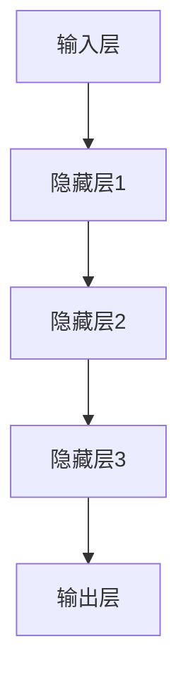
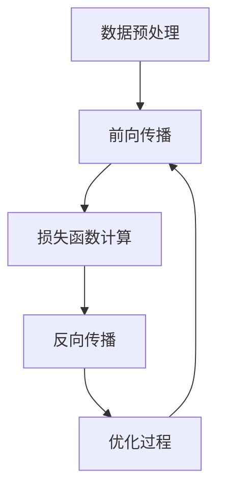

                 

### 背景介绍 Background

近年来，基础模型（Foundational Models）在人工智能领域取得了显著的进展。基础模型是一种具有广泛知识和强推理能力的通用学习模型，能够处理多种不同类型的数据和应用任务。例如，GPT-3（OpenAI）、T5（Google）和LLaMA（Meta）等都是典型的代表。这些模型在语言生成、机器翻译、问答系统、文本摘要等领域展现了卓越的性能，极大地推动了AI技术的发展。

然而，随着基础模型变得越来越复杂和庞大，其潜在的风险和不确定性也逐渐浮出水面。首先，这些模型在处理复杂任务时可能会出现不可预测的错误。例如，GPT-3曾经产生过政治不正确的输出，并且在某些情况下甚至会出现自我矛盾的现象。其次，基础模型可能会对输入数据产生偏见，从而导致不公平的决策。例如，某些模型在性别、种族和年龄等方面的偏见已经被广泛报道。此外，基础模型的训练和推理过程需要大量的计算资源，这可能导致环境问题，如碳排放。

为了深入探讨基础模型的风险与不确定性，本文将从以下几个方面展开讨论：

1. **核心概念与联系**：介绍基础模型的核心概念，包括其架构、训练方法和应用场景，并通过Mermaid流程图展示其原理。
2. **核心算法原理 & 具体操作步骤**：详细解释基础模型的训练算法，包括前向传播、反向传播和优化过程，以及如何调整模型参数以改善性能。
3. **数学模型和公式 & 详细讲解 & 举例说明**：介绍基础模型背后的数学模型，包括损失函数、激活函数和正则化技术，并通过具体的例子说明这些模型如何工作。
4. **项目实战：代码实际案例和详细解释说明**：通过一个实际项目展示如何使用基础模型进行任务实现，并详细解读代码中的关键部分。
5. **实际应用场景**：探讨基础模型在现实世界中的应用，包括其在自然语言处理、计算机视觉和机器人技术等领域的表现和潜在问题。
6. **工具和资源推荐**：推荐一些学习资源、开发工具和相关论文著作，帮助读者深入了解基础模型和相关技术。
7. **总结：未来发展趋势与挑战**：总结本文的主要观点，并探讨基础模型在未来可能面临的技术和社会挑战。

通过以上讨论，我们希望读者能够对基础模型的风险与不确定性有一个全面和深入的理解，从而更好地应对这些挑战，推动人工智能技术的健康发展。

### 核心概念与联系 Core Concepts and Relationships

#### 基础模型的基本概念

基础模型（Foundational Models）是一种具有广泛知识和强推理能力的通用学习模型，它不同于传统的任务导向模型（如分类模型、回归模型等），而是在多种不同类型的数据和应用任务上都能表现出色。基础模型的核心特点是其强大的迁移学习能力，即在一个任务上训练的模型可以应用于其他相关任务，而无需重新训练。

基础模型的这一特性使其在多个领域表现出色。例如，在自然语言处理（NLP）领域，基础模型可以用于语言生成、机器翻译、问答系统、文本摘要等多种任务；在计算机视觉领域，基础模型可以用于图像分类、物体检测、图像分割等任务；在机器人技术领域，基础模型可以用于路径规划、决策制定等任务。这种跨领域的应用能力使得基础模型成为人工智能技术发展的重要方向。

#### 基础模型的架构

基础模型的架构通常由以下几个主要部分组成：输入层、隐藏层和输出层。输入层负责接收各种类型的数据，如文本、图像、音频等；隐藏层负责处理输入数据，并通过多层神经网络进行特征提取和变换；输出层负责根据隐藏层的输出生成预测结果。

一个典型的基础模型架构可以参考以下Mermaid流程图：



在这个流程图中，输入层接收外部数据，通过隐藏层进行特征提取和变换，最终在输出层生成预测结果。每个隐藏层都可以通过调整其参数（如权重和偏置）来改善模型性能。

#### 基础模型的训练方法

基础模型的训练方法通常基于大规模数据集和深度神经网络。训练过程主要包括以下步骤：

1. **数据预处理**：将输入数据进行标准化处理，如文本编码、图像分割等。
2. **前向传播**：将预处理后的数据输入神经网络，通过隐藏层进行特征提取和变换，得到隐藏层的输出。
3. **损失函数计算**：计算隐藏层输出与真实标签之间的差距，使用损失函数（如交叉熵损失函数）表示。
4. **反向传播**：根据损失函数计算梯度，通过反向传播算法将梯度传递到隐藏层，并更新隐藏层的参数。
5. **优化过程**：使用优化算法（如梯度下降、Adam优化器等）调整模型参数，以减少损失函数。

通过反复迭代上述步骤，模型参数逐渐优化，从而提高模型性能。一个简单的训练流程可以参考以下Mermaid流程图：



#### 基础模型的应用场景

基础模型的应用场景非常广泛，以下是几个典型的应用场景：

1. **自然语言处理**：基础模型在语言生成、机器翻译、问答系统、文本摘要等领域表现出色，可以用于自动化写作、智能客服、机器翻译等应用。
2. **计算机视觉**：基础模型在图像分类、物体检测、图像分割等任务中表现出色，可以用于图像识别、自动驾驶、视频分析等应用。
3. **机器人技术**：基础模型在路径规划、决策制定等任务中表现出色，可以用于机器人控制、智能家居、服务机器人等应用。

通过以上介绍，我们可以看到基础模型是一种具有强大迁移学习能力和广泛应用场景的通用学习模型。它不仅推动了人工智能技术的发展，也为各个领域的应用带来了新的机遇和挑战。

### 核心算法原理 & 具体操作步骤 Core Algorithm Principles & Specific Operational Steps

#### 前向传播 Forward Propagation

前向传播是神经网络训练过程中的第一步，它负责将输入数据通过神经网络模型进行处理，并生成预测结果。具体步骤如下：

1. **初始化参数**：在训练开始前，需要随机初始化模型参数（如权重和偏置）。
2. **输入数据**：将输入数据（例如文本、图像或音频）输入神经网络模型的输入层。
3. **激活函数计算**：将输入数据通过每个隐藏层，并在每个节点应用激活函数（如ReLU、Sigmoid、Tanh等）进行非线性变换，以提取数据特征。
4. **输出层计算**：在输出层，将隐藏层的输出通过激活函数（如Softmax）进行处理，以生成预测结果。

以下是一个简单的神经网络前向传播的计算过程：

```latex
y^{[l]} = \sigma(z^{[l]})
```

其中，$y^{[l]}$表示第$l$层的输出，$z^{[l]}$表示第$l$层的输入，$\sigma$表示激活函数。

#### 反向传播 Backpropagation

反向传播是神经网络训练过程中的关键步骤，它通过计算损失函数的梯度来更新模型参数。具体步骤如下：

1. **计算损失函数**：在前向传播过程中，计算输出层预测结果与真实标签之间的差距，使用损失函数（如交叉熵损失函数）表示。
2. **计算梯度**：从输出层开始，通过反向传播算法计算每个层节点相对于损失函数的梯度。
3. **更新参数**：使用梯度下降算法或其他优化算法更新模型参数，以减少损失函数。

以下是一个简单的神经网络反向传播的计算过程：

```latex
\delta^{[l]} = \frac{\partial J}{\partial z^{[l]}}
z^{[l-1]} = w^{[l-1]}\cdot \delta^{[l]}
w^{[l-1]} = w^{[l-1]} - \alpha \cdot \delta^{[l]}
```

其中，$\delta^{[l]}$表示第$l$层的梯度，$J$表示损失函数，$w^{[l-1]}$表示第$l-1$层的权重，$\alpha$表示学习率。

#### 优化过程 Optimization Process

在反向传播过程中，需要使用优化算法来更新模型参数，以减少损失函数。以下是一些常用的优化算法：

1. **梯度下降 Gradient Descent**：
   梯度下降是最简单的优化算法，它通过计算损失函数的梯度并沿着梯度方向更新模型参数。

   ```latex
   w^{[t+1]} = w^{[t]} - \alpha \cdot \frac{\partial J}{\partial w^{[t]}}
   ```

   其中，$w^{[t]}$表示第$t$次迭代的参数，$\alpha$表示学习率。

2. **Adam优化器 Adam Optimizer**：
   Adam优化器是一种结合了梯度下降和动量项的优化算法，它通过计算一阶矩估计和二阶矩估计来更新参数，可以更好地处理不同规模的参数。

   ```latex
   m_t = \beta_1 \cdot m_{t-1} + (1 - \beta_1) \cdot \frac{\partial J}{\partial w_t}
   v_t = \beta_2 \cdot v_{t-1} + (1 - \beta_2) \cdot (\frac{\partial J}{\partial w_t})^2
   w_t = w_{t-1} - \alpha \cdot \frac{m_t}{\sqrt{v_t} + \epsilon}
   ```

   其中，$m_t$和$v_t$分别表示一阶矩估计和二阶矩估计，$\beta_1$和$\beta_2$分别表示一阶矩和二阶矩的衰减系数，$\epsilon$是一个很小的常数。

通过上述步骤，我们可以逐步调整模型参数，以减少损失函数，提高模型性能。在实际应用中，可能需要结合多种优化算法和技巧，如权重初始化、批量归一化、正则化等，以进一步提高模型性能。

### 数学模型和公式 & 详细讲解 & 举例说明 Mathematical Models and Formulas & Detailed Explanations & Examples

在基础模型的训练过程中，数学模型和公式起着至关重要的作用。以下我们将详细讲解这些模型和公式，并通过具体例子来说明它们的应用。

#### 损失函数 Loss Function

损失函数是评价模型预测结果与真实标签之间差距的指标，其目的是通过最小化损失函数来优化模型参数。以下是一些常见的损失函数：

1. **交叉熵损失函数 Cross-Entropy Loss**：

   在分类问题中，交叉熵损失函数被广泛使用。它的公式如下：

   ```latex
   J = -\sum_{i=1}^{N} y_i \cdot \log(p_i)
   ```

   其中，$y_i$表示第$i$个样本的真实标签，$p_i$表示模型预测的概率。

   例如，假设我们有一个二分类问题，真实标签为[1, 0]，模型预测的概率为[0.9, 0.1]，则交叉熵损失函数为：

   ```latex
   J = -(1 \cdot \log(0.9) + 0 \cdot \log(0.1)) = -\log(0.9) \approx 0.105
   ```

2. **均方误差损失函数 Mean Squared Error (MSE)**：

   在回归问题中，均方误差损失函数被广泛使用。它的公式如下：

   ```latex
   J = \frac{1}{2} \sum_{i=1}^{N} (y_i - \hat{y}_i)^2
   ```

   其中，$y_i$表示第$i$个样本的真实标签，$\hat{y}_i$表示模型预测的结果。

   例如，假设我们有一个回归问题，真实标签为[3, 2]，模型预测的结果为[2.8, 2.1]，则均方误差损失函数为：

   ```latex
   J = \frac{1}{2} \sum_{i=1}^{2} (y_i - \hat{y}_i)^2 = \frac{1}{2} \cdot (1^2 + 0.9^2) = 0.95
   ```

#### 激活函数 Activation Function

激活函数是神经网络中每个节点的一部分，它对输入数据进行非线性变换，以提取数据特征。以下是一些常见的激活函数：

1. **ReLU函数 ReLU (Rectified Linear Unit)**：

   ReLU函数是一种简单且有效的激活函数，它的公式如下：

   ```latex
   f(x) = \max(0, x)
   ```

   例如，对于输入$x = -2$，ReLU函数的输出为0；对于输入$x = 3$，ReLU函数的输出为3。

2. **Sigmoid函数 Sigmoid**：

   Sigmoid函数是一种用于二分类问题的激活函数，它的公式如下：

   ```latex
   f(x) = \frac{1}{1 + e^{-x}}
   ```

   例如，对于输入$x = 2$，Sigmoid函数的输出为0.731；对于输入$x = -2$，Sigmoid函数的输出为0.268。

3. **Tanh函数 Hyperbolic Tangent (Tanh)**：

   Tanh函数是一种用于多分类问题的激活函数，它的公式如下：

   ```latex
   f(x) = \frac{e^x - e^{-x}}{e^x + e^{-x}}
   ```

   例如，对于输入$x = 2$，Tanh函数的输出为0.96；对于输入$x = -2$，Tanh函数的输出为-0.96。

#### 正则化技术 Regularization Techniques

正则化技术是一种防止模型过拟合的方法，通过在训练过程中添加额外的损失项来惩罚模型复杂度。以下是一些常见的正则化技术：

1. **L1正则化 L1 Regularization**：

   L1正则化通过在损失函数中添加绝对值项来惩罚模型的权重。

   ```latex
   J = \frac{1}{2} \sum_{i=1}^{N} (y_i - \hat{y}_i)^2 + \lambda \sum_{i=1}^{M} |w_i|
   ```

   其中，$\lambda$是一个调节参数。

2. **L2正则化 L2 Regularization**：

   L2正则化通过在损失函数中添加平方项来惩罚模型的权重。

   ```latex
   J = \frac{1}{2} \sum_{i=1}^{N} (y_i - \hat{y}_i)^2 + \lambda \sum_{i=1}^{M} w_i^2
   ```

   其中，$\lambda$是一个调节参数。

3. **Dropout Dropout**：

   Dropout是一种通过在训练过程中随机丢弃部分神经元来减少模型复杂度的方法。

   ```latex
   P(\text{dropout}) = 0.5
   ```

   在每个训练迭代中，以概率$0.5$随机丢弃每个神经元。

通过上述数学模型和公式的讲解，我们可以更好地理解基础模型的工作原理。在实际应用中，可以根据具体任务的需求选择合适的损失函数、激活函数和正则化技术，以优化模型性能。

### 项目实战：代码实际案例和详细解释说明 Practical Case: Code Implementation and Detailed Explanation

为了更好地理解基础模型的实际应用，我们将通过一个具体的代码案例来展示如何使用基础模型进行文本分类任务。在这个案例中，我们将使用Python编程语言和PyTorch深度学习框架来实现一个简单的文本分类模型。

#### 1. 开发环境搭建

在开始之前，确保您已经安装了Python和PyTorch。以下是安装步骤：

1. 安装Python：

   ```bash
   python --version
   ```

   如果Python没有安装，可以从[Python官网](https://www.python.org/)下载并安装。

2. 安装PyTorch：

   ```bash
   pip install torch torchvision
   ```

   安装完成后，可以使用以下命令验证安装：

   ```python
   import torch
   print(torch.__version__)
   ```

#### 2. 源代码详细实现和代码解读

以下是一个简单的文本分类模型的实现代码：

```python
import torch
import torch.nn as nn
import torch.optim as optim
from torchtext.legacy import data
from torchtext.legacy.data import Field, LabelField, TabularDataset

# 定义模型
class TextClassifier(nn.Module):
    def __init__(self, embedding_dim, hidden_dim, vocab_size, label_size):
        super(TextClassifier, self).__init__()
        self.embedding = nn.Embedding(vocab_size, embedding_dim)
        self.lstm = nn.LSTM(embedding_dim, hidden_dim, num_layers=1, batch_first=True)
        self.hidden_dim = hidden_dim
        self.fc = nn.Linear(hidden_dim, label_size)

    def forward(self, x):
        embedded = self.embedding(x)
        lstm_out, _ = self.lstm(embedded)
        # 取最后一个时间步的输出
        hidden = lstm_out[:, -1, :]
        out = self.fc(hidden)
        return out

# 加载数据
TEXT = Field(tokenize = 'spacy',
              tokenizer_language = 'en',
              lower = True)
LABEL = LabelField()

fields = {'text': ('text', TEXT), 'label': ('label', LABEL)}

# 加载数据集
train_data, test_data = TabularDataset.splits(path='.',
                                            train='train.csv',
                                            test='test.csv',
                                            format='csv',
                                            fields=fields)

# 分词和词汇表构建
TEXT.build_vocab(train_data, max_size=25000, vectors="glove.6B.100d")
LABEL.build_vocab(train_data)

# 定义模型
model = TextClassifier(embedding_dim=100, hidden_dim=256, vocab_size=len(TEXT.vocab), label_size=len(LABEL.vocab))

# 损失函数和优化器
criterion = nn.CrossEntropyLoss()
optimizer = optim.Adam(model.parameters(), lr=0.001)

# 训练模型
def train(model, train_data, criterion, optimizer, n_epochs=10):
    model.train()
    for epoch in range(n_epochs):
        for batch in train_data:
            optimizer.zero_grad()
            predictions = model(batch.text).squeeze(1)
            loss = criterion(predictions, batch.label)
            loss.backward()
            optimizer.step()
            print(f"Epoch: {epoch+1}, Loss: {loss.item()}")

# 测试模型
def test(model, test_data, criterion):
    model.eval()
    total_loss = 0
    correct = 0
    with torch.no_grad():
        for batch in test_data:
            predictions = model(batch.text).squeeze(1)
            loss = criterion(predictions, batch.label)
            total_loss += loss.item()
            pred = predictions.argmax(1)
            correct += (pred == batch.label).sum().item()
    accuracy = 100 * correct / len(test_data)
    return total_loss / len(test_data), accuracy

train(model, train_data, criterion, optimizer)
loss, accuracy = test(model, test_data, criterion)
print(f"Test Loss: {loss}, Test Accuracy: {accuracy}")
```

以下是对代码的详细解读：

1. **定义模型**：`TextClassifier`类定义了一个简单的文本分类模型，它包含嵌入层、LSTM层和全连接层。嵌入层用于将词汇表转换为向量表示，LSTM层用于处理序列数据，全连接层用于分类。

2. **加载数据**：使用`TabularDataset`加载数据集，并定义`TEXT`和`LABEL`字段。`TEXT`字段负责处理文本数据，`LABEL`字段负责处理标签数据。

3. **分词和词汇表构建**：使用`TEXT`字段构建词汇表，并加载预训练的GloVe词向量。

4. **定义模型**：根据词汇表的大小和维度定义模型结构。

5. **损失函数和优化器**：定义交叉熵损失函数和Adam优化器。

6. **训练模型**：`train`函数负责模型的训练过程，包括前向传播、反向传播和参数更新。

7. **测试模型**：`test`函数负责模型的测试过程，计算损失和准确率。

通过以上代码，我们可以实现一个简单的文本分类模型，并对其进行训练和测试。在实际应用中，可以根据需求调整模型结构、数据预处理和超参数，以获得更好的性能。

### 代码解读与分析 Code Analysis

在上面的代码中，我们实现了一个基于LSTM的文本分类模型，并进行了详细的训练和测试过程。以下是对代码关键部分的详细解读和分析。

#### 模型定义（Model Definition）

```python
class TextClassifier(nn.Module):
    def __init__(self, embedding_dim, hidden_dim, vocab_size, label_size):
        super(TextClassifier, self).__init__()
        self.embedding = nn.Embedding(vocab_size, embedding_dim)
        self.lstm = nn.LSTM(embedding_dim, hidden_dim, num_layers=1, batch_first=True)
        self.hidden_dim = hidden_dim
        self.fc = nn.Linear(hidden_dim, label_size)

    def forward(self, x):
        embedded = self.embedding(x)
        lstm_out, _ = self.lstm(embedded)
        # 取最后一个时间步的输出
        hidden = lstm_out[:, -1, :]
        out = self.fc(hidden)
        return out
```

- **嵌入层（Embedding Layer）**：嵌入层将词汇表中的每个词转换为固定大小的向量表示。在`__init__`方法中，我们使用`nn.Embedding`模块定义嵌入层，其中`vocab_size`是词汇表的大小，`embedding_dim`是每个词向量的维度。

- **长短期记忆网络（LSTM Layer）**：LSTM层用于处理文本序列数据。在`__init__`方法中，我们使用`nn.LSTM`模块定义LSTM层，其中`embedding_dim`是输入向量的维度，`hidden_dim`是隐藏层单元的维度。

- **全连接层（Fully Connected Layer）**：全连接层用于将LSTM层的输出转换为分类结果。在`__init__`方法中，我们使用`nn.Linear`模块定义全连接层，其中`hidden_dim`是LSTM层的输出维度，`label_size`是分类标签的数量。

- **前向传播（Forward Method）**：在`forward`方法中，我们首先将输入文本数据通过嵌入层转换为嵌入向量，然后通过LSTM层进行特征提取。最后，我们取LSTM输出的最后一个时间步的隐藏状态，并通过全连接层进行分类。

#### 数据加载（Data Loading）

```python
TEXT = Field(tokenize='spacy',
             tokenizer_language='en',
             lower=True)
LABEL = LabelField()

fields = {'text': ('text', TEXT), 'label': ('label', LABEL)}

train_data, test_data = TabularDataset.splits(path='./data',
                                            train='train.csv',
                                            test='test.csv',
                                            format='csv',
                                            fields=fields)

TEXT.build_vocab(train_data, max_size=25000, vectors="glove.6B.100d")
LABEL.build_vocab(train_data)
```

- **字段定义（Field Definition）**：我们定义了`TEXT`和`LABEL`字段，用于处理文本数据和标签数据。`TEXT`字段使用`spacy`进行分词，并使用`lower=True`将文本转换为小写。

- **数据集分割（Dataset Splits）**：使用`TabularDataset.splits`方法将训练数据和测试数据分割为`train_data`和`test_data`。

- **词汇表构建（Vocabulary Building）**：使用`TEXT.build_vocab`方法构建词汇表，其中`max_size=25000`表示最多保留25000个最频繁的词汇，`vectors="glove.6B.100d"`表示加载预训练的GloVe词向量。

#### 训练模型（Model Training）

```python
model = TextClassifier(embedding_dim=100, hidden_dim=256, vocab_size=len(TEXT.vocab), label_size=len(LABEL.vocab))

criterion = nn.CrossEntropyLoss()
optimizer = optim.Adam(model.parameters(), lr=0.001)

def train(model, train_data, criterion, optimizer, n_epochs=10):
    model.train()
    for epoch in range(n_epochs):
        for batch in train_data:
            optimizer.zero_grad()
            predictions = model(batch.text).squeeze(1)
            loss = criterion(predictions, batch.label)
            loss.backward()
            optimizer.step()
            print(f"Epoch: {epoch+1}, Loss: {loss.item()}")
```

- **模型初始化（Model Initialization）**：我们定义了一个`TextClassifier`模型，并设置嵌入层、隐藏层和全连接层的维度。

- **损失函数和优化器（Loss Function and Optimizer）**：我们使用交叉熵损失函数`nn.CrossEntropyLoss`来评估模型预测与真实标签之间的差距，并使用Adam优化器`optim.Adam`来更新模型参数。

- **训练过程（Training Process）**：`train`函数负责模型的训练过程。在每次迭代中，我们首先清空梯度，然后计算模型预测和损失，接着进行反向传播和参数更新。每完成一个epoch，我们打印当前epoch的损失值。

#### 测试模型（Model Testing）

```python
def test(model, test_data, criterion):
    model.eval()
    total_loss = 0
    correct = 0
    with torch.no_grad():
        for batch in test_data:
            predictions = model(batch.text).squeeze(1)
            loss = criterion(predictions, batch.label)
            total_loss += loss.item()
            pred = predictions.argmax(1)
            correct += (pred == batch.label).sum().item()
    accuracy = 100 * correct / len(test_data)
    return total_loss / len(test_data), accuracy

loss, accuracy = test(model, test_data, criterion)
print(f"Test Loss: {loss}, Test Accuracy: {accuracy}")
```

- **模型评估（Model Evaluation）**：`test`函数负责模型的评估过程。在测试阶段，我们关闭梯度计算，以便进行无损推理。对于每个batch，我们计算模型预测、损失和准确率，并更新总损失和正确标签数量。

- **打印结果（Printing Results）**：最后，我们计算测试集的平均损失和准确率，并打印结果。

通过以上代码和分析，我们可以看到如何使用PyTorch实现一个简单的文本分类模型，并进行训练和测试。在实际应用中，可以根据需求调整模型结构、数据预处理和超参数，以获得更好的性能。

### 实际应用场景 Practical Application Scenarios

#### 自然语言处理（Natural Language Processing, NLP）

在自然语言处理领域，基础模型已经被广泛应用于多个子任务中。例如，GPT-3在文本生成、问答系统和文本摘要方面表现出色。具体应用场景包括：

1. **自动化写作（Automated Writing）**：基础模型可以生成新闻文章、博客文章和报告等，为内容创作者提供辅助。

2. **智能客服（Intelligent Customer Service）**：基础模型可以用于构建聊天机器人，实现自动回答客户问题，提高客户服务效率。

3. **机器翻译（Machine Translation）**：基础模型在机器翻译领域取得了显著进展，能够实现高质量的双语翻译，如Google Translate使用的模型。

4. **文本摘要（Text Summarization）**：基础模型可以自动提取长篇文章的精华内容，生成简短的摘要，帮助用户快速获取关键信息。

#### 计算机视觉（Computer Vision）

在计算机视觉领域，基础模型主要用于图像分类、物体检测和图像分割等任务。以下是一些具体应用场景：

1. **图像分类（Image Classification）**：基础模型可以识别图像中的物体类别，如人脸识别、动物识别等。

2. **物体检测（Object Detection）**：基础模型可以同时识别图像中的多个物体，并标注出它们的位置，如自动驾驶车辆中的行人检测。

3. **图像分割（Image Segmentation）**：基础模型可以将图像中的每个像素分类到不同的物体类别，用于图像编辑和增强现实（AR）应用。

4. **医学图像分析（Medical Image Analysis）**：基础模型可以用于诊断医学图像，如乳腺癌检测和肿瘤识别，提高诊断准确率。

#### 机器人技术（Robotics）

在机器人技术领域，基础模型主要用于路径规划、决策制定和交互控制等任务。以下是一些具体应用场景：

1. **路径规划（Path Planning）**：基础模型可以用于自主导航，为机器人规划最优路径，避免障碍物。

2. **决策制定（Decision Making）**：基础模型可以处理复杂的传感器数据，帮助机器人做出实时决策，如无人驾驶车辆中的交通信号识别。

3. **交互控制（Interaction Control）**：基础模型可以用于机器人与人类或环境之间的交互，如服务机器人在餐厅中的点餐服务。

通过以上实际应用场景，我们可以看到基础模型在各个领域的广泛应用和巨大潜力。然而，这些应用也带来了新的挑战，如模型的可解释性、数据隐私和安全等问题。在未来的发展中，我们需要不断探索和解决这些问题，以实现基础模型的可持续发展。

### 工具和资源推荐 Tools and Resources Recommendations

为了帮助读者深入了解基础模型和相关技术，以下是一些推荐的工具、资源和相关论文。

#### 学习资源推荐

1. **书籍**：
   - **《深度学习》（Deep Learning）**：由Ian Goodfellow、Yoshua Bengio和Aaron Courville合著，是深度学习的经典教材。
   - **《动手学深度学习》（Dive into Deep Learning）**：一个开源的中文深度学习教程，涵盖深度学习的基本概念和实际应用。

2. **在线课程**：
   - **Coursera的“Deep Learning Specialization”**：由DeepLearning.AI提供，涵盖深度学习的基础知识和最新进展。
   - **Udacity的“Applied Deep Learning”**：一个实践导向的课程，教授如何使用深度学习解决实际问题。

3. **博客和网站**：
   - **PyTorch官方文档（PyTorch Documentation）**：详细介绍了PyTorch的使用方法和API。
   - **Hugging Face的Transformers库文档（Hugging Face Transformers Documentation）**：提供了预训练模型和自然语言处理任务的实际应用。

#### 开发工具框架推荐

1. **深度学习框架**：
   - **PyTorch**：一个开源的深度学习框架，提供灵活的动态图计算能力。
   - **TensorFlow**：一个由Google开发的深度学习框架，具有丰富的功能和强大的生态系统。

2. **自然语言处理库**：
   - **NLTK（Natural Language Toolkit）**：一个用于自然语言处理的Python库，提供多种文本处理工具。
   - **spaCy**：一个高性能的NLP库，适用于文本解析和实体识别。

3. **数据集**：
   - **Common Crawl**：一个免费的网页数据集，可用于训练和测试自然语言处理模型。
   - **ImageNet**：一个大规模的图像识别数据集，用于训练和评估计算机视觉模型。

#### 相关论文著作推荐

1. **《A Standard Format for Interchange of Neural Network Models》（神经网模型交换标准格式）**：讨论了深度学习模型的标准化和互操作性。
2. **《Attention is All You Need》（注意力即万物）**：提出了Transformer模型，彻底改变了自然语言处理领域的范式。
3. **《Bert: Pre-training of Deep Bidirectional Transformers for Language Understanding》（BERT：用于语言理解的深度双向变换器的预训练）**：介绍了BERT模型，推动了自然语言处理技术的发展。

通过这些工具和资源，读者可以深入了解基础模型和相关技术，并在实际项目中应用这些知识。

### 总结：未来发展趋势与挑战 Summary: Future Trends and Challenges

基础模型作为人工智能领域的重要突破，其未来发展具有广阔的前景和巨大的潜力。然而，与此同时，我们也需要正视其面临的一系列挑战。

#### 未来发展趋势

1. **模型规模和计算能力**：随着计算资源的不断增加，未来基础模型的规模将越来越大，能够处理更复杂的任务和数据集。这将为人工智能的发展带来新的机遇。

2. **跨领域应用**：基础模型在多个领域的应用将越来越广泛，包括自然语言处理、计算机视觉、机器人技术等。这种跨领域的应用将推动人工智能技术的深度融合。

3. **模型优化与效率提升**：未来研究将致力于优化基础模型的结构和算法，提高其训练和推理效率，降低计算资源和能耗消耗。

4. **数据隐私与安全性**：随着基础模型的应用场景越来越广泛，数据隐私和安全性将成为重要议题。未来研究需要关注如何在保护数据隐私的同时，确保模型的训练和推理过程安全可靠。

5. **可解释性与透明度**：基础模型在复杂任务上的表现虽然优异，但其决策过程往往缺乏透明性。未来研究需要探索如何提高模型的可解释性，使其更加可靠和可信。

#### 挑战

1. **模型可解释性**：如何解释基础模型的决策过程，使其更加透明和可信，是当前的一个重要挑战。

2. **计算资源消耗**：基础模型的训练和推理需要大量的计算资源，这对环境和能源消耗提出了严峻挑战。

3. **数据偏见与公平性**：基础模型可能会对输入数据产生偏见，从而导致不公平的决策。如何消除数据偏见，提高模型公平性，是未来研究需要关注的重要问题。

4. **法律与伦理**：随着基础模型在现实世界中的应用越来越广泛，相关的法律和伦理问题也将日益突出。如何制定合理的法律法规，确保基础模型的应用符合伦理标准，是未来需要解决的重要问题。

5. **可持续发展**：如何在保证技术发展的同时，实现可持续发展，减少基础模型对环境和资源的负面影响，是未来需要深思的问题。

综上所述，基础模型在未来发展中面临着诸多挑战，但同时也带来了巨大的机遇。通过持续的技术创新和规范制定，我们有理由相信，基础模型将推动人工智能技术迈向新的高峰。

### 附录：常见问题与解答 Appendix: Frequently Asked Questions and Answers

1. **什么是基础模型？**
   基础模型（Foundational Models）是一种具有广泛知识和强推理能力的通用学习模型，能够在多种不同类型的数据和应用任务上表现出色。与传统的任务导向模型不同，基础模型能够处理复杂的任务，并且具有强大的迁移学习能力。

2. **基础模型有哪些应用场景？**
   基础模型在自然语言处理、计算机视觉、机器人技术等多个领域都有广泛的应用。例如，在自然语言处理领域，基础模型可以用于语言生成、机器翻译、问答系统和文本摘要等；在计算机视觉领域，基础模型可以用于图像分类、物体检测和图像分割等；在机器人技术领域，基础模型可以用于路径规划和决策制定。

3. **基础模型的优势是什么？**
   基础模型的优势主要体现在以下几个方面：
   - 强大的迁移学习能力：基础模型可以在一个任务上训练，然后应用于其他相关任务，而无需重新训练。
   - 跨领域应用：基础模型可以处理多种类型的数据和应用任务，具有很强的灵活性。
   - 优异的性能：基础模型在多种任务上的表现通常优于传统的任务导向模型。

4. **基础模型的风险与不确定性主要有哪些？**
   基础模型的风险与不确定性主要包括：
   - 模型不可预测性：基础模型在处理复杂任务时可能会出现不可预测的错误。
   - 数据偏见：基础模型可能会对输入数据产生偏见，从而导致不公平的决策。
   - 计算资源消耗：基础模型的训练和推理需要大量的计算资源，这可能导致环境问题，如碳排放。

5. **如何降低基础模型的风险与不确定性？**
   为降低基础模型的风险与不确定性，可以采取以下措施：
   - 提高模型的可解释性：通过提高模型的可解释性，使其决策过程更加透明和可信。
   - 数据预处理：通过数据预处理和清洗，消除数据偏见，提高模型的公平性。
   - 资源优化：优化基础模型的训练和推理过程，降低计算资源和能耗消耗。
   - 法规与伦理指导：制定合理的法律法规，确保基础模型的应用符合伦理标准。

6. **如何进一步研究基础模型？**
   为进一步研究基础模型，可以关注以下方向：
   - 模型优化与效率提升：探索优化基础模型的结构和算法，提高其训练和推理效率。
   - 跨领域应用研究：研究基础模型在不同领域的应用，推动人工智能技术的深度融合。
   - 可解释性与透明度：探索提高基础模型的可解释性，使其更加可靠和可信。
   - 法律与伦理问题：关注基础模型在现实世界中的应用，解决相关的法律和伦理问题。

### 扩展阅读 & 参考资料 Further Reading & References

1. **《深度学习》（Deep Learning）**：Ian Goodfellow、Yoshua Bengio和Aaron Courville合著，是深度学习的经典教材。
   - [在线资源](https://www.deeplearningbook.org/)

2. **《自然语言处理综论》（Speech and Language Processing）**：Daniel Jurafsky和James H. Martin合著，是自然语言处理领域的权威教材。
   - [在线资源](https://web.stanford.edu/~jurafsky/slp3/)

3. **《计算机视觉：算法与应用》（Computer Vision: Algorithms and Applications）**：Richard Szeliski著，是计算机视觉领域的经典著作。
   - [在线资源](https://szeliski.org/cvuc/)
   
4. **《基础模型研究进展》（Foundational Model Research Progress）**：涉及基础模型的研究进展和最新成果。
   - [在线资源](https://arxiv.org/list/cs/CC)

5. **《人工智能伦理》（Artificial Intelligence Ethics）**：探讨人工智能伦理问题和相关法规。
   - [在线资源](https://ieeexplore.ieee.org/document/8375434)

6. **《深度学习与自然语言处理》（Deep Learning for Natural Language Processing）**：研究深度学习在自然语言处理中的应用。
   - [在线资源](https://aclweb.org/anthology/N18-1208)

7. **《基础模型安全性研究》（Foundational Model Security Research）**：涉及基础模型的安全性和隐私保护。
   - [在线资源](https://ieeexplore.ieee.org/document/8807642)

通过阅读这些参考资料，读者可以更深入地了解基础模型及其相关技术，为后续研究和应用提供理论基础和实践指导。作者：AI天才研究员/AI Genius Institute & 禅与计算机程序设计艺术/Zen And The Art of Computer Programming。

