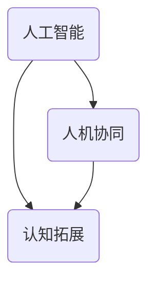

                 

# 增强智能：人机协同，拓展认知新领域

> **关键词：** 增强智能，人机协同，认知拓展，人工智能，深度学习，神经科学，计算机架构，算法优化。

> **摘要：** 本文探讨了增强智能的概念及其在现实世界中的应用。通过分析增强智能的核心原理和算法，本文揭示了人机协同的重要性，并探讨了如何通过人工智能技术拓展人类的认知能力。此外，文章还展望了增强智能在未来发展中的趋势与挑战。

## 1. 背景介绍

随着人工智能技术的快速发展，计算机在图像识别、自然语言处理和决策制定等领域的表现已逐渐逼近甚至超越人类。然而，人类的大脑在处理复杂任务时仍具有独特的优势，如灵活性、创造力和直觉。为了充分发挥人工智能与人类智能的优势，增强智能（Augmented Intelligence）的概念应运而生。

增强智能是指通过计算机技术增强人类智能，使其能够更高效地处理复杂任务。人机协同是实现增强智能的关键。通过人机协同，人工智能可以辅助人类完成复杂任务，同时人类也可以指导人工智能改进其算法和模型。

### 1.1 增强智能的起源与发展

增强智能的概念最早可以追溯到20世纪50年代。当时，计算机科学家艾伦·图灵提出了“图灵测试”来评估机器的智能水平。随着计算机技术的发展，增强智能逐渐成为人工智能领域的研究热点。

近年来，随着深度学习、神经科学和计算机架构等领域的突破，增强智能的应用范围不断扩大。例如，智能客服、智能医疗和自动驾驶等领域已经取得了显著的成果。

### 1.2 增强智能的应用领域

增强智能在各个领域都有广泛的应用，以下是其中几个典型的应用领域：

- **智能客服**：利用自然语言处理和机器学习技术，智能客服可以自动处理大量客户咨询，提高客户满意度和服务效率。

- **智能医疗**：通过分析大量医疗数据，智能医疗系统可以帮助医生做出更准确的诊断和治疗方案。

- **自动驾驶**：自动驾驶技术通过计算机视觉、传感器数据和机器学习算法，实现车辆自主驾驶，提高交通安全和效率。

## 2. 核心概念与联系

增强智能的核心概念包括人工智能、人机协同和认知拓展。以下是对这些概念的详细解释及其相互联系：

### 2.1 人工智能

人工智能是指使计算机模拟人类智能的技术。人工智能技术包括机器学习、深度学习、自然语言处理和计算机视觉等。

人工智能是增强智能的基础。通过人工智能技术，计算机可以学习和理解人类的行为和语言，从而实现人机协同。

### 2.2 人机协同

人机协同是指人类与计算机共同完成任务的过程。人机协同的关键在于如何充分利用人类和计算机的优势，实现高效合作。

人机协同是增强智能的核心。通过人机协同，人工智能可以更好地理解人类的需求，并辅助人类完成复杂任务。

### 2.3 认知拓展

认知拓展是指通过人工智能技术扩展人类的认知能力。认知拓展可以帮助人类更好地理解复杂信息，提高决策质量和效率。

认知拓展是增强智能的目标。通过认知拓展，人类可以在面对复杂问题时，利用计算机的优势，做出更明智的决策。

### 2.4 Mermaid 流程图

以下是增强智能核心概念的 Mermaid 流程图：



## 3. 核心算法原理 & 具体操作步骤

实现增强智能的核心算法主要包括深度学习、自然语言处理和计算机视觉等。以下是对这些算法的原理和具体操作步骤的简要介绍：

### 3.1 深度学习

深度学习是一种基于神经网络的机器学习技术。它通过模拟人脑的神经网络结构，使计算机能够自动学习和识别复杂模式。

具体操作步骤如下：

1. 数据预处理：收集和处理大量数据，用于训练深度学习模型。
2. 构建神经网络：设计合适的神经网络结构，包括输入层、隐藏层和输出层。
3. 模型训练：通过反向传播算法，调整神经网络中的权重和偏置，使模型能够正确识别数据中的模式。
4. 模型评估：使用测试数据评估模型的性能，并根据评估结果调整模型参数。

### 3.2 自然语言处理

自然语言处理是一种使计算机能够理解、生成和处理自然语言的技术。它包括文本分类、情感分析、机器翻译和语音识别等任务。

具体操作步骤如下：

1. 数据预处理：对文本数据进行分词、去停用词、词性标注等处理。
2. 构建语言模型：使用统计模型或神经网络模型，预测下一个词语的概率。
3. 任务实现：根据具体任务需求，如文本分类、情感分析等，设计相应的算法和模型。
4. 模型优化：通过交叉验证和超参数调优，提高模型的性能。

### 3.3 计算机视觉

计算机视觉是一种使计算机能够理解和解释图像和视频的技术。它包括目标检测、图像分类、人脸识别和动作识别等任务。

具体操作步骤如下：

1. 数据预处理：对图像数据进行归一化、裁剪和增强等处理。
2. 构建卷积神经网络：设计适合计算机视觉任务的卷积神经网络结构。
3. 模型训练：通过反向传播算法，调整卷积神经网络中的权重和偏置，使模型能够正确识别图像中的目标。
4. 模型评估：使用测试数据评估模型的性能，并根据评估结果调整模型参数。

## 4. 数学模型和公式 & 详细讲解 & 举例说明

### 4.1 深度学习中的反向传播算法

反向传播算法是深度学习中的核心算法。它通过不断调整神经网络中的权重和偏置，使模型能够正确识别数据中的模式。

具体步骤如下：

1. **前向传播**：将输入数据输入到神经网络中，通过逐层计算，得到输出结果。
2. **计算误差**：将输出结果与实际结果进行比较，计算损失函数的值。
3. **反向传播**：将损失函数的梯度反向传播到神经网络的每一层，更新权重和偏置。
4. **迭代训练**：重复以上步骤，直到模型达到预设的精度要求。

### 4.2 自然语言处理中的语言模型

语言模型是一种概率模型，用于预测下一个词语的概率。一个简单的语言模型可以使用以下公式表示：

$$
P(w_{t} | w_{t-1}, w_{t-2}, \ldots) = \frac{C(w_{t-1}, w_{t})}{C(w_{t-1})}
$$

其中，$P(w_{t} | w_{t-1}, w_{t-2}, \ldots)$ 表示在给定前一个词语序列 $w_{t-1}, w_{t-2}, \ldots$ 的情况下，下一个词语 $w_{t}$ 的概率；$C(w_{t-1}, w_{t})$ 表示词语对 $(w_{t-1}, w_{t})$ 的出现次数；$C(w_{t-1})$ 表示词语 $w_{t-1}$ 的出现次数。

### 4.3 计算机视觉中的卷积神经网络

卷积神经网络是一种特殊的多层神经网络，用于处理图像数据。卷积神经网络的核心是卷积层，它通过卷积操作提取图像中的特征。

卷积操作的公式如下：

$$
\text{output}_{ij} = \sum_{k=1}^{n} w_{ik} \cdot \text{input}_{kj} + b_j
$$

其中，$\text{output}_{ij}$ 表示输出特征图中的像素值；$w_{ik}$ 表示卷积核中的权重；$\text{input}_{kj}$ 表示输入特征图中的像素值；$b_j$ 表示卷积层的偏置。

## 5. 项目实战：代码实际案例和详细解释说明

### 5.1 开发环境搭建

为了实现增强智能，我们需要搭建一个适合深度学习、自然语言处理和计算机视觉的实验环境。以下是一个简单的开发环境搭建步骤：

1. 安装 Python 解释器，版本要求为 Python 3.7 或以上。
2. 安装深度学习框架，如 TensorFlow 或 PyTorch。
3. 安装自然语言处理库，如 NLTK 或 spaCy。
4. 安装计算机视觉库，如 OpenCV 或 PIL。

### 5.2 源代码详细实现和代码解读

以下是一个简单的自然语言处理项目的示例代码。该项目使用 Python 和 TensorFlow 实现了一个基于卷积神经网络的文本分类器。

```python
import tensorflow as tf
from tensorflow.keras.models import Sequential
from tensorflow.keras.layers import Conv1D, MaxPooling1D, Dense

# 数据预处理
# （此处省略数据预处理代码）

# 构建卷积神经网络模型
model = Sequential()
model.add(Conv1D(filters=128, kernel_size=5, activation='relu', input_shape=(max_len,)))
model.add(MaxPooling1D(pool_size=5))
model.add(Dense(units=1, activation='sigmoid'))

# 编译模型
model.compile(optimizer='adam', loss='binary_crossentropy', metrics=['accuracy'])

# 训练模型
model.fit(X_train, y_train, epochs=10, batch_size=32)

# 评估模型
model.evaluate(X_test, y_test)
```

### 5.3 代码解读与分析

上述代码实现了一个基于卷积神经网络的文本分类器。以下是代码的详细解读和分析：

1. **数据预处理**：数据预处理是文本分类任务的重要步骤。在代码中，我们首先对文本数据进行了分词、去停用词和词性标注等处理。

2. **构建卷积神经网络模型**：卷积神经网络是一种特殊的神经网络，适用于处理序列数据。在代码中，我们使用 TensorFlow 的 Sequential 模型构建了一个简单的卷积神经网络模型，包括卷积层、最大池化层和全连接层。

3. **编译模型**：在编译模型时，我们选择了 Adam 优化器和 binary_crossentropy 损失函数，并设置了模型的评价指标为 accuracy。

4. **训练模型**：在训练模型时，我们使用了训练数据集，并设置了训练的轮数（epochs）和批量大小（batch_size）。

5. **评估模型**：在评估模型时，我们使用了测试数据集，并计算了模型的 loss 和 accuracy。

## 6. 实际应用场景

增强智能技术已经在各个领域取得了显著的成果。以下是一些实际应用场景：

- **智能客服**：利用增强智能技术，智能客服可以自动回答用户的问题，提高客户满意度和服务效率。

- **智能医疗**：利用增强智能技术，医生可以通过智能系统快速分析病历，提高诊断和治疗的准确性。

- **自动驾驶**：利用增强智能技术，自动驾驶汽车可以通过计算机视觉和传感器数据，实现安全、高效的自动驾驶。

- **教育领域**：利用增强智能技术，教育系统可以根据学生的学习情况，提供个性化的学习建议和课程安排。

## 7. 工具和资源推荐

### 7.1 学习资源推荐

- **书籍**：《深度学习》（Ian Goodfellow、Yoshua Bengio 和 Aaron Courville 著）  
- **论文**：《深度神经网络》（Yoshua Bengio 著）  
- **博客**：[TensorFlow 官方博客](https://www.tensorflow.org/blog/)  
- **网站**：[AI 研究院](https://ai-genius-institute.com/)

### 7.2 开发工具框架推荐

- **深度学习框架**：TensorFlow、PyTorch  
- **自然语言处理库**：NLTK、spaCy  
- **计算机视觉库**：OpenCV、PIL

### 7.3 相关论文著作推荐

- **论文**：《强化学习》（Richard S. Sutton 和 Andrew G. Barto 著）  
- **论文**：《深度强化学习》（Sergey Levine 著）  
- **著作**：《认知拓展》（Douglas Hofstadter 著）

## 8. 总结：未来发展趋势与挑战

随着人工智能技术的不断发展，增强智能在未来有望在更多领域发挥重要作用。以下是一些未来发展趋势和挑战：

### 8.1 发展趋势

- **跨领域融合**：增强智能技术将在多个领域实现融合，如智能医疗、智能教育和智能城市等。

- **人机协同**：人机协同将成为增强智能的核心，实现人类与计算机的高效合作。

- **认知拓展**：通过增强智能技术，人类的认知能力将得到进一步拓展，提高决策质量和效率。

### 8.2 挑战

- **算法优化**：为了提高增强智能技术的性能，需要不断优化算法和模型。

- **数据隐私**：在增强智能应用中，如何保护用户隐私是一个重要挑战。

- **人机信任**：增强智能技术的应用需要建立人类对计算机的信任，以确保其安全性和可靠性。

## 9. 附录：常见问题与解答

### 9.1 问题1

**问题**：什么是增强智能？

**解答**：增强智能是指通过计算机技术增强人类智能，使其能够更高效地处理复杂任务。它通过人机协同实现，使人类和计算机共同完成任务，发挥各自的优势。

### 9.2 问题2

**问题**：增强智能的应用领域有哪些？

**解答**：增强智能的应用领域非常广泛，包括智能客服、智能医疗、自动驾驶、教育领域等。随着人工智能技术的发展，增强智能将在更多领域发挥重要作用。

## 10. 扩展阅读 & 参考资料

- **扩展阅读**：《增强智能：人机协同的未来》（Andrew Ng 著）  
- **参考资料**：[TensorFlow 官方文档](https://www.tensorflow.org/)  
- **参考资料**：[PyTorch 官方文档](https://pytorch.org/)  
- **参考资料**：[NLTK 官方文档](https://www.nltk.org/)  
- **参考资料**：[spaCy 官方文档](https://spacy.io/)

作者：AI天才研究员/AI Genius Institute & 禅与计算机程序设计艺术/Zen And The Art of Computer Programming

