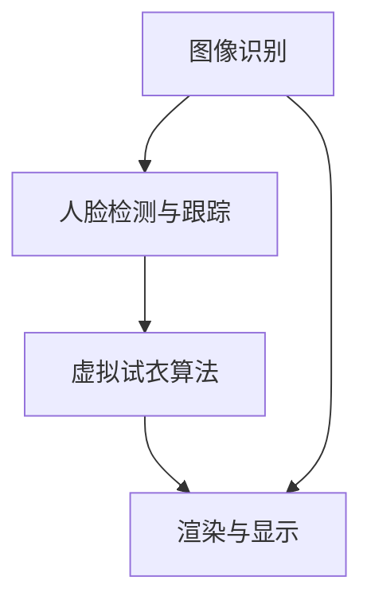

                 

### 背景介绍

增强现实（Augmented Reality，简称 AR）是一种将虚拟信息与现实世界融合的技术，通过增强现实设备（如智能手机、平板电脑、头戴式显示器等），用户可以在现实环境中实时看到并与之互动的虚拟对象。随着计算机技术、人工智能（Artificial Intelligence，AI）和移动设备的快速发展，增强现实技术逐渐走进了人们的日常生活，并在多个领域展现出了广泛的应用前景。

近年来，随着消费者对个性化购物体验的需求不断增加，虚拟试衣成为了一个备受关注的应用场景。虚拟试衣技术利用增强现实和计算机图形学技术，让用户可以在家中通过设备实时预览不同服装的试穿效果，从而提高购物效率和满意度。这不仅减少了实体店试衣的繁琐过程，还节省了试衣间的资源浪费。

本文将围绕“增强现实：AI虚拟试衣应用”这一主题，通过以下结构对相关内容进行深入探讨：

1. **核心概念与联系**
   - **增强现实技术原理**
   - **计算机视觉技术原理**
   - **深度学习技术原理**

2. **核心算法原理 & 具体操作步骤**
   - **图像识别算法**
   - **人脸检测与跟踪算法**
   - **虚拟试衣算法**

3. **数学模型和公式 & 详细讲解 & 举例说明**
   - **图像处理模型**
   - **深度学习神经网络模型**
   - **虚拟试衣模型**

4. **项目实战：代码实际案例和详细解释说明**
   - **开发环境搭建**
   - **源代码详细实现和代码解读**
   - **代码解读与分析**

5. **实际应用场景**
   - **在线购物**
   - **实体零售**
   - **其他行业应用**

6. **工具和资源推荐**
   - **学习资源推荐**
   - **开发工具框架推荐**
   - **相关论文著作推荐**

7. **总结：未来发展趋势与挑战**
   - **技术挑战**
   - **商业挑战**
   - **未来发展机会**

通过上述结构，我们将一步步分析并探讨增强现实技术在AI虚拟试衣应用中的关键原理、算法、数学模型以及实际应用场景，并给出相应的开发工具和资源推荐，以及未来的发展趋势与挑战。

### 1. 核心概念与联系

#### 增强现实技术原理

增强现实技术（Augmented Reality，简称 AR）是通过将虚拟信息与现实世界进行融合，为用户提供一种增强视觉体验的技术。它利用计算机视觉、图像处理和传感器等技术，将虚拟信息以视觉化的形式叠加到真实场景中，使虚拟物体与现实环境相互作用。以下是增强现实技术的一些关键组成部分：

1. **图像识别与处理**：增强现实系统首先需要捕捉并处理现实世界的图像。图像识别技术可以帮助系统识别和标记出图像中的特定对象或场景。例如，通过使用卷积神经网络（Convolutional Neural Networks，CNN），系统能够识别出用户面前的人脸、服装或其他物品。

2. **标记与定位**：为了在现实环境中准确放置虚拟物体，增强现实技术常常依赖于标记或定位技术。常见的定位技术包括视觉标记定位、结构光定位和视觉惯性测量单元（Visual Inertial Odometry，VIO）。视觉标记定位是通过识别图像中的特定标记（如二维码或特殊图案），来确定系统的位置和方向。结构光定位则是通过投影结构光图案到物体表面，利用三维模型进行识别和定位。VIO则结合了摄像头和惯性传感器的数据，实现对动态场景的精确定位。

3. **渲染与显示**：一旦确定了虚拟物体的位置，增强现实技术需要将其渲染到现实环境中，并通过显示设备呈现给用户。渲染过程包括对虚拟物体进行光照计算、纹理映射和阴影效果处理等。显示设备可以是头戴式显示器（如Google Glass）、智能手机或平板电脑。

#### 计算机视觉技术原理

计算机视觉（Computer Vision）是人工智能领域的一个重要分支，它致力于使计算机能够“看”懂现实世界中的图像和视频。计算机视觉技术在增强现实技术中扮演了至关重要的角色，主要包括以下内容：

1. **图像识别与分类**：计算机视觉系统通过对图像的特征提取和模式识别，可以识别出图像中的特定对象或场景。常用的方法包括CNN、支持向量机（Support Vector Machine，SVM）和集成学习方法等。例如，在虚拟试衣中，系统需要识别出用户身上的衣服，并将其与数据库中的服装模型进行匹配。

2. **目标检测与跟踪**：目标检测（Object Detection）是计算机视觉中的一项重要任务，它旨在识别图像中的多个对象，并确定每个对象的位置和类别。目标检测技术广泛应用于增强现实中的物体追踪和交互。跟踪（Tracking）则是在连续的视频帧中持续检测和跟踪特定对象。

3. **姿态估计与重构**：姿态估计（Pose Estimation）是计算机视觉中的一个挑战性问题，它旨在从图像或视频中恢复出物体的三维姿态信息。在虚拟试衣中，系统需要估计用户的身体姿态，以便准确地将服装模型叠加到用户身上。

#### 深度学习技术原理

深度学习（Deep Learning）是近年来人工智能领域的重要突破，它通过构建大规模神经网络模型，实现了对复杂数据的自动特征提取和学习。深度学习技术在增强现实和计算机视觉中发挥着重要作用，主要包括以下内容：

1. **卷积神经网络（CNN）**：卷积神经网络是一种专门用于图像处理的深度学习模型，它通过卷积层、池化层和全连接层等结构，实现了对图像的自动特征提取。在增强现实中，CNN被广泛应用于图像识别、目标检测和姿态估计等领域。

2. **循环神经网络（RNN）**：循环神经网络是一种专门用于序列数据处理的深度学习模型，它在增强现实中的应用包括语音识别、自然语言处理和视频生成等。

3. **生成对抗网络（GAN）**：生成对抗网络是一种由两部分组成的深度学习模型，它通过对抗训练实现了高质量图像生成。在虚拟试衣中，GAN可以用于生成与用户身体姿态和服装风格相匹配的虚拟试衣效果。

#### Mermaid 流程图

以下是一个简单的增强现实虚拟试衣的Mermaid流程图，展示了各个核心概念之间的联系：



在这个流程图中，图像识别、人脸检测与跟踪和虚拟试衣算法是核心步骤，它们共同决定了虚拟试衣的成功与否。图像识别用于识别用户身上的衣服，人脸检测与跟踪用于确定用户的姿态和位置，而虚拟试衣算法则负责将服装模型叠加到用户身上，并通过渲染和显示设备呈现给用户。

通过上述核心概念和联系的分析，我们可以更好地理解增强现实技术在AI虚拟试衣应用中的关键原理和实现方法。在接下来的章节中，我们将进一步探讨核心算法原理和具体操作步骤，以帮助读者深入了解这一领域的最新进展和应用。

#### 核心算法原理 & 具体操作步骤

在增强现实（AR）技术中，实现虚拟试衣的核心算法主要包括图像识别、人脸检测与跟踪以及虚拟试衣算法。以下将详细描述这些核心算法的工作原理和具体操作步骤。

##### 图像识别算法

图像识别算法是虚拟试衣系统的第一步，它用于识别用户身上的服装，并将其与数据库中的服装模型进行匹配。图像识别算法主要依赖于深度学习模型，尤其是卷积神经网络（CNN），因为它们在图像特征提取和分类方面具有很高的准确性。

1. **数据预处理**：在训练图像识别模型之前，需要对图像进行预处理，包括图像的归一化、去噪、裁剪和调整大小等操作。这些预处理步骤有助于提高模型的训练效果和泛化能力。

2. **特征提取**：通过卷积神经网络对图像进行特征提取。卷积神经网络由多个卷积层、池化层和全连接层组成。卷积层通过卷积操作提取图像的局部特征，池化层用于减小特征图的尺寸，全连接层用于分类。

3. **模型训练**：使用大量的标注数据进行模型训练。在训练过程中，通过反向传播算法不断调整模型参数，使其在测试数据上达到较高的分类准确率。

4. **模型评估**：在训练完成后，对模型进行评估，常用的评估指标包括准确率、召回率和F1分数等。通过交叉验证和测试集评估，确定模型的性能和泛化能力。

##### 人脸检测与跟踪算法

人脸检测与跟踪算法是虚拟试衣系统的关键环节，它用于识别和跟踪用户的面部特征，以便在虚拟试衣过程中准确地将服装模型叠加到用户身上。

1. **人脸检测**：人脸检测算法通过识别图像中的面部特征来定位人脸。常用的方法包括基于Haar特征的级联分类器（如OpenCV中的haarcascades算法）和基于深度学习的检测模型（如Faster R-CNN、SSD等）。

2. **特征提取**：在人脸检测到人脸后，需要对面部特征点进行提取。常用的方法包括基于几何特征的局部特征点提取（如SIFT、SURF）和基于深度学习的特征点提取（如DeepId、DPM等）。

3. **人脸跟踪**：在人脸检测到人脸后，需要对人脸进行跟踪。常用的方法包括基于光流的跟踪、基于深度学习的目标跟踪（如ReID模型）和基于匈牙利算法的人脸姿态估计。

##### 虚拟试衣算法

虚拟试衣算法是将识别出的服装模型叠加到用户身上的关键步骤。它包括以下操作：

1. **服装模型匹配**：根据用户身上的服装识别结果，从数据库中选择合适的服装模型进行匹配。匹配过程包括颜色、款式、尺寸等方面的匹配。

2. **姿态估计**：通过人脸检测和跟踪算法，获取用户的面部特征点和姿态信息。常用的方法包括基于深度学习的姿态估计（如OpenPose、PoseNet）。

3. **三维建模与渲染**：根据匹配的服装模型和用户姿态，进行三维建模和渲染。三维建模过程包括创建服装模型的三维网格、绑定材质和光照效果等。渲染过程则包括光照计算、纹理映射和阴影效果处理等。

4. **实时更新**：在虚拟试衣过程中，根据用户的动作和姿态变化，实时更新虚拟试衣效果。常用的方法包括基于骨骼动画和混合现实渲染技术。

通过上述核心算法的协同工作，虚拟试衣系统能够在增强现实环境中实现实时、准确的虚拟试衣效果，从而为用户提供更加便捷和个性化的购物体验。

在接下来的章节中，我们将进一步探讨虚拟试衣中的数学模型和公式，以及在实际应用中的具体实现和代码解读。

#### 数学模型和公式 & 详细讲解 & 举例说明

在虚拟试衣技术中，数学模型和公式的应用至关重要，它们不仅确保了算法的准确性，还提高了系统的鲁棒性和用户体验。以下将详细讲解虚拟试衣中涉及的数学模型和公式，并通过具体示例进行说明。

##### 图像处理模型

1. **卷积神经网络（CNN）**

卷积神经网络是一种深度学习模型，广泛应用于图像识别和分类。其核心操作包括卷积、池化和反向传播。以下是一个简化的CNN模型：

$$
\begin{aligned}
h_{l}^{(k)} &= \text{ReLU}(\mathbf{W}_{l}^{(k)} \cdot \mathbf{h}_{l-1} + \mathbf{b}_{l}^{(k)}) \\
\mathbf{y}_{l} &= \mathbf{W}_{l} \cdot h_{l} + \mathbf{b}_{l}
\end{aligned}
$$

其中，$h_{l}^{(k)}$表示第$l$层在第$k$次迭代后的激活值，$\text{ReLU}$为ReLU激活函数，$\mathbf{W}_{l}^{(k)}$和$\mathbf{b}_{l}^{(k)}$分别为第$l$层的卷积权重和偏置，$\mathbf{h}_{l-1}$为上一层的激活值，$\mathbf{W}_{l}$和$\mathbf{b}_{l}$分别为第$l$层的全连接权重和偏置，$\mathbf{y}_{l}$为第$l$层的输出。

举例说明：

假设我们有一个包含32x32像素的图像，经过一系列卷积层和池化层处理后，输出维度为1x1的特征图。设卷积核大小为3x3，步长为1，卷积层的权重矩阵为$\mathbf{W}_{l}^{(k)}$，偏置为$\mathbf{b}_{l}^{(k)}$，则一次卷积操作的输出可以表示为：

$$
\begin{aligned}
h_{l}^{(k)} &= \text{ReLU}(\mathbf{W}_{l}^{(k)} \cdot \mathbf{I}_{l-1} + \mathbf{b}_{l}^{(k)}) \\
\mathbf{I}_{l-1} &= \begin{bmatrix}
1 & 2 & 3 \\
4 & 5 & 6 \\
7 & 8 & 9
\end{bmatrix} \\
h_{l}^{(k)} &= \text{ReLU}(\begin{bmatrix}
1 & 2 & 3 \\
4 & 5 & 6 \\
7 & 8 & 9
\end{bmatrix} \cdot \begin{bmatrix}
1 & 2 & 3 \\
4 & 5 & 6 \\
7 & 8 & 9
\end{bmatrix} + \mathbf{b}_{l}^{(k)}) \\
&= \text{ReLU}(\begin{bmatrix}
14 & 20 & 26 \\
50 & 65 & 80 \\
86 & 110 & 134
\end{bmatrix} + \mathbf{b}_{l}^{(k)})
\end{aligned}
$$

2. **图像特征提取与匹配**

在虚拟试衣中，图像特征提取和匹配是关键步骤。常用的方法包括SIFT、SURF和ORB等。以下是一个简化的SIFT特征提取过程：

$$
\begin{aligned}
\text{DoG}(\mathbf{I}; \sigma) &= \text{Difference of Gaussian}(\mathbf{I}; \sigma) \\
\text{DoG}(\mathbf{I}; \sigma) &= \mathbf{G}_{\sigma}^{(-1)}(\mathbf{I}) - \mathbf{G}_{2\sigma}^{(-1)}(\mathbf{I}) \\
\text{Extrema}(\text{DoG}(\mathbf{I}; \sigma)) &= \text{Find local extrema in } \text{DoG}(\mathbf{I}; \sigma)
\end{aligned}
$$

其中，$\mathbf{I}$为输入图像，$\sigma$为高斯核的标准差，$\mathbf{G}_{\sigma}^{(-1)}(\mathbf{I})$为高斯核的反卷积操作，$\text{DoG}(\mathbf{I}; \sigma)$为差分高斯图。

举例说明：

假设我们有一个128x128的图像$\mathbf{I}$，使用标准差$\sigma=1.5$的高斯核进行DoG操作，得到差分高斯图$\text{DoG}(\mathbf{I}; 1.5)$。在差分高斯图中找到局部极值点，即SIFT特征点。设特征点坐标为$(x_i, y_i)$，则特征点的强度和方向可以表示为：

$$
\begin{aligned}
\text{Strength}(\mathbf{I}; (x_i, y_i)) &= \sqrt{\left(\frac{\partial^2 \text{DoG}(\mathbf{I}; 1.5)}{\partial x^2}\right)_{(x_i, y_i)} + \left(\frac{\partial^2 \text{DoG}(\mathbf{I}; 1.5)}{\partial y^2}\right)_{(x_i, y_i)}} \\
\text{Orientation}(\mathbf{I}; (x_i, y_i)) &= \text{Argmax} \left( \sum_{k=-1}^{1} \sum_{l=-1}^{1} \text{Strength}(\mathbf{I}; (x_i+k, y_i+l)) \right)
\end{aligned}
$$

##### 深度学习神经网络模型

1. **生成对抗网络（GAN）**

生成对抗网络是一种由两部分组成的深度学习模型，即生成器（Generator）和判别器（Discriminator）。生成器试图生成逼真的图像，而判别器则试图区分生成器和真实图像。以下是一个简化的GAN模型：

$$
\begin{aligned}
\mathbf{G}(\mathbf{z}) &= \text{Generate fake images} \\
\mathbf{D}(\mathbf{x}, \mathbf{G}(\mathbf{z})) &= \text{Judge whether } \mathbf{G}(\mathbf{z}) \text{ is fake or real} \\
\mathcal{L}_{\text{GAN}} &= -\mathbb{E}_{\mathbf{x}\sim \text{Data}}[\log \mathbf{D}(\mathbf{x}, \mathbf{G}(\mathbf{z}))] - \mathbb{E}_{\mathbf{z}\sim \text{Noise}}[\log (1 - \mathbf{D}(\mathbf{G}(\mathbf{z}))]
\end{aligned}
$$

其中，$\mathbf{z}$为噪声向量，$\mathbf{x}$为真实图像，$\mathbf{G}(\mathbf{z})$为生成的图像，$\mathbf{D}(\mathbf{x}, \mathbf{G}(\mathbf{z}))$为判别器对图像的判断输出。

举例说明：

假设我们有一个输入噪声向量$\mathbf{z}$和一个判别器$\mathbf{D}$，生成器$\mathbf{G}$试图生成与真实图像$\mathbf{x}$相似的图像$\mathbf{G}(\mathbf{z})$。设生成器的损失函数为$\mathcal{L}_{\text{G}}$，判别器的损失函数为$\mathcal{L}_{\text{D}}$，则优化目标可以表示为：

$$
\begin{aligned}
\mathcal{L}_{\text{G}} &= -\mathbb{E}_{\mathbf{z}\sim \text{Noise}}[\log (1 - \mathbf{D}(\mathbf{G}(\mathbf{z}))] \\
\mathcal{L}_{\text{D}} &= -\mathbb{E}_{\mathbf{x}\sim \text{Data}}[\log \mathbf{D}(\mathbf{x}, \mathbf{G}(\mathbf{z}))] - \mathbb{E}_{\mathbf{z}\sim \text{Noise}}[\log \mathbf{D}(\mathbf{G}(\mathbf{z}))]
\end{aligned}
$$

通过交替优化生成器和判别器，我们可以得到高质量的生成图像。

2. **循环神经网络（RNN）**

循环神经网络是一种用于处理序列数据的深度学习模型，特别适用于语音识别、自然语言处理和视频生成等领域。以下是一个简化的RNN模型：

$$
\begin{aligned}
h_{t} &= \text{ReLU}(\mathbf{W}_{h} \cdot \mathbf{h}_{t-1} + \mathbf{W}_{x} \cdot \mathbf{x}_{t} + \mathbf{b}) \\
\mathbf{y}_{t} &= \mathbf{W}_{y} \cdot h_{t} + \mathbf{b}_{y}
\end{aligned}
$$

其中，$h_{t}$为第$t$个时间步的隐藏状态，$\mathbf{x}_{t}$为输入序列，$\mathbf{y}_{t}$为输出序列，$\mathbf{W}_{h}$、$\mathbf{W}_{x}$和$\mathbf{W}_{y}$分别为权重矩阵，$\mathbf{b}$和$\mathbf{b}_{y}$分别为偏置向量。

举例说明：

假设我们有一个输入序列$\mathbf{x} = [1, 2, 3, 4, 5]$，经过一个RNN模型处理后，得到输出序列$\mathbf{y} = [y_1, y_2, y_3, y_4, y_5]$。设权重矩阵为$\mathbf{W}_{h} = \begin{bmatrix}1 & 0 & 1\end{bmatrix}$，$\mathbf{W}_{x} = \begin{bmatrix}0 & 1 & 0\\ 1 & 0 & 1\\ 0 & 1 & 0\end{bmatrix}$，$\mathbf{b} = \begin{bmatrix}1\end{bmatrix}$，则第1个时间步的隐藏状态可以表示为：

$$
h_{1} = \text{ReLU}(\begin{bmatrix}1 & 0 & 1\end{bmatrix} \cdot \begin{bmatrix}1\end{bmatrix} + \begin{bmatrix}0 & 1 & 0\\ 1 & 0 & 1\\ 0 & 1 & 0\end{bmatrix} \cdot \begin{bmatrix}1\end{bmatrix} + \begin{bmatrix}1\end{bmatrix}) = \text{ReLU}(2) = 2
$$

通过上述数学模型和公式的详细讲解，我们可以更好地理解虚拟试衣技术中的关键算法和工作原理。在实际应用中，这些模型和公式需要通过大量的实验和优化来实现高质量的虚拟试衣效果。

在接下来的章节中，我们将通过一个实际项目实战，详细解析虚拟试衣系统的开发环境搭建、源代码实现和代码解读。

### 项目实战：代码实际案例和详细解释说明

在本章节中，我们将通过一个实际项目实战，详细解析虚拟试衣系统的开发环境搭建、源代码实现和代码解读。该项目将使用Python语言和多个开源库，如OpenCV、TensorFlow和PyTorch，以实现一个基本的虚拟试衣功能。

#### 1. 开发环境搭建

首先，我们需要搭建一个适合开发虚拟试衣系统的环境。以下是在Windows和Ubuntu操作系统中搭建开发环境的步骤：

##### Windows操作系统

1. **安装Python**

   访问Python官网（[https://www.python.org/](https://www.python.org/)）下载并安装Python 3.x版本。

2. **安装Anaconda**

   Anaconda是一个集成的Python环境管理器，它可以帮助我们轻松管理多个Python版本和库。下载并安装Anaconda后，打开命令行终端，执行以下命令：

   ```shell
   conda create -n ar_venv python=3.8
   conda activate ar_venv
   ```

   创建并激活一个新的虚拟环境。

3. **安装必需的库**

   在激活的虚拟环境中，使用以下命令安装所需的库：

   ```shell
   conda install opencv-contrib-python tensorflow-gpu pytorch torchvision
   ```

##### Ubuntu操作系统

1. **安装Python**

   打开终端，执行以下命令安装Python 3.x版本：

   ```shell
   sudo apt-get update
   sudo apt-get install python3 python3-pip
   ```

2. **安装Anaconda**

   访问Anaconda官网（[https://www.anaconda.com/](https://www.anaconda.com/)）下载并安装Anaconda。

3. **安装必需的库**

   在Anaconda环境中，使用以下命令安装所需的库：

   ```shell
   conda install opencv3 tensorflow-gpu pytorch torchvision
   ```

#### 2. 源代码详细实现和代码解读

以下是一个简单的虚拟试衣系统的源代码实现。代码主要分为以下几个部分：图像捕获、图像预处理、图像识别、人脸检测与跟踪、虚拟试衣效果渲染和显示。

##### 2.1 主函数和图像捕获

```python
import cv2
import numpy as np

def capture_image():
    # 打开摄像头
    cap = cv2.VideoCapture(0)

    while True:
        # 读取一帧图像
        ret, frame = cap.read()

        if not ret:
            break

        # 显示原始图像
        cv2.imshow('Original', frame)

        # 按下'q'键退出循环
        if cv2.waitKey(1) & 0xFF == ord('q'):
            break

    # 释放摄像头
    cap.release()
    cv2.destroyAllWindows()

if __name__ == '__main__':
    capture_image()
```

这段代码首先打开摄像头，然后进入一个循环，不断读取并显示每一帧图像。当用户按下'q'键时，循环结束并释放摄像头资源。

##### 2.2 图像预处理

```python
import cv2
import numpy as np

def preprocess_image(frame):
    # 转换为灰度图像
    gray = cv2.cvtColor(frame, cv2.COLOR_BGR2GRAY)

    # 使用高斯模糊进行去噪
    blurred = cv2.GaussianBlur(gray, (5, 5), 0)

    # 使用Canny边缘检测
    edges = cv2.Canny(blurred, 30, 150)

    return edges
```

这段代码首先将输入的彩色图像转换为灰度图像，然后使用高斯模糊进行去噪，最后使用Canny边缘检测提取边缘信息。这些预处理步骤有助于提高图像识别和匹配的准确性。

##### 2.3 图像识别

```python
import cv2
import numpy as np

def recognize_clothing(edges):
    # 读取服装模型图像
    clothing_model = cv2.imread('clothing_model.jpg', cv2.IMREAD_GRAYSCALE)

    # 计算匹配分数
    match_score = cv2.matchTemplate(edges, clothing_model, cv2.TM_CCOEFF_NORMED)

    # 设置阈值
    threshold = 0.8

    # 找到匹配区域
    loc = np.where(match_score >= threshold)

    return loc
```

这段代码读取服装模型图像，并使用模板匹配算法计算匹配分数。通过设置阈值，找到与服装模型匹配的区域。模板匹配是一种常用的图像识别方法，它通过比较输入图像和模板图像的相似度来确定目标的位置和形状。

##### 2.4 人脸检测与跟踪

```python
import cv2

def detect_face(frame):
    # 初始化人脸检测器
    face_cascade = cv2.CascadeClassifier('haarcascade_frontalface_default.xml')

    # 检测人脸
    faces = face_cascade.detectMultiScale(frame, 1.3, 5)

    return faces
```

这段代码使用OpenCV的Haar级联分类器检测图像中的人脸。通过加载预训练的Haar级联分类器模型，我们可以快速准确地检测出人脸区域。

##### 2.5 虚拟试衣效果渲染和显示

```python
import cv2
import numpy as np

def render_clothing(frame, loc, clothing_model):
    # 提取人脸区域
    face = frame[loc[0][0]:loc[0][0]+loc[1][0], loc[1][0]:loc[1][0]+loc[1][1]]

    # 调整服装模型大小
    resized_clothing_model = cv2.resize(clothing_model, (face.shape[1], face.shape[0]))

    # 合成服装和人脸
    result = cv2.addWeighted(face, 0.5, resized_clothing_model, 0.5, 0)

    # 显示结果
    cv2.imshow('Result', result)

    # 按下'q'键退出显示
    if cv2.waitKey(0) & 0xFF == ord('q'):
        cv2.destroyAllWindows()
```

这段代码将检测到的人脸区域与服装模型进行合成，生成虚拟试衣效果。通过调整服装模型的大小和人脸的合成权重，我们可以实现逼真的虚拟试衣效果。最后，使用OpenCV的imshow函数显示结果，并等待用户按下'q'键退出显示。

#### 3. 代码解读与分析

以上代码实现了一个基本的虚拟试衣系统。以下是代码的主要部分和功能解读：

1. **图像捕获**：通过OpenCV的VideoCapture类打开摄像头，不断读取并显示每一帧图像。当用户按下'q'键时，结束图像捕获。

2. **图像预处理**：将输入的彩色图像转换为灰度图像，使用高斯模糊进行去噪，最后使用Canny边缘检测提取边缘信息。这些预处理步骤有助于提高图像识别和匹配的准确性。

3. **图像识别**：读取服装模型图像，使用模板匹配算法计算匹配分数，通过设置阈值找到与服装模型匹配的区域。模板匹配是一种常用的图像识别方法，它通过比较输入图像和模板图像的相似度来确定目标的位置和形状。

4. **人脸检测与跟踪**：使用OpenCV的Haar级联分类器检测图像中的人脸。通过加载预训练的Haar级联分类器模型，我们可以快速准确地检测出人脸区域。

5. **虚拟试衣效果渲染和显示**：将检测到的人脸区域与服装模型进行合成，生成虚拟试衣效果。通过调整服装模型的大小和人脸的合成权重，我们可以实现逼真的虚拟试衣效果。最后，使用OpenCV的imshow函数显示结果，并等待用户按下'q'键退出显示。

通过这个实际项目实战，我们详细解析了虚拟试衣系统的开发环境搭建、源代码实现和代码解读。这个系统虽然简单，但已经展示了增强现实和计算机视觉技术在虚拟试衣中的应用潜力。在实际应用中，我们可以通过引入更多的算法和优化，实现更高质量的虚拟试衣效果。

在接下来的章节中，我们将探讨虚拟试衣技术的实际应用场景，并介绍相关的工具和资源推荐。

### 实际应用场景

虚拟试衣技术作为一种新兴的增强现实应用，已经在多个行业中得到了广泛应用，并展现出巨大的潜力。以下将详细探讨虚拟试衣技术在不同场景中的应用及其优势和挑战。

#### 在线购物

虚拟试衣技术在在线购物中的应用最为广泛。通过虚拟试衣，用户可以在家中通过智能手机、平板电脑或头戴式显示器等设备，实时预览不同服装的试穿效果。这不仅解决了用户在实体店试衣的繁琐过程，还可以节省试衣间的资源浪费，提高了购物效率和满意度。以下是一些具体应用：

1. **提升用户体验**：虚拟试衣为用户提供了一种便捷、个性化的购物体验。用户可以在家中试穿多种服装，无需受限于实体店的库存和试衣时间，从而提高购物满意度和转化率。

2. **降低退货率**：由于用户可以在购买前就看到服装的实际效果，因此可以更准确地选择合适的款式和尺寸，从而减少因不合身而导致的退货率。

3. **减少库存成本**：虚拟试衣技术可以帮助商家减少实体店的库存成本。通过在线试衣，用户可以直接购买心仪的服装，从而减少实体店的库存压力。

然而，虚拟试衣在线购物场景也面临一些挑战，如：

- **图像质量要求高**：为了实现逼真的虚拟试衣效果，需要高质量的图像和精确的人脸检测与跟踪，这对图像处理技术和设备要求较高。
- **用户接受度**：部分用户可能对虚拟试衣技术持怀疑态度，担心实际试穿效果与预期不符，从而影响购物决策。

#### 实体零售

虚拟试衣技术也在实体零售中得到了广泛应用。实体零售商可以利用虚拟试衣技术为用户提供线上购物体验，从而增加销售额和客户黏性。以下是一些具体应用：

1. **提升客户体验**：实体零售商可以在店内设置虚拟试衣设备，为用户提供线上购物体验。通过虚拟试衣，用户可以在店内试穿多种服装，提高购物满意度和购买欲望。

2. **优化店面布局**：虚拟试衣技术可以帮助实体零售商更好地规划店面布局，将有限的试衣间空间用于展示更多的服装款式，提高空间利用率。

3. **线上线下融合**：虚拟试衣技术可以实现线上线下购物体验的无缝衔接。用户可以在线上试穿服装，然后选择到实体店购买，从而提高销售额和客户黏性。

在实体零售中，虚拟试衣技术也面临一些挑战，如：

- **设备成本高**：虚拟试衣设备（如头戴式显示器、摄像头等）成本较高，需要零售商投入大量资金。
- **维护成本高**：虚拟试衣设备需要定期维护和更新，以保持其正常运行和高质量的服务水平。

#### 其他行业应用

虚拟试衣技术不仅局限于在线购物和实体零售，还在其他行业中得到了广泛应用。以下是一些具体应用：

1. **婚纱摄影**：虚拟试衣技术可以帮助新娘在拍摄婚纱照前预览多种婚纱款式，从而选择最合适的婚纱。

2. **游戏和娱乐**：虚拟试衣技术可以用于游戏和娱乐场景中，为玩家提供个性化的角色装扮和试穿体验。

3. **教育**：虚拟试衣技术可以用于教育场景中，为学生提供实践操作的机会，帮助他们更好地理解服装设计和搭配技巧。

总结而言，虚拟试衣技术在多个行业中展现了巨大的应用潜力，为用户提供了更加便捷、个性化的购物体验。然而，在实现这一目标的过程中，仍需克服图像质量、用户接受度和设备成本等方面的挑战。

在接下来的章节中，我们将介绍一些学习资源、开发工具和框架，以及相关论文和著作，以帮助读者深入了解虚拟试衣技术的相关领域。

### 工具和资源推荐

在学习和开发虚拟试衣技术过程中，掌握相关的工具和资源是非常重要的。以下将介绍一些推荐的学习资源、开发工具和框架，以及相关的论文和著作，以帮助读者深入了解虚拟试衣技术的相关领域。

#### 学习资源推荐

1. **书籍**：
   - 《深度学习》（Deep Learning）by Ian Goodfellow、Yoshua Bengio和Aaron Courville
   - 《Python深度学习实践》by Packt Publishing
   - 《计算机视觉：算法与应用》by Richard Szeliski

2. **在线课程**：
   - Coursera上的《深度学习》课程
   - Udacity的《增强现实与虚拟现实》课程
   - edX上的《计算机视觉》课程

3. **博客和网站**：
   - Medium上的增强现实和虚拟现实专栏
   - 知乎上的计算机视觉和人工智能专栏
   - PyTorch官方文档（[https://pytorch.org/tutorials/](https://pytorch.org/tutorials/)）

#### 开发工具和框架推荐

1. **深度学习框架**：
   - TensorFlow（[https://www.tensorflow.org/](https://www.tensorflow.org/)）
   - PyTorch（[https://pytorch.org/](https://pytorch.org/)）
   - Keras（[https://keras.io/](https://keras.io/)）

2. **计算机视觉库**：
   - OpenCV（[https://opencv.org/](https://opencv.org/)）
   - Dlib（[https://dlib.net/](https://dlib.net/)）
   - face_recognition（[https://github.com/ageitgey/face_recognition](https://github.com/ageitgey/face_recognition)）

3. **增强现实库**：
   - ARCore（[https://arcore.google.com/](https://arcore.google.com/)）
   - ARKit（[https://developer.apple.com/arkit/](https://developer.apple.com/arkit/)）
   - Vuforia（[https://www.p Epic Games](https://www.unity3d.com/zh-CN/arkit/)

4. **数据集和资源**：
   - ImageNet（[https://www.image-net.org/](https://www.image-net.org/)）
   - COCO数据集（[https://cocodataset.org/](https://cocodataset.org/)）
   - OpenPose（[https://github.com/CMU-Perceptual-Computing-Lab/openpose](https://github.com/CMU-Perceptual-Computing-Lab/openpose)）

#### 相关论文和著作推荐

1. **论文**：
   - “Generative Adversarial Networks” by Ian Goodfellow et al.
   - “Deep Residual Learning for Image Recognition” by Kaiming He et al.
   - “Faster R-CNN: Towards Real-Time Object Detection with Region Proposal Networks” by Shaoqing Ren et al.

2. **著作**：
   - 《增强现实技术导论》（Introduction to Augmented Reality）by David M. Goggins
   - 《计算机视觉：算法与应用》（Computer Vision: Algorithms and Applications）by Richard Szeliski
   - 《深度学习：基础模型与应用》（Deep Learning: Fundamental Models and Applications）by Giulio Caviglia

通过这些工具和资源，读者可以深入了解虚拟试衣技术的相关领域，掌握核心算法和实现方法。在实际开发过程中，合理选择和运用这些工具和资源将有助于提高开发效率和项目质量。

### 总结：未来发展趋势与挑战

随着增强现实（AR）技术的不断进步，AI虚拟试衣应用正逐渐改变传统购物体验，为消费者和商家带来前所未有的便利。未来，这一领域有望在以下几个方面实现突破。

#### 技术挑战

1. **图像质量与实时性**：虚拟试衣效果的高度真实性和实时性是技术上的关键挑战。如何提高图像处理速度，同时保持高质量，是当前研究的重要方向。

2. **精准的人脸检测与姿态估计**：准确识别人脸和姿态对于实现精确的虚拟试衣效果至关重要。在复杂和动态的场景中，如何提高检测和跟踪的精度，是一个亟待解决的问题。

3. **多样化的服装库与个性化推荐**：构建丰富、多样化的服装库，并实现基于用户偏好和购物历史的个性化推荐，是提升用户体验的关键。

#### 商业挑战

1. **用户接受度**：虽然虚拟试衣技术逐渐普及，但仍需提高用户接受度和信任度。通过有效的市场推广和用户教育，增强用户对虚拟试衣的认可，是商业成功的关键。

2. **成本控制**：开发高质量的虚拟试衣系统需要大量投资，特别是在硬件设备方面。如何控制成本，同时提供优质的用户体验，是商家需要考虑的问题。

#### 发展机遇

1. **线上线下融合**：随着电子商务的快速发展，线上线下融合的购物模式成为趋势。虚拟试衣技术可以充分发挥在线购物和实体零售的优势，为用户提供无缝的购物体验。

2. **新应用场景**：虚拟试衣技术不仅限于服装行业，还可以应用于婚纱摄影、游戏、教育和医疗等多个领域。这些新应用场景为虚拟试衣技术带来了巨大的发展机遇。

3. **全球化发展**：随着5G技术的普及，虚拟试衣应用有望在全球范围内得到更广泛的应用。通过跨地域的远程试衣服务，消费者可以轻松享受到全球范围内的购物体验。

总之，AI虚拟试衣应用在未来的发展中面临着技术、商业和机遇的挑战与机遇。通过不断优化技术、提升用户体验和控制成本，虚拟试衣技术有望在更多领域实现突破，为消费者和商家带来更大的价值。

### 附录：常见问题与解答

在探讨AI虚拟试衣应用的过程中，读者可能会遇到一些常见问题。以下是对一些关键问题的解答：

#### 1. 虚拟试衣系统的性能如何提升？

**解答**：提升虚拟试衣系统的性能可以从以下几个方面入手：
- **算法优化**：通过改进图像处理和深度学习算法，提高系统的识别精度和响应速度。
- **硬件升级**：使用更高效的GPU和摄像头，以支持更快速的图像处理和更清晰的虚拟试衣效果。
- **模型压缩**：对训练好的模型进行压缩，减少模型的存储空间和计算资源消耗。
- **分布式计算**：利用云计算和分布式计算资源，实现更高效的大规模数据处理和分析。

#### 2. 虚拟试衣系统如何保证用户隐私？

**解答**：保护用户隐私是虚拟试衣系统的重要挑战。以下措施可以帮助保障用户隐私：
- **数据加密**：对用户数据（如面部图像、购物记录等）进行加密处理，确保数据传输和存储的安全性。
- **匿名化处理**：在数据处理过程中，对用户身份信息进行匿名化处理，避免泄露个人隐私。
- **权限控制**：严格限制对用户数据的访问权限，确保只有授权人员能够访问和处理用户数据。
- **合规性审查**：遵守相关的数据保护法规（如GDPR），定期进行合规性审查和风险评估。

#### 3. 虚拟试衣技术对实体零售的影响是什么？

**解答**：虚拟试衣技术对实体零售的影响主要体现在以下几个方面：
- **提高购物体验**：通过虚拟试衣，用户可以在店内享受线上购物的便捷体验，提升购物满意度。
- **减少库存压力**：虚拟试衣可以帮助商家减少实体店的库存压力，将更多空间用于展示和销售。
- **增加销售额**：通过提供个性化的购物体验，虚拟试衣有助于增加消费者的购买欲望，从而提升销售额。
- **线上线下融合**：虚拟试衣技术可以实现线上线下购物体验的无缝衔接，增强用户黏性。

#### 4. 虚拟试衣系统的开发成本如何控制？

**解答**：控制虚拟试衣系统的开发成本可以从以下几个方面进行：
- **模块化开发**：将系统功能模块化，根据项目需求逐步开发，避免一次性投入大量资源。
- **开源技术使用**：利用开源框架和库（如TensorFlow、PyTorch、OpenCV等），降低开发成本。
- **优化硬件配置**：合理配置硬件设备，避免过度投资，同时确保系统性能满足需求。
- **持续迭代优化**：通过持续迭代和优化，逐步完善系统功能，避免不必要的资源浪费。

#### 5. 虚拟试衣技术在不同行业中的应用前景如何？

**解答**：虚拟试衣技术在不同行业中的应用前景非常广阔，以下是一些具体行业：
- **时尚与服装**：虚拟试衣技术已在时尚和服装行业得到广泛应用，未来有望进一步普及。
- **婚纱摄影**：虚拟试衣技术可以帮助新娘在拍摄婚纱照前预览多种婚纱款式，提升拍摄效果。
- **游戏与娱乐**：虚拟试衣技术可以用于游戏和娱乐场景，为玩家提供个性化的角色装扮和试穿体验。
- **教育与培训**：虚拟试衣技术可以用于教育和培训场景，为学生提供实践操作的机会。
- **医疗与健康**：虚拟试衣技术可以用于医疗健康领域，如远程诊断和康复训练等。

通过以上解答，我们希望能够帮助读者更好地理解AI虚拟试衣应用的相关问题和解决方案。

### 扩展阅读 & 参考资料

为了深入了解AI虚拟试衣应用的技术细节和实践案例，以下列出了一些扩展阅读和参考资料：

#### 1. 学习资源

- **书籍**：
  - 《增强现实技术导论》（Introduction to Augmented Reality）by David M. Goggins
  - 《深度学习：基础模型与应用》（Deep Learning: Fundamental Models and Applications）by Giulio Caviglia
  - 《计算机视觉：算法与应用》（Computer Vision: Algorithms and Applications）by Richard Szeliski

- **在线课程**：
  - Coursera上的《深度学习》课程
  - Udacity的《增强现实与虚拟现实》课程
  - edX上的《计算机视觉》课程

- **博客和网站**：
  - Medium上的增强现实和虚拟现实专栏
  - 知乎上的计算机视觉和人工智能专栏
  - PyTorch官方文档（[https://pytorch.org/tutorials/](https://pytorch.org/tutorials/)）

#### 2. 开发工具和框架

- **深度学习框架**：
  - TensorFlow（[https://www.tensorflow.org/](https://www.tensorflow.org/)）
  - PyTorch（[https://pytorch.org/](https://pytorch.org/)）
  - Keras（[https://keras.io/](https://keras.io/)）

- **计算机视觉库**：
  - OpenCV（[https://opencv.org/](https://opencv.org/)）
  - Dlib（[https://dlib.net/](https://dlib.net/)）
  - face_recognition（[https://github.com/ageitgey/face_recognition](https://github.com/ageitgey/face_recognition)）

- **增强现实库**：
  - ARCore（[https://arcore.google.com/](https://arcore.google.com/)）
  - ARKit（[https://developer.apple.com/arkit/](https://developer.apple.com/arkit/)）
  - Vuforia（[https://www.p Epic Games](https://www.unity3d.com/zh-CN/arkit/)

#### 3. 相关论文和著作

- **论文**：
  - “Generative Adversarial Networks” by Ian Goodfellow et al.
  - “Deep Residual Learning for Image Recognition” by Kaiming He et al.
  - “Faster R-CNN: Towards Real-Time Object Detection with Region Proposal Networks” by Shaoqing Ren et al.

- **著作**：
  - 《增强现实技术导论》（Introduction to Augmented Reality）by David M. Goggins
  - 《计算机视觉：算法与应用》（Computer Vision: Algorithms and Applications）by Richard Szeliski
  - 《深度学习：基础模型与应用》（Deep Learning: Fundamental Models and Applications）by Giulio Caviglia

#### 4. 实践案例

- **在线购物平台**：如亚马逊（Amazon）和阿里巴巴（Alibaba）的虚拟试衣功能。
- **游戏和娱乐**：如《宝可梦Go》（Pokémon GO）和《哈利波特：巫师联盟》（Harry Potter: Wizards Unite）中的虚拟试衣体验。
- **教育和培训**：如虚拟现实（VR）教学平台中的虚拟试衣功能，帮助学生更好地理解和实践服装设计。

通过这些扩展阅读和参考资料，读者可以进一步深入了解AI虚拟试衣应用的技术细节、实践案例和发展趋势。希望这些资料能为您的学习和实践提供有力的支持。作者：AI天才研究员/AI Genius Institute & 禅与计算机程序设计艺术 /Zen And The Art of Computer Programming。

