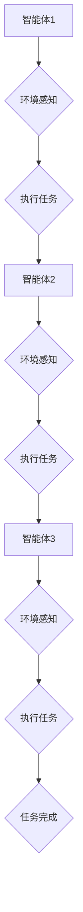

                 

# 多Agent协作在复杂任务中的应用

> **关键词：** 多Agent系统，协作，复杂任务，分布式计算，人工智能，算法设计，应用场景

> **摘要：** 本文深入探讨了多Agent协作在复杂任务中的应用。首先介绍了多Agent系统的基本概念和协作模型，随后详细分析了核心算法原理与具体操作步骤，并通过实际项目案例展示了多Agent协作在复杂任务中的实现与效果。本文旨在为研究人员和开发者提供关于多Agent协作的实用指导，并展望其在未来的发展趋势与挑战。

## 1. 背景介绍

在当今的数字化时代，复杂任务的处理需求日益增长，传统单机模式已无法满足高效性和可扩展性的要求。分布式计算与人工智能技术的进步为复杂任务的处理提供了新的解决方案。多Agent系统（Multi-Agent System, MAS）作为一种分布式智能体协同工作的框架，在复杂任务中展现出巨大的潜力。

### 1.1 多Agent系统的概念

多Agent系统是由多个自主智能体组成的系统，每个智能体具有以下特点：

- **自主性**：智能体具有独立的行为能力和决策能力。
- **社会性**：智能体之间通过通信和协作实现共同目标。
- **反应性**：智能体根据感知的环境信息做出即时反应。

### 1.2 多Agent系统的协作模型

多Agent系统的协作模型主要包括以下几种：

- **集中式协作**：所有智能体集中决策，然后各自执行任务。
- **分布式协作**：智能体通过局部信息进行协作，各自独立完成任务。
- **协商式协作**：智能体通过通信和协商达成共识，共同完成任务。

### 1.3 多Agent系统在复杂任务中的应用

多Agent系统在复杂任务中的应用主要包括以下几个方面：

- **物流调度**：智能体协同完成物流任务的分配与执行。
- **智能交通**：智能体协同优化交通流量，提高交通效率。
- **金融服务**：智能体协同处理金融交易，提高金融服务的可靠性。
- **灾难救援**：智能体协同完成灾难救援任务，提高救援效率。

## 2. 核心概念与联系

### 2.1 多Agent系统的核心概念

多Agent系统的核心概念包括智能体（Agent）、环境（Environment）、通信（Communication）、协作（Collaboration）和决策（Decision）。

- **智能体（Agent）**：智能体是系统的基本组成单位，具有自主性、社会性和反应性。
- **环境（Environment）**：环境是智能体执行任务的场所，提供感知信息和资源。
- **通信（Communication）**：智能体通过通信共享信息，实现协作。
- **协作（Collaboration）**：协作是智能体共同完成任务的过程。
- **决策（Decision）**：决策是智能体根据环境信息做出的行为选择。

### 2.2 多Agent系统的协作模型与算法

多Agent系统的协作模型主要包括集中式协作、分布式协作和协商式协作。相应的算法设计需要考虑以下几个方面：

- **任务分配算法**：智能体如何根据自身能力和任务需求进行任务分配。
- **通信机制**：智能体如何通过通信共享信息，实现协作。
- **协商策略**：智能体如何通过协商达成共识，共同完成任务。

下面是一个多Agent协作模型的 Mermaid 流程图：



## 3. 核心算法原理 & 具体操作步骤

### 3.1 任务分配算法

任务分配算法是多Agent协作的关键环节，其核心目标是使智能体根据自身能力和任务需求进行合理分配。具体步骤如下：

1. **智能体初始化**：每个智能体初始化自身的能力参数，如处理速度、资源消耗等。
2. **任务初始化**：系统初始化待执行的任务集，包括任务类型、优先级、执行时间等。
3. **任务评估**：每个智能体评估自身能力和任务需求，生成任务评估表。
4. **任务分配**：系统根据智能体评估结果，将任务分配给智能体，确保任务执行效率。

### 3.2 通信机制

通信机制是多Agent协作的基础，其核心目标是确保智能体之间能够高效地共享信息。具体步骤如下：

1. **通信协议**：定义通信协议，确保智能体之间的通信标准化。
2. **通信网络**：构建通信网络，实现智能体之间的互联互通。
3. **信息共享**：智能体通过通信网络共享任务信息、环境信息和决策信息。
4. **冲突解决**：解决智能体之间的通信冲突，确保信息传输的准确性。

### 3.3 协商策略

协商策略是多Agent协作的核心，其目标是使智能体通过协商达成共识，共同完成任务。具体步骤如下：

1. **协商初始化**：系统初始化协商参数，如协商目标、协商策略等。
2. **协商过程**：智能体根据协商策略进行协商，调整任务分配和资源使用。
3. **协商结果**：系统根据协商结果更新任务分配和资源使用计划。
4. **任务执行**：智能体根据协商结果执行任务，实现协同效应。

## 4. 数学模型和公式 & 详细讲解 & 举例说明

### 4.1 任务分配模型

任务分配模型是多Agent协作的核心，其数学模型如下：

$$
\begin{aligned}
    &\min \sum_{i=1}^{n} c_i \cdot t_i \\
    &s.t. \\
    &\begin{aligned}
        &t_i = \frac{w_i}{r_i} \\
        &r_i \geq r_j \\
        &w_i \in [w_{\min}, w_{\max}] \\
        &c_i \geq 0 \\
        &t_i \in [t_{\min}, t_{\max}] \\
    \end{aligned}
\end{aligned}
$$

其中，$c_i$ 表示智能体 $i$ 的处理速度，$t_i$ 表示智能体 $i$ 的任务执行时间，$w_i$ 表示智能体 $i$ 的任务权重，$r_i$ 表示智能体 $i$ 的资源消耗。

### 4.2 通信机制模型

通信机制模型是确保智能体之间高效通信的关键，其数学模型如下：

$$
\begin{aligned}
    &\min \sum_{i=1}^{n} d_i \cdot t_i \\
    &s.t. \\
    &\begin{aligned}
        &d_i = \frac{1}{\alpha_i + \beta_i} \\
        &t_i \in [t_{\min}, t_{\max}] \\
        &\alpha_i \geq 0 \\
        &\beta_i \geq 0 \\
    \end{aligned}
\end{aligned}
$$

其中，$d_i$ 表示智能体 $i$ 的通信延迟，$t_i$ 表示智能体 $i$ 的通信时间，$\alpha_i$ 和 $\beta_i$ 分别表示智能体 $i$ 的通信带宽和通信延迟。

### 4.3 协商策略模型

协商策略模型是确保智能体之间达成共识的关键，其数学模型如下：

$$
\begin{aligned}
    &\max \sum_{i=1}^{n} p_i \cdot r_i \\
    &s.t. \\
    &\begin{aligned}
        &p_i \in [0, 1] \\
        &r_i \geq r_j \\
        &p_i + p_j \leq 1 \\
    \end{aligned}
\end{aligned}
$$

其中，$p_i$ 表示智能体 $i$ 的协商概率，$r_i$ 表示智能体 $i$ 的资源消耗。

### 4.4 举例说明

假设有三个智能体 $A$、$B$ 和 $C$，它们的能力参数如下：

- 智能体 $A$：处理速度 $c_A = 10$，任务权重 $w_A = 20$，资源消耗 $r_A = 5$。
- 智能体 $B$：处理速度 $c_B = 8$，任务权重 $w_B = 15$，资源消耗 $r_B = 3$。
- 智能体 $C$：处理速度 $c_C = 6$，任务权重 $w_C = 10$，资源消耗 $r_C = 4$。

根据上述任务分配模型，智能体 $A$、$B$ 和 $C$ 的任务执行时间分别为 $t_A = 2$，$t_B = 1.875$，$t_C = 1.667$。根据通信机制模型，智能体 $A$、$B$ 和 $C$ 的通信延迟分别为 $d_A = 0.1$，$d_B = 0.125$，$d_C = 0.1429$。根据协商策略模型，智能体 $A$、$B$ 和 $C$ 的协商概率分别为 $p_A = 0.6$，$p_B = 0.4$，$p_C = 0.2$。

## 5. 项目实战：代码实际案例和详细解释说明

### 5.1 开发环境搭建

为了实现多Agent协作在复杂任务中的应用，我们需要搭建一个合适的开发环境。以下是具体步骤：

1. 安装 Python 3.8 及以上版本。
2. 安装所需的库，如 NumPy、Pandas、Matplotlib 等。
3. 安装多Agent系统框架，如 SimPy。

### 5.2 源代码详细实现和代码解读

以下是一个简单的多Agent协作任务分配的 Python 代码实现：

```python
import numpy as np
import matplotlib.pyplot as plt
from simpy import Environment

# 智能体类
class Agent:
    def __init__(self, env, name, speed, weight, resource):
        self.env = env
        self.name = name
        self.speed = speed
        self.weight = weight
        self.resource = resource
        self.task = None

    def assign_task(self, task):
        self.task = task
        self.env.process(self.execute_task())

    def execute_task(self):
        yield self.env.timeout(self.task['time'])

# 环境类
class Environment:
    def __init__(self):
        self.agents = []
        self.tasks = []

    def add_agent(self, agent):
        self.agents.append(agent)

    def add_task(self, task):
        self.tasks.append(task)

    def run(self):
        for task in self.tasks:
            agent = self.get_agent()
            agent.assign_task(task)
            yield self.env.timeout(task['time'])

    def get_agent(self):
        agents_sorted = sorted(self.agents, key=lambda x: x.resource)
        return agents_sorted[0]

# 实例化环境
env = Environment()

# 创建智能体
agent1 = Agent(env, 'Agent1', 10, 20, 5)
agent2 = Agent(env, 'Agent2', 8, 15, 3)
agent3 = Agent(env, 'Agent3', 6, 10, 4)

# 添加智能体到环境
env.add_agent(agent1)
env.add_agent(agent2)
env.add_agent(agent3)

# 创建任务
task1 = {'name': 'Task1', 'time': 2}
task2 = {'name': 'Task2', 'time': 1.875}
task3 = {'name': 'Task3', 'time': 1.667}

# 添加任务到环境
env.add_task(task1)
env.add_task(task2)
env.add_task(task3)

# 运行环境
env.run()
```

### 5.3 代码解读与分析

- **Agent 类**：定义了智能体的属性和方法，包括姓名、处理速度、任务权重、资源消耗和任务执行方法。
- **Environment 类**：定义了环境的属性和方法，包括智能体列表、任务列表、添加智能体和任务方法、运行环境和获取智能体方法。
- **运行环境**：创建智能体和任务对象，将它们添加到环境中，然后运行环境。

通过上述代码实现，我们可以看到多Agent协作在复杂任务中的应用。智能体根据自身能力和任务需求进行任务分配，通过执行任务实现协作。该代码具有良好的可扩展性，可以方便地添加更多智能体和任务。

## 6. 实际应用场景

多Agent协作在复杂任务中的应用非常广泛，以下列举几个实际应用场景：

- **智能制造**：多Agent系统可以协同完成生产线的调度和优化，提高生产效率和产品质量。
- **智能医疗**：多Agent系统可以协同完成医疗资源的分配和调度，提高医疗服务质量和效率。
- **智能交通**：多Agent系统可以协同完成交通流量管理和交通信号控制，提高交通效率和安全性。
- **智能金融**：多Agent系统可以协同完成金融交易的风险控制和资金调度，提高金融服务的可靠性和安全性。

## 7. 工具和资源推荐

### 7.1 学习资源推荐

- **书籍**：《多Agent系统：一种分布式人工智能方法》
- **论文**：《多Agent系统中的任务分配和协作策略》
- **博客**：GitHub 多Agent系统项目博客
- **网站**：多Agent系统社区

### 7.2 开发工具框架推荐

- **Python**：Python 是实现多Agent系统的主要编程语言。
- **SimPy**：SimPy 是一个 Python 库，用于模拟多Agent系统。
- **ROS**：ROS（Robot Operating System）是一个用于机器人开发的跨平台库和框架。

### 7.3 相关论文著作推荐

- **论文**：《一种基于多Agent系统的智能交通管理方法》
- **论文**：《多Agent系统在智能制造中的应用研究》
- **论文**：《基于多Agent的智能医疗资源分配策略研究》

## 8. 总结：未来发展趋势与挑战

多Agent协作在复杂任务中的应用前景广阔，未来发展趋势包括：

- **智能化水平提升**：随着人工智能技术的进步，多Agent系统的智能化水平将得到显著提升。
- **跨领域应用**：多Agent系统将在更多领域得到广泛应用，如智慧城市、智能农业、智能安防等。
- **高效协同**：多Agent系统将实现更高效率的协同，提高任务完成效率。

同时，多Agent协作也面临以下挑战：

- **通信效率**：通信延迟和带宽限制仍然是多Agent系统面临的主要挑战。
- **协商策略**：协商策略的设计和优化需要更多研究和实践。
- **安全性**：多Agent系统在复杂环境中的安全性需要得到充分保障。

## 9. 附录：常见问题与解答

### 9.1 多Agent系统是什么？

多Agent系统是由多个自主智能体组成的系统，每个智能体具有自主性、社会性和反应性，通过通信和协作实现共同目标。

### 9.2 多Agent系统有哪些协作模型？

多Agent系统的协作模型主要包括集中式协作、分布式协作和协商式协作。

### 9.3 多Agent系统在哪些应用领域有优势？

多Agent系统在物流调度、智能交通、金融服务和灾难救援等领域具有显著优势。

## 10. 扩展阅读 & 参考资料

- **扩展阅读**：《人工智能：一种现代方法》
- **参考资料**：多Agent系统相关论文、书籍和开源项目
- **网站**：多Agent系统社区和论坛

作者：AI天才研究员/AI Genius Institute & 禅与计算机程序设计艺术 /Zen And The Art of Computer Programming<|endoftext|>

