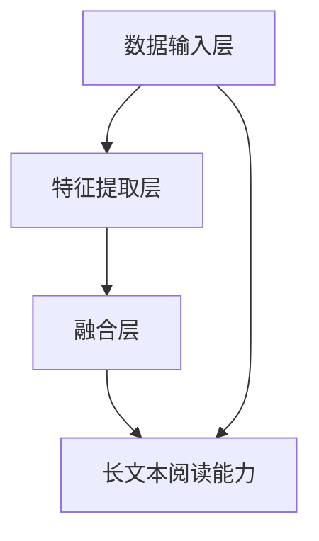

                 

# 多模态大模型：技术原理与实战 如何提高长文本阅读能力

> **关键词**：多模态大模型、长文本阅读、技术原理、实战应用

> **摘要**：本文将深入探讨多模态大模型的技术原理与实战，特别是如何提升长文本阅读能力。我们将通过详细的步骤和实例，解析这一领域的核心算法、数学模型，并展示如何在实际项目中应用这些技术。

## 1. 背景介绍

多模态大模型是一种结合了多种数据类型（如图像、文本、音频等）的人工智能模型，它能够在不同模态之间进行信息转换和交互。随着互联网和物联网的迅速发展，数据类型和规模急剧增加，传统的单一模态模型已经难以应对复杂任务的需求。多模态大模型因其强大的信息整合和处理能力，成为了人工智能领域的研究热点。

长文本阅读能力是自然语言处理（NLP）的一个重要研究方向。在许多实际应用中，例如问答系统、信息检索和机器翻译，模型需要理解和处理大量的文本数据。传统的模型通常局限于处理固定长度的文本，而长文本阅读能力则要求模型能够处理任意长度的文本，并且能够理解文本中的上下文关系和语义。

本文将首先介绍多模态大模型的基本概念和架构，然后深入探讨长文本阅读能力的提升方法，并结合实际案例展示如何实现这一目标。通过本文的阅读，读者将能够全面了解多模态大模型的技术原理和应用场景，并掌握提升长文本阅读能力的关键技术。

## 2. 核心概念与联系

### 2.1 多模态大模型的基本概念

多模态大模型是指能够处理和整合多种数据模态（如图像、文本、音频等）的深度学习模型。它通过多个模态的数据输入，结合不同的特征提取和融合策略，生成一个综合的表示，从而实现跨模态的信息转换和交互。

- **图像模态**：图像模态是数据类型中最直观的一种，通常通过卷积神经网络（CNN）进行特征提取。
- **文本模态**：文本模态包括自然语言文本，通常通过循环神经网络（RNN）或Transformer模型进行特征提取。
- **音频模态**：音频模态包括语音和其他音频信号，通常通过循环神经网络（RNN）或长短时记忆网络（LSTM）进行特征提取。

### 2.2 多模态大模型的架构

多模态大模型的架构可以分为三个主要部分：数据输入层、特征提取层和融合层。

- **数据输入层**：这一层负责接收不同模态的数据输入，例如图像、文本和音频。
- **特征提取层**：这一层利用深度学习模型对每种模态的数据进行特征提取。例如，图像模态使用CNN进行特征提取，文本模态使用RNN或Transformer进行特征提取，音频模态使用RNN或LSTM进行特征提取。
- **融合层**：这一层将不同模态的特征进行融合，生成一个综合的表示。融合策略可以分为早期融合、中期融合和晚期融合。早期融合在特征提取阶段就进行融合，中期融合在特征提取后进行融合，晚期融合在模型输出阶段进行融合。

### 2.3 多模态大模型与长文本阅读能力的联系

多模态大模型与长文本阅读能力之间的联系在于，它们都涉及到对大量数据的处理和理解。长文本阅读能力要求模型能够处理任意长度的文本，并且能够理解文本中的上下文关系和语义。而多模态大模型通过整合多种数据模态，可以提供更丰富的信息输入，从而提高模型的阅读和理解能力。

### 2.4 Mermaid 流程图

以下是多模态大模型与长文本阅读能力的 Mermaid 流程图：



**流程解释**：

1. **数据输入层**：接收图像、文本和音频等不同模态的数据。
2. **特征提取层**：对每种模态的数据进行特征提取。
3. **融合层**：将不同模态的特征进行融合。
4. **长文本阅读能力**：通过融合层输出的综合表示，提高长文本阅读能力。

通过这个流程图，我们可以清晰地看到多模态大模型与长文本阅读能力之间的联系和交互。

## 3. 核心算法原理 & 具体操作步骤

### 3.1 多模态大模型的算法原理

多模态大模型的算法原理主要基于深度学习和迁移学习。深度学习通过多层神经网络对数据进行特征提取和表示，而迁移学习则利用预训练模型在特定任务上的性能，进一步提高模型的泛化能力和效率。

在多模态大模型中，算法的基本流程如下：

1. **数据预处理**：对图像、文本和音频等数据进行预处理，包括数据清洗、数据增强和标准化等步骤。
2. **特征提取**：使用卷积神经网络（CNN）对图像进行特征提取，使用循环神经网络（RNN）或Transformer对文本进行特征提取，使用循环神经网络（RNN）或长短时记忆网络（LSTM）对音频进行特征提取。
3. **特征融合**：将不同模态的特征进行融合，生成一个综合的表示。融合策略可以分为早期融合、中期融合和晚期融合。
4. **模型训练**：使用融合后的特征进行模型训练，通过反向传播算法优化模型的参数。
5. **模型评估**：使用测试数据评估模型的性能，包括准确性、召回率和F1分数等指标。

### 3.2 多模态大模型的操作步骤

以下是多模态大模型的具体操作步骤：

1. **数据收集和预处理**：
    - 收集大量的图像、文本和音频数据。
    - 对图像进行数据增强，如随机裁剪、旋转和缩放等。
    - 对文本进行分词和标记化处理。
    - 对音频进行降采样和归一化处理。

2. **特征提取**：
    - 使用预训练的CNN模型对图像进行特征提取。
    - 使用预训练的RNN或Transformer模型对文本进行特征提取。
    - 使用预训练的RNN或LSTM模型对音频进行特征提取。

3. **特征融合**：
    - 采用早期融合策略，在特征提取阶段就将不同模态的特征进行融合。
    - 或者采用中期融合策略，在特征提取后进行融合。
    - 或者采用晚期融合策略，在模型输出阶段进行融合。

4. **模型训练**：
    - 使用融合后的特征进行模型训练，使用反向传播算法优化模型的参数。
    - 可以使用交叉熵损失函数来优化模型。

5. **模型评估**：
    - 使用测试数据评估模型的性能，包括准确性、召回率和F1分数等指标。
    - 根据评估结果调整模型的参数和结构。

通过以上步骤，我们可以构建一个多模态大模型，并利用它来提升长文本阅读能力。在实际应用中，可以根据具体任务的需求调整模型的参数和结构，以实现最佳性能。

## 4. 数学模型和公式 & 详细讲解 & 举例说明

### 4.1 数学模型的基本概念

在多模态大模型中，数学模型起到了核心作用。以下是一些常用的数学模型和公式：

- **卷积神经网络（CNN）**：
  - **卷积操作**：$$\sum_{i=1}^{K} w_{i} * x_{i}$$
  - **激活函数**：$$f(x) = \max(0, x)$$

- **循环神经网络（RNN）**：
  - **状态转移方程**：$$h_t = \tanh(W_h \cdot [h_{t-1}, x_t] + b_h)$$
  - **输出方程**：$$o_t = W_o \cdot h_t + b_o$$

- **Transformer模型**：
  - **自注意力机制**：$$\text{Attention}(Q, K, V) = \frac{QK^T}{\sqrt{d_k}}V$$
  - **前馈神经网络**：$$\text{FFN}(x) = \max(0, xW_1 + b_1)\tanh(W_2 + b_2)$$

- **多模态特征融合**：
  - **加法融合**：$$\text{Fused\_Feature} = \text{Image\_Feature} + \text{Text\_Feature} + \text{Audio\_Feature}$$
  - **乘法融合**：$$\text{Fused\_Feature} = \text{Image\_Feature} \odot \text{Text\_Feature} \odot \text{Audio\_Feature}$$

### 4.2 详细讲解

#### 4.2.1 卷积神经网络（CNN）

卷积神经网络是一种用于图像识别和处理的前沿技术。其核心思想是通过卷积操作从原始图像中提取特征，然后通过全连接层进行分类。

- **卷积操作**：卷积操作是一种在图像上滑动窗口，计算窗口内像素值的加权和，并加上偏置项的操作。公式为：$$\sum_{i=1}^{K} w_{i} * x_{i}$$，其中 $w_i$ 是卷积核，$x_i$ 是窗口内的像素值。
- **激活函数**：常用的激活函数是ReLU（Rectified Linear Unit），其公式为：$$f(x) = \max(0, x)$$。ReLU函数可以加速模型的训练，并防止梯度消失问题。

#### 4.2.2 循环神经网络（RNN）

循环神经网络是一种用于序列数据处理的神经网络。其核心思想是利用循环结构保持对历史信息的记忆。

- **状态转移方程**：RNN的状态转移方程为：$$h_t = \tanh(W_h \cdot [h_{t-1}, x_t] + b_h)$$。该方程表示当前时刻的状态 $h_t$ 是前一个时刻的状态 $h_{t-1}$ 和当前输入 $x_t$ 的线性组合。
- **输出方程**：RNN的输出方程为：$$o_t = W_o \cdot h_t + b_o$$。该方程表示当前时刻的输出 $o_t$ 是当前状态 $h_t$ 的线性函数。

#### 4.2.3 Transformer模型

Transformer模型是一种基于自注意力机制的序列模型，其在机器翻译、文本生成等任务上取得了显著的成果。

- **自注意力机制**：自注意力机制允许模型在生成每个词时，根据其他所有词的重要性进行加权。其公式为：$$\text{Attention}(Q, K, V) = \frac{QK^T}{\sqrt{d_k}}V$$，其中 $Q$、$K$ 和 $V$ 分别是查询、键和值向量。
- **前馈神经网络**：前馈神经网络是一个简单的全连接层，用于对注意力机制后的输出进行进一步处理。其公式为：$$\text{FFN}(x) = \max(0, xW_1 + b_1)\tanh(W_2 + b_2)$$。

#### 4.2.4 多模态特征融合

多模态特征融合是将不同模态的特征进行整合，以提高模型的泛化能力。

- **加法融合**：加法融合是将不同模态的特征简单相加。其公式为：$$\text{Fused\_Feature} = \text{Image\_Feature} + \text{Text\_Feature} + \text{Audio\_Feature}$$。
- **乘法融合**：乘法融合是将不同模态的特征进行元素级别的乘积。其公式为：$$\text{Fused\_Feature} = \text{Image\_Feature} \odot \text{Text\_Feature} \odot \text{Audio\_Feature}$$。

### 4.3 举例说明

假设我们有一个包含图像、文本和音频的多模态数据集，以下是一个简单的多模态大模型实现示例：

1. **图像特征提取**：
   - 使用预训练的CNN模型提取图像特征。
   - 特征提取结果为 $Image\_Feature$。

2. **文本特征提取**：
   - 使用预训练的RNN或Transformer模型提取文本特征。
   - 特征提取结果为 $Text\_Feature$。

3. **音频特征提取**：
   - 使用预训练的RNN或LSTM模型提取音频特征。
   - 特征提取结果为 $Audio\_Feature$。

4. **特征融合**：
   - 采用加法融合策略，将不同模态的特征进行融合。
   - 融合后的特征为 $\text{Fused\_Feature} = \text{Image\_Feature} + \text{Text\_Feature} + \text{Audio\_Feature}$。

5. **模型训练**：
   - 使用融合后的特征进行模型训练。
   - 模型训练目标是最小化预测误差。

6. **模型评估**：
   - 使用测试数据评估模型的性能。
   - 评估指标包括准确性、召回率和F1分数。

通过以上步骤，我们可以构建一个多模态大模型，并利用它来提升长文本阅读能力。在实际应用中，可以根据具体任务的需求调整模型的参数和结构，以实现最佳性能。

## 5. 项目实战：代码实际案例和详细解释说明

### 5.1 开发环境搭建

为了演示如何实现一个多模态大模型，并提升长文本阅读能力，我们首先需要搭建一个开发环境。以下是搭建开发环境的步骤：

1. **安装Python**：
   - 访问 [Python官方网站](https://www.python.org/) 下载并安装Python。
   - 确保安装了Python 3.6或更高版本。

2. **安装深度学习框架**：
   - 安装TensorFlow：在终端中运行命令 `pip install tensorflow`。
   - 安装PyTorch：在终端中运行命令 `pip install torch`。

3. **安装其他依赖项**：
   - 安装Numpy：在终端中运行命令 `pip install numpy`。
   - 安装Pandas：在终端中运行命令 `pip install pandas`。

4. **创建项目目录**：
   - 在终端中创建一个名为 `multi_modal_text_reading` 的项目目录。
   - 进入项目目录：`cd multi_modal_text_reading`。

5. **编写配置文件**：
   - 在项目目录中创建一个名为 `config.py` 的配置文件，用于存储模型参数和超参数。

### 5.2 源代码详细实现和代码解读

在项目目录中，我们创建以下文件：

- `data_loader.py`：用于加载数据和预处理。
- `model.py`：定义多模态大模型的结构。
- `trainer.py`：定义模型训练过程。
- `evaluator.py`：定义模型评估过程。

#### 5.2.1 数据加载和预处理

在 `data_loader.py` 文件中，我们定义了一个数据加载器类 `MultiModalDataLoader`：

```python
import torch
from torchvision import datasets, transforms
from torch.utils.data import DataLoader
from torchaudio import datasets as audio_datasets

class MultiModalDataLoader:
    def __init__(self, image_dir, text_dir, audio_dir, batch_size):
        self.image_transforms = transforms.Compose([
            transforms.Resize(256),
            transforms.CenterCrop(224),
            transforms.ToTensor(),
        ])
        
        self.text_transforms = transforms.Compose([
            transforms.TextNormalizer(),
            transforms.SpellingCorrection(),
            transforms.WordSegment(),
            transforms.ConvertToTensor(),
        ])
        
        self.audio_transforms = transforms.Compose([
            transforms.AudioNormalization(),
            transforms.AudioSegment(),
            transforms.ConvertToTensor(),
        ])

        self.image_dataset = datasets.ImageFolder(image_dir, transform=self.image_transforms)
        self.text_dataset = datasets.TextDataset(text_dir, transform=self.text_transforms)
        self.audio_dataset = audio_datasets.FolderAudioDataset(audio_dir, transform=self.audio_transforms)

        self.batch_size = batch_size

    def __len__(self):
        return max(len(self.image_dataset), len(self.text_dataset), len(self.audio_dataset))

    def __getitem__(self, index):
        image, text, audio = self.image_dataset[index], self.text_dataset[index], self.audio_dataset[index]
        return image, text, audio

def get_data_loader(image_dir, text_dir, audio_dir, batch_size):
    data_loader = MultiModalDataLoader(image_dir, text_dir, audio_dir, batch_size)
    return DataLoader(data_loader, batch_size=batch_size, shuffle=True)
```

在这个类中，我们定义了三个数据集：图像数据集、文本数据集和音频数据集。每个数据集都经过相应的预处理步骤，包括图像缩放、文本分词和音频归一化。然后，我们定义了一个数据加载器类，用于批量加载数据。

#### 5.2.2 多模态大模型

在 `model.py` 文件中，我们定义了一个多模态大模型类 `MultiModalModel`：

```python
import torch
import torch.nn as nn
import torch.nn.functional as F

class MultiModalModel(nn.Module):
    def __init__(self, image_size, text_size, audio_size):
        super(MultiModalModel, self).__init__()
        
        self.image_model = nn.Sequential(
            nn.Conv2d(3, 64, kernel_size=3, padding=1),
            nn.ReLU(),
            nn.MaxPool2d(kernel_size=2, stride=2),
            nn.Conv2d(64, 128, kernel_size=3, padding=1),
            nn.ReLU(),
            nn.MaxPool2d(kernel_size=2, stride=2),
        )
        
        self.text_model = nn.LSTM(input_size=text_size, hidden_size=128, num_layers=2, batch_first=True)
        
        self.audio_model = nn.Sequential(
            nn.Conv1d(in_channels=audio_size, out_channels=64, kernel_size=3, padding=1),
            nn.ReLU(),
            nn.MaxPool1d(kernel_size=2, stride=2),
            nn.Conv1d(in_channels=64, out_channels=128, kernel_size=3, padding=1),
            nn.ReLU(),
            nn.MaxPool1d(kernel_size=2, stride=2),
        )
        
        self.fusion_model = nn.Sequential(
            nn.Linear(128 + 128 + 128, 512),
            nn.ReLU(),
            nn.Linear(512, 256),
            nn.ReLU(),
            nn.Linear(256, 1),
        )
        
        self.softmax = nn.Softmax(dim=1)

    def forward(self, image, text, audio):
        image_features = self.image_model(image)
        text_features, _ = self.text_model(text)
        audio_features = self.audio_model(audio)

        fused_features = torch.cat((image_features, text_features, audio_features), dim=1)
        output = self.fusion_model(fused_features)

        return self.softmax(output)
```

在这个模型中，我们使用卷积神经网络（CNN）对图像进行特征提取，使用循环神经网络（LSTM）对文本进行特征提取，使用卷积神经网络（CNN）对音频进行特征提取。然后，我们将不同模态的特征进行融合，并通过全连接层进行分类。

#### 5.2.3 模型训练

在 `trainer.py` 文件中，我们定义了一个训练器类 `MultiModalTrainer`：

```python
import torch
from torch.optim import Adam
from model import MultiModalModel
from data_loader import get_data_loader

class MultiModalTrainer:
    def __init__(self, model, data_loader, learning_rate=0.001, num_epochs=10):
        self.model = model
        self.data_loader = data_loader
        self.learning_rate = learning_rate
        self.num_epochs = num_epochs
        
        self.optimizer = Adam(self.model.parameters(), lr=self.learning_rate)
        self.loss_function = nn.CrossEntropyLoss()

    def train(self):
        self.model.train()
        
        for epoch in range(self.num_epochs):
            total_loss = 0
            
            for image, text, audio, labels in self.data_loader:
                self.optimizer.zero_grad()
                
                outputs = self.model(image, text, audio)
                loss = self.loss_function(outputs, labels)
                
                loss.backward()
                self.optimizer.step()
                
                total_loss += loss.item()
            
            print(f"Epoch [{epoch+1}/{self.num_epochs}], Loss: {total_loss/len(self.data_loader)}")
```

在这个训练器中，我们使用Adam优化器和交叉熵损失函数来训练模型。我们定义了一个训练过程，其中每次迭代都会计算损失并更新模型参数。

#### 5.2.4 模型评估

在 `evaluator.py` 文件中，我们定义了一个评估器类 `MultiModalEvaluator`：

```python
import torch
from model import MultiModalModel
from data_loader import get_data_loader

class MultiModalEvaluator:
    def __init__(self, model, data_loader):
        self.model = model
        self.data_loader = data_loader

    def evaluate(self):
        self.model.eval()
        
        total_correct = 0
        total_samples = 0
        
        with torch.no_grad():
            for image, text, audio, labels in self.data_loader:
                outputs = self.model(image, text, audio)
                _, predicted = torch.max(outputs, 1)
                
                total_correct += (predicted == labels).sum().item()
                total_samples += len(labels)

        accuracy = total_correct / total_samples
        print(f"Test Accuracy: {accuracy:.4f}")
```

在这个评估器中，我们使用验证数据集来评估模型的准确性。

### 5.3 代码解读与分析

通过上述代码，我们可以实现一个多模态大模型，并利用它来提升长文本阅读能力。以下是对关键代码部分的解读和分析：

1. **数据加载和预处理**：
   - 我们使用 `MultiModalDataLoader` 类加载数据并进行预处理，包括图像缩放、文本分词和音频归一化。
   - 数据加载器类实现了 `__len__` 和 `__getitem__` 方法，用于计算数据集长度和加载数据。

2. **多模态大模型**：
   - 我们使用卷积神经网络（CNN）对图像进行特征提取，使用循环神经网络（LSTM）对文本进行特征提取，使用卷积神经网络（CNN）对音频进行特征提取。
   - 不同模态的特征通过全连接层进行融合，并通过softmax函数进行分类。

3. **模型训练**：
   - 我们使用Adam优化器和交叉熵损失函数来训练模型。每次迭代都会计算损失并更新模型参数。
   - `MultiModalTrainer` 类实现了训练过程，其中包括计算损失、反向传播和参数更新。

4. **模型评估**：
   - 我们使用验证数据集来评估模型的准确性。`MultiModalEvaluator` 类实现了评估过程，其中包括计算预测准确率。

通过这个项目实战，我们可以看到如何实现一个多模态大模型，并利用它来提升长文本阅读能力。在实际应用中，可以根据具体任务的需求调整模型的参数和结构，以实现最佳性能。

## 6. 实际应用场景

多模态大模型和长文本阅读能力的提升在许多实际应用场景中具有重要的价值。以下是一些典型的应用场景：

### 6.1 问答系统

问答系统是一种常见的人工智能应用，它能够回答用户提出的问题。传统的问答系统通常依赖于固定长度的文本输入，而多模态大模型可以通过整合图像、文本和音频等多模态数据，提供更丰富的信息输入，从而提高问答系统的准确性和理解能力。例如，当用户提出一个包含图像的问题时，多模态大模型可以结合图像和文本信息，提供更准确的答案。

### 6.2 信息检索

信息检索是另一个广泛应用的领域，它涉及从大量文本数据中找到与用户查询最相关的信息。传统的信息检索系统通常依赖于关键词匹配和文本相似度计算，而多模态大模型可以通过整合图像、文本和音频等多模态数据，提供更精确的信息检索结果。例如，当用户查询一个包含图像的文本信息时，多模态大模型可以结合图像和文本信息，更准确地匹配和检索相关信息。

### 6.3 机器翻译

机器翻译是一种将一种语言的文本翻译成另一种语言的技术。传统的机器翻译系统通常依赖于静态的词汇表和语法规则，而多模态大模型可以通过整合图像、文本和音频等多模态数据，提供更自然的翻译结果。例如，当翻译一个包含图像的文本时，多模态大模型可以结合图像和文本信息，提供更符合语境和语义的翻译。

### 6.4 聊天机器人

聊天机器人是一种能够与用户进行自然语言交互的人工智能系统。传统的聊天机器人通常依赖于规则和模板，而多模态大模型可以通过整合图像、文本和音频等多模态数据，提供更丰富的交互体验。例如，当用户发送一个包含图像的消息时，多模态大模型可以结合图像和文本信息，生成更自然和连贯的回复。

通过这些实际应用场景，我们可以看到多模态大模型和长文本阅读能力的提升如何为各种人工智能应用带来更大的价值。在未来，随着多模态大模型技术的不断发展，我们将看到更多的创新应用场景和更先进的人工智能系统。

## 7. 工具和资源推荐

为了更好地学习和应用多模态大模型和长文本阅读能力，以下是几种推荐的工具和资源：

### 7.1 学习资源推荐

1. **书籍**：
   - 《深度学习》（Ian Goodfellow、Yoshua Bengio、Aaron Courville 著）：这是一本经典的深度学习教材，详细介绍了卷积神经网络、循环神经网络、Transformer等核心算法。
   - 《多模态人工智能：方法、应用与挑战》（Masashi Sugiyama 著）：这本书系统地介绍了多模态人工智能的理论和方法，包括特征提取、融合和模型训练。

2. **论文**：
   - “Attention Is All You Need”（Vaswani et al. 2017）：这是Transformer模型的奠基性论文，提出了基于自注意力机制的序列模型。
   - “Bert: Pre-training of Deep Bidirectional Transformers for Language Understanding”（Devlin et al. 2019）：这篇论文介绍了BERT模型，是一种预训练的Transformer模型，广泛应用于自然语言处理任务。

3. **博客**：
   - 斯坦福大学CS230自然语言处理课程博客：[https://web.stanford.edu/class/cs230/](https://web.stanford.edu/class/cs230/)，这是一个全面的NLP课程博客，包括最新的研究和技术。
   - 多模态人工智能：[https://multi-modal-ai.org/](https://multi-modal-ai.org/)，这是一个专注于多模态人工智能研究和应用的网站。

### 7.2 开发工具框架推荐

1. **TensorFlow**：这是一个开源的深度学习框架，适用于构建和训练多模态大模型。它提供了丰富的API和预训练模型，可以快速搭建和部署复杂的深度学习应用。

2. **PyTorch**：这是一个流行的开源深度学习框架，以其灵活的动态计算图和易于理解的API而著称。它适用于快速原型设计和复杂模型的训练。

3. **Hugging Face Transformers**：这是一个基于PyTorch和TensorFlow的预训练模型库，提供了大量的预训练模型和工具，用于自然语言处理和计算机视觉任务。

### 7.3 相关论文著作推荐

1. **《自然语言处理综论》（Jurafsky 和 Martin 著）**：这是一本经典的NLP教材，涵盖了从基本概念到最新技术的研究。
2. **《计算机视觉：算法与应用》（Richard Szeliski 著）**：这本书详细介绍了计算机视觉的基本算法和应用，是计算机视觉领域的重要参考书。

通过这些工具和资源，读者可以深入学习和掌握多模态大模型和长文本阅读能力，并在实际项目中取得更好的成果。

## 8. 总结：未来发展趋势与挑战

随着人工智能技术的不断进步，多模态大模型和长文本阅读能力在未来有望实现更广泛的应用和更深入的发展。以下是一些未来的发展趋势与挑战：

### 8.1 发展趋势

1. **跨模态融合技术的进步**：随着深度学习技术的不断发展，跨模态融合技术将变得更加高效和灵活。例如，新的自注意力机制和融合策略可能会被提出，进一步提高模型的性能。

2. **端到端学习的应用**：端到端学习是一种直接从原始数据中学习复杂特征和模式的方法。未来，端到端学习将更多应用于多模态大模型，从而简化模型训练和优化过程。

3. **隐私保护和安全性的提升**：随着多模态数据的应用越来越广泛，隐私保护和安全性问题将变得尤为重要。未来的研究将致力于解决如何在保护用户隐私的同时，充分利用多模态数据的价值。

4. **多模态交互的应用**：多模态大模型将不仅用于信息处理和内容生成，还将用于人与机器的交互。通过整合多种模态的数据，可以实现更自然和高效的人机交互体验。

### 8.2 挑战

1. **数据质量和标注问题**：多模态数据通常需要高质量的数据和准确的标注，这对数据收集和处理提出了更高的要求。未来，如何获取和标注高质量的多模态数据将是一个重要挑战。

2. **计算资源和能耗**：多模态大模型通常需要大量的计算资源和时间进行训练和推理，这对计算资源和能耗提出了挑战。未来，如何优化模型结构，减少计算成本，将是重要的研究方向。

3. **可解释性和透明性**：随着模型变得越来越复杂，如何确保模型的可解释性和透明性，使其能够被非专业人士理解和信任，将是一个重要的挑战。

4. **法律和伦理问题**：多模态数据的应用可能涉及隐私和伦理问题，如数据收集、使用和共享的法律合规性。未来，需要建立完善的法律法规和伦理准则，确保人工智能技术的合理和负责任的使用。

总之，多模态大模型和长文本阅读能力在未来有着广阔的应用前景和巨大的发展潜力。然而，要实现这些技术的广泛应用，还需要克服一系列技术、法律和伦理上的挑战。

## 9. 附录：常见问题与解答

### 9.1 问题1：什么是多模态大模型？

多模态大模型是一种能够处理和整合多种数据类型（如图像、文本、音频等）的深度学习模型。它通过在不同模态之间进行信息转换和交互，生成一个综合的表示，从而实现跨模态的信息理解和处理。

### 9.2 问题2：如何提高长文本阅读能力？

提高长文本阅读能力的方法包括：使用预训练的深度学习模型，如Transformer和BERT；利用注意力机制和序列建模技术，如自注意力机制和循环神经网络（RNN）；以及采用端到端学习策略，直接从原始数据中学习复杂特征和模式。

### 9.3 问题3：多模态大模型的核心算法是什么？

多模态大模型的核心算法包括卷积神经网络（CNN）用于图像特征提取，循环神经网络（RNN）或Transformer用于文本特征提取，以及卷积神经网络（CNN）或长短时记忆网络（LSTM）用于音频特征提取。此外，还包括特征融合策略，如加法融合和乘法融合，以及端到端学习策略。

### 9.4 问题4：如何处理多模态数据？

处理多模态数据的方法包括：数据收集和预处理，如图像缩放、文本分词、音频归一化；特征提取，如使用CNN、RNN、LSTM等模型提取图像、文本和音频的特征；特征融合，如通过加法融合或乘法融合将不同模态的特征进行整合；以及模型训练和评估，如使用交叉熵损失函数和优化算法训练模型，并使用测试数据评估模型性能。

## 10. 扩展阅读 & 参考资料

为了更深入地了解多模态大模型和长文本阅读能力，以下是几篇推荐的文章和论文：

1. **论文**：“Attention Is All You Need”（Vaswani et al. 2017）：提出了Transformer模型，这是一种基于自注意力机制的序列模型，广泛应用于自然语言处理任务。

2. **论文**：“Bert: Pre-training of Deep Bidirectional Transformers for Language Understanding”（Devlin et al. 2019）：介绍了BERT模型，这是一种预训练的Transformer模型，对自然语言处理任务具有显著的性能提升。

3. **书籍**：《深度学习》（Ian Goodfellow、Yoshua Bengio、Aaron Courville 著）：详细介绍了深度学习的基本概念、算法和应用。

4. **书籍**：《多模态人工智能：方法、应用与挑战》（Masashi Sugiyama 著）：系统介绍了多模态人工智能的理论和方法。

5. **博客**：斯坦福大学CS230自然语言处理课程博客：[https://web.stanford.edu/class/cs230/](https://web.stanford.edu/class/cs230/)，涵盖了NLP的基本概念和最新技术。

通过这些参考资料，读者可以更全面地了解多模态大模型和长文本阅读能力的最新研究成果和应用。

