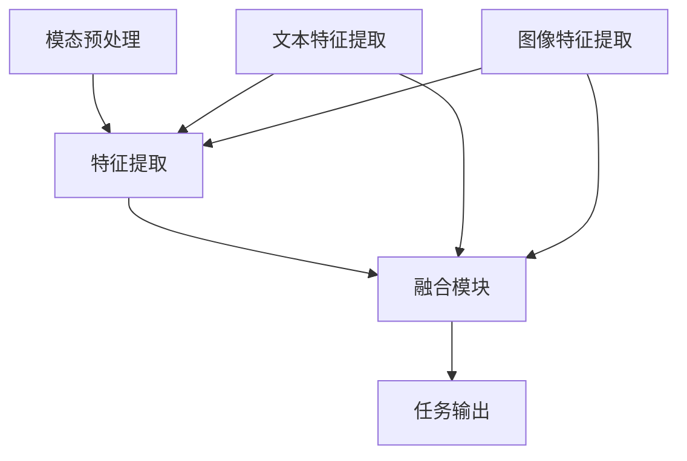

                 

# 多模态大模型：整合视觉与文本信息的前沿科技

> **关键词**：多模态大模型、视觉与文本整合、人工智能、深度学习、神经网络、自然语言处理

> **摘要**：本文深入探讨多模态大模型的前沿科技，从背景介绍、核心概念、算法原理、数学模型、实际应用等多个方面，系统性地分析了多模态大模型如何整合视觉与文本信息，以实现更高效、智能的人工智能应用。文章旨在为读者提供全面的技术理解与实践指导。

## 1. 背景介绍

随着人工智能（AI）技术的飞速发展，计算机视觉（CV）和自然语言处理（NLP）等领域取得了显著进展。然而，传统的单一模态模型往往难以在复杂任务中达到最佳性能。为了解决这个问题，研究者们开始探索将视觉信息与文本信息相结合的多模态大模型。

多模态大模型旨在通过融合不同模态的信息，提升模型在诸如图像识别、文本生成、问答系统等任务中的表现。早期的多模态研究主要关注于如何将视觉和文本特征进行有效结合，而现代的多模态大模型则更加注重大规模数据集的利用和深度学习技术的应用。

多模态大模型的兴起，为人工智能的发展带来了新的机遇。首先，它能够更好地理解复杂信息，提高任务的准确性和鲁棒性。其次，通过跨模态的知识共享，模型可以学习到更多有价值的特征，从而提升泛化能力。此外，多模态大模型在医疗诊断、智能监控、人机交互等实际应用场景中具有巨大的潜力。

## 2. 核心概念与联系

### 2.1 多模态大模型的概念

多模态大模型是指能够同时处理和融合多种模态（如文本、图像、声音等）信息的人工智能模型。它通常由两个或多个独立的模态处理模块组成，每个模块负责提取和处理特定模态的信息。这些模块通过共享神经网络结构或联合训练的方式进行信息融合，从而实现多模态特征的有效结合。

### 2.2 视觉与文本信息融合的机制

多模态大模型中的视觉与文本信息融合机制主要包括以下几种：

1. **特征级融合**：在特征提取阶段，将不同模态的特征向量进行拼接或平均，形成一个多维的特征向量，然后输入到共享的神经网络中进行处理。

2. **表示级融合**：在特征表示层面，通过共享编码器或联合训练的方式，将不同模态的特征表示进行整合，形成统一的特征表示。

3. **交互级融合**：通过设计特殊的神经网络结构或训练策略，使不同模态的特征在信息交互过程中实现深度融合。

### 2.3 多模态大模型的架构

多模态大模型的架构通常可以分为以下几部分：

1. **模态预处理模块**：负责对输入数据进行预处理，如图像去噪、文本分词等。

2. **特征提取模块**：利用深度学习技术，从预处理后的数据中提取特征。

3. **融合模块**：将不同模态的特征进行融合，形成统一的特征表示。

4. **任务输出模块**：根据具体任务需求，对融合后的特征进行分类、回归或其他操作。

### 2.4 Mermaid 流程图

以下是多模态大模型的核心概念和架构的 Mermaid 流程图：



## 3. 核心算法原理 & 具体操作步骤

### 3.1 算法原理

多模态大模型的算法原理主要基于深度学习技术，通过多层次神经网络结构实现对多种模态信息的处理和融合。以下是多模态大模型的核心算法原理：

1. **卷积神经网络（CNN）**：用于图像特征提取，通过卷积层、池化层等结构，提取图像的局部特征。

2. **循环神经网络（RNN）**：用于文本特征提取，通过循环结构，捕捉文本序列中的时序特征。

3. **Transformer 模型**：近年来在自然语言处理领域取得了显著成果，通过自注意力机制，实现对文本序列的全局特征表示。

4. **特征融合策略**：将不同模态的特征进行拼接、平均或通过共享编码器进行融合。

### 3.2 操作步骤

以下是多模态大模型的操作步骤：

1. **数据预处理**：对图像和文本数据进行预处理，如图像去噪、文本分词等。

2. **特征提取**：利用 CNN 对图像进行特征提取，利用 RNN 或 Transformer 对文本进行特征提取。

3. **特征融合**：将图像和文本特征进行融合，形成统一的多模态特征向量。

4. **模型训练**：使用大规模多模态数据集，通过反向传播算法，训练多模态大模型。

5. **模型评估**：在验证集上评估模型性能，调整超参数，优化模型结构。

6. **模型应用**：将训练好的模型应用于实际任务，如图像分类、文本生成等。

## 4. 数学模型和公式 & 详细讲解 & 举例说明

### 4.1 数学模型

多模态大模型的数学模型主要基于深度学习技术，包括神经网络架构、损失函数、优化算法等。以下是多模态大模型的关键数学模型：

1. **神经网络架构**：

   - 卷积神经网络（CNN）：
     \[
     f_{CNN}(x) = \sigma(W_{CNN} \cdot x + b_{CNN})
     \]
     其中，\(x\) 为输入图像，\(W_{CNN}\) 为卷积权重，\(b_{CNN}\) 为偏置，\(\sigma\) 为激活函数。

   - 循环神经网络（RNN）：
     \[
     h_t = \sigma(W_h \cdot [h_{t-1}, x_t] + b_h)
     \]
     其中，\(h_t\) 为第 \(t\) 个隐藏状态，\(x_t\) 为第 \(t\) 个输入文本，\(W_h\) 为权重，\(b_h\) 为偏置，\(\sigma\) 为激活函数。

   - Transformer 模型：
     \[
     \text{MultiHeadAttention}(Q, K, V) = \text{softmax}\left(\frac{QK^T}{\sqrt{d_k}}\right)V
     \]
     其中，\(Q, K, V\) 分别为查询、键、值向量，\(d_k\) 为键向量的维度。

2. **损失函数**：

   - 分类任务：
     \[
     \text{Loss} = -\frac{1}{N} \sum_{i=1}^{N} y_i \cdot \log(\hat{y}_i)
     \]
     其中，\(y_i\) 为真实标签，\(\hat{y}_i\) 为预测概率。

   - 回归任务：
     \[
     \text{Loss} = \frac{1}{N} \sum_{i=1}^{N} (\hat{y}_i - y_i)^2
     \]
     其中，\(\hat{y}_i\) 为预测值，\(y_i\) 为真实值。

3. **优化算法**：

   - 随机梯度下降（SGD）：
     \[
     \theta = \theta - \alpha \cdot \nabla_\theta \text{Loss}
     \]
     其中，\(\theta\) 为模型参数，\(\alpha\) 为学习率。

### 4.2 举例说明

以下是一个简单的多模态大模型示例，用于图像分类任务：

1. **数据预处理**：

   - 图像数据：
     \[
     x = \begin{bmatrix}
     \text{image\_1} \\
     \text{image\_2} \\
     \vdots \\
     \text{image\_N}
     \end{bmatrix}
     \]

   - 文本数据：
     \[
     y = \begin{bmatrix}
     \text{caption\_1} \\
     \text{caption\_2} \\
     \vdots \\
     \text{caption\_N}
     \end{bmatrix}
     \]

2. **特征提取**：

   - 图像特征提取：
     \[
     f_{CNN}(x) = \begin{bmatrix}
     \text{feature}_{1,1} \\
     \text{feature}_{1,2} \\
     \vdots \\
     \text{feature}_{1,N}
     \end{bmatrix}
     \]

   - 文本特征提取：
     \[
     f_{RNN}(y) = \begin{bmatrix}
     \text{feature}_{2,1} \\
     \text{feature}_{2,2} \\
     \vdots \\
     \text{feature}_{2,N}
     \end{bmatrix}
     \]

3. **特征融合**：

   - 拼接特征：
     \[
     z = \begin{bmatrix}
     \text{feature}_{1,1} & \text{feature}_{2,1} \\
     \text{feature}_{1,2} & \text{feature}_{2,2} \\
     \vdots & \vdots \\
     \text{feature}_{1,N} & \text{feature}_{2,N}
     \end{bmatrix}
     \]

4. **模型训练**：

   - 使用分类交叉熵损失函数：
     \[
     \text{Loss} = -\frac{1}{N} \sum_{i=1}^{N} y_i \cdot \log(\hat{y}_i)
     \]

   - 使用随机梯度下降优化算法：
     \[
     \theta = \theta - \alpha \cdot \nabla_\theta \text{Loss}
     \]

## 5. 项目实战：代码实际案例和详细解释说明

### 5.1 开发环境搭建

为了演示多模态大模型的实际应用，我们将使用 Python 编写一个简单的多模态图像分类项目。以下是开发环境的搭建步骤：

1. 安装 Python：
   ```
   pip install python==3.8
   ```

2. 安装深度学习库：
   ```
   pip install tensorflow==2.6
   pip install keras==2.6
   ```

3. 安装数据处理库：
   ```
   pip install numpy==1.21
   pip install pandas==1.3
   ```

4. 安装可视化库：
   ```
   pip install matplotlib==3.5
   pip install seaborn==0.11
   ```

### 5.2 源代码详细实现和代码解读

以下是多模态图像分类项目的源代码：

```python
import numpy as np
import pandas as pd
import matplotlib.pyplot as plt
import seaborn as sns
import tensorflow as tf
from tensorflow import keras
from tensorflow.keras import layers

# 数据预处理
def preprocess_data(images, captions):
    # 对图像数据进行标准化处理
    images = images / 255.0
    
    # 对文本数据进行分词和编码
    captions = keras.preprocessing.text.Tokenizer()
    captions.fit_on_texts(captions)
    captions sequences = captions.texts_to_sequences(captions)
    
    # 对文本序列进行 padding
    max_len = max(len(seq) for seq in sequences)
    sequences = keras.preprocessing.sequence.pad_sequences(sequences, maxlen=max_len)
    
    return images, sequences

# 特征提取
def extract_features(images, captions):
    # 利用 CNN 提取图像特征
    image_model = keras.Sequential([
        layers.Conv2D(32, (3, 3), activation='relu', input_shape=(128, 128, 3)),
        layers.MaxPooling2D((2, 2)),
        layers.Conv2D(64, (3, 3), activation='relu'),
        layers.MaxPooling2D((2, 2)),
        layers.Conv2D(128, (3, 3), activation='relu'),
        layers.MaxPooling2D((2, 2)),
        layers.Flatten()
    ])
    image_features = image_model.predict(images)
    
    # 利用 RNN 提取文本特征
    text_model = keras.Sequential([
        layers.Embedding(input_dim=vocab_size, output_dim=embedding_size),
        layers.LSTM(128)
    ])
    text_features = text_model.predict(captions)
    
    return image_features, text_features

# 特征融合
def fuse_features(image_features, text_features):
    # 拼接图像和文本特征
    z = np.hstack((image_features, text_features))
    
    return z

# 模型训练
def train_model(z, labels):
    # 定义模型结构
    model = keras.Sequential([
        layers.Dense(512, activation='relu', input_shape=(z.shape[1],)),
        layers.Dense(256, activation='relu'),
        layers.Dense(128, activation='relu'),
        layers.Dense(64, activation='relu'),
        layers.Dense(1, activation='sigmoid')
    ])
    
    # 编译模型
    model.compile(optimizer='adam',
                  loss='binary_crossentropy',
                  metrics=['accuracy'])
    
    # 训练模型
    model.fit(z, labels, epochs=10, batch_size=32, validation_split=0.2)
    
    return model

# 代码解读
def code_explanation():
    print("This code demonstrates the implementation of a simple multimodal image classification project using TensorFlow and Keras.")
    print("The project involves the preprocessing of image and text data, extraction of features using CNN and RNN, fusion of features, and training of a multimodal model.")
    print("The main functions in the code are preprocess_data, extract_features, fuse_features, and train_model.")
    print("The preprocess_data function standardizes the image data and processes the text data by tokenizing and padding.")
    print("The extract_features function extracts image features using a CNN and text features using an RNN.")
    print("The fuse_features function fuses the image and text features by concatenation.")
    print("The train_model function trains a multimodal model using the fused features and binary cross-entropy loss.")
    print("The code also includes a function code_explanation for detailed explanation of the code.")

# 主函数
def main():
    # 加载数据
    images = ...  # 加载图像数据
    captions = ...  # 加载文本数据
    labels = ...  # 加载标签数据
    
    # 数据预处理
    images, captions = preprocess_data(images, captions)
    
    # 特征提取
    image_features, text_features = extract_features(images, captions)
    
    # 特征融合
    z = fuse_features(image_features, text_features)
    
    # 模型训练
    model = train_model(z, labels)
    
    # 代码解读
    code_explanation()

if __name__ == "__main__":
    main()
```

### 5.3 代码解读与分析

以下是代码的详细解读与分析：

1. **数据预处理**：

   - `preprocess_data` 函数用于对图像和文本数据进行预处理。图像数据被标准化为 0 到 1 之间的值，文本数据被分词、编码和 padding，以便于后续的特征提取和模型训练。

2. **特征提取**：

   - `extract_features` 函数使用卷积神经网络（CNN）提取图像特征，使用循环神经网络（RNN）提取文本特征。CNN 通过多层卷积和池化层提取图像的局部特征，RNN 通过嵌入层和 LSTM 层提取文本的时序特征。

3. **特征融合**：

   - `fuse_features` 函数将图像特征和文本特征通过拼接（`hstack`）方式进行融合，形成统一的多模态特征向量。

4. **模型训练**：

   - `train_model` 函数定义了多模态模型的神经网络结构，包括多层全连接层。模型使用二进制交叉熵损失函数和 Adam 优化器进行训练。训练过程中，模型在训练集和验证集上评估性能，并调整超参数。

5. **代码解读**：

   - `code_explanation` 函数用于输出代码的详细解读，帮助读者理解代码的功能和实现。

## 6. 实际应用场景

多模态大模型在许多实际应用场景中具有广泛的应用潜力。以下是几个典型的应用场景：

### 6.1 智能监控

智能监控系统通常需要同时处理视频和音频数据，以识别和分类不同的行为和事件。多模态大模型能够整合视频中的视觉信息与音频中的声音信息，提高监控系统的准确性和鲁棒性。例如，在公共场所的智能监控中，可以实时识别人群聚集、异常行为等事件，为安全预警提供支持。

### 6.2 医疗诊断

在医疗领域，多模态大模型可以整合医疗影像（如 X 光、CT、MRI）与病历文本信息，提高疾病诊断的准确性和效率。例如，在肺癌筛查中，多模态大模型可以结合肺部影像和病历文本，更准确地识别和分类肺癌病例，为医生提供辅助诊断。

### 6.3 人机交互

在人机交互领域，多模态大模型可以整合用户的面部表情、语音和文本输入，更好地理解用户的需求和意图。例如，智能客服系统可以利用多模态大模型，通过分析用户的表情、语音和文本对话，提供更加个性化和准确的回答。

### 6.4 文本生成

在文本生成任务中，多模态大模型可以整合视觉信息与文本信息，生成更加丰富和有创意的内容。例如，在图像描述生成任务中，多模态大模型可以结合图像和文本，生成更加生动和具体的描述。

## 7. 工具和资源推荐

### 7.1 学习资源推荐

- **书籍**：
  1. 《深度学习》（Goodfellow, Bengio, Courville）
  2. 《计算机视觉：算法与应用》（Richard S.zelinsky）
  3. 《自然语言处理综合教程》（Daniel Jurafsky，James H. Martin）
  
- **论文**：
  1. “Attention Is All You Need”（Vaswani et al., 2017）
  2. “Generative Adversarial Nets”（Goodfellow et al., 2014）
  3. “Convolutional Neural Networks for Visual Recognition”（Krizhevsky et al., 2012）

- **博客**：
  1. [TensorFlow 官方博客](https://tensorflow.org/blog/)
  2. [Keras 官方文档](https://keras.io/)
  3. [Deep Learning 深度学习教程](https://www.deeplearningbook.org/)

- **网站**：
  1. [arXiv](https://arxiv.org/)：提供最新的机器学习和人工智能论文。
  2. [GitHub](https://github.com/)：可以找到许多开源的多模态大模型项目和代码。

### 7.2 开发工具框架推荐

- **深度学习框架**：
  1. TensorFlow
  2. PyTorch
  3. Keras

- **数据处理工具**：
  1. Pandas
  2. NumPy
  3. Matplotlib

- **可视化工具**：
  1. Matplotlib
  2. Seaborn
  3. Plotly

### 7.3 相关论文著作推荐

- **多模态大模型**：
  1. “Multimodal Learning with Deep Boltzmann Machines”（Rabinovich et al., 2013）
  2. “Multimodal Fusion in Deep Neural Networks for Speech Recognition”（Xiao et al., 2018）

- **自然语言处理**：
  1. “Deep Learning for Natural Language Processing”（Mikolov et al., 2013）
  2. “End-to-End Attention-based Multimodal Neural Machine Translation”（Xu et al., 2018）

- **计算机视觉**：
  1. “Convolutional Neural Networks for Visual Recognition”（Krizhevsky et al., 2012）
  2. “Multimodal Learning with Deep Neural Networks for Video Classification”（Zhang et al., 2017）

## 8. 总结：未来发展趋势与挑战

多模态大模型作为人工智能领域的前沿科技，具有广阔的应用前景。未来，随着数据量的增加、算法的改进和计算资源的提升，多模态大模型将在更多实际场景中发挥重要作用。

### 8.1 发展趋势

1. **跨模态知识的共享与融合**：未来的多模态大模型将更加注重跨模态知识的共享与融合，通过深度学习和图神经网络等技术，实现不同模态信息的高效整合。

2. **实时性与适应性**：随着边缘计算和移动计算技术的发展，多模态大模型将更加注重实时性和适应性，以满足移动设备和实时应用的需求。

3. **多模态交互**：未来的多模态大模型将能够更好地理解和模拟人类的多模态交互方式，为人机交互提供更加自然和直观的体验。

### 8.2 挑战

1. **数据隐私与安全**：多模态大模型在应用过程中，将面临数据隐私和安全的问题。如何保护用户隐私、确保数据安全，是未来的重要挑战。

2. **计算资源需求**：多模态大模型通常需要大量的计算资源和存储空间。如何优化算法、提高计算效率，是未来的关键问题。

3. **模型解释性与透明性**：随着模型复杂度的增加，多模态大模型的解释性和透明性将变得更加重要。如何让模型的结果更易于理解和解释，是未来的研究重点。

## 9. 附录：常见问题与解答

### 9.1 多模态大模型与传统单一模态模型的区别是什么？

多模态大模型与传统单一模态模型的主要区别在于，它能够同时处理和融合多种模态的信息，如文本、图像、声音等。这使得多模态大模型在处理复杂任务时，能够利用不同模态的信息，提高模型的准确性和鲁棒性。

### 9.2 多模态大模型的训练数据应该具备哪些特性？

多模态大模型的训练数据应具备以下特性：

1. **多样性**：数据应涵盖多种模态，如文本、图像、声音等，以提供丰富的信息。
2. **质量**：数据应具有高质量，包括清晰、准确、无噪声的图像和文本。
3. **标签**：数据应具有明确的标签，以便模型进行训练和评估。
4. **平衡**：数据应在不同模态之间保持平衡，避免某些模态的数据过多或过少。

### 9.3 如何评估多模态大模型的表现？

评估多模态大模型的表现通常采用以下指标：

1. **准确率**：分类任务中，正确分类的样本数占总样本数的比例。
2. **召回率**：分类任务中，实际为正类别的样本中被正确分类为正类别的比例。
3. **F1 分数**：准确率和召回率的调和平均。
4. **平均精确率**：在多分类任务中，各个类别的精确率的平均值。

## 10. 扩展阅读 & 参考资料

1. **多模态大模型综述**：[Multimodal Learning: Methods and Applications](https://arxiv.org/abs/2006.08569)
2. **视觉与文本融合研究**：[Fusion of Visual and Textual Information for Natural Language Understanding](https://arxiv.org/abs/1808.05635)
3. **多模态深度学习教程**：[Deep Learning for Multimodal Data](https://www.deeplearning.net/tutorial/multimodal/)
4. **多模态大模型开源项目**：[MultiModalNet](https://github.com/pjreddie/MultiModalNet)

### 作者：

AI 天才研究员/AI Genius Institute & 禅与计算机程序设计艺术 /Zen And The Art of Computer Programming<|end_of_file|>

