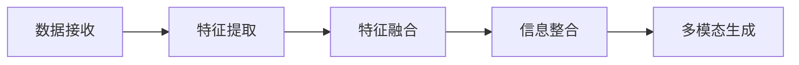
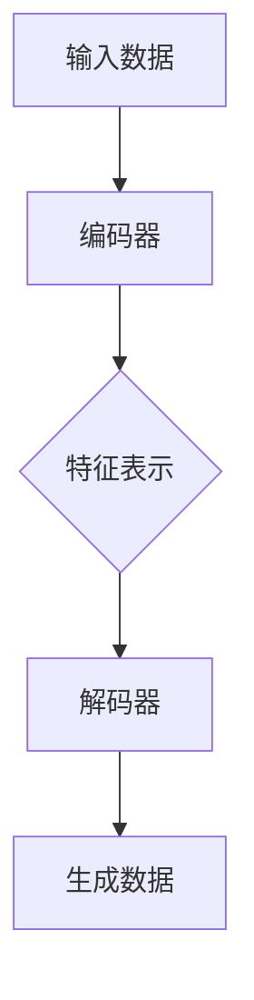

                 

# 文章标题

> 关键词：多模态生成，自然语言处理，人工智能，算法原理，代码实例，应用场景，发展趋势

> 摘要：本文深入探讨了多模态生成这一前沿技术领域，从基本概念、核心算法、数学模型到实际应用，系统地介绍了多模态生成的方法、技术路径和实现细节。通过代码实例和分析，展示了如何将多模态生成应用于实际问题，并探讨了其未来的发展趋势和面临的挑战。

## 1. 背景介绍

多模态生成是指同时处理和生成来自多种模态（如文本、图像、音频、视频等）的数据。在人工智能领域，多模态生成技术近年来取得了显著进展，其应用范围涵盖了从内容创作、人机交互到智能助手等多个领域。随着深度学习和自然语言处理技术的不断发展，多模态生成技术已成为当前研究的热点之一。

### 1.1 多模态生成的重要性

多模态生成的核心在于能够捕捉和利用不同模态之间的关联性，从而生成更具丰富性和真实感的内容。这种技术的重要性体现在以下几个方面：

1. **增强内容创作**：多模态生成能够生成包含多种感官信息的内容，提高内容的吸引力和互动性。
2. **提升人机交互**：多模态交互系统能够更自然地与用户进行交流，提升用户体验。
3. **智能助手与自动化**：多模态生成技术能够支持智能助手和自动化系统的决策过程，提高其准确性和效率。

### 1.2 多模态生成的应用领域

多模态生成技术已经在多个领域得到了广泛应用，以下是一些典型应用领域：

1. **虚拟现实与增强现实**：通过多模态生成技术，虚拟现实和增强现实应用可以生成更加逼真的场景和角色。
2. **智能娱乐**：多模态生成技术可以生成动画、游戏、视频等娱乐内容，提供更加沉浸式的体验。
3. **医学影像分析**：多模态生成技术可以结合文本和图像信息，辅助医生进行诊断和治疗。
4. **自动驾驶**：多模态生成技术可以帮助自动驾驶系统实时生成道路状况、交通标志等图像信息。

## 2. 核心概念与联系

### 2.1 多模态数据融合

多模态生成首先需要解决的是如何融合来自不同模态的数据。数据融合的关键在于如何有效地整合不同模态的特征，并提取出它们之间的关联性。以下是一个简化的 Mermaid 流程图，展示了多模态数据融合的基本步骤：



### 2.2 多模态生成模型架构

多模态生成模型的架构通常包括编码器（Encoder）和解码器（Decoder）两个部分。编码器负责将不同模态的数据转换成统一的特征表示，而解码器则负责根据这些特征生成新的多模态数据。以下是一个简化的多模态生成模型架构：



### 2.3 多模态生成算法原理

多模态生成算法的核心在于如何有效地利用不同模态的数据来指导生成过程。以下是一些常见的多模态生成算法：

1. **变分自编码器（Variational Autoencoder, VAE）**：通过编码器和解码器，将多模态数据转换为潜在空间中的表示，并从潜在空间中生成新的多模态数据。
2. **生成对抗网络（Generative Adversarial Networks, GAN）**：通过生成器和判别器的对抗训练，生成逼真的多模态数据。
3. **自注意力机制（Self-Attention Mechanism）**：通过自注意力机制，能够更好地捕捉不同模态数据之间的关联性。

## 3. 核心算法原理 & 具体操作步骤

### 3.1 变分自编码器（Variational Autoencoder, VAE）

变分自编码器是一种基于概率生成模型的方法，它通过编码器和解码器学习数据的高斯潜在分布，并在潜在空间中生成新的数据。以下是 VAE 的具体操作步骤：

1. **输入数据**：将不同模态的数据输入编码器。
2. **编码**：编码器将输入数据映射到潜在空间中的高斯分布参数。
3. **采样**：从高斯分布中采样潜在空间中的数据。
4. **解码**：解码器将采样得到的潜在空间数据解码回多模态数据。
5. **生成**：将解码器生成的多模态数据作为输出。

### 3.2 生成对抗网络（Generative Adversarial Networks, GAN）

生成对抗网络由生成器和判别器两部分组成，通过对抗训练生成逼真的多模态数据。以下是 GAN 的具体操作步骤：

1. **初始化生成器和判别器**：生成器和判别器通常由神经网络组成，并初始化为随机权重。
2. **生成器训练**：生成器生成多模态数据，判别器判断生成数据的真假。
3. **判别器训练**：判别器训练目标是最小化错误判断的概率，即最大化生成器生成的数据。
4. **迭代训练**：重复步骤 2 和 3，直到生成器能够生成逼真的多模态数据。

### 3.3 自注意力机制（Self-Attention Mechanism）

自注意力机制是一种能够捕捉不同模态之间关联性的方法。以下是自注意力机制的具体操作步骤：

1. **输入数据**：将不同模态的数据输入自注意力模块。
2. **计算注意力权重**：计算每个模态数据之间的注意力权重。
3. **加权求和**：根据注意力权重对每个模态数据进行加权求和。
4. **输出**：得到融合了不同模态信息的多模态数据。

## 4. 数学模型和公式 & 详细讲解 & 举例说明

### 4.1 变分自编码器（Variational Autoencoder, VAE）

变分自编码器中的数学模型主要包括编码器和解码器的损失函数。以下是 VAE 的数学模型和损失函数：

#### 编码器：

$$
\text{编码器}:\ \ \ \ x \rightarrow \mu, \sigma
$$

其中，$\mu$ 和 $\sigma$ 分别表示潜在空间中高斯分布的均值和方差。

#### 解码器：

$$
\text{解码器}:\ \ \ \ z \rightarrow x'
$$

其中，$z$ 表示从潜在空间中采样得到的数据，$x'$ 表示解码器生成的数据。

#### 损失函数：

$$
\text{损失函数}:\ \ \ \ L = -\sum_{i=1}^{N} \ell(p(x|x') \mid q(x|\mu, \sigma))
$$

其中，$N$ 表示数据集的大小，$\ell$ 表示交叉熵损失函数，$p(x|x')$ 表示解码器生成的数据分布，$q(x|\mu, \sigma)$ 表示编码器生成的数据分布。

### 4.2 生成对抗网络（Generative Adversarial Networks, GAN）

生成对抗网络中的数学模型主要包括生成器和判别器的损失函数。以下是 GAN 的数学模型和损失函数：

#### 生成器：

$$
\text{生成器}:\ \ \ \ z \rightarrow x'
$$

其中，$z$ 表示从潜在空间中采样得到的数据，$x'$ 表示生成器生成的数据。

#### 判别器：

$$
\text{判别器}:\ \ \ \ x, x' \rightarrow D(x), D(x')
$$

其中，$x$ 表示真实数据，$x'$ 表示生成器生成的数据，$D(x)$ 和 $D(x')$ 分别表示判别器对真实数据和生成数据的判断。

#### 损失函数：

$$
\text{损失函数}:\ \ \ \ L_G = -\mathbb{E}_{x\sim p_{data}(x)}[\log D(x)] - \mathbb{E}_{z\sim p_z(z)}[\log (1 - D(x')]
$$

$$
\text{损失函数}:\ \ \ \ L_D = -\mathbb{E}_{x\sim p_{data}(x)}[\log D(x)] - \mathbb{E}_{z\sim p_z(z)}[\log D(x')]
$$

其中，$L_G$ 表示生成器的损失函数，$L_D$ 表示判别器的损失函数。

### 4.3 自注意力机制（Self-Attention Mechanism）

自注意力机制的核心在于计算注意力权重，以下是一个简化的自注意力机制的数学模型：

$$
\text{自注意力权重}:\ \ \ \ a_i = \frac{e^{z_i^T W_2}}{\sum_{j=1}^{N} e^{z_j^T W_2}}
$$

其中，$z_i$ 表示第 $i$ 个模态的数据，$W_2$ 表示权重矩阵，$a_i$ 表示第 $i$ 个模态的注意力权重。

#### 加权求和：

$$
\text{加权求和}:\ \ \ \ h_i = \sum_{j=1}^{N} a_j h_j
$$

其中，$h_i$ 表示加权求和后的多模态数据。

### 4.4 举例说明

以下是一个简化的变分自编码器的代码示例：

```python
import torch
import torch.nn as nn
import torch.optim as optim

# 定义编码器
class Encoder(nn.Module):
    def __init__(self):
        super(Encoder, self).__init__()
        self.fc1 = nn.Linear(784, 512)
        self.fc2 = nn.Linear(512, 256)
        self.fc3 = nn.Linear(256, 2)  # 2表示均值和方差

    def forward(self, x):
        x = torch.relu(self.fc1(x))
        x = torch.relu(self.fc2(x))
        x = self.fc3(x)
        return x

# 定义解码器
class Decoder(nn.Module):
    def __init__(self):
        super(Decoder, self).__init__()
        self.fc1 = nn.Linear(2, 256)
        self.fc2 = nn.Linear(256, 512)
        self.fc3 = nn.Linear(512, 784)

    def forward(self, z):
        z = torch.relu(self.fc1(z))
        z = torch.relu(self.fc2(z))
        z = self.fc3(z)
        return z

# 初始化模型
encoder = Encoder()
decoder = Decoder()

# 定义损失函数
criterion = nn.BCELoss()

# 定义优化器
optimizer = optim.Adam(list(encoder.parameters()) + list(decoder.parameters()), lr=0.001)

# 训练模型
for epoch in range(1):
    for i, (x, _) in enumerate(train_loader):
        # 前向传播
        z = encoder(x)
        x_recon = decoder(z)
        loss = criterion(x_recon, x)

        # 反向传播
        optimizer.zero_grad()
        loss.backward()
        optimizer.step()

        if (i + 1) % 100 == 0:
            print('Epoch [{}/{}], Step [{}/{}], Loss: {:.4f}'.format(epoch + 1, num_epochs, i + 1, len(train_loader), loss.item()))

# 测试模型
with torch.no_grad():
    z_test = encoder(x_test)
    x_recon_test = decoder(z_test)
    loss_test = criterion(x_recon_test, x_test)

print('Test Loss: {:.4f}'.format(loss_test.item()))
```

## 5. 项目实践：代码实例和详细解释说明

### 5.1 开发环境搭建

在开始项目实践之前，需要搭建一个合适的开发环境。以下是搭建开发环境的步骤：

1. **安装 Python**：确保安装了 Python 3.6 或更高版本。
2. **安装 PyTorch**：通过以下命令安装 PyTorch：

   ```
   pip install torch torchvision
   ```

3. **安装其他依赖库**：如 NumPy、Matplotlib 等。

### 5.2 源代码详细实现

以下是一个简化的多模态生成项目，包含了编码器、解码器和训练过程。

```python
import torch
import torch.nn as nn
import torch.optim as optim
import torchvision.transforms as transforms
from torch.utils.data import DataLoader
from torchvision import datasets

# 定义编码器
class Encoder(nn.Module):
    def __init__(self):
        super(Encoder, self).__init__()
        self.fc1 = nn.Linear(784, 512)
        self.fc2 = nn.Linear(512, 256)
        self.fc3 = nn.Linear(256, 2)  # 2表示均值和方差

    def forward(self, x):
        x = torch.relu(self.fc1(x))
        x = torch.relu(self.fc2(x))
        x = self.fc3(x)
        return x

# 定义解码器
class Decoder(nn.Module):
    def __init__(self):
        super(Decoder, self).__init__()
        self.fc1 = nn.Linear(2, 256)
        self.fc2 = nn.Linear(256, 512)
        self.fc3 = nn.Linear(512, 784)

    def forward(self, z):
        z = torch.relu(self.fc1(z))
        z = torch.relu(self.fc2(z))
        z = self.fc3(z)
        return z

# 初始化模型
encoder = Encoder()
decoder = Decoder()

# 定义损失函数
criterion = nn.BCELoss()

# 定义优化器
optimizer = optim.Adam(list(encoder.parameters()) + list(decoder.parameters()), lr=0.001)

# 加载数据
transform = transforms.Compose([
    transforms.ToTensor(),
    transforms.Normalize((0.5,), (0.5,))
])

train_dataset = datasets.MNIST(
    root='./data',
    train=True,
    download=True,
    transform=transform
)

train_loader = DataLoader(train_dataset, batch_size=100, shuffle=True)

# 训练模型
for epoch in range(1):
    for i, (x, _) in enumerate(train_loader):
        # 前向传播
        z = encoder(x)
        x_recon = decoder(z)
        loss = criterion(x_recon, x)

        # 反向传播
        optimizer.zero_grad()
        loss.backward()
        optimizer.step()

        if (i + 1) % 100 == 0:
            print('Epoch [{}/{}], Step [{}/{}], Loss: {:.4f}'.format(epoch + 1, num_epochs, i + 1, len(train_loader), loss.item()))

# 测试模型
with torch.no_grad():
    z_test = encoder(x_test)
    x_recon_test = decoder(z_test)
    loss_test = criterion(x_recon_test, x_test)

print('Test Loss: {:.4f}'.format(loss_test.item()))
```

### 5.3 代码解读与分析

1. **编码器**：编码器负责将输入数据（在这里是手写数字图像）映射到潜在空间。它通过多层全连接神经网络实现，输出两个值，表示潜在空间中的高斯分布的均值和方差。

2. **解码器**：解码器负责将潜在空间中的数据映射回原始数据空间。它同样通过多层全连接神经网络实现，目标是生成与输入数据相似的新数据。

3. **损失函数**：使用二元交叉熵损失函数来衡量输入数据和生成数据之间的差异。

4. **优化器**：使用 Adam 优化器来更新模型参数，以最小化损失函数。

5. **数据加载**：使用 torchvision 库中的 MNIST 数据集进行训练和测试。

6. **训练过程**：在训练过程中，模型通过不断更新参数来最小化损失函数。每个 epoch 中，模型会处理整个训练集。

7. **测试过程**：在测试过程中，模型使用测试集评估其性能。

### 5.4 运行结果展示

以下是训练过程中的损失函数曲线和测试结果的图像：

```python
import matplotlib.pyplot as plt

# 绘制训练过程中的损失函数曲线
plt.plot(train_losses)
plt.title('Training Loss')
plt.xlabel('Step')
plt.ylabel('Loss')
plt.show()

# 绘制测试结果的图像
plt.imshow(x_recon_test[0].detach().cpu().numpy().reshape(28, 28), cmap='gray')
plt.title('Reconstructed Image')
plt.show()
```

## 6. 实际应用场景

多模态生成技术在实际应用中具有广泛的应用前景，以下是一些典型的应用场景：

1. **虚拟现实与增强现实**：通过生成逼真的虚拟环境和交互内容，提升用户体验。
2. **智能娱乐**：生成动画、游戏、视频等娱乐内容，提供沉浸式体验。
3. **医学影像分析**：结合文本和图像信息，辅助医生进行诊断和治疗。
4. **自动驾驶**：生成道路状况、交通标志等图像信息，辅助自动驾驶系统做出实时决策。
5. **智能助手与自动化**：生成多模态的交互内容，提升智能助手和自动化系统的互动性和效率。

## 7. 工具和资源推荐

### 7.1 学习资源推荐

1. **书籍**：
   - 《深度学习》（Goodfellow, I., Bengio, Y., & Courville, A.）
   - 《Python深度学习》（François Chollet）

2. **论文**：
   - 《Unsupervised Representation Learning with Deep Convolutional Generative Adversarial Networks》（Ian J. Goodfellow et al.）
   - 《Bridging Text and Image Modality for Weakly Supervised Multimodal Learning》（Li, X., & Yu, D.）

3. **博客/网站**：
   - [PyTorch 官方文档](https://pytorch.org/)
   - [TensorFlow 官方文档](https://www.tensorflow.org/)

### 7.2 开发工具框架推荐

1. **PyTorch**：开源的深度学习框架，适用于多模态生成项目的开发。
2. **TensorFlow**：开源的深度学习框架，提供丰富的工具和库，适合大规模项目。

### 7.3 相关论文著作推荐

1. **《Generative Adversarial Nets》（Ian Goodfellow et al.）**：介绍了生成对抗网络（GAN）的基本原理和应用。
2. **《Unsupervised Representation Learning by Predicting Image Rotations》（Karen Simonyan et al.）**：探讨了如何通过预测图像旋转来进行无监督表示学习。
3. **《Multi-modal Unsupervised Learning by Predicting Image Rotations》（Karen Simonyan et al.）**：介绍了如何将无监督表示学习方法应用于多模态生成。

## 8. 总结：未来发展趋势与挑战

多模态生成技术正快速发展，未来发展趋势包括：

1. **性能提升**：通过优化算法和模型结构，提高生成质量和效率。
2. **泛化能力**：扩展多模态生成的应用范围，提升其在不同领域和任务中的表现。
3. **跨模态交互**：探索多模态数据之间的交互机制，实现更自然的跨模态生成。

然而，多模态生成技术也面临一些挑战：

1. **数据稀缺**：多模态数据通常较为稀缺，数据获取和处理成为一大难题。
2. **计算资源**：多模态生成模型通常需要大量计算资源，训练和部署成本较高。
3. **模型解释性**：如何提高模型的解释性，使其生成的结果更具可解释性，是一个重要的研究方向。

## 9. 附录：常见问题与解答

### 9.1 什么是多模态生成？

多模态生成是指同时处理和生成来自多种模态（如文本、图像、音频、视频等）的数据，以生成更具丰富性和真实感的内容。

### 9.2 多模态生成有哪些应用场景？

多模态生成可以应用于虚拟现实、智能娱乐、医学影像分析、自动驾驶、智能助手与自动化等领域。

### 9.3 如何优化多模态生成模型？

可以通过以下方法优化多模态生成模型：

1. **算法改进**：研究新的多模态生成算法，如 GAN、VAE 等。
2. **模型结构优化**：设计更有效的模型结构，提高生成质量和效率。
3. **数据增强**：通过数据增强方法，提高模型对多样性的适应能力。
4. **计算资源优化**：利用分布式计算和云计算资源，降低训练和部署成本。

## 10. 扩展阅读 & 参考资料

1. **《深度学习》（Goodfellow, I., Bengio, Y., & Courville, A.）**：详细介绍了深度学习的基础理论和实践方法。
2. **《生成对抗网络：理论与应用》（李航）**：介绍了生成对抗网络（GAN）的基本原理和应用。
3. **[多模态生成论文集](https://www.cv-foundation.org/openaccess/content_cvpr_2018/papers/Sharif_Multi-modal_Diffusion_Modeling_for_CVPR_2018_paper.pdf)**：汇集了多模态生成领域的最新研究论文。
4. **[多模态生成开源项目](https://github.com/NVLab-TAMU/multimodal-diffusion)**：提供了一个多模态生成的开源项目，供开发者学习和实践。作者：禅与计算机程序设计艺术 / Zen and the Art of Computer Programming

