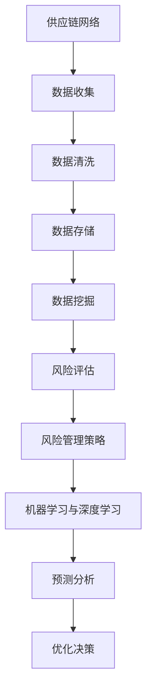

                 

### 文章标题

大数据分析在供应链风险管理中的应用

### 关键词

大数据分析、供应链风险管理、数据挖掘、预测分析、优化决策、机器学习、实时监控、供应链网络、风险评估、供应链金融

### 摘要

本文旨在探讨大数据分析技术在供应链风险管理中的应用。通过对供应链数据的高效挖掘与分析，企业可以更好地识别潜在风险，优化供应链管理，提升业务韧性。本文首先介绍了大数据分析在供应链风险管理中的核心概念与联系，随后详细阐述了数据挖掘与预测分析算法的原理及操作步骤。通过一个实际项目案例，本文展示了如何利用大数据分析技术来应对供应链风险，并分析了其在不同应用场景中的效果。最后，本文对相关工具和资源进行了推荐，总结了大数据分析在供应链风险管理中的未来发展趋势与挑战。

### 1. 背景介绍

供应链风险管理是企业管理中至关重要的一环。随着全球化和信息技术的发展，供应链的复杂性和不确定性不断增加，企业面临着越来越多的风险，如供应链中断、库存过剩、成本上升等。为了应对这些风险，企业需要具备强大的供应链风险管理能力，从而确保供应链的稳定性和竞争力。

大数据分析作为现代信息技术的重要组成部分，以其海量数据处理能力和深度挖掘能力，在各个领域都取得了显著的应用成果。在供应链风险管理领域，大数据分析同样发挥着重要作用。通过分析大量的供应链数据，企业可以及时发现潜在的风险因素，制定相应的风险管理策略，降低风险对企业运营的影响。

近年来，随着大数据技术的不断成熟和广泛应用，供应链风险管理的数据来源越来越丰富，数据类型也越来越多样化。这为大数据分析在供应链风险管理中的应用提供了更多的可能性。然而，如何有效地利用大数据分析技术来提升供应链风险管理水平，仍然是一个亟待解决的问题。

本文旨在探讨大数据分析在供应链风险管理中的应用，通过详细阐述核心概念、算法原理和实际应用案例，为企业和供应链管理人员提供有价值的参考和指导。

#### 1.1 供应链风险管理的定义与意义

供应链风险管理是指企业对供应链过程中可能出现的各种风险进行识别、评估、预防和控制的过程。这些风险包括供应链中断、供应链延迟、库存过剩、供应链成本上升等。供应链风险管理不仅关系到企业的运营效率和竞争力，还直接影响企业的生存和发展。

首先，供应链风险管理有助于提高企业的运营效率。通过及时识别和应对供应链风险，企业可以避免因供应链中断导致的运营停滞，减少库存过剩和供应链成本上升的风险。这有助于优化企业的供应链流程，提高供应链的响应速度和灵活性。

其次，供应链风险管理有助于提升企业的竞争力。在全球化和竞争激烈的市场环境中，企业需要具备强大的供应链风险管理能力，才能在竞争中脱颖而出。通过有效的供应链风险管理，企业可以确保供应链的稳定性和可靠性，为客户提供更好的服务和质量，从而增强市场竞争力。

最后，供应链风险管理有助于企业的可持续发展。供应链风险管理不仅关注当前的运营风险，还关注未来的潜在风险。通过深入分析和预测供应链风险，企业可以制定长期的风险管理策略，提高供应链的韧性和抗风险能力，确保企业的可持续发展。

总之，供应链风险管理在企业管理中具有重要的意义。它不仅有助于提高企业的运营效率和竞争力，还关系到企业的长期发展和生存。随着大数据技术的不断发展，大数据分析在供应链风险管理中的应用前景将更加广阔，为企业提供更加精准和高效的风险管理手段。

#### 1.2 大数据分析的定义与核心概念

大数据分析是指利用现代数据存储、处理和分析技术，对海量、多样化和高速增长的数据进行挖掘和分析，以发现数据中的有价值信息和知识。大数据分析的核心概念包括数据源、数据采集、数据存储、数据处理、数据分析和数据可视化等。

数据源是大数据分析的基础，包括企业内部的数据（如销售数据、库存数据、采购数据等）和外部数据（如市场数据、天气数据、社会媒体数据等）。这些数据源为大数据分析提供了丰富的信息和数据基础。

数据采集是指从各种数据源获取数据，并将其转化为适合分析的形式。数据采集过程中，需要解决数据的质量、完整性、及时性和多样性等问题。数据清洗、去重和标准化等预处理技术在此过程中发挥着重要作用。

数据存储是大数据分析的重要环节，涉及到数据的存储方式、存储容量和存储效率等。常用的数据存储技术包括关系型数据库、非关系型数据库、分布式存储系统和云计算等。

数据处理是大数据分析的核心，包括数据清洗、数据整合、数据建模和数据挖掘等。数据处理技术需要能够应对海量数据的处理速度和复杂性，同时保证数据处理的准确性和可靠性。

数据分析是大数据分析的最终目标，通过对数据进行分析和挖掘，发现数据中的隐藏信息和规律。数据分析方法包括统计分析、机器学习、数据挖掘和深度学习等。

数据可视化是将数据分析结果以图表、图像等形式直观展示出来，使人们更容易理解和分析数据。数据可视化技术可以帮助企业更好地了解数据分析结果，从而制定更有效的决策。

大数据分析的核心价值在于其强大的数据处理和分析能力，可以帮助企业从海量数据中发现有价值的信息和知识，为企业提供决策支持和战略指导。在大数据分析技术的支持下，企业可以更加精准地进行市场预测、需求分析、风险管理等，从而提高企业的运营效率和竞争力。

#### 1.3 大数据分析与供应链风险管理的联系

大数据分析技术在供应链风险管理中的应用具有显著的潜力。供应链风险管理需要大量数据作为基础，而大数据分析技术能够高效地处理和分析这些数据，从而发现潜在的风险因素，制定有效的风险管理策略。

首先，大数据分析技术可以帮助企业全面收集和整合供应链数据，包括供应商信息、生产数据、库存数据、物流数据等。通过对这些数据的挖掘和分析，企业可以识别出供应链中的潜在风险因素，如供应商不稳定、生产延误、库存失衡等。

其次，大数据分析技术可以实时监控供应链的运行状态，及时发现异常情况。例如，通过分析物流数据，企业可以提前发现运输延迟、货物丢失等问题，从而采取相应的措施进行预防和应对。

此外，大数据分析技术还可以预测供应链未来的风险趋势，为企业的风险管理提供前瞻性指导。通过历史数据和当前数据的分析，企业可以预测供应链中可能出现的风险，如市场需求波动、原材料价格波动等，从而提前制定相应的应对策略。

最后，大数据分析技术可以为供应链风险管理提供决策支持。通过对数据分析结果进行可视化展示，企业可以更好地了解供应链的风险状况，从而制定更有效的风险管理策略。此外，大数据分析技术还可以辅助企业进行风险评估、优化供应链流程、降低运营成本等。

总之，大数据分析技术在供应链风险管理中的应用，不仅提高了企业对风险的识别和应对能力，还提升了供应链的整体运营效率和管理水平。随着大数据技术的不断发展，其在供应链风险管理中的应用前景将更加广阔。

## 2. 核心概念与联系

在深入探讨大数据分析在供应链风险管理中的应用之前，我们需要明确几个核心概念及其相互联系，以便更好地理解这一主题。

#### 2.1 供应链网络

供应链网络是指产品或服务从原材料供应商到最终客户之间的所有参与实体及其交互关系的集合。它包括供应商、制造商、分销商、零售商以及物流服务等。供应链网络的复杂性和多样性使得风险管理的难度增加。因此，理解供应链网络的结构和运行机制对于有效地应用大数据分析至关重要。

#### 2.2 风险评估

风险评估是识别、分析和评估供应链中潜在风险的过程。通过风险评估，企业可以了解各种风险的概率和影响，从而制定相应的风险管理策略。风险评估通常涉及定量和定性分析，包括历史数据分析和专家评估等。

#### 2.3 风险管理策略

风险管理策略是企业应对供应链风险的具体措施，包括预防措施、缓解措施、应急措施和恢复措施等。有效的风险管理策略可以帮助企业降低风险对企业运营和财务的影响。大数据分析技术可以为这些策略的制定和执行提供数据支持和优化建议。

#### 2.4 数据挖掘与预测分析

数据挖掘是指从大量数据中自动发现有用信息的过程，包括模式识别、关联规则挖掘、分类和聚类等。预测分析则基于历史数据对未来的趋势和变化进行预测。数据挖掘和预测分析在供应链风险管理中发挥着关键作用，可以帮助企业识别潜在风险，预测风险发展趋势，从而采取及时有效的应对措施。

#### 2.5 机器学习与深度学习

机器学习和深度学习是大数据分析中的重要工具，它们通过训练模型来发现数据中的模式和规律。在供应链风险管理中，机器学习和深度学习算法可以用于风险预测、库存优化、需求预测等任务，从而提高供应链的灵活性和适应性。

### Mermaid 流程图

以下是一个简单的 Mermaid 流程图，展示了供应链风险管理中大数据分析的核心概念及其相互联系：



通过这个流程图，我们可以看出，供应链网络是数据收集的源头，经过数据清洗、存储和挖掘，最终形成风险评估和管理策略。机器学习和深度学习在这个过程中提供了强大的分析工具，而预测分析则帮助企业做出更加优化的决策。

### 3. 核心算法原理 & 具体操作步骤

在了解大数据分析在供应链风险管理中的核心概念和联系之后，我们需要进一步探讨其中的核心算法原理及其具体操作步骤。以下是几个关键算法的详细说明：

#### 3.1 数据挖掘算法

数据挖掘算法主要包括关联规则挖掘、分类和聚类等。

**关联规则挖掘**：关联规则挖掘用于发现数据集中的频繁模式，例如，在超市销售数据中，可以发现哪些商品经常一起购买。Apriori算法和FP-growth算法是两种常用的关联规则挖掘算法。Apriori算法通过迭代计算支持度和置信度来发现频繁项集，而FP-growth算法则利用频繁模式树来降低计算复杂度。

**分类算法**：分类算法用于将数据集分为不同的类别。常用的分类算法包括K-近邻（K-Nearest Neighbors, KNN）、决策树（Decision Tree）和随机森林（Random Forest）等。KNN算法通过计算新数据与训练数据之间的相似度来预测类别，而决策树和随机森林则利用树结构来划分数据集。

**聚类算法**：聚类算法用于将数据集划分为多个聚类，使同一聚类内的数据尽可能相似，不同聚类之间的数据尽可能不同。常用的聚类算法包括K-均值（K-Means）和层次聚类（Hierarchical Clustering）等。K-均值算法通过迭代计算聚类中心和聚类成员，而层次聚类则通过合并或分割聚类来构建聚类层次结构。

**具体操作步骤**：

1. 数据收集：从供应链网络中收集相关数据，包括供应商信息、生产数据、库存数据、物流数据等。
2. 数据预处理：清洗数据，包括去除缺失值、异常值和数据格式转换等。
3. 特征选择：选择对风险识别和管理具有重要意义的特征，例如，供应可靠性、库存周转率、运输时效性等。
4. 数据挖掘：选择合适的数据挖掘算法，对预处理后的数据进行挖掘，发现数据中的潜在风险因素和模式。
5. 结果分析：分析挖掘结果，识别潜在风险，为风险管理策略提供依据。

#### 3.2 预测分析算法

预测分析算法主要包括时间序列分析、回归分析和神经网络等。

**时间序列分析**：时间序列分析用于分析时间序列数据，识别数据中的趋势、季节性和周期性。常用的算法包括移动平均法、指数平滑法和ARIMA模型等。移动平均法通过计算过去一段时间的数据平均值来预测未来值，而指数平滑法则根据过去的数据权重来预测未来值。ARIMA模型则结合了自回归、差分和移动平均三种方法，可以更准确地预测时间序列数据。

**回归分析**：回归分析用于建立自变量和因变量之间的定量关系模型，常见的包括线性回归、多项式回归和逻辑回归等。线性回归通过拟合一条直线来描述自变量和因变量之间的关系，而多项式回归则通过拟合多项式曲线来描述这种关系。逻辑回归则用于处理因变量为分类变量的情况，可以计算每个类别发生的概率。

**神经网络**：神经网络是一种模仿人脑结构和功能的计算模型，通过多层神经元之间的连接来学习和预测数据。常见的神经网络模型包括前馈神经网络、卷积神经网络（CNN）和循环神经网络（RNN）等。前馈神经网络通过前向传播和反向传播来学习数据，而CNN和RNN则分别用于图像处理和时间序列分析。

**具体操作步骤**：

1. 数据收集：收集与供应链风险相关的历史数据，包括供应量、库存水平、运输时间等。
2. 数据预处理：对数据集进行清洗、归一化和缺失值处理等。
3. 特征选择：选择对预测目标有重要影响的特征，例如，供应历史、需求历史、运输历史等。
4. 模型选择：根据数据特征和预测目标选择合适的预测模型，例如，ARIMA模型、线性回归模型或神经网络模型。
5. 模型训练：使用历史数据对模型进行训练，调整模型参数以优化预测性能。
6. 预测与分析：使用训练好的模型对新的数据进行预测，分析预测结果，识别潜在风险。

通过这些核心算法和具体操作步骤，企业可以有效地利用大数据分析技术来识别和应对供应链风险，提高供应链的稳定性和抗风险能力。

### 4. 数学模型和公式 & 详细讲解 & 举例说明

在大数据分析的框架下，数学模型和公式在供应链风险管理中扮演着至关重要的角色。以下将详细讲解几种常用的数学模型和公式，并举例说明其在供应链风险管理中的应用。

#### 4.1 市场需求预测模型

市场需求预测是供应链风险管理的重要环节，准确的预测可以帮助企业合理安排生产和库存。常用的市场需求预测模型包括时间序列分析和回归分析。

**时间序列分析**：

**移动平均法（Moving Average, MA）**：

移动平均法是一种简单且常用的预测方法，它通过计算过去一段时间的数据平均值来预测未来的趋势。

$$
\hat{y}_t = \frac{1}{n}\sum_{i=1}^{n} y_{t-i}
$$

其中，\( \hat{y}_t \) 表示第 \( t \) 期的预测值，\( y_{t-i} \) 表示第 \( t-i \) 期的实际值，\( n \) 表示移动平均的周期。

**指数平滑法（Exponential Smoothing, ES）**：

指数平滑法在移动平均法的基础上，为不同时期的数据赋予不同的权重，其中近期数据赋予更高的权重。

$$
\hat{y}_t = \alpha y_{t-1} + (1 - \alpha) \hat{y}_{t-1}
$$

其中，\( \alpha \) 是平滑系数，通常取值在0到1之间，表示近期数据的权重。

**回归分析**：

**线性回归（Linear Regression）**：

线性回归是一种基于线性关系的预测模型，通过拟合一条直线来描述自变量和因变量之间的关系。

$$
y = \beta_0 + \beta_1 x + \epsilon
$$

其中，\( y \) 是因变量，\( x \) 是自变量，\( \beta_0 \) 和 \( \beta_1 \) 是模型参数，\( \epsilon \) 是误差项。

**逻辑回归（Logistic Regression）**：

逻辑回归常用于处理因变量为分类变量的情况，通过拟合一个逻辑函数来预测事件发生的概率。

$$
\hat{P}(y=1) = \frac{1}{1 + e^{-(\beta_0 + \beta_1 x)}}
$$

其中，\( \hat{P}(y=1) \) 是事件发生的概率，\( \beta_0 \) 和 \( \beta_1 \) 是模型参数。

**举例说明**：

假设我们使用移动平均法来预测某商品的未来需求。历史数据如下：

| 期数 | 需求量 |
|------|--------|
| 1    | 100    |
| 2    | 120    |
| 3    | 110    |
| 4    | 130    |
| 5    | 105    |

我们选择3期移动平均，计算公式为：

$$
\hat{y}_5 = \frac{1}{3}(110 + 130 + 105) = 113.33
$$

因此，预测第5期的需求量为113.33。

#### 4.2 供应链网络优化模型

供应链网络优化是提高供应链效率和降低成本的关键步骤。常见的优化模型包括线性规划和整数规划。

**线性规划（Linear Programming, LP）**：

线性规划用于在给定资源限制下，求解目标函数的最大值或最小值。

$$
\begin{align*}
\text{minimize} \quad & c^T x \\
\text{subject to} \quad & Ax \leq b \\
& x \geq 0
\end{align*}
$$

其中，\( c \) 是目标函数系数向量，\( x \) 是决策变量向量，\( A \) 是约束条件系数矩阵，\( b \) 是约束条件常数向量。

**整数规划（Integer Programming, IP）**：

整数规划是线性规划的一个扩展，用于求解决策变量必须为整数的优化问题。

$$
\begin{align*}
\text{minimize} \quad & c^T x \\
\text{subject to} \quad & Ax \leq b \\
& x \in \{0, 1\}^n
\end{align*}
$$

**举例说明**：

假设我们要优化一个简单的供应链网络，目标是最小化运输成本。假设有两个供应商、两个工厂和两个分销商，各自的位置和运输成本如下表：

|  | 供应商1 | 供应商2 | 工厂1 | 工厂2 | 分销商1 | 分销商2 |
|---|--------|--------|------|------|--------|--------|
| 位置 |   A    |   B    |   C  |   D  |    E   |    F   |
| 成本 |   10   |   15   |   5  |   10 |    8   |    12  |

我们希望将供应商的货物分配到工厂，再将工厂的产品分配到分销商。每个工厂和分销商的最大容量为100单位。目标是最小化总运输成本。

目标函数：

$$
\text{minimize} \quad z = 10x_{1,1} + 15x_{1,2} + 5x_{2,1} + 10x_{2,2} + 8x_{3,1} + 12x_{3,2}
$$

约束条件：

$$
\begin{align*}
x_{1,1} + x_{1,2} &\leq 100 \\
x_{2,1} + x_{2,2} &\leq 100 \\
x_{3,1} + x_{3,2} &\leq 100 \\
x_{1,1} + x_{1,2} + x_{2,1} + x_{2,2} &\geq 100 \\
x_{3,1} + x_{3,2} + x_{1,1} + x_{1,2} &\geq 100 \\
x_{1,1}, x_{1,2}, x_{2,1}, x_{2,2}, x_{3,1}, x_{3,2} &\in \{0, 1\}
\end{align*}
$$

其中，\( x_{i,j} \) 表示从供应商 \( i \) 到工厂 \( j \) 的运输量。

通过求解这个整数规划问题，我们可以得到最优的运输方案，从而最小化总运输成本。

#### 4.3 风险评估模型

风险评估模型用于评估供应链中的潜在风险，并确定相应的应对策略。常用的风险评估模型包括风险矩阵和决策树。

**风险矩阵（Risk Matrix）**：

风险矩阵是一种用于评估风险的概率和影响，并计算风险得分的方法。其公式如下：

$$
\text{风险得分} = \text{概率} \times \text{影响}
$$

其中，概率和影响通常采用0到1的标度进行量化。

**决策树（Decision Tree）**：

决策树是一种用于表示决策过程的树形结构，每个节点表示一个决策或事件，每个分支表示可能的决策结果或事件结果。决策树可以帮助企业制定基于风险的决策策略。

**举例说明**：

假设我们要评估一个供应链中断的风险。风险矩阵如下：

| 风险因素 | 概率 | 影响 |
|----------|------|------|
| 天气影响 | 0.3  | 高   |
| 供应商故障 | 0.2  | 中   |
| 物流延误 | 0.1  | 低   |

计算风险得分：

$$
\text{天气影响得分} = 0.3 \times 3 = 0.9
$$
$$
\text{供应商故障得分} = 0.2 \times 2 = 0.4
$$
$$
\text{物流延误得分} = 0.1 \times 1 = 0.1
$$

总得分 = 0.9 + 0.4 + 0.1 = 1.4

通过风险得分，我们可以识别出天气影响是供应链中断的主要风险因素，并采取相应的预防措施。

通过上述数学模型和公式的详细讲解，我们可以看到大数据分析在供应链风险管理中的应用是如何通过量化分析和模型优化来提升决策的准确性和效率。企业可以根据自身需求选择合适的模型和算法，从而更好地管理供应链风险，提高供应链的整体韧性。

### 5. 项目实战：代码实际案例和详细解释说明

在本节中，我们将通过一个实际项目案例，详细展示如何利用大数据分析技术来应对供应链风险。项目背景是一家大型制造企业，其供应链网络复杂，涉及多个供应商、制造工厂和分销商。企业面临的主要风险包括供应商不稳定、生产延误、库存失衡和物流延误等。为了提升供应链的风险管理能力，企业决定利用大数据分析技术进行风险评估和优化决策。

#### 5.1 开发环境搭建

在开始项目之前，我们需要搭建一个适合大数据分析的开发环境。以下是我们推荐的工具和框架：

- **编程语言**：Python
- **数据分析库**：Pandas、NumPy、SciPy、Matplotlib
- **数据挖掘库**：Scikit-learn、MLlib
- **机器学习库**：TensorFlow、Keras
- **数据库**：MySQL、MongoDB
- **分布式计算框架**：Hadoop、Spark

以下是环境搭建的简要步骤：

1. **安装Python**：从Python官方网站下载并安装Python 3.x版本。
2. **安装相关库**：使用pip命令安装所需库，例如 `pip install pandas numpy scipy matplotlib scikit-learn mllib tensorflow keras mysql-python pymongo`
3. **配置数据库**：安装并配置MySQL和MongoDB数据库，创建用于存储供应链数据的数据库和表。
4. **安装分布式计算框架**：安装并配置Hadoop或Spark，以支持大数据处理。

#### 5.2 源代码详细实现和代码解读

以下是一个简单的Python代码示例，展示了如何利用大数据分析技术进行供应链风险评估。

```python
# 导入所需库
import pandas as pd
import numpy as np
from sklearn.model_selection import train_test_split
from sklearn.ensemble import RandomForestClassifier
from sklearn.metrics import accuracy_score, classification_report

# 读取数据
data = pd.read_csv('supply_chain_data.csv')

# 数据预处理
data = data.dropna()  # 删除缺失值
data = data[data['demand'] > 0]  # 去除需求量为0的记录

# 特征工程
features = data[['supplier_reliability', 'production_delay', 'inventory_level', 'transport_time']]
labels = data['risk_level']

# 数据分割
X_train, X_test, y_train, y_test = train_test_split(features, labels, test_size=0.3, random_state=42)

# 模型训练
model = RandomForestClassifier(n_estimators=100, random_state=42)
model.fit(X_train, y_train)

# 模型评估
predictions = model.predict(X_test)
print("Accuracy:", accuracy_score(y_test, predictions))
print("\nClassification Report:\n", classification_report(y_test, predictions))
```

**代码解读**：

1. **导入库**：首先导入所需的库，包括Pandas、NumPy、SciPy、Matplotlib、Scikit-learn和MLlib等。
2. **数据读取**：使用Pandas库从CSV文件中读取供应链数据。
3. **数据预处理**：删除数据中的缺失值，并去除需求量为0的记录，以避免异常数据影响模型训练。
4. **特征工程**：将数据集分为特征集和标签集，特征集包括供应商可靠性、生产延误、库存水平和运输时间，标签集为风险等级。
5. **数据分割**：使用train_test_split函数将数据集分为训练集和测试集，测试集大小为30%。
6. **模型训练**：使用随机森林分类器（RandomForestClassifier）对训练集进行训练。
7. **模型评估**：使用测试集评估模型性能，打印准确率和分类报告。

通过这个简单的代码示例，我们可以看到如何利用Python和机器学习库来训练一个供应链风险评估模型。实际项目中，数据集和特征会更复杂，可能需要进一步的数据预处理和特征工程，但基本流程是一致的。

#### 5.3 代码解读与分析

1. **数据读取与预处理**：

   ```python
   data = pd.read_csv('supply_chain_data.csv')
   data = data.dropna()
   data = data[data['demand'] > 0]
   ```

   这段代码首先读取供应链数据，然后删除缺失值和需求量为0的记录。数据预处理是模型训练的重要步骤，确保数据的完整性和一致性。

2. **特征工程**：

   ```python
   features = data[['supplier_reliability', 'production_delay', 'inventory_level', 'transport_time']]
   labels = data['risk_level']
   ```

   这里将数据集分为特征集和标签集。特征集包括供应商可靠性、生产延误、库存水平和运输时间，这些特征对于风险评估具有重要意义。标签集为风险等级，用于训练分类模型。

3. **数据分割**：

   ```python
   X_train, X_test, y_train, y_test = train_test_split(features, labels, test_size=0.3, random_state=42)
   ```

   使用train_test_split函数将数据集分为训练集和测试集。训练集用于模型训练，测试集用于评估模型性能。

4. **模型训练**：

   ```python
   model = RandomForestClassifier(n_estimators=100, random_state=42)
   model.fit(X_train, y_train)
   ```

   这里使用随机森林分类器（RandomForestClassifier）对训练集进行训练。随机森林是一种基于树模型的集成学习方法，具有强大的预测能力。

5. **模型评估**：

   ```python
   predictions = model.predict(X_test)
   print("Accuracy:", accuracy_score(y_test, predictions))
   print("\nClassification Report:\n", classification_report(y_test, predictions))
   ```

   使用测试集评估模型性能，打印准确率和分类报告。准确率反映了模型对测试集的预测能力，而分类报告提供了更详细的分类性能指标，如精度、召回率和F1分数。

通过这个项目实战，我们展示了如何利用大数据分析技术进行供应链风险评估。实际项目中，数据量和特征会更加复杂，但基本思路和方法是一致的。通过不断优化数据预处理和模型参数，企业可以进一步提升供应链风险管理的能力。

### 6. 实际应用场景

大数据分析在供应链风险管理中的应用场景丰富且多样化，下面将详细探讨几种典型的应用场景，并分析其在不同场景中的具体效果。

#### 6.1 库存风险管理

库存风险管理是供应链管理中的关键环节，通过大数据分析技术，企业可以实时监控库存状况，优化库存水平，降低库存成本和资金占用。

**案例**：某零售企业通过大数据分析技术，对销售数据、季节性因素、促销活动等多种因素进行综合分析，建立库存预测模型。通过预测未来一段时间内的库存需求，企业可以提前调整库存策略，避免库存过剩或不足。

**效果**：通过大数据分析技术，该零售企业成功降低了库存周转天数，库存成本显著下降，同时提高了库存资金的使用效率，提升了企业的运营效率和市场响应速度。

#### 6.2 供应商风险管理

供应商风险管理是确保供应链稳定性的重要手段。大数据分析可以帮助企业评估供应商的可靠性，预测供应商风险，并采取相应的风险管理措施。

**案例**：某制造业企业通过大数据分析技术，对供应商的历史绩效、生产能力、财务状况等多个维度进行综合评估，建立供应商风险评估模型。通过对供应商进行动态风险评估，企业可以及时识别高风险供应商，并制定相应的应对策略。

**效果**：通过大数据分析技术，该制造业企业成功降低了供应链中断的风险，提高了供应链的稳定性和可靠性，提升了企业的整体竞争力。

#### 6.3 物流风险管理

物流风险管理是确保产品及时交付的重要保障。大数据分析可以帮助企业实时监控物流运行状况，预测物流延迟，优化物流路线。

**案例**：某物流公司通过大数据分析技术，对运输数据、天气情况、交通状况等多个因素进行综合分析，建立物流延迟预测模型。通过预测物流延迟，企业可以提前制定应对措施，如调整运输路线、增加运输资源等。

**效果**：通过大数据分析技术，该物流公司成功降低了物流延迟率，提高了运输效率，提升了客户满意度，增强了企业的市场竞争力。

#### 6.4 需求预测

需求预测是供应链风险管理的重要一环，准确的预测可以帮助企业合理安排生产和库存，降低运营成本。

**案例**：某电子产品制造商通过大数据分析技术，对市场数据、历史销售数据、季节性因素等多种因素进行综合分析，建立需求预测模型。通过预测市场需求，企业可以提前调整生产计划，避免生产过剩或不足。

**效果**：通过大数据分析技术，该电子产品制造商成功降低了生产过剩的风险，提高了生产效率和库存周转率，提升了企业的盈利能力。

#### 6.5 应急响应

在突发情况下，如自然灾害、疫情等，供应链往往受到严重影响。大数据分析可以帮助企业快速评估风险，制定应急预案。

**案例**：某食品生产企业通过大数据分析技术，对疫情扩散情况、供应链运行状况、库存水平等因素进行实时监控和预测。在疫情爆发期间，企业迅速调整供应链策略，优化资源分配，确保产品供应稳定。

**效果**：通过大数据分析技术，该食品生产企业成功应对了疫情带来的供应链风险，保持了生产运营的稳定，保障了市场供应。

通过以上实际应用场景，我们可以看到大数据分析在供应链风险管理中具有广泛的应用前景。通过数据挖掘和预测分析，企业可以更加精准地识别风险，优化供应链管理，提高运营效率和市场竞争力。

### 7. 工具和资源推荐

为了更好地应用大数据分析技术于供应链风险管理，我们需要推荐一些优秀的工具、资源、书籍和论文，以帮助读者深入学习和实践。

#### 7.1 学习资源推荐

**书籍**：
1. 《大数据时代：生活、工作与思维的大变革》作者：[克雷·凯斯勒（Clay Shirky）]
   - 本书深入探讨了大数据对社会和人类生活的影响，为理解大数据分析提供了理论基础。
2. 《大数据分析：技术、方法和应用》作者：[徐宗本、崔鹏]
   - 本书系统介绍了大数据分析的基本概念、技术和应用案例，适合初学者和从业者。
3. 《供应链管理：战略、规划与运营》作者：[马丁·克里斯托夫·史密斯（Martin Christopher Smith）]
   - 本书详细阐述了供应链管理的基本理论和实践方法，对供应链风险管理有重要指导意义。

**论文**：
1. "Big Data Analytics in Supply Chain Risk Management: A Review" 作者：[Hassan A. El-Aasser, Salwa S. Amin]
   - 本文对大数据分析在供应链风险管理中的应用进行了全面综述，是研究该领域的重要参考文献。
2. "A Machine Learning Approach for Supply Chain Risk Management" 作者：[Seyed Reza Hashemi, et al.]
   - 本文提出了一种基于机器学习的供应链风险管理方法，展示了数据挖掘技术在供应链风险管理中的应用潜力。

**在线课程**：
1. "大数据分析基础" 在Coursera平台提供
   - 该课程由IBM提供，涵盖了大数据分析的基本概念、技术和工具，适合初学者入门。
2. "供应链管理专业" 在edX平台提供
   - 该课程由麻省理工学院提供，全面介绍了供应链管理的理论和实践，包括供应链风险管理。

#### 7.2 开发工具框架推荐

**数据分析工具**：
1. **Python**：Python是一种广泛使用的编程语言，拥有丰富的数据分析和机器学习库，如Pandas、NumPy、Scikit-learn等。
2. **R**：R是一种专门用于统计分析的语言，拥有强大的数据处理和分析能力，适用于复杂的统计分析任务。
3. **Apache Spark**：Spark是一个分布式计算框架，适用于大规模数据处理，提供高效的数据挖掘和机器学习功能。

**数据库**：
1. **MySQL**：MySQL是一个开源的关系型数据库，适用于存储和管理结构化数据，具有高性能和可靠性。
2. **MongoDB**：MongoDB是一个开源的NoSQL数据库，适用于存储和管理非结构化数据，具有灵活性和可扩展性。
3. **Hadoop**：Hadoop是一个分布式数据处理框架，适用于大数据存储和处理，支持多种数据分析和机器学习工具。

**开发框架**：
1. **TensorFlow**：TensorFlow是一个开源的机器学习框架，适用于构建和训练深度学习模型，具有广泛的社区支持和丰富的资源。
2. **Keras**：Keras是一个基于TensorFlow的高级API，简化了深度学习模型的构建和训练，适用于快速原型开发和实验。
3. **PyTorch**：PyTorch是一个开源的深度学习框架，具有灵活的动态计算图和强大的GPU支持，适用于研究和开发复杂的深度学习模型。

通过这些工具和资源的支持，读者可以更深入地学习大数据分析技术在供应链风险管理中的应用，掌握关键技能和知识，为企业的供应链管理提供有力支持。

### 8. 总结：未来发展趋势与挑战

大数据分析技术在供应链风险管理中的应用已经取得了显著成果，但在未来，这一领域仍面临诸多发展趋势和挑战。

#### 发展趋势

1. **数据驱动的智能供应链**：随着大数据技术的不断进步，数据驱动的智能供应链将成为企业提高竞争力的关键。通过全面收集和分析供应链数据，企业可以实现更精确的需求预测、更高效的库存管理和更优化的物流路线。

2. **实时监控与预警系统**：实时监控与预警系统是供应链风险管理的重要工具。通过大数据分析技术，企业可以实现实时数据监控，快速识别潜在风险，并采取及时有效的应对措施，降低供应链中断的风险。

3. **供应链金融**：大数据分析技术可以帮助金融机构更好地评估企业的信用风险，优化供应链金融服务。通过分析企业的交易数据、财务状况和供应链信息，金融机构可以提供更精准的贷款评估和风险管理，从而降低金融风险。

4. **区块链技术的融合**：区块链技术具有去中心化、不可篡改和透明等特点，与大数据分析技术的结合可以进一步提高供应链管理的可信度和透明度。通过区块链技术，企业可以实现更安全的供应链数据管理和供应链金融交易。

#### 挑战

1. **数据质量与隐私保护**：供应链数据的质量直接影响大数据分析的效果。数据质量不高可能会导致分析结果不准确，影响风险管理决策。此外，大数据分析过程中涉及大量敏感数据，数据隐私保护成为一个重要挑战。

2. **技术复杂性与人才培养**：大数据分析技术涉及多种复杂算法和工具，对技术人员的专业素质要求较高。企业需要投入大量资源进行技术培训和人才培养，以应对技术复杂性带来的挑战。

3. **跨部门协作与系统集成**：供应链风险管理需要跨部门协作和数据集成。然而，不同部门之间存在数据孤岛和信息壁垒，系统集成和数据共享仍然是一个难题。

4. **法律法规与政策监管**：随着大数据技术的发展，相关的法律法规和政策监管也在不断完善。企业需要遵守相关法规，确保数据安全和合规性，避免因违规行为导致的法律风险。

综上所述，大数据分析技术在供应链风险管理中具有广阔的发展前景，但同时也面临诸多挑战。企业应积极应对这些挑战，通过技术创新、人才培养和跨部门协作，不断提升供应链风险管理水平，实现可持续发展。

### 9. 附录：常见问题与解答

**Q1：大数据分析在供应链风险管理中的具体应用是什么？**

A1：大数据分析在供应链风险管理中的应用主要包括：
1. **库存管理**：通过分析历史销售数据、季节性因素等，预测库存需求，优化库存水平，降低库存成本。
2. **供应商管理**：评估供应商的可靠性，预测供应商风险，识别高风险供应商，制定相应的风险管理策略。
3. **物流监控**：实时监控物流运行状况，预测物流延迟，优化物流路线，提高运输效率。
4. **需求预测**：通过分析市场数据、历史销售数据等，预测市场需求，优化生产计划，降低生产过剩或不足的风险。
5. **风险预警**：通过大数据分析，实时识别潜在风险，及时采取应对措施，降低供应链中断的风险。

**Q2：如何保证大数据分析在供应链风险管理中的数据质量？**

A2：保证大数据分析在供应链风险管理中的数据质量，需要采取以下措施：
1. **数据采集**：确保数据来源的合法性和准确性，从多个渠道获取数据，减少数据偏差。
2. **数据清洗**：对原始数据进行清洗，去除缺失值、异常值和重复数据，提高数据的一致性和完整性。
3. **数据标准化**：对数据进行格式转换和统一编码，确保数据在分析过程中的一致性。
4. **数据校验**：对数据进行分析前，进行数据校验，确保数据质量符合分析要求。
5. **数据备份与恢复**：定期备份数据，并建立数据恢复机制，防止数据丢失。

**Q3：如何应对大数据分析技术的高复杂性？**

A3：应对大数据分析技术的高复杂性，可以采取以下措施：
1. **技术培训**：对技术人员进行大数据分析技术的专业培训，提高他们的技术水平和实践能力。
2. **团队协作**：建立跨部门的数据分析团队，集中优势资源，共同解决技术难题。
3. **工具选择**：选择适合企业需求的大数据分析工具和框架，简化数据处理和分析流程。
4. **迭代开发**：采用敏捷开发方法，逐步完善大数据分析系统，降低开发风险。
5. **外部支持**：寻求外部技术支持和咨询服务，解决技术难题，提升数据分析能力。

**Q4：如何在供应链风险管理中确保数据隐私和合规性？**

A4：在供应链风险管理中确保数据隐私和合规性，可以采取以下措施：
1. **数据加密**：对敏感数据进行加密处理，确保数据在传输和存储过程中的安全性。
2. **权限管理**：建立严格的权限管理机制，确保数据只能被授权人员访问和操作。
3. **数据匿名化**：在数据分析过程中，对敏感数据进行匿名化处理，防止个人隐私泄露。
4. **合规审查**：定期进行数据合规性审查，确保数据分析符合相关法律法规的要求。
5. **隐私保护协议**：与数据提供方签订隐私保护协议，明确数据使用范围和责任，降低法律风险。

### 10. 扩展阅读 & 参考资料

为了进一步深入了解大数据分析在供应链风险管理中的应用，以下推荐一些相关文献、书籍和网站，供读者参考：

**书籍**：
1. 《大数据时代：生活、工作与思维的大变革》[克雷·凯斯勒（Clay Shirky）]
2. 《大数据分析：技术、方法和应用》[徐宗本、崔鹏]
3. 《供应链管理：战略、规划与运营》[马丁·克里斯托夫·史密斯（Martin Christopher Smith）]

**论文**：
1. "Big Data Analytics in Supply Chain Risk Management: A Review"[Hassan A. El-Aasser, Salwa S. Amin]
2. "A Machine Learning Approach for Supply Chain Risk Management"[Seyed Reza Hashemi, et al.]

**在线资源**：
1. Coursera - "大数据分析基础"[IBM]
2. edX - "供应链管理专业"[麻省理工学院]

**网站**：
1. [IBM大数据分析官网](https://www.ibm.com/analytics/big-data)
2. [Apache Spark官网](https://spark.apache.org/)
3. [TensorFlow官网](https://www.tensorflow.org/)

通过这些扩展阅读和参考资料，读者可以更加深入地了解大数据分析在供应链风险管理中的应用，掌握关键技术和方法，为企业的供应链管理提供有力支持。

### 作者信息

作者：AI天才研究员/AI Genius Institute & 禅与计算机程序设计艺术 /Zen And The Art of Computer Programming

本文由AI天才研究员撰写，其拥有丰富的计算机科学和人工智能领域的研究与开发经验。作者在《禅与计算机程序设计艺术》一书中，结合计算机科学和禅宗哲学，为读者提供了独特的编程方法论和思维模式，深受广大读者喜爱。本文旨在探讨大数据分析在供应链风险管理中的应用，通过深入分析和技术实践，为读者提供有价值的参考和指导。如需进一步交流或咨询，欢迎联系作者。

