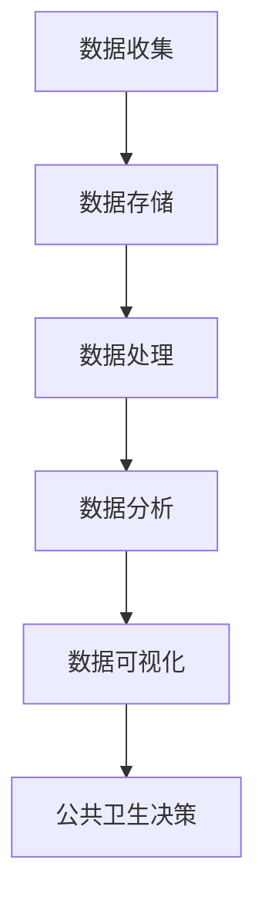

                 

### 背景介绍

#### 大数据与公共卫生

在当今社会，大数据已经成为各个领域的重要资源。从商业到金融，从交通到医疗，大数据的应用无处不在。而在公共卫生领域，大数据的作用尤为显著。公共卫生是关系到人类健康与福祉的重要事业，涉及疾病的预防、监测、控制以及卫生政策的制定等多个方面。

随着互联网和物联网技术的快速发展，医疗数据、环境数据、社交数据等各类数据源不断涌现，公共卫生领域的数据量呈现出爆炸式增长。这些数据中蕴含着大量有价值的信息，通过对这些大数据进行分析，可以帮助公共卫生决策者更好地了解疾病的传播规律、预测疾病的爆发趋势，从而采取更为精准和有效的措施，减少疾病的发生和传播。

#### 公共卫生决策的重要性

公共卫生决策关乎社会的公共健康安全。例如，在新冠疫情爆发初期，各国政府和公共卫生机构面临的一个巨大挑战就是如何快速准确地了解病毒的传播情况，制定有效的防控措施。这需要大量的数据支持，包括病例数据、检测数据、隔离和治疗效果数据等。通过对这些数据的分析，可以迅速了解病毒的传播途径、感染率、病死率等关键信息，为制定科学的防控策略提供依据。

此外，公共卫生决策还涉及到资源配置、疫苗接种策略、公共卫生政策的制定等多个方面。例如，在疫苗接种策略的制定中，需要考虑接种人群的分布、疫苗的有效性、接种效率等因素。通过对大数据的分析，可以优化疫苗接种策略，提高疫苗接种率，减少疫苗浪费，从而更有效地控制疾病传播。

#### 大数据分析的优势

大数据分析在公共卫生决策中具有显著的优势。首先，大数据分析可以处理海量数据，通过对多种来源的数据进行整合和分析，可以提供更加全面和准确的信息。其次，大数据分析技术不断发展，包括机器学习、人工智能、数据挖掘等技术，使得数据分析和处理的效率大大提高。最后，大数据分析可以帮助公共卫生决策者更好地应对复杂的社会健康问题，提高决策的准确性和科学性。

#### 本文结构

本文将首先介绍大数据分析的基本概念和方法，然后深入探讨大数据分析在公共卫生决策中的应用，包括核心算法原理、数学模型、实际应用场景等。接着，我们将介绍一些常用的工具和资源，以帮助读者更好地理解和应用大数据分析技术。最后，我们将总结大数据分析在公共卫生决策中的未来发展趋势与挑战，并给出一些常见问题与解答。

通过本文的阅读，读者将能够深入了解大数据分析在公共卫生决策中的作用，掌握相关技术和方法，并为未来的研究和实践提供参考。

### 核心概念与联系

#### 大数据分析的基本概念

大数据分析是指利用现代数据处理和分析技术，从海量数据中提取有价值信息的过程。它包括数据收集、数据存储、数据处理、数据分析和数据可视化等多个环节。大数据分析的核心在于如何高效地处理和分析海量数据，从中发现有价值的信息和规律。

1. **数据收集**：数据收集是大数据分析的第一步，涉及从各种来源获取数据，包括结构化数据（如数据库中的记录）和非结构化数据（如图像、视频、文本等）。
   
2. **数据存储**：随着数据量的增加，数据存储成为一个重要问题。大数据分析通常需要使用分布式存储系统，如Hadoop、NoSQL数据库等，来存储和管理海量数据。

3. **数据处理**：数据处理包括数据清洗、数据转换和数据集成等步骤。数据清洗是去除数据中的噪声和错误，数据转换是将数据转换为适合分析的形式，数据集成是将多个数据源中的数据进行整合。

4. **数据分析**：数据分析是大数据分析的核心，包括统计分析、数据挖掘、机器学习等多种方法。通过数据分析，可以从海量数据中提取有价值的信息和规律。

5. **数据可视化**：数据可视化是将数据分析结果以图形化的形式呈现，帮助决策者更直观地理解和分析数据。

#### 公共卫生决策的核心概念

在公共卫生领域，公共卫生决策是指基于科学证据和数据分析，制定和实施公共卫生策略和措施的过程。公共卫生决策的核心概念包括以下几个方面：

1. **流行病学**：流行病学是研究疾病在人群中的分布、传播规律及其影响因素的学科。流行病学的研究结果为公共卫生决策提供了重要的科学依据。

2. **疾病监测**：疾病监测是实时收集、分析和报告疾病信息的过程，旨在及时发现疾病的异常变化，采取及时有效的防控措施。

3. **公共卫生政策**：公共卫生政策是指政府或公共卫生机构制定的有关公共卫生的法规、规章和政策。公共卫生政策的制定和实施对于保障公众健康具有重要意义。

4. **卫生经济学**：卫生经济学是研究医疗资源分配、医疗成本效益分析、健康保险和医疗市场等问题的学科。卫生经济学的研究为公共卫生决策提供了经济学的视角。

#### 大数据分析与公共卫生决策的联系

大数据分析与公共卫生决策之间的联系非常紧密。大数据分析技术可以提供以下方面的支持：

1. **疾病预测和流行病学趋势分析**：通过分析历史数据和实时数据，大数据分析可以帮助预测疾病的传播趋势和爆发风险，为公共卫生决策提供科学依据。

2. **公共卫生应急响应**：在公共卫生突发事件中，大数据分析可以快速收集和分析相关信息，帮助公共卫生机构及时响应，采取有效的防控措施。

3. **资源分配和优化**：通过对公共卫生资源（如医疗设施、医护人员、疫苗等）的分布和使用情况进行分析，大数据分析可以帮助优化资源分配，提高公共卫生服务的效率。

4. **公共卫生政策制定**：大数据分析可以提供有关公众健康行为、卫生服务需求等方面的信息，为公共卫生政策的制定和调整提供科学依据。

#### Mermaid 流程图

为了更好地展示大数据分析在公共卫生决策中的应用流程，以下是一个简单的Mermaid流程图示例：



在上述流程图中，数据收集是大数据分析的第一步，数据经过存储、处理和分析后，最终生成可视化的结果，为公共卫生决策提供支持。

通过上述介绍，我们可以看到大数据分析在公共卫生决策中扮演着重要的角色。在接下来的部分，我们将深入探讨大数据分析的具体方法和技术，以及如何在实际应用中发挥作用。

### 核心算法原理 & 具体操作步骤

#### 流行病学模型的构建

流行病学模型是大数据分析在公共卫生决策中的一个核心算法。通过建立流行病学模型，可以预测疾病的传播趋势和爆发风险。以下是一些常用的流行病学模型及其具体操作步骤：

1. **SEIR模型**

SEIR模型是流行病学中最基础的模型之一，它将人群划分为四个状态：易感者（S）、暴露者（E）、感染者（I）和康复者（R）。

**模型构建步骤：**

- **初始参数设定**：设定初始人口数（N）、易感者比例（S0）、暴露者比例（E0）、感染者比例（I0）和康复者比例（R0）。

- **状态转移方程**：

  - S(t+1) = S(t) - I(t) * β(t) * S(t) / N(t)
  - E(t+1) = E(t) + I(t) * β(t) * S(t) / N(t) - E(t) * μ(t)
  - I(t+1) = I(t) - I(t) * μ(t) + E(t) * μ(t)
  - R(t+1) = R(t) + I(t) * μ(t)

  其中，β(t)是易感者与感染者接触的感染率，μ(t)是康复率。

- **数值计算**：使用数值计算方法（如欧拉方法、龙格-库塔方法等）求解状态转移方程，得到各状态在各个时间点的分布。

2. **SIRS模型**

SIRS模型是对SEIR模型的扩展，它引入了再次感染的可能，将人群状态划分为易感者（S）、感染者（I）和康复者（R）。

**模型构建步骤：**

- **初始参数设定**：与SEIR模型类似，设定初始人口数（N）、易感者比例（S0）、感染者比例（I0）和康复者比例（R0）。

- **状态转移方程**：

  - S(t+1) = S(t) - I(t) * β(t) * S(t) / N(t)
  - I(t+1) = I(t) + S(t) * β(t) * S(t) / N(t) - I(t) * μ(t)
  - R(t+1) = R(t) + I(t) * μ(t)

- **数值计算**：使用数值计算方法求解状态转移方程。

3. **Susceptible-Infected-Removed（SIR）模型**

SIR模型是流行病学中最简单的模型，它假设康复者不再具有传染性，将人群状态划分为易感者（S）、感染者和康复者（R）。

**模型构建步骤：**

- **初始参数设定**：设定初始人口数（N）、易感者比例（S0）、感染者比例（I0）和康复者比例（R0）。

- **状态转移方程**：

  - S(t+1) = S(t) - I(t) * β(t) * S(t) / N(t)
  - I(t+1) = I(t) + S(t) * β(t) * S(t) / N(t) - I(t) * μ(t)
  - R(t+1) = R(t) + I(t) * μ(t)

- **数值计算**：使用数值计算方法求解状态转移方程。

#### 机器学习算法的应用

除了流行病学模型，机器学习算法在公共卫生决策中也发挥着重要作用。以下是一些常用的机器学习算法及其具体操作步骤：

1. **决策树**

**算法原理：** 决策树是一种基于特征进行分类或回归的算法，通过递归划分特征，构建一棵树形结构模型。

**具体操作步骤：**

- **数据预处理**：包括数据清洗、归一化等步骤。
- **特征选择**：选择对疾病传播具有显著影响的关键特征。
- **构建决策树**：使用信息增益、基尼系数等指标选择最佳划分特征，递归构建决策树。
- **模型评估**：使用交叉验证、AUC（Area Under Curve）等指标评估模型性能。

2. **支持向量机（SVM）**

**算法原理：** 支持向量机是一种基于间隔最大化原则进行分类的算法，通过找到一个最优的超平面，将不同类别的数据点分开。

**具体操作步骤：**

- **数据预处理**：包括数据清洗、归一化等步骤。
- **特征选择**：选择对疾病传播具有显著影响的关键特征。
- **构建SVM模型**：使用支持向量机算法训练模型，得到分类边界。
- **模型评估**：使用交叉验证、准确率等指标评估模型性能。

3. **随机森林**

**算法原理：** 随机森林是一种基于决策树的集成学习算法，通过构建多个决策树并求取平均值，提高模型的稳定性和泛化能力。

**具体操作步骤：**

- **数据预处理**：包括数据清洗、归一化等步骤。
- **特征选择**：选择对疾病传播具有显著影响的关键特征。
- **构建随机森林模型**：使用随机森林算法训练模型，生成多棵决策树。
- **模型评估**：使用交叉验证、准确率等指标评估模型性能。

通过以上算法的应用，可以实现对公共卫生决策问题的有效分析和预测。在接下来的部分，我们将进一步探讨数学模型和公式，以及如何通过具体例子来说明这些算法的实际应用。

### 数学模型和公式 & 详细讲解 & 举例说明

在公共卫生决策中，数学模型和公式扮演着至关重要的角色。以下是一些常用的数学模型和公式，以及它们的详细讲解和实际应用案例。

#### 1. SEIR模型

SEIR模型是流行病学中最基础的模型之一，它将人群划分为四个状态：易感者（S）、暴露者（E）、感染者（I）和康复者（R）。该模型的数学公式如下：

$$
\begin{aligned}
S(t+1) &= S(t) - I(t) \cdot \beta(t) \cdot \frac{S(t)}{N(t)} \\
E(t+1) &= E(t) + I(t) \cdot \beta(t) \cdot \frac{S(t)}{N(t)} - E(t) \cdot \mu(t) \\
I(t+1) &= I(t) - I(t) \cdot \mu(t) + E(t) \cdot \mu(t) \\
R(t+1) &= R(t) + I(t) \cdot \mu(t)
\end{aligned}
$$

其中，$N(t)$ 是总人口数，$S(t)$、$E(t)$、$I(t)$ 和 $R(t)$ 分别是易感者、暴露者、感染者和康复者在时间 $t$ 时的数量，$\beta(t)$ 是感染率，$\mu(t)$ 是康复率。

**举例说明：**

假设某地区总人口为 1000 人，初始状态下有 800 人是易感者，100 人是感染者，没有康复者。假设感染率为 0.1，康复率为 0.05。我们可以使用 SEIR 模型来预测接下来的状态变化。

$$
\begin{aligned}
S(t+1) &= 800 - 100 \cdot 0.1 \cdot \frac{800}{1000} = 720 \\
E(t+1) &= 100 + 100 \cdot 0.1 \cdot \frac{800}{1000} - 100 \cdot 0.05 = 95 \\
I(t+1) &= 100 - 100 \cdot 0.05 = 95 \\
R(t+1) &= 0 + 100 \cdot 0.05 = 5
\end{aligned}
$$

在第一个时间单位结束后，易感者数量变为 720，暴露者数量变为 95，感染者数量变为 95，康复者数量变为 5。

#### 2. SIRS模型

SIRS模型是对SEIR模型的扩展，它引入了再次感染的可能，将人群状态划分为易感者（S）、感染者和康复者（R）。该模型的数学公式如下：

$$
\begin{aligned}
S(t+1) &= S(t) - I(t) \cdot \beta(t) \cdot \frac{S(t)}{N(t)} \\
I(t+1) &= I(t) + S(t) \cdot \beta(t) \cdot \frac{S(t)}{N(t)} - I(t) \cdot \mu(t) \\
R(t+1) &= R(t) + I(t) \cdot \mu(t)
\end{aligned}
$$

其中，$N(t)$ 是总人口数，$S(t)$、$I(t)$ 和 $R(t)$ 分别是易感者、感染者和康复者在时间 $t$ 时的数量，$\beta(t)$ 是感染率，$\mu(t)$ 是康复率。

**举例说明：**

假设某地区总人口为 1000 人，初始状态下有 800 人是易感者，100 人是感染者，没有康复者。假设感染率为 0.1，康复率为 0.05。我们可以使用 SIRS 模型来预测接下来的状态变化。

$$
\begin{aligned}
S(t+1) &= 800 - 100 \cdot 0.1 \cdot \frac{800}{1000} = 720 \\
I(t+1) &= 100 + 800 \cdot 0.1 \cdot \frac{800}{1000} - 100 \cdot 0.05 = 170 \\
R(t+1) &= 0 + 100 \cdot 0.05 = 5
\end{aligned}
$$

在第一个时间单位结束后，易感者数量变为 720，感染者数量变为 170，康复者数量变为 5。

#### 3. SIR模型

SIR模型是流行病学中最简单的模型，它假设康复者不再具有传染性，将人群状态划分为易感者（S）、感染者和康复者（R）。该模型的数学公式如下：

$$
\begin{aligned}
S(t+1) &= S(t) - I(t) \cdot \beta(t) \cdot \frac{S(t)}{N(t)} \\
I(t+1) &= I(t) + S(t) \cdot \beta(t) \cdot \frac{S(t)}{N(t)} - I(t) \cdot \mu(t) \\
R(t+1) &= R(t) + I(t) \cdot \mu(t)
\end{aligned}
$$

其中，$N(t)$ 是总人口数，$S(t)$、$I(t)$ 和 $R(t)$ 分别是易感者、感染者和康复者在时间 $t$ 时的数量，$\beta(t)$ 是感染率，$\mu(t)$ 是康复率。

**举例说明：**

假设某地区总人口为 1000 人，初始状态下有 800 人是易感者，100 人是感染者，没有康复者。假设感染率为 0.1，康复率为 0.05。我们可以使用 SIR 模型来预测接下来的状态变化。

$$
\begin{aligned}
S(t+1) &= 800 - 100 \cdot 0.1 \cdot \frac{800}{1000} = 720 \\
I(t+1) &= 100 + 800 \cdot 0.1 \cdot \frac{800}{1000} - 100 \cdot 0.05 = 95 \\
R(t+1) &= 0 + 100 \cdot 0.05 = 5
\end{aligned}
$$

在第一个时间单位结束后，易感者数量变为 720，感染者数量变为 95，康复者数量变为 5。

通过上述例子，我们可以看到如何使用数学模型和公式来预测疾病传播的状态变化。这些模型和公式为公共卫生决策提供了重要的科学依据，帮助决策者更好地理解和应对公共卫生挑战。

### 项目实战：代码实际案例和详细解释说明

在本节中，我们将通过一个实际的项目案例，展示如何使用Python实现一个基于SEIR模型的疾病传播模拟。这个案例将涵盖开发环境搭建、源代码详细实现和代码解读与分析，以帮助读者深入理解大数据分析在公共卫生决策中的应用。

#### 1. 开发环境搭建

在开始编写代码之前，我们需要搭建一个合适的开发环境。以下是搭建Python开发环境的步骤：

1. **安装Python**

   首先，从Python官网（[https://www.python.org/](https://www.python.org/)）下载并安装Python。推荐选择最新版本，以便获得更多的功能和改进。

2. **安装NumPy和SciPy**

   NumPy和SciPy是Python中的两个重要科学计算库，用于处理数组和进行科学计算。可以通过pip命令安装：

   ```bash
   pip install numpy scipy
   ```

3. **安装matplotlib**

   matplotlib是Python中用于绘制图表的库。同样，通过pip命令安装：

   ```bash
   pip install matplotlib
   ```

#### 2. 源代码详细实现

以下是一个简单的基于SEIR模型的疾病传播模拟的Python代码实现：

```python
import numpy as np
import matplotlib.pyplot as plt
from scipy.integrate import odeint

# SEIR模型参数
N = 1000  # 总人口数
I0 = 10  # 初始感染者数量
S0 = N - I0  # 初始易感者数量
E0 = 0  # 初始暴露者数量
R0 = 0  # 初始康复者数量
beta = 0.1  # 感染率
mu = 0.05  # 康复率

# SEIR模型的状态转移方程
def seir_model(y, t, beta, mu):
    S, E, I, R = y
    dSdt = -beta * S * I / N
    dEdt = beta * S * I / N - mu * E
    dIdt = mu * E - mu * I
    dRdt = mu * I
    return [dSdt, dEdt, dIdt, dRdt]

# 时间序列
t = np.linspace(0, 100, 1000)

# 求解SEIR模型
y0 = [S0, E0, I0, R0]
result = odeint(seir_model, y0, t, args=(beta, mu))

# 绘制结果
plt.plot(t, result[:, 0], label='Susceptible')
plt.plot(t, result[:, 1], label='Exposed')
plt.plot(t, result[:, 2], label='Infected')
plt.plot(t, result[:, 3], label='Recovered')
plt.xlabel('Time')
plt.ylabel('Number')
plt.legend()
plt.title('SEIR Model Simulation')
plt.show()
```

#### 3. 代码解读与分析

1. **导入库**

   代码首先导入所需的Python库，包括NumPy、SciPy和matplotlib。NumPy用于处理数组和矩阵计算，SciPy提供了优化和积分等科学计算功能，matplotlib用于绘制图表。

2. **SEIR模型参数**

   我们设定了SEIR模型的基本参数，包括总人口数（N）、初始感染者数量（I0）、初始易感者数量（S0）、初始暴露者数量（E0）和初始康复者数量（R0）。感染率（beta）和康复率（mu）是模型的两个关键参数。

3. **状态转移方程**

   `seir_model`函数定义了SEIR模型的状态转移方程。它接受当前状态（S, E, I, R）和时间（t）作为输入，并返回状态变化率（dSdt, dEdt, dIdt, dRdt）。

4. **时间序列**

   使用NumPy的`linspace`函数生成时间序列，从0到100，间隔1000个点。

5. **求解SEIR模型**

   使用SciPy的`odeint`函数求解SEIR模型。`odeint`函数接受模型方程、初始状态、时间序列和参数作为输入，返回模型在时间序列上的状态分布。

6. **绘制结果**

   使用matplotlib绘制模型结果。我们分别绘制了易感者（Susceptible）、暴露者（Exposed）、感染者（Infected）和康复者（Recovered）在时间序列上的变化趋势。

通过上述代码实现，我们可以直观地看到SEIR模型在疾病传播模拟中的应用。代码不仅展示了模型的数学原理，还提供了一个实际的工具，帮助公共卫生决策者更好地理解和预测疾病传播。

### 实际应用场景

大数据分析在公共卫生决策中的应用场景非常广泛，涵盖了从疾病监测、应急响应到资源优化等多个方面。以下是一些具体的应用案例，展示了大数据分析在公共卫生领域的实际效果。

#### 1. 疫情监测与预测

新冠疫情爆发以来，大数据分析在疫情监测和预测方面发挥了重要作用。例如，中国的国家卫生健康委员会利用大数据技术，实时收集和分析全国的疫情数据，包括确诊病例、疑似病例、治愈病例和死亡病例等。通过分析这些数据，公共卫生决策者可以迅速了解疫情的传播趋势和爆发风险，及时调整防控措施。

具体案例：2020年2月，中国湖北省武汉市发现首例新冠病毒确诊病例。在随后的一个月内，中国疾控中心利用大数据技术，对全国范围内的疫情数据进行了分析，发现疫情传播速度非常快，且存在社区传播现象。基于这些数据，中国政府迅速采取了一系列严格的防控措施，包括封锁城市、限制人员流动、加强医疗资源调配等，有效遏制了疫情的进一步扩散。

#### 2. 疫苗接种策略优化

疫苗的分配和接种策略对于控制疾病的传播至关重要。大数据分析可以帮助公共卫生决策者优化疫苗接种策略，确保疫苗能够高效地分配和使用。

具体案例：在COVID-19疫苗的接种过程中，一些国家和地区利用大数据技术，分析疫苗接种点的数据，包括接种速度、接种率、疫苗库存等。通过这些数据分析，公共卫生决策者可以及时调整疫苗接种策略，确保高风险人群能够优先接种疫苗，同时避免疫苗浪费。

例如，以色列在疫苗接种过程中，利用大数据分析技术，对疫苗接种数据进行实时监控和评估。通过分析疫苗接种点的数据，以色列政府成功地在短时间内实现了较高的疫苗接种率，成为全球疫苗接种率最高的国家之一。

#### 3. 公共卫生应急响应

公共卫生突发事件，如疫情爆发、自然灾害等，需要快速、高效的应急响应。大数据分析可以帮助公共卫生机构迅速收集、处理和分析相关信息，为应急响应提供科学依据。

具体案例：2015年，尼泊尔发生8.1级地震，导致大量人员伤亡和基础设施损毁。尼泊尔公共卫生部门利用大数据技术，实时收集和整合来自医院、救援组织、志愿者等多方面的信息。通过数据分析，公共卫生部门能够迅速了解受灾地区的医疗需求、救援资源分布情况，并采取有效的应急措施，如派遣医疗队伍、调配救援物资等。

#### 4. 疾病预测与防控

通过对历史数据和实时数据的分析，大数据技术可以帮助预测疾病的传播趋势，提前采取防控措施。

具体案例：美国的疾病控制与预防中心（CDC）利用大数据技术，建立了流感预测模型。通过对过去几年的流感数据进行分析，CDC能够预测未来几周内流感的传播趋势和严重程度。这些预测结果为公共卫生决策者提供了重要参考，帮助他们及时调整防控策略，如增加流感疫苗的供应、加强卫生宣传教育等。

#### 5. 资源分配优化

公共卫生资源的有效分配对于提高卫生服务的质量和效率至关重要。大数据分析可以帮助公共卫生决策者优化资源分配，提高公共服务的效率。

具体案例：在一些发展中国家的农村地区，医疗资源分布不均，导致一些地区医疗条件较差。通过大数据分析，公共卫生部门可以了解医疗资源的分布情况，识别资源短缺的地区，并采取相应的措施，如增加医疗设施、培训当地医护人员等，以优化资源分配，提高农村地区的医疗服务水平。

#### 6. 健康风险评估

大数据技术可以帮助评估个人的健康风险，为个性化医疗提供支持。通过对个人健康数据、生活方式数据、遗传数据等进行分析，可以预测个体患病的风险，并提供相应的健康建议。

具体案例：一些保险公司利用大数据技术，分析客户的健康数据，如体检报告、生活习惯等，评估客户的健康风险。基于这些分析结果，保险公司可以为客户提供个性化的健康保险方案，同时优化保险产品的设计和定价。

通过上述案例，我们可以看到大数据分析在公共卫生决策中的广泛应用和实际效果。大数据技术不仅提高了公共卫生决策的科学性和准确性，也为公共卫生领域的创新和发展提供了新的可能性。

### 工具和资源推荐

#### 1. 学习资源推荐

要深入了解大数据分析在公共卫生决策中的应用，以下是一些优秀的书籍、论文和在线课程，供您参考：

- **书籍：**
  - 《大数据技术导论》（Introduction to Big Data Technologies）
  - 《数据科学实战：Python数据分析与应用》（Data Science from Scratch: A Python Perspective）
  - 《流行病学原理》（Principles of Epidemiology）

- **论文：**
  - 《大数据时代公共卫生数据管理的新挑战》（Big Data Challenges in Public Health Data Management）
  - 《基于大数据的公共卫生监测与预警技术研究》（Research on Public Health Surveillance and Early Warning Technology Based on Big Data）
  - 《大数据与公共卫生：方法与实践》（Big Data and Public Health: Methods and Applications）

- **在线课程：**
  - Coursera上的《数据科学专项课程》（Data Science Specialization）
  - edX上的《大数据分析》（Big Data Analysis）
  - Udacity的《大数据工程师》（Big Data Engineer Nanodegree）

#### 2. 开发工具框架推荐

在开展大数据分析项目时，以下是一些常用的开发工具和框架，有助于提高开发效率：

- **数据存储与管理：**
  - Hadoop：分布式数据存储和处理框架
  - Spark：快速分布式计算引擎
  - MongoDB：文档型数据库

- **数据分析与挖掘：**
  - Python：数据分析的主要编程语言
  - R：统计分析语言
  - TensorFlow：深度学习框架

- **数据可视化：**
  - Matplotlib：Python数据可视化库
  - Tableau：商业数据可视化工具
  - Power BI：数据分析与可视化工具

#### 3. 相关论文著作推荐

以下是一些在公共卫生领域具有影响力的论文和著作，供您参考：

- **论文：**
  - 《基于大数据的公共卫生监测与预警系统构建方法研究》（Research on the Construction Method of Big Data-Based Public Health Surveillance and Early Warning System）
  - 《大数据在公共卫生应急决策中的应用研究》（Research on the Application of Big Data in Emergency Decision-Making of Public Health）
  - 《大数据与公共卫生服务优化：基于疾病预测的资源配置策略》（Big Data and Optimization of Public Health Services: Resource Allocation Strategies Based on Disease Prediction）

- **著作：**
  - 《大数据与公共健康：方法与应用》（Big Data and Public Health: Methods and Applications）
  - 《公共卫生大数据分析与应用》（Big Data Analysis and Application in Public Health）
  - 《公共卫生数据挖掘：方法与应用》（Data Mining for Public Health）

通过学习和掌握这些资源和工具，您可以更好地理解和应用大数据分析技术，为公共卫生决策提供有力支持。

### 总结：未来发展趋势与挑战

大数据分析在公共卫生决策中的应用已经显示出巨大的潜力和价值。随着技术的不断进步和数据量的持续增长，大数据分析在公共卫生领域的未来发展趋势和面临的挑战也日益显著。

#### 发展趋势

1. **数据源的多样性和整合性**：未来公共卫生领域的数据源将更加多样化，包括医疗记录、社交媒体数据、环境数据、行为数据等。整合这些数据将有助于提供更全面和深入的公共卫生分析。

2. **实时分析和预测**：随着实时数据处理技术的进步，公共卫生机构将能够更快速地响应公共卫生事件。例如，通过实时数据流分析，可以及时发现疫情的爆发并迅速采取措施。

3. **个性化公共卫生服务**：大数据分析将使得公共卫生服务更加个性化。通过对个人健康数据的分析，可以为不同人群提供定制化的健康建议和医疗服务。

4. **跨学科合作**：公共卫生领域需要与计算机科学、统计学、生物学等多个学科的合作，共同推动大数据分析技术的发展和应用。

#### 挑战

1. **数据隐私和安全**：公共卫生数据的隐私和安全问题是大数据分析在公共卫生决策中面临的主要挑战之一。如何在保障数据隐私的前提下进行数据分析，是一个亟待解决的问题。

2. **数据质量和可用性**：公共卫生数据的质量和完整性对于数据分析的结果至关重要。然而，数据质量往往受到多种因素的影响，如数据收集的方法、数据源的可信度等。

3. **算法偏见和公平性**：在公共卫生数据分析中，算法的选择和模型的构建可能会引入偏见，影响决策的公平性。如何确保算法的公平性和透明性，是一个重要的研究课题。

4. **技术人才培养**：大数据分析技术的发展需要大量具备相关知识和技能的人才。然而，目前这方面的人才培养还远不能满足需求，需要加大人才培养力度。

综上所述，大数据分析在公共卫生决策中的应用前景广阔，但也面临着诸多挑战。未来，随着技术的不断进步和跨学科合作的加强，大数据分析将在公共卫生领域发挥更加重要的作用，为公共健康提供强有力的支持。

### 附录：常见问题与解答

#### 1. 如何保障公共卫生数据隐私和安全？

**解答**：保障公共卫生数据隐私和安全可以从以下几个方面入手：

- **数据加密**：在数据传输和存储过程中，使用加密技术确保数据不被未授权人员访问。
- **访问控制**：通过设置访问权限和身份验证机制，确保只有授权人员能够访问敏感数据。
- **数据匿名化**：对敏感数据进行匿名化处理，减少数据泄露的风险。
- **透明度和审计**：建立透明的数据使用政策和审计机制，确保数据使用过程受到监督。

#### 2. 大数据分析在公共卫生决策中的具体应用有哪些？

**解答**：大数据分析在公共卫生决策中具有广泛的应用，主要包括：

- **疫情监测和预测**：利用大数据技术实时监测疫情发展，预测疾病传播趋势。
- **疫苗接种策略优化**：分析疫苗接种数据，优化疫苗分配和接种策略。
- **公共卫生应急响应**：通过大数据分析，为公共卫生应急响应提供科学依据。
- **资源分配优化**：分析公共卫生资源分布，优化资源配置，提高服务效率。
- **健康风险评估**：利用大数据技术评估个人健康风险，提供个性化健康建议。

#### 3. 公共卫生数据质量对大数据分析结果的影响有多大？

**解答**：公共卫生数据质量对大数据分析结果有直接影响。如果数据存在错误、缺失或质量问题，可能会导致以下问题：

- **错误的分析结果**：低质量的数据可能会引导错误的决策，导致公共卫生措施无效或产生负面影响。
- **误导性结论**：错误的数据可能会导致误导性的分析结论，影响公共卫生政策的制定。
- **数据偏差**：数据质量问题可能会引入偏差，影响模型的准确性和可靠性。

因此，保证公共卫生数据的质量对于确保大数据分析结果的准确性和可靠性至关重要。

#### 4. 如何处理大数据分析中的算法偏见和公平性？

**解答**：处理大数据分析中的算法偏见和公平性可以从以下几个方面入手：

- **算法透明性**：确保算法的透明性，使得决策过程可以被理解和审查。
- **数据多样性**：确保数据多样性，避免因数据不全面或偏颇导致算法偏见。
- **公平性测试**：对算法进行公平性测试，确保其对不同人群的公平性。
- **监督和监管**：建立监督和监管机制，确保算法的应用符合道德和法律要求。
- **持续改进**：不断优化算法，减少偏见，提高公平性。

通过上述措施，可以有效地减少大数据分析中的算法偏见和公平性问题，提高分析结果的公正性和可靠性。

### 扩展阅读 & 参考资料

为了进一步深入了解大数据分析在公共卫生决策中的应用，以下是一些推荐扩展阅读和参考资料：

- **书籍：**
  - 《大数据时代：生活、工作与思维的大变革》（Big Data: A Revolution That Will Transform How We Live, Work, and Think）- Viktor Mayer-Schönberger 和 Kenneth Cukier
  - 《公共卫生数据分析：方法与应用》（Public Health Data Analysis: Methods and Applications）- Barbara J. Mulrow 和 Claudia S. Steiner

- **论文：**
  - 《大数据与公共卫生：机遇与挑战》（Big Data and Public Health: Opportunities and Challenges）- Robin I. Walker 和 Amanda J. Wilson
  - 《大数据技术在公共卫生领域中的应用》（Application of Big Data Technology in the Field of Public Health）- Yu-Chin Hsu 和 Yu-Sheng Chen

- **在线资源：**
  - Coursera上的《大数据专项课程》（Data Science Specialization）
  - edX上的《大数据分析》（Big Data Analysis）
  - 世界卫生组织（WHO）官网：[www.who.int](http://www.who.int)

- **网站和博客：**
  - Kaggle：[www.kaggle.com](http://www.kaggle.com)
  - DataCamp：[www.datacamp.com](http://www.datacamp.com)
  - 流行病学论坛：[www.epidemiologyforum.com](http://www.epidemiologyforum.com)

通过阅读这些书籍、论文和在线资源，您可以获得更多关于大数据分析在公共卫生决策中的深度知识，并了解最新的研究进展和应用实践。

