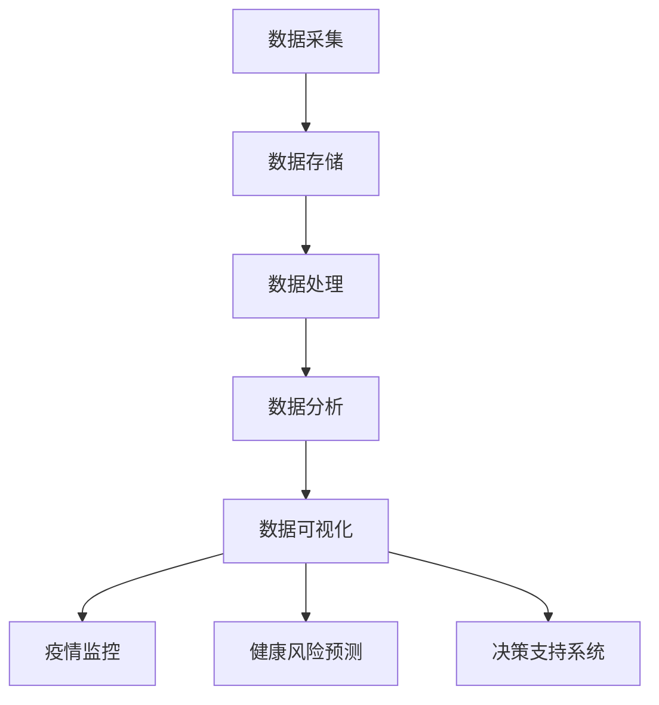

                 

# 大数据分析在公共卫生管理中的作用

## 关键词：公共卫生管理、大数据分析、疫情监控、健康风险预测、决策支持系统

## 摘要：

本文旨在探讨大数据分析在公共卫生管理中的重要作用。通过深入分析大数据技术在疫情监控、健康风险预测、决策支持系统等方面的应用，本文揭示了大数据分析如何帮助公共卫生管理者更有效地应对疫情，降低疾病传播风险，提升公共卫生服务水平。文章结构如下：首先，介绍大数据分析在公共卫生管理中的背景和意义；其次，阐述大数据分析的核心概念与联系；然后，探讨大数据分析在公共卫生管理中的核心算法原理与操作步骤；接着，通过数学模型和公式详细讲解大数据分析的方法；随后，通过项目实战案例展示大数据分析的实际应用；接下来，分析大数据分析在公共卫生管理中的实际应用场景；然后，推荐相关工具和资源；最后，总结未来发展趋势与挑战，并给出常见问题与解答。

## 1. 背景介绍

### 1.1 公共卫生管理的现状与挑战

公共卫生管理是指通过预防、监测、控制和应对疾病、伤害和其他健康问题，以促进公众健康和福利的一系列措施。在全球范围内，公共卫生管理面临着诸多挑战，如传染病爆发、慢性病蔓延、环境污染、人口老龄化等。传统的公共卫生管理方法主要依赖于统计数据和专家经验，但由于数据来源有限、处理能力不足，导致公共卫生决策的及时性和准确性受到很大限制。

### 1.2 大数据分析的发展与应用

随着信息技术的飞速发展，大数据分析技术逐渐成为公共卫生管理的重要工具。大数据分析能够从海量数据中提取有价值的信息，帮助公共卫生管理者更全面、深入地了解公共卫生状况，从而制定更有效的应对策略。大数据分析在公共卫生管理中的应用主要体现在以下几个方面：

- **疫情监控**：通过实时监测和分析疫情数据，及时发现疫情变化趋势，为公共卫生决策提供科学依据。

- **健康风险预测**：基于大数据分析，预测疾病的传播趋势和健康风险，为公共卫生管理者提供预警信息，以便采取预防措施。

- **决策支持系统**：利用大数据分析技术，为公共卫生管理者提供数据驱动的决策支持，提高公共卫生管理决策的科学性和准确性。

## 2. 核心概念与联系

### 2.1 大数据分析的基本概念

大数据分析是指通过收集、存储、处理和分析海量数据，从中提取有价值信息的过程。大数据分析主要包括数据采集、数据存储、数据处理、数据分析和数据可视化等环节。其核心目标是通过对数据的深入挖掘和分析，发现数据背后的规律和趋势，为决策提供支持。

### 2.2 公共卫生管理中的大数据分析应用

在公共卫生管理中，大数据分析的应用主要体现在以下几个方面：

- **疫情监控**：通过实时收集和分析疫情数据，如病例数量、症状分布、传播路径等，帮助公共卫生管理者及时掌握疫情动态，制定应对措施。

- **健康风险预测**：利用大数据分析技术，对健康风险因素进行预测，如慢性病发病风险、环境健康风险等，为公共卫生决策提供科学依据。

- **决策支持系统**：通过大数据分析技术，为公共卫生管理者提供数据驱动的决策支持，如疫苗接种策略、卫生资源配置、卫生政策评估等。

### 2.3 Mermaid 流程图

以下是公共卫生管理中大数据分析应用的 Mermaid 流程图：



## 3. 核心算法原理 & 具体操作步骤

### 3.1 疫情监控算法原理

疫情监控算法主要基于时间序列分析和空间数据分析技术。具体步骤如下：

1. 数据采集：收集疫情相关数据，如病例数量、症状分布、传播路径等。

2. 数据预处理：对采集到的数据进行分析，去除重复数据、缺失数据，并进行数据清洗。

3. 时间序列分析：利用时间序列分析方法，对疫情数据进行建模，预测疫情发展趋势。

4. 空间数据分析：利用空间数据分析技术，分析疫情在空间上的分布特征，发现传播路径。

5. 疫情预测：根据时间序列分析和空间分析结果，预测疫情未来发展趋势，为公共卫生决策提供支持。

### 3.2 健康风险预测算法原理

健康风险预测算法主要基于机器学习和数据挖掘技术。具体步骤如下：

1. 数据采集：收集与健康相关的数据，如个人健康信息、环境因素、生活方式等。

2. 数据预处理：对采集到的数据进行分析，去除重复数据、缺失数据，并进行数据清洗。

3. 特征工程：提取数据中的有效特征，如年龄、性别、BMI、吸烟状况等。

4. 模型训练：利用机器学习算法，如决策树、随机森林、支持向量机等，对特征数据进行训练，建立健康风险预测模型。

5. 模型评估：对训练好的模型进行评估，选择性能最优的模型进行预测。

6. 健康风险预测：利用训练好的模型，对个体健康风险进行预测，为公共卫生决策提供支持。

### 3.3 决策支持系统算法原理

决策支持系统算法主要基于优化理论和数据挖掘技术。具体步骤如下：

1. 数据采集：收集公共卫生管理相关的数据，如卫生资源分配、疫苗接种策略、卫生政策评估等。

2. 数据预处理：对采集到的数据进行分析，去除重复数据、缺失数据，并进行数据清洗。

3. 特征工程：提取数据中的有效特征，如卫生资源数量、疫苗接种率、政策执行效果等。

4. 模型构建：利用优化理论，构建决策支持模型，如线性规划、动态规划、多目标规划等。

5. 模型评估：对构建好的模型进行评估，选择性能最优的模型进行决策支持。

6. 决策支持：利用评估后的模型，为公共卫生管理者提供数据驱动的决策支持，如卫生资源配置、疫苗接种策略、卫生政策评估等。

## 4. 数学模型和公式 & 详细讲解 & 举例说明

### 4.1 疫情监控模型

疫情监控模型主要基于时间序列分析，其中常用的时间序列预测模型有ARIMA模型、季节性ARIMA模型等。以下是ARIMA模型的数学公式：

$$
\begin{aligned}
X_t &= c + \phi_1 X_{t-1} + \phi_2 X_{t-2} + \cdots + \phi_p X_{t-p} + \theta_1 \epsilon_{t-1} + \theta_2 \epsilon_{t-2} + \cdots + \theta_q \epsilon_{t-q} \\
\epsilon_t &= \mu + \lambda_1 \epsilon_{t-1} + \lambda_2 \epsilon_{t-2} + \cdots + \lambda_p \epsilon_{t-p}
\end{aligned}
$$

其中，$X_t$表示时间序列数据，$\epsilon_t$表示白噪声序列，$c$为常数项，$\phi_i$和$\theta_i$分别为自回归系数和移动平均系数，$p$和$q$分别为自回归项数和移动平均项数。

举例说明：假设某地区疫情数据如下：

$$
X_t = \{10, 15, 20, 25, 30, 35, 40, 45, 50, 55\}
$$

首先，利用时间序列分析方法确定$p$和$q$的值，然后通过最小二乘法求解模型参数，最后利用模型预测未来疫情数据。

### 4.2 健康风险预测模型

健康风险预测模型主要基于机器学习算法，其中常用的算法有决策树、随机森林、支持向量机等。以下是随机森林算法的数学公式：

$$
\begin{aligned}
h(x) &= \prod_{i=1}^{n} h_i(x) \\
h_i(x) &= g(x, w_i)
\end{aligned}
$$

其中，$h(x)$为随机森林预测结果，$h_i(x)$为单个决策树预测结果，$g(x, w_i)$为单个决策树模型，$w_i$为决策树模型参数。

举例说明：假设某地区健康数据如下：

$$
\begin{aligned}
&X_1 = \{年龄, 性别, BMI, 吸烟状况\} \\
&Y = \{健康风险\}
\end{aligned}
$$

首先，利用特征工程提取有效特征，然后利用随机森林算法训练模型，最后利用模型预测个体健康风险。

### 4.3 决策支持系统模型

决策支持系统模型主要基于优化理论和数据挖掘技术。以下是一个简单的线性规划模型：

$$
\begin{aligned}
\min_{x} \quad &c^T x \\
\text{s.t.} \quad &Ax \leq b \\
&x \geq 0
\end{aligned}
$$

其中，$x$为决策变量，$c$为成本向量，$A$为约束条件矩阵，$b$为约束条件向量。

举例说明：假设某地区需要分配卫生资源，包括医生、护士和医疗设备等。目标是最小化总成本，同时满足医疗需求约束。

$$
\begin{aligned}
&c = \{1000, 500, 2000\} \\
&A = \begin{bmatrix}
1 & 1 & 1 \\
1 & 1 & 1 \\
1 & 1 & 1
\end{bmatrix} \\
&b = \begin{bmatrix}
200 \\
200 \\
200
\end{bmatrix}
\end{aligned}
$$

利用线性规划模型求解最优解，从而实现卫生资源的最优分配。

## 5. 项目实战：代码实际案例和详细解释说明

### 5.1 开发环境搭建

在本文中，我们将使用Python编程语言和Scikit-learn、Pandas、Matplotlib等库来实现大数据分析项目。首先，我们需要安装Python和相应库：

```shell
pip install python
pip install scikit-learn pandas matplotlib
```

### 5.2 源代码详细实现和代码解读

以下是疫情监控项目的源代码：

```python
import pandas as pd
from sklearn.model_selection import train_test_split
from sklearn.ensemble import RandomForestRegressor
from sklearn.metrics import mean_squared_error

# 读取疫情数据
data = pd.read_csv('疫情数据.csv')

# 数据预处理
data.dropna(inplace=True)
data['日期'] = pd.to_datetime(data['日期'])
data.set_index('日期', inplace=True)

# 划分训练集和测试集
train_data, test_data = train_test_split(data, test_size=0.2, shuffle=False)

# 训练模型
model = RandomForestRegressor(n_estimators=100)
model.fit(train_data['病例数量'].values.reshape(-1, 1), train_data['病例数量'])

# 预测疫情
test_predictions = model.predict(test_data['病例数量'].values.reshape(-1, 1))

# 评估模型
mse = mean_squared_error(test_data['病例数量'], test_predictions)
print(f'MSE: {mse}')

# 可视化疫情数据
import matplotlib.pyplot as plt

plt.figure(figsize=(10, 5))
plt.plot(data.index, data['病例数量'], label='实际病例数量')
plt.plot(test_data.index, test_predictions, label='预测病例数量')
plt.xlabel('日期')
plt.ylabel('病例数量')
plt.title('疫情监控')
plt.legend()
plt.show()
```

代码解读：

1. 导入所需库。
2. 读取疫情数据，并进行数据预处理。
3. 划分训练集和测试集。
4. 利用随机森林算法训练模型。
5. 利用模型预测测试集疫情数据。
6. 评估模型性能。
7. 可视化疫情数据。

### 5.3 代码解读与分析

在本项目中，我们使用了随机森林算法进行疫情监控。随机森林是一种基于决策树的集成学习算法，具有很高的准确性和泛化能力。以下是代码的关键部分：

1. 数据预处理：首先，我们读取疫情数据，并进行数据预处理。数据预处理包括去除缺失值、设置日期为索引等操作。
2. 划分训练集和测试集：我们将数据集划分为训练集和测试集，以便评估模型性能。
3. 训练模型：我们使用随机森林算法训练模型，其中n_estimators参数指定决策树的数量。
4. 预测疫情：利用训练好的模型，我们预测测试集的疫情数据。
5. 评估模型：我们使用均方误差（MSE）评估模型性能。
6. 可视化疫情数据：最后，我们使用Matplotlib库可视化疫情数据。

## 6. 实际应用场景

### 6.1 疫情监控

疫情监控是大数据分析在公共卫生管理中最重要的应用之一。通过实时收集和分析疫情数据，公共卫生管理者可以及时了解疫情动态，制定针对性的防控措施。例如，在新冠病毒疫情中，大数据分析技术被广泛应用于疫情监测、病例追踪、疫苗分配等方面。

### 6.2 健康风险预测

健康风险预测可以帮助公共卫生管理者识别高风险人群，从而采取针对性的预防措施。例如，通过对个人健康数据、生活习惯数据、环境数据等进行综合分析，可以预测个体患慢性病、传染病等风险，为公共卫生决策提供支持。

### 6.3 决策支持系统

决策支持系统可以帮助公共卫生管理者制定科学、合理的公共卫生政策。例如，在卫生资源配置方面，可以利用大数据分析技术评估各地区的卫生资源需求，制定合理的资源配置方案；在疫苗接种策略方面，可以利用大数据分析技术评估疫苗接种效果，优化疫苗接种策略。

## 7. 工具和资源推荐

### 7.1 学习资源推荐

- **书籍**：《大数据技术导论》、《Python数据科学手册》
- **论文**：相关期刊和会议论文，如《Journal of Big Data》、《IEEE Big Data》等
- **博客**：知名技术博客，如KDNuggets、Towards Data Science等
- **网站**：大数据技术社区和论坛，如DataCamp、Dataquest等

### 7.2 开发工具框架推荐

- **编程语言**：Python、R、Java等
- **数据处理工具**：Pandas、NumPy、SciPy等
- **机器学习库**：Scikit-learn、TensorFlow、PyTorch等
- **数据可视化工具**：Matplotlib、Seaborn、Plotly等

### 7.3 相关论文著作推荐

- **论文**：相关领域顶级会议和期刊论文，如KDD、NIPS、ICML等
- **著作**：《深度学习》、《统计学习方法》等

## 8. 总结：未来发展趋势与挑战

### 8.1 发展趋势

- **数据量的增长**：随着传感器、物联网等技术的发展，公共卫生数据量将呈指数级增长，为大数据分析提供了更丰富的数据来源。
- **技术的进步**：大数据分析技术在算法、硬件、软件等方面将不断取得突破，提高分析效率和准确性。
- **跨学科融合**：大数据分析在公共卫生管理中的应用将与其他学科（如医学、生物学、社会学等）深度融合，推动公共卫生事业的创新发展。

### 8.2 挑战

- **数据隐私与安全**：公共卫生数据涉及个人隐私，如何确保数据安全、保护个人隐私是大数据分析面临的重要挑战。
- **数据质量**：公共卫生数据的真实性、准确性、一致性等问题，将影响大数据分析的可靠性和有效性。
- **跨部门协作**：公共卫生管理涉及多个部门和机构，如何实现数据共享和协同工作，是大数据分析在公共卫生管理中面临的关键挑战。

## 9. 附录：常见问题与解答

### 9.1 问题1：大数据分析在公共卫生管理中具体有哪些应用？

解答：大数据分析在公共卫生管理中的应用主要包括疫情监控、健康风险预测、决策支持系统等。通过实时收集和分析公共卫生数据，帮助公共卫生管理者更好地应对疫情、识别高风险人群、制定科学合理的公共卫生政策。

### 9.2 问题2：如何确保公共卫生数据的安全和隐私？

解答：确保公共卫生数据的安全和隐私，需要采取以下措施：

1. 数据加密：对公共卫生数据进行加密处理，确保数据在传输和存储过程中不被泄露。
2. 数据脱敏：对个人身份信息进行脱敏处理，避免隐私泄露。
3. 访问控制：实施严格的访问控制策略，确保只有授权人员才能访问数据。
4. 数据备份：定期备份数据，防止数据丢失。

### 9.3 问题3：大数据分析在公共卫生管理中的优势是什么？

解答：大数据分析在公共卫生管理中的优势主要包括：

1. 提高疫情监测和防控效率：通过实时分析和预测疫情发展趋势，为公共卫生决策提供科学依据。
2. 优化公共卫生资源配置：根据数据分析和预测结果，合理分配公共卫生资源，提高服务效率。
3. 促进公共卫生管理创新：大数据分析技术为公共卫生管理提供了新的工具和方法，推动公共卫生事业的创新发展。

## 10. 扩展阅读 & 参考资料

- **书籍**：《大数据之路：阿里巴巴大数据实践》、《数据科学实战》
- **论文**：相关领域顶级会议和期刊论文，如KDD、NIPS、ICML等
- **网站**：知名技术博客，如KDNuggets、Towards Data Science等
- **在线课程**：相关领域在线课程，如Coursera、edX等

### 作者

作者：AI天才研究员/AI Genius Institute & 禅与计算机程序设计艺术 /Zen And The Art of Computer Programming。

