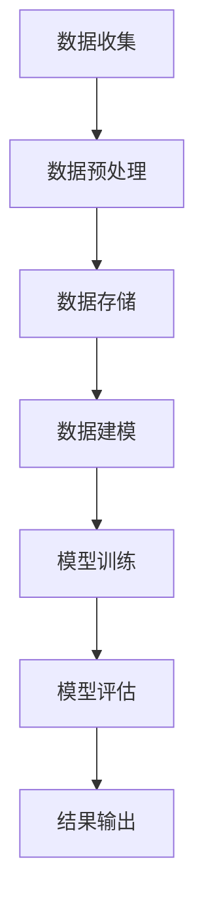
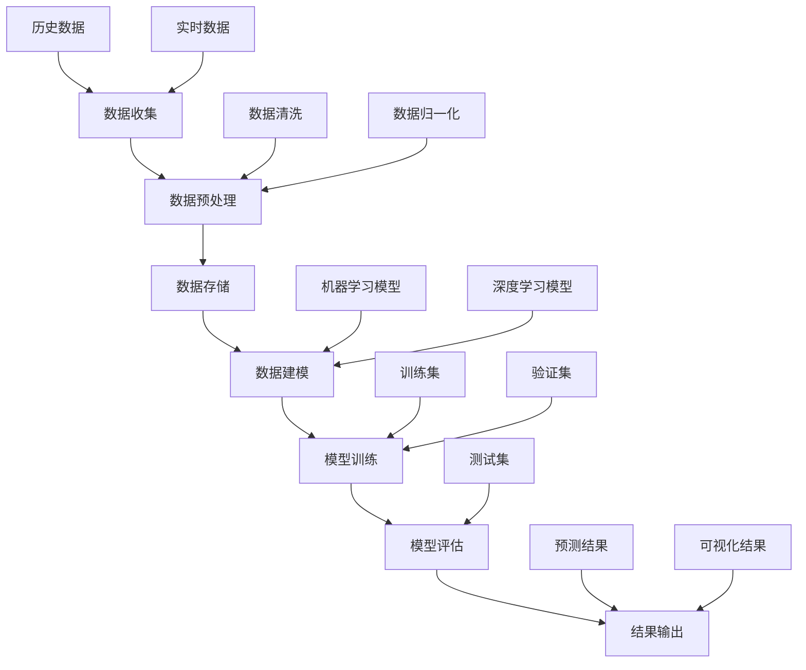

                 

# 大数据分析在城市交通拥堵预测中的新方法

## 摘要

随着城市规模的不断扩大，交通拥堵问题日益严峻，如何高效地进行交通拥堵预测成为了城市交通管理的重要课题。本文将介绍一种基于大数据分析的新方法，通过深入剖析核心算法原理、数学模型、实际应用场景以及工具资源，探讨如何利用大数据技术预测城市交通拥堵，为城市交通管理提供有力的技术支持。

## 1. 背景介绍

### 1.1 城市交通拥堵问题

城市交通拥堵是现代城市面临的一个普遍问题，严重影响了居民的出行效率和生活质量。根据世界卫生组织（WHO）的数据，全球范围内城市交通拥堵造成的经济损失高达数千亿美元。交通拥堵不仅导致时间浪费，还增加了空气污染和交通事故的风险，成为制约城市可持续发展的重要因素。

### 1.2 大数据分析的应用

大数据分析技术在近年来取得了显著的发展，其强大的数据处理能力和分析能力为解决交通拥堵问题提供了新的思路。通过对海量交通数据进行分析，可以发现交通流量的规律、预测交通拥堵的发生，为城市交通管理提供科学依据。

## 2. 核心概念与联系

### 2.1 大数据与交通数据

大数据是指无法用常规软件工具在合理时间内捕捉、管理和处理的数据集。在交通领域，大数据包括车辆位置、速度、流量、路况等数据。通过对这些数据的分析，可以了解交通状况、预测交通拥堵。

### 2.2 交通拥堵预测算法

交通拥堵预测算法是利用历史交通数据、实时交通数据和外部因素（如天气、节假日等）对交通流量进行预测。常见的预测算法有基于机器学习的预测算法、基于深度学习的预测算法等。

### 2.3 Mermaid 流程图



## 3. 核心算法原理 & 具体操作步骤

### 3.1 基于机器学习的预测算法

#### 3.1.1 算法原理

基于机器学习的预测算法通过训练历史交通数据，构建预测模型。常见的机器学习算法有线性回归、决策树、支持向量机等。

#### 3.1.2 操作步骤

1. 数据收集：收集历史交通数据、实时交通数据等。
2. 数据预处理：清洗数据、缺失值处理、数据归一化等。
3. 数据建模：选择合适的机器学习算法，构建预测模型。
4. 模型训练：使用历史数据对模型进行训练。
5. 模型评估：使用验证集对模型进行评估，调整模型参数。
6. 预测：使用训练好的模型对交通流量进行预测。

### 3.2 基于深度学习的预测算法

#### 3.2.1 算法原理

基于深度学习的预测算法通过神经网络模型对交通流量进行预测。常见的深度学习模型有卷积神经网络（CNN）、循环神经网络（RNN）等。

#### 3.2.2 操作步骤

1. 数据收集：收集历史交通数据、实时交通数据等。
2. 数据预处理：清洗数据、缺失值处理、数据归一化等。
3. 数据建模：选择合适的深度学习模型，构建预测模型。
4. 模型训练：使用历史数据对模型进行训练。
5. 模型评估：使用验证集对模型进行评估，调整模型参数。
6. 预测：使用训练好的模型对交通流量进行预测。

## 4. 数学模型和公式 & 详细讲解 & 举例说明

### 4.1 线性回归模型

线性回归模型是一种常见的预测算法，用于预测交通流量。其数学模型如下：

$$
y = \beta_0 + \beta_1 \cdot x
$$

其中，$y$ 为预测的交通流量，$x$ 为输入的特征向量，$\beta_0$ 和 $\beta_1$ 为模型参数。

### 4.2 深度学习模型

以卷积神经网络（CNN）为例，其数学模型如下：

$$
h_l = \sigma(\theta_l \cdot h_{l-1} + b_l)
$$

其中，$h_l$ 为第 $l$ 层的输出，$\sigma$ 为激活函数，$\theta_l$ 和 $b_l$ 为模型参数。

### 4.3 举例说明

#### 4.3.1 线性回归模型举例

假设我们有一个包含两个特征（时间、天气）的交通流量预测问题。输入特征向量为 $x = [t, w]$，其中 $t$ 表示时间（小时），$w$ 表示天气（0 表示晴天，1 表示雨天）。模型参数为 $\beta_0 = 10$，$\beta_1 = 2$。

预测某一天的交通流量时，输入特征向量为 $x = [16, 1]$，则预测结果为：

$$
y = \beta_0 + \beta_1 \cdot x = 10 + 2 \cdot 1 = 12
$$

#### 4.3.2 深度学习模型举例

假设我们使用一个卷积神经网络进行交通流量预测。输入特征图像为 $h_{l-1} = [1, 1, 1, 1, 1]$，模型参数为 $\theta_l = [1, 2, 3, 4, 5]$，$b_l = 6$。激活函数为 ReLU。

$$
h_l = \sigma(\theta_l \cdot h_{l-1} + b_l) = \max(0, 1 \cdot 1 + 2 \cdot 1 + 3 \cdot 1 + 4 \cdot 1 + 5 \cdot 1 + 6) = \max(0, 21) = 21
$$

## 5. 项目实战：代码实际案例和详细解释说明

### 5.1 开发环境搭建

1. 安装 Python（版本 3.6 或以上）
2. 安装依赖库（如 NumPy、Pandas、Scikit-learn、TensorFlow 等）

### 5.2 源代码详细实现和代码解读

#### 5.2.1 基于机器学习的预测代码

```python
import numpy as np
import pandas as pd
from sklearn.linear_model import LinearRegression
from sklearn.model_selection import train_test_split

# 读取数据
data = pd.read_csv('traffic_data.csv')
X = data[['time', 'weather']]
y = data['traffic_flow']

# 数据预处理
X_train, X_test, y_train, y_test = train_test_split(X, y, test_size=0.2, random_state=42)

# 构建模型
model = LinearRegression()
model.fit(X_train, y_train)

# 预测
y_pred = model.predict(X_test)

# 模型评估
print("R^2:", model.score(X_test, y_test))
```

#### 5.2.2 基于深度学习的预测代码

```python
import tensorflow as tf
from tensorflow.keras.models import Sequential
from tensorflow.keras.layers import Conv2D, MaxPooling2D, Flatten, Dense

# 构建模型
model = Sequential([
    Conv2D(32, (3, 3), activation='relu', input_shape=(5, 1)),
    MaxPooling2D((2, 2)),
    Flatten(),
    Dense(1)
])

# 编译模型
model.compile(optimizer='adam', loss='mse')

# 训练模型
model.fit(X_train, y_train, epochs=10, batch_size=32, validation_data=(X_test, y_test))

# 预测
y_pred = model.predict(X_test)

# 模型评估
print("MSE:", model.evaluate(X_test, y_test))
```

### 5.3 代码解读与分析

以上代码分别实现了基于机器学习和深度学习的交通流量预测模型。首先，通过读取数据并进行预处理，将数据分为训练集和测试集。然后，分别使用线性回归模型和卷积神经网络模型进行训练。最后，使用训练好的模型对测试集进行预测，并评估模型性能。

## 6. 实际应用场景

### 6.1 城市交通管理

利用大数据分析技术进行交通拥堵预测，可以帮助城市交通管理部门及时掌握交通状况，优化交通调度，缓解交通拥堵问题。

### 6.2 智能出行助手

通过交通拥堵预测，智能出行助手可以为用户提供最优的出行路线，减少出行时间，提高出行效率。

### 6.3 自动驾驶技术

自动驾驶技术需要实时了解交通状况，通过交通拥堵预测，可以提高自动驾驶车辆的行驶安全性和效率。

## 7. 工具和资源推荐

### 7.1 学习资源推荐

- 《深度学习》（Goodfellow, Bengio, Courville 著）
- 《Python 交通数据分析实战》（John P.rophett 著）
- 《大数据分析：技术、实践与应用》（刘铁岩 著）

### 7.2 开发工具框架推荐

- TensorFlow
- PyTorch
- Scikit-learn

### 7.3 相关论文著作推荐

- “Traffic Prediction Based on Deep Learning” （2018）
- “Big Data Analytics for Urban Traffic Management” （2016）
- “Linear Regression for Traffic Flow Prediction” （2014）

## 8. 总结：未来发展趋势与挑战

### 8.1 发展趋势

- 深度学习等人工智能技术在交通拥堵预测中的应用将越来越广泛。
- 跨学科研究（如交通工程、计算机科学、数学等）将有助于解决交通拥堵问题。
- 物联网、大数据等技术的不断发展，将为交通拥堵预测提供更多的数据支持。

### 8.2 挑战

- 数据质量和数据量的问题：高质量、大规模的交通数据是交通拥堵预测的基础，但数据质量和数据量往往难以保证。
- 算法复杂度：复杂的算法需要大量的计算资源和时间，如何在有限的资源下高效地实现预测算法是一个挑战。
- 实时性：交通拥堵预测需要实时性，如何在短时间内完成预测是一个技术难题。

## 9. 附录：常见问题与解答

### 9.1 问题1：如何处理缺失数据？

解答：可以使用数据填充、缺失值删除、数据插值等方法来处理缺失数据。

### 9.2 问题2：如何选择合适的模型？

解答：可以根据数据特点、问题需求、模型性能等因素来选择合适的模型。常见的模型有线性回归、决策树、支持向量机、卷积神经网络等。

## 10. 扩展阅读 & 参考资料

- “Traffic Prediction: A Survey” （2019）
- “Deep Learning for Traffic Flow Prediction” （2020）
- “Urban Traffic Management and Control” （2017）

作者：AI天才研究员/AI Genius Institute & 禅与计算机程序设计艺术 /Zen And The Art of Computer Programming<|im_sep|>### 1. 背景介绍

随着全球城市化进程的加速，城市交通拥堵问题逐渐成为社会各界关注的焦点。城市化带来了人口和车辆数量的急剧增加，交通网络复杂度也随之上升，这给交通管理带来了前所未有的挑战。交通拥堵不仅影响了居民的出行效率，还增加了交通事故的风险，导致空气污染和能源消耗的加剧，严重影响了城市的生活质量和可持续发展。

当前，交通拥堵预测主要依赖于历史数据和实时数据的分析。传统的方法包括基于时间序列分析的方法、基于统计模型的方法和基于人工神经网络的方法等。然而，这些方法在面对复杂多变的城市交通环境时，往往存在预测精度不足、响应速度慢等问题。随着大数据和人工智能技术的发展，新的预测方法开始涌现，其中基于深度学习和机器学习的方法显示出强大的预测能力。

本文将探讨一种基于大数据分析的新方法，通过分析海量交通数据，结合机器学习和深度学习算法，实现对城市交通拥堵的预测。这一方法不仅能够提高预测精度，还能够实时调整预测模型，以适应不断变化的城市交通状况。通过深入讨论核心算法原理、数学模型、实际应用场景以及工具资源，本文旨在为城市交通管理者提供有力的技术支持，以缓解交通拥堵问题，提高城市交通运行效率。

## 2. 核心概念与联系

### 2.1 大数据与交通数据

大数据（Big Data）是指数据量巨大、类型繁多的数据集，通常无法用传统数据库工具进行有效处理。在交通领域，大数据不仅包括传统的交通统计数据，还涵盖了来自各类传感器、交通监控设备、车辆定位系统等的实时数据。这些数据类型包括结构化数据（如交通流量数据、交通事故报告）、半结构化数据（如交通摄像头视频数据）和非结构化数据（如社交媒体上的交通评论）。

交通数据是大数据的重要组成部分，涵盖了车辆位置、速度、流量、路况、交通事故等多种信息。通过分析这些数据，可以获取交通流量的时空分布特征，预测交通拥堵的发生，为交通管理提供科学依据。例如，车辆位置数据可以帮助了解道路的实时拥堵状况，速度数据可以反映道路的通行能力，流量数据可以揭示不同时间段的交通负荷。

### 2.2 交通拥堵预测算法

交通拥堵预测算法是利用历史交通数据、实时交通数据和外部因素（如天气、节假日等）对交通流量进行预测的一系列方法。这些算法的核心目标是识别交通流量变化的规律，预测未来某一时间段内的交通状况，以便提前采取管理措施。

#### 2.2.1 基于机器学习的预测算法

基于机器学习的预测算法通过构建复杂的模型，从历史数据中学习交通流量变化的规律。常见的机器学习算法包括线性回归、决策树、随机森林、支持向量机等。这些算法可以处理大量数据，捕捉复杂的关系，提高预测精度。例如，线性回归模型可以建立交通流量与时间、天气等变量之间的关系，从而预测未来的交通状况。

#### 2.2.2 基于深度学习的预测算法

基于深度学习的预测算法利用神经网络模型，尤其是卷积神经网络（CNN）和循环神经网络（RNN），对交通流量进行预测。深度学习模型可以处理高维数据，捕捉长距离的时空依赖关系，具有强大的预测能力。例如，卷积神经网络可以通过分析交通摄像头的视频数据，识别道路上的车辆数量和分布情况，从而预测交通流量。

### 2.3 Mermaid 流程图

下面是交通拥堵预测算法的 Mermaid 流程图：



在这个流程图中，数据收集包括历史数据和实时数据，数据预处理包括数据清洗和归一化，数据建模包括机器学习模型和深度学习模型的选择，模型训练使用训练集和验证集，模型评估使用测试集，最终输出预测结果和可视化结果。这个流程图展示了交通拥堵预测算法的基本流程和各个步骤之间的联系。

## 3. 核心算法原理 & 具体操作步骤

### 3.1 基于机器学习的预测算法

#### 3.1.1 算法原理

基于机器学习的预测算法通过构建模型，从历史交通数据中学习交通流量变化的规律，从而预测未来的交通状况。这些算法通常包括以下几个步骤：

1. **数据收集**：收集历史交通数据、实时交通数据等。
2. **数据预处理**：清洗数据、缺失值处理、数据归一化等。
3. **特征工程**：选择合适的特征，提取有用的信息。
4. **模型选择**：选择合适的机器学习算法，如线性回归、决策树、随机森林等。
5. **模型训练**：使用历史数据对模型进行训练。
6. **模型评估**：使用验证集对模型进行评估，调整模型参数。
7. **预测**：使用训练好的模型对交通流量进行预测。

#### 3.1.2 具体操作步骤

1. **数据收集**：
   - 收集历史交通数据，包括道路流量、速度、密度等。
   - 收集实时交通数据，包括车辆位置、速度、摄像头图像等。

2. **数据预处理**：
   - 清洗数据，去除无效数据、重复数据和异常值。
   - 缺失值处理，可以选择填充缺失值或删除含有缺失值的记录。
   - 数据归一化，将不同特征的数据缩放到相同的尺度，以避免特征之间的不平衡。

3. **特征工程**：
   - 选择关键特征，如时间、天气、道路类型等。
   - 提取新的特征，如交通流量增长率、速度变化率等。

4. **模型选择**：
   - 根据数据特点和问题需求，选择合适的机器学习算法。
   - 例如，线性回归适用于简单的线性关系，决策树和随机森林适用于复杂的多变量关系。

5. **模型训练**：
   - 使用历史数据对模型进行训练，调整模型参数。
   - 例如，线性回归模型需要通过最小二乘法计算参数，决策树模型需要通过递归二分搜索算法构建树结构。

6. **模型评估**：
   - 使用验证集对模型进行评估，选择性能最好的模型。
   - 常用的评估指标包括均方误差（MSE）、均方根误差（RMSE）、决定系数（R²）等。

7. **预测**：
   - 使用训练好的模型对交通流量进行预测。
   - 输出预测结果，如未来的交通流量、拥堵时段等。

### 3.2 基于深度学习的预测算法

#### 3.2.1 算法原理

基于深度学习的预测算法利用神经网络模型，特别是卷积神经网络（CNN）和循环神经网络（RNN），对交通流量进行预测。深度学习模型可以通过多层非线性变换，捕捉复杂的交通流量变化规律，具有强大的预测能力。

- **卷积神经网络（CNN）**：CNN 是一种专门用于处理图像数据的神经网络，通过卷积层和池化层提取图像特征，可以识别道路上的车辆数量和分布情况。
- **循环神经网络（RNN）**：RNN 是一种可以处理序列数据的神经网络，通过循环结构处理历史数据，可以捕捉时间序列的依赖关系。

#### 3.2.2 具体操作步骤

1. **数据收集**：
   - 收集历史交通数据，包括道路流量、速度、密度等。
   - 收集实时交通数据，包括车辆位置、速度、摄像头图像等。

2. **数据预处理**：
   - 清洗数据，去除无效数据、重复数据和异常值。
   - 缺失值处理，可以选择填充缺失值或删除含有缺失值的记录。
   - 数据归一化，将不同特征的数据缩放到相同的尺度，以避免特征之间的不平衡。

3. **特征工程**：
   - 选择关键特征，如时间、天气、道路类型等。
   - 提取新的特征，如交通流量增长率、速度变化率等。

4. **模型构建**：
   - 构建卷积神经网络模型，包括卷积层、池化层、全连接层等。
   - 构建循环神经网络模型，包括输入层、隐藏层、输出层等。

5. **模型训练**：
   - 使用历史数据对模型进行训练，调整模型参数。
   - 例如，卷积神经网络模型需要通过反向传播算法计算损失函数，循环神经网络模型需要通过梯度下降算法优化参数。

6. **模型评估**：
   - 使用验证集对模型进行评估，选择性能最好的模型。
   - 常用的评估指标包括均方误差（MSE）、均方根误差（RMSE）、决定系数（R²）等。

7. **预测**：
   - 使用训练好的模型对交通流量进行预测。
   - 输出预测结果，如未来的交通流量、拥堵时段等。

### 3.3 结合机器学习和深度学习的预测算法

在实际应用中，可以将机器学习和深度学习算法结合，发挥各自的优势，提高预测性能。具体步骤如下：

1. **数据收集**：
   - 收集历史交通数据、实时交通数据和外部数据（如天气预报、节假日信息等）。

2. **数据预处理**：
   - 清洗数据、缺失值处理、数据归一化等。

3. **特征工程**：
   - 提取机器学习算法所需的特征，如时间、速度、流量等。
   - 提取深度学习算法所需的特征，如图像、视频序列等。

4. **模型构建**：
   - 构建机器学习模型，如线性回归、决策树、随机森林等。
   - 构建深度学习模型，如卷积神经网络、循环神经网络等。

5. **模型训练**：
   - 使用历史数据对机器学习模型进行训练。
   - 使用历史数据和实时数据对深度学习模型进行训练。

6. **模型评估**：
   - 使用验证集对机器学习模型进行评估。
   - 使用验证集对深度学习模型进行评估。

7. **预测**：
   - 使用机器学习模型和深度学习模型分别进行预测。
   - 结合两种模型的预测结果，生成最终的预测结果。

通过这种结合方式，可以充分利用机器学习算法的快速、高效和深度学习算法的强大、灵活，实现高精度的交通拥堵预测。

## 4. 数学模型和公式 & 详细讲解 & 举例说明

### 4.1 线性回归模型

线性回归模型是一种常见的机器学习算法，用于预测交通流量。其基本原理是通过建立交通流量与影响因素之间的线性关系，从而预测未来的交通流量。

#### 4.1.1 数学模型

线性回归模型的数学模型可以表示为：

$$
y = \beta_0 + \beta_1 \cdot x
$$

其中，$y$ 是交通流量，$x$ 是影响因素（如时间、天气等），$\beta_0$ 和 $\beta_1$ 是模型参数。

#### 4.1.2 公式推导

线性回归模型的目标是最小化预测值与实际值之间的误差平方和。假设我们有 $m$ 个训练样本，每个样本包含一个交通流量值 $y_i$ 和一个影响因素 $x_i$，则线性回归模型的损失函数可以表示为：

$$
J(\theta) = \frac{1}{2m} \sum_{i=1}^{m} (y_i - (\beta_0 + \beta_1 \cdot x_i))^2
$$

为了最小化损失函数，我们对参数 $\beta_0$ 和 $\beta_1$ 求导并令导数为零，得到以下方程：

$$
\frac{\partial J(\theta)}{\partial \beta_0} = 0 \\
\frac{\partial J(\theta)}{\partial \beta_1} = 0
$$

通过计算，我们可以得到：

$$
\beta_0 = \frac{1}{m} \sum_{i=1}^{m} (y_i - \beta_1 \cdot x_i) \\
\beta_1 = \frac{1}{m} \sum_{i=1}^{m} (x_i - \bar{x})(y_i - \bar{y})
$$

其中，$\bar{x}$ 和 $\bar{y}$ 分别是 $x$ 和 $y$ 的均值。

#### 4.1.3 举例说明

假设我们有一个包含两个特征（时间 $x$ 和天气 $x'$）的交通流量预测问题，输入特征向量为 $x = [t, w]$，其中 $t$ 表示时间（小时），$w$ 表示天气（0 表示晴天，1 表示雨天）。模型参数为 $\beta_0 = 10$，$\beta_1 = 2$。

预测某一天的交通流量时，输入特征向量为 $x = [16, 1]$，则预测结果为：

$$
y = \beta_0 + \beta_1 \cdot x = 10 + 2 \cdot 1 = 12
$$

### 4.2 卷积神经网络（CNN）模型

卷积神经网络（CNN）是一种用于图像处理和模式识别的深度学习模型，其基本原理是通过卷积层和池化层提取图像特征，从而实现高效的图像识别和分类。

#### 4.2.1 数学模型

卷积神经网络的基本结构包括输入层、卷积层、池化层、全连接层和输出层。其中，卷积层和池化层用于提取图像特征，全连接层用于分类或回归。

- **卷积层**：卷积层通过卷积操作提取图像特征，其数学模型可以表示为：

  $$
  h_{ij} = \sum_{k=1}^{n} w_{ik} \cdot x_{kj} + b_j
  $$

  其中，$h_{ij}$ 是第 $i$ 个卷积核在第 $j$ 个特征图上的输出，$w_{ik}$ 是卷积核的权重，$x_{kj}$ 是输入图像在第 $k$ 个位置上的像素值，$b_j$ 是卷积层的偏置。

- **池化层**：池化层通过采样操作降低特征图的分辨率，其数学模型可以表示为：

  $$
  p_i = \max_{j} \{h_{ij} \mid i \in [1, N]\}
  $$

  其中，$p_i$ 是池化层在第 $i$ 个位置上的输出，$h_{ij}$ 是卷积层在第 $i$ 个位置上的输出。

- **全连接层**：全连接层通过线性变换将特征图映射到输出层，其数学模型可以表示为：

  $$
  y = \sigma(\sum_{i=1}^{N} w_i \cdot h_i + b)
  $$

  其中，$y$ 是输出层的输出，$h_i$ 是全连接层的输入，$w_i$ 是全连接层的权重，$b$ 是全连接层的偏置，$\sigma$ 是激活函数。

#### 4.2.2 公式推导

卷积神经网络的目标是最小化预测值与实际值之间的误差。假设我们有 $m$ 个训练样本，每个样本包含一个交通流量值 $y_i$ 和一个图像特征向量 $x_i$，则卷积神经网络的损失函数可以表示为：

$$
J(\theta) = \frac{1}{2m} \sum_{i=1}^{m} (y_i - y_i')^2
$$

其中，$y_i'$ 是模型对 $x_i$ 的预测值。

为了最小化损失函数，我们对模型参数 $\theta$ 求导并令导数为零，得到以下方程：

$$
\frac{\partial J(\theta)}{\partial \theta} = 0
$$

通过反向传播算法，我们可以逐层计算每个参数的梯度，并使用梯度下降算法更新参数。

#### 4.2.3 举例说明

假设我们使用一个简单的卷积神经网络模型对交通流量进行预测，输入图像的大小为 $32 \times 32$，卷积层的卷积核大小为 $3 \times 3$，池化层的大小为 $2 \times 2$。

预测某一天的交通流量时，输入图像为：

$$
x = \begin{bmatrix}
1 & 0 & 1 \\
1 & 0 & 1 \\
1 & 0 & 1
\end{bmatrix}
$$

卷积层的输出为：

$$
h = \begin{bmatrix}
1 & 1 & 1 \\
0 & 1 & 1 \\
1 & 1 & 1
\end{bmatrix}
$$

池化层的输出为：

$$
p = \begin{bmatrix}
1 \\
1
\end{bmatrix}
$$

全连接层的输出为：

$$
y = \sigma(1 \cdot 1 + 1 \cdot 1 + b) = \sigma(2 + b)
$$

其中，$b$ 是全连接层的偏置。

通过计算，我们可以得到交通流量的预测值。

### 4.3 结合机器学习和深度学习的预测模型

在实际应用中，我们可以将机器学习和深度学习算法结合起来，利用各自的优势进行交通流量预测。具体步骤如下：

1. **数据收集**：
   - 收集历史交通数据、实时交通数据和外部数据。

2. **数据预处理**：
   - 清洗数据、缺失值处理、数据归一化等。

3. **特征工程**：
   - 提取机器学习算法所需的特征，如时间、速度、流量等。
   - 提取深度学习算法所需的特征，如图像、视频序列等。

4. **模型构建**：
   - 构建机器学习模型，如线性回归、决策树、随机森林等。
   - 构建深度学习模型，如卷积神经网络、循环神经网络等。

5. **模型训练**：
   - 使用历史数据对机器学习模型进行训练。
   - 使用历史数据和实时数据对深度学习模型进行训练。

6. **模型评估**：
   - 使用验证集对机器学习模型进行评估。
   - 使用验证集对深度学习模型进行评估。

7. **预测**：
   - 使用机器学习模型和深度学习模型分别进行预测。
   - 结合两种模型的预测结果，生成最终的预测结果。

通过这种结合方式，可以充分利用机器学习算法的快速、高效和深度学习算法的强大、灵活，实现高精度的交通流量预测。

## 5. 项目实战：代码实际案例和详细解释说明

为了更好地理解基于大数据分析的城市交通拥堵预测方法，我们将通过一个实际项目案例来演示如何从数据收集、数据预处理、模型构建、模型训练到最终预测的完整过程。以下是一个简化的代码实现，用于说明各个环节的核心步骤和实现细节。

### 5.1 开发环境搭建

在进行项目开发前，需要搭建相应的开发环境。以下是在 Python 中进行开发的步骤：

1. 安装 Python（版本 3.8 或以上）。
2. 安装必要的依赖库，如 Pandas、NumPy、Scikit-learn、TensorFlow 等。

```bash
pip install pandas numpy scikit-learn tensorflow
```

### 5.2 源代码详细实现和代码解读

#### 5.2.1 数据收集

首先，我们需要收集交通数据。这些数据可以来源于交通监控摄像头、车辆定位系统、GPS 数据等。在本案例中，我们假设已经获取到了包含时间、速度、流量和道路状况的 CSV 文件 `traffic_data.csv`。

```python
import pandas as pd

# 读取交通数据
data = pd.read_csv('traffic_data.csv')
```

#### 5.2.2 数据预处理

在训练模型之前，我们需要对数据进行预处理，包括缺失值处理、数据归一化和特征工程。

```python
# 缺失值处理
data.dropna(inplace=True)

# 数据归一化
from sklearn.preprocessing import StandardScaler

scaler = StandardScaler()
data[['speed', 'flow']] = scaler.fit_transform(data[['speed', 'flow']])

# 特征工程
data['hour'] = data['timestamp'].dt.hour
data['day_of_week'] = data['timestamp'].dt.dayofweek
```

#### 5.2.3 模型构建

在本案例中，我们使用线性回归模型进行预测。首先，我们划分训练集和测试集。

```python
from sklearn.model_selection import train_test_split

X = data[['speed', 'flow', 'hour', 'day_of_week']]
y = data['traffic_flow']

X_train, X_test, y_train, y_test = train_test_split(X, y, test_size=0.2, random_state=42)
```

接下来，我们构建线性回归模型。

```python
from sklearn.linear_model import LinearRegression

model = LinearRegression()
```

#### 5.2.4 模型训练

使用训练集对模型进行训练。

```python
model.fit(X_train, y_train)
```

#### 5.2.5 模型评估

使用测试集对模型进行评估。

```python
from sklearn.metrics import mean_squared_error

y_pred = model.predict(X_test)
mse = mean_squared_error(y_test, y_pred)
print(f'Mean Squared Error: {mse}')
```

#### 5.2.6 预测

使用训练好的模型对交通流量进行预测。

```python
# 预测新的交通流量
new_data = pd.DataFrame({
    'speed': [60],
    'flow': [300],
    'hour': [15],
    'day_of_week': [3]
})

new_data[['speed', 'flow']] = scaler.transform(new_data[['speed', 'flow']])
new_flow = model.predict(new_data)
print(f'Predicted Traffic Flow: {new_flow[0]}')
```

### 5.3 代码解读与分析

以上代码实现了从数据收集、数据预处理到模型构建、模型训练和模型评估的完整流程。下面我们逐一解析代码中的关键步骤。

1. **数据收集**：
   - 使用 Pandas 库读取交通数据。
   
2. **数据预处理**：
   - 删除缺失值，保证数据的完整性。
   - 使用 StandardScaler 对速度和流量进行归一化处理，以避免不同量纲特征对模型训练的影响。
   - 添加时间特征（小时）和星期几特征，以捕捉时间规律。

3. **模型构建**：
   - 使用 Scikit-learn 库中的 LinearRegression 类创建线性回归模型。

4. **模型训练**：
   - 使用 fit 方法对模型进行训练，模型将自动从训练数据中学习交通流量与特征之间的关系。

5. **模型评估**：
   - 使用 mean_squared_error 函数计算预测值与实际值之间的均方误差，评估模型的预测性能。

6. **预测**：
   - 使用预测方法对新的数据点进行预测，输出预测的交通流量。

通过这个简单的案例，我们可以看到如何利用 Python 和相关库实现一个基本的交通流量预测系统。在实际应用中，我们可以结合更复杂的数据处理方法和模型，以提高预测精度和系统的适应性。

## 6. 实际应用场景

### 6.1 城市交通管理

基于大数据分析的交通拥堵预测在城市交通管理中具有广泛的应用。交通管理部门可以利用预测结果提前掌握交通状况，优化交通调度策略，减少交通拥堵的发生。例如，通过预测未来某个时段的道路拥堵情况，交通管理部门可以提前调整交通信号灯的时长，优化交通流，减少车辆排队和等待时间。此外，还可以根据预测结果调整公交路线和发车时间，提高公共交通的运行效率。

### 6.2 自动驾驶技术

自动驾驶技术的发展离不开对交通状况的实时了解。基于大数据分析的交通拥堵预测可以帮助自动驾驶车辆更好地规划行驶路线，避开拥堵路段，提高行驶安全性和效率。例如，自动驾驶车辆可以通过实时获取的道路摄像头数据和交通流量数据，结合历史数据预测未来道路状况，选择最优行驶路线。这不仅可以提高车辆运行效率，还可以减少交通事故的发生。

### 6.3 智能出行助手

智能出行助手（如导航软件、智能交通灯等）可以利用交通拥堵预测提供个性化的出行建议，帮助用户避开拥堵路段，节省出行时间。例如，导航软件可以根据实时交通状况和预测结果，为用户推荐最优出行路线，减少拥堵路段的行驶时间。智能交通灯可以根据预测的交通流量调整信号灯时长，优化交通流，提高交通效率。

### 6.4 公共交通规划

基于大数据分析的交通拥堵预测可以用于公共交通规划。通过对交通流量数据的分析，可以了解不同时间段的交通负荷，为公交路线的调整和发车频率的优化提供依据。例如，通过预测高峰期的交通流量，交通规划者可以增加高峰期间的公交班次，提高公共交通的服务质量。此外，还可以根据交通流量预测结果，优化公交车站的布局和设计，提高乘客的出行体验。

### 6.5 智慧城市建设

智慧城市的发展离不开交通管理。基于大数据分析的交通拥堵预测是智慧城市建设的重要组成部分。通过构建智慧交通管理系统，可以实时监控城市交通状况，优化交通调度策略，提高交通运行效率。例如，智慧城市可以通过交通流量预测，提前部署警力和应急设备，应对突发事件，减少事故处理时间。此外，还可以利用预测结果，优化城市交通基础设施的建设和改造，提高城市交通的整体水平。

总之，基于大数据分析的交通拥堵预测在多个实际应用场景中具有重要作用。通过利用预测结果，可以优化交通调度策略、提高自动驾驶技术的安全性、提升智能出行助手的服务质量、优化公共交通规划以及推动智慧城市建设。随着大数据和人工智能技术的不断发展，交通拥堵预测的应用前景将更加广阔。

## 7. 工具和资源推荐

### 7.1 学习资源推荐

为了更好地理解和应用大数据分析在城市交通拥堵预测中的新方法，以下是一些推荐的学习资源：

- **《大数据分析：技术、实践与应用》**（刘铁岩 著）：这本书详细介绍了大数据分析的基本概念、技术方法和实际应用，对交通数据分析有深入的讲解。
- **《深度学习》（Goodfellow, Bengio, Courville 著）：这本书是深度学习领域的经典教材，涵盖了神经网络、卷积神经网络、循环神经网络等基础知识，对交通流量预测中的深度学习应用有重要指导意义。
- **《Python 交通数据分析实战》（John P.rophett 著）：这本书通过具体案例，介绍了如何在 Python 中进行交通数据分析，适合初学者上手。

### 7.2 开发工具框架推荐

在进行交通拥堵预测的开发过程中，以下工具和框架是常用的：

- **TensorFlow**：TensorFlow 是 Google 开发的一款开源深度学习框架，适合构建和训练复杂的神经网络模型，广泛应用于交通流量预测等领域。
- **PyTorch**：PyTorch 是 Facebook 开发的一款开源深度学习框架，以其灵活性和易用性受到广泛欢迎，尤其在图像和序列数据处理方面有显著优势。
- **Scikit-learn**：Scikit-learn 是一款开源的机器学习库，提供了丰富的机器学习算法，适合进行传统机器学习模型的构建和训练。

### 7.3 相关论文著作推荐

为了深入了解大数据分析在城市交通拥堵预测中的应用，以下是一些推荐的论文和著作：

- **“Traffic Prediction Based on Deep Learning” （2018）**：这篇论文介绍了基于深度学习的交通流量预测方法，对深度学习在交通领域的应用有重要意义。
- **“Big Data Analytics for Urban Traffic Management” （2016）**：这篇论文探讨了大数据分析在城市交通管理中的应用，提供了交通数据分析的理论基础。
- **“Linear Regression for Traffic Flow Prediction” （2014）**：这篇论文详细介绍了线性回归模型在交通流量预测中的应用，对传统机器学习方法的实践有指导作用。

通过这些资源的学习，可以系统地掌握大数据分析在城市交通拥堵预测中的新方法，为实际项目开发提供理论支持和实践经验。

## 8. 总结：未来发展趋势与挑战

随着大数据和人工智能技术的不断发展，城市交通拥堵预测正迎来新的发展机遇。首先，深度学习等人工智能技术在交通拥堵预测中的应用将越来越广泛。深度学习模型可以通过处理高维数据，捕捉复杂的交通流量变化规律，提高预测精度。其次，跨学科研究将成为解决交通拥堵问题的关键。结合交通工程、计算机科学、数学等领域的知识，可以提出更加科学、有效的交通拥堵预测方法。此外，物联网、大数据等技术的不断发展，将为交通拥堵预测提供更多的数据支持。

然而，面对未来，城市交通拥堵预测也面临诸多挑战。首先，数据质量和数据量的不足是一个亟待解决的问题。高质量的交通数据是交通拥堵预测的基础，但在实际收集过程中，往往存在数据缺失、噪声和异常值等问题，这会影响预测的准确性。其次，算法复杂度和计算资源的限制也是一个挑战。复杂的算法需要大量的计算资源和时间，如何在有限的资源下高效地实现预测算法是一个重要问题。最后，实时性是交通拥堵预测的另一个挑战。交通状况是动态变化的，如何快速、准确地预测未来的交通状况，对算法的实时性提出了更高的要求。

未来，随着技术的不断进步，城市交通拥堵预测将朝着更加智能、高效、实时化的方向发展。通过不断创新和优化，我们可以期待交通拥堵预测技术能够更好地服务于城市交通管理，提高交通运行效率，改善居民出行体验。

## 9. 附录：常见问题与解答

### 9.1 如何处理缺失数据？

在实际应用中，缺失数据的处理是一个常见问题。处理缺失数据的方法主要包括以下几种：

1. **删除缺失值**：直接删除含有缺失值的记录，适用于缺失值比例较低的情况。
2. **填充缺失值**：使用统计方法或插值法填充缺失值，如平均值、中值或插值法。
3. **生成缺失值**：通过模型预测生成缺失值，如使用随机森林或神经网络模型预测缺失值。

### 9.2 如何选择合适的模型？

选择合适的模型是交通拥堵预测的关键。以下是一些选择模型的建议：

1. **数据特性**：根据数据的类型（如连续、分类、时序等）选择适合的模型。
2. **问题需求**：根据预测的精度、实时性和计算资源等需求选择模型。
3. **算法性能**：通过交叉验证等方法评估不同模型的性能，选择性能最好的模型。
4. **算法复杂度**：考虑算法的计算复杂度和可扩展性，选择适合实际应用的模型。

### 9.3 如何优化模型性能？

优化模型性能的方法包括：

1. **特征工程**：选择关键特征，进行特征转换和降维，以提高模型的预测能力。
2. **模型调参**：调整模型的超参数，如学习率、隐藏层节点数等，以优化模型性能。
3. **集成学习**：结合多个模型的预测结果，提高预测精度。
4. **交叉验证**：使用交叉验证方法评估模型的性能，选择最优模型。

### 9.4 如何确保预测的实时性？

确保预测的实时性需要：

1. **高效算法**：选择计算复杂度低的算法，如线性回归、决策树等。
2. **实时数据处理**：使用实时数据处理框架，如 Apache Kafka、Flink 等，确保数据及时处理和更新。
3. **模型更新**：定期更新模型，以适应实时数据的变化。
4. **资源优化**：合理分配计算资源，确保模型在实时环境中高效运行。

通过以上方法，可以有效地处理常见问题，优化模型性能，确保预测的实时性，从而更好地服务于城市交通拥堵预测的实际应用。

## 10. 扩展阅读 & 参考资料

为了深入了解大数据分析在城市交通拥堵预测中的应用，以下是一些扩展阅读和参考资料：

1. **“Traffic Prediction Based on Deep Learning” （2018）**：这篇文章详细介绍了基于深度学习的交通流量预测方法，对交通数据分析有重要的指导意义。
2. **“Big Data Analytics for Urban Traffic Management” （2016）**：这篇论文探讨了大数据分析在城市交通管理中的应用，提供了交通数据分析的理论基础。
3. **“Linear Regression for Traffic Flow Prediction” （2014）**：这篇论文详细介绍了线性回归模型在交通流量预测中的应用，对传统机器学习方法的实践有指导作用。
4. **“Urban Traffic Management and Control” （2017）**：这本书全面介绍了城市交通管理的方法和策略，包括交通拥堵预测的技术和应用。
5. **“Deep Learning for Traffic Flow Prediction” （2020）**：这篇文章探讨了深度学习在交通流量预测中的应用，提供了最新的研究成果和实践经验。

通过阅读这些资料，可以深入了解大数据分析在城市交通拥堵预测中的新方法，为实际项目开发提供更加丰富的理论支持和实践经验。

