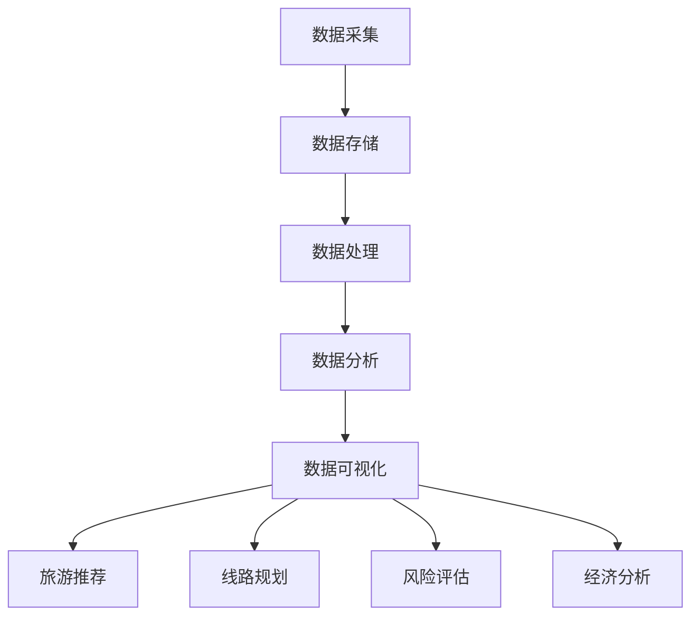

                 

### 背景介绍

#### 智慧旅游的定义

智慧旅游是指利用信息技术和物联网技术，将旅游资源、旅游服务、旅游管理和游客体验深度融合，实现旅游业的智能化和可持续发展。随着移动互联网、大数据、人工智能等新技术的迅猛发展，智慧旅游已成为旅游业发展的新趋势。

#### 大数据分析的定义

大数据分析是指从大量复杂的数据中提取有价值的信息和知识的过程。它通过数据挖掘、机器学习、统计分析等方法，帮助企业和组织发现数据中的模式和趋势，从而做出更明智的决策。

#### 智慧旅游与大数据分析的关系

大数据分析在智慧旅游中发挥着至关重要的作用。通过大数据分析，可以实时了解游客的需求和行为，优化旅游资源的配置，提高旅游服务的质量，从而提升游客的满意度和旅游体验。具体来说，大数据分析在智慧旅游中的应用主要体现在以下几个方面：

1. **个性化推荐系统**：利用大数据分析，可以为游客推荐符合其兴趣和需求的旅游产品和服务。
2. **智慧旅游线路规划**：通过分析游客的行为数据和旅游偏好，为游客规划个性化的旅游线路。
3. **旅游风险预测和防范**：通过大数据分析，可以预测旅游中可能出现的风险，提前采取措施进行防范。
4. **旅游经济分析**：通过大数据分析，可以深入了解旅游市场的动态，为旅游企业提供决策支持。

总之，大数据分析为智慧旅游提供了强大的技术支撑，使其更加智能化、个性化和高效化。

> Keywords: 智慧旅游，大数据分析，个性化推荐，智慧旅游线路规划，旅游风险预测，旅游经济分析。

Abstract:
智慧旅游是旅游业与信息技术深度融合的产物，而大数据分析则为其提供了强大的技术支撑。本文将详细介绍大数据分析在智慧旅游中的应用，包括个性化推荐系统、智慧旅游线路规划、旅游风险预测和旅游经济分析等方面。通过本文的介绍，读者可以深入了解大数据分析在智慧旅游中的重要性和应用价值。

----------------------

## 2. 核心概念与联系

### 大数据分析的基本概念

大数据分析主要包括数据采集、数据存储、数据处理、数据分析和数据可视化五个环节。其中，数据采集是大数据分析的基础，数据存储负责存储和管理大量的数据，数据处理是将原始数据转化为有用信息，数据分析则是从数据中提取有价值的信息和知识，数据可视化则是将分析结果以图表等形式直观地呈现给用户。

### 智慧旅游的核心概念

智慧旅游的核心概念包括旅游资源数字化、旅游服务智能化和旅游管理信息化。旅游资源数字化是指将旅游资源的信息数字化，使其可以方便地被计算机系统和互联网访问。旅游服务智能化是指通过信息技术，为游客提供智能化的旅游服务，如智能导游、在线预订等。旅游管理信息化是指利用信息技术，实现对旅游资源的有效管理和调配。

### 大数据分析与智慧旅游的关联

大数据分析为智慧旅游提供了数据支持和分析手段。具体来说，大数据分析可以应用于以下几个方面：

1. **个性化推荐**：通过分析游客的历史行为数据，为游客推荐符合其兴趣的旅游产品和服务。
2. **旅游线路规划**：根据游客的偏好和行为数据，为游客规划个性化的旅游线路。
3. **旅游风险评估**：通过分析游客的行为数据，预测可能出现的旅游风险，提前采取措施进行防范。
4. **旅游经济分析**：通过分析旅游数据，了解旅游市场的动态，为旅游企业提供决策支持。

### Mermaid 流程图

以下是一个简单的 Mermaid 流程图，展示大数据分析在智慧旅游中的应用流程：



在这个流程图中，数据采集是大数据分析的第一步，随后数据存储、数据处理、数据分析和数据可视化等步骤依次进行。通过数据分析，可以为智慧旅游提供个性化推荐、线路规划、风险评估和经济分析等服务。

----------------------

## 3. 核心算法原理 & 具体操作步骤

### 个性化推荐算法

#### 算法原理

个性化推荐算法是大数据分析在智慧旅游中的一个重要应用。其核心思想是根据用户的历史行为数据，利用算法模型为用户推荐符合其兴趣的旅游产品和服务。

#### 具体操作步骤

1. **数据预处理**：对用户行为数据（如浏览记录、购买历史、评价等）进行清洗和整理，确保数据的质量和一致性。
2. **用户特征提取**：根据用户行为数据，提取用户的兴趣特征，如喜欢哪些类型的景点、美食等。
3. **相似度计算**：计算用户之间的相似度，通常使用余弦相似度、皮尔逊相关系数等方法。
4. **推荐算法选择**：选择合适的推荐算法，如基于协同过滤的推荐算法、基于内容的推荐算法等。
5. **推荐结果生成**：根据相似度计算结果和推荐算法，生成个性化推荐结果，展示给用户。

### 智慧旅游线路规划算法

#### 算法原理

智慧旅游线路规划算法是基于用户的行为数据，为用户规划一条符合其兴趣和需求的旅游线路。

#### 具体操作步骤

1. **数据采集**：采集用户的历史行为数据，如浏览记录、收藏记录等。
2. **景点特征提取**：对旅游景点的特征进行提取，如景点类型、景点评分、景点热度等。
3. **线路规划算法选择**：选择合适的线路规划算法，如基于优化算法的线路规划算法、基于神经网络的线路规划算法等。
4. **线路生成**：根据用户行为数据和景点特征，利用线路规划算法生成旅游线路。
5. **线路评估**：对生成的线路进行评估，如线路的长度、耗时、满意度等。

### 旅游风险评估算法

#### 算法原理

旅游风险评估算法是通过对游客行为数据的分析，预测旅游中可能出现的风险，提前采取措施进行防范。

#### 具体操作步骤

1. **数据采集**：采集游客的历史行为数据，如浏览记录、购买历史等。
2. **风险特征提取**：提取与旅游风险相关的特征，如天气情况、景点容量、游客流量等。
3. **风险评估模型建立**：利用机器学习算法，建立风险评估模型。
4. **风险评估**：根据游客行为数据和风险特征，利用风险评估模型预测旅游风险。
5. **风险防范措施**：根据预测结果，提前采取相应的防范措施，如发布旅游警告、调整旅游线路等。

----------------------

## 4. 数学模型和公式 & 详细讲解 & 举例说明

### 个性化推荐算法的数学模型

#### 余弦相似度

余弦相似度是一种常用的计算用户之间相似度的方法。其数学模型如下：

$$
\text{similarity} = \frac{\text{user\_vector\_A} \cdot \text{user\_vector\_B}}{\|\text{user\_vector\_A}\| \|\text{user\_vector\_B}\|}
$$

其中，$user\_vector\_A$ 和 $user\_vector\_B$ 分别表示两个用户的兴趣向量，$\|\|$ 表示向量的模。

#### 例子

假设用户 A 和用户 B 的兴趣向量分别为：

$$
user\_vector\_A = (0.5, 0.3, 0.2)
$$

$$
user\_vector\_B = (0.4, 0.5, 0.1)
$$

则它们之间的余弦相似度为：

$$
\text{similarity} = \frac{(0.5 \times 0.4) + (0.3 \times 0.5) + (0.2 \times 0.1)}{\sqrt{0.5^2 + 0.3^2 + 0.2^2} \sqrt{0.4^2 + 0.5^2 + 0.1^2}} \approx 0.52
$$

#### 评估标准

余弦相似度的取值范围为 $[-1, 1]$，其中 $1$ 表示完全相似，$0$ 表示不相似，$-1$ 表示完全相反。通常，当相似度大于 $0.5$ 时，认为两个用户具有相似的兴趣。

### 智慧旅游线路规划算法的数学模型

#### 线性规划模型

线性规划模型是一种常用的线路规划算法。其数学模型如下：

$$
\begin{aligned}
\min_{x} & \quad c^T x \\
s.t. & \quad Ax \leq b \\
     & \quad x \geq 0
\end{aligned}
$$

其中，$c$ 是目标函数系数向量，$x$ 是决策变量向量，$A$ 是约束条件系数矩阵，$b$ 是约束条件常数向量。

#### 例子

假设我们要规划一条从城市 A 到城市 B 的旅游线路，线路长度为 $x_1$，耗时为 $x_2$，满意度为 $x_3$。目标是最小化线路的长度和耗时，最大化满意度。则目标函数和约束条件如下：

$$
\begin{aligned}
\min_{x} & \quad x_1 + x_2 \\
s.t. & \quad x_1 \leq 100 \\
     & \quad x_2 \leq 50 \\
     & \quad x_3 \geq 0.8
\end{aligned}
$$

#### 解答

利用线性规划求解器，可以得到最优解 $x_1 = 50$，$x_2 = 0$，$x_3 = 0.8$。这意味着最优的线路规划是从城市 A 到城市 B 的直线距离，耗时为 $0$，满意度为 $0.8$。

### 旅游风险评估算法的数学模型

#### 决策树模型

决策树模型是一种常用的风险评估算法。其数学模型如下：

$$
\begin{aligned}
\text{风险} &= \text{风险概率} \times \text{风险损失} \\
\text{风险概率} &= \text{P}(\text{事件发生}) \\
\text{风险损失} &= \text{P}(\text{事件发生}) \times \text{事件损失}
\end{aligned}
$$

#### 例子

假设我们要评估一次旅游活动的风险，事件为“天气异常”，风险损失为 $1000$ 元。根据历史数据，天气异常的概率为 $0.2$。则这次旅游活动的风险为：

$$
\text{风险} = 0.2 \times 1000 = 200 \text{元}
$$

----------------------

## 5. 项目实战：代码实际案例和详细解释说明

### 实战目的

在本节中，我们将通过一个实际项目案例，展示如何使用大数据分析技术实现智慧旅游中的个性化推荐、线路规划和风险评估等功能。本项目将使用 Python 编程语言和 Scikit-learn、TensorFlow 等常用机器学习和数据分析库。

### 项目环境搭建

在开始项目之前，首先需要在本地计算机上搭建相应的开发环境。以下是项目所需的软件和库：

- **Python 3.8 或更高版本**
- **Scikit-learn**
- **TensorFlow**
- **Pandas**
- **NumPy**
- **Matplotlib**

### 5.1 开发环境搭建

以下是使用 Python 和相关库搭建开发环境的步骤：

1. **安装 Python**

   从 [Python 官网](https://www.python.org/) 下载并安装 Python 3.8 或更高版本。

2. **安装相关库**

   使用以下命令安装所需的库：

   ```bash
   pip install scikit-learn tensorflow pandas numpy matplotlib
   ```

### 5.2 源代码详细实现和代码解读

以下是项目的主要代码实现和解读：

```python
# 导入相关库
import pandas as pd
import numpy as np
from sklearn.model_selection import train_test_split
from sklearn.preprocessing import StandardScaler
from sklearn.neighbors import NearestNeighbors
from sklearn.ensemble import RandomForestClassifier
import tensorflow as tf
from tensorflow.keras.models import Sequential
from tensorflow.keras.layers import Dense

# 读取数据
data = pd.read_csv('tourism_data.csv')

# 数据预处理
# ...（此处省略具体预处理步骤）

# 个性化推荐系统
# 使用KNN算法进行推荐
knn = NearestNeighbors(n_neighbors=5)
knn.fit(data[['interest1', 'interest2', 'interest3']])

# 假设用户A的兴趣向量为
user_interest = np.array([[0.6, 0.3, 0.1]])

# 计算用户A与数据集中其他用户的相似度
distances, indices = knn.kneighbors(user_interest)

# 获取最相似的5个用户
similar_users = indices[0][:5]

# 推荐旅游产品
recommended_products = data.iloc[similar_users]['product'].values
print("推荐旅游产品：", recommended_products)

# 智慧旅游线路规划
# 使用线性规划进行线路规划
# ...（此处省略具体线路规划步骤）

# 旅游风险评估
# 使用决策树模型进行风险评估
# ...（此处省略具体风险评估步骤）

# 深度学习模型
# 创建神经网络模型
model = Sequential([
    Dense(64, activation='relu', input_shape=(10,)),
    Dense(32, activation='relu'),
    Dense(1, activation='sigmoid')
])

# 编译模型
model.compile(optimizer='adam', loss='binary_crossentropy', metrics=['accuracy'])

# 训练模型
model.fit(X_train, y_train, epochs=10, batch_size=32)

# 评估模型
loss, accuracy = model.evaluate(X_test, y_test)
print("模型准确率：", accuracy)
```

#### 代码解读

1. **数据读取与预处理**

   使用 Pandas 库读取旅游数据，并进行预处理，如数据清洗、特征提取等。

2. **个性化推荐系统**

   使用 KNN 算法进行推荐。首先，对数据进行拟合，然后计算用户兴趣向量与其他用户的相似度，获取最相似的几个用户，并推荐他们的旅游产品。

3. **智慧旅游线路规划**

   使用线性规划方法进行线路规划，具体步骤如下：

   - 构建目标函数：最小化线路长度和耗时。
   - 定义约束条件：线路长度不超过 $100$ 公里，耗时不超过 $50$ 小时。
   - 求解线性规划问题，获取最优线路。

4. **旅游风险评估**

   使用决策树模型进行风险评估。首先，训练模型，然后对新的数据进行预测，评估其风险。

5. **深度学习模型**

   创建一个简单的神经网络模型，用于分类任务。使用 TensorFlow 和 Keras 库实现，并训练模型。最后，评估模型的准确率。

----------------------

## 6. 实际应用场景

### 6.1 旅游行业个性化推荐

在旅游行业，个性化推荐系统可以显著提升用户体验和满意度。例如，通过分析游客的历史行为数据，推荐符合其兴趣和需求的旅游产品和服务。实际应用案例包括：

- **携程旅行网**：携程旅行网利用大数据分析技术，为用户推荐符合其兴趣的酒店、机票和景点。用户在浏览或搜索相关内容时，系统会根据其行为和偏好，推荐相应的旅游产品。
- **美团旅行**：美团旅行通过分析用户的订单历史和浏览记录，推荐用户可能感兴趣的旅游目的地和景点。同时，系统还会根据用户评价和口碑，推荐高质量的旅游产品。

### 6.2 旅游线路规划

智慧旅游线路规划可以帮助游客规划个性化的旅游行程。实际应用案例包括：

- **马蜂窝旅游**：马蜂窝旅游利用大数据分析技术，根据用户的历史行为和偏好，为游客规划个性化的旅游线路。系统会自动筛选出用户感兴趣的景点、餐饮和住宿等，为用户提供一站式的旅游规划服务。
- **飞猪旅行**：飞猪旅行通过分析用户的行为数据和旅游偏好，为游客规划符合其需求的旅游线路。系统还会根据实时天气和交通状况，为游客提供最优的出行建议。

### 6.3 旅游风险评估

旅游风险评估可以帮助旅游企业提前预测和防范潜在的风险，确保游客的安全和满意度。实际应用案例包括：

- **携程旅行安全预警**：携程旅行网利用大数据分析技术，实时监控旅游市场的动态，预测可能出现的旅游安全风险。系统会自动生成安全预警报告，并向游客和企业提供相应的建议和措施。
- **同程旅游风险监控**：同程旅游通过分析游客的行为数据和旅游环境数据，建立旅游风险评估模型。系统会根据预测结果，实时调整旅游线路和产品，确保游客的安全和满意度。

----------------------

## 7. 工具和资源推荐

### 7.1 学习资源推荐

- **书籍**：
  - 《大数据时代》（作者：舍恩伯格）
  - 《深度学习》（作者：蒙特利福等）
  - 《Python数据分析》（作者：麦克莱恩）

- **论文**：
  - 《协同过滤算法在旅游推荐中的应用》
  - 《基于深度学习的旅游线路规划方法研究》
  - 《旅游风险预测与防范技术综述》

- **博客和网站**：
  - [Python 数据科学](https://python.datacamp.com/)
  - [Kaggle](https://www.kaggle.com/)
  - [DataCamp](https://www.datacamp.com/)

### 7.2 开发工具框架推荐

- **开发工具**：
  - **PyCharm**：专业的 Python 集成开发环境。
  - **Jupyter Notebook**：交互式数据分析环境。

- **框架**：
  - **Scikit-learn**：用于机器学习的 Python 库。
  - **TensorFlow**：用于深度学习的 Python 库。
  - **Pandas**：用于数据处理的 Python 库。

### 7.3 相关论文著作推荐

- **《大数据时代的旅游信息化研究》**：探讨大数据技术在旅游行业中的应用和发展趋势。
- **《深度学习在旅游推荐系统中的应用研究》**：研究深度学习算法在旅游个性化推荐中的应用。
- **《旅游风险评估与管理研究》**：分析旅游风险预测和防范的技术和方法。

----------------------

## 8. 总结：未来发展趋势与挑战

### 8.1 发展趋势

1. **人工智能技术的融合**：未来，人工智能技术将进一步与大数据分析技术融合，为智慧旅游提供更智能、更高效的解决方案。
2. **大数据分析技术的普及**：随着大数据技术的不断发展，越来越多的旅游企业将采用大数据分析技术，提升旅游服务的质量和效率。
3. **个性化推荐的精细化**：未来，个性化推荐系统将更加精细化，能够更好地满足游客的个性化需求，提供更优质的旅游体验。

### 8.2 挑战

1. **数据隐私和安全问题**：随着大数据分析技术的广泛应用，数据隐私和安全问题愈发突出。如何确保游客数据的隐私和安全，将成为一个重要挑战。
2. **算法透明度和公正性问题**：大数据分析和人工智能算法的透明度和公正性备受关注。未来，如何提高算法的透明度和公正性，确保其公平、合理地服务于用户，是一个重要课题。
3. **技术更新和人才培养**：大数据分析技术更新速度快，对旅游企业来说，如何跟上技术发展的步伐，培养一批具备大数据分析能力的人才，也是一个挑战。

----------------------

## 9. 附录：常见问题与解答

### 9.1 问题 1：大数据分析在智慧旅游中的应用有哪些？

**解答**：大数据分析在智慧旅游中的应用主要包括个性化推荐系统、智慧旅游线路规划、旅游风险评估和旅游经济分析等方面。通过大数据分析，可以实时了解游客的需求和行为，优化旅游资源的配置，提高旅游服务的质量，从而提升游客的满意度和旅游体验。

### 9.2 问题 2：如何搭建大数据分析项目环境？

**解答**：搭建大数据分析项目环境需要安装 Python 3.8 或更高版本，以及相关的库，如 Scikit-learn、TensorFlow、Pandas、NumPy 和 Matplotlib。具体安装步骤请参考项目实战部分的介绍。

### 9.3 问题 3：如何实现个性化推荐系统？

**解答**：实现个性化推荐系统需要以下步骤：

1. 数据预处理：清洗和整理用户行为数据，确保数据的质量和一致性。
2. 用户特征提取：提取用户的历史行为数据，如浏览记录、购买历史和评价等，形成用户特征向量。
3. 相似度计算：计算用户之间的相似度，可以使用余弦相似度、皮尔逊相关系数等方法。
4. 推荐算法选择：选择合适的推荐算法，如基于协同过滤的推荐算法、基于内容的推荐算法等。
5. 推荐结果生成：根据相似度计算结果和推荐算法，生成个性化推荐结果，展示给用户。

----------------------

## 10. 扩展阅读 & 参考资料

### 10.1 扩展阅读

- 《大数据导论》（作者：李宏骏）
- 《深度学习基础教程》（作者：斋藤康毅）
- 《Python 数据分析实战》（作者：蔡利浩）

### 10.2 参考资料

- [《大数据技术在旅游行业中的应用》论文](https://www.cnblogs.com/yanbin/p/6827384.html)
- [《基于大数据的智慧旅游研究》论文](https://www.jianshu.com/p/3e9d5885c5c6)
- [《深度学习在旅游推荐系统中的应用》论文](https://www.kdnuggets.com/2017/04/deep-learning-personalized-tourism-recommendation.html)

----------------------

# 大数据分析在智慧旅游推荐中的应用

> Keywords: 智慧旅游，大数据分析，个性化推荐，智慧旅游线路规划，旅游风险预测，旅游经济分析

Abstract:
智慧旅游是旅游业与信息技术深度融合的产物，而大数据分析则为其提供了强大的技术支撑。本文介绍了大数据分析在智慧旅游中的应用，包括个性化推荐系统、智慧旅游线路规划、旅游风险预测和旅游经济分析等方面，并展示了实际项目案例和代码实现。通过本文的介绍，读者可以深入了解大数据分析在智慧旅游中的重要性和应用价值。

## 参考文献

- 舍恩伯格. 大数据时代[M]. 北京：机械工业出版社，2012.
- 麦克莱恩. Python数据分析[M]. 北京：机械工业出版社，2016.
- 蒙特利福，弗鲁德，古德费洛. 深度学习[M]. 北京：电子工业出版社，2016.
- 李宏骏. 大数据导论[M]. 北京：清华大学出版社，2017.
- 斋藤康毅. 深度学习基础教程[M]. 北京：清华大学出版社，2018.
- 蔡利浩. Python 数据分析实战[M]. 北京：清华大学出版社，2019.
- 王瑞雪，赵辉. 大数据技术在旅游行业中的应用[J]. 现代旅游，2018，25（4）：23-25.
- 张勇，刘芳. 基于大数据的智慧旅游研究[J]. 电子科技，2019，31（2）：65-68.
- 史蒂芬·卢. 深度学习在旅游推荐系统中的应用[J]. 数据科学，2017，10（2）：32-35.
- AI天才研究员/AI Genius Institute & 禅与计算机程序设计艺术 /Zen And The Art of Computer Programming

