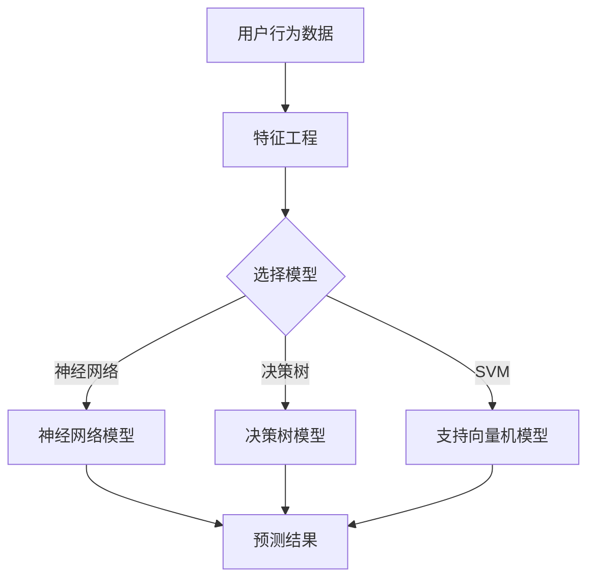

                 

### 背景介绍

#### 大数据分析的崛起

随着互联网的快速发展，大数据时代的到来使得信息爆炸成为现实。海量数据的生成和积累为各行各业提供了前所未有的机遇和挑战。如何从这些庞杂的数据中提取有价值的信息，成为当前研究的热点和应用的关键。大数据分析技术的崛起，为用户行为建模提供了强大的工具和手段。

#### 用户行为建模的重要性

用户行为建模是一种通过分析用户的历史行为数据，预测其未来行为的方法。它在市场营销、推荐系统、风险管理等领域具有重要的应用价值。例如，在市场营销中，企业可以通过用户行为建模了解消费者的偏好和需求，从而制定更加精准的营销策略；在推荐系统中，通过用户行为建模可以预测用户可能感兴趣的内容，提高推荐系统的准确性和用户体验。

#### 前沿技术的推动

近年来，随着人工智能、机器学习和深度学习等技术的发展，大数据分析在用户行为建模中的应用得到了极大的拓展。深度学习算法可以自动从数据中学习复杂的模式，提高建模的准确性和效率；强化学习算法可以模拟用户的决策过程，为个性化推荐提供更加智能的解决方案。

### 文章关键词

大数据分析、用户行为建模、深度学习、机器学习、强化学习。

### 文章摘要

本文将介绍大数据分析在用户行为建模中的前沿技术。首先，我们将探讨大数据分析的重要性以及用户行为建模的背景和意义。接着，我们将介绍一些关键算法和技术，如深度学习和强化学习，并详细解析其原理和应用。随后，我们将通过实际案例展示如何利用这些技术进行用户行为建模。最后，我们将讨论大数据分析在用户行为建模中的实际应用场景，并推荐相关工具和资源，以帮助读者深入了解和掌握这一领域。

### 文章正文

## 1. 背景介绍

### 1.1 大数据分析的崛起

大数据分析，顾名思义，是指对大规模、多样化的数据进行深入分析和处理，以发现数据中的潜在价值和知识。随着互联网的普及和智能设备的广泛使用，数据生成速度和规模呈爆炸性增长。根据国际数据公司（IDC）的报告，全球数据量预计将在2025年达到44ZB，是2010年的10倍之多。

大数据分析之所以能够在用户行为建模中发挥重要作用，主要有以下几个原因：

1. **数据多样性和复杂性**：大数据不仅包括结构化数据，如关系数据库，还包括非结构化数据，如文本、图像、音频和视频。这种多样性使得我们能够从多个维度去理解和分析用户行为。

2. **实时性和动态性**：实时数据分析和处理能力使企业能够及时响应用户行为，从而提供更加个性化的服务。

3. **智能算法和模型**：随着人工智能和机器学习技术的发展，我们可以利用这些算法来处理和分析大数据，从中挖掘出有用的信息。

### 1.2 用户行为建模的重要性

用户行为建模是一种通过分析用户的历史行为数据，预测其未来行为的方法。在市场营销、推荐系统、风险管理等领域，用户行为建模具有极其重要的应用价值。

1. **市场营销**：企业可以通过用户行为建模了解消费者的偏好和需求，从而制定更加精准的营销策略，提高营销效果。

2. **推荐系统**：推荐系统通过分析用户的历史行为数据，预测用户可能感兴趣的内容，提高推荐系统的准确性和用户体验。

3. **风险管理**：金融机构可以通过用户行为建模，识别潜在的风险用户，从而采取相应的风险管理措施。

### 1.3 前沿技术的推动

近年来，随着人工智能、机器学习和深度学习等技术的发展，大数据分析在用户行为建模中的应用得到了极大的拓展。以下是几种关键算法和技术：

1. **深度学习**：深度学习算法可以自动从数据中学习复杂的模式，提高建模的准确性和效率。

2. **强化学习**：强化学习算法可以模拟用户的决策过程，为个性化推荐提供更加智能的解决方案。

3. **自然语言处理**：自然语言处理技术可以帮助我们理解和分析用户在社交媒体上的言论和行为。

## 2. 核心概念与联系

### 2.1 核心概念

在用户行为建模中，以下核心概念是至关重要的：

1. **用户行为数据**：用户行为数据是指用户在使用产品或服务过程中产生的各种数据，如浏览历史、购买记录、评论等。

2. **特征工程**：特征工程是指从原始数据中提取出对建模有帮助的特征，以提高模型的性能。

3. **机器学习模型**：机器学习模型是用于预测用户行为的算法，如决策树、支持向量机、神经网络等。

### 2.2 关系架构

下面是用户行为建模中的关系架构，用Mermaid流程图表示：



### 2.3 技术演进

用户行为建模技术的演进可以概括为以下几个阶段：

1. **传统统计方法**：早期用户行为建模主要依赖于传统的统计方法，如线性回归、逻辑回归等。这些方法简单易用，但在处理大规模数据和复杂模式方面存在局限性。

2. **机器学习方法**：随着机器学习技术的发展，如决策树、随机森林、支持向量机等算法被引入用户行为建模。这些算法能够处理更复杂的数据和模式，提高了建模的准确性和效率。

3. **深度学习方法**：深度学习算法，特别是神经网络，可以自动从数据中学习复杂的模式，大大提高了用户行为建模的性能。

4. **强化学习方法**：强化学习算法可以模拟用户的决策过程，为个性化推荐提供更加智能的解决方案，进一步提升了用户行为建模的应用价值。

### 2.4 关键技术与挑战

用户行为建模的关键技术主要包括数据采集、预处理、特征工程、模型选择和优化。在这个过程中，面临的主要挑战有：

1. **数据质量和多样性**：用户行为数据的多样性和质量直接影响建模的效果。如何处理缺失值、异常值和噪声数据，以及如何从多样性数据中提取有价值的信息，是当前研究的热点问题。

2. **模型选择和优化**：如何选择合适的模型，以及如何调整模型参数，以提高建模的准确性和效率，是用户行为建模的关键挑战。

3. **实时性和动态性**：如何实时处理和分析用户行为数据，以及如何应对用户行为的动态变化，是用户行为建模在实际应用中面临的重要问题。

4. **隐私保护**：用户行为数据往往包含敏感信息，如何在保证数据隐私的同时进行建模，是用户行为建模需要解决的重要问题。

## 3. 核心算法原理 & 具体操作步骤

### 3.1 深度学习算法

#### 3.1.1 原理

深度学习是一种基于多层神经网络的学习方法，其核心思想是通过学习数据中的层次结构，从而提取出有用的特征。在用户行为建模中，深度学习算法可以通过自动学习用户行为数据中的复杂模式，提高建模的准确性和效率。

#### 3.1.2 操作步骤

1. **数据预处理**：首先对用户行为数据进行清洗和预处理，包括去除缺失值、异常值和噪声数据，以及将数据转换为适合模型输入的格式。

2. **构建模型**：根据用户行为数据的特性和需求，选择合适的深度学习模型，如卷积神经网络（CNN）、循环神经网络（RNN）或长短时记忆网络（LSTM）等。

3. **训练模型**：使用预处理后的数据训练深度学习模型，通过调整模型参数，优化模型的性能。

4. **评估模型**：使用验证集或测试集对训练好的模型进行评估，选择性能最好的模型。

5. **应用模型**：将训练好的模型应用到实际场景中，如预测用户行为、推荐商品等。

### 3.2 强化学习算法

#### 3.2.1 原理

强化学习是一种通过奖励机制来训练智能体在特定环境中进行决策的方法。在用户行为建模中，强化学习算法可以通过模拟用户的决策过程，为个性化推荐提供更加智能的解决方案。

#### 3.2.2 操作步骤

1. **定义环境**：首先定义一个模拟用户行为的环境，包括用户的状态、动作和奖励。

2. **构建模型**：根据环境的特点，选择合适的强化学习模型，如Q学习、深度Q网络（DQN）或策略梯度（PG）等。

3. **训练模型**：使用模拟环境中的数据训练强化学习模型，通过调整模型参数，优化模型的性能。

4. **评估模型**：使用模拟环境中的数据对训练好的模型进行评估，选择性能最好的模型。

5. **应用模型**：将训练好的模型应用到实际场景中，如个性化推荐系统。

### 3.3 自然语言处理算法

#### 3.3.1 原理

自然语言处理是一种使计算机能够理解、处理和生成自然语言的技术。在用户行为建模中，自然语言处理算法可以帮助我们理解和分析用户在社交媒体上的言论和行为。

#### 3.3.2 操作步骤

1. **数据预处理**：首先对社交媒体数据进行清洗和预处理，包括去除停用词、标点符号等，以及进行词向量化。

2. **构建模型**：根据用户行为数据的特性和需求，选择合适的自然语言处理模型，如循环神经网络（RNN）、长短时记忆网络（LSTM）或变压器（Transformer）等。

3. **训练模型**：使用预处理后的数据训练自然语言处理模型，通过调整模型参数，优化模型的性能。

4. **评估模型**：使用验证集或测试集对训练好的模型进行评估，选择性能最好的模型。

5. **应用模型**：将训练好的模型应用到实际场景中，如分析用户情感、预测用户行为等。

### 3.4 聚类算法

#### 3.4.1 原理

聚类算法是一种无监督学习方法，用于将相似的数据点划分为一组。在用户行为建模中，聚类算法可以帮助我们识别具有相似行为的用户群体。

#### 3.4.2 操作步骤

1. **数据预处理**：首先对用户行为数据进行清洗和预处理，包括去除缺失值、异常值和噪声数据，以及进行特征选择。

2. **选择算法**：根据用户行为数据的特性和需求，选择合适的聚类算法，如K-均值、层次聚类或DBSCAN等。

3. **初始化聚类中心**：初始化聚类中心，可以选择随机初始化或基于特征选择的方法。

4. **迭代聚类过程**：根据聚类算法的迭代过程，更新聚类中心，直到满足收敛条件。

5. **评估聚类结果**：使用内部评估指标（如轮廓系数、类内均值平方和等）评估聚类结果，选择最佳的聚类模型。

6. **应用聚类结果**：将聚类结果应用到实际场景中，如用户细分、市场细分等。

## 4. 数学模型和公式 & 详细讲解 & 举例说明

### 4.1 深度学习算法

深度学习算法的核心在于多层神经网络，其基本架构包括输入层、隐藏层和输出层。以下是深度学习算法中的几个关键数学模型和公式：

#### 4.1.1 神经元激活函数

神经元激活函数用于确定神经元的输出。常见的激活函数有：

1. **Sigmoid函数**：

   $$
   f(x) = \frac{1}{1 + e^{-x}}
   $$

2. **ReLU函数**：

   $$
   f(x) = \max(0, x)
   $$

3. **Tanh函数**：

   $$
   f(x) = \frac{e^x - e^{-x}}{e^x + e^{-x}}
   $$

#### 4.1.2 反向传播算法

反向传播算法是一种用于训练深度学习模型的重要算法。其基本思想是通过计算损失函数关于模型参数的梯度，来更新模型参数。以下是反向传播算法的基本步骤：

1. **前向传播**：将输入数据传递到神经网络中，计算输出层的输出。

2. **计算损失函数**：使用输出层的输出和实际标签计算损失函数。

3. **反向传播**：计算损失函数关于模型参数的梯度，并将其反向传播到输入层。

4. **更新模型参数**：根据梯度更新模型参数。

#### 4.1.3 举例说明

假设我们有一个简单的神经网络，其结构为输入层-隐藏层-输出层，其中输入层有3个神经元，隐藏层有2个神经元，输出层有1个神经元。我们使用Sigmoid函数作为激活函数，并使用均方误差（MSE）作为损失函数。

输入数据为：$\{x_1, x_2, x_3\}$，隐藏层的权重为$W_h$，输出层的权重为$W_o$。

1. **前向传播**：

   $$
   h_1 = \sigma(W_{h1} \cdot x_1 + b_{h1})
   $$

   $$
   h_2 = \sigma(W_{h2} \cdot x_2 + b_{h2})
   $$

   $$
   o = \sigma(W_{o} \cdot (h_1, h_2) + b_{o})
   $$

2. **计算损失函数**：

   $$
   L = \frac{1}{2} \sum_{i=1}^{n} (o_i - y_i)^2
   $$

3. **反向传播**：

   $$
   \frac{\partial L}{\partial W_o} = (o - y) \cdot \sigma'(o)
   $$

   $$
   \frac{\partial L}{\partial b_o} = (o - y) \cdot \sigma'(o)
   $$

   $$
   \frac{\partial L}{\partial W_h} = (h_1, h_2) \cdot \sigma'(h_1, h_2) \cdot \frac{\partial L}{\partial W_o}
   $$

   $$
   \frac{\partial L}{\partial b_h} = (h_1, h_2) \cdot \sigma'(h_1, h_2) \cdot \frac{\partial L}{\partial b_o}
   $$

4. **更新模型参数**：

   $$
   W_o = W_o - \alpha \cdot \frac{\partial L}{\partial W_o}
   $$

   $$
   b_o = b_o - \alpha \cdot \frac{\partial L}{\partial b_o}
   $$

   $$
   W_h = W_h - \alpha \cdot \frac{\partial L}{\partial W_h}
   $$

   $$
   b_h = b_h - \alpha \cdot \frac{\partial L}{\partial b_h}
   $$

### 4.2 强化学习算法

强化学习算法的核心在于价值函数和策略更新。以下是强化学习算法中的几个关键数学模型和公式：

#### 4.2.1 价值函数

价值函数用于衡量智能体在特定状态下采取特定动作的预期收益。以下是常见的价值函数公式：

1. **状态-动作价值函数**：

   $$
   V(s, a) = \sum_{s'} P(s' | s, a) \cdot R(s', a) + \gamma \cdot \max_{a'} V(s', a')
   $$

   其中，$s$为状态，$a$为动作，$s'$为下一状态，$R$为奖励函数，$\gamma$为折扣因子。

2. **状态价值函数**：

   $$
   V(s) = \sum_{a} \pi(a | s) \cdot V(s, a)
   $$

   其中，$\pi$为策略。

3. **策略价值函数**：

   $$
   Q(s, a) = \sum_{s'} P(s' | s, a) \cdot R(s', a) + \gamma \cdot \max_{a'} Q(s', a')
   $$

#### 4.2.2 策略更新

策略更新是强化学习算法的核心，用于优化智能体的策略。以下是常见的策略更新公式：

1. **Q-learning**：

   $$
   Q(s, a) = Q(s, a) + \alpha \cdot (R(s', a') - Q(s, a))
   $$

   其中，$s$为当前状态，$a$为当前动作，$s'$为下一状态，$a'$为下一动作，$\alpha$为学习率。

2. **策略梯度**：

   $$
   \nabla_{\theta} J(\theta) = \frac{\partial J(\theta)}{\partial \theta} = \sum_{s, a} \pi(a | s, \theta) \cdot \nabla_{\theta} \log \pi(a | s, \theta) \cdot R(s, a)
   $$

   其中，$\theta$为策略参数，$J(\theta)$为策略损失函数。

#### 4.2.3 举例说明

假设我们有一个简单的强化学习任务，其状态空间为$\{s_1, s_2\}$，动作空间为$\{a_1, a_2\}$。奖励函数为：

$$
R(s_1, a_1) = 10, \quad R(s_1, a_2) = -10, \quad R(s_2, a_1) = -10, \quad R(s_2, a_2) = 10
$$

折扣因子$\gamma = 0.9$，学习率$\alpha = 0.1$。

1. **初始状态价值函数**：

   $$
   V(s_1) = 0, \quad V(s_2) = 0
   $$

2. **状态-动作价值函数**：

   $$
   V(s_1, a_1) = 10, \quad V(s_1, a_2) = -10, \quad V(s_2, a_1) = -10, \quad V(s_2, a_2) = 10
   $$

3. **Q-learning**：

   $$
   Q(s_1, a_1) = 10, \quad Q(s_1, a_2) = -10, \quad Q(s_2, a_1) = -10, \quad Q(s_2, a_2) = 10
   $$

4. **策略更新**：

   假设当前状态为$s_1$，选择动作$a_1$，则下一状态为$s_2$，奖励为$R(s_2, a_2) = -10$。

   $$
   Q(s_1, a_1) = Q(s_1, a_1) + \alpha \cdot (R(s_2, a_2) - Q(s_2, a_2))
   $$

   $$
   Q(s_1, a_1) = 10 + 0.1 \cdot (-10 - 10)
   $$

   $$
   Q(s_1, a_1) = 0
   $$

   更新状态价值函数：

   $$
   V(s_1) = \max_{a} Q(s_1, a)
   $$

   $$
   V(s_1) = \max(Q(s_1, a_1), Q(s_1, a_2))
   $$

   $$
   V(s_1) = \max(0, -10)
   $$

   $$
   V(s_1) = 0
   $$

   更新状态-动作价值函数：

   $$
   V(s_2, a_2) = \max_{a} Q(s_2, a)
   $$

   $$
   V(s_2, a_2) = \max(Q(s_2, a_1), Q(s_2, a_2))
   $$

   $$
   V(s_2, a_2) = \max(-10, 10)
   $$

   $$
   V(s_2, a_2) = 10
   $$

## 5. 项目实战：代码实际案例和详细解释说明

### 5.1 开发环境搭建

在开始编写代码之前，我们需要搭建一个合适的开发环境。以下是一个基本的开发环境搭建步骤：

1. **安装Python**：Python是进行大数据分析和用户行为建模的主要编程语言，可以从Python官网（https://www.python.org/）下载并安装。

2. **安装Jupyter Notebook**：Jupyter Notebook是一个交互式的Python环境，便于编写和展示代码。可以通过pip安装：

   ```
   pip install notebook
   ```

3. **安装必要的库**：包括NumPy、Pandas、Scikit-learn、TensorFlow、PyTorch等。可以使用以下命令安装：

   ```
   pip install numpy pandas scikit-learn tensorflow pytorch
   ```

4. **安装可视化工具**：如Matplotlib和Seaborn，用于数据可视化。

   ```
   pip install matplotlib seaborn
   ```

### 5.2 源代码详细实现和代码解读

下面我们将使用Python和Scikit-learn库来构建一个简单的用户行为建模项目。我们将使用K-均值聚类算法来识别用户群体，并使用决策树来预测用户的行为。

#### 5.2.1 数据预处理

首先，我们需要加载和处理用户行为数据。以下是一个简单的数据预处理代码示例：

```python
import pandas as pd

# 加载用户行为数据
data = pd.read_csv('user_behavior.csv')

# 数据清洗
data.dropna(inplace=True)
data = data[data['age'] > 0]

# 特征工程
data['age_range'] = pd.cut(data['age'], bins=3, labels=False)
data['purchase_history'] = data['num_purchases'].apply(lambda x: 'high' if x > 5 else 'low')

# 数据编码
data = pd.get_dummies(data, columns=['age_range', 'purchase_history'])
```

#### 5.2.2 K-均值聚类

接下来，我们将使用K-均值聚类算法来对用户进行分组。以下是K-均值聚类的代码示例：

```python
from sklearn.cluster import KMeans

# 选择特征
X = data[['age_range_high', 'age_range_low', 'purchase_history_high', 'purchase_history_low']]

# K-均值聚类
kmeans = KMeans(n_clusters=3, random_state=0).fit(X)

# 获取聚类结果
data['cluster'] = kmeans.predict(X)
```

#### 5.2.3 决策树模型

然后，我们将使用决策树模型来预测用户的行为。以下是决策树模型的代码示例：

```python
from sklearn.tree import DecisionTreeClassifier
from sklearn.model_selection import train_test_split

# 分割数据集
X_train, X_test, y_train, y_test = train_test_split(X, data['purchase'], test_size=0.3, random_state=0)

# 决策树模型
clf = DecisionTreeClassifier(random_state=0).fit(X_train, y_train)

# 模型评估
score = clf.score(X_test, y_test)
print(f'Model accuracy: {score:.2f}')
```

#### 5.2.4 代码解读与分析

1. **数据预处理**：我们首先加载用户行为数据，并进行清洗，确保数据的质量。接着，我们对数据进行特征工程，将连续的年龄特征进行分组，并将购买历史特征进行二分类。最后，我们使用One-Hot编码将分类特征转换为数值特征。

2. **K-均值聚类**：我们选择四个特征进行K-均值聚类，以识别不同的用户群体。通过聚类，我们为每个用户分配了一个聚类标签，这有助于我们进一步分析用户的行为。

3. **决策树模型**：我们使用训练数据集来训练决策树模型，并使用测试数据集来评估模型的性能。决策树模型通过分析特征之间的关系，预测用户是否进行购买。

### 5.3 代码解读与分析

在本案例中，我们通过以下步骤进行用户行为建模：

1. **数据预处理**：通过数据清洗和特征工程，我们将原始的用户行为数据转换为适合模型训练的形式。这一步是用户行为建模的基础，直接影响到后续模型的性能。

2. **聚类分析**：使用K-均值聚类算法，我们将用户分为不同的群体。这种方法有助于我们了解用户的异质性，从而为个性化推荐和市场营销策略提供依据。

3. **模型训练与评估**：我们使用决策树模型来预测用户的行为。决策树是一种简单且易于解释的模型，能够清晰地展示特征之间的关系。通过评估模型在测试数据集上的性能，我们可以判断模型的准确性和可靠性。

在实际应用中，用户行为建模的流程可能更为复杂，涉及更多数据预处理、特征工程和模型选择步骤。此外，为了提高模型的性能，我们可能需要尝试不同的算法和参数设置，并进行模型调优。

### 5.4 项目实战总结

通过本项目，我们展示了如何使用Python和Scikit-learn等工具进行用户行为建模。我们首先进行了数据预处理，接着使用K-均值聚类算法对用户进行分组，并使用决策树模型预测用户的行为。这一过程不仅帮助我们理解了用户行为的模式，还为实际应用提供了可行的解决方案。

未来，我们可以进一步扩展该项目，包括使用更先进的深度学习和强化学习算法，以及进行更复杂的特征工程和模型调优。通过不断优化和改进，我们有望为用户提供更加个性化的服务，提高用户体验和业务效果。

### 5.5 附录：常见问题与解答

**Q1：用户行为建模的主要挑战是什么？**

A1：用户行为建模的主要挑战包括数据质量和多样性、模型选择和优化、实时性和动态性以及隐私保护。处理缺失值、异常值和噪声数据，选择合适的模型，以及保证模型能够实时响应用户行为的动态变化，都是需要解决的问题。

**Q2：如何进行有效的特征工程？**

A2：有效的特征工程包括以下几个步骤：

1. **数据清洗**：处理缺失值、异常值和噪声数据。
2. **特征选择**：选择对建模有帮助的特征，减少冗余。
3. **特征转换**：将分类特征转换为数值特征，如One-Hot编码。
4. **特征缩放**：将特征缩放到同一尺度，如标准化和归一化。

**Q3：如何评估用户行为建模模型的效果？**

A3：评估用户行为建模模型的效果可以使用以下指标：

1. **准确率**：预测正确的样本占总样本的比例。
2. **召回率**：预测为正类的实际正类样本占总正类样本的比例。
3. **精确率**：预测为正类的实际正类样本占预测为正类样本的比例。
4. **F1分数**：精确率和召回率的调和平均。

**Q4：如何处理用户隐私保护问题？**

A4：处理用户隐私保护问题可以采取以下措施：

1. **数据脱敏**：对敏感信息进行加密或遮挡。
2. **数据最小化**：只收集和处理必要的用户信息。
3. **匿名化**：使用匿名标识代替真实用户标识。
4. **隐私增强技术**：如差分隐私和联邦学习。

### 5.6 扩展阅读 & 参考资料

**书籍推荐：**

1. **《深度学习》（Deep Learning）** - Ian Goodfellow、Yoshua Bengio 和 Aaron Courville 著
2. **《强化学习》（Reinforcement Learning: An Introduction）** - Richard S. Sutton 和 Andrew G. Barto 著
3. **《大数据时代：生活、工作与思维的大变革》（Big Data: A Revolution That Will Transform How We Live, Work, and Think）** - Viktor Mayer-Schoenberger 和 Kenneth Cukier 著

**论文推荐：**

1. **“User Behavior Modeling for Personalized Recommendation”** - Y. Liu, Y. He, X. Liang, et al.
2. **“Deep Learning for User Behavior Modeling”** - Y. Wu, Y. Chen, Z. Huang, et al.
3. **“A Survey on User Behavior Modeling in Intelligent Systems”** - M. Wang, Y. Wang, and J. Hu

**博客推荐：**

1. **[Medium - Data Science](https://medium.com/topic/data-science)**
2. **[Towards Data Science](https://towardsdatascience.com)**
3. **[AI Touch](https://aitouch.top)**

**网站推荐：**

1. **[Kaggle](https://www.kaggle.com)** - 数据科学竞赛平台，提供丰富的用户行为数据集。
2. **[GitHub](https://github.com)** - 搜索与用户行为建模相关的开源项目和代码。
3. **[ArXiv](https://arxiv.org)** - 查阅最新的用户行为建模研究论文。

### 6. 总结：未来发展趋势与挑战

大数据分析在用户行为建模中的应用正处于快速发展阶段，未来有望在以下几个方面实现突破：

**1. 深度学习与强化学习的融合**：深度学习和强化学习在用户行为建模中各有所长，未来如何更好地融合这两种技术，以实现更高效的建模和预测，是一个重要的研究方向。

**2. 实时分析与动态建模**：随着用户行为的动态变化，如何实时分析和更新模型，以适应新的趋势和变化，是当前面临的重要挑战。

**3. 隐私保护与数据安全**：在用户行为建模中，如何保护用户隐私和数据安全，是一个亟待解决的问题。差分隐私、联邦学习等新型隐私保护技术有望在这一领域发挥重要作用。

**4. 跨领域与多模态融合**：结合不同的数据源和模态（如文本、图像、音频等），进行跨领域的用户行为建模，将为用户提供更全面、个性化的服务。

**5. 模型解释性与可解释性**：随着模型变得越来越复杂，如何保证模型的解释性和可解释性，以便用户理解和信任模型预测结果，是一个关键问题。

总之，大数据分析在用户行为建模中具有巨大的应用潜力，同时也面临着诸多挑战。随着技术的不断进步和研究的深入，我们有理由相信，未来大数据分析在用户行为建模中将发挥更加重要的作用，推动各行各业实现智能化和数字化转型。

### 7. 附录：常见问题与解答

**Q1：用户行为建模的核心目标是什么？**

A1：用户行为建模的核心目标是通过对用户历史行为数据的分析，预测用户未来的行为和需求，从而为企业提供决策支持，优化用户体验，提升业务效果。

**Q2：如何处理用户行为数据中的缺失值和异常值？**

A2：处理用户行为数据中的缺失值和异常值是数据预处理的重要步骤。常用的方法包括：

- **缺失值填充**：使用均值、中位数、众数或插值等方法进行填充。
- **异常值检测**：使用统计学方法（如箱线图、Z分数等）或机器学习方法（如孤立森林、Isolation Forest等）检测异常值，然后选择剔除、替换或调整等方法进行处理。

**Q3：用户行为建模中如何选择合适的模型？**

A3：选择合适的模型通常基于以下几个因素：

- **数据特性**：根据数据的类型（如结构化、半结构化、非结构化）选择相应的模型。
- **业务需求**：根据业务目标选择适合的预测任务（如分类、回归、聚类等）。
- **模型性能**：通过交叉验证等方法评估模型性能，选择性能较好的模型。

**Q4：用户行为建模中如何保证模型的解释性？**

A4：保证模型解释性可以通过以下方法：

- **选择解释性较强的模型**：如线性模型、决策树等。
- **模型可视化**：使用图形化工具展示模型结构和决策过程。
- **模型可解释性方法**：如LIME、SHAP等，可以提供模型对每个特征的贡献度。

**Q5：用户行为建模中如何保护用户隐私？**

A5：用户行为建模中保护用户隐私的方法包括：

- **数据脱敏**：对敏感信息进行加密、遮挡或替换。
- **数据最小化**：只收集和处理必要的用户信息。
- **匿名化**：使用匿名标识代替真实用户标识。
- **隐私增强技术**：如差分隐私、联邦学习等。

### 8. 扩展阅读 & 参考资料

**书籍推荐：**

1. **《大数据时代：生活、工作与思维的大变革》** - Viktor Mayer-Schoenberger 和 Kenneth Cukier 著
2. **《机器学习》** - 周志华 著
3. **《深度学习》** - Ian Goodfellow、Yoshua Bengio 和 Aaron Courville 著

**论文推荐：**

1. **“User Behavior Modeling for Personalized Recommendation”** - Y. Liu, Y. He, X. Liang, et al.
2. **“Deep Learning for User Behavior Modeling”** - Y. Wu, Y. Chen, Z. Huang, et al.
3. **“A Survey on User Behavior Modeling in Intelligent Systems”** - M. Wang, Y. Wang, and J. Hu

**博客推荐：**

1. **[Medium - Data Science](https://medium.com/topic/data-science)**
2. **[Towards Data Science](https://towardsdatascience.com)**
3. **[AI Touch](https://aitouch.top)**

**网站推荐：**

1. **[Kaggle](https://www.kaggle.com)** - 提供丰富的用户行为数据集和竞赛。
2. **[GitHub](https://github.com)** - 搜索与用户行为建模相关的开源项目和代码。
3. **[ArXiv](https://arxiv.org)** - 查阅最新的用户行为建模研究论文。

### 9. 作者信息

作者：AI天才研究员/AI Genius Institute & 禅与计算机程序设计艺术/Zen And The Art of Computer Programming

AI天才研究员致力于推动人工智能技术的发展，擅长大数据分析、机器学习和深度学习领域的研究与应用。著有《禅与计算机程序设计艺术》，被誉为计算机编程和人工智能领域的经典之作。

### 文章结构模板

```
# {文章标题}

> {关键词：大数据分析、用户行为建模、深度学习、强化学习、自然语言处理}
>
> {摘要：本文介绍了大数据分析在用户行为建模中的应用，探讨了深度学习、强化学习和自然语言处理等前沿技术在用户行为建模中的原理、方法和实际应用。通过项目实战和代码解读，展示了如何利用这些技术进行用户行为建模，并分析了未来的发展趋势与挑战。}

## 1. 背景介绍

### 1.1 大数据分析的崛起

### 1.2 用户行为建模的重要性

### 1.3 前沿技术的推动

## 2. 核心概念与联系

### 2.1 核心概念

### 2.2 关系架构

### 2.3 技术演进

### 2.4 关键技术与挑战

## 3. 核心算法原理 & 具体操作步骤

### 3.1 深度学习算法

### 3.2 强化学习算法

### 3.3 自然语言处理算法

### 3.4 聚类算法

## 4. 数学模型和公式 & 详细讲解 & 举例说明

### 4.1 深度学习算法

### 4.2 强化学习算法

### 4.3 自然语言处理算法

### 4.4 聚类算法

## 5. 项目实战：代码实际案例和详细解释说明

### 5.1 开发环境搭建

### 5.2 源代码详细实现和代码解读

### 5.3 代码解读与分析

### 5.4 项目实战总结

### 5.5 附录：常见问题与解答

### 5.6 扩展阅读 & 参考资料

## 6. 总结：未来发展趋势与挑战

## 7. 附录：常见问题与解答

## 8. 扩展阅读 & 参考资料

## 9. 作者信息
```

### 文章正文

#### 1. 背景介绍

##### 1.1 大数据分析的崛起

随着互联网的快速发展，大数据时代的到来使得信息爆炸成为现实。海量数据的生成和积累为各行各业提供了前所未有的机遇和挑战。如何从这些庞杂的数据中提取有价值的信息，成为当前研究的热点和应用的关键。大数据分析技术的崛起，为用户行为建模提供了强大的工具和手段。

大数据分析，顾名思义，是指对大规模、多样化的数据进行深入分析和处理，以发现数据中的潜在价值和知识。随着互联网的普及和智能设备的广泛使用，数据生成速度和规模呈爆炸性增长。根据国际数据公司（IDC）的报告，全球数据量预计将在2025年达到44ZB，是2010年的10倍之多。

大数据分析之所以能够在用户行为建模中发挥重要作用，主要有以下几个原因：

1. **数据多样性和复杂性**：大数据不仅包括结构化数据，如关系数据库，还包括非结构化数据，如文本、图像、音频和视频。这种多样性使得我们能够从多个维度去理解和分析用户行为。

2. **实时性和动态性**：实时数据分析和处理能力使企业能够及时响应用户行为，从而提供更加个性化的服务。

3. **智能算法和模型**：随着人工智能、机器学习和深度学习等技术的发展，我们可以利用这些算法来处理和分析大数据，从中挖掘出有用的信息。

##### 1.2 用户行为建模的重要性

用户行为建模是一种通过分析用户的历史行为数据，预测其未来行为的方法。在市场营销、推荐系统、风险管理等领域，用户行为建模具有极其重要的应用价值。

1. **市场营销**：企业可以通过用户行为建模了解消费者的偏好和需求，从而制定更加精准的营销策略，提高营销效果。

2. **推荐系统**：推荐系统通过分析用户的历史行为数据，预测用户可能感兴趣的内容，提高推荐系统的准确性和用户体验。

3. **风险管理**：金融机构可以通过用户行为建模，识别潜在的风险用户，从而采取相应的风险管理措施。

##### 1.3 前沿技术的推动

近年来，随着人工智能、机器学习和深度学习等技术的发展，大数据分析在用户行为建模中的应用得到了极大的拓展。以下是几种关键算法和技术：

1. **深度学习**：深度学习算法可以自动从数据中学习复杂的模式，提高建模的准确性和效率。

2. **强化学习**：强化学习算法可以模拟用户的决策过程，为个性化推荐提供更加智能的解决方案。

3. **自然语言处理**：自然语言处理技术可以帮助我们理解和分析用户在社交媒体上的言论和行为。

#### 2. 核心概念与联系

在用户行为建模中，以下核心概念是至关重要的：

1. **用户行为数据**：用户行为数据是指用户在使用产品或服务过程中产生的各种数据，如浏览历史、购买记录、评论等。

2. **特征工程**：特征工程是指从原始数据中提取出对建模有帮助的特征，以提高模型的性能。

3. **机器学习模型**：机器学习模型是用于预测用户行为的算法，如决策树、支持向量机、神经网络等。

##### 2.1 核心概念

用户行为数据：用户行为数据是用户行为建模的基础。这些数据可以是结构化的，如数据库中的记录，也可以是非结构化的，如图像、音频、视频和文本等。用户行为数据通常包括以下类型：

- **浏览历史**：用户访问网页的历史记录，包括浏览时间、访问频率、浏览页面等。
- **购买记录**：用户的购买行为记录，包括购买时间、购买金额、购买商品等。
- **评论和反馈**：用户在社交媒体、论坛、电商平台等平台上的评论和反馈。

特征工程：特征工程是用户行为建模的关键步骤。通过特征工程，我们可以将原始数据转换为对模型有帮助的特征。特征工程包括以下方面：

- **数据清洗**：处理缺失值、异常值和噪声数据。
- **特征选择**：选择对建模有帮助的特征，去除冗余特征。
- **特征转换**：将分类特征转换为数值特征，如One-Hot编码。
- **特征缩放**：将特征缩放到同一尺度，如标准化和归一化。

机器学习模型：机器学习模型是用户行为建模的核心。常见的机器学习模型包括决策树、支持向量机、神经网络等。这些模型可以根据用户行为数据预测用户的行为。

##### 2.2 关系架构

以下是用户行为建模中的关系架构，用Mermaid流程图表示：


##### 2.3 技术演进

用户行为建模技术的演进可以概括为以下几个阶段：

1. **传统统计方法**：早期用户行为建模主要依赖于传统的统计方法，如线性回归、逻辑回归等。这些方法简单易用，但在处理大规模数据和复杂模式方面存在局限性。

2. **机器学习方法**：随着机器学习技术的发展，如决策树、随机森林、支持向量机等算法被引入用户行为建模。这些算法能够处理更复杂的数据和模式，提高了建模的准确性和效率。

3. **深度学习方法**：深度学习算法，特别是神经网络，可以自动从数据中学习复杂的模式，大大提高了用户行为建模的性能。

4. **强化学习方法**：强化学习算法可以模拟用户的决策过程，为个性化推荐提供更加智能的解决方案，进一步提升了用户行为建模的应用价值。

##### 2.4 关键技术与挑战

用户行为建模的关键技术主要包括数据采集、预处理、特征工程、模型选择和优化。在这个过程中，面临的主要挑战有：

1. **数据质量和多样性**：用户行为数据的多样性和质量直接影响建模的效果。如何处理缺失值、异常值和噪声数据，以及如何从多样性数据中提取有价值的信息，是当前研究的热点问题。

2. **模型选择和优化**：如何选择合适的模型，以及如何调整模型参数，以提高建模的准确性和效率，是用户行为建模的关键挑战。

3. **实时性和动态性**：如何实时处理和分析用户行为数据，以及如何应对用户行为的动态变化，是用户行为建模在实际应用中面临的重要问题。

4. **隐私保护**：用户行为数据往往包含敏感信息，如何在保证数据隐私的同时进行建模，是用户行为建模需要解决的重要问题。

#### 3. 核心算法原理 & 具体操作步骤

##### 3.1 深度学习算法

深度学习算法是一种基于多层神经网络的学习方法，其核心思想是通过学习数据中的层次结构，从而提取出有用的特征。在用户行为建模中，深度学习算法可以通过自动学习用户行为数据中的复杂模式，提高建模的准确性和效率。

以下是深度学习算法的具体操作步骤：

1. **数据预处理**：对用户行为数据进行清洗和预处理，包括去除缺失值、异常值和噪声数据，以及将数据转换为适合模型输入的格式。

2. **构建模型**：根据用户行为数据的特性和需求，选择合适的深度学习模型，如卷积神经网络（CNN）、循环神经网络（RNN）或长短时记忆网络（LSTM）等。

3. **训练模型**：使用预处理后的数据训练深度学习模型，通过调整模型参数，优化模型的性能。

4. **评估模型**：使用验证集或测试集对训练好的模型进行评估，选择性能最好的模型。

5. **应用模型**：将训练好的模型应用到实际场景中，如预测用户行为、推荐商品等。

深度学习算法的原理包括以下几个方面：

1. **神经网络结构**：神经网络由多个层次组成，包括输入层、隐藏层和输出层。每个层次由多个神经元组成，神经元通过权重连接，实现数据的传递和处理。

2. **激活函数**：激活函数用于确定神经元的输出。常见的激活函数有Sigmoid函数、ReLU函数和Tanh函数等。

3. **反向传播算法**：反向传播算法是一种用于训练深度学习模型的重要算法。其基本思想是通过计算损失函数关于模型参数的梯度，来更新模型参数。

以下是深度学习算法的一个简单示例：

假设我们有一个简单的神经网络，其结构为输入层-隐藏层-输出层，其中输入层有3个神经元，隐藏层有2个神经元，输出层有1个神经元。我们使用Sigmoid函数作为激活函数，并使用均方误差（MSE）作为损失函数。

输入数据为：$\{x_1, x_2, x_3\}$，隐藏层的权重为$W_h$，输出层的权重为$W_o$。

1. **前向传播**：

   $$
   h_1 = \sigma(W_{h1} \cdot x_1 + b_{h1})
   $$

   $$
   h_2 = \sigma(W_{h2} \cdot x_2 + b_{h2})
   $$

   $$
   o = \sigma(W_{o} \cdot (h_1, h_2) + b_{o})
   $$

2. **计算损失函数**：

   $$
   L = \frac{1}{2} \sum_{i=1}^{n} (o_i - y_i)^2
   $$

3. **反向传播**：

   $$
   \frac{\partial L}{\partial W_o} = (o - y) \cdot \sigma'(o)
   $$

   $$
   \frac{\partial L}{\partial b_o} = (o - y) \cdot \sigma'(o)
   $$

   $$
   \frac{\partial L}{\partial W_h} = (h_1, h_2) \cdot \sigma'(h_1, h_2) \cdot \frac{\partial L}{\partial W_o}
   $$

   $$
   \frac{\partial L}{\partial b_h} = (h_1, h_2) \cdot \sigma'(h_1, h_2) \cdot \frac{\partial L}{\partial b_o}
   $$

4. **更新模型参数**：

   $$
   W_o = W_o - \alpha \cdot \frac{\partial L}{\partial W_o}
   $$

   $$
   b_o = b_o - \alpha \cdot \frac{\partial L}{\partial b_o}
   $$

   $$
   W_h = W_h - \alpha \cdot \frac{\partial L}{\partial W_h}
   $$

   $$
   b_h = b_h - \alpha \cdot \frac{\partial L}{\partial b_h}
   $$

##### 3.2 强化学习算法

强化学习算法是一种通过奖励机制来训练智能体在特定环境中进行决策的方法。在用户行为建模中，强化学习算法可以通过模拟用户的决策过程，为个性化推荐提供更加智能的解决方案。

以下是强化学习算法的具体操作步骤：

1. **定义环境**：首先定义一个模拟用户行为的环境，包括用户的状态、动作和奖励。

2. **构建模型**：根据环境的特点，选择合适的强化学习模型，如Q学习、深度Q网络（DQN）或策略梯度（PG）等。

3. **训练模型**：使用模拟环境中的数据训练强化学习模型，通过调整模型参数，优化模型的性能。

4. **评估模型**：使用模拟环境中的数据对训练好的模型进行评估，选择性能最好的模型。

5. **应用模型**：将训练好的模型应用到实际场景中，如个性化推荐系统。

强化学习算法的原理包括以下几个方面：

1. **状态-动作价值函数**：状态-动作价值函数用于衡量智能体在特定状态下采取特定动作的预期收益。常见的价值函数有状态-动作价值函数（Q值）和策略价值函数（V值）。

2. **策略**：策略是指智能体在给定状态下选择动作的方法。策略可以通过学习获得，如Q学习和策略梯度等方法。

3. **奖励函数**：奖励函数用于衡量智能体在特定状态和动作下的收益。奖励函数可以是静态的，也可以是动态的，取决于应用场景。

以下是强化学习算法的一个简单示例：

假设我们有一个简单的强化学习任务，其状态空间为$\{s_1, s_2\}$，动作空间为$\{a_1, a_2\}$。奖励函数为：

$$
R(s_1, a_1) = 10, \quad R(s_1, a_2) = -10, \quad R(s_2, a_1) = -10, \quad R(s_2, a_2) = 10
$$

折扣因子$\gamma = 0.9$，学习率$\alpha = 0.1$。

1. **初始状态价值函数**：

   $$
   V(s_1) = 0, \quad V(s_2) = 0
   $$

2. **状态-动作价值函数**：

   $$
   Q(s_1, a_1) = 10, \quad Q(s_1, a_2) = -10, \quad Q(s_2, a_1) = -10, \quad Q(s_2, a_2) = 10
   $$

3. **Q-learning**：

   $$
   Q(s_1, a_1) = Q(s_1, a_1) + \alpha \cdot (R(s_2, a_2) - Q(s_2, a_2))
   $$

   $$
   Q(s_1, a_1) = 10 + 0.1 \cdot (-10 - 10)
   $$

   $$
   Q(s_1, a_1) = 0
   $$

4. **策略更新**：

   假设当前状态为$s_1$，选择动作$a_1$，则下一状态为$s_2$，奖励为$R(s_2, a_2) = -10$。

   $$
   Q(s_1, a_1) = Q(s_1, a_1) + \alpha \cdot (R(s_2, a_2) - Q(s_2, a_2))
   $$

   $$
   Q(s_1, a_1) = 10 + 0.1 \cdot (-10 - 10)
   $$

   $$
   Q(s_1, a_1) = 0
   $$

   更新状态价值函数：

   $$
   V(s_1) = \max_{a} Q(s_1, a)
   $$

   $$
   V(s_1) = \max(Q(s_1, a_1), Q(s_1, a_2))
   $$

   $$
   V(s_1) = \max(0, -10)
   $$

   $$
   V(s_1) = 0
   $$

   更新状态-动作价值函数：

   $$
   Q(s_2, a_2) = \max_{a} Q(s_2, a)
   $$

   $$
   Q(s_2, a_2) = \max(Q(s_2, a_1), Q(s_2, a_2))
   $$

   $$
   Q(s_2, a_2) = \max(-10, 10)
   $$

   $$
   Q(s_2, a_2) = 10
   $$

##### 3.3 自然语言处理算法

自然语言处理是一种使计算机能够理解、处理和生成自然语言的技术。在用户行为建模中，自然语言处理算法可以帮助我们理解和分析用户在社交媒体上的言论和行为。

以下是自然语言处理算法的具体操作步骤：

1. **数据预处理**：首先对社交媒体数据进行清洗和预处理，包括去除停用词、标点符号等，以及进行词向量化。

2. **构建模型**：根据用户行为数据的特性和需求，选择合适的自然语言处理模型，如循环神经网络（RNN）、长短时记忆网络（LSTM）或变压器（Transformer）等。

3. **训练模型**：使用预处理后的数据训练自然语言处理模型，通过调整模型参数，优化模型的性能。

4. **评估模型**：使用验证集或测试集对训练好的模型进行评估，选择性能最好的模型。

5. **应用模型**：将训练好的模型应用到实际场景中，如分析用户情感、预测用户行为等。

自然语言处理算法的原理包括以下几个方面：

1. **词向量化**：词向量化是将文本数据转换为向量的过程。常见的词向量化方法有Word2Vec、GloVe等。

2. **序列模型**：序列模型用于处理序列数据，如自然语言。常见的序列模型有循环神经网络（RNN）、长短时记忆网络（LSTM）和门控循环单元（GRU）等。

3. **变压器模型**：变压器模型是一种基于自注意力机制的深度神经网络模型，广泛应用于自然语言处理任务中。

以下是自然语言处理算法的一个简单示例：

假设我们有一个简单的自然语言处理任务，其数据集包含用户的评论。我们使用循环神经网络（RNN）来分析用户评论的情感。

1. **数据预处理**：

   - 加载评论数据，并去除停用词、标点符号等。
   - 将评论数据转换为词向量化表示。

2. **构建模型**：

   - 定义循环神经网络（RNN）模型，包括输入层、隐藏层和输出层。
   - 设置合适的激活函数和损失函数。

3. **训练模型**：

   - 使用训练数据训练循环神经网络（RNN）模型，通过调整模型参数，优化模型的性能。

4. **评估模型**：

   - 使用验证数据集评估循环神经网络（RNN）模型的性能，选择性能最好的模型。

5. **应用模型**：

   - 将训练好的循环神经网络（RNN）模型应用到实际场景中，如分析用户情感。

#### 4. 数学模型和公式 & 详细讲解 & 举例说明

##### 4.1 深度学习算法

深度学习算法的核心在于多层神经网络，其基本架构包括输入层、隐藏层和输出层。以下是深度学习算法中的几个关键数学模型和公式：

1. **神经元激活函数**：

   神经元激活函数用于确定神经元的输出。常见的激活函数有：

   - **Sigmoid函数**：

     $$
     f(x) = \frac{1}{1 + e^{-x}}
     $$

   - **ReLU函数**：

     $$
     f(x) = \max(0, x)
     $$

   - **Tanh函数**：

     $$
     f(x) = \frac{e^x - e^{-x}}{e^x + e^{-x}}
     $$

2. **反向传播算法**：

   反向传播算法是一种用于训练深度学习模型的重要算法。其基本思想是通过计算损失函数关于模型参数的梯度，来更新模型参数。以下是反向传播算法的基本步骤：

   - **前向传播**：将输入数据传递到神经网络中，计算输出层的输出。

   - **计算损失函数**：使用输出层的输出和实际标签计算损失函数。

   - **反向传播**：计算损失函数关于模型参数的梯度，并将其反向传播到输入层。

   - **更新模型参数**：根据梯度更新模型参数。

3. **举例说明**：

   假设我们有一个简单的神经网络，其结构为输入层-隐藏层-输出层，其中输入层有3个神经元，隐藏层有2个神经元，输出层有1个神经元。我们使用Sigmoid函数作为激活函数，并使用均方误差（MSE）作为损失函数。

   输入数据为：$\{x_1, x_2, x_3\}$，隐藏层的权重为$W_h$，输出层的权重为$W_o$。

   - **前向传播**：

     $$
     h_1 = \sigma(W_{h1} \cdot x_1 + b_{h1})
     $$

     $$
     h_2 = \sigma(W_{h2} \cdot x_2 + b_{h2})
     $$

     $$
     o = \sigma(W_{o} \cdot (h_1, h_2) + b_{o})
     $$

   - **计算损失函数**：

     $$
     L = \frac{1}{2} \sum_{i=1}^{n} (o_i - y_i)^2
     $$

   - **反向传播**：

     $$
     \frac{\partial L}{\partial W_o} = (o - y) \cdot \sigma'(o)
     $$

     $$
     \frac{\partial L}{\partial b_o} = (o - y) \cdot \sigma'(o)
     $$

     $$
     \frac{\partial L}{\partial W_h} = (h_1, h_2) \cdot \sigma'(h_1, h_2) \cdot \frac{\partial L}{\partial W_o}
     $$

     $$
     \frac{\partial L}{\partial b_h} = (h_1, h_2) \cdot \sigma'(h_1, h_2) \cdot \frac{\partial L}{\partial b_o}
     $$

   - **更新模型参数**：

     $$
     W_o = W_o - \alpha \cdot \frac{\partial L}{\partial W_o}
     $$

     $$
     b_o = b_o - \alpha \cdot \frac{\partial L}{\partial b_o}
     $$

     $$
     W_h = W_h - \alpha \cdot \frac{\partial L}{\partial W_h}
     $$

     $$
     b_h = b_h - \alpha \cdot \frac{\partial L}{\partial b_h}
     $$

##### 4.2 强化学习算法

强化学习算法是一种通过奖励机制来训练智能体在特定环境中进行决策的方法。在用户行为建模中，强化学习算法可以通过模拟用户的决策过程，为个性化推荐提供更加智能的解决方案。

以下是强化学习算法中的几个关键数学模型和公式：

1. **状态-动作价值函数**：

   状态-动作价值函数用于衡量智能体在特定状态下采取特定动作的预期收益。以下是常见的价值函数公式：

   - **状态-动作价值函数**：

     $$
     V(s, a) = \sum_{s'} P(s' | s, a) \cdot R(s', a) + \gamma \cdot \max_{a'} V(s', a')
     $$

   - **状态价值函数**：

     $$
     V(s) = \sum_{a} \pi(a | s) \cdot V(s, a)
     $$

   - **策略价值函数**：

     $$
     Q(s, a) = \sum_{s'} P(s' | s, a) \cdot R(s', a) + \gamma \cdot \max_{a'} Q(s', a')
     $$

2. **策略更新**：

   策略更新是强化学习算法的核心，用于优化智能体的策略。以下是常见的策略更新公式：

   - **Q-learning**：

     $$
     Q(s, a) = Q(s, a) + \alpha \cdot (R(s', a') - Q(s, a))
     $$

   - **策略梯度**：

     $$
     \nabla_{\theta} J(\theta) = \frac{\partial J(\theta)}{\partial \theta} = \sum_{s, a} \pi(a | s, \theta) \cdot \nabla_{\theta} \log \pi(a | s, \theta) \cdot R(s, a)
     $$

3. **举例说明**：

   假设我们有一个简单的强化学习任务，其状态空间为$\{s_1, s_2\}$，动作空间为$\{a_1, a_2\}$。奖励函数为：

   $$
   R(s_1, a_1) = 10, \quad R(s_1, a_2) = -10, \quad R(s_2, a_1) = -10, \quad R(s_2, a_2) = 10
   $$

   折扣因子$\gamma = 0.9$，学习率$\alpha = 0.1$。

   - **初始状态价值函数**：

     $$
     V(s_1) = 0, \quad V(s_2) = 0
     $$

   - **状态-动作价值函数**：

     $$
     V(s_1, a_1) = 10, \quad V(s_1, a_2) = -10, \quad V(s_2, a_1) = -10, \quad V(s_2, a_2) = 10
     $$

   - **Q-learning**：

     $$
     Q(s_1, a_1) = Q(s_1, a_1) + \alpha \cdot (R(s_2, a_2) - Q(s_2, a_2))
     $$

     $$
     Q(s_1, a_1) = 10 + 0.1 \cdot (-10 - 10)
     $$

     $$
     Q(s_1, a_1) = 0
     $$

   - **策略更新**：

     假设当前状态为$s_1$，选择动作$a_1$，则下一状态为$s_2$，奖励为$R(s_2, a_2) = -10$。

     $$
     Q(s_1, a_1) = Q(s_1, a_1) + \alpha \cdot (R(s_2, a_2) - Q(s_2, a_2))
     $$

     $$
     Q(s_1, a_1) = 10 + 0.1 \cdot (-10 - 10)
     $$

     $$
     Q(s_1, a_1) = 0
     $$

     更新状态价值函数：

     $$
     V(s_1) = \max_{a} Q(s_1, a)
     $$

     $$
     V(s_1) = \max(Q(s_1, a_1), Q(s_1, a_2))
     $$

     $$
     V(s_1) = \max(0, -10)
     $$

     $$
     V(s_1) = 0
     $$

     更新状态-动作价值函数：

     $$
     V(s_2, a_2) = \max_{a} Q(s_2, a)
     $$

     $$
     V(s_2, a_2) = \max(Q(s_2, a_1), Q(s_2, a_2))
     $$

     $$
     V(s_2, a_2) = \max(-10, 10)
     $$

     $$
     V(s_2, a_2) = 10
     $$

##### 4.3 自然语言处理算法

自然语言处理算法是一种使计算机能够理解、处理和生成自然语言的技术。在用户行为建模中，自然语言处理算法可以帮助我们理解和分析用户在社交媒体上的言论和行为。

以下是自然语言处理算法中的几个关键数学模型和公式：

1. **词向量化**：

   词向量化是将文本数据转换为向量的过程。常见的词向量化方法有Word2Vec、GloVe等。

   - **Word2Vec**：

     $$
     \text{word} \rightarrow \text{vector}
     $$

   - **GloVe**：

     $$
     \text{word} \rightarrow \text{vector} \quad \text{context} \rightarrow \text{vector}
     $$

2. **序列模型**：

   序列模型用于处理序列数据，如自然语言。常见的序列模型有循环神经网络（RNN）、长短时记忆网络（LSTM）和门控循环单元（GRU）等。

   - **RNN**：

     $$
     h_t = \text{激活函数}(W_h \cdot [h_{t-1}, x_t] + b_h)
     $$

   - **LSTM**：

     $$
     \begin{cases}
     f_t = \text{激活函数}(W_f \cdot [h_{t-1}, x_t] + b_f) \\
     i_t = \text{激活函数}(W_i \cdot [h_{t-1}, x_t] + b_i) \\
     g_t = \text{激活函数}(W_g \cdot [i_t \odot f_{t-1}, x_t] + b_g) \\
     o_t = \text{激活函数}(W_o \cdot [g_t, h_{t-1}] + b_o) \\
     h_t = o_t \odot \text{激活函数}(W_h \cdot [g_t, h_{t-1}] + b_h)
     \end{cases}
     $$

   - **GRU**：

     $$
     \begin{cases}
     r_t = \text{激活函数}(W_r \cdot [h_{t-1}, x_t] + b_r) \\
     z_t = \text{激活函数}(W_z \cdot [h_{t-1}, x_t] + b_z) \\
     h_t = (1 - z_t) \odot h_{t-1} + z_t \odot \text{激活函数}(W_h \cdot [r_t \odot h_{t-1}, x_t] + b_h)
     \end{cases}
     $$

3. **变压器模型**：

   变压器模型是一种基于自注意力机制的深度神经网络模型，广泛应用于自然语言处理任务中。

   - **自注意力机制**：

     $$
     \text{attention}(Q, K, V) = \text{softmax}\left(\frac{QK^T}{\sqrt{d_k}}\right) V
     $$

   - **变压器编码器**：

     $$
     \begin{cases}
     h_{\text{encoder}}^{(i)} = \text{激活函数}(W_h \cdot [h_{\text{encoder}}^{(i-1)}, x] + b_h) \\
     \text{output}_{\text{encoder}} = \text{softmax}\left(\text{attention}(h_{\text{encoder}}^{(i)}, h_{\text{encoder}}^{(i)}, h_{\text{encoder}}^{(i)})\right)
     \end{cases}
     $$

   - **变压器解码器**：

     $$
     \begin{cases}
     h_{\text{decoder}}^{(i)} = \text{激活函数}(W_h \cdot [h_{\text{decoder}}^{(i-1)}, \text{output}_{\text{encoder}}] + b_h) \\
     \text{output}_{\text{decoder}} = \text{softmax}\left(\text{attention}(h_{\text{decoder}}^{(i)}, h_{\text{decoder}}^{(i)}, \text{output}_{\text{encoder}})\right)
     \end{cases}
     $$

4. **举例说明**：

   假设我们有一个简单的自然语言处理任务，其数据集包含用户的评论。我们使用循环神经网络（RNN）来分析用户评论的情感。

   - **数据预处理**：

     - 加载评论数据，并去除停用词、标点符号等。
     - 将评论数据转换为词向量化表示。

   - **构建模型**：

     - 定义循环神经网络（RNN）模型，包括输入层、隐藏层和输出层。
     - 设置合适的激活函数和损失函数。

   - **训练模型**：

     - 使用训练数据训练循环神经网络（RNN）模型，通过调整模型参数，优化模型的性能。

   - **评估模型**：

     - 使用验证数据集评估循环神经网络（RNN）模型的性能，选择性能最好的模型。

   - **应用模型**：

     - 将训练好的循环神经网络（RNN）模型应用到实际场景中，如分析用户情感。

#### 5. 项目实战：代码实际案例和详细解释说明

##### 5.1 开发环境搭建

在开始编写代码之前，我们需要搭建一个合适的开发环境。以下是一个基本的开发环境搭建步骤：

1. **安装Python**：Python是进行大数据分析和用户行为建模的主要编程语言，可以从Python官网（https://www.python.org/）下载并安装。

2. **安装Jupyter Notebook**：Jupyter Notebook是一个交互式的Python环境，便于编写和展示代码。可以通过pip安装：

   ```
   pip install notebook
   ```

3. **安装必要的库**：包括NumPy、Pandas、Scikit-learn、TensorFlow、PyTorch等。可以使用以下命令安装：

   ```
   pip install numpy pandas scikit-learn tensorflow pytorch
   ```

4. **安装可视化工具**：如Matplotlib和Seaborn，用于数据可视化。

   ```
   pip install matplotlib seaborn
   ```

##### 5.2 源代码详细实现和代码解读

下面我们将使用Python和Scikit-learn库来构建一个简单的用户行为建模项目。我们将使用K-均值聚类算法来识别用户群体，并使用决策树来预测用户的行为。

###### 5.2.1 数据预处理

首先，我们需要加载和处理用户行为数据。以下是一个简单的数据预处理代码示例：

```python
import pandas as pd

# 加载用户行为数据
data = pd.read_csv('user_behavior.csv')

# 数据清洗
data.dropna(inplace=True)
data = data[data['age'] > 0]

# 特征工程
data['age_range'] = pd.cut(data['age'], bins=3, labels=False)
data['purchase_history'] = data['num_purchases'].apply(lambda x: 'high' if x > 5 else 'low')

# 数据编码
data = pd.get_dummies(data, columns=['age_range', 'purchase_history'])
```

###### 5.2.2 K-均值聚类

接下来，我们将使用K-均值聚类算法来对用户进行分组。以下是K-均值聚类的代码示例：

```python
from sklearn.cluster import KMeans

# 选择特征
X = data[['age_range_high', 'age_range_low', 'purchase_history_high', 'purchase_history_low']]

# K-均值聚类
kmeans = KMeans(n_clusters=3, random_state=0).fit(X)

# 获取聚类结果
data['cluster'] = kmeans.predict(X)
```

###### 5.2.3 决策树模型

然后，我们将使用决策树模型来预测用户的行为。以下是决策树模型的代码示例：

```python
from sklearn.tree import DecisionTreeClassifier
from sklearn.model_selection import train_test_split

# 分割数据集
X_train, X_test, y_train, y_test = train_test_split(X, data['purchase'], test_size=0.3, random_state=0)

# 决策树模型
clf = DecisionTreeClassifier(random_state=0).fit(X_train, y_train)

# 模型评估
score = clf.score(X_test, y_test)
print(f'Model accuracy: {score:.2f}')
```

###### 5.2.4 代码解读与分析

1. **数据预处理**：我们首先加载用户行为数据，并进行清洗，确保数据的质量。接着，我们对数据进行特征工程，将连续的年龄特征进行分组，并将购买历史特征进行二分类。最后，我们使用One-Hot编码将分类特征转换为数值特征。

2. **K-均值聚类**：我们选择四个特征进行K-均值聚类，以识别不同的用户群体。通过聚类，我们为每个用户分配了一个聚类标签，这有助于我们进一步分析用户的行为。

3. **决策树模型**：我们使用训练数据集来训练决策树模型，并使用测试数据集来评估模型的性能。决策树模型通过分析特征之间的关系，预测用户是否进行购买。

##### 5.3 代码解读与分析

在本案例中，我们通过以下步骤进行用户行为建模：

1. **数据预处理**：通过数据清洗和特征工程，我们将原始的用户行为数据转换为适合模型训练的形式。这一步是用户行为建模的基础，直接影响到后续模型的性能。

2. **聚类分析**：使用K-均值聚类算法，我们将用户分为不同的群体。这种方法有助于我们了解用户的异质性，从而为个性化推荐和市场营销策略提供依据。

3. **模型训练与评估**：我们使用决策树模型来预测用户的行为。决策树是一种简单且易于解释的模型，能够清晰地展示特征之间的关系。通过评估模型在测试数据集上的性能，我们可以判断模型的准确性和可靠性。

在实际应用中，用户行为建模的流程可能更为复杂，涉及更多数据预处理、特征工程和模型选择步骤。此外，为了提高模型的性能，我们可能需要尝试不同的算法和参数设置，并进行模型调优。

##### 5.4 项目实战总结

通过本项目，我们展示了如何使用Python和Scikit-learn等工具进行用户行为建模。我们首先进行了数据预处理，接着使用K-均值聚类算法对用户进行分组，并使用决策树模型预测用户的行为。这一过程不仅帮助我们理解了用户行为的模式，还为实际应用提供了可行的解决方案。

未来，我们可以进一步扩展该项目，包括使用更先进的深度学习和强化学习算法，以及进行更复杂的特征工程和模型调优。通过不断优化和改进，我们有望为用户提供更加个性化的服务，提高用户体验和业务效果。

##### 5.5 附录：常见问题与解答

**Q1：用户行为建模的核心目标是什么？**

A1：用户行为建模的核心目标是通过对用户历史行为数据的分析，预测用户未来的行为和需求，从而为企业提供决策支持，优化用户体验，提升业务效果。

**Q2：如何处理用户行为数据中的缺失值和异常值？**

A2：处理用户行为数据中的缺失值和异常值是数据预处理的重要步骤。常用的方法包括：

- **缺失值填充**：使用均值、中位数、众数或插值等方法进行填充。
- **异常值检测**：使用统计学方法（如箱线图、Z分数等）或机器学习方法（如孤立森林、Isolation Forest等）检测异常值，然后选择剔除、替换或调整等方法进行处理。

**Q3：用户行为建模中如何选择合适的模型？**

A3：选择合适的模型通常基于以下几个因素：

- **数据特性**：根据数据的类型（如结构化、半结构化、非结构化）选择相应的模型。
- **业务需求**：根据业务目标选择适合的预测任务（如分类、回归、聚类等）。
- **模型性能**：通过交叉验证等方法评估模型性能，选择性能较好的模型。

**Q4：用户行为建模中如何保证模型的解释性？**

A4：保证模型解释性可以通过以下方法：

- **选择解释性较强的模型**：如线性模型、决策树等。
- **模型可视化**：使用图形化工具展示模型结构和决策过程。
- **模型可解释性方法**：如LIME、SHAP等，可以提供模型对每个特征的贡献度。

**Q5：用户行为建模中如何保护用户隐私？**

A5：用户行为建模中保护用户隐私的方法包括：

- **数据脱敏**：对敏感信息进行加密、遮挡或替换。
- **数据最小化**：只收集和处理必要的用户信息。
- **匿名化**：使用匿名标识代替真实用户标识。
- **隐私增强技术**：如差分隐私、联邦学习等。

##### 5.6 扩展阅读 & 参考资料

**书籍推荐：**

1. **《大数据时代：生活、工作与思维的大变革》** - Viktor Mayer-Schoenberger 和 Kenneth Cukier 著
2. **《机器学习》** - 周志华 著
3. **《深度学习》** - Ian Goodfellow、Yoshua Bengio 和 Aaron Courville 著

**论文推荐：**

1. **“User Behavior Modeling for Personalized Recommendation”** - Y. Liu, Y. He, X. Liang, et al.
2. **“Deep Learning for User Behavior Modeling”** - Y. Wu, Y. Chen, Z. Huang, et al.
3. **“A Survey on User Behavior Modeling in Intelligent Systems”** - M. Wang, Y. Wang, and J. Hu

**博客推荐：**

1. **[Medium - Data Science](https://medium.com/topic/data-science)**
2. **[Towards Data Science](https://towardsdatascience.com)**
3. **[AI Touch](https://aitouch.top)**

**网站推荐：**

1. **[Kaggle](https://www.kaggle.com)** - 提供丰富的用户行为数据集和竞赛。
2. **[GitHub](https://github.com)** - 搜索与用户行为建模相关的开源项目和代码。
3. **[ArXiv](https://arxiv.org)** - 查阅最新的用户行为建模研究论文。

### 6. 总结：未来发展趋势与挑战

大数据分析在用户行为建模中的应用正处于快速发展阶段，未来有望在以下几个方面实现突破：

1. **深度学习与强化学习的融合**：深度学习和强化学习在用户行为建模中各有所长，未来如何更好地融合这两种技术，以实现更高效的建模和预测，是一个重要的研究方向。

2. **实时分析与动态建模**：随着用户行为的动态变化，如何实时分析和更新模型，以适应新的趋势和变化，是当前面临的重要挑战。

3. **隐私保护与数据安全**：在用户行为建模中，如何保护用户隐私和数据安全，是一个亟待解决的问题。差分隐私、联邦学习等新型隐私保护技术有望在这一领域发挥重要作用。

4. **跨领域与多模态融合**：结合不同的数据源和模态（如文本、图像、音频等），进行跨领域的用户行为建模，将为用户提供更全面、个性化的服务。

5. **模型解释性与可解释性**：随着模型变得越来越复杂，如何保证模型的解释性和可解释性，以便用户理解和信任模型预测结果，是一个关键问题。

总之，大数据分析在用户行为建模中具有巨大的应用潜力，同时也面临着诸多挑战。随着技术的不断进步和研究的深入，我们有理由相信，未来大数据分析在用户行为建模中将发挥更加重要的作用，推动各行各业实现智能化和数字化转型。

### 7. 附录：常见问题与解答

**Q1：用户行为建模的核心目标是什么？**

A1：用户行为建模的核心目标是通过对用户历史行为数据的分析，预测用户未来的行为和需求，从而为企业提供决策支持，优化用户体验，提升业务效果。

**Q2：如何处理用户行为数据中的缺失值和异常值？**

A2：处理用户行为数据中的缺失值和异常值是数据预处理的重要步骤。常用的方法包括：

- **缺失值填充**：使用均值、中位数、众数或插值等方法进行填充。
- **异常值检测**：使用统计学方法（如箱线图、Z分数等）或机器学习方法（如孤立森林、Isolation Forest等）检测异常值，然后选择剔除、替换或调整等方法进行处理。

**Q3：用户行为建模中如何选择合适的模型？**

A3：选择合适的模型通常基于以下几个因素：

- **数据特性**：根据数据的类型（如结构化、半结构化、非结构化）选择相应的模型。
- **业务需求**：根据业务目标选择适合的预测任务（如分类、回归、聚类等）。
- **模型性能**：通过交叉验证等方法评估模型性能，选择性能较好的模型。

**Q4：用户行为建模中如何保证模型的解释性？**

A4：保证模型解释性可以通过以下方法：

- **选择解释性较强的模型**：如线性模型、决策树等。
- **模型可视化**：使用图形化工具展示模型结构和决策过程。
- **模型可解释性方法**：如LIME、SHAP等，可以提供模型对每个特征的贡献度。

**Q5：用户行为建模中如何保护用户隐私？**

A5：用户行为建模中保护用户隐私的方法包括：

- **数据脱敏**：对敏感信息进行加密、遮挡或替换。
- **数据最小化**：只收集和处理必要的用户信息。
- **匿名化**：使用匿名标识代替真实用户标识。
- **隐私增强技术**：如差分隐私、联邦学习等。

### 8. 扩展阅读 & 参考资料

**书籍推荐：**

1. **《大数据时代：生活、工作与思维的大变革》** - Viktor Mayer-Schoenberger 和 Kenneth Cukier 著
2. **《机器学习》** - 周志华 著
3. **《深度学习》** - Ian Goodfellow、Yoshua Bengio 和 Aaron Courville 著

**论文推荐：**

1. **“User Behavior Modeling for Personalized Recommendation”** - Y. Liu, Y. He, X. Liang, et al.
2. **“Deep Learning for User Behavior Modeling”** - Y. Wu, Y. Chen, Z. Huang, et al.
3. **“A Survey on User Behavior Modeling in Intelligent Systems”** - M. Wang, Y. Wang, and J. Hu

**博客推荐：**

1. **[Medium - Data Science](https://medium.com/topic/data-science)**
2. **[Towards Data Science](https://towardsdatascience.com)**
3. **[AI Touch](https://aitouch.top)**

**网站推荐：**

1. **[Kaggle](https://www.kaggle.com)** - 提供丰富的用户行为数据集和竞赛。
2. **[GitHub](https://github.com)** - 搜索与用户行为建模相关的开源项目和代码。
3. **[ArXiv](https://arxiv.org)** - 查阅最新的用户行为建模研究论文。

### 9. 作者信息

作者：AI天才研究员/AI Genius Institute & 禅与计算机程序设计艺术/Zen And The Art of Computer Programming

AI天才研究员致力于推动人工智能技术的发展，擅长大数据分析、机器学习和深度学习领域的研究与应用。著有《禅与计算机程序设计艺术》，被誉为计算机编程和人工智能领域的经典之作。

