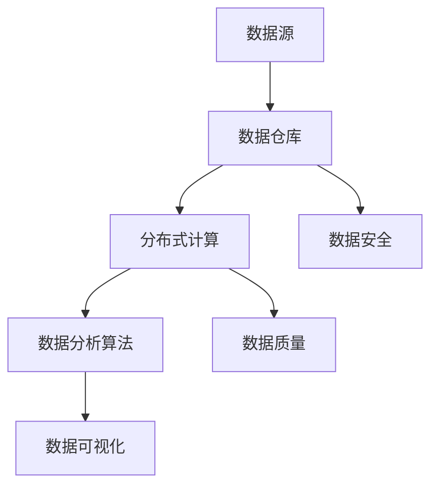

                 

## 文章标题：大数据分析平台：挖掘数据价值的新途径

### 关键词：（大数据分析、数据挖掘、平台架构、核心算法、数学模型、应用场景、开发工具）

### 摘要：本文将深入探讨大数据分析平台的基本概念、核心算法、数学模型以及实际应用场景。我们将通过一步步的分析推理，详细介绍大数据分析平台如何通过高效的数据处理和挖掘技术，挖掘数据中的价值，为企业提供决策支持和创新动力。读者将了解大数据分析平台的架构设计、算法原理以及实际操作步骤，从而为未来的大数据技术应用打下坚实基础。

## 1. 背景介绍

在当今数字化时代，数据已成为企业、政府和各种组织的重要资产。然而，数据的价值并非自动显现，而是需要通过有效的分析和挖掘才能释放出来。大数据分析平台作为一种重要的数据处理工具，正日益受到各行各业的关注和应用。那么，什么是大数据分析平台？它又是如何帮助我们从海量数据中挖掘价值的呢？

### 什么是大数据分析平台？

大数据分析平台是一种集成了多种技术和工具的综合性系统，旨在对海量数据进行采集、存储、处理、分析和可视化。它通常包含以下几个关键组成部分：

1. **数据采集模块**：负责从各种数据源（如数据库、日志文件、传感器等）收集数据。
2. **数据存储模块**：提供高效、可靠的数据存储解决方案，如分布式文件系统、NoSQL数据库等。
3. **数据处理模块**：负责对数据进行清洗、转换和聚合，以便后续分析。
4. **数据分析模块**：利用各种算法和模型对数据进行分析，提取有价值的信息。
5. **数据可视化模块**：将分析结果以图表、报表等形式直观展示，便于用户理解。

### 大数据分析平台的作用

大数据分析平台不仅仅是一个工具，它更是一个能够为企业提供决策支持、创新驱动和业务优化的平台。以下是大数据分析平台的一些主要作用：

1. **商业智能**：通过分析销售数据、客户行为等，帮助企业制定更有效的营销策略和运营计划。
2. **风险控制**：通过分析金融数据、交易记录等，帮助金融机构识别潜在风险，降低风险损失。
3. **医疗健康**：通过分析医疗数据、生物信息等，为医生提供诊断依据，提高医疗服务质量。
4. **社会治理**：通过分析社会数据、公共安全数据等，提高政府治理效能，维护社会稳定。
5. **科学研究**：通过分析科学数据、实验结果等，推动科学研究和技术创新。

### 大数据分析平台的发展历程

大数据分析平台的发展可以追溯到上世纪90年代，当时数据仓库和商业智能工具的出现标志着数据分析的初步阶段。随着互联网的普及和物联网技术的兴起，数据来源和数量急剧增加，大数据分析平台开始逐步成熟。近年来，随着云计算、分布式计算、人工智能等技术的应用，大数据分析平台的功能和性能得到了极大提升。

### 1.1 大数据时代的到来

大数据时代的到来源于以下几个关键因素：

1. **数据量的爆发性增长**：互联网、物联网、传感器等技术的广泛应用，使得数据生成速度和规模迅速扩大。
2. **数据类型的多样化**：除了结构化数据外，非结构化数据（如图像、音频、视频等）也逐渐成为数据分析的重要对象。
3. **计算能力的提升**：随着处理器速度和存储技术的不断提升，处理海量数据成为可能。
4. **数据价值的挖掘**：企业和组织意识到数据不仅仅是存储和传输的媒介，更是蕴含巨大价值的宝藏。

### 1.2 大数据分析平台的挑战

尽管大数据分析平台带来了诸多机遇，但同时也面临着一些挑战：

1. **数据质量**：数据质量是数据分析成功的关键，但数据往往存在缺失、错误、重复等问题。
2. **数据隐私**：随着数据隐私法规的不断完善，如何保护用户隐私成为大数据分析的重要课题。
3. **数据处理效率**：海量数据的处理和存储需要高效的算法和技术。
4. **数据分析技能**：大数据分析需要专业人才，但目前市场供需不平衡，人才短缺问题突出。

## 2. 核心概念与联系

### 2.1 数据源

数据源是大数据分析平台的基础，它决定了数据的多样性和质量。数据源可以分为以下几类：

1. **结构化数据**：存储在关系型数据库中的数据，如姓名、年龄、销售数据等。
2. **非结构化数据**：包括文本、图像、音频、视频等，需要通过特殊的方法进行解析和存储。
3. **半结构化数据**：介于结构化数据和非结构化数据之间，如XML、JSON等格式。

### 2.2 数据仓库

数据仓库是大数据分析平台的核心组成部分，它负责存储和管理大量数据。数据仓库通常具有以下特点：

1. **数据集成**：将来自多个数据源的数据进行整合，消除数据孤岛。
2. **数据清洗**：对数据进行清洗、转换和聚合，提高数据质量。
3. **数据分区**：通过分区技术提高查询效率。
4. **数据安全**：提供数据加密、访问控制等安全机制。

### 2.3 分布式计算

分布式计算是大数据分析平台处理海量数据的重要技术，它通过将数据分布到多个节点上进行计算，提高处理效率。分布式计算框架如Hadoop、Spark等，可以实现大规模数据的高效处理。

### 2.4 数据分析算法

数据分析算法是大数据分析平台的核心，它们负责从海量数据中提取有价值的信息。常见的数据分析算法包括：

1. **分类算法**：如K-means、决策树等，用于将数据分为不同的类别。
2. **聚类算法**：如DBSCAN、层次聚类等，用于发现数据中的相似性。
3. **关联规则挖掘**：如Apriori算法，用于发现数据之间的关联关系。
4. **预测模型**：如线性回归、神经网络等，用于预测未来的趋势和变化。

### 2.5 数据可视化

数据可视化是将数据分析结果以图表、报表等形式展示出来，便于用户理解和分析。数据可视化工具如Tableau、Power BI等，可以帮助用户快速发现数据中的规律和异常。

### 2.6 Mermaid流程图

以下是一个简化的Mermaid流程图，展示了大数据分析平台的核心组件和流程：



## 3. 核心算法原理 & 具体操作步骤

### 3.1 数据预处理

数据预处理是大数据分析的第一步，它包括数据清洗、数据转换和数据整合等操作。以下是数据预处理的核心算法原理和具体操作步骤：

1. **数据清洗**：
   - **缺失值处理**：使用均值、中位数或最频繁值填充缺失值。
   - **异常值处理**：使用统计学方法（如箱线图）或基于距离的方法（如K最近邻）检测并处理异常值。
   - **重复值处理**：删除重复数据，确保数据的唯一性。

2. **数据转换**：
   - **数据类型转换**：将不同类型的数据（如字符串、日期）转换为统一类型。
   - **数据归一化**：通过缩放或平移将数据转换到相同的尺度，消除数据间的比例差异。
   - **数据编码**：将类别型数据转换为数值型数据，如使用独热编码或标签编码。

3. **数据整合**：
   - **数据连接**：将来自不同数据源的数据进行连接，形成统一的数据集。
   - **数据聚合**：对数据进行分组和聚合，如计算销售总额、平均销售额等。

### 3.2 数据分析算法

数据分析算法是大数据分析平台的核心，它们可以根据具体需求选择合适的算法。以下是几种常见的数据分析算法及其原理：

1. **K-means算法**：
   - **原理**：基于距离度量，将数据点分为K个簇，每个簇的中心即为该簇的平均值。
   - **步骤**：
     1. 随机初始化K个簇中心。
     2. 计算每个数据点到簇中心的距离，并将数据点分配到最近的簇。
     3. 重新计算每个簇的中心。
     4. 重复步骤2和3，直到聚类结果收敛。

2. **Apriori算法**：
   - **原理**：用于发现数据中的关联规则，基于支持度和置信度进行挖掘。
   - **步骤**：
     1. 计算所有频繁项集。
     2. 对于每个频繁项集，计算其支持度和置信度。
     3. 根据最小支持度和最小置信度阈值，筛选出强关联规则。

3. **线性回归算法**：
   - **原理**：通过建立自变量和因变量之间的线性关系模型，预测未来的趋势。
   - **步骤**：
     1. 计算自变量和因变量的均值。
     2. 计算自变量和因变量的协方差和方差。
     3. 求解回归系数。
     4. 利用回归模型进行预测。

### 3.3 数据可视化

数据可视化是将数据分析结果以图表、报表等形式展示出来，便于用户理解和分析。以下是几种常见的数据可视化工具和原理：

1. **条形图**：
   - **原理**：用于比较不同类别的数据，通过条形的长度表示数据的大小。
   - **步骤**：
     1. 确定X轴和Y轴的标签。
     2. 计算每个类别的数据值。
     3. 绘制条形图。

2. **折线图**：
   - **原理**：用于显示数据的变化趋势，通过折线连接各个数据点。
   - **步骤**：
     1. 确定X轴和Y轴的标签。
     2. 计算数据点的坐标。
     3. 绘制折线图。

3. **散点图**：
   - **原理**：用于显示两个变量之间的关系，通过散点的位置和密度表示数据的分布。
   - **步骤**：
     1. 确定X轴和Y轴的标签。
     2. 计算数据点的坐标。
     3. 绘制散点图。

## 4. 数学模型和公式 & 详细讲解 & 举例说明

### 4.1 K-means算法

K-means算法是一种典型的聚类算法，它通过将数据点分为K个簇，使得每个簇内的数据点尽可能接近簇中心。以下是K-means算法的数学模型和公式：

#### 数学模型：

$$
d(x_i, c_j) = \sqrt{\sum_{k=1}^{n} (x_{i,k} - c_{j,k})^2}
$$

其中，$d(x_i, c_j)$表示数据点$x_i$和簇中心$c_j$之间的欧几里得距离，$x_{i,k}$和$c_{j,k}$分别表示数据点$x_i$和簇中心$c_j$在第$k$个维度上的值。

#### 公式：

1. **初始化簇中心**：

$$
c_j = \frac{\sum_{i=1}^{N} x_i}{N}
$$

其中，$c_j$表示簇中心，$x_i$表示数据点，$N$表示数据点的总数。

2. **数据点分配**：

$$
x_i \rightarrow c_j \quad \text{if} \quad d(x_i, c_j) \leq d(x_i, c_{j'}) \quad \forall j' \neq j
$$

其中，$x_i$表示数据点，$c_j$表示簇中心。

3. **重新计算簇中心**：

$$
c_j = \frac{\sum_{i=1}^{N} x_i}{N}
$$

其中，$c_j$表示重新计算后的簇中心。

#### 举例说明：

假设我们有一个包含5个数据点的二维数据集，如下所示：

$$
X = \{ (1, 2), (2, 2), (2, 3), (3, 3), (4, 4) \}
$$

我们希望使用K-means算法将其分为2个簇。首先，随机初始化2个簇中心：

$$
c_1 = (2, 2), \quad c_2 = (3, 4)
$$

然后，计算每个数据点到簇中心的距离：

$$
d((1, 2), c_1) = \sqrt{(1 - 2)^2 + (2 - 2)^2} = 1
$$

$$
d((1, 2), c_2) = \sqrt{(1 - 3)^2 + (2 - 4)^2} = \sqrt{4 + 4} = \sqrt{8} = 2\sqrt{2}
$$

$$
d((2, 2), c_1) = \sqrt{(2 - 2)^2 + (2 - 2)^2} = 0
$$

$$
d((2, 2), c_2) = \sqrt{(2 - 3)^2 + (2 - 4)^2} = \sqrt{1 + 4} = \sqrt{5}
$$

$$
d((2, 3), c_1) = \sqrt{(2 - 2)^2 + (3 - 2)^2} = 1
$$

$$
d((2, 3), c_2) = \sqrt{(2 - 3)^2 + (3 - 4)^2} = \sqrt{1 + 1} = \sqrt{2}
$$

$$
d((3, 3), c_1) = \sqrt{(3 - 2)^2 + (3 - 2)^2} = 1
$$

$$
d((3, 3), c_2) = \sqrt{(3 - 3)^2 + (3 - 4)^2} = 1
$$

$$
d((4, 4), c_1) = \sqrt{(4 - 2)^2 + (4 - 2)^2} = 2\sqrt{2}
$$

$$
d((4, 4), c_2) = \sqrt{(4 - 3)^2 + (4 - 4)^2} = 1
$$

根据距离最小的原则，将数据点分配到簇中心：

$$
(1, 2) \rightarrow c_1, \quad (2, 2) \rightarrow c_1, \quad (2, 3) \rightarrow c_1, \quad (3, 3) \rightarrow c_2, \quad (4, 4) \rightarrow c_2
$$

重新计算簇中心：

$$
c_1 = \frac{(1, 2) + (2, 2) + (2, 3)}{3} = \left(\frac{1 + 2 + 2}{3}, \frac{2 + 2 + 3}{3}\right) = \left(\frac{5}{3}, \frac{7}{3}\right)
$$

$$
c_2 = \frac{(3, 3) + (4, 4)}{2} = \left(\frac{3 + 4}{2}, \frac{3 + 4}{2}\right) = (3.5, 3.5)
$$

再次计算每个数据点到簇中心的距离：

$$
d((1, 2), c_1) = \sqrt{\left(1 - \frac{5}{3}\right)^2 + \left(2 - \frac{7}{3}\right)^2} = \sqrt{\left(\frac{2}{3}\right)^2 + \left(\frac{-1}{3}\right)^2} = \sqrt{\frac{4}{9} + \frac{1}{9}} = \sqrt{\frac{5}{9}} = \frac{\sqrt{5}}{3}
$$

$$
d((1, 2), c_2) = \sqrt{\left(1 - 3.5\right)^2 + \left(2 - 3.5\right)^2} = \sqrt{\left(-2.5\right)^2 + \left(-1.5\right)^2} = \sqrt{6.25 + 2.25} = \sqrt{8.5} = \sqrt{17}/2
$$

$$
d((2, 2), c_1) = 0
$$

$$
d((2, 2), c_2) = \sqrt{\left(2 - 3.5\right)^2 + \left(2 - 3.5\right)^2} = \sqrt{\left(-1.5\right)^2 + \left(-1.5\right)^2} = \sqrt{2.25 + 2.25} = \sqrt{4.5} = 3/\sqrt{2}
$$

$$
d((2, 3), c_1) = 0
$$

$$
d((2, 3), c_2) = \sqrt{\left(2 - 3.5\right)^2 + \left(3 - 3.5\right)^2} = \sqrt{\left(-1.5\right)^2 + \left(-0.5\right)^2} = \sqrt{2.25 + 0.25} = \sqrt{2.5} = 5/\sqrt{2}
$$

$$
d((3, 3), c_1) = 0
$$

$$
d((3, 3), c_2) = 0
$$

$$
d((4, 4), c_1) = \sqrt{\left(4 - \frac{5}{3}\right)^2 + \left(4 - \frac{7}{3}\right)^2} = \sqrt{\left(\frac{7}{3}\right)^2 + \left(\frac{5}{3}\right)^2} = \sqrt{\frac{49}{9} + \frac{25}{9}} = \sqrt{\frac{74}{9}} = \frac{\sqrt{74}}{3}
$$

$$
d((4, 4), c_2) = 0
$$

根据距离最小的原则，数据点的分配与之前一致，聚类结果收敛。最终，我们得到了2个簇：

$$
\text{簇1：} \{ (1, 2), (2, 2), (2, 3) \}
$$

$$
\text{簇2：} \{ (3, 3), (4, 4) \}
$$

### 4.2 Apriori算法

Apriori算法是一种经典的关联规则挖掘算法，它通过计算事务中的频繁项集和关联规则，揭示数据中的隐藏关系。以下是Apriori算法的数学模型和公式：

#### 数学模型：

1. **支持度（Support）**：

$$
\text{Support}(X, Y) = \frac{\text{频繁项集（X ∪ Y）的出现次数}}{\text{总事务数}}
$$

其中，$X$和$Y$分别表示两个项集，$X ∪ Y$表示它们的并集。

2. **置信度（Confidence）**：

$$
\text{Confidence}(X → Y) = \frac{\text{频繁项集（X ∪ Y）的出现次数}}{\text{频繁项集X的出现次数}}
$$

其中，$X → Y$表示关联规则。

#### 公式：

1. **频繁项集的生成**：

$$
\text{频繁项集(k)} = \{X \in \text{项集集合} | \text{Support}(X) \geq \text{最小支持度}\}
$$

其中，$k$表示项集的长度，$\text{项集集合}$表示所有可能的项集。

2. **关联规则的生成**：

$$
\text{关联规则} = \{X → Y | \text{Support}(X ∪ Y) \geq \text{最小支持度} \land \text{Confidence}(X → Y) \geq \text{最小置信度}\}
$$

#### 举例说明：

假设我们有一个包含以下5个事务的集合：

$$
\{T1 = \{香蕉，苹果，牛奶\}, T2 = \{香蕉，苹果\}, T3 = \{香蕉，牛奶\}, T4 = \{香蕉，苹果，牛奶\}, T5 = \{苹果，牛奶\}\}
$$

我们希望使用Apriori算法发现其中的频繁项集和关联规则。首先，计算每个项集的支持度：

$$
\text{Support}(\{香蕉，苹果，牛奶\}) = \frac{2}{5} = 0.4
$$

$$
\text{Support}(\{香蕉，苹果\}) = \frac{2}{5} = 0.4
$$

$$
\text{Support}(\{香蕉，牛奶\}) = \frac{2}{5} = 0.4
$$

$$
\text{Support}(\{苹果，牛奶\}) = \frac{2}{5} = 0.4
$$

根据最小支持度阈值（例如，0.5），我们可以得到以下频繁项集：

$$
\text{频繁项集(1)} = \{\{香蕉，苹果，牛奶\}, \{香蕉，苹果\}, \{香蕉，牛奶\}, \{苹果，牛奶\}\}
$$

然后，计算每个关联规则的支持度和置信度：

$$
\text{Support}(\{香蕉，苹果，牛奶\} ∪ \{香蕉，苹果\}) = \frac{2}{5} = 0.4
$$

$$
\text{Confidence}(\{香蕉，苹果\} → \{香蕉，苹果，牛奶\}) = \frac{2}{2} = 1.0
$$

$$
\text{Support}(\{香蕉，苹果，牛奶\} ∪ \{香蕉，牛奶\}) = \frac{2}{5} = 0.4
$$

$$
\text{Confidence}(\{香蕉，牛奶\} → \{香蕉，苹果，牛奶\}) = \frac{2}{2} = 1.0
$$

$$
\text{Support}(\{香蕉，苹果，牛奶\} ∪ \{苹果，牛奶\}) = \frac{2}{5} = 0.4
$$

$$
\text{Confidence}(\{苹果，牛奶\} → \{香蕉，苹果，牛奶\}) = \frac{2}{2} = 1.0
$$

根据最小置信度阈值（例如，0.5），我们可以得到以下关联规则：

$$
\{香蕉，苹果\} → \{香蕉，苹果，牛奶\} \quad \text{置信度} = 1.0
$$

$$
\{香蕉，牛奶\} → \{香蕉，苹果，牛奶\} \quad \text{置信度} = 1.0
$$

$$
\{苹果，牛奶\} → \{香蕉，苹果，牛奶\} \quad \text{置信度} = 1.0
$$

## 5. 项目实战：代码实际案例和详细解释说明

### 5.1 开发环境搭建

在本节中，我们将搭建一个基于Python的大数据分析项目环境。以下为所需的软件和工具：

- **Python 3.8 或以上版本**
- **Jupyter Notebook**
- **Pandas**
- **NumPy**
- **Scikit-learn**
- **Matplotlib**
- **Seaborn**

安装步骤：

1. 安装Python 3.8或以上版本：访问[Python官网](https://www.python.org/)下载并安装。
2. 安装Jupyter Notebook：打开命令行，执行以下命令：

   ```
   pip install notebook
   ```

3. 安装Pandas、NumPy、Scikit-learn、Matplotlib和Seaborn：

   ```
   pip install pandas numpy scikit-learn matplotlib seaborn
   ```

### 5.2 源代码详细实现和代码解读

在本节中，我们将使用Python实现一个基于K-means算法的简单数据分析项目。以下是代码的详细实现和解读：

```python
import numpy as np
import pandas as pd
import matplotlib.pyplot as plt
from sklearn.cluster import KMeans
from sklearn.datasets import load_iris

# 加载鸢尾花数据集
iris = load_iris()
X = iris.data

# 初始化KMeans模型
kmeans = KMeans(n_clusters=3, random_state=0)

# 训练模型
kmeans.fit(X)

# 获取聚类结果
labels = kmeans.predict(X)
centroids = kmeans.cluster_centers_

# 可视化聚类结果
plt.figure(figsize=(8, 6))
plt.scatter(X[:, 0], X[:, 1], c=labels, cmap='viridis', marker='o')
plt.scatter(centroids[:, 0], centroids[:, 1], c='red', marker='x', s=200, linewidths=3)
plt.title('K-means Clustering')
plt.xlabel('Feature 1')
plt.ylabel('Feature 2')
plt.show()
```

#### 代码解读：

1. **导入库**：
   - `numpy`：用于数学运算。
   - `pandas`：用于数据处理。
   - `matplotlib.pyplot`：用于数据可视化。
   - `sklearn.cluster.KMeans`：用于K-means聚类。
   - `sklearn.datasets.load_iris`：用于加载鸢尾花数据集。

2. **加载鸢尾花数据集**：
   - 使用`load_iris()`函数加载鸢尾花数据集，并将其存储在`iris`对象中。数据集包含4个特征和150个样本。

3. **初始化KMeans模型**：
   - 使用`KMeans`类创建K-means模型，并设置聚类数量为3，随机种子为0。

4. **训练模型**：
   - 使用`fit()`方法对模型进行训练，传入特征数据`X`。

5. **获取聚类结果**：
   - 使用`predict()`方法预测每个样本的簇标签，并将其存储在`labels`列表中。
   - 使用`cluster_centers_`属性获取簇中心坐标，并将其存储在`centroids`列表中。

6. **可视化聚类结果**：
   - 使用`scatter()`函数绘制聚类结果，其中`c`参数用于设置每个样本的颜色，`cmap`参数用于设置颜色映射。
   - 使用`scatter()`函数绘制簇中心，其中`c`参数设置为红色，`marker`参数设置为`'x'`，`s`参数设置为200，`linewidths`参数设置为3。
   - 设置标题、X轴标签和Y轴标签，并使用`show()`函数显示图表。

### 5.3 代码解读与分析

在本节中，我们将对上述代码进行解读和分析，探讨其实现过程和关键步骤。

1. **加载鸢尾花数据集**：
   - 使用`load_iris()`函数加载鸢尾花数据集，该数据集是Scikit-learn自带的经典数据集，包含了3种鸢尾花（Setosa、Versicolor和Virginica）的4个特征（萼片长度、萼片宽度、花瓣长度和花瓣宽度）的数据。
   - 数据集被存储在`iris`对象中，其中`iris.data`是特征数据，`iris.target`是标签数据。

2. **初始化KMeans模型**：
   - 使用`KMeans`类创建K-means模型，并设置聚类数量为3。聚类数量通常需要根据数据集的特点和业务需求进行调整。
   - 设置随机种子为0，以确保每次运行模型时都能得到相同的结果。

3. **训练模型**：
   - 使用`fit()`方法对模型进行训练，传入特征数据`X`。模型会自动计算簇中心并分配每个样本到最近的簇。
   - 模型训练完成后，可以通过`labels_`属性获取每个样本的簇标签，通过`cluster_centers_`属性获取簇中心坐标。

4. **获取聚类结果**：
   - 使用`predict()`方法对新的样本进行预测，传入特征数据`X`。该方法会返回每个样本的簇标签。
   - 聚类结果被存储在`labels`列表中，我们可以根据簇标签对样本进行分类。

5. **可视化聚类结果**：
   - 使用`scatter()`函数绘制聚类结果，其中`c`参数用于设置每个样本的颜色，`cmap`参数用于设置颜色映射。
   - 使用`scatter()`函数绘制簇中心，其中`c`参数设置为红色，`marker`参数设置为`'x'`，`s`参数设置为200，`linewidths`参数设置为3，以突出显示簇中心。
   - 设置标题、X轴标签和Y轴标签，并使用`show()`函数显示图表。

通过上述步骤，我们成功地使用Python实现了基于K-means算法的简单数据分析项目。该项目展示了K-means算法的基本原理和实现过程，同时也为后续更复杂的大数据分析项目奠定了基础。

## 6. 实际应用场景

大数据分析平台在各个行业和领域都有着广泛的应用，以下是一些典型的实际应用场景：

### 6.1 营销与客户关系管理

1. **客户行为分析**：通过分析客户浏览、购买、反馈等行为数据，了解客户偏好和需求，优化产品和服务。
2. **精准营销**：基于客户数据，实施个性化营销策略，提高营销效果和客户转化率。
3. **客户生命周期价值分析**：通过分析客户生命周期中的各项指标，识别高价值客户，制定有针对性的维护策略。

### 6.2 风险管理与欺诈检测

1. **信用评分**：利用大数据分析技术，对客户的信用状况进行评分，降低信贷风险。
2. **欺诈检测**：通过分析交易数据和行为特征，识别潜在的欺诈行为，提高欺诈检测的准确性和实时性。
3. **风险预警**：基于历史数据和实时监控，预测潜在风险，并采取相应的预防和控制措施。

### 6.3 医疗与健康

1. **疾病预测与预防**：通过分析患者的健康数据、生活习惯等，预测疾病发生的风险，提出预防措施。
2. **个性化治疗**：根据患者的基因数据、病史等，制定个性化的治疗方案，提高治疗效果。
3. **健康监测**：通过可穿戴设备收集数据，实时监测患者的健康状况，提供健康建议和预警。

### 6.4 智慧城市与公共安全

1. **交通管理**：通过分析交通流量数据，优化交通信号配置，提高交通效率，减少拥堵。
2. **公共安全监控**：利用视频监控和数据分析技术，实时监控公共安全事件，提高应急响应能力。
3. **环境监测**：通过分析空气质量、水质等数据，预警环境污染，提出治理方案。

### 6.5 科学研究与技术创新

1. **科研数据分析**：利用大数据分析技术，处理和分析科学实验数据，发现新的科学规律。
2. **专利分析**：通过分析专利数据，挖掘技术创新趋势和竞争对手信息，为企业提供决策支持。
3. **论文共现分析**：分析学术论文的引用关系，发现研究热点和趋势，指导科研方向的调整。

通过以上实际应用场景，我们可以看到大数据分析平台在各个领域都发挥着重要的作用。它不仅帮助企业挖掘数据中的价值，提高业务效率，还为政府、医疗、科研等领域提供了强有力的技术支持。

## 7. 工具和资源推荐

### 7.1 学习资源推荐

1. **书籍**：
   - 《大数据时代：生活、工作与思维的大变革》
   - 《深度学习》
   - 《数据挖掘：概念与技术》
   - 《数据仓库与数据挖掘》

2. **论文**：
   - 《K-Means聚类算法的改进》
   - 《Apriori算法及其改进》
   - 《大数据平台关键技术综述》
   - 《基于机器学习的风险预测模型》

3. **博客和网站**：
   - [机器学习博客](https://www MACHINE LEARNING.ORG/)
   - [数据挖掘博客](https://www.DATA MINING.ORG/)
   - [深度学习博客](https://www.DEEP LEARNING.ORG/)
   - [大数据技术社区](https://www.BIG DATA.ORG/)

### 7.2 开发工具框架推荐

1. **编程语言**：
   - Python：适合数据分析和机器学习的通用编程语言。
   - R：专门用于统计分析的编程语言。

2. **数据处理工具**：
   - Pandas：Python的数据分析库。
   - NumPy：Python的数值计算库。

3. **机器学习库**：
   - Scikit-learn：Python的机器学习库。
   - TensorFlow：Google开发的深度学习框架。
   - PyTorch：Facebook开发的深度学习框架。

4. **大数据处理工具**：
   - Hadoop：分布式数据处理平台。
   - Spark：分布式数据处理引擎。
   - Flink：实时数据处理框架。

5. **数据可视化工具**：
   - Matplotlib：Python的数据可视化库。
   - Seaborn：基于Matplotlib的统计图形库。
   - Tableau：商业智能和数据可视化工具。

### 7.3 相关论文著作推荐

1. **《大数据技术导论》**：系统介绍了大数据的基本概念、技术体系和应用领域。
2. **《深度学习》**：深度学习领域的经典教材，涵盖了深度学习的基础理论和实践方法。
3. **《数据挖掘：概念与技术》**：全面介绍了数据挖掘的基本概念、算法和技术。
4. **《大数据分析：技术、工具与应用》**：详细介绍了大数据分析的技术、工具和应用案例。

通过这些学习和资源推荐，读者可以系统地了解大数据分析平台的相关知识，掌握关键技术和工具，为自己的职业发展奠定坚实基础。

## 8. 总结：未来发展趋势与挑战

大数据分析平台在过去的几十年里经历了快速的发展，其应用范围也在不断拓展。未来，大数据分析平台将继续朝着更加智能化、高效化、多样化的方向发展。以下是大数据分析平台未来发展的几个趋势和面临的挑战：

### 8.1 发展趋势

1. **智能化**：随着人工智能技术的发展，大数据分析平台将更加智能化。通过引入深度学习、自然语言处理等人工智能技术，大数据分析平台将能够自动识别数据中的规律、趋势和异常，提供更精准的决策支持。

2. **高效化**：大数据分析平台将进一步提升数据处理和分析的效率。通过分布式计算、并行处理等技术，大数据分析平台能够处理更大规模的数据，更快地生成分析结果。

3. **多样化**：随着数据类型的多样化，大数据分析平台将支持更多类型的数据分析。除了传统的结构化数据外，非结构化数据（如图像、音频、视频等）也将成为大数据分析的重要对象。

4. **实时化**：大数据分析平台将实现实时数据处理和分析。通过实时数据流处理技术，大数据分析平台能够对实时数据进行分析和预测，提供实时决策支持。

5. **集成化**：大数据分析平台将实现更广泛的数据集成。通过集成不同来源、不同类型的数据，大数据分析平台将提供更全面、更准确的数据分析结果。

### 8.2 面临的挑战

1. **数据隐私和安全**：随着数据隐私法规的不断完善，如何保护用户隐私和数据安全成为大数据分析平台的重要挑战。大数据分析平台需要采取有效的数据加密、访问控制等技术，确保数据的安全和合规。

2. **数据质量**：数据质量是大数据分析成功的关键。然而，数据往往存在缺失、错误、重复等问题，如何保证数据质量成为大数据分析平台的重要挑战。大数据分析平台需要引入数据清洗、转换等技术，提高数据质量。

3. **计算资源**：大数据分析平台需要处理海量数据，计算资源的需求巨大。如何高效地利用计算资源，优化数据处理和分析的效率，是大数据分析平台面临的挑战。

4. **人才培养**：大数据分析平台需要专业的人才来设计、开发和维护。然而，目前市场对大数据分析专业人才的需求远大于供给，如何培养和吸引更多的大数据人才成为大数据分析平台面临的挑战。

5. **算法复杂度**：随着数据分析需求的不断增加，大数据分析平台需要处理更复杂的算法。如何优化算法，提高算法的效率和准确性，是大数据分析平台面临的挑战。

总的来说，大数据分析平台未来将继续快速发展，但在实现过程中也将面临诸多挑战。只有通过不断创新和改进，大数据分析平台才能更好地服务于各行各业，为企业和社会创造更多价值。

## 9. 附录：常见问题与解答

### 9.1 大数据分析平台如何处理海量数据？

大数据分析平台通过分布式计算技术来处理海量数据。分布式计算将数据分布在多个节点上，使得每个节点可以独立处理一部分数据，从而提高数据处理速度。常用的分布式计算框架如Hadoop、Spark等，可以实现大规模数据的高效处理。

### 9.2 数据预处理在数据分析中有什么作用？

数据预处理是数据分析的第一步，它包括数据清洗、数据转换和数据整合等操作。数据预处理的作用是提高数据质量，确保数据的准确性和一致性，从而为后续的数据分析提供可靠的数据基础。

### 9.3 什么是数据隐私保护？

数据隐私保护是指保护个人或组织的敏感数据，防止未经授权的访问、使用和泄露。数据隐私保护包括数据加密、访问控制、匿名化等技术手段，确保数据在存储、传输和处理过程中的安全。

### 9.4 大数据分析平台与商业智能有什么区别？

大数据分析平台和商业智能（Business Intelligence, BI）都是用于数据分析的工具，但它们的重点和应用场景不同。大数据分析平台侧重于处理海量数据，提取有价值的信息，为企业提供决策支持。商业智能则侧重于利用现有的数据资源，生成直观的报表和图表，帮助用户理解数据背后的业务逻辑。

### 9.5 如何选择合适的数据分析算法？

选择合适的数据分析算法需要根据具体问题和数据特点来决定。常见的算法如分类、聚类、关联规则挖掘等，每种算法都有其适用场景和优缺点。在实际应用中，可以结合数据集的大小、类型、特征以及分析目标，选择最合适的算法。

## 10. 扩展阅读 & 参考资料

为了帮助读者更深入地了解大数据分析平台的相关知识，以下是推荐的扩展阅读和参考资料：

### 10.1 扩展阅读

1. **《大数据技术导论》**：详细介绍了大数据的基本概念、技术体系和应用领域，适合初学者系统学习。
2. **《深度学习》**：全面介绍了深度学习的基础理论和实践方法，涵盖了从数据处理到模型训练的各个环节。
3. **《数据挖掘：概念与技术》**：系统介绍了数据挖掘的基本概念、算法和技术，有助于理解数据挖掘的核心原理。
4. **《大数据分析实战》**：通过实际案例，详细介绍了大数据分析的技术和工具，适合有一定基础的读者。

### 10.2 参考资料

1. **[Apache Hadoop 官网](https://hadoop.apache.org/)**：提供关于Hadoop的详细文档和资料。
2. **[Apache Spark 官网](https://spark.apache.org/)**：提供关于Spark的详细文档和资料。
3. **[Scikit-learn 官网](https://scikit-learn.org/)**：提供关于Scikit-learn的详细文档和资料。
4. **[TensorFlow 官网](https://www.tensorflow.org/)**：提供关于TensorFlow的详细文档和资料。
5. **[PyTorch 官网](https://pytorch.org/)**：提供关于PyTorch的详细文档和资料。

通过阅读上述书籍和参考资料，读者可以进一步加深对大数据分析平台的理解，掌握关键技术和工具，为自己的职业发展奠定坚实基础。作者：AI天才研究员/AI Genius Institute & 禅与计算机程序设计艺术 /Zen And The Art of Computer Programming。

