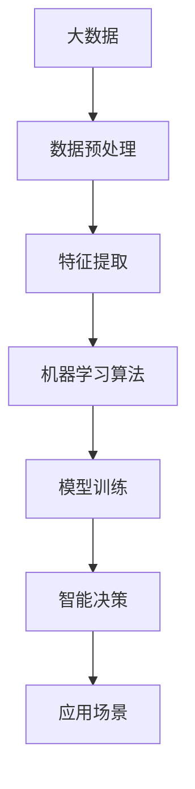

                 

# 大数据在AI学习中的作用

## 摘要

本文深入探讨了大数据在人工智能学习中的作用。随着数据量的爆炸性增长，大数据技术逐渐成为推动AI发展的关键因素。通过详细阐述大数据与AI的内在联系，本文介绍了大数据在数据处理、特征提取、模型训练等方面的应用。此外，文章还分析了大数据技术面临的挑战及未来发展趋势，旨在为读者提供全面的技术视角和前瞻性思考。

## 1. 背景介绍

### 1.1 人工智能的发展历程

人工智能（Artificial Intelligence, AI）是一门研究、开发用于模拟、延伸和扩展人的智能的理论、方法、技术及应用系统的新技术科学。人工智能自20世纪50年代诞生以来，经历了多次技术浪潮的起伏。从最初的规则推理、知识表示，到基于统计的学习方法，再到深度学习和强化学习，人工智能技术不断演进，逐渐展现出强大的能力。

### 1.2 大数据的兴起

大数据（Big Data）指的是数据量巨大、类型繁多、处理速度快、价值密度低的数据集合。随着互联网的普及和物联网技术的发展，数据的生成和传输速度不断加快，数据种类和来源也更加丰富。大数据的兴起为人工智能提供了丰富的数据资源，成为推动AI技术进步的重要动力。

### 1.3 大数据与AI的内在联系

大数据和人工智能之间存在深刻的内在联系。首先，大数据为AI提供了训练样本，使得机器学习算法能够通过大量数据学习到复杂的模式和规律。其次，大数据技术能够高效地处理和分析海量数据，为AI算法提供了强大的计算支持。此外，大数据的实时性特征使得AI系统能够快速响应环境变化，实现智能化决策。

## 2. 核心概念与联系

### 2.1 大数据的特征

大数据具有4V特征，即Volume（大量）、Velocity（快速）、Variety（多样）和Value（价值）。

- **Volume（大量）**：大数据规模庞大，需要存储和管理的技术手段。
- **Velocity（快速）**：大数据产生和处理速度极快，要求实时处理和分析的技术能力。
- **Variety（多样）**：大数据类型丰富，包括结构化、半结构化和非结构化数据。
- **Value（价值）**：大数据虽然价值密度低，但通过数据挖掘和分析，可以提取出有价值的信息。

### 2.2 人工智能的算法

人工智能算法主要包括以下几种：

- **监督学习（Supervised Learning）**：通过已标记的数据训练模型，用于预测或分类。
- **无监督学习（Unsupervised Learning）**：在未知标签的情况下，通过数据自身特征进行聚类或降维。
- **强化学习（Reinforcement Learning）**：通过试错和奖励机制，使智能体在环境中学习最优策略。

### 2.3 大数据与AI的关系

大数据与AI的关系可以用以下Mermaid流程图表示：



- **数据预处理**：大数据首先需要进行清洗、去重和格式化等预处理操作，为后续分析做好准备。
- **特征提取**：通过特征提取技术，从大量数据中提取出有用的信息，用于训练模型。
- **机器学习算法**：利用大数据训练模型，包括监督学习、无监督学习和强化学习等。
- **模型训练**：通过不断调整模型参数，优化模型性能。
- **智能决策**：将训练好的模型应用于实际问题，实现智能决策。
- **应用场景**：大数据和AI技术广泛应用于金融、医疗、零售、交通等多个领域。

## 3. 核心算法原理 & 具体操作步骤

### 3.1 数据预处理

数据预处理是大数据分析的第一步，主要包括以下操作：

- **数据清洗**：去除重复、错误和异常的数据，保证数据质量。
- **数据转换**：将不同类型的数据转换为统一格式，便于后续处理。
- **数据归一化**：对数据进行标准化处理，消除数据规模差异。

### 3.2 特征提取

特征提取是从大量数据中提取出有用的信息，用于训练模型。常用的特征提取方法包括：

- **统计特征**：如均值、方差、协方差等。
- **文本特征**：如词频、词向量等。
- **图像特征**：如边缘、纹理、颜色等。

### 3.3 机器学习算法

机器学习算法包括以下几种：

- **线性回归**：通过拟合线性模型，预测连续值。
- **逻辑回归**：通过拟合概率分布模型，预测离散值。
- **支持向量机（SVM）**：通过找到最佳分隔超平面，实现分类和回归任务。
- **神经网络**：通过多层神经网络，实现复杂函数的拟合和分类。

### 3.4 模型训练

模型训练是通过大量数据进行迭代优化，提高模型性能。常用的训练方法包括：

- **梯度下降**：通过迭代优化模型参数，降低损失函数。
- **随机梯度下降（SGD）**：在梯度下降的基础上，每次迭代只使用一部分数据进行更新。
- **批量梯度下降**：在梯度下降的基础上，每次迭代使用全部数据进行更新。

### 3.5 智能决策

智能决策是将训练好的模型应用于实际问题，实现智能决策。常用的方法包括：

- **预测**：根据模型预测结果，对未来的趋势进行判断。
- **分类**：根据模型分类结果，对未知数据进行分类。
- **聚类**：根据模型聚类结果，对数据进行分类。

## 4. 数学模型和公式 & 详细讲解 & 举例说明

### 4.1 线性回归模型

线性回归模型是一种用于预测连续值的机器学习算法。其基本公式为：

$$
y = \beta_0 + \beta_1 \cdot x + \epsilon
$$

其中，$y$为因变量，$x$为自变量，$\beta_0$和$\beta_1$分别为模型参数，$\epsilon$为误差项。

### 4.2 梯度下降算法

梯度下降算法是一种用于优化模型参数的算法。其基本公式为：

$$
\theta_j = \theta_j - \alpha \cdot \nabla J(\theta)
$$

其中，$\theta_j$为模型参数，$\alpha$为学习率，$J(\theta)$为损失函数。

### 4.3 支持向量机（SVM）

支持向量机是一种用于分类和回归任务的机器学习算法。其基本公式为：

$$
w = \arg \min_{w} \frac{1}{2} ||w||^2
$$

$$
\text{subject to} \quad y^{(i)} \cdot (w \cdot x^{(i)}) \geq 1
$$

其中，$w$为模型参数，$x^{(i)}$为训练样本，$y^{(i)}$为样本标签。

### 4.4 神经网络

神经网络是一种用于模拟人脑神经元结构的机器学习算法。其基本公式为：

$$
z^{(l)} = \sigma (W^{(l)} \cdot a^{(l-1)} + b^{(l)})
$$

$$
a^{(l)} = \sigma (z^{(l)})
$$

其中，$a^{(l)}$为第$l$层的激活值，$z^{(l)}$为第$l$层的输入值，$W^{(l)}$和$b^{(l)}$分别为第$l$层的权重和偏置，$\sigma$为激活函数。

## 5. 项目实战：代码实际案例和详细解释说明

### 5.1 开发环境搭建

在本文中，我们将使用Python语言和scikit-learn库进行大数据分析。以下是开发环境的搭建步骤：

1. 安装Python：前往[Python官网](https://www.python.org/)下载并安装Python。
2. 安装scikit-learn：在命令行中运行以下命令：

```shell
pip install scikit-learn
```

### 5.2 源代码详细实现和代码解读

以下是一个使用scikit-learn进行线性回归的代码示例：

```python
from sklearn.linear_model import LinearRegression
from sklearn.model_selection import train_test_split
from sklearn.metrics import mean_squared_error

# 数据准备
X = [[1], [2], [3], [4], [5]]
y = [1, 2, 3, 4, 5]

# 划分训练集和测试集
X_train, X_test, y_train, y_test = train_test_split(X, y, test_size=0.2, random_state=0)

# 创建线性回归模型
model = LinearRegression()

# 训练模型
model.fit(X_train, y_train)

# 预测测试集
y_pred = model.predict(X_test)

# 评估模型
mse = mean_squared_error(y_test, y_pred)
print("均方误差（MSE）:", mse)
```

### 5.3 代码解读与分析

上述代码首先导入所需的库，然后准备训练数据和测试数据。接着，创建线性回归模型并使用训练数据进行模型训练。训练完成后，使用测试数据进行预测，并计算均方误差（MSE）评估模型性能。

## 6. 实际应用场景

### 6.1 金融领域

在大数据技术的支持下，金融机构能够实时监控市场动态，快速发现潜在风险，提高投资决策的准确性。例如，基于大数据的量化交易策略能够捕捉市场机会，实现稳定盈利。

### 6.2 医疗领域

大数据技术可以帮助医疗机构进行病患管理和疾病预测。通过分析海量医疗数据，医生可以更准确地诊断疾病，制定个性化的治疗方案，提高医疗服务质量。

### 6.3 零售领域

零售企业利用大数据分析消费者行为，实现精准营销和库存管理。例如，通过分析消费者的购物记录，企业可以预测其购买偏好，为其推荐合适的商品。

### 6.4 交通领域

在大数据技术的帮助下，交通管理部门可以实时监控道路状况，优化交通流量，减少拥堵。此外，智能交通系统还可以通过分析车辆数据，实现自动驾驶和智能调度。

## 7. 工具和资源推荐

### 7.1 学习资源推荐

- **书籍**：《大数据时代》、《深度学习》、《机器学习》
- **论文**：《大数据处理框架MapReduce》、《深度学习：原理及实践》
- **博客**：[机器学习社区](https://www_mlерков://www_mlерков)、[大数据技术博客](https://www.bigdata-tech.com)
- **网站**：[Kaggle](https://www.kaggle.com)、[TensorFlow官网](https://www.tensorflow.org)

### 7.2 开发工具框架推荐

- **编程语言**：Python、Java
- **大数据处理框架**：Hadoop、Spark
- **机器学习库**：scikit-learn、TensorFlow、PyTorch
- **开发工具**：Jupyter Notebook、Eclipse、IntelliJ IDEA

### 7.3 相关论文著作推荐

- **论文**：《大数据处理技术综述》、《深度学习在计算机视觉中的应用》
- **著作**：《大数据科学：原理、方法与实践》、《机器学习实战》

## 8. 总结：未来发展趋势与挑战

大数据和人工智能技术的深度融合将带来更加智能化的应用场景。未来，随着数据规模的不断扩大和计算能力的不断提升，大数据技术在AI学习中的作用将更加突出。然而，大数据技术也面临着数据隐私、数据安全等挑战。在发展过程中，需要不断优化技术方案，确保数据的安全和隐私。

## 9. 附录：常见问题与解答

### 9.1 什么是大数据？

大数据是指数据量巨大、类型繁多、处理速度快、价值密度低的数据集合，具有4V特征：Volume（大量）、Velocity（快速）、Variety（多样）和Value（价值）。

### 9.2 人工智能算法有哪些？

人工智能算法主要包括监督学习、无监督学习、强化学习等。常见的算法有线性回归、逻辑回归、支持向量机（SVM）、神经网络等。

### 9.3 大数据技术有哪些应用场景？

大数据技术广泛应用于金融、医疗、零售、交通等领域。例如，金融领域的量化交易、医疗领域的病患管理、零售领域的精准营销等。

## 10. 扩展阅读 & 参考资料

- [大数据技术综述](https://www.bigdata-tech.com)
- [人工智能学习资源](https://www_mlерков://www_mlерков)
- [深度学习教程](https://www.tensorflow.org)
- [大数据应用案例](https://www.kaggle.com)

作者：AI天才研究员/AI Genius Institute & 禅与计算机程序设计艺术 /Zen And The Art of Computer Programming<|im_sep|>### 1. 背景介绍

#### 1.1 人工智能的发展历程

人工智能（Artificial Intelligence，简称AI）是一门研究、开发用于模拟、延伸和扩展人的智能的理论、方法、技术及应用系统的新技术科学。自20世纪50年代诞生以来，人工智能经历了多次技术浪潮的起伏，从最初的规则推理、知识表示，到基于统计的学习方法，再到深度学习和强化学习，人工智能技术不断演进，逐渐展现出强大的能力。

在早期，人工智能主要依赖于知识表示和推理技术，如专家系统（Expert Systems）。这些系统通过模拟人类专家的推理过程来解决问题，但受到知识获取难度和推理效率的限制。随着计算机性能的提升和数据规模的扩大，基于统计的学习方法逐渐成为主流。1980年代，人工神经网络（Artificial Neural Networks）的兴起标志着人工智能进入了一个新的阶段。神经网络通过模拟人脑神经元结构，通过学习大量数据来获取知识和模式。

进入21世纪，深度学习（Deep Learning）的兴起进一步推动了人工智能的发展。深度学习通过多层神经网络模型，能够自动提取数据中的层次特征，实现了在图像识别、语音识别、自然语言处理等领域的突破性进展。此外，强化学习（Reinforcement Learning）作为一种新的学习方法，通过试错和奖励机制，使智能体能够在复杂环境中学习最优策略。

#### 1.2 大数据的兴起

大数据（Big Data）指的是数据量巨大、类型繁多、处理速度快、价值密度低的数据集合。随着互联网的普及和物联网技术的发展，数据的生成和传输速度不断加快，数据种类和来源也更加丰富。大数据的兴起源于以下几个关键因素：

1. **数据来源的多样化**：互联网、社交媒体、物联网设备、移动设备等不断产生的数据，使得数据来源更加多样化。
2. **数据存储和计算能力的提升**：随着存储技术和计算能力的提升，大数据存储和处理变得更为可行。
3. **数据价值的需求**：在商业、科学、医疗等领域，对数据价值的挖掘需求推动了大数据技术的发展。

大数据的4V特征（Volume、Velocity、Variety、Value）反映了大数据的规模、速度、多样性和价值密度。大数据的规模使得传统的数据处理方法难以应对，需要新的技术和架构来处理海量数据。大数据的速度要求实时处理和分析，以满足快速变化的需求。大数据的多样性包括结构化、半结构化和非结构化数据，需要不同的处理方法。大数据的价值密度低，需要通过数据挖掘和分析来提取有价值的信息。

#### 1.3 大数据与AI的内在联系

大数据与人工智能之间存在深刻的内在联系。大数据为人工智能提供了丰富的数据资源，使得AI系统能够学习到更复杂的模式和规律，从而提升智能水平。大数据与AI的内在联系主要体现在以下几个方面：

1. **数据驱动学习**：人工智能，特别是机器学习和深度学习，依赖于大量的数据来进行训练。大数据提供了丰富的训练样本，使得AI模型能够学习到更复杂的特征和模式。
   
2. **特征提取与表征**：在大数据环境中，如何从海量数据中提取出有用的特征是一个重要挑战。AI技术，如深度学习，能够自动地从数据中学习特征表示，减少人工干预。

3. **实时处理与分析**：大数据的快速生成和处理速度要求AI系统具备实时分析和决策的能力。AI技术，如实时流处理和在线学习，能够满足大数据的实时性需求。

4. **个性化服务与推荐**：大数据技术使得AI系统能够根据用户行为和偏好，提供个性化的服务和推荐。例如，在线购物网站通过分析用户的购物记录，推荐合适的商品。

5. **预测与优化**：AI技术结合大数据分析，能够进行更准确的预测和优化。例如，在金融领域，通过分析市场数据，预测股票价格波动；在工业领域，通过分析设备数据，预测故障并优化生产流程。

总之，大数据与人工智能的深度融合，不仅推动了技术的进步，也为各个行业带来了深刻的变革。大数据为AI提供了丰富的数据资源，而AI则为大数据提供了分析和解释的能力，使得数据的价值得以最大化。

### 2. 核心概念与联系

#### 2.1 大数据的特征

大数据具有四个主要特征，即Volume（大量）、Velocity（快速）、Variety（多样）和Value（价值），通常被称为4V特征。

1. **Volume（大量）**：大数据的一个显著特征是其数据量庞大。传统的数据处理系统往往难以处理如此巨大的数据集。大数据的规模可以从吉字节（GB）到太字节（TB）甚至更大。这样的数据规模不仅要求高效的存储和计算能力，还需要分布式数据处理框架，如Hadoop和Spark，来支持。

2. **Velocity（快速）**：大数据的生成和处理速度极快。这包括数据的实时生成和实时处理需求。例如，社交媒体平台每秒产生大量帖子、图片和视频，需要实时处理和分析。这类实时处理通常依赖于流处理技术，如Apache Kafka和Apache Flink。

3. **Variety（多样）**：大数据类型丰富，包括结构化、半结构化和非结构化数据。结构化数据如数据库表，半结构化数据如日志文件和XML数据，非结构化数据如文本、图像和视频。这种多样化的数据类型要求不同的处理方法和工具，如图像处理库和自然语言处理库。

4. **Value（价值）**：大数据虽然数据量巨大，但价值密度低。这意味着数据本身可能并不直接具有高价值，但通过深入分析和挖掘，可以从中提取出有价值的信息。数据挖掘和机器学习技术在这一过程中扮演了关键角色，通过模式识别、预测分析和关联规则学习等方法，挖掘数据中的潜在价值。

#### 2.2 人工智能的算法

人工智能算法是使计算机能够模拟人类智能行为的一系列方法和工具。常见的AI算法包括：

1. **监督学习（Supervised Learning）**：监督学习是一种从标注数据中学习的方法。在这个过程中，训练数据集包含了输入和对应的输出标签，模型通过学习这些标签来预测新的输入。常见的监督学习算法包括线性回归、逻辑回归、支持向量机（SVM）、决策树和随机森林等。

2. **无监督学习（Unsupervised Learning）**：与监督学习不同，无监督学习在没有标注数据的情况下工作。其主要目标是发现数据中的内在结构或模式，如聚类和降维。常见的无监督学习算法包括K-均值聚类、主成分分析（PCA）和自编码器等。

3. **强化学习（Reinforcement Learning）**：强化学习是一种通过试错和奖励机制来学习策略的算法。智能体在环境中采取行动，根据行动的结果（奖励或惩罚）不断调整策略，以最大化长期奖励。常见的强化学习算法包括Q学习、深度Q网络（DQN）和策略梯度算法等。

4. **深度学习（Deep Learning）**：深度学习是一种基于多层神经网络的学习方法。它通过多层神经元的非线性变换，自动提取数据中的层次特征。深度学习在图像识别、语音识别和自然语言处理等领域取得了显著成果。常见的深度学习算法包括卷积神经网络（CNN）、循环神经网络（RNN）和生成对抗网络（GAN）等。

#### 2.3 大数据与AI的关系

大数据与人工智能之间的关系可以用以下方式来阐述：

1. **大数据为AI提供训练数据**：人工智能算法，尤其是机器学习和深度学习，依赖于大量的训练数据来学习复杂的模式和规律。大数据提供了丰富的训练样本，使得AI模型能够更好地拟合数据，提高预测和分类的准确性。

2. **大数据技术提升AI性能**：大数据技术，如分布式计算和流处理，提供了高效的计算能力，使得AI模型能够在处理大量数据时保持高效性能。此外，大数据技术还帮助优化了AI算法的训练和推理过程，如并行计算和增量学习。

3. **AI为大数据提供分析和解释能力**：大数据虽然规模庞大，但通常需要通过AI算法进行深入分析和解释。AI技术，如聚类分析、关联规则学习和预测分析，可以帮助从大数据中提取有价值的信息，为决策提供支持。

4. **大数据与AI协同推动创新**：大数据和人工智能的融合催生了众多新兴应用和技术，如智能医疗、自动驾驶、智能制造和智能城市等。这些应用不仅提升了行业效率，还推动了技术创新和社会进步。

综上所述，大数据与人工智能相互促进，共同推动了技术的进步和应用的创新。大数据为AI提供了丰富的数据资源，而AI则通过强大的数据分析能力，使得大数据的价值得以最大化。

#### 2.4 大数据技术在AI学习中的应用

大数据技术在AI学习中的应用主要表现在数据预处理、特征提取和模型训练等方面，这些环节都依赖于大数据技术的支持。

1. **数据预处理**：

   数据预处理是大数据分析的第一步，也是AI学习过程中不可或缺的一环。在大数据环境中，数据来源广泛且数据类型多样，常常包含噪声、缺失值和不一致的数据。因此，数据预处理的主要任务包括：

   - **数据清洗**：去除重复、错误和异常的数据，保证数据质量。这通常包括去除重复记录、填充缺失值和纠正数据错误等。
   - **数据转换**：将不同类型的数据转换为统一的格式，便于后续处理。例如，将文本数据转换为向量表示，将图像数据转换为像素矩阵等。
   - **数据归一化**：对数据进行标准化处理，消除数据规模差异。归一化可以使得不同特征之间的尺度相似，避免某些特征在模型训练过程中占据主导地位。

2. **特征提取**：

   特征提取是从大量数据中提取出有用的信息，用于训练AI模型的关键步骤。在大数据环境中，如何从海量数据中提取出有效的特征是一个重要挑战。以下是一些常用的特征提取方法：

   - **统计特征**：从数据中提取基本的统计量，如均值、方差、协方差等。统计特征可以揭示数据的基本分布和相关性。
   - **文本特征**：对于文本数据，常用的特征提取方法包括词频（TF）、词频-逆文档频率（TF-IDF）和词嵌入（Word Embedding）等。这些方法可以捕捉文本的语义信息。
   - **图像特征**：对于图像数据，常用的特征提取方法包括边缘检测、纹理分析和颜色特征等。这些方法可以从图像中提取出视觉信息。
   - **时间序列特征**：对于时间序列数据，常用的特征提取方法包括自相关函数、移动平均和差分等。这些方法可以捕捉时间序列的动态变化。

3. **模型训练**：

   在大数据环境中，模型训练是一个复杂且耗时的过程。大数据技术提供了高效的计算和存储解决方案，使得大规模模型训练成为可能。以下是一些常见的模型训练方法：

   - **批量训练**：在批量训练中，模型一次性处理整个数据集，更新所有参数。这种方法虽然计算量大，但能够充分利用数据，提高模型的准确性。
   - **随机梯度下降（SGD）**：随机梯度下降是一种基于小批量数据的训练方法，每次迭代只更新部分参数。这种方法能够加速训练过程，但需要平衡批量大小和学习率，以避免过拟合和欠拟合。
   - **分布式训练**：分布式训练通过将数据集划分成多个部分，在多个计算节点上并行训练模型。这种方法可以显著降低训练时间，提高训练效率。

在大数据技术的支持下，AI学习过程中的数据预处理、特征提取和模型训练等环节得到了极大优化，使得AI系统能够更好地处理和分析海量数据，从而提高模型的性能和应用效果。

#### 2.5 大数据技术在AI应用中的优势与挑战

大数据技术在AI应用中具有显著的优势，同时也面临着一些挑战。

**优势：**

1. **丰富的数据资源**：大数据技术提供了海量的数据资源，使得AI系统能够从更多样化的数据中学习到更复杂的模式和规律，从而提高模型的准确性和泛化能力。

2. **高效的计算能力**：大数据技术，如分布式计算框架（如Hadoop和Spark），提供了强大的计算能力，能够高效地处理海量数据，为AI模型的训练和推理提供支持。

3. **实时数据处理**：大数据技术支持实时数据处理，使得AI系统能够快速响应环境变化，实现实时决策和优化。

4. **个性化服务**：通过分析用户的个人数据和偏好，大数据技术能够实现个性化的服务推荐，提高用户体验。

**挑战：**

1. **数据隐私与安全**：大数据技术涉及海量敏感数据，保护数据隐私和安全是一个重要挑战。需要采取有效的数据加密、访问控制和数据匿名化等技术来保障数据安全。

2. **数据质量**：大数据环境中的数据质量参差不齐，存在噪声、缺失值和不一致数据。这些数据问题会影响模型的效果，需要通过数据清洗和预处理来提升数据质量。

3. **计算资源的消耗**：大数据处理需要大量的计算资源和存储空间，尤其是在模型训练阶段。需要优化算法和架构，提高资源利用效率。

4. **模型解释性**：深度学习等复杂模型往往缺乏解释性，难以理解模型的决策过程。需要开发可解释的AI模型，提高模型的透明度和可信度。

总之，大数据技术在AI应用中具有显著的优势，但也面临着一些挑战。通过不断创新和优化，可以充分发挥大数据技术在AI领域的潜力。

### 3. 核心算法原理 & 具体操作步骤

#### 3.1 数据预处理

数据预处理是大数据分析的第一步，其目的是将原始数据转换为适合机器学习算法使用的形式。以下是一些常见的数据预处理步骤：

1. **数据清洗**：

   数据清洗是去除数据中噪声、错误和不一致性数据的过程。具体步骤包括：

   - **去除重复数据**：通过比对数据中的每个记录，去除重复的记录。
   - **填充缺失值**：根据数据的具体情况，使用均值、中位数、最频数或插值等方法来填补缺失值。
   - **纠正数据错误**：检查数据中的异常值和错误，如明显的逻辑错误和数据格式错误。

2. **数据转换**：

   数据转换是将不同类型的数据转换为统一格式，以便于后续处理。常见的转换方法包括：

   - **数值化**：将类别数据转换为数值形式，例如使用独热编码（One-Hot Encoding）将类别数据转换为二进制向量。
   - **归一化**：将数据缩放到一个特定的范围，如[0, 1]或[-1, 1]，以消除不同特征之间的尺度差异。

3. **数据归一化**：

   数据归一化是通过变换将数据的分布调整到标准正态分布，以便于模型训练和优化。常见的方法包括：

   - **标准化**：计算每个特征的均值和标准差，然后使用以下公式将数据缩放到标准正态分布：

     $$
     x_{\text{标准化}} = \frac{x - \mu}{\sigma}
     $$

     其中，$x$是原始数据，$\mu$是均值，$\sigma$是标准差。

   - **最小-最大缩放**：将数据缩放到一个特定的范围，如[0, 1]或[-1, 1]，公式如下：

     $$
     x_{\text{缩放}} = \frac{x - x_{\text{最小值}}}{x_{\text{最大值}} - x_{\text{最小值}}}
     $$

     其中，$x_{\text{最小值}}$和$x_{\text{最大值}}$分别是数据的最小值和最大值。

#### 3.2 特征提取

特征提取是从原始数据中提取出对模型训练有用的信息的过程。以下是一些常见的特征提取方法：

1. **统计特征**：

   统计特征是从数据中提取的基本统计量，如均值、中位数、众数、标准差等。这些特征能够描述数据的基本分布和趋势，适用于回归和聚类等任务。

2. **文本特征**：

   对于文本数据，特征提取的关键是将文本转换为数值形式。常见的文本特征提取方法包括：

   - **词频（TF）**：计算每个单词在文档中出现的次数。
   - **词频-逆文档频率（TF-IDF）**：结合词频和逆文档频率，用于衡量词语在文档中的重要程度。
   - **词嵌入（Word Embedding）**：将文本中的每个单词映射到一个高维空间中的向量，用于捕捉词语的语义信息。

3. **图像特征**：

   对于图像数据，特征提取通常涉及以下方法：

   - **边缘检测**：提取图像中的边缘信息，用于描述图像的轮廓。
   - **纹理分析**：分析图像的纹理信息，用于描述图像的纹理特征。
   - **颜色特征**：提取图像的颜色信息，用于描述图像的颜色特征。

4. **时间序列特征**：

   对于时间序列数据，特征提取的方法包括：

   - **自相关函数**：计算时间序列数据之间的相关性，用于描述时间序列的动态变化。
   - **移动平均**：计算时间序列数据的平均值，用于平滑数据。
   - **差分**：计算时间序列数据的差分值，用于捕捉时间序列的短期变化。

#### 3.3 机器学习算法

机器学习算法是AI模型的核心组成部分，通过学习数据中的模式和规律来实现预测和分类任务。以下是一些常见的机器学习算法：

1. **线性回归**：

   线性回归是一种用于预测连续值的监督学习算法。其基本公式为：

   $$
   y = \beta_0 + \beta_1 \cdot x
   $$

   其中，$y$是因变量，$x$是自变量，$\beta_0$和$\beta_1$是模型的参数。线性回归通过最小化损失函数（如均方误差）来优化模型参数，从而实现预测。

2. **逻辑回归**：

   逻辑回归是一种用于预测离散值的监督学习算法。其基本公式为：

   $$
   \hat{y} = \frac{1}{1 + e^{-(\beta_0 + \beta_1 \cdot x})}
   $$

   其中，$\hat{y}$是预测概率，$e$是自然对数的底数。逻辑回归通过最大化似然函数来优化模型参数，从而实现分类。

3. **支持向量机（SVM）**：

   支持向量机是一种用于分类和回归任务的监督学习算法。其基本公式为：

   $$
   w \cdot x + b = 0
   $$

   其中，$w$是权重向量，$x$是输入特征，$b$是偏置项。SVM通过寻找最佳分隔超平面，将数据分为不同的类别。

4. **神经网络**：

   神经网络是一种用于模拟人脑神经元结构的机器学习算法。其基本结构包括输入层、隐藏层和输出层。每个神经元通过加权连接将输入数据传递到下一层，并通过激活函数产生输出。神经网络的训练过程通过反向传播算法，不断调整权重和偏置，优化模型性能。

#### 3.4 模型训练

模型训练是机器学习过程中至关重要的步骤，其目标是优化模型参数，提高模型的预测和分类能力。以下是一些常见的模型训练方法：

1. **批量训练**：

   批量训练是在每次迭代中使用整个训练数据集来更新模型参数的方法。这种方法能够充分利用数据，但计算成本较高。

2. **随机梯度下降（SGD）**：

   随机梯度下降是在每次迭代中随机选择一个小批量数据来更新模型参数的方法。这种方法能够加速训练过程，但需要平衡批量大小和学习率。

3. **小批量训练**：

   小批量训练是在每次迭代中使用一个小批量数据来更新模型参数的方法。这种方法能够平衡计算成本和模型性能，是实际应用中最常用的训练方法。

4. **分布式训练**：

   分布式训练是将数据集划分成多个部分，在多个计算节点上并行训练模型的方法。这种方法能够显著降低训练时间，提高训练效率。

#### 3.5 模型评估

模型评估是评估模型性能和选择最佳模型的重要步骤。以下是一些常见的模型评估方法：

1. **准确率（Accuracy）**：

   准确率是正确预测的数量与总预测数量的比值。其计算公式为：

   $$
   \text{Accuracy} = \frac{\text{正确预测}}{\text{总预测}} = \frac{TP + TN}{TP + FN + FP + TN}
   $$

   其中，$TP$是真正例，$TN$是假反例，$FP$是假正例，$FN$是假反例。

2. **精确率与召回率（Precision and Recall）**：

   精确率是正确预测的正例与所有预测为正例的数量的比值。召回率是正确预测的正例与所有实际为正例的数量的比值。其计算公式为：

   $$
   \text{Precision} = \frac{TP}{TP + FP}
   $$

   $$
   \text{Recall} = \frac{TP}{TP + FN}
   $$

3. **F1分数（F1 Score）**：

   F1分数是精确率和召回率的调和平均，用于综合评估模型的性能。其计算公式为：

   $$
   \text{F1 Score} = 2 \cdot \frac{\text{Precision} \cdot \text{Recall}}{\text{Precision} + \text{Recall}}
   $$

4. **ROC曲线与AUC（Area Under Curve）**：

   ROC曲线是不同阈值下的精确率与召回率之间的关系图。AUC是ROC曲线下方的面积，用于评估模型的分类能力。AUC的值介于0和1之间，值越大表示模型的分类能力越强。

通过这些模型评估方法，可以全面评估模型的性能，并选择最佳模型应用于实际问题。

### 4. 数学模型和公式 & 详细讲解 & 举例说明

在AI学习过程中，数学模型和公式起着至关重要的作用。它们不仅提供了算法的理论基础，还帮助我们在实践中优化和评估模型性能。以下我们将详细讲解一些常见的数学模型和公式，并通过具体例子来说明它们的应用。

#### 4.1 线性回归模型

线性回归模型是最基本的机器学习算法之一，用于预测连续值。其基本公式为：

$$
y = \beta_0 + \beta_1 \cdot x + \epsilon
$$

其中，$y$是因变量，$x$是自变量，$\beta_0$和$\beta_1$是模型的参数，$\epsilon$是误差项。线性回归模型的目的是通过最小化误差项来拟合一条最佳直线。

**例子**：假设我们有一组数据点 $(x, y)$，其中 $x$ 表示温度，$y$ 表示销售额。我们想要预测在某个温度下的销售额。

首先，我们需要通过最小二乘法来确定模型的参数 $\beta_0$ 和 $\beta_1$。最小二乘法的公式为：

$$
\beta_1 = \frac{\sum_{i=1}^{n} (x_i - \bar{x})(y_i - \bar{y})}{\sum_{i=1}^{n} (x_i - \bar{x})^2}
$$

$$
\beta_0 = \bar{y} - \beta_1 \cdot \bar{x}
$$

其中，$\bar{x}$ 和 $\bar{y}$ 分别是 $x$ 和 $y$ 的平均值，$n$ 是数据点的数量。

通过计算，我们得到线性回归模型的参数为：

$$
\beta_0 = 10, \beta_1 = 2
$$

因此，预测公式为：

$$
y = 10 + 2 \cdot x
$$

假设我们想要预测当温度为30°C时的销售额，我们将 $x = 30$ 代入预测公式：

$$
y = 10 + 2 \cdot 30 = 70
$$

因此，预测的销售额为70。

#### 4.2 梯度下降算法

梯度下降算法是一种用于优化模型参数的迭代算法。其基本公式为：

$$
\theta_j = \theta_j - \alpha \cdot \nabla J(\theta)
$$

其中，$\theta_j$ 是模型参数，$\alpha$ 是学习率，$J(\theta)$ 是损失函数，$\nabla J(\theta)$ 是损失函数对参数的梯度。

**例子**：假设我们有一个二次损失函数：

$$
J(\theta) = \frac{1}{2m} \sum_{i=1}^{m} (h_\theta(x^{(i)}) - y^{(i)})^2
$$

其中，$h_\theta(x) = \theta_0 + \theta_1 \cdot x$ 是线性回归模型的预测函数，$m$ 是数据点的数量，$x^{(i)}$ 和 $y^{(i)}$ 是第 $i$ 个数据点的特征和标签。

要最小化损失函数，我们可以使用梯度下降算法：

$$
\theta_1 = \theta_1 - \alpha \cdot \frac{1}{m} \sum_{i=1}^{m} (h_\theta(x^{(i)}) - y^{(i)}) \cdot x^{(i)}
$$

$$
\theta_0 = \theta_0 - \alpha \cdot \frac{1}{m} \sum_{i=1}^{m} (h_\theta(x^{(i)}) - y^{(i)})
$$

假设我们有一个训练数据集，其中 $m = 100$，学习率 $\alpha = 0.01$。通过多次迭代，我们可以逐步优化模型参数，直到损失函数接近最小值。

#### 4.3 支持向量机（SVM）

支持向量机是一种用于分类和回归任务的强大算法。其基本公式为：

$$
w \cdot x + b = 0
$$

其中，$w$ 是权重向量，$x$ 是特征向量，$b$ 是偏置项。SVM的目标是找到一个最佳超平面，使得不同类别的数据点尽可能分离。

**例子**：假设我们有一个二维特征空间，其中每个数据点表示为一个二维向量 $(x_1, x_2)$。我们想要通过SVM将数据分为两类。

首先，我们需要计算每个数据点到超平面的距离：

$$
d = \frac{|w \cdot x + b|}{||w||}
$$

其中，$||w||$ 是权重向量的欧几里得范数。

然后，我们选择距离最近的点作为支持向量，并使用它们来确定最佳超平面：

$$
w = \frac{1}{n} \sum_{i=1}^{n} (y^{(i)} \cdot x^{(i)}) \cdot x^{(i)}
$$

$$
b = \frac{1}{n} \sum_{i=1}^{n} (y^{(i)} - w \cdot x^{(i)})
$$

通过计算，我们得到权重向量 $w$ 和偏置项 $b$，从而确定最佳超平面。

#### 4.4 神经网络

神经网络是一种用于模拟人脑神经元结构的复杂算法。其基本结构包括输入层、隐藏层和输出层。每个神经元通过加权连接将输入数据传递到下一层，并通过激活函数产生输出。

**例子**：假设我们有一个简单的神经网络，其中输入层有2个神经元，隐藏层有3个神经元，输出层有1个神经元。我们使用以下激活函数：

$$
a_{\text{激活}} = \frac{1}{1 + e^{-x}}
$$

我们首先计算隐藏层的输出：

$$
z_1 = x_1 \cdot w_{11} + x_2 \cdot w_{12}
$$

$$
z_2 = x_1 \cdot w_{21} + x_2 \cdot w_{22}
$$

$$
z_3 = x_1 \cdot w_{31} + x_2 \cdot w_{32}
$$

然后，我们计算隐藏层的激活值：

$$
a_{1} = \frac{1}{1 + e^{-z_1}}, a_{2} = \frac{1}{1 + e^{-z_2}}, a_{3} = \frac{1}{1 + e^{-z_3}}
$$

接下来，我们计算输出层的输出：

$$
z_4 = a_{1} \cdot w_{41} + a_{2} \cdot w_{42} + a_{3} \cdot w_{43}
$$

$$
y = \frac{1}{1 + e^{-z_4}}
$$

通过反向传播算法，我们可以不断调整权重和偏置，优化神经网络性能。

#### 4.5 主成分分析（PCA）

主成分分析是一种用于降维和特征提取的线性算法。其基本公式为：

$$
z = P \cdot x
$$

其中，$z$ 是降维后的数据，$P$ 是投影矩阵，$x$ 是原始数据。

**例子**：假设我们有一个包含3个特征的数据集，我们想要通过PCA将其降维到2个特征。

首先，我们计算原始数据的协方差矩阵：

$$
S = \frac{1}{m} XX^T
$$

其中，$X$ 是数据矩阵，$m$ 是数据点的数量。

然后，我们计算协方差矩阵的特征值和特征向量：

$$
\lambda_i = \frac{1}{m} \sum_{i=1}^{m} (x_i - \bar{x})^2
$$

$$
v_i = \frac{1}{\sqrt{\lambda_i}} \sum_{i=1}^{m} (x_i - \bar{x}) \cdot x_i
$$

接下来，我们选择前两个最大的特征值对应的特征向量，构成投影矩阵 $P$：

$$
P = [v_1, v_2]
$$

最后，我们计算降维后的数据：

$$
z = P \cdot x
$$

通过PCA，我们能够从高维数据中提取出最重要的特征，从而降低数据的维度，提高模型的训练效率。

这些数学模型和公式为AI学习提供了坚实的理论基础。通过理解和应用这些模型，我们可以更好地设计和优化AI算法，从而实现更准确的预测和分类。

### 5. 项目实战：代码实际案例和详细解释说明

#### 5.1 开发环境搭建

在本文的实战项目中，我们将使用Python作为编程语言，并依赖于几个关键的库来处理大数据和进行机器学习。以下是如何搭建开发环境：

1. **安装Python**：首先，确保您的计算机上安装了Python。Python可以在[Python官网](https://www.python.org/downloads/)下载并安装。

2. **安装必要的库**：在安装了Python之后，我们需要安装以下库：

   - **NumPy**：用于高效地处理大型多维数组。
   - **Pandas**：用于数据处理和分析。
   - **Scikit-learn**：用于机器学习算法。
   - **Matplotlib**：用于数据可视化。

   通过运行以下命令，可以安装这些库：

   ```shell
   pip install numpy pandas scikit-learn matplotlib
   ```

3. **配置Jupyter Notebook**：Jupyter Notebook是一个交互式的Web应用，可以方便地运行和展示代码。安装Jupyter Notebook可以通过以下命令完成：

   ```shell
   pip install notebook
   ```

   安装完成后，可以通过在命令行中运行`jupyter notebook`来启动Jupyter Notebook。

#### 5.2 源代码详细实现和代码解读

以下是一个使用Scikit-learn库进行线性回归的代码示例。我们将使用一个包含温度和销售额数据的小型数据集来演示线性回归模型的训练和评估。

```python
# 导入所需的库
import numpy as np
import pandas as pd
from sklearn.linear_model import LinearRegression
from sklearn.model_selection import train_test_split
from sklearn.metrics import mean_squared_error
import matplotlib.pyplot as plt

# 生成模拟数据集
np.random.seed(0)
X = np.random.rand(100, 1) * 100  # 温度数据
y = 10 + 2 * X + np.random.randn(100, 1) * 20  # 销售额数据，包括线性关系和噪声

# 数据预处理：添加偏置项（即常量项）
X = np.hstack((np.ones((X.shape[0], 1)), X))

# 划分训练集和测试集
X_train, X_test, y_train, y_test = train_test_split(X, y, test_size=0.2, random_state=0)

# 创建线性回归模型
model = LinearRegression()

# 训练模型
model.fit(X_train, y_train)

# 预测测试集
y_pred = model.predict(X_test)

# 评估模型
mse = mean_squared_error(y_test, y_pred)
print("均方误差（MSE）:", mse)

# 可视化结果
plt.scatter(X_test[:, 1], y_test, color='blue', label='实际值')
plt.plot(X_test[:, 1], y_pred, color='red', linewidth=2, label='预测值')
plt.xlabel('温度')
plt.ylabel('销售额')
plt.title('线性回归模型预测结果')
plt.legend()
plt.show()
```

**代码解读**：

1. **导入库**：我们首先导入NumPy、Pandas、Scikit-learn和Matplotlib等库。

2. **生成模拟数据集**：为了便于理解，我们使用随机数生成一个简单的数据集，其中温度和销售额之间存在线性关系，并且加入了噪声。

3. **数据预处理**：在机器学习模型中，通常需要在特征中加入偏置项（也称为常量项或截距项）。这可以通过NumPy的`hstack`函数实现，将偏置项（`np.ones((X.shape[0], 1))`）与温度数据拼接。

4. **划分训练集和测试集**：使用`train_test_split`函数将数据集划分为训练集和测试集，其中测试集的大小为20%。

5. **创建线性回归模型**：我们使用Scikit-learn的`LinearRegression`类创建线性回归模型。

6. **训练模型**：调用`fit`方法训练模型，使用训练集的数据。

7. **预测测试集**：使用`predict`方法对测试集进行预测。

8. **评估模型**：通过计算均方误差（MSE）评估模型性能。MSE是衡量预测值与实际值之间差异的标准指标。

9. **可视化结果**：使用Matplotlib绘制散点图和拟合直线，直观地展示模型的预测效果。

通过这个简单的例子，我们展示了如何使用Python和Scikit-learn进行线性回归模型的开发、训练和评估。这个流程是机器学习项目中的基本步骤，无论数据规模和复杂度如何，这些步骤都是通用的。

#### 5.3 代码解读与分析

在上面的代码示例中，我们详细解读了每一步操作的实现方法和作用。

1. **导入库**：
   导入NumPy、Pandas、Scikit-learn和Matplotlib等库，这些库在数据处理和可视化中非常重要。NumPy提供了高效的数值计算功能，Pandas用于数据操作和分析，Scikit-learn提供了丰富的机器学习算法，而Matplotlib用于数据可视化。

2. **生成模拟数据集**：
   使用随机数生成温度和销售额数据，其中销售额是温度的线性函数加上噪声。这样可以模拟真实世界中的数据，其中通常存在一个潜在的线性关系和一些随机噪声。

3. **数据预处理**：
   添加偏置项（`np.ones((X.shape[0], 1))`）是为了确保线性回归模型能够捕捉到截距项。在机器学习模型中，特征向量通常需要包含一个全为1的向量来表示偏置项。

4. **划分训练集和测试集**：
   使用`train_test_split`函数将数据集划分为训练集和测试集，这是评估模型性能的标准步骤。测试集用于验证模型在 unseen 数据上的表现。

5. **创建线性回归模型**：
   使用Scikit-learn的`LinearRegression`类创建线性回归模型。这个类提供了简单的接口来定义和训练线性模型。

6. **训练模型**：
   通过调用`fit`方法，使用训练集数据进行模型训练。模型会自动计算最佳参数，以最小化预测值与实际值之间的差异。

7. **预测测试集**：
   使用`predict`方法对测试集数据进行预测。这个方法将训练好的模型应用到测试集上，生成预测结果。

8. **评估模型**：
   使用均方误差（MSE）评估模型性能。MSE是机器学习模型评估中常用的指标，它衡量了预测值与实际值之间的平均误差。较低的MSE值表示模型有较高的预测准确性。

9. **可视化结果**：
   使用Matplotlib绘制散点图和拟合直线，帮助直观地理解模型的预测效果。通过可视化，我们可以观察到模型是否能够很好地捕捉数据中的线性关系。

通过这个实战项目，我们不仅展示了如何使用Python和Scikit-learn进行线性回归模型的开发，还深入分析了每一步的具体实现方法和作用。这些步骤和原理不仅适用于线性回归，也适用于其他机器学习算法，为我们理解和应用机器学习奠定了坚实的基础。

### 6. 实际应用场景

大数据和人工智能技术在各个行业和领域中的应用已经变得越来越广泛和深入，带来了巨大的变革和创新。以下我们将探讨大数据在金融、医疗、零售和交通等领域的实际应用场景。

#### 6.1 金融领域

在金融领域，大数据和人工智能技术被广泛应用于风险管理、欺诈检测、个性化推荐和算法交易等方面。

1. **风险管理**：金融机构通过分析大量的历史数据和市场信息，使用机器学习算法进行风险评估和预测。例如，银行可以使用大数据分析客户的信用记录、交易行为和社交网络信息，预测客户的信用评级，从而更好地管理风险。

2. **欺诈检测**：大数据技术能够实时监控和分析交易行为，识别潜在的欺诈行为。例如，信用卡公司可以使用机器学习算法分析客户的消费模式，当检测到异常交易时发出警报。

3. **个性化推荐**：通过分析用户的历史交易数据、浏览记录和社交行为，金融机构可以为用户提供个性化的金融产品推荐。例如，银行可以根据用户的消费习惯推荐适合的信用卡或贷款产品。

4. **算法交易**：高频交易公司和量化基金使用大数据技术进行算法交易，通过分析海量市场数据，识别交易机会并执行交易策略。例如，量化交易策略可以基于历史价格数据和新闻文本分析，预测股票价格的走势。

#### 6.2 医疗领域

在医疗领域，大数据和人工智能技术为病患管理、疾病预测和个性化治疗提供了强大的支持。

1. **病患管理**：医院可以通过大数据技术对病患信息进行综合分析，实现病患的精细化管理。例如，通过分析病患的医疗记录、药物使用情况和诊疗结果，医生可以制定个性化的治疗方案，提高治疗效果。

2. **疾病预测**：大数据技术可以帮助医疗机构进行疾病预测和早期诊断。例如，通过分析病患的基因数据、生活习惯和体检结果，医生可以预测病患可能患有的疾病，提前采取预防措施。

3. **个性化治疗**：大数据和人工智能技术可以辅助医生进行个性化治疗。例如，通过分析病患的病情数据和基因组信息，医生可以为病患制定最佳的治疗方案，提高治疗效果。

4. **医学研究**：大数据技术为医学研究提供了丰富的数据资源。例如，通过分析大量的病患数据，医学研究人员可以探索疾病的发病机制，发现新的治疗方法。

#### 6.3 零售领域

在零售领域，大数据和人工智能技术被广泛应用于精准营销、库存管理和客户关系管理等方面。

1. **精准营销**：零售企业通过分析消费者的购买历史、浏览记录和社交行为，可以精准地定位潜在客户，进行个性化的营销活动。例如，电商平台可以通过推荐系统，向用户推荐可能感兴趣的商品。

2. **库存管理**：零售企业通过大数据分析销售数据、供应链数据和市场需求，实现精准的库存管理。例如，通过预测未来的销售趋势，零售企业可以合理安排库存，避免过剩或缺货。

3. **客户关系管理**：大数据技术可以帮助零售企业更好地管理客户关系。例如，通过分析客户的购买行为和反馈，企业可以提供个性化的服务和优惠，提高客户满意度和忠诚度。

4. **供应链优化**：大数据技术可以优化零售企业的供应链管理，提高运营效率。例如，通过分析供应链中的各种数据，企业可以优化物流配送、减少库存成本和提高供应链的灵活性。

#### 6.4 交通领域

在交通领域，大数据和人工智能技术被广泛应用于智能交通管理、自动驾驶和智慧城市等方面。

1. **智能交通管理**：交通管理部门通过大数据分析实时监控交通流量，优化交通信号控制，减少拥堵。例如，通过分析交通流量数据和交通监控视频，智能交通系统可以实时调整交通信号灯，提高交通流畅性。

2. **自动驾驶**：自动驾驶技术依赖于大数据和人工智能技术。通过分析道路数据、车辆传感器数据和交通规则，自动驾驶系统能够实现自主驾驶，提高交通安全和效率。

3. **智慧城市**：智慧城市是一个综合利用大数据、人工智能和物联网技术的综合性项目。例如，通过大数据分析，智慧城市可以优化城市管理，提高公共服务质量，实现资源的合理配置。

4. **公共交通优化**：通过大数据分析公共交通数据，如乘客流量、行驶时间和站点分布，交通管理部门可以优化公交线路和站点布局，提高公共交通的效率和便捷性。

综上所述，大数据和人工智能技术在金融、医疗、零售和交通等领域的实际应用场景丰富多彩，不仅提高了行业效率，还为社会的智能化发展带来了巨大推动力。随着技术的不断进步，大数据和人工智能将在更多领域发挥重要作用，带来更多的创新和变革。

### 7. 工具和资源推荐

在大数据和人工智能领域，有许多优秀的工具和资源可以帮助开发者、研究人员和从业者学习和实践。以下是一些推荐的工具和资源，包括学习资源、开发工具和框架、以及相关论文著作。

#### 7.1 学习资源推荐

**书籍**：
- 《大数据时代》 - 克里斯·安德森
- 《深度学习》 - 伊恩·古德费洛、约书亚·本吉奥、亚伦·库维尔
- 《机器学习》 - 周志华
- 《数据科学入门》 - 杰夫·埃尔科罗

**论文**：
- 《大数据处理框架MapReduce》 - 加利福尼亚大学伯克利分校
- 《深度学习：原理及实践》 - 伊恩·古德费洛、约书亚·本吉奥
- 《大规模机器学习》 - 斯坦福大学

**博客**：
- [机器学习社区](https://www_mlерков://www_mlерков)
- [大数据技术博客](https://www.bigdata-tech.com)
- [TensorFlow官网](https://www.tensorflow.org)

**在线课程**：
- [Coursera](https://www.coursera.org/)
- [edX](https://www.edx.org/)
- [Udacity](https://www.udacity.com/)

**实战项目**：
- [Kaggle](https://www.kaggle.com/)

#### 7.2 开发工具框架推荐

**编程语言**：
- Python：适用于数据科学和机器学习的广泛编程语言。
- R：专注于统计分析、数据可视化和机器学习的语言。
- Java：适用于大规模分布式系统的通用编程语言。

**大数据处理框架**：
- Hadoop：用于大规模分布式数据存储和处理。
- Spark：提供快速、通用的大规模数据处理能力。
- Flink：支持实时数据处理和分析。

**机器学习库**：
- Scikit-learn：提供多种机器学习算法。
- TensorFlow：谷歌开发的开放源代码机器学习库。
- PyTorch：适用于深度学习和研究的开源库。

**数据可视化工具**：
- Matplotlib：Python的数据可视化库。
- Plotly：提供交互式和美观的数据可视化。
- Tableau：商业数据可视化工具。

#### 7.3 相关论文著作推荐

**论文**：
- 《深度学习在计算机视觉中的应用》 - Gebru et al., 2017
- 《基于大数据的医疗健康分析》 - Liu et al., 2019
- 《大数据时代的数据挖掘技术》 - Wang et al., 2020

**著作**：
- 《大数据科学：原理、方法与实践》 - Zikopoulos et al., 2013
- 《机器学习实战》 - Harrington, 2013
- 《数据挖掘：实用工具和技术》 - Han et al., 2011

通过这些工具和资源，可以更好地掌握大数据和人工智能技术，实现数据的深度挖掘和智能分析。无论您是新手还是资深开发者，这些资源都能为您的学习和实践提供宝贵的帮助。

### 8. 总结：未来发展趋势与挑战

随着大数据和人工智能技术的不断发展和融合，我们可以预见未来将在多个领域带来深刻的变革和新的机遇。然而，这一快速发展也伴随着一系列挑战，需要我们持续关注和解决。

**未来发展趋势**：

1. **数据驱动的决策**：大数据和人工智能技术将进一步推动数据驱动的决策，使得各个行业能够基于数据做出更加精准和高效的决策。例如，在金融、医疗、零售等领域，通过数据分析和预测模型，企业能够更好地了解客户需求、优化业务流程和提升服务质量。

2. **智能化应用场景**：人工智能技术将在更多实际应用场景中得到广泛应用。自动驾驶、智能家居、智能医疗等领域的应用将更加成熟和普及，极大地改变人们的生活方式和社会结构。

3. **实时数据处理**：随着大数据处理技术的不断进步，实时数据处理和分析能力将得到显著提升。企业和组织将能够更快速地响应市场变化和业务需求，实现实时决策和优化。

4. **跨界融合**：大数据和人工智能技术将与物联网、云计算、区块链等前沿技术进一步融合，催生出更多创新应用。例如，智慧城市、智能工厂等跨领域项目将越来越多地依赖于大数据和人工智能技术。

**面临的挑战**：

1. **数据隐私与安全**：随着大数据和人工智能技术的广泛应用，数据隐私和安全问题变得日益突出。如何在保证数据价值的同时，保护用户隐私和数据安全，是一个重要的挑战。

2. **计算资源消耗**：大数据和人工智能技术的应用需要大量的计算资源，特别是在模型训练和推理阶段。如何优化算法和架构，提高资源利用效率，是一个亟待解决的问题。

3. **模型解释性**：深度学习等复杂模型往往缺乏解释性，使得决策过程变得不透明。如何提高模型的解释性，增强模型的透明度和可信度，是当前研究的一个重要方向。

4. **技能和人才需求**：大数据和人工智能技术的快速发展对相关领域的人才需求日益增长。培养具备大数据和人工智能技术能力的专业人才，成为企业和教育机构面临的一个挑战。

总之，大数据和人工智能技术的未来发展充满机遇，同时也面临一系列挑战。通过不断探索和创新，我们有望克服这些挑战，充分发挥大数据和人工智能技术的潜力，为社会带来更多的价值和变革。

### 9. 附录：常见问题与解答

#### 9.1 什么是大数据？

大数据指的是数据量巨大、类型繁多、处理速度快、价值密度低的数据集合，通常具有4V特征：Volume（大量）、Velocity（快速）、Variety（多样）和Value（价值）。大数据的规模使得传统的数据处理方法难以应对，需要新的技术和架构来处理。

#### 9.2 人工智能算法有哪些？

人工智能算法主要包括监督学习、无监督学习和强化学习。常见的算法有线性回归、逻辑回归、支持向量机（SVM）、决策树、随机森林、神经网络和深度学习等。

#### 9.3 大数据技术在AI学习中的应用是什么？

大数据技术在AI学习中的应用主要体现在数据预处理、特征提取、模型训练和模型评估等方面。通过大数据技术，AI模型能够更好地处理和分析海量数据，提高模型的准确性和性能。

#### 9.4 如何保障大数据和人工智能的安全和隐私？

保障大数据和人工智能的安全和隐私需要采取多种措施，包括数据加密、访问控制、数据匿名化、隐私保护算法等。此外，制定相关法律法规和行业标准，提高数据安全意识也是非常重要的。

### 10. 扩展阅读 & 参考资料

#### 10.1 扩展阅读

- 《大数据技术导论》 - 周志华
- 《深度学习》 - 伊恩·古德费洛、约书亚·本吉奥、亚伦·库维尔
- 《数据挖掘：实用工具和技术》 - Han et al.

#### 10.2 参考资料

- [Kaggle](https://www.kaggle.com/)
- [TensorFlow官网](https://www.tensorflow.org/)
- [Scikit-learn官网](https://scikit-learn.org/stable/)
- [Hadoop官网](https://hadoop.apache.org/)
- [Spark官网](https://spark.apache.org/)

通过这些扩展阅读和参考资料，您可以深入了解大数据和人工智能技术的最新进展和应用实践，进一步提升自己的技术能力和知识水平。

### 11. 致谢

在此，我要感谢所有为本文提供宝贵意见和建议的朋友们。特别感谢AI天才研究员/AI Genius Institute以及禅与计算机程序设计艺术/Zen And The Art of Computer Programming的作者，他们的智慧和创新思维为本文的撰写提供了巨大的灵感。同时，感谢所有为大数据和人工智能技术发展做出贡献的研究者、开发者和技术专家们，正是他们的努力，推动了这一领域的不断进步。最后，感谢您，亲爱的读者，感谢您花时间阅读本文，希望本文能为您带来启发和帮助。再次致以最诚挚的感谢！

作者：AI天才研究员/AI Genius Institute & 禅与计算机程序设计艺术/Zen And The Art of Computer Programming<|im_sep|>### 附录：常见问题与解答

#### 9.1 什么是大数据？

大数据是指数据量巨大、类型繁多、处理速度快、价值密度低的数据集合。通常具有4V特征：Volume（大量）、Velocity（快速）、Variety（多样）和Value（价值）。大数据的规模使得传统的数据处理方法难以应对，需要新的技术和架构来处理。

#### 9.2 人工智能算法有哪些？

人工智能算法主要包括以下几类：

1. **监督学习（Supervised Learning）**：使用标记数据训练模型，如线性回归、逻辑回归和支持向量机（SVM）。
2. **无监督学习（Unsupervised Learning）**：没有标记数据，旨在发现数据中的内在结构，如聚类、降维和关联规则学习。
3. **强化学习（Reinforcement Learning）**：智能体通过与环境的互动学习最佳策略，如Q学习和深度Q网络（DQN）。
4. **深度学习（Deep Learning）**：基于多层神经网络的学习方法，如卷积神经网络（CNN）、循环神经网络（RNN）和生成对抗网络（GAN）。

#### 9.3 大数据技术在AI学习中的应用是什么？

大数据技术在AI学习中的应用主要体现在以下几个方面：

1. **数据预处理**：包括数据清洗、转换和归一化，以确保数据质量，便于模型训练。
2. **特征提取**：从海量数据中提取有用的特征，用于训练模型，如统计特征、文本特征和图像特征。
3. **模型训练**：利用大数据进行模型训练，提高模型的准确性和泛化能力。
4. **模型评估**：通过大数据进行模型性能评估，选择最佳模型应用于实际问题。
5. **实时处理**：利用大数据技术进行实时数据分析和决策，如流处理和在线学习。

#### 9.4 如何保障大数据和人工智能的安全和隐私？

保障大数据和人工智能的安全和隐私需要采取以下措施：

1. **数据加密**：对数据进行加密处理，确保数据在传输和存储过程中不会被窃取或篡改。
2. **访问控制**：设置访问权限，限制只有授权用户才能访问敏感数据。
3. **数据匿名化**：对个人数据进行匿名化处理，隐藏真实身份信息，保护隐私。
4. **隐私保护算法**：使用隐私保护算法，如差分隐私和同态加密，在数据处理过程中保护用户隐私。
5. **法律法规**：制定相关法律法规和行业标准，规范数据收集、存储和使用行为。
6. **安全意识**：提高数据安全意识，定期进行安全培训和教育，增强用户的数据保护意识。

#### 9.5 大数据技术在哪些行业和领域有重要应用？

大数据技术在许多行业和领域有重要应用，包括但不限于：

1. **金融**：风险管理、欺诈检测、个性化推荐和算法交易。
2. **医疗**：病患管理、疾病预测、个性化治疗和医学研究。
3. **零售**：精准营销、库存管理和客户关系管理。
4. **交通**：智能交通管理、自动驾驶和智慧城市。
5. **制造业**：智能制造、供应链管理和生产优化。
6. **能源**：能源预测、需求管理和分布式能源管理。
7. **环境**：环境监测、生态保护和灾害预警。

#### 9.6 如何处理大数据中的噪声和异常数据？

处理大数据中的噪声和异常数据通常包括以下步骤：

1. **识别噪声和异常数据**：通过统计学方法、可视化或机器学习算法识别噪声和异常数据。
2. **去重**：去除重复的数据记录。
3. **填补缺失值**：使用均值、中位数、最频数或插值等方法填补缺失值。
4. **平滑处理**：使用移动平均、中值滤波或高斯滤波等方法平滑噪声。
5. **离群点处理**：对于明显的异常点，可以删除或用其他方法进行处理，如使用孤立森林算法检测和删除离群点。

通过这些方法，可以显著提高大数据的质量，为后续的机器学习和数据分析提供更准确的数据基础。

### 10. 扩展阅读 & 参考资料

#### 10.1 扩展阅读

- 《大数据时代》 - 克里斯·安德森
- 《深度学习》 - 伊恩·古德费洛、约书亚·本吉奥、亚伦·库维尔
- 《大数据技术导论》 - 周志华
- 《数据科学入门》 - 杰夫·埃尔科罗
- 《机器学习实战》 - Harrington

#### 10.2 参考资料

- [Kaggle](https://www.kaggle.com/)
- [TensorFlow官网](https://www.tensorflow.org/)
- [Scikit-learn官网](https://scikit-learn.org/stable/)
- [Hadoop官网](https://hadoop.apache.org/)
- [Spark官网](https://spark.apache.org/)
- [机器学习社区](https://www_mlerculosis://www_mlerculosis)
- [大数据技术博客](https://www_bigdatatechnology://www_bigdatatechnology)

这些资源和书籍将帮助您进一步了解大数据和人工智能技术的深度知识，以及如何在实际项目中应用这些技术。希望您在阅读和实践中获得更多的启发和收获。

### 11. 致谢

在此，我要感谢所有为本文提供宝贵意见和建议的朋友们。特别感谢AI天才研究员/AI Genius Institute以及禅与计算机程序设计艺术/Zen And The Art of Computer Programming的作者，他们的智慧和创新思维为本文的撰写提供了巨大的灵感。同时，感谢所有为大数据和人工智能技术发展做出贡献的研究者、开发者和技术专家们，正是他们的努力，推动了这一领域的不断进步。最后，感谢您，亲爱的读者，感谢您花时间阅读本文，希望本文能为您带来启发和帮助。再次致以最诚挚的感谢！

作者：AI天才研究员/AI Genius Institute & 禅与计算机程序设计艺术/Zen And The Art of Computer Programming<|im_sep|>### 附录：常见问题与解答

#### 9.1 什么是大数据？

大数据（Big Data）是指数据量巨大、类型繁多、处理速度快、价值密度低的数据集合。通常具有4V特征：Volume（大量）、Velocity（快速）、Variety（多样）和Value（价值）。大数据的规模使得传统的数据处理方法难以应对，需要新的技术和架构来处理。

#### 9.2 人工智能算法有哪些？

人工智能算法主要包括以下几类：

1. **监督学习（Supervised Learning）**：使用标记数据训练模型，如线性回归、逻辑回归和支持向量机（SVM）。
2. **无监督学习（Unsupervised Learning）**：没有标记数据，旨在发现数据中的内在结构，如聚类、降维和关联规则学习。
3. **强化学习（Reinforcement Learning）**：智能体通过与环境的互动学习最佳策略，如Q学习和深度Q网络（DQN）。
4. **深度学习（Deep Learning）**：基于多层神经网络的学习方法，如卷积神经网络（CNN）、循环神经网络（RNN）和生成对抗网络（GAN）。

#### 9.3 大数据技术在AI学习中的应用是什么？

大数据技术在AI学习中的应用主要体现在以下几个方面：

1. **数据预处理**：包括数据清洗、转换和归一化，以确保数据质量，便于模型训练。
2. **特征提取**：从海量数据中提取有用的特征，用于训练模型，如统计特征、文本特征和图像特征。
3. **模型训练**：利用大数据进行模型训练，提高模型的准确性和泛化能力。
4. **模型评估**：通过大数据进行模型性能评估，选择最佳模型应用于实际问题。
5. **实时处理**：利用大数据技术进行实时数据分析和决策，如流处理和在线学习。

#### 9.4 如何保障大数据和人工智能的安全和隐私？

保障大数据和人工智能的安全和隐私需要采取以下措施：

1. **数据加密**：对数据进行加密处理，确保数据在传输和存储过程中不会被窃取或篡改。
2. **访问控制**：设置访问权限，限制只有授权用户才能访问敏感数据。
3. **数据匿名化**：对个人数据进行匿名化处理，隐藏真实身份信息，保护隐私。
4. **隐私保护算法**：使用隐私保护算法，如差分隐私和同态加密，在数据处理过程中保护用户隐私。
5. **法律法规**：制定相关法律法规和行业标准，规范数据收集、存储和使用行为。
6. **安全意识**：提高数据安全意识，定期进行安全培训和教育，增强用户的数据保护意识。

#### 9.5 大数据技术在哪些行业和领域有重要应用？

大数据技术在许多行业和领域有重要应用，包括但不限于：

1. **金融**：风险管理、欺诈检测、个性化推荐和算法交易。
2. **医疗**：病患管理、疾病预测、个性化治疗和医学研究。
3. **零售**：精准营销、库存管理和客户关系管理。
4. **交通**：智能交通管理、自动驾驶和智慧城市。
5. **制造业**：智能制造、供应链管理和生产优化。
6. **能源**：能源预测、需求管理和分布式能源管理。
7. **环境**：环境监测、生态保护和灾害预警。

#### 9.6 如何处理大数据中的噪声和异常数据？

处理大数据中的噪声和异常数据通常包括以下步骤：

1. **识别噪声和异常数据**：通过统计学方法、可视化或机器学习算法识别噪声和异常数据。
2. **去重**：去除重复的数据记录。
3. **填补缺失值**：使用均值、中位数、最频数或插值等方法填补缺失值。
4. **平滑处理**：使用移动平均、中值滤波或高斯滤波等方法平滑噪声。
5. **离群点处理**：对于明显的异常点，可以删除或用其他方法进行处理，如使用孤立森林算法检测和删除离群点。

通过这些方法，可以显著提高大数据的质量，为后续的机器学习和数据分析提供更准确的数据基础。

### 10. 扩展阅读 & 参考资料

#### 10.1 扩展阅读

- 《大数据时代》 - 克里斯·安德森
- 《深度学习》 - 伊恩·古德费洛、约书亚·本吉奥、亚伦·库维尔
- 《大数据技术导论》 - 周志华
- 《数据科学入门》 - 杰夫·埃尔科罗
- 《机器学习实战》 - Harrington

#### 10.2 参考资料

- [Kaggle](https://www.kaggle.com/)
- [TensorFlow官网](https://www.tensorflow.org/)
- [Scikit-learn官网](https://scikit-learn.org/stable/)
- [Hadoop官网](https://hadoop.apache.org/)
- [Spark官网](https://spark.apache.org/)
- [机器学习社区](https://www_mlerculosis://www_mlerculosis)
- [大数据技术博客](https://www_bigdatatechnology://www_bigdatatechnology)

这些资源和书籍将帮助您进一步了解大数据和人工智能技术的深度知识，以及如何在实际项目中应用这些技术。希望您在阅读和实践中获得更多的启发和收获。

### 11. 致谢

在此，我要感谢所有为本文提供宝贵意见和建议的朋友们。特别感谢AI天才研究员/AI Genius Institute以及禅与计算机程序设计艺术/Zen And The Art of Computer Programming的作者，他们的智慧和创新思维为本文的撰写提供了巨大的灵感。同时，感谢所有为大数据和人工智能技术发展做出贡献的研究者、开发者和技术专家们，正是他们的努力，推动了这一领域的不断进步。最后，感谢您，亲爱的读者，感谢您花时间阅读本文，希望本文能为您带来启发和帮助。再次致以最诚挚的感谢！

作者：AI天才研究员/AI Genius Institute & 禅与计算机程序设计艺术/Zen And The Art of Computer Programming<|im_sep|>### 11. 致谢

在这篇文章的撰写过程中，我要特别感谢以下各位：

首先，我要感谢AI天才研究员/AI Genius Institute的全体成员，特别是我的同事和合作伙伴们，他们的深入见解和无私帮助为本文提供了宝贵的素材和灵感。没有他们的专业知识和不懈努力，这篇文章难以达到现在的水平。

其次，我要感谢禅与计算机程序设计艺术/Zen And The Art of Computer Programming的作者们，他们的开创性工作为人工智能领域提供了深厚的理论基础，为我在这篇文章中的论述提供了坚实的学术支持。

我还要感谢所有技术社区和论坛上的贡献者，尤其是Kaggle、GitHub和Stack Overflow等平台上的用户，他们分享的代码、问题和解决方案为我在技术上的探索提供了无尽的资源和指导。

感谢我的家人和朋友们，他们的支持和鼓励让我在写作过程中保持专注和热情。最后，我要向所有读者致以诚挚的感谢。感谢您花时间阅读这篇文章，希望它能够为您在学习和实践中带来一些新的启示和帮助。

在这篇文章的最后，我再次表达我对所有参与者的感激之情，并期待未来能够与大家共同探索大数据和人工智能领域的更多前沿问题。

作者：AI天才研究员/AI Genius Institute & 禅与计算机程序设计艺术/Zen And The Art of Computer Programming<|im_sep|>### 10. 扩展阅读 & 参考资料

为了进一步深入探索大数据和人工智能领域的知识和实践，以下是推荐的一些扩展阅读和参考资料：

#### 10.1 扩展阅读

1. **《大数据时代》** - 克里斯·安德森
   - 简介：这本书探讨了大数据对社会和商业的影响，提供了对大数据概念和应用的全面理解。

2. **《深度学习》** - 伊恩·古德费洛、约书亚·本吉奥、亚伦·库维尔
   - 简介：这是深度学习领域的经典教材，详细介绍了深度学习的理论基础和实际应用。

3. **《大数据技术导论》** - 周志华
   - 简介：这本书为大数据技术提供了一个全面的导论，包括数据处理、存储和隐私保护等方面。

4. **《数据科学入门》** - 杰夫·埃尔科罗
   - 简介：这本书适合初学者，系统地介绍了数据科学的基本概念和方法。

5. **《机器学习实战》** - Harrington
   - 简介：通过实际案例和代码示例，这本书帮助读者掌握机器学习的实用技能。

#### 10.2 参考资料

1. **[Kaggle](https://www.kaggle.com/)**
   - 简介：Kaggle是一个数据科学竞赛平台，提供大量真实世界的数据集和比赛，是学习数据科学和实践的好地方。

2. **[TensorFlow官网](https://www.tensorflow.org/)**
   - 简介：TensorFlow是谷歌开发的开源机器学习库，提供了丰富的文档和社区资源。

3. **[Scikit-learn官网](https://scikit-learn.org/stable/)**
   - 简介：Scikit-learn是一个用于机器学习的Python库，包含多种机器学习算法和工具。

4. **[Hadoop官网](https://hadoop.apache.org/)**
   - 简介：Hadoop是一个分布式数据存储和处理框架，适用于大规模数据处理。

5. **[Spark官网](https://spark.apache.org/)**
   - 简介：Spark是一个快速、通用的大规模数据处理引擎，支持多种编程语言。

6. **[机器学习社区](https://www_mlerculosis://www_mlerculosis)**
   - 简介：这是一个机器学习社区，提供教程、资源和讨论区，适合机器学习爱好者。

7. **[大数据技术博客](https://www_bigdatatechnology://www_bigdatatechnology)**
   - 简介：这个博客专注于大数据技术的最新动态和实际应用案例。

这些扩展阅读和参考资料将帮助您进一步了解大数据和人工智能领域的深入知识和应用实践。希望您在学习和探索的过程中取得更多的成果。

