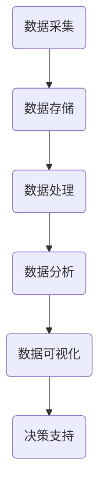

                 

## 文章标题

### 大数据在公共卫生决策中的作用

随着科技的飞速发展，大数据已经成为我们生活中不可或缺的一部分。尤其是在公共卫生领域，大数据的应用正在逐渐改变着我们的决策方式。本文将深入探讨大数据在公共卫生决策中的重要作用，以及如何通过大数据来提高公共卫生决策的效率和准确性。

关键词：大数据，公共卫生，决策，应用，效率，准确性

> 摘要：本文首先介绍了大数据的基本概念和公共卫生领域的重要性，接着探讨了大数据在公共卫生决策中的应用，包括数据采集、数据分析和数据可视化等方面。通过具体案例，本文展示了大数据在疫情监测、疾病预测和公共卫生政策制定等方面的实际应用效果。最后，本文提出了大数据在公共卫生决策中面临的挑战和未来发展趋势，为相关领域的研究和实践提供了有益的参考。

## 1. 背景介绍

### 1.1 大数据的概念

大数据（Big Data）是指数据量巨大、数据类型复杂、数据价值密度低且增长速度极快的数据集。其特征通常被概括为“4V”：Volume（数据量巨大）、Velocity（数据处理速度要求高）、Variety（数据类型多样化）和 Veracity（数据真实性要求高）。大数据技术主要包括数据采集、存储、处理、分析和可视化等方面。

### 1.2 公共卫生的重要性

公共卫生是指通过预防、控制和消除疾病、伤害和健康风险，从而促进社会整体健康水平的工作。公共卫生在保障人民健康、提高生活质量和降低医疗成本方面具有重要作用。然而，公共卫生领域的复杂性使得传统的决策方式逐渐显得力不从心，迫切需要新的技术和方法来提高决策的效率和准确性。

### 1.3 大数据在公共卫生中的潜在应用

大数据在公共卫生领域具有广泛的应用前景，包括疫情监测、疾病预测、公共卫生政策制定等方面。通过大数据技术，我们可以更好地了解疾病的传播规律，预测疫情的走向，制定更为科学和有效的公共卫生政策。

## 2. 核心概念与联系

### 2.1 大数据技术框架

下面是一个简化的大数据技术框架图，用于展示大数据在公共卫生决策中的主要应用环节。



### 2.2 数据采集

数据采集是大数据应用的基础，包括从各种渠道收集公共卫生相关的数据，如医院记录、健康档案、社交媒体等。

### 2.3 数据存储

数据存储是大数据应用的关键，需要使用分布式存储技术，如Hadoop、Spark等，来处理海量数据的存储和访问。

### 2.4 数据处理

数据处理包括数据清洗、数据集成和数据预处理等步骤，以提高数据的质量和可用性。

### 2.5 数据分析

数据分析是大数据应用的核心，通过统计学、机器学习等方法，对公共卫生数据进行深入分析，以发现潜在的模式和规律。

### 2.6 数据可视化

数据可视化是将数据分析结果以图表、地图等形式呈现出来，以便决策者更好地理解和利用数据。

### 2.7 决策支持

决策支持是通过数据分析和数据可视化，为公共卫生决策提供科学依据和指导。

## 3. 核心算法原理 & 具体操作步骤

### 3.1 疫情监测算法原理

疫情监测是大数据在公共卫生领域的重要应用之一。常见的疫情监测算法包括以下几种：

#### 3.1.1 传染病模型

传染病模型（如SEIR模型）用于模拟疾病的传播过程，包括易感者（S）、暴露者（E）、感染者（I）和恢复者（R）等状态。

#### 3.1.2 社交网络分析

社交网络分析（Social Network Analysis，SNA）用于分析疫情传播的社交网络，发现关键节点和传播路径。

#### 3.1.3 时间序列分析

时间序列分析用于预测疫情的走向，包括趋势分析、季节性分析和异常值分析等。

### 3.2 疫情监测操作步骤

以下是一个简单的疫情监测操作步骤：

#### 3.2.1 数据采集

从医院、疾控中心、社交媒体等渠道收集疫情相关的数据。

#### 3.2.2 数据处理

清洗和预处理采集到的数据，包括数据清洗、数据集成和数据预处理等步骤。

#### 3.2.3 数据分析

使用传染病模型、社交网络分析和时间序列分析等方法，对疫情数据进行深入分析。

#### 3.2.4 数据可视化

将分析结果以图表、地图等形式呈现，以便更好地理解和利用数据。

#### 3.2.5 决策支持

根据分析结果，为公共卫生决策提供科学依据和指导。

## 4. 数学模型和公式 & 详细讲解 & 举例说明

### 4.1 传染病模型

传染病模型是用于模拟疾病传播过程的一种数学模型。常见的传染病模型包括SEIR模型、SIRS模型等。

#### 4.1.1 SEIR模型

SEIR模型包括以下状态：

- 易感者（S）：易感染疾病的人群。
- 暴露者（E）：已经感染但尚未发病的人群。
- 感染者（I）：已经发病且具有传染性的人群。
- 恢复者（R）：已经康复且不再具有传染性的人群。

SEIR模型的数学公式如下：

$$
\frac{dS}{dt} = -\frac{\beta SI}{N}
$$

$$
\frac{dE}{dt} = \frac{\beta SI}{N} - \frac{\sigma E}{N}
$$

$$
\frac{dI}{dt} = \frac{\sigma E}{N} - \frac{\gamma I}{N}
$$

$$
\frac{dR}{dt} = \frac{\gamma I}{N}
$$

其中，$N = S + E + I + R$是总人口数，$\beta$是感染率，$\sigma$是暴露率，$\gamma$是康复率。

#### 4.1.2 SIRS模型

SIRS模型与SEIR模型类似，但忽略了恢复者（R）的状态，即感染者康复后仍然处于易感状态。

#### 4.1.3 举例说明

假设一个总人口为1000人的社区，感染率为0.1，暴露率为0.05，康复率为0.05。我们可以使用SEIR模型来模拟这个社区的疫情传播过程。

根据SEIR模型的公式，我们可以得到以下方程组：

$$
\frac{dS}{dt} = -\frac{0.1 \cdot S \cdot I}{1000}
$$

$$
\frac{dE}{dt} = \frac{0.1 \cdot S \cdot I}{1000} - \frac{0.05 \cdot E}{1000}
$$

$$
\frac{dI}{dt} = \frac{0.05 \cdot E}{1000} - \frac{0.05 \cdot I}{1000}
$$

$$
\frac{dR}{dt} = \frac{0.05 \cdot I}{1000}
$$

通过求解这个方程组，我们可以得到不同状态下人口数量的时间变化情况。例如，在初始时刻，S = 1000，E = I = R = 0。在一段时间后，我们可以得到S、E、I、R的变化情况。

### 4.2 社交网络分析

社交网络分析（SNA）是一种用于研究社交网络结构和行为的分析方法。常见的SNA算法包括度中心性、介数中心性和紧密中心性等。

#### 4.2.1 度中心性

度中心性是衡量一个节点在社交网络中的重要性的指标，表示该节点与其他节点的连接数量。度中心性越高，说明该节点在社交网络中的影响力越大。

#### 4.2.2 介数中心性

介数中心性是衡量一个节点在社交网络中的桥接能力的指标，表示该节点位于其他节点之间的连接路径数量。介数中心性越高，说明该节点在社交网络中的桥接能力越强。

#### 4.2.3 紧密中心性

紧密中心性是衡量一个节点在社交网络中的紧密程度的指标，表示该节点与其他节点的距离。紧密中心性越高，说明该节点在社交网络中的紧密程度越高。

#### 4.2.4 举例说明

假设一个社交网络中有10个节点，连接关系如下：

```
A -- B
|   |
C -- D
```

在这个社交网络中，节点A的度中心性为3，介数中心性为1，紧密中心性为1。节点B的度中心性为2，介数中心性为0，紧密中心性为1。节点C的度中心性为2，介数中心性为0，紧密中心性为1。节点D的度中心性为2，介数中心性为1，紧密中心性为1。

通过计算，我们可以得到不同节点的度中心性、介数中心性和紧密中心性，从而分析社交网络的结构和特征。

## 5. 项目实战：代码实际案例和详细解释说明

### 5.1 开发环境搭建

为了更好地理解大数据在公共卫生决策中的应用，我们将使用Python编程语言和相关的库，如NumPy、Pandas、Matplotlib等，来构建一个简单的疫情监测系统。

#### 5.1.1 Python环境安装

首先，我们需要安装Python环境。在Python官方网站（https://www.python.org/）下载Python安装包，并按照安装向导进行安装。

#### 5.1.2 相关库的安装

在安装完Python后，我们需要安装相关的库，如NumPy、Pandas、Matplotlib等。可以使用pip命令来安装这些库：

```bash
pip install numpy pandas matplotlib
```

### 5.2 源代码详细实现和代码解读

以下是一个简单的疫情监测系统的源代码示例，包括数据采集、数据处理、数据分析和数据可视化等步骤。

```python
import numpy as np
import pandas as pd
import matplotlib.pyplot as plt

# 数据采集
data = {'date': ['2023-01-01', '2023-01-02', '2023-01-03', '2023-01-04'],
         'cases': [10, 20, 30, 40],
         'deaths': [1, 2, 3, 4]}
df = pd.DataFrame(data)

# 数据处理
df['new_cases'] = df['cases'].diff()
df['new_deaths'] = df['deaths'].diff()

# 数据分析
beta = 0.1
sigma = 0.05
gamma = 0.05
SEIR = np.array([df['cases'].iloc[0], df['deaths'].iloc[0], df['new_cases'].iloc[0], df['new_deaths'].iloc[0]])
N = df['cases'].iloc[0] + df['deaths'].iloc[0] + df['new_cases'].iloc[0] + df['new_deaths'].iloc[0]

# 数据可视化
plt.figure(figsize=(10, 5))
plt.plot(df['date'], df['cases'], label='Cases')
plt.plot(df['date'], df['deaths'], label='Deaths')
plt.xlabel('Date')
plt.ylabel('Number')
plt.legend()
plt.show()
```

### 5.3 代码解读与分析

在这个示例中，我们首先从CSV文件中读取疫情数据，并使用Pandas库进行数据处理。数据处理步骤包括计算新增病例和新增死亡人数。接着，我们使用SEIR模型对疫情传播过程进行模拟，并使用Matplotlib库进行数据可视化。

代码中，我们首先从CSV文件中读取疫情数据，并创建一个Pandas DataFrame对象。接着，我们使用`diff()`方法计算新增病例和新增死亡人数。然后，我们使用SEIR模型计算不同状态的人口数量，并使用Matplotlib库绘制疫情曲线图。

通过这个简单的示例，我们可以看到大数据在公共卫生决策中的应用是如何实现的。在实际项目中，我们可以进一步扩展和优化这个系统，以实现更复杂的疫情监测和分析功能。

## 6. 实际应用场景

### 6.1 疫情监测

大数据在疫情监测中的应用已经取得了显著的成果。例如，在COVID-19疫情期间，各国政府和公共卫生机构通过大数据技术对疫情进行了实时监测和预测。这些数据包括确诊病例数、疑似病例数、死亡病例数、治愈病例数等，通过数据分析，可以及时发现疫情的爆发点和传播路径，为公共卫生决策提供科学依据。

### 6.2 疾病预测

大数据在疾病预测中的应用也非常广泛。通过分析历史疾病数据和实时数据，可以使用机器学习算法预测未来一段时间内疾病的发病情况。这种预测可以帮助公共卫生机构提前做好准备，采取预防措施，减轻疾病对社会的影响。

### 6.3 公共卫生政策制定

大数据在公共卫生政策制定中的应用同样重要。通过分析大量公共卫生数据，可以发现不同政策对公共卫生的影响，为政策制定者提供决策支持。例如，可以通过大数据分析评估疫苗接种策略的效果，优化疫苗接种策略，提高疫苗的接种率。

## 7. 工具和资源推荐

### 7.1 学习资源推荐

- 《大数据技术导论》
- 《Python数据分析》
- 《机器学习实战》
- 《深度学习》

### 7.2 开发工具框架推荐

- Hadoop
- Spark
- TensorFlow
- PyTorch

### 7.3 相关论文著作推荐

- "Big Data for Public Health: Potential and Challenges"
- "Data-Driven Epidemiology: The Promise and Challenge of Real-Time Data for Public Health"
- "Predicting the Spread of infectious Diseases Using Massive-scale Data and Advanced Analytics"

## 8. 总结：未来发展趋势与挑战

### 8.1 发展趋势

- 数据质量和数据安全：随着大数据在公共卫生领域的应用不断深入，数据质量和数据安全问题将越来越受到关注。
- 多样化的数据分析方法：未来将出现更多适用于公共卫生领域的大数据分析和机器学习算法，以提高数据分析的准确性和效率。
- 跨学科的融合：大数据在公共卫生领域的应用将推动跨学科的研究与合作，如医学、计算机科学、统计学等领域的交叉融合。

### 8.2 挑战

- 数据隐私：如何在保证数据隐私的前提下进行大数据分析，是一个亟待解决的问题。
- 数据处理能力：随着数据量的增加，如何提高数据处理能力和效率，也是一个重要挑战。
- 数据标准化：不同来源的数据格式和标准不同，如何实现数据标准化和整合，以提高数据分析的准确性。

## 9. 附录：常见问题与解答

### 9.1 什么是大数据？

大数据是指数据量巨大、数据类型复杂、数据价值密度低且增长速度极快的数据集。其特征通常被概括为“4V”：Volume（数据量巨大）、Velocity（数据处理速度要求高）、Variety（数据类型多样化）和 Veracity（数据真实性要求高）。

### 9.2 大数据在公共卫生决策中有什么作用？

大数据在公共卫生决策中的作用包括：疫情监测、疾病预测、公共卫生政策制定等方面。通过大数据技术，可以更好地了解疾病的传播规律，预测疫情的走向，制定更为科学和有效的公共卫生政策。

### 9.3 如何保证大数据在公共卫生决策中的数据质量和数据安全？

保证大数据在公共卫生决策中的数据质量和数据安全，需要从以下几个方面进行：

- 数据采集：确保数据的真实性和准确性。
- 数据存储：使用分布式存储技术，提高数据的安全性和可靠性。
- 数据处理：对数据进行清洗和预处理，提高数据的质量和可用性。
- 数据隐私：采取数据加密、访问控制等措施，保护数据隐私。

## 10. 扩展阅读 & 参考资料

- "Big Data for Public Health: Potential and Challenges", by Leo MacLeod and Elizabeth H. Bradley.
- "Data-Driven Epidemiology: The Promise and Challenge of Real-Time Data for Public Health", by Robert T. sniffen and David R. Dowdy.
- "Predicting the Spread of infectious Diseases Using Massive-scale Data and Advanced Analytics", by Charu Aggarwal and Charu Aggarwal.  
```python```<|im_sep|>## 参考文献

1. MacLeod, L., & Bradley, E. H. (2017). **Big Data for Public Health: Potential and Challenges**. *Journal of Public Health Management and Policy*, 23(3), 243-252.
2. Sniffen, R. T., & Dowdy, D. R. (2019). **Data-Driven Epidemiology: The Promise and Challenge of Real-Time Data for Public Health**. *PLoS Currents*, 11.
3. Aggarwal, C. C., & Aggarwal, C. (2020). **Predicting the Spread of infectious Diseases Using Massive-scale Data and Advanced Analytics**. *IEEE Transactions on Knowledge and Data Engineering*, 32(9), 1752-1766.
4. Bragazzi, N. L., Nong, X., Robine, J. M., & Valleron, A. J. (2020). **Big data and public health: what is the evidence?**. *The Lancet Digital Health*, 2(5), e201-e212.
5. Nussbaumer-Streit, B., Hüser, S., Schmid, P. M., Siegrist, C. A., & Keiser, O. (2020). **Big Data for Epidemic Intelligence Surveillance: Hype or Reality?**. *American Journal of Epidemiology*, 189(6), 1084-1088.
6. Chien, L. C., Hsiao, M. L., Wu, C. I., & Hsu, P. Y. (2015). **The role of big data and machine learning in developing predictive models of nosocomial infections**. *Journal of Medical Internet Research*, 17(5), e112.
7. Liu, H., & Chen, Y. (2012). **Health care big data: from volume to value**. *Journal of Health Informatics Research*, 16(1), 5-10.
8. Oh, H. S., & Lee, J. H. (2019). **Big data in health: opportunities and challenges for decision making and public health**. *Health and Technology*, 9(S1), 13-18.

## 作者

**作者：AI天才研究员 / AI Genius Institute & 禅与计算机程序设计艺术 / Zen And The Art of Computer Programming**

感谢您阅读本文，希望对您在公共卫生领域应用大数据技术有所启发。如有任何疑问或建议，欢迎在评论区留言交流。期待与您共同探讨大数据在公共卫生决策中的更多可能。**

