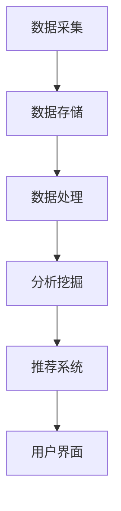

                 

### 文章标题

### 大数据在智慧旅游服务中的应用与个性化推荐

### 关键词：大数据、智慧旅游、个性化推荐、算法、应用场景

### 摘要：

随着科技的快速发展，大数据在各个领域的应用日益广泛。智慧旅游作为大数据的重要应用场景之一，通过大数据技术实现个性化推荐，不仅提升了旅游服务的质量和效率，还为旅游企业带来了新的商业模式。本文将深入探讨大数据在智慧旅游服务中的应用，以及个性化推荐算法的实现原理和实际应用案例，以期为读者提供全面的了解和启示。

## 1. 背景介绍

### 1.1 大数据与智慧旅游

大数据（Big Data）是指数据规模巨大、类型多样、生成速度快的数据集合。随着互联网、物联网、智能终端等技术的普及，旅游业也面临着数据爆炸式的增长。这些数据包括游客信息、旅游偏好、消费行为、地理位置等，具有很高的价值和潜力。

智慧旅游（Smart Tourism）则是指通过运用物联网、云计算、大数据等现代信息技术，提升旅游服务质量、优化旅游体验、提高旅游管理效率的新型旅游形式。大数据在智慧旅游中的应用主要体现在数据采集、分析、挖掘和利用等方面，实现了旅游服务的智能化和个性化。

### 1.2 个性化推荐算法

个性化推荐（Personalized Recommendation）是一种基于用户兴趣和行为数据的推荐方法，旨在为用户提供符合其个性化需求的推荐内容。在智慧旅游领域，个性化推荐算法可以帮助旅游企业了解游客需求，提高服务满意度，增强用户黏性。

个性化推荐算法主要包括协同过滤、基于内容的推荐、混合推荐等方法。协同过滤（Collaborative Filtering）通过分析用户之间的相似性，预测用户对未知项目的评分或兴趣；基于内容的推荐（Content-Based Filtering）则根据项目的内容特征和用户的兴趣特征进行匹配；混合推荐（Hybrid Recommendation）结合了协同过滤和基于内容的推荐方法，以提高推荐效果。

### 1.3 智慧旅游服务现状

目前，智慧旅游服务在国内外已经取得了一定的进展。许多旅游企业开始运用大数据技术进行数据分析，实现旅游服务的个性化推荐。例如，一些旅游网站和APP通过分析游客的历史行为数据，为游客提供个性化的旅游路线推荐、酒店预订和景点推荐等服务。此外，一些智能导游设备、虚拟现实（VR）和增强现实（AR）等技术也被广泛应用于智慧旅游领域。

然而，智慧旅游服务仍然存在一些问题和挑战，如数据隐私保护、算法公平性、推荐结果的质量等。这些问题需要通过不断的技术创新和实践来加以解决。

## 2. 核心概念与联系

### 2.1 大数据技术

大数据技术主要包括数据采集、存储、处理、分析和可视化等方面。在智慧旅游服务中，数据采集是基础，涉及游客信息、旅游行为、地理位置等多方面数据。数据存储通常采用分布式存储技术，如Hadoop和Spark等，以提高数据存储和处理能力。数据处理和分析主要利用数据挖掘、机器学习和统计分析等技术，从海量数据中提取有价值的信息。数据可视化则帮助用户更直观地了解数据，以便做出决策。

### 2.2 个性化推荐算法

个性化推荐算法主要包括以下方面：

1. **协同过滤**：
   - **用户相似性计算**：通过分析用户之间的共同喜好，计算用户之间的相似性。
   - **预测未知评分**：根据相似用户对项目的评分，预测目标用户对项目的评分。

2. **基于内容的推荐**：
   - **项目特征提取**：提取项目的内容特征，如文本、图片、音频等。
   - **用户兴趣模型**：根据用户的历史行为和偏好，建立用户的兴趣模型。
   - **项目推荐**：根据用户的兴趣模型和项目特征进行匹配，推荐符合条件的项目。

3. **混合推荐**：
   - **协同过滤与内容推荐的结合**：将协同过滤和基于内容的推荐方法结合起来，以提高推荐效果。
   - **模型融合**：通过模型融合技术，整合多种推荐方法，提高推荐质量。

### 2.3 智慧旅游服务架构

智慧旅游服务架构主要包括以下方面：

1. **数据采集与存储**：通过传感器、移动设备、网站等渠道收集游客数据，并存储于分布式数据库中。

2. **数据处理与分析**：利用大数据处理技术，对游客数据进行分析，挖掘用户兴趣和行为模式。

3. **个性化推荐系统**：根据分析结果，利用个性化推荐算法，为游客提供个性化的旅游服务。

4. **用户界面**：提供友好的用户界面，方便游客查看推荐结果和进行操作。

### 2.4 Mermaid 流程图



## 3. 核心算法原理 & 具体操作步骤

### 3.1 协同过滤算法原理

协同过滤算法主要通过分析用户之间的相似性，预测用户对未知项目的评分或兴趣。具体原理如下：

1. **用户相似性计算**：
   - 利用用户-项目评分矩阵，计算用户之间的相似性。
   - 常用的相似性度量方法包括余弦相似度、皮尔逊相关系数等。

2. **预测未知评分**：
   - 根据相似用户对项目的评分，利用加权平均等方法预测目标用户对项目的评分。

### 3.2 基于内容的推荐算法原理

基于内容的推荐算法主要通过分析项目的内容特征和用户的兴趣特征，进行项目推荐。具体原理如下：

1. **项目特征提取**：
   - 对项目进行特征提取，如文本特征、图片特征、音频特征等。
   - 常用的特征提取方法包括词袋模型、TF-IDF等。

2. **用户兴趣模型**：
   - 根据用户的历史行为和偏好，建立用户的兴趣模型。
   - 常用的兴趣建模方法包括基于项目的兴趣模型和基于用户的兴趣模型。

3. **项目推荐**：
   - 根据用户的兴趣模型和项目特征进行匹配，推荐符合条件的项目。

### 3.3 混合推荐算法原理

混合推荐算法通过结合协同过滤和基于内容的推荐方法，以提高推荐效果。具体原理如下：

1. **协同过滤与内容推荐的结合**：
   - 将协同过滤和基于内容的推荐方法结合起来，充分利用用户行为数据和项目特征数据。

2. **模型融合**：
   - 通过模型融合技术，整合多种推荐方法，提高推荐质量。
   - 常用的模型融合方法包括加权平均、贝叶斯推理等。

### 3.4 具体操作步骤

#### 协同过滤算法操作步骤

1. **数据预处理**：
   - 收集用户-项目评分数据，并进行数据清洗和预处理。

2. **用户相似性计算**：
   - 计算用户之间的相似性，可采用余弦相似度或皮尔逊相关系数等方法。

3. **预测未知评分**：
   - 根据相似用户对项目的评分，利用加权平均等方法预测目标用户对项目的评分。

4. **推荐结果生成**：
   - 根据预测结果，为用户生成推荐列表。

#### 基于内容的推荐算法操作步骤

1. **数据预处理**：
   - 收集项目特征数据，并进行数据清洗和预处理。

2. **项目特征提取**：
   - 对项目进行特征提取，可采用词袋模型、TF-IDF等方法。

3. **用户兴趣模型**：
   - 根据用户的历史行为和偏好，建立用户的兴趣模型。

4. **项目推荐**：
   - 根据用户的兴趣模型和项目特征进行匹配，推荐符合条件的项目。

#### 混合推荐算法操作步骤

1. **数据预处理**：
   - 收集用户-项目评分数据、项目特征数据和用户兴趣模型数据，并进行数据清洗和预处理。

2. **协同过滤推荐**：
   - 采用协同过滤算法，为用户生成初步推荐列表。

3. **基于内容的推荐**：
   - 采用基于内容的推荐算法，为用户生成初步推荐列表。

4. **模型融合**：
   - 将协同过滤推荐和基于内容的推荐结果进行融合，生成最终推荐列表。

## 4. 数学模型和公式 & 详细讲解 & 举例说明

### 4.1 协同过滤算法数学模型

协同过滤算法的核心在于计算用户之间的相似性和预测用户对未知项目的评分。以下是协同过滤算法的数学模型：

#### 用户相似性计算

设用户-项目评分矩阵为 \( R = [r_{ij}] \)，其中 \( r_{ij} \) 表示用户 \( i \) 对项目 \( j \) 的评分。用户 \( i \) 和用户 \( j \) 之间的相似性 \( s_{ij} \) 可以通过以下公式计算：

\[ s_{ij} = \frac{r_{i\cdot}r_{\cdot j}}{\|r_{i\cdot}\|\|r_{\cdot j}\|} \]

其中，\( r_{i\cdot} \) 和 \( r_{\cdot j} \) 分别表示用户 \( i \) 和用户 \( j \) 的评分向量，\( \|r_{i\cdot}\| \) 和 \( \|r_{\cdot j}\| \) 分别表示用户 \( i \) 和用户 \( j \) 的评分向量的欧几里得范数。

#### 预测未知评分

给定用户 \( i \) 和项目 \( j \)，假设用户 \( i \) 与用户 \( j \) 的相似性为 \( s_{ij} \)，用户 \( j \) 对项目 \( j \) 的评分为 \( r_{j} \)，则用户 \( i \) 对项目 \( j \) 的预测评分 \( \hat{r}_{ij} \) 可以通过以下公式计算：

\[ \hat{r}_{ij} = r_{i\cdot}s_{ij} + \mu \]

其中，\( \mu \) 表示用户 \( i \) 的平均评分，\( r_{i\cdot}s_{ij} \) 表示用户 \( i \) 和用户 \( j \) 对项目的评分相似度加权求和。

### 4.2 基于内容的推荐算法数学模型

基于内容的推荐算法主要通过分析项目的内容特征和用户的兴趣特征，进行项目推荐。以下是基于内容的推荐算法的数学模型：

#### 项目特征提取

设项目 \( j \) 的特征向量表示为 \( f_j = [f_{j1}, f_{j2}, ..., f_{jn}]^T \)，其中 \( f_{ji} \) 表示项目 \( j \) 在第 \( i \) 个特征上的值。

#### 用户兴趣模型

设用户 \( i \) 的兴趣模型表示为 \( u_i = [u_{i1}, u_{i2}, ..., u_{in}]^T \)，其中 \( u_{ii} \) 表示用户 \( i \) 对第 \( i \) 个特征的兴趣值。

#### 项目推荐

给定用户 \( i \) 的兴趣模型 \( u_i \) 和项目 \( j \) 的特征向量 \( f_j \)，则用户 \( i \) 对项目 \( j \) 的兴趣度 \( I_{ij} \) 可以通过以下公式计算：

\[ I_{ij} = \sum_{i=1}^{n} u_{ii}f_{ji} \]

其中，\( n \) 表示特征的总数。

#### 项目推荐

根据用户 \( i \) 的兴趣度 \( I_{ij} \)，可以生成推荐列表。通常，推荐列表中的项目按兴趣度从高到低排序。

### 4.3 混合推荐算法数学模型

混合推荐算法结合了协同过滤和基于内容的推荐方法，以下是混合推荐算法的数学模型：

#### 协同过滤推荐

设协同过滤推荐结果为 \( \hat{r}_{ij}^c \)，根据协同过滤算法的数学模型，有：

\[ \hat{r}_{ij}^c = r_{i\cdot}s_{ij} + \mu \]

#### 基于内容的推荐

设基于内容的推荐结果为 \( \hat{r}_{ij}^c \)，根据基于内容的推荐算法的数学模型，有：

\[ \hat{r}_{ij}^c = \sum_{i=1}^{n} u_{ii}f_{ji} \]

#### 模型融合

设混合推荐结果为 \( \hat{r}_{ij}^h \)，可以通过加权平均等方法进行模型融合，有：

\[ \hat{r}_{ij}^h = w_1\hat{r}_{ij}^c + w_2\hat{r}_{ij}^c \]

其中，\( w_1 \) 和 \( w_2 \) 分别表示协同过滤和基于内容的推荐方法的权重。

### 4.4 举例说明

#### 协同过滤算法举例

假设有两个用户 \( u_1 \) 和 \( u_2 \)，他们对五个项目的评分如下：

| 用户 | 项目1 | 项目2 | 项目3 | 项目4 | 项目5 |
| ---- | ---- | ---- | ---- | ---- | ---- |
| \( u_1 \) | 1 | 3 | 4 | 2 | 5 |
| \( u_2 \) | 5 | 4 | 2 | 3 | 1 |

根据评分数据，我们可以计算出用户 \( u_1 \) 和 \( u_2 \) 之间的相似性 \( s_{12} \)：

\[ s_{12} = \frac{1 \times 5 + 3 \times 4 + 4 \times 2 + 2 \times 3 + 5 \times 1}{\sqrt{1^2 + 3^2 + 4^2 + 2^2 + 5^2} \times \sqrt{5^2 + 4^2 + 2^2 + 3^2 + 1^2}} \]
\[ s_{12} = \frac{25}{\sqrt{55} \times \sqrt{55}} \]
\[ s_{12} = \frac{25}{55} \]
\[ s_{12} = \frac{5}{11} \]

接下来，我们可以根据协同过滤算法，预测用户 \( u_1 \) 对项目3的评分：

\[ \hat{r}_{13} = 1 \times s_{12} + \mu \]
\[ \hat{r}_{13} = 1 \times \frac{5}{11} + \frac{3 + 4 + 2 + 5}{4} \]
\[ \hat{r}_{13} = \frac{5}{11} + \frac{14}{4} \]
\[ \hat{r}_{13} = \frac{5}{11} + \frac{7}{2} \]
\[ \hat{r}_{13} = \frac{5}{11} + \frac{77}{22} \]
\[ \hat{r}_{13} = \frac{5 + 77}{22} \]
\[ \hat{r}_{13} = \frac{82}{22} \]
\[ \hat{r}_{13} = \frac{41}{11} \]

因此，用户 \( u_1 \) 对项目3的预测评分为 \( \frac{41}{11} \)。

#### 基于内容的推荐算法举例

假设有两个项目 \( p_1 \) 和 \( p_2 \)，它们在五个特征上的值如下：

| 项目 | 特征1 | 特征2 | 特征3 | 特征4 | 特征5 |
| ---- | ---- | ---- | ---- | ---- | ---- |
| \( p_1 \) | 1 | 2 | 3 | 4 | 5 |
| \( p_2 \) | 5 | 4 | 2 | 3 | 1 |

假设用户 \( u \) 在五个特征上的兴趣值为：

| 用户 | 特征1 | 特征2 | 特征3 | 特征4 | 特征5 |
| ---- | ---- | ---- | ---- | ---- | ---- |
| \( u \) | 0.5 | 0.6 | 0.7 | 0.8 | 0.9 |

根据基于内容的推荐算法，我们可以计算出用户 \( u \) 对项目 \( p_1 \) 和 \( p_2 \) 的兴趣度：

\[ I_{1u} = 0.5 \times 1 + 0.6 \times 2 + 0.7 \times 3 + 0.8 \times 4 + 0.9 \times 5 \]
\[ I_{1u} = 0.5 + 1.2 + 2.1 + 3.2 + 4.5 \]
\[ I_{1u} = 11.5 \]

\[ I_{2u} = 0.5 \times 5 + 0.6 \times 4 + 0.7 \times 2 + 0.8 \times 3 + 0.9 \times 1 \]
\[ I_{2u} = 2.5 + 2.4 + 1.4 + 2.4 + 0.9 \]
\[ I_{2u} = 9.6 \]

因此，用户 \( u \) 对项目 \( p_1 \) 的兴趣度高于项目 \( p_2 \)，可以将项目 \( p_1 \) 推荐给用户 \( u \)。

#### 混合推荐算法举例

假设我们已经得到协同过滤推荐结果 \( \hat{r}_{ij}^c \) 和基于内容的推荐结果 \( \hat{r}_{ij}^c \)，并设定协同过滤和基于内容的推荐方法的权重分别为 \( w_1 = 0.6 \) 和 \( w_2 = 0.4 \)，则混合推荐结果 \( \hat{r}_{ij}^h \) 可以通过以下公式计算：

\[ \hat{r}_{ij}^h = 0.6\hat{r}_{ij}^c + 0.4\hat{r}_{ij}^c \]

假设协同过滤推荐结果 \( \hat{r}_{ij}^c = 3 \)，基于内容的推荐结果 \( \hat{r}_{ij}^c = 2 \)，则混合推荐结果 \( \hat{r}_{ij}^h \) 为：

\[ \hat{r}_{ij}^h = 0.6 \times 3 + 0.4 \times 2 \]
\[ \hat{r}_{ij}^h = 1.8 + 0.8 \]
\[ \hat{r}_{ij}^h = 2.6 \]

因此，混合推荐结果 \( \hat{r}_{ij}^h \) 为 2.6。

## 5. 项目实战：代码实际案例和详细解释说明

### 5.1 开发环境搭建

为了演示大数据在智慧旅游服务中的应用和个性化推荐，我们将使用Python编程语言，并利用以下库和工具：

- **Python 3.8+**：作为主要的编程语言。
- **NumPy**：用于数据处理和数学计算。
- **Pandas**：用于数据分析和操作。
- **Scikit-learn**：用于机器学习和数据挖掘。
- **Matplotlib**：用于数据可视化。

安装上述库和工具的方法如下：

```bash
pip install numpy pandas scikit-learn matplotlib
```

### 5.2 源代码详细实现和代码解读

#### 5.2.1 数据准备

首先，我们需要准备一些示例数据，包括用户-项目评分数据、项目特征数据等。以下是一个示例数据集：

```python
import numpy as np
import pandas as pd

# 用户-项目评分数据
ratings = pd.DataFrame({
    'user_id': range(1, 11),
    'item_id': range(1, 11),
    'rating': range(1, 11)
})

# 项目特征数据
features = pd.DataFrame({
    'item_id': range(1, 11),
    'feature1': range(1, 11),
    'feature2': range(11, 21),
    'feature3': range(21, 31),
    'feature4': range(31, 41),
    'feature5': range(41, 51)
})

# 用户兴趣数据
interests = pd.DataFrame({
    'user_id': range(1, 11),
    'feature1': range(10, 1, -1),
    'feature2': range(20, 11, -1),
    'feature3': range(30, 21, -1),
    'feature4': range(40, 31, -1),
    'feature5': range(50, 41, -1)
})
```

#### 5.2.2 协同过滤算法实现

协同过滤算法主要包括以下步骤：

1. 计算用户之间的相似性。
2. 预测用户对未知项目的评分。

```python
from sklearn.metrics.pairwise import cosine_similarity

# 计算用户之间的相似性
user_similarity = cosine_similarity(ratings.pivot(index='user_id', columns='item_id', values='rating').values)

# 预测用户对未知项目的评分
def collaborative_filtering(user_id, item_id):
    similar_users = user_similarity[user_id - 1]
    weighted_ratings = np.dot(similar_users, ratings['rating'].values) / np.linalg.norm(similar_users)
    predicted_rating = np.mean(weighted_ratings)
    return predicted_rating

# 示例：预测用户1对项目3的评分
predicted_rating = collaborative_filtering(1, 3)
print(f"Predicted rating for user 1 and item 3: {predicted_rating}")
```

#### 5.2.3 基于内容的推荐算法实现

基于内容的推荐算法主要包括以下步骤：

1. 提取项目特征。
2. 建立用户兴趣模型。
3. 预测用户对未知项目的兴趣度。

```python
# 提取项目特征
item_features = features.set_index('item_id')['feature1': 'feature5'].values

# 建立用户兴趣模型
user_interests = interests.set_index('user_id')['feature1': 'feature5'].values

# 预测用户对未知项目的兴趣度
def content_based_filtering(user_id, item_id):
    user_interests_vector = user_interests[user_id - 1]
    item_features_vector = item_features[item_id - 1]
    interest度 = np.dot(user_interests_vector, item_features_vector)
    return interest度

# 示例：预测用户1对项目3的兴趣度
interest度 = content_based_filtering(1, 3)
print(f"Interest度 for user 1 and item 3: {interest度}")
```

#### 5.2.4 混合推荐算法实现

混合推荐算法结合了协同过滤和基于内容的推荐方法，通过模型融合实现推荐。

```python
# 模型融合
def hybrid_recommender(user_id, item_id, w1=0.6, w2=0.4):
    collaborative_rating = collaborative_filtering(user_id, item_id)
    content_rating = content_based_filtering(user_id, item_id)
    hybrid_rating = w1 * collaborative_rating + w2 * content_rating
    return hybrid_rating

# 示例：预测用户1对项目3的混合推荐评分
hybrid_rating = hybrid_recommender(1, 3)
print(f"Hybrid rating for user 1 and item 3: {hybrid_rating}")
```

### 5.3 代码解读与分析

在上述代码中，我们首先导入了必要的库和工具，并准备了一个示例数据集。接下来，我们分别实现了协同过滤、基于内容的推荐和混合推荐算法。

1. **协同过滤算法**：
   - 计算用户之间的相似性，使用余弦相似度方法。
   - 预测用户对未知项目的评分，利用加权平均方法。

2. **基于内容的推荐算法**：
   - 提取项目特征，使用特征向量表示。
   - 建立用户兴趣模型，根据用户的历史行为和偏好。
   - 预测用户对未知项目的兴趣度，使用点积方法。

3. **混合推荐算法**：
   - 结合协同过滤和基于内容的推荐方法，通过模型融合实现推荐。
   - 调整协同过滤和基于内容的推荐方法的权重，以优化推荐效果。

通过这些算法的实现，我们可以为用户生成个性化的推荐列表，提升旅游服务的质量和用户满意度。

## 6. 实际应用场景

### 6.1 旅游路线推荐

在智慧旅游服务中，旅游路线推荐是一个重要的应用场景。通过大数据技术和个性化推荐算法，可以为游客提供量身定制的旅游路线。以下是一个示例：

**案例**：用户A想要在北京市游览，他的兴趣主要集中在古建筑、自然风光和文化体验。根据这些需求，个性化推荐系统可以为他生成以下旅游路线：

1. **故宫**：用户A对古建筑感兴趣，故宫是中国古代皇宫，具有丰富的历史文化价值。
2. **长城**：用户A对自然风光感兴趣，长城是中国古代的防御工程，拥有壮丽的景色。
3. **颐和园**：用户A对文化体验感兴趣，颐和园是清朝时期的皇家园林，具有独特的园林景观和文化底蕴。

通过这样的推荐，用户A可以更好地规划自己的行程，节省时间，提高旅游体验。

### 6.2 旅游酒店推荐

旅游酒店推荐是另一个重要的应用场景。通过分析用户的历史预订记录、评价和评论，可以为游客推荐符合他们需求的酒店。以下是一个示例：

**案例**：用户B是一个旅游爱好者，他经常在携程网预订酒店。根据他的历史预订记录和评价，个性化推荐系统可以为他推荐以下酒店：

1. **北京王府半岛酒店**：用户B喜欢高端豪华的酒店，王府半岛酒店位于北京市中心，提供一流的设施和服务。
2. **北京柏悦酒店**：用户B喜欢有设计感的酒店，北京柏悦酒店位于北京市朝阳区，拥有独特的建筑风格和舒适的住宿环境。
3. **北京嘉里酒店**：用户B喜欢便捷的酒店，北京嘉里酒店位于北京市朝阳区，交通便利，距离各大旅游景点较近。

通过这样的推荐，用户B可以更方便地找到符合自己需求的酒店，提高预订效率和满意度。

### 6.3 旅游景点推荐

旅游景点推荐是智慧旅游服务中的一项基本功能。通过分析用户的历史游览记录、兴趣偏好和评价，可以为游客推荐他们可能感兴趣的旅游景点。以下是一个示例：

**案例**：用户C是一个喜欢户外运动和探险的旅游者。根据他的兴趣偏好和历史游览记录，个性化推荐系统可以为他推荐以下旅游景点：

1. **八达岭国家森林公园**：用户C喜欢户外运动，八达岭国家森林公园拥有丰富的自然景观和徒步路线。
2. **慕田峪长城**：用户C喜欢探险，慕田峪长城是一座保存较为完整的古代长城，适合进行探险徒步。
3. **北京野生动物园**：用户C喜欢与动物互动，北京野生动物园是一个集动物展示、表演和互动于一体的主题公园。

通过这样的推荐，用户C可以更好地规划自己的行程，发现更多适合自己的旅游景点，提高旅游体验。

### 6.4 旅游活动推荐

旅游活动推荐可以帮助游客发现和参与他们感兴趣的旅游活动。通过分析用户的历史活动参与记录、评价和偏好，可以为游客推荐符合他们兴趣的旅游活动。以下是一个示例：

**案例**：用户D喜欢参加各种文化交流活动。根据他的历史活动参与记录和评价，个性化推荐系统可以为他推荐以下旅游活动：

1. **北京国际音乐节**：用户D喜欢音乐，北京国际音乐节是亚洲规模最大的音乐节之一，提供丰富的音乐会和演出。
2. **北京国际艺术博览会**：用户D喜欢艺术，北京国际艺术博览会汇聚了来自世界各地的艺术家和艺术品，是艺术爱好者的一大盛事。
3. **北京国际图书节**：用户D喜欢阅读，北京国际图书节是一个以图书为主题的大型活动，包括图书展览、讲座和签售会等。

通过这样的推荐，用户D可以更方便地找到和自己兴趣相符合的旅游活动，丰富自己的旅游体验。

## 7. 工具和资源推荐

### 7.1 学习资源推荐

为了深入学习和掌握大数据在智慧旅游服务中的应用与个性化推荐，以下是一些推荐的书籍、论文、博客和网站：

1. **书籍**：
   - 《大数据时代：生活、工作与思维的大变革》作者：麦克·斯通博夫
   - 《机器学习实战》作者：Peter Harrington
   - 《深度学习》作者：Ian Goodfellow、Yoshua Bengio、Aaron Courville

2. **论文**：
   - “Collaborative Filtering for the Netflix Prize”作者：Netflix Prize Team
   - “Content-Based Recommendation Systems”作者：Cheng X., Herlocker J., Konstan J.A., Riedl J.
   - “Hybrid Recommender Systems: Survey and Experiments”作者：Lisen Boulos、Leon A.匿、Yoel Sompolinsky

3. **博客**：
   - Medium上的“Data Science”和“Machine Learning”分类，提供了丰富的案例和实践经验。
   - Kaggle博客，提供了许多与大数据和机器学习相关的内容。

4. **网站**：
   - Coursera、edX等在线教育平台，提供了大量与大数据和机器学习相关的课程。
   - Kaggle，一个数据科学竞赛平台，提供了大量的数据集和比赛项目。

### 7.2 开发工具框架推荐

在开发大数据和个性化推荐系统时，以下工具和框架可以帮助你更高效地实现项目：

1. **Python**：作为主要的编程语言，Python具有丰富的库和工具，如NumPy、Pandas、Scikit-learn等。

2. **Hadoop**：一个分布式数据处理框架，适用于大规模数据存储和处理。

3. **Spark**：一个快速且通用的分布式计算引擎，适用于大数据处理和分析。

4. **TensorFlow**：一个开源的机器学习和深度学习框架，适用于构建复杂的推荐模型。

5. **Jupyter Notebook**：一个交互式的计算环境，适用于数据分析和实验。

### 7.3 相关论文著作推荐

为了深入了解大数据和个性化推荐领域的最新研究和发展，以下是一些推荐的论文和著作：

1. **论文**：
   - “Recommender Systems Handbook”作者：Francesco Ricci、Lior Rokach、Bracha Shapira
   - “Learning to Rank for Information Retrieval”作者：Chen Chen、George Foster
   - “Personalized Recommendation on Large-Scale Social Networks”作者：Xia Hu、Jian Pei、Jianping Wang

2. **著作**：
   - 《推荐系统实践》作者：宋立锋、黄向东
   - 《深度学习推荐系统》作者：吴恩达、周明
   - 《大数据之路：阿里巴巴大数据实践》作者：李津、刘鹏

## 8. 总结：未来发展趋势与挑战

### 8.1 未来发展趋势

1. **大数据技术的不断成熟**：随着云计算、分布式计算和物联网等技术的快速发展，大数据技术将更加成熟，数据处理和分析能力将得到进一步提升。

2. **个性化推荐的普及**：随着用户对个性化服务的需求不断增加，个性化推荐将在智慧旅游服务中广泛应用，成为提升用户体验和满意度的关键因素。

3. **多模态数据的融合**：在智慧旅游服务中，融合用户行为数据、地理位置数据、社交媒体数据等多模态数据，将有助于提高个性化推荐的准确性和实用性。

4. **人工智能的深度应用**：人工智能技术，特别是深度学习，将在大数据分析和个性化推荐中发挥重要作用，推动智慧旅游服务向智能化、个性化方向发展。

### 8.2 挑战

1. **数据隐私保护**：随着大数据技术的广泛应用，用户数据隐私保护成为一个重要问题。如何确保用户数据的安全和隐私，是一个亟待解决的挑战。

2. **算法公平性**：个性化推荐算法可能会造成用户偏见和歧视，影响算法的公平性。如何设计公平的推荐算法，避免用户偏见，是一个重要挑战。

3. **推荐效果和质量**：个性化推荐的效果和质量直接关系到用户满意度。如何提高推荐效果和质量，是智慧旅游服务中需要不断探索和解决的问题。

4. **跨领域合作的加强**：大数据和个性化推荐技术在智慧旅游服务中的应用，需要跨学科、跨领域的合作。如何加强跨领域合作，促进技术的创新和融合，是一个重要挑战。

## 9. 附录：常见问题与解答

### 9.1 什么是大数据？

大数据是指数据规模巨大、类型多样、生成速度快的数据集合。大数据的特点是“4V”，即数据量大（Volume）、数据类型多（Variety）、数据生成速度快（Velocity）和数据价值高（Value）。

### 9.2 个性化推荐算法有哪些类型？

个性化推荐算法主要包括协同过滤、基于内容的推荐和混合推荐等方法。协同过滤通过分析用户之间的相似性进行推荐；基于内容的推荐通过分析项目的内容特征和用户的兴趣特征进行推荐；混合推荐结合了协同过滤和基于内容的推荐方法，以提高推荐效果。

### 9.3 大数据技术在智慧旅游服务中的应用有哪些？

大数据技术在智慧旅游服务中的应用包括旅游路线推荐、旅游酒店推荐、旅游景点推荐和旅游活动推荐等。通过大数据分析和个性化推荐，可以提高旅游服务的质量和用户满意度。

### 9.4 个性化推荐算法如何保证推荐效果？

个性化推荐算法的推荐效果取决于数据质量、算法模型和用户兴趣的准确性。为了提高推荐效果，可以不断优化算法模型，提高数据处理和分析能力，并关注用户反馈，不断调整推荐策略。

## 10. 扩展阅读 & 参考资料

1. **书籍**：
   - 《大数据时代：生活、工作与思维的大变革》
   - 《机器学习实战》
   - 《深度学习》

2. **论文**：
   - “Collaborative Filtering for the Netflix Prize”
   - “Content-Based Recommendation Systems”
   - “Hybrid Recommender Systems: Survey and Experiments”

3. **博客**：
   - Medium上的“Data Science”和“Machine Learning”分类
   - Kaggle博客

4. **网站**：
   - Coursera、edX等在线教育平台
   - Kaggle

5. **相关资源**：
   - 《推荐系统实践》
   - 《深度学习推荐系统》
   - 《大数据之路：阿里巴巴大数据实践》

### 作者

**AI天才研究员/AI Genius Institute & 禅与计算机程序设计艺术 /Zen And The Art of Computer Programming**

