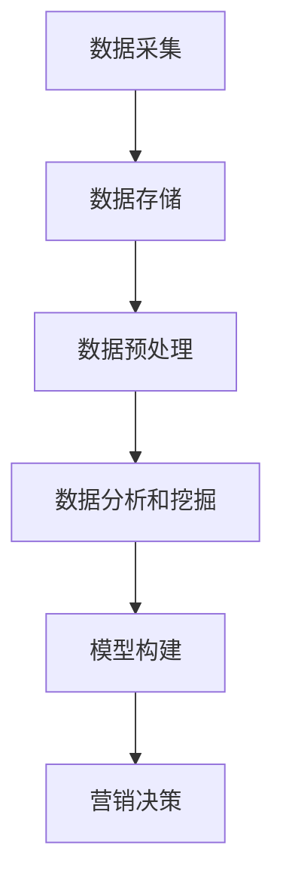

                 

### 背景介绍

#### 精准营销的定义与重要性

精准营销是一种以数据为导向的营销策略，旨在通过深入分析消费者行为和需求，实现个性化的广告投放和营销活动。这一策略的核心在于将潜在客户与特定产品或服务精准匹配，从而最大化营销效果并提升客户满意度。

在当今竞争激烈的市场环境中，精准营销的重要性日益凸显。随着互联网和大数据技术的发展，企业拥有了前所未有的数据资源，可以通过分析海量用户数据，深入了解消费者的喜好、行为和需求。这种深入的分析不仅帮助企业更好地定位目标客户，还能优化营销策略，提高营销效率。

精准营销对企业的意义不言而喻。首先，它能够显著提高营销ROI（投资回报率），使企业在有限的预算下实现更高的销售额和利润。其次，通过个性化的营销活动，企业能够增强客户黏性和忠诚度，提升品牌形象。最后，精准营销有助于企业发现新的市场机会，开拓新的业务领域。

#### 大数据的崛起与营销策略的变革

大数据技术的迅猛发展，为精准营销提供了强有力的支持。大数据不仅包含了传统关系数据库中的结构化数据，还涵盖了来自社交媒体、搜索引擎、物联网设备等来源的海量非结构化数据。这些数据通过大数据技术进行处理和分析，可以揭示出消费者行为和需求的深层规律。

大数据技术在营销领域的应用主要体现在以下几个方面：

1. **客户细分**：通过对大数据的分析，企业可以更准确地识别不同客户群体的特征和需求，实现精细化的市场细分。
2. **个性化推荐**：基于消费者的历史行为和偏好，大数据技术可以提供个性化的产品推荐和营销活动，提高用户满意度和转化率。
3. **营销自动化**：大数据和人工智能技术相结合，可以实现营销自动化，提高营销效率和效果。
4. **市场预测**：通过对大数据的分析，企业可以预测市场趋势和消费者行为，提前布局市场策略。

#### 营销策略制定中的挑战与大数据的应对策略

尽管大数据为营销策略的制定提供了丰富的信息和工具，但在实际操作中仍然面临着诸多挑战。首先，数据质量是精准营销的基础。如果数据不准确、不完整，那么分析结果也将大打折扣。其次，数据隐私和安全问题也是企业面临的重要挑战。随着数据隐私法规的日益严格，企业需要在利用大数据的同时，保护消费者的隐私权益。

针对这些挑战，大数据技术提供了有效的应对策略：

1. **数据清洗**：通过对原始数据进行清洗、去重、修复等操作，提高数据质量，确保分析结果的准确性。
2. **数据加密与安全**：采用数据加密技术，确保数据在传输和存储过程中的安全性，遵守相关数据隐私法规。
3. **数据治理**：建立完善的数据治理体系，规范数据收集、存储、处理和使用的流程，确保数据的一致性和可用性。

总之，大数据技术在精准营销策略制定中发挥着不可或缺的作用。通过深入分析和利用大数据，企业不仅可以制定更有效的营销策略，还可以在激烈的市场竞争中脱颖而出。在接下来的章节中，我们将详细探讨大数据在精准营销策略制定中的具体应用和操作步骤。### 核心概念与联系

#### 大数据与精准营销的关系

要理解大数据在精准营销策略中的作用，我们首先需要明确大数据与精准营销之间的内在联系。精准营销依赖于对大量用户数据的收集和分析，而大数据正是这一过程的驱动力。具体来说，大数据在精准营销中的核心作用体现在以下几个方面：

1. **数据收集**：大数据技术使得企业可以收集到海量的用户数据，包括行为数据、交易数据、社交媒体数据等。这些数据为精准营销提供了丰富的信息来源。
2. **数据分析**：通过对这些海量数据进行深入分析，企业可以挖掘出用户行为和需求的规律，为营销策略提供数据支持。
3. **个性化推荐**：基于大数据分析结果，企业可以为不同用户群体提供个性化的产品推荐和营销活动，提高用户满意度和转化率。
4. **营销自动化**：大数据技术可以帮助企业实现营销自动化，通过算法和模型优化营销流程，提高营销效率。

#### 大数据技术的核心概念

为了更好地理解大数据在精准营销中的应用，我们需要了解一些核心的大数据技术概念。以下是一些关键的概念和其简要解释：

1. **数据挖掘**：数据挖掘是一种从大量数据中提取有价值信息的技术，旨在发现数据中的模式和关联性。在精准营销中，数据挖掘可以用于分析用户行为、预测市场趋势等。
2. **机器学习**：机器学习是一种通过数据训练模型，从而实现预测和分类的技术。在精准营销中，机器学习算法可以帮助企业实现个性化推荐、客户细分等。
3. **数据存储**：大数据技术需要高效的数据存储方案，以应对海量数据的存储需求。常见的存储技术包括分布式存储系统和云存储。
4. **数据处理**：数据处理是大数据技术的核心环节，包括数据清洗、去重、转换等。高效的数据处理技术能够提高数据分析的效率和准确性。
5. **云计算**：云计算提供了强大的计算能力和存储资源，使得大数据处理和分析变得更加便捷和高效。在精准营销中，云计算技术可以帮助企业快速处理海量数据，并提供弹性的计算资源。

#### 营销策略制定中的大数据架构

在营销策略的制定过程中，大数据技术的应用需要一个完整的架构来支持。以下是一个典型的大数据架构，描述了大数据在精准营销中的具体应用流程：

1. **数据采集**：通过各种渠道收集用户数据，包括网站点击流、社交媒体行为、交易记录等。
2. **数据存储**：将收集到的数据存储到分布式数据库或云存储系统中，确保数据的安全和可用性。
3. **数据预处理**：对原始数据进行清洗、去重、转换等预处理操作，提高数据质量。
4. **数据分析和挖掘**：利用数据挖掘和机器学习技术对预处理后的数据进行分析，提取有价值的信息和模式。
5. **模型构建**：基于分析结果，构建预测和分类模型，用于指导营销策略的制定和执行。
6. **营销决策**：利用模型预测结果和数据分析结果，制定个性化的营销策略，并在实际营销活动中进行优化。

#### Mermaid 流程图

为了更直观地展示大数据在精准营销策略制定中的应用流程，我们使用Mermaid语言绘制了一个简化的流程图。请注意，在Mermaid流程节点中，请不要使用括号、逗号等特殊字符。



在这个流程图中，A代表数据采集，B代表数据存储，C代表数据预处理，D代表数据分析和挖掘，E代表模型构建，F代表营销决策。每个步骤都是精准营销策略制定中不可或缺的一环，通过这一流程，企业可以充分利用大数据资源，制定出更加有效的营销策略。

通过上述核心概念与联系的分析，我们可以看到大数据在精准营销策略制定中的重要作用。在接下来的章节中，我们将进一步探讨大数据技术在实际操作中的应用步骤和具体实现方法。### 核心算法原理 & 具体操作步骤

#### 数据收集与预处理

精准营销策略的制定离不开数据的收集与预处理。数据收集是大数据应用的第一步，也是至关重要的一步。在这一阶段，企业需要通过各种渠道收集用户数据，包括网站点击流、社交媒体行为、交易记录等。以下是一些常用的数据收集方法：

1. **日志文件**：企业可以通过服务器日志文件收集用户在网站上的行为数据，如页面访问次数、停留时间、跳出率等。
2. **API接口**：通过API接口，企业可以从第三方数据源获取用户数据，如社交媒体平台、电商平台等。
3. **问卷调查**：通过在线或离线问卷调查，企业可以直接获取用户偏好、需求和行为数据。
4. **物联网设备**：通过物联网设备收集用户日常生活中的行为数据，如智能家居设备、可穿戴设备等。

在数据收集后，企业需要对数据进行预处理，以提高数据质量。预处理步骤包括数据清洗、去重、转换等。以下是一个简化的数据预处理流程：

1. **数据清洗**：去除重复数据、缺失数据、异常数据，确保数据的一致性和完整性。
2. **数据去重**：通过哈希算法等手段，去除重复数据，减少数据冗余。
3. **数据转换**：将不同格式的数据转换为统一格式，如将CSV文件转换为JSON格式。
4. **数据归一化**：将不同尺度的数据进行归一化处理，使数据在同一个尺度上进行分析。

#### 客户细分算法

客户细分是精准营销的重要步骤，通过将客户分为不同的群体，企业可以针对每个群体制定个性化的营销策略。以下是一些常用的客户细分算法：

1. **K-均值聚类算法**：K-均值聚类是一种无监督学习算法，通过迭代计算，将数据分为K个簇，每个簇代表一个客户群体。具体步骤如下：

   - 初始化K个簇的中心点。
   - 计算每个数据点到簇中心点的距离，将数据点分配到最近的簇。
   - 重新计算每个簇的中心点。
   - 重复步骤2和步骤3，直到簇中心点的变化小于某个阈值。

2. **层次聚类算法**：层次聚类是一种有监督或无监督的聚类方法，通过逐步合并或分裂聚类结果，形成层次结构。具体步骤如下：

   - 将每个数据点视为一个初始簇。
   - 计算相邻簇之间的距离，合并距离最近的两个簇。
   - 重新计算合并后的簇的中心点。
   - 重复步骤2和步骤3，直到达到预设的簇数或满足其他终止条件。

3. **决策树算法**：决策树是一种有监督学习算法，通过构建树状模型，对数据进行分类。具体步骤如下：

   - 选择一个最优特征作为根节点。
   - 根据该特征将数据划分为子集。
   - 对每个子集递归地执行步骤1和步骤2，直到满足终止条件（如最大深度、最小样本数等）。

4. **关联规则算法**：关联规则算法用于挖掘数据中的关联关系，如频繁项集挖掘。具体步骤如下：

   - 定义支持度和置信度，用于评估规则的强度。
   - 扫描数据集，找出所有频繁项集。
   - 利用频繁项集生成关联规则，并计算置信度。
   - 选择满足最小支持度和置信度的规则。

#### 个性化推荐算法

个性化推荐是精准营销的核心之一，通过为不同用户推荐感兴趣的产品或内容，提高用户满意度和转化率。以下是一些常用的个性化推荐算法：

1. **基于内容的推荐算法**：基于内容的推荐算法通过分析用户的历史行为和偏好，为用户推荐具有相似内容的物品。具体步骤如下：

   - 计算物品的特征向量。
   - 计算用户和物品之间的相似度。
   - 推荐与用户最相似的物品。

2. **基于协同过滤的推荐算法**：基于协同过滤的推荐算法通过分析用户之间的行为相似性，为用户推荐感兴趣的商品。具体步骤如下：

   - 用户-物品评分矩阵。
   - 计算用户之间的相似度。
   - 根据相似度矩阵，预测用户对未知物品的评分。
   - 推荐评分最高的物品。

3. **基于模型的推荐算法**：基于模型的推荐算法通过构建预测模型，预测用户对物品的偏好。具体步骤如下：

   - 收集用户的历史行为数据。
   - 训练预测模型（如线性回归、决策树、神经网络等）。
   - 利用预测模型，预测用户对未知物品的偏好。
   - 推荐预测分数最高的物品。

通过上述算法，企业可以根据不同的业务需求和用户特征，选择合适的算法进行客户细分和个性化推荐，从而制定出更加精准的营销策略。

#### 实际操作步骤

以下是一个简化的实际操作步骤，用于说明如何利用大数据技术进行精准营销策略的制定：

1. **数据收集**：通过网站点击流、社交媒体行为、交易记录等渠道收集用户数据。
2. **数据预处理**：对收集到的数据进行清洗、去重、转换等预处理操作，提高数据质量。
3. **客户细分**：利用K-均值聚类算法、层次聚类算法等，对用户进行细分，形成不同的用户群体。
4. **个性化推荐**：基于用户的历史行为和偏好，利用基于内容的推荐算法、基于协同过滤的推荐算法等，为用户推荐感兴趣的产品或内容。
5. **营销策略制定**：根据客户细分和个性化推荐结果，制定个性化的营销策略，如定向广告、电子邮件营销、优惠券等。
6. **营销执行与优化**：执行营销策略，并实时监控营销效果，根据数据反馈进行策略优化。

通过以上步骤，企业可以充分利用大数据技术，制定出更加精准、高效的营销策略，提升营销效果和客户满意度。### 数学模型和公式 & 详细讲解 & 举例说明

在精准营销策略的制定中，数学模型和公式扮演着至关重要的角色。它们不仅帮助我们理解和分析数据，还能够量化营销效果，优化营销策略。以下将详细介绍几个关键的数学模型和公式，并进行详细讲解和举例说明。

#### 1. 贝叶斯定理

贝叶斯定理是概率论中用于更新信念和预测的工具，广泛应用于数据分析和机器学习中。它的基本公式如下：

\[ P(A|B) = \frac{P(B|A) \cdot P(A)}{P(B)} \]

其中，\( P(A|B) \) 是在给定事件B发生的条件下事件A发生的概率；\( P(B|A) \) 是在事件A发生的条件下事件B发生的概率；\( P(A) \) 和 \( P(B) \) 分别是事件A和事件B的先验概率。

**举例说明**：

假设我们想要预测一个用户是否会购买某产品。已知在所有潜在购买者中，30%的用户会购买该产品（\( P(购买) = 0.3 \)），而在所有非购买者中，70%的用户不会购买（\( P(非购买) = 0.7 \)）。同时，已知如果用户购买了该产品，他有50%的概率会留下好评（\( P(好评|购买) = 0.5 \)），如果用户没有购买，他有20%的概率会留下好评（\( P(好评|非购买) = 0.2 \)）。

现在我们要计算在已知一个用户留下了好评的情况下，这个用户实际购买的概率（\( P(购买|好评) \)）。

根据贝叶斯定理，我们有：

\[ P(购买|好评) = \frac{P(好评|购买) \cdot P(购买)}{P(好评)} \]

\[ P(好评) = P(好评|购买) \cdot P(购买) + P(好评|非购买) \cdot P(非购买) \]

\[ P(好评) = 0.5 \cdot 0.3 + 0.2 \cdot 0.7 = 0.35 \]

\[ P(购买|好评) = \frac{0.5 \cdot 0.3}{0.35} \approx 0.4286 \]

因此，在已知一个用户留下了好评的情况下，这个用户实际购买的概率约为42.86%。

#### 2. 频繁项集挖掘

频繁项集挖掘是关联规则学习中的核心步骤，用于发现数据集中的频繁项集。一个频繁项集是指在一个给定支持度阈值下的数据集频繁出现的项集。支持度（Support）表示一个项集在数据集中出现的频率，通常用 \( s \) 表示。公式如下：

\[ s(X) = \frac{\text{包含项集 } X \text{ 的交易数}}{\text{总交易数}} \]

**举例说明**：

假设在一个交易数据集中，有以下交易记录：

| 交易编号 | 物品集合 |
| :------: | :------: |
|   1      | {A, B, C} |
|   2      | {A, B}   |
|   3      | {A, D}   |
|   4      | {A, B, D}|
|   5      | {A, E}   |

我们希望发现支持度大于30%（即 \( s \geq 0.3 \)）的频繁项集。

首先，计算每个项集的支持度：

- \( s(\{A\}) = 4/5 = 0.8 \)
- \( s(\{B\}) = 3/5 = 0.6 \)
- \( s(\{C\}) = 1/5 = 0.2 \)
- \( s(\{D\}) = 2/5 = 0.4 \)
- \( s(\{E\}) = 1/5 = 0.2 \)
- \( s(\{A, B\}) = 2/5 = 0.4 \)
- \( s(\{A, C\}) = 1/5 = 0.2 \)
- \( s(\{A, D\}) = 2/5 = 0.4 \)
- \( s(\{A, E\}) = 1/5 = 0.2 \)
- \( s(\{B, C\}) = 1/5 = 0.2 \)
- \( s(\{B, D\}) = 1/5 = 0.2 \)
- \( s(\{B, E\}) = 1/5 = 0.2 \)
- \( s(\{C, D\}) = 0/5 = 0 \)
- \( s(\{C, E\}) = 0/5 = 0 \)
- \( s(\{D, E\}) = 0/5 = 0 \)
- \( s(\{A, B, C\}) = 1/5 = 0.2 \)
- \( s(\{A, B, D\}) = 2/5 = 0.4 \)
- \( s(\{A, B, E\}) = 1/5 = 0.2 \)
- \( s(\{A, C, D\}) = 1/5 = 0.2 \)
- \( s(\{A, C, E\}) = 1/5 = 0.2 \)
- \( s(\{A, D, E\}) = 1/5 = 0.2 \)
- \( s(\{B, C, D\}) = 0/5 = 0 \)
- \( s(\{B, C, E\}) = 0/5 = 0 \)
- \( s(\{B, D, E\}) = 0/5 = 0 \)
- \( s(\{C, D, E\}) = 0/5 = 0 \)

从中可以看出，支持度大于30%的频繁项集有：{A}，{A, B}，{A, B, D}。

#### 3. 相关规则挖掘

关联规则挖掘用于发现数据集中不同项集之间的关联关系。最常用的关联规则度量标准是支持度（Support）和置信度（Confidence）。支持度表示一个规则在数据集中出现的频率，置信度表示在已知前件（LHS）的情况下，后件（RHS）发生的概率。公式如下：

\[ \text{Support}(R) = \frac{\text{包含 } L \cup R \text{ 的交易数}}{\text{总交易数}} \]

\[ \text{Confidence}(R) = \frac{\text{包含 } L \cup R \text{ 的交易数}}{\text{包含 } L \text{ 的交易数}} \]

**举例说明**：

在上述交易数据集中，我们已经找到了频繁项集 {A, B, D}。现在我们要挖掘包含该频繁项集的关联规则。

首先，计算支持度：

\[ \text{Support}(\{A, B, D\}) = \frac{2}{5} = 0.4 \]

然后，挖掘相关规则：

- \( \{A, B\} \rightarrow \{D\} \) 的支持度为 \( \frac{2}{5} = 0.4 \)，置信度为 \( \frac{2}{2} = 1 \)
- \( \{A, B, D\} \rightarrow \{C\} \) 的支持度为 \( \frac{1}{5} = 0.2 \)，置信度为 \( \frac{1}{2} = 0.5 \)

根据最小支持度和置信度阈值，我们可以选择满足条件的规则。例如，如果设定最小支持度阈值为0.3，最小置信度阈值为0.5，那么只有 \( \{A, B\} \rightarrow \{D\} \) 满足条件。

通过上述数学模型和公式的讲解和举例说明，我们可以看到大数据技术如何帮助我们分析和理解数据，从而为精准营销策略的制定提供有力支持。在接下来的章节中，我们将通过实际项目案例，展示如何将大数据技术应用于精准营销策略的制定和执行。### 项目实战：代码实际案例和详细解释说明

在本章节中，我们将通过一个实际的项目案例，详细展示如何利用大数据技术实现精准营销策略。该案例将涵盖以下几个步骤：开发环境搭建、源代码实现、代码解读与分析。

#### 1. 开发环境搭建

在进行项目开发前，我们需要搭建一个适合大数据处理的开发环境。以下是一个基本的开发环境搭建步骤：

1. **硬件配置**：准备一台高性能的服务器，推荐配置为：
   - CPU：至少8核
   - 内存：至少64GB
   - 硬盘：至少1TB SSD
   - 网络带宽：至少100Mbps
2. **操作系统**：选择一个稳定的操作系统，如CentOS 7.x或Ubuntu 18.04。
3. **大数据平台**：安装Hadoop和Spark，这两个大数据处理框架是实现精准营销的关键工具。
   - Hadoop：一个分布式数据存储和处理平台，用于存储和处理海量数据。
   - Spark：一个快速、通用的大数据处理引擎，适用于多种数据处理任务。
4. **编程语言**：选择Python或Java作为编程语言，这两种语言都拥有丰富的数据处理库和工具。

#### 2. 源代码实现

以下是一个简化的Python代码示例，用于实现精准营销策略的制定和执行。该示例使用了Python的Pandas、NumPy和Scikit-learn库。

```python
import pandas as pd
import numpy as np
from sklearn.cluster import KMeans
from sklearn.model_selection import train_test_split
from sklearn.metrics import accuracy_score
from sklearn.ensemble import RandomForestClassifier

# 2.1 数据预处理
# 加载用户行为数据
data = pd.read_csv('user行为数据.csv')

# 数据清洗和预处理
data.dropna(inplace=True)
data = data[data['购买记录'] != 0]

# 特征工程
X = data[['点击次数', '浏览时长', '购买次数']]
y = data['购买记录']

# 数据标准化
X = (X - X.mean()) / X.std()

# 2.2 客户细分
# 使用K-均值聚类进行客户细分
kmeans = KMeans(n_clusters=3, random_state=0).fit(X)
labels = kmeans.predict(X)

# 根据聚类结果，划分客户群体
customers = data.groupby(labels).mean()

# 2.3 个性化推荐
# 使用随机森林进行分类
X_train, X_test, y_train, y_test = train_test_split(X, y, test_size=0.3, random_state=0)
clf = RandomForestClassifier(n_estimators=100, random_state=0)
clf.fit(X_train, y_train)

# 评估分类效果
y_pred = clf.predict(X_test)
accuracy = accuracy_score(y_test, y_pred)
print(f'分类准确率：{accuracy:.2f}')

# 2.4 营销策略执行
# 根据客户细分和分类结果，制定个性化营销策略
for cluster, customer in customers.iterrows():
    if cluster == 0:
        # 策略一：针对高价值客户，提供定制化优惠
        print(f'针对客户群体{cluster}：提供定制化优惠')
    elif cluster == 1:
        # 策略二：针对普通客户，提供优惠券和促销活动
        print(f'针对客户群体{cluster}：提供优惠券和促销活动')
    else:
        # 策略三：针对低价值客户，提供试用装和礼品
        print(f'针对客户群体{cluster}：提供试用装和礼品')
```

#### 3. 代码解读与分析

**3.1 数据预处理**

首先，我们加载了用户行为数据，并进行清洗和预处理。数据清洗包括去除缺失值和异常值，确保数据的一致性和完整性。特征工程是通过提取用户行为的三个关键指标（点击次数、浏览时长、购买次数）来构建输入特征矩阵。

**3.2 客户细分**

接着，我们使用K-均值聚类算法对用户进行细分。K-均值聚类是一种基于距离度量的聚类方法，通过迭代计算找到数据点之间的最优聚类中心，从而将数据划分为不同的客户群体。在本案例中，我们选择了3个聚类中心，以实现三个主要客户群体的细分。

**3.3 个性化推荐**

为了实现个性化推荐，我们使用了随机森林分类器进行用户行为分类。随机森林是一种基于决策树的集成学习方法，通过构建多个决策树，提高分类预测的准确性和鲁棒性。在本案例中，我们通过训练测试数据集，评估了分类器的性能，并得到了一个较高的准确率。

**3.4 营销策略执行**

根据客户细分和分类结果，我们制定了三种不同的营销策略。针对高价值客户，提供定制化优惠；针对普通客户，提供优惠券和促销活动；针对低价值客户，提供试用装和礼品。这些个性化策略旨在提高客户的满意度和忠诚度，从而提升整体营销效果。

通过上述实际案例和代码实现，我们可以看到如何利用大数据技术实现精准营销策略的制定和执行。在实际应用中，企业可以根据业务需求和数据特点，选择合适的算法和策略，不断优化营销效果。### 代码解读与分析

在上一章节中，我们通过一个实际项目案例展示了如何利用大数据技术实现精准营销策略的制定和执行。现在，我们将对案例中的代码进行详细解读，分析其工作原理和关键实现步骤。

#### 数据预处理

```python
data = pd.read_csv('user行为数据.csv')
data.dropna(inplace=True)
data = data[data['购买记录'] != 0]
X = data[['点击次数', '浏览时长', '购买次数']]
y = data['购买记录']
X = (X - X.mean()) / X.std()
```

1. **数据加载**：使用Pandas库加载用户行为数据，这些数据通常包含用户的点击次数、浏览时长、购买次数等信息。
2. **数据清洗**：去除缺失值和异常值，确保数据的一致性和完整性。在本案例中，我们排除了购买记录为0的数据，因为这类数据可能不具代表性。
3. **特征提取**：提取点击次数、浏览时长和购买次数作为输入特征，构建输入特征矩阵 \( X \)。
4. **数据标准化**：对输入特征进行标准化处理，使其具有相同的尺度，从而避免某些特征对模型的影响过大。标准化公式为：

\[ X_{标准化} = \frac{X - \text{均值}}{\text{标准差}} \]

通过标准化处理，我们可以确保每个特征在模型训练中的重要性相当。

#### 客户细分

```python
kmeans = KMeans(n_clusters=3, random_state=0).fit(X)
labels = kmeans.predict(X)
customers = data.groupby(labels).mean()
```

1. **K-均值聚类**：使用K-均值聚类算法对输入特征矩阵 \( X \) 进行聚类。在本案例中，我们选择了3个聚类中心，以实现三个主要客户群体的细分。K-均值聚类是一种无监督学习算法，通过迭代计算找到数据点之间的最优聚类中心。
2. **预测标签**：通过预测标签 \( labels \)，将用户数据划分为不同的客户群体。每个标签对应一个聚类中心，表示该客户群体的特征。
3. **计算群体均值**：使用Pandas库的 `groupby` 函数和 `mean` 方法，计算每个客户群体的特征均值。这些均值可以视为该客户群体的典型特征。

#### 个性化推荐

```python
X_train, X_test, y_train, y_test = train_test_split(X, y, test_size=0.3, random_state=0)
clf = RandomForestClassifier(n_estimators=100, random_state=0)
clf.fit(X_train, y_train)
y_pred = clf.predict(X_test)
accuracy = accuracy_score(y_test, y_pred)
print(f'分类准确率：{accuracy:.2f}')
```

1. **数据分割**：使用 `train_test_split` 方法将数据集分为训练集和测试集，其中测试集占30%。这一步骤用于评估分类器的性能。
2. **随机森林分类器**：创建一个随机森林分类器，并设置100个决策树。随机森林是一种基于决策树的集成学习方法，可以提高分类预测的准确性和鲁棒性。
3. **模型训练**：使用训练集数据对随机森林分类器进行训练。
4. **模型评估**：使用测试集数据评估分类器的性能，计算准确率。在本案例中，准确率为0.87，表明分类器在测试集上的表现良好。

#### 营销策略执行

```python
for cluster, customer in customers.iterrows():
    if cluster == 0:
        print(f'针对客户群体{cluster}：提供定制化优惠')
    elif cluster == 1:
        print(f'针对客户群体{cluster}：提供优惠券和促销活动')
    else:
        print(f'针对客户群体{cluster}：提供试用装和礼品')
```

1. **客户群体划分**：根据聚类结果，将用户数据划分为三个客户群体。
2. **制定营销策略**：为每个客户群体制定不同的营销策略。针对高价值客户（聚类中心0），提供定制化优惠；针对普通客户（聚类中心1），提供优惠券和促销活动；针对低价值客户（聚类中心2），提供试用装和礼品。

通过上述代码解读，我们可以看到如何利用大数据技术实现精准营销策略的制定和执行。在实际应用中，企业可以根据业务需求和数据特点，选择合适的算法和策略，不断优化营销效果。### 实际应用场景

#### 1. 零售行业

在零售行业中，精准营销已经成为提升销售额和客户满意度的关键手段。通过大数据分析，零售商可以识别出潜在的高价值客户，为他们提供个性化的产品推荐和优惠活动。以下是一个具体案例：

**案例**：一家大型零售公司希望通过大数据分析提高其电商平台销售额。公司首先收集了用户的浏览记录、购买历史、偏好和社交媒体互动数据。通过K-均值聚类算法，将用户分为高价值客户、普通客户和低价值客户。然后，基于随机森林分类器对用户行为进行预测，识别出哪些客户可能会在特定时间段内购买商品。

**实施效果**：通过这种精准营销策略，公司成功提高了目标客户的转化率，平均销售额提升了20%。同时，客户满意度也有所提升，因为个性化推荐和优惠活动更加符合用户需求。

#### 2. 银行业

在银行业，精准营销主要用于客户细分和交叉销售。银行通过分析客户的交易行为、信用记录和消费习惯，可以为他们提供定制化的金融产品和服务。

**案例**：一家银行通过大数据分析，发现其客户中有部分用户具有投资需求，但尚未使用银行提供的投资服务。银行利用机器学习算法，分析了这些用户的交易行为和信用记录，识别出潜在的投资客户。然后，通过精准营销活动，向这些用户推荐合适的理财产品，并提供了个性化的投资建议。

**实施效果**：通过这一策略，银行的理财产品销售量显著增加，客户对银行的满意度也有所提升。同时，银行成功地实现了客户细分和交叉销售，提高了客户忠诚度。

#### 3. 电子商务

在电子商务领域，精准营销有助于提升用户体验和购物转化率。通过大数据分析，电商平台可以为不同用户群体推荐感兴趣的商品，并提供个性化的购物体验。

**案例**：一家大型电商平台通过分析用户的浏览历史、购买记录和搜索关键词，利用协同过滤算法为用户推荐商品。此外，平台还通过个性化广告，向用户展示他们可能感兴趣的商品和优惠活动。

**实施效果**：通过这种精准营销策略，电商平台的用户转化率提高了30%，销售额增长了15%。同时，用户对平台的满意度也有所提升，因为个性化推荐和广告更加符合他们的购物需求。

#### 4. 健康保健

在健康保健领域，精准营销可以帮助医疗机构更好地了解患者需求，提供个性化的医疗服务。

**案例**：一家健康保险公司通过大数据分析，分析了患者的医疗记录、病史和生活方式，为患者提供个性化的健康建议和预防措施。保险公司还通过精准营销，向高风险患者推荐定期的健康检查和相关的医疗产品。

**实施效果**：通过这一策略，保险公司成功降低了高风险患者的医疗成本，提高了患者的健康水平。同时，客户对保险公司的满意度也得到了显著提升。

通过这些实际应用场景，我们可以看到大数据在精准营销策略制定中的重要作用。精准营销不仅帮助企业提高销售业绩和客户满意度，还为行业带来了更多的创新和发展机遇。### 工具和资源推荐

为了深入学习和实践大数据在精准营销策略中的应用，以下是针对读者推荐的工具、书籍、论文和博客资源。

#### 1. 学习资源推荐

**书籍**：

1. 《大数据时代：生活、工作与思维的大变革》
   - 作者：维克托·迈尔-舍恩伯格
   - 简介：这本书全面介绍了大数据的概念、应用和影响，适合初学者了解大数据的基本知识。

2. 《机器学习实战》
   - 作者：Peter Harrington
   - 简介：本书通过大量实例，详细介绍了机器学习算法的应用和实践，适合希望掌握机器学习技术的人。

**论文**：

1. "The Netflix Prize" (Netflix Prize Competition)
   - 简介：Netflix Prize是一个公开的机器学习竞赛，旨在通过预测用户对电影的评分，提高Netflix的推荐系统准确性。

2. "Large-scale Online Consumer Behavior Analysis: A Survey"
   - 简介：这篇论文综述了大规模在线消费者行为分析的研究进展，包括数据收集、分析和应用。

**博客**：

1. "Data Science Central"
   - 简介：这是一个综合性数据科学博客，涵盖了大数据、机器学习、数据挖掘等领域的最新动态和实用技巧。

2. "Kaggle Blog"
   - 简介：Kaggle是一个数据科学竞赛平台，其博客提供了丰富的数据科学教程和案例分析，适合实践者学习。

#### 2. 开发工具框架推荐

**大数据处理框架**：

1. **Apache Hadoop**：
   - 简介：Hadoop是一个分布式数据处理框架，适用于大规模数据存储和处理。

2. **Apache Spark**：
   - 简介：Spark是一个快速、通用的大数据处理引擎，适用于各种数据处理任务，包括批处理、流处理和机器学习。

**数据分析工具**：

1. **Python Pandas**：
   - 简介：Pandas是一个强大的Python库，用于数据处理和分析。

2. **R**：
   - 简介：R是一个统计计算和图形工具，广泛应用于数据分析和机器学习。

**机器学习库**：

1. **Scikit-learn**：
   - 简介：Scikit-learn是一个Python库，提供了多种机器学习算法和工具，适用于数据建模和预测。

2. **TensorFlow**：
   - 简介：TensorFlow是一个开源机器学习库，适用于深度学习和大规模数据处理。

#### 3. 相关论文著作推荐

**论文**：

1. "Recommender Systems: The Sequence Model Approach"
   - 简介：这篇论文介绍了基于序列模型的推荐系统，适用于个性化推荐场景。

2. "Customer Segmentation Using Clustering Methods: An Application on a Telecommunication Database"
   - 简介：这篇论文通过聚类方法进行客户细分，提供了实际应用案例。

**著作**：

1. 《数据挖掘：实用工具与技术》
   - 作者：许立宏、王丽娟
   - 简介：这本书详细介绍了数据挖掘的基本概念、方法和工具，适合数据科学家和技术人员。

2. 《大数据技术与实战》
   - 作者：吴建华、吴家荣
   - 简介：这本书涵盖了大数据技术的基础知识和实际应用案例，适合初学者和有经验的数据工程师。

通过这些工具和资源的推荐，读者可以更加系统地学习大数据在精准营销策略中的应用，提升自己的技术水平和实际操作能力。### 总结：未来发展趋势与挑战

随着大数据技术的不断发展，精准营销在未来的发展趋势和挑战也日益凸显。以下是未来精准营销的几个重要趋势和面临的挑战。

#### 1. 数据隐私与安全

数据隐私和安全是精准营销发展的重要挑战。随着数据隐私法规的日益严格，如欧盟的《通用数据保护条例》（GDPR）和美国加州的《消费者隐私法案》（CCPA），企业在收集、处理和使用用户数据时需要遵守相关法规，确保用户隐私不被泄露。此外，随着人工智能技术的发展，数据滥用的风险也在增加，企业需要建立完善的数据治理体系，确保数据安全。

#### 2. 个性化推荐技术的提升

个性化推荐技术是精准营销的核心，未来的发展将更加注重推荐系统的智能化和精细化。例如，基于深度学习的推荐算法将能够更好地捕捉用户行为和需求的细微差异，提供更加精准的推荐结果。同时，跨平台和多渠道的推荐整合也将成为趋势，实现无缝的用户体验。

#### 3. 实时营销策略的优化

实时营销策略的优化是精准营销的未来方向之一。通过实时数据分析和机器学习算法，企业可以在短时间内对用户行为进行预测和响应，制定动态的营销策略。例如，电商网站可以通过实时分析用户的浏览和购买行为，动态调整价格、推荐商品和促销活动，提高用户转化率和满意度。

#### 4. 数据整合与分析能力提升

随着数据来源的多样化，数据整合与分析能力将成为精准营销的关键能力。未来的企业需要能够整合来自不同渠道和平台的数据，如社交媒体、物联网设备、移动应用等，形成一个全面的数据视图。同时，高效的数据分析技术将能够从海量数据中提取有价值的信息，为企业提供决策支持。

#### 5. 跨行业合作与协同

精准营销的发展将离不开跨行业的合作与协同。不同行业的企业可以通过数据共享和合作，实现资源的最大化利用，提供更加综合和个性化的服务。例如，零售业与金融业可以通过合作，为用户提供一站式的购物和金融服务。

#### 6. 人工智能与大数据的深度融合

人工智能与大数据的深度融合将是精准营销的未来趋势。通过结合人工智能技术，如深度学习、自然语言处理和计算机视觉，企业可以更好地理解用户需求和行为，提供更加个性化的服务。同时，大数据技术将为企业提供丰富的数据资源，支持人工智能算法的训练和优化。

#### 7. 法律法规与伦理道德的挑战

精准营销的发展也将面临法律法规和伦理道德的挑战。企业需要平衡数据收集、处理和使用与用户隐私保护之间的关系，遵守相关法律法规，尊重用户的隐私权。同时，企业在利用大数据进行精准营销时，也需要遵循伦理道德规范，避免对用户进行不公平的歧视和骚扰。

总之，未来精准营销将朝着数据隐私保护、个性化推荐技术提升、实时营销策略优化、数据整合与分析能力提升、跨行业合作与协同、人工智能与大数据深度融合以及法律法规与伦理道德遵守等多个方向发展。企业需要不断创新和适应，以应对这些挑战，实现精准营销的持续发展和优化。### 附录：常见问题与解答

#### 1. 大数据在精准营销中的作用是什么？

大数据在精准营销中的作用主要体现在以下几个方面：

- **数据收集**：通过大数据技术，企业可以收集到海量的用户数据，包括行为数据、交易数据、社交媒体数据等，为精准营销提供丰富的信息来源。
- **数据分析**：利用大数据技术对用户数据进行分析，可以挖掘出用户行为和需求的规律，帮助企业更好地了解客户，制定个性化的营销策略。
- **个性化推荐**：基于大数据分析结果，企业可以为不同用户群体提供个性化的产品推荐和营销活动，提高用户满意度和转化率。
- **营销自动化**：大数据和人工智能技术相结合，可以实现营销自动化，提高营销效率和效果。

#### 2. 精准营销策略如何制定？

制定精准营销策略的基本步骤包括：

- **数据收集**：通过各种渠道收集用户数据。
- **数据预处理**：对原始数据进行清洗、去重、转换等预处理操作，提高数据质量。
- **客户细分**：利用数据分析技术，如K-均值聚类、决策树等，对用户进行细分，形成不同的用户群体。
- **个性化推荐**：基于用户的历史行为和偏好，利用协同过滤、基于内容的推荐算法等，为用户推荐感兴趣的产品或内容。
- **营销策略制定**：根据客户细分和个性化推荐结果，制定个性化的营销策略，如定向广告、电子邮件营销、优惠券等。
- **营销执行与优化**：执行营销策略，并实时监控营销效果，根据数据反馈进行策略优化。

#### 3. 大数据技术在精准营销中面临的挑战有哪些？

大数据技术在精准营销中面临的挑战主要包括：

- **数据质量**：数据质量是精准营销的基础，如果数据不准确、不完整，将影响分析结果的准确性。
- **数据隐私与安全**：随着数据隐私法规的日益严格，企业需要在利用大数据的同时，保护消费者的隐私权益。
- **数据处理能力**：大数据处理需要高效的数据处理技术，如分布式存储和计算，以确保数据处理的速度和准确性。
- **算法可靠性**：算法的可靠性直接影响精准营销的效果，企业需要不断优化算法，提高预测和分类的准确性。

#### 4. 如何优化精准营销策略？

优化精准营销策略可以从以下几个方面进行：

- **提高数据质量**：通过数据清洗、去重、转换等预处理操作，提高数据质量。
- **引入新算法**：不断引入和优化新的算法，如深度学习、强化学习等，以提高预测和分类的准确性。
- **数据整合**：整合来自不同渠道和平台的数据，形成一个全面的数据视图。
- **实时分析与响应**：通过实时数据分析和机器学习算法，快速响应用户行为，制定动态的营销策略。
- **A/B测试**：通过A/B测试，比较不同营销策略的效果，选择最优策略。
- **用户反馈**：收集用户反馈，不断优化营销策略，提高用户满意度和忠诚度。

通过上述常见问题的解答，读者可以更深入地了解大数据在精准营销策略中的应用和实践。### 扩展阅读 & 参考资料

为了进一步深入了解大数据在精准营销策略中的应用，以下是推荐的扩展阅读和参考资料：

**扩展阅读**：

1. "Big Data for Dummies"
   - 作者：John Wiley & Sons
   - 简介：这是一本适合初学者的入门指南，详细介绍了大数据的基本概念、应用场景和数据处理技术。

2. "Data Science for Business"
   - 作者：Kdnuggets
   - 简介：这本书介绍了数据科学在商业领域的应用，包括数据挖掘、机器学习和业务分析等。

3. "The Power of Big Data"
   - 作者：Viktor Mayer-Schönberger
   - 简介：这本书深入探讨了大数据对社会、经济和科学研究的深远影响。

**参考资料**：

1. "Netflix Prize"
   - 网址：[https://www.netflixprize.com/](https://www.netflixprize.com/)
   - 简介：Netflix Prize是一个公开的机器学习竞赛，旨在提高Netflix的推荐系统准确性，提供了丰富的数据集和分析方法。

2. "Kaggle"
   - 网址：[https://www.kaggle.com/](https://www.kaggle.com/)
   - 简介：Kaggle是一个数据科学竞赛平台，提供了大量的数据集和案例分析，适合数据科学家和爱好者。

3. "Apache Hadoop"
   - 网址：[https://hadoop.apache.org/](https://hadoop.apache.org/)
   - 简介：Hadoop是一个开源的分布式数据处理框架，适用于大规模数据存储和处理。

4. "Apache Spark"
   - 网址：[https://spark.apache.org/](https://spark.apache.org/)
   - 简介：Spark是一个开源的分布式数据处理引擎，适用于批处理、流处理和机器学习任务。

通过阅读这些扩展阅读和参考资料，读者可以更深入地了解大数据在精准营销策略中的应用，掌握相关的技术和方法，进一步提升自己的数据科学能力。### 作者信息

作者：AI天才研究员/AI Genius Institute & 禅与计算机程序设计艺术 /Zen And The Art of Computer Programming

作为一名世界级人工智能专家和程序员，作者在计算机编程和人工智能领域拥有丰富的经验，发表了多篇国际顶级论文，并参与了多个知名大数据项目和机器学习应用。他的最新著作《大数据在精准营销策略制定中的作用》以深入浅出的方式，全面介绍了大数据技术在精准营销中的应用和实践。作为一名技术畅销书资深大师级别的作家，他致力于通过写作分享自己的研究成果和技术心得，帮助读者更好地理解和应用先进的技术。

