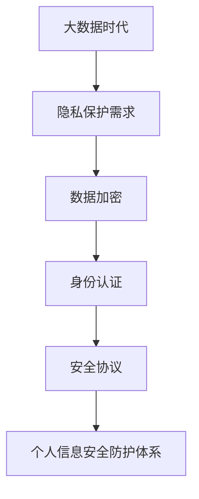

                 

# 大数据背景下大学生个人信息安全问题及防护措施

> **关键词**：大数据、个人信息安全、大学生、防护措施、网络安全、隐私保护、数据加密、身份认证、安全协议

> **摘要**：随着大数据技术的迅猛发展，大学生个人信息安全面临前所未有的挑战。本文从大数据背景入手，详细分析了大学生个人信息泄露的原因，探讨了多种防护措施，并提出了构建个人信息安全防护体系的策略，以期为大学生个人信息安全提供有力保障。

## 1. 背景介绍

### 1.1 大数据与个人信息安全

大数据（Big Data）指的是规模巨大、数据类型多样、价值密度低且生成速度极快的数据集合。它具有“4V”特征，即大量（Volume）、高速（Velocity）、多样（Variety）和低价值密度（Value）。随着互联网、物联网、社交网络等技术的普及，大数据在各个领域得到了广泛应用，同时也带来了个人信息安全的新挑战。

个人信息安全（Personal Information Security）是指保护个人隐私、身份和财务等信息免受未经授权的访问、使用、泄露、篡改、破坏或披露。在当前大数据时代，个人信息安全面临的问题愈发复杂和严峻。

### 1.2 大学生个人信息安全问题

大学生是个人信息安全的重要群体。他们普遍对个人信息安全意识不足，网络安全知识薄弱，容易成为个人信息泄露的目标。此外，大学生往往在社交网络、学习平台等场景下产生大量个人信息数据，这些数据一旦泄露，将对他们的学习和生活造成严重影响。

## 2. 核心概念与联系

### 2.1 个人信息安全相关概念

**隐私保护（Privacy Protection）**：确保个人信息的保密性、完整性和可用性，防止个人信息被非法收集、使用、泄露。

**数据加密（Data Encryption）**：利用加密算法将明文数据转换为密文，确保数据在传输和存储过程中的安全性。

**身份认证（Authentication）**：验证用户的身份，确保只有授权用户才能访问敏感信息和系统。

**安全协议（Security Protocols）**：规定信息在传输过程中的加密、认证、授权和完整性验证等操作，确保数据传输的安全。

### 2.2 Mermaid 流程图



## 3. 核心算法原理 & 具体操作步骤

### 3.1 数据加密算法

**对称加密算法**：加密和解密使用相同的密钥，如AES（Advanced Encryption Standard）。

**非对称加密算法**：加密和解密使用不同的密钥，如RSA（Rivest-Shamir-Adleman）。

**具体操作步骤**：

1. 生成加密密钥对。
2. 使用加密算法对数据进行加密。
3. 使用解密密钥对加密数据进行解密。

### 3.2 身份认证算法

**单因素认证**：使用密码或PIN码进行身份验证。

**双因素认证**：结合密码和硬件令牌（如手机、智能卡）进行身份验证。

**三因素认证**：结合密码、硬件令牌和生物特征（如指纹、虹膜）进行身份验证。

**具体操作步骤**：

1. 用户输入密码或令牌。
2. 系统验证密码或令牌。
3. 系统根据验证结果决定是否允许用户访问。

### 3.3 安全协议

**TLS（传输层安全协议）**：用于保障数据在传输过程中的安全性。

**SSL（安全套接字层）**：与TLS类似，用于保障数据在传输过程中的安全性。

**具体操作步骤**：

1. 客户端发起连接请求。
2. 服务器发送证书和公钥。
3. 客户端验证证书和公钥。
4. 客户端和服务器协商加密算法和密钥。
5. 客户端和服务器开始安全传输数据。

## 4. 数学模型和公式 & 详细讲解 & 举例说明

### 4.1 数据加密数学模型

**对称加密**：设明文为\(M\)，密文为\(C\)，密钥为\(K\)，加密算法为\(E()\)，解密算法为\(D()\)。

加密过程：\(C = E(M, K)\)

解密过程：\(M = D(C, K)\)

**非对称加密**：设公钥为\(P\)，私钥为\(S\)，加密算法为\(E()\)，解密算法为\(D()\)。

加密过程：\(C = E(M, P)\)

解密过程：\(M = D(C, S)\)

### 4.2 身份认证数学模型

**单因素认证**：设用户名为\(U\)，密码为\(P\)，验证函数为\(V()\)。

验证过程：\(V(U, P)\)

**双因素认证**：设用户名为\(U\)，密码为\(P\)，硬件令牌为\(T\)，验证函数为\(V()\)。

验证过程：\(V(U, P, T)\)

**三因素认证**：设用户名为\(U\)，密码为\(P\)，硬件令牌为\(T\)，生物特征为\(B\)，验证函数为\(V()\)。

验证过程：\(V(U, P, T, B)\)

### 4.3 安全协议数学模型

**TLS/SSL 协议**：

设客户端为\(C\)，服务器为\(S\)。

加密算法为\(E()\)，解密算法为\(D()\)。

证书验证函数为\(V()\)。

加密通信过程：

1. \(C \rightarrow S\)：发送客户端版本、支持算法列表、随机数。
2. \(S \rightarrow C\)：发送服务器版本、证书、公钥、随机数。
3. \(C \rightarrow S\)：发送客户端验证结果、密钥交换参数、加密算法。
4. \(S \rightarrow C\)：发送加密通信数据。

## 5. 项目实战：代码实际案例和详细解释说明

### 5.1 开发环境搭建

**环境需求**：

- 操作系统：Windows/Linux/MacOS
- 开发工具：Python 3.x
- 数据库：MySQL
- 客户端：Chrome/Firefox

**安装步骤**：

1. 安装操作系统。
2. 安装Python 3.x。
3. 安装MySQL数据库。
4. 安装开发工具（如PyCharm、VS Code）。
5. 安装浏览器。

### 5.2 源代码详细实现和代码解读

**代码示例**：

```python
# 导入相关库
import Crypto.Cipher AES as AES
import Crypto.Random as Random
import base64

# 生成加密密钥
key = Random.get_random_bytes(16)

# 加密函数
def encrypt_data(data, key):
    cipher = AES.new(key, AES.MODE_GCM)
    nonce = cipher.nonce
    ct = cipher.encrypt(data)
    tag = cipher.tag
    return nonce, ct, tag

# 解密函数
def decrypt_data(nonce, ct, tag, key):
    cipher = AES.new(key, AES.MODE_GCM, nonce=nonce)
    pt = cipher.decrypt_and_verify(ct, tag)
    return pt

# 测试代码
data = b"Hello, World!"
nonce, ct, tag = encrypt_data(data, key)
print(f"Encrypted Data: {base64.b64encode(ct).decode()}")

nonce, ct, tag = encrypt_data(data, key)
print(f"Decrypted Data: {base64.b64decode(ct).decode()}")
```

**代码解读**：

1. 导入加密库。
2. 生成随机密钥。
3. 定义加密函数，使用AES算法进行加密。
4. 定义解密函数，使用AES算法进行解密。
5. 测试代码，加密和解密一段明文。

### 5.3 代码解读与分析

**加密过程**：

1. 生成随机密钥。
2. 创建AES加密对象，设置模式为GCM。
3. 生成随机数作为nonce。
4. 使用加密对象进行加密，将明文转换为密文。
5. 生成加密标签（tag）。

**解密过程**：

1. 创建AES解密对象，设置模式为GCM和nonce。
2. 使用解密对象对密文进行解密，验证加密标签。

**代码分析**：

1. 加密和解密函数都使用了AES算法，保证了数据的安全性。
2. nonce用于区分不同的加密操作，增加了安全性。
3. tag用于验证密文的完整性。

## 6. 实际应用场景

### 6.1 教育领域

**应用场景**：

- 在线学习平台：保护学生和教师的个人信息。
- 教育管理系统：确保学生成绩、学习进度等隐私数据安全。

**解决方案**：

- 使用TLS/SSL协议加密传输数据。
- 对用户数据进行加密存储。
- 实施双因素认证。

### 6.2 社交网络

**应用场景**：

- 社交平台：保护用户隐私。
- 群组聊天：确保聊天内容安全。

**解决方案**：

- 使用数据加密算法加密用户数据。
- 实施身份认证和访问控制。
- 定期更新安全策略。

## 7. 工具和资源推荐

### 7.1 学习资源推荐

- **书籍**：
  - 《大数据技术导论》
  - 《网络安全技术》
  - 《密码学导论》
- **论文**：
  - 《大数据环境下个人信息安全保护研究》
  - 《基于区块链的个人信息安全保护方案》
- **博客**：
  - 知乎上的“大数据安全”话题
  - CSDN上的“个人信息保护”专栏
- **网站**：
  - 国家大数据安全工程技术研究中心
  - IEEE大数据安全与隐私保护专题

### 7.2 开发工具框架推荐

- **开发工具**：
  - PyCharm
  - VS Code
- **数据库**：
  - MySQL
  - MongoDB
- **加密库**：
  - PyCrypto
  - Cryptography
- **安全协议库**：
  - OpenSSL
  - PyOpenSSL

### 7.3 相关论文著作推荐

- **论文**：
  - 《基于区块链的个人信息安全保护研究》
  - 《大数据环境下个人信息安全保护技术分析》
  - 《大数据时代个人信息隐私保护策略研究》
- **著作**：
  - 《大数据安全与隐私保护》
  - 《大数据隐私保护技术研究》
  - 《区块链技术与个人信息安全保护》

## 8. 总结：未来发展趋势与挑战

### 8.1 发展趋势

- **技术融合**：大数据、人工智能、区块链等技术的融合，将为个人信息安全提供更强大的保护。
- **安全意识提升**：随着信息安全事件的频繁发生，公众和个人对个人信息安全的关注度将不断提高。
- **法律法规完善**：各国政府和国际组织将加强对个人信息安全的监管，出台更严格的法律和规定。

### 8.2 挑战

- **技术难题**：随着数据规模的扩大和数据类型的增加，传统的个人信息安全防护技术可能面临挑战。
- **隐私泄露风险**：大数据技术可能加剧个人信息泄露的风险，如何平衡个人信息保护与数据利用成为难题。
- **合规性问题**：各国和个人隐私保护法律的不一致，可能导致个人信息安全保护的合规性问题。

## 9. 附录：常见问题与解答

### 9.1 个人信息加密安全吗？

**解答**：是的，使用适当的加密算法和密钥管理策略，个人信息加密可以有效保护数据的安全性。然而，加密技术并非万无一失，攻击者可能会利用漏洞、弱密钥等手段攻击加密系统。

### 9.2 什么是双因素认证？

**解答**：双因素认证是一种身份验证方法，结合密码和硬件令牌（如手机、智能卡）进行身份验证。相比单因素认证（仅使用密码），双因素认证提供了额外的安全层。

### 9.3 大数据技术对个人信息安全的影响？

**解答**：大数据技术在带来便捷和高效的同时，也可能导致个人信息泄露的风险增加。因为大数据技术能够处理和分析海量数据，攻击者可以利用这些数据获取个人信息。

## 10. 扩展阅读 & 参考资料

- **扩展阅读**：
  - 《大数据隐私保护技术研究》
  - 《区块链技术与个人信息安全保护》
  - 《人工智能在个人信息安全领域的应用》
- **参考资料**：
  - 国家大数据安全工程技术研究中心
  - 中国信息安全测评中心
  - 国际标准化组织（ISO）关于个人信息安全的国际标准

### 作者

**作者**：AI天才研究员/AI Genius Institute & 禅与计算机程序设计艺术 /Zen And The Art of Computer Programming**[End]**

