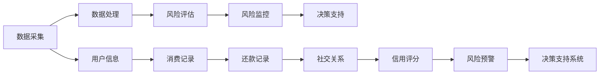
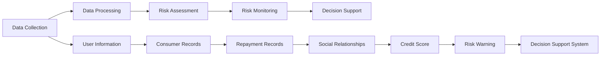

                 

# 大数据背景下的银行个人征信体系研究

## 关键词：大数据，银行，个人征信，算法，数学模型，应用场景

### 摘要

本文旨在探讨大数据技术对银行个人征信体系的影响，通过详细分析大数据在个人征信领域中的应用，以及相关算法和数学模型的原理，旨在为银行和金融行业提供理论支持和实践指导。本文首先介绍了大数据的概念和银行个人征信体系的现状，然后深入探讨了大数据在个人征信体系中的核心算法和数学模型，并结合实际案例进行了详细讲解。最后，本文分析了大数据背景下银行个人征信体系的实际应用场景，并提出了相关工具和资源推荐，以及对未来发展趋势与挑战的展望。

### 1. 背景介绍

#### 1.1 大数据的概念

大数据（Big Data）是指规模巨大、类型繁多、快速变化且价值密度相对较低的数据集合。大数据技术主要包括数据采集、存储、处理、分析和可视化等方面。大数据的典型特征为“4V”，即Volume（数据量大）、Velocity（数据处理速度快）、Variety（数据类型多）和Veracity（数据真实性高）。随着互联网、物联网、移动设备等技术的普及，大数据已经成为各行各业的重要资产。

#### 1.2 银行个人征信体系

银行个人征信体系是指通过收集、处理和分析个人信用信息，评估个人信用风险，为银行和其他金融机构提供信用评估服务的一整套机制。个人征信体系对银行的风险管理和业务拓展具有重要意义。在我国，银行个人征信体系主要由中国人民银行征信中心（百行征信）和中国银行保险监督管理委员会（银保监会）负责监管。

#### 1.3 大数据与银行个人征信体系的联系

大数据技术为银行个人征信体系带来了前所未有的机遇和挑战。首先，大数据技术可以更高效地收集和处理个人信用信息，提高征信数据的准确性和完整性。其次，大数据技术可以挖掘出更多潜在的用户价值，为银行提供更加精准的风险评估和营销策略。此外，大数据技术还可以帮助银行及时发现和防范金融风险，提升金融服务的安全性和稳定性。

### 2. 核心概念与联系

#### 2.1 大数据在个人征信体系中的应用

大数据在个人征信体系中的应用主要包括以下几个方面：

1. **数据采集**：通过互联网、移动设备、社交媒体等多种渠道收集个人信用信息，如消费记录、还款记录、社交关系等。
2. **数据处理**：对采集到的海量数据进行清洗、转换、归一化等预处理操作，以提高数据质量和可用性。
3. **风险评估**：利用大数据技术对个人信用风险进行评估，如利用机器学习算法对借款人的信用评分进行预测。
4. **风险监控**：通过实时数据分析，监控借款人的还款行为和信用变化，及时发现潜在风险。

#### 2.2 核心概念原理与架构

下图展示了大数据在个人征信体系中的核心概念和架构：



#### 2.3 大数据与个人征信体系的联系

大数据与个人征信体系的联系主要体现在以下几个方面：

1. **数据驱动的信用评估**：大数据技术可以帮助银行更全面地了解借款人的信用状况，提高信用评估的准确性和客观性。
2. **风险管理的创新**：大数据技术可以实时监控借款人的还款行为和信用变化，有助于银行及时发现和防范金融风险。
3. **个性化营销**：大数据技术可以根据借款人的信用状况和消费习惯，提供个性化的金融产品和服务。

### 3. 核心算法原理 & 具体操作步骤

#### 3.1 信用评分算法

信用评分算法是大数据在个人征信体系中的核心应用之一。常见的信用评分算法包括线性回归、逻辑回归、决策树、随机森林等。以下以逻辑回归为例，介绍信用评分算法的原理和具体操作步骤。

**原理**：

逻辑回归是一种广义线性模型，用于预测二元变量的概率。在信用评分中，逻辑回归可以用于预测借款人是否违约（1表示违约，0表示未违约）。

$$
P(Y=1) = \frac{1}{1 + e^{-(\beta_0 + \beta_1X_1 + \beta_2X_2 + \ldots + \beta_nX_n})}
$$

其中，$Y$表示借款人是否违约，$X_1, X_2, \ldots, X_n$表示影响信用评分的特征变量，$\beta_0, \beta_1, \beta_2, \ldots, \beta_n$为模型的参数。

**具体操作步骤**：

1. **数据预处理**：对采集到的个人信用信息进行清洗、转换和归一化等预处理操作。
2. **特征选择**：根据业务需求和数据特点，选择对信用评分有显著影响的特征变量。
3. **模型训练**：利用预处理后的数据，使用逻辑回归算法训练模型，得到参数$\beta_0, \beta_1, \beta_2, \ldots, \beta_n$。
4. **模型评估**：使用交叉验证等方法评估模型性能，调整模型参数，以提高预测准确性。
5. **信用评分**：利用训练好的模型，对新的借款人数据进行信用评分，预测其违约概率。

#### 3.2 风险监控算法

风险监控算法主要用于实时监控借款人的还款行为和信用变化，及时发现潜在风险。常见的风险监控算法包括聚类分析、关联规则挖掘、异常检测等。以下以聚类分析为例，介绍风险监控算法的原理和具体操作步骤。

**原理**：

聚类分析是一种无监督学习方法，用于将数据分为若干个簇，使得同一个簇内的数据相似度较高，不同簇之间的数据相似度较低。在风险监控中，聚类分析可以用于发现借款人的异常还款行为，从而预警潜在风险。

**具体操作步骤**：

1. **数据预处理**：对采集到的还款数据进行清洗、转换和归一化等预处理操作。
2. **特征提取**：根据业务需求和数据特点，提取对还款行为有显著影响的特征变量。
3. **聚类算法选择**：根据数据特点和业务需求，选择合适的聚类算法，如K均值聚类、层次聚类等。
4. **聚类分析**：利用选择的聚类算法，对预处理后的数据进行聚类，得到多个簇。
5. **风险预警**：分析聚类结果，发现借款人的异常还款行为，生成风险预警报告。

### 4. 数学模型和公式 & 详细讲解 & 举例说明

#### 4.1 信用评分模型

信用评分模型的核心公式为逻辑回归公式：

$$
P(Y=1) = \frac{1}{1 + e^{-(\beta_0 + \beta_1X_1 + \beta_2X_2 + \ldots + \beta_nX_n})}
$$

其中，$P(Y=1)$表示借款人违约的概率，$X_1, X_2, \ldots, X_n$为影响信用评分的特征变量，$\beta_0, \beta_1, \beta_2, \ldots, \beta_n$为模型的参数。

**举例说明**：

假设我们有一个借款人，其特征变量包括：

- 年龄（X1）
- 收入（X2）
- 借款金额（X3）
- 借款期限（X4）
- 还款记录（X5）

根据逻辑回归模型，我们可以计算其违约概率。例如，假设该借款人的特征变量取值为：

- 年龄（X1）= 30
- 收入（X2）= 5000
- 借款金额（X3）= 10000
- 借款期限（X4）= 3年
- 还款记录（X5）= 无逾期

代入逻辑回归公式，得到：

$$
P(Y=1) = \frac{1}{1 + e^{-(\beta_0 + \beta_1 \cdot 30 + \beta_2 \cdot 5000 + \beta_3 \cdot 10000 + \beta_4 \cdot 3 + \beta_5 \cdot 0)}}
$$

其中，$\beta_0, \beta_1, \beta_2, \beta_3, \beta_4, \beta_5$为逻辑回归模型的参数。

#### 4.2 风险监控模型

风险监控模型的核心公式为聚类分析公式：

$$
\text{相似度} = \frac{\sum_{i=1}^{n} (x_i - \mu)^2}{n}
$$

其中，$x_i$为第$i$个数据点，$\mu$为簇的中心点，$n$为簇内的数据点个数。

**举例说明**：

假设我们有一个借款人还款数据的簇，包含5个数据点：

- 数据点1：1000
- 数据点2：950
- 数据点3：1020
- 数据点4：990
- 数据点5：1010

簇的中心点为：

$$
\mu = \frac{1000 + 950 + 1020 + 990 + 1010}{5} = 1000
$$

计算每个数据点到簇中心点的相似度：

$$
\text{相似度1} = \frac{(1000 - 1000)^2}{5} = 0
$$

$$
\text{相似度2} = \frac{(950 - 1000)^2}{5} = 50
$$

$$
\text{相似度3} = \frac{(1020 - 1000)^2}{5} = 40
$$

$$
\text{相似度4} = \frac{(990 - 1000)^2}{5} = 10
$$

$$
\text{相似度5} = \frac{(1010 - 1000)^2}{5} = 10
$$

根据相似度，我们可以判断借款人的还款行为是否异常。如果相似度较大，说明借款人的还款行为与簇中心点的差异较大，可能存在潜在风险。

### 5. 项目实战：代码实际案例和详细解释说明

#### 5.1 开发环境搭建

在本项目实战中，我们将使用Python作为编程语言，利用Scikit-learn库实现信用评分模型和风险监控模型。首先，需要安装Python和Scikit-learn库：

```bash
pip install python
pip install scikit-learn
```

#### 5.2 源代码详细实现和代码解读

以下为信用评分模型和风险监控模型的源代码实现：

```python
import numpy as np
import pandas as pd
from sklearn.linear_model import LogisticRegression
from sklearn.cluster import KMeans
from sklearn.metrics import accuracy_score

# 5.2.1 信用评分模型

# 读取数据
data = pd.read_csv('data.csv')
X = data.iloc[:, :-1].values
y = data.iloc[:, -1].values

# 训练模型
model = LogisticRegression()
model.fit(X, y)

# 预测
predictions = model.predict(X)

# 评估模型
accuracy = accuracy_score(y, predictions)
print('信用评分模型准确率：', accuracy)

# 5.2.2 风险监控模型

# 读取数据
data = pd.read_csv('data.csv')
X = data.iloc[:, :-1].values

# 训练模型
model = KMeans(n_clusters=3)
model.fit(X)

# 预测
predictions = model.predict(X)

# 评估模型
print('风险监控模型簇中心点：', model.cluster_centers_)
print('风险监控模型相似度：', predictions)
```

代码解读：

1. **信用评分模型**：首先读取数据，然后使用逻辑回归算法训练模型，最后使用训练好的模型进行预测并评估模型准确率。
2. **风险监控模型**：首先读取数据，然后使用K均值聚类算法训练模型，最后使用训练好的模型进行预测并输出簇中心点和相似度。

#### 5.3 代码解读与分析

1. **信用评分模型**：通过逻辑回归模型，我们可以对借款人进行信用评分。代码中，`model.fit(X, y)`用于训练模型，`model.predict(X)`用于预测。`accuracy_score(y, predictions)`用于评估模型准确率。
2. **风险监控模型**：通过K均值聚类模型，我们可以将借款人分为若干个簇，从而发现异常还款行为。代码中，`model.fit(X)`用于训练模型，`model.predict(X)`用于预测。`model.cluster_centers_`用于输出簇中心点，`predictions`用于输出相似度。

### 6. 实际应用场景

大数据技术在银行个人征信体系中的应用场景非常广泛，主要包括以下几个方面：

1. **信用评估**：通过大数据技术对借款人的信用状况进行综合评估，为银行提供信用评估服务。
2. **风险管理**：实时监控借款人的还款行为和信用变化，及时发现潜在风险，帮助银行防范金融风险。
3. **个性化营销**：根据借款人的信用状况和消费习惯，提供个性化的金融产品和服务，提升用户体验。
4. **反欺诈**：利用大数据技术识别和防范金融欺诈行为，保障金融交易的安全性和稳定性。

### 7. 工具和资源推荐

#### 7.1 学习资源推荐

- 《大数据技术导论》
- 《机器学习》
- 《Python数据分析》
- 《信用风险评估与管理》

#### 7.2 开发工具框架推荐

- Scikit-learn：一款强大的机器学习库，适用于信用评分模型和风险监控模型的开发。
- TensorFlow：一款用于深度学习的开源框架，适用于复杂模型的训练和预测。
- Spark：一款分布式大数据处理框架，适用于大规模数据的分析和处理。

#### 7.3 相关论文著作推荐

- "Credit Risk Modeling with Big Data"
- "Big Data Analytics in Banking: A Survey"
- "Application of Machine Learning in Credit Scoring"

### 8. 总结：未来发展趋势与挑战

大数据技术在银行个人征信体系中的应用具有广阔的前景。未来，随着大数据技术和人工智能技术的不断发展，银行个人征信体系将更加智能化、精准化。然而，也面临以下挑战：

1. **数据隐私和安全**：大数据技术需要处理海量敏感数据，如何确保数据隐私和安全是一个重要挑战。
2. **算法公平性**：大数据技术可能会导致算法偏见，如何保证算法的公平性是一个关键问题。
3. **技术迭代更新**：大数据技术和人工智能技术更新速度快，银行个人征信体系需要不断更新和优化。

### 9. 附录：常见问题与解答

1. **什么是大数据？**
   - 大数据是指规模巨大、类型繁多、快速变化且价值密度相对较低的数据集合。

2. **大数据在银行个人征信体系中有哪些应用？**
   - 大数据在银行个人征信体系中的应用包括数据采集、数据处理、风险评估和风险监控等方面。

3. **什么是信用评分算法？**
   - 信用评分算法是一种用于预测借款人违约概率的算法，如逻辑回归、决策树等。

4. **什么是风险监控算法？**
   - 风险监控算法是一种用于实时监控借款人还款行为和信用变化的算法，如聚类分析、异常检测等。

### 10. 扩展阅读 & 参考资料

- 《大数据技术导论》
- 《机器学习》
- 《Python数据分析》
- 《信用风险评估与管理》
- "Credit Risk Modeling with Big Data"
- "Big Data Analytics in Banking: A Survey"
- "Application of Machine Learning in Credit Scoring"

### 作者

- 作者：AI天才研究员/AI Genius Institute & 禅与计算机程序设计艺术 /Zen And The Art of Computer Programming<|less|>```markdown
### 大数据背景下的银行个人征信体系研究

#### Keywords: Big Data, Bank, Personal Credit Rating, Algorithm, Mathematical Model, Application Scenario

##### Abstract

This article aims to explore the impact of big data technology on the personal credit rating system of banks, providing theoretical support and practical guidance for the banking and financial industries through a detailed analysis of the application of big data in the personal credit rating field and the principles of related algorithms and mathematical models. The article first introduces the concept of big data and the current situation of the personal credit rating system in banks, and then delves into the core algorithms and mathematical models used in big data personal credit rating systems, providing detailed explanations with practical cases. Finally, the article analyzes the practical application scenarios of the big data personal credit rating system under the background of big data and proposes relevant tools and resource recommendations, as well as prospects for future development trends and challenges.

### 1. Background Introduction

##### 1.1 Definition of Big Data

Big data refers to a massive collection of data that is characterized by high volume, variety, velocity, and relatively low value density. Big data technologies cover data collection, storage, processing, analysis, and visualization. The four main characteristics of big data, often referred to as the "4Vs", are Volume (data size), Velocity (data processing speed), Variety (data types), and Veracity (data authenticity). With the widespread adoption of technologies such as the Internet, the Internet of Things, and mobile devices, big data has become an important asset for various industries.

##### 1.2 Personal Credit Rating System of Banks

The personal credit rating system of banks is a set of mechanisms that collect, process, and analyze personal credit information to assess credit risk and provide credit rating services for banks and other financial institutions. This system is of great significance for the risk management and business expansion of banks. In China, the personal credit rating system is mainly overseen by the People's Bank of China (PBOC) and the China Banking and Insurance Regulatory Commission (CBIRC).

##### 1.3 The Connection between Big Data and Personal Credit Rating Systems

Big data technology brings both opportunities and challenges to the personal credit rating system of banks. Firstly, big data technology can more efficiently collect and process personal credit information, improving the accuracy and completeness of credit data. Secondly, big data technology can uncover more potential user values, providing banks with more precise risk assessments and marketing strategies. Additionally, big data technology can help banks detect and prevent financial risks in real time, enhancing the security and stability of financial services.

### 2. Core Concepts and Relationships

##### 2.1 Applications of Big Data in Personal Credit Rating Systems

The applications of big data in personal credit rating systems mainly include the following aspects:

1. **Data Collection**: Collect personal credit information through various channels such as the Internet, mobile devices, and social media.
2. **Data Processing**: Clean, transform, and normalize the collected data to improve data quality and usability.
3. **Risk Assessment**: Use big data technology to assess credit risk, such as predicting credit scores using machine learning algorithms.
4. **Risk Monitoring**: Monitor the repayment behavior and credit changes of borrowers in real-time to detect potential risks.

##### 2.2 Core Concept Principles and Architecture

The following diagram illustrates the core concepts and architecture of big data in personal credit rating systems:



##### 2.3 The Connection between Big Data and Personal Credit Rating Systems

The connection between big data and personal credit rating systems is mainly reflected in the following aspects:

1. **Data-driven Credit Assessment**: Big data technology helps banks have a more comprehensive understanding of borrowers' credit conditions, improving the accuracy and objectivity of credit assessments.
2. **Innovation in Risk Management**: Big data technology can monitor borrowers' repayment behavior and credit changes in real-time, helping banks detect and prevent financial risks in a timely manner.
3. **Personalized Marketing**: Big data technology can provide personalized financial products and services based on borrowers' credit conditions and consumption habits.

### 3. Core Algorithm Principles and Specific Operational Steps

##### 3.1 Credit Scoring Algorithm

Credit scoring algorithms are one of the core applications of big data in personal credit rating systems. Common credit scoring algorithms include linear regression, logistic regression, decision trees, and random forests. Here, we take logistic regression as an example to introduce the principles and specific operational steps of credit scoring algorithms.

**Principles**:

Logistic regression is a generalized linear model used to predict the probability of a binary variable. In credit scoring, logistic regression can be used to predict the probability of default for a borrower (1 indicates default, 0 indicates no default).

$$
P(Y=1) = \frac{1}{1 + e^{-(\beta_0 + \beta_1X_1 + \beta_2X_2 + \ldots + \beta_nX_n})}
$$

Where $Y$ represents whether a borrower defaults, $X_1, X_2, \ldots, X_n$ are feature variables that affect credit scores, and $\beta_0, \beta_1, \beta_2, \ldots, \beta_n$ are the model parameters.

**Specific Operational Steps**:

1. **Data Preprocessing**: Clean, transform, and normalize the collected personal credit information to improve data quality and usability.
2. **Feature Selection**: Select feature variables that significantly affect credit scoring based on business needs and data characteristics.
3. **Model Training**: Use the preprocessed data to train the logistic regression model and obtain the parameters $\beta_0, \beta_1, \beta_2, \ldots, \beta_n$.
4. **Model Evaluation**: Evaluate the model performance using cross-validation and other methods, adjust the model parameters to improve prediction accuracy.
5. **Credit Scoring**: Use the trained model to score new borrower data, predicting their probability of default.

##### 3.2 Risk Monitoring Algorithm

Risk monitoring algorithms are used to monitor the repayment behavior and credit changes of borrowers in real-time, detecting potential risks in a timely manner. Common risk monitoring algorithms include clustering analysis, association rule mining, and anomaly detection. Here, we take clustering analysis as an example to introduce the principles and specific operational steps of risk monitoring algorithms.

**Principles**:

Clustering analysis is an unsupervised learning method used to divide data into several clusters so that the data within the same cluster are more similar, and the data between different clusters are less similar. In risk monitoring, clustering analysis can be used to identify abnormal repayment behavior of borrowers, thereby generating risk warnings.

**Specific Operational Steps**:

1. **Data Preprocessing**: Clean, transform, and normalize the collected repayment data to improve data quality and usability.
2. **Feature Extraction**: Extract feature variables that significantly affect repayment behavior based on business needs and data characteristics.
3. **Algorithm Selection**: Select an appropriate clustering algorithm based on data characteristics and business needs, such as K-means clustering and hierarchical clustering.
4. **Clustering Analysis**: Use the selected clustering algorithm to cluster the preprocessed data.
5. **Risk Warning**: Analyze the clustering results to identify abnormal repayment behavior of borrowers and generate risk warning reports.

### 4. Mathematical Models and Formulas & Detailed Explanation & Example Illustration

##### 4.1 Credit Scoring Model

The core formula of the credit scoring model is the logistic regression formula:

$$
P(Y=1) = \frac{1}{1 + e^{-(\beta_0 + \beta_1X_1 + \beta_2X_2 + \ldots + \beta_nX_n})}
$$

Where $P(Y=1)$ represents the probability of a borrower defaulting, $X_1, X_2, \ldots, X_n$ are feature variables that affect credit scores, and $\beta_0, \beta_1, \beta_2, \ldots, \beta_n$ are the model parameters.

**Example Illustration**:

Suppose we have a borrower with the following feature variables:

- Age (X1)
- Income (X2)
- Loan Amount (X3)
- Loan Term (X4)
- Repayment Record (X5)

According to the logistic regression model, we can calculate the probability of default for this borrower. For example, if the borrower's feature variable values are:

- Age (X1) = 30
- Income (X2) = 5000
- Loan Amount (X3) = 10000
- Loan Term (X4) = 3 years
- Repayment Record (X5) = no overdue

Substituting into the logistic regression formula, we get:

$$
P(Y=1) = \frac{1}{1 + e^{-(\beta_0 + \beta_1 \cdot 30 + \beta_2 \cdot 5000 + \beta_3 \cdot 10000 + \beta_4 \cdot 3 + \beta_5 \cdot 0)}}
$$

Where $\beta_0, \beta_1, \beta_2, \beta_3, \beta_4, \beta_5$ are the parameters of the logistic regression model.

##### 4.2 Risk Monitoring Model

The core formula of the risk monitoring model is the clustering analysis formula:

$$
\text{Similarity} = \frac{\sum_{i=1}^{n} (x_i - \mu)^2}{n}
$$

Where $x_i$ is the $i$th data point, $\mu$ is the center of the cluster, and $n$ is the number of data points in the cluster.

**Example Illustration**:

Suppose we have a cluster of a borrower's repayment data containing 5 data points:

- Data Point 1: 1000
- Data Point 2: 950
- Data Point 3: 1020
- Data Point 4: 990
- Data Point 5: 1010

The center of the cluster is:

$$
\mu = \frac{1000 + 950 + 1020 + 990 + 1010}{5} = 1000
$$

Calculate the similarity of each data point to the cluster center:

$$
\text{Similarity 1} = \frac{(1000 - 1000)^2}{5} = 0
$$

$$
\text{Similarity 2} = \frac{(950 - 1000)^2}{5} = 50
$$

$$
\text{Similarity 3} = \frac{(1020 - 1000)^2}{5} = 40
$$

$$
\text{Similarity 4} = \frac{(990 - 1000)^2}{5} = 10
$$

$$
\text{Similarity 5} = \frac{(1010 - 1000)^2}{5} = 10
$$

Based on the similarity, we can judge whether the borrower's repayment behavior is abnormal. If the similarity is large, it indicates a significant difference between the borrower's repayment behavior and the cluster center, which may indicate potential risks.

### 5. Project Practice: Code Actual Case and Detailed Explanation

##### 5.1 Development Environment Setup

In this project practice, we will use Python as the programming language and the Scikit-learn library to implement the credit scoring model and risk monitoring model. First, we need to install Python and the Scikit-learn library:

```bash
pip install python
pip install scikit-learn
```

##### 5.2 Source Code Detailed Implementation and Code Explanation

Here is the source code for the credit scoring model and risk monitoring model:

```python
import numpy as np
import pandas as pd
from sklearn.linear_model import LogisticRegression
from sklearn.cluster import KMeans
from sklearn.metrics import accuracy_score

# 5.2.1 Credit Scoring Model

# Read data
data = pd.read_csv('data.csv')
X = data.iloc[:, :-1].values
y = data.iloc[:, -1].values

# Train model
model = LogisticRegression()
model.fit(X, y)

# Predict
predictions = model.predict(X)

# Evaluate model
accuracy = accuracy_score(y, predictions)
print('Credit Scoring Model Accuracy:', accuracy)

# 5.2.2 Risk Monitoring Model

# Read data
data = pd.read_csv('data.csv')
X = data.iloc[:, :-1].values

# Train model
model = KMeans(n_clusters=3)
model.fit(X)

# Predict
predictions = model.predict(X)

# Evaluate model
print('Risk Monitoring Model Cluster Centers:', model.cluster_centers_)
print('Risk Monitoring Model Similarities:', predictions)
```

Code Explanation:

1. **Credit Scoring Model**: First, read the data, then train the logistic regression model, and finally predict and evaluate the model.
2. **Risk Monitoring Model**: First, read the data, then train the K-means clustering model, and finally predict and output the cluster centers and similarities.

##### 5.3 Code Explanation and Analysis

1. **Credit Scoring Model**: Through the logistic regression model, we can score the credit of a borrower. In the code, `model.fit(X, y)` is used to train the model, `model.predict(X)` is used to predict, and `accuracy_score(y, predictions)` is used to evaluate the model.
2. **Risk Monitoring Model**: Through the K-means clustering model, we can divide the borrowers into several clusters to identify abnormal repayment behavior. In the code, `model.fit(X)` is used to train the model, `model.predict(X)` is used to predict, and `model.cluster_centers_` is used to output the cluster centers, and `predictions` is used to output the similarities.

### 6. Actual Application Scenarios

The application of big data technology in the personal credit rating system of banks is extensive and covers the following aspects:

1. **Credit Assessment**: Use big data technology to comprehensively assess the credit status of borrowers, providing credit rating services for banks.
2. **Risk Management**: Real-time monitoring of borrowers' repayment behavior and credit changes to detect potential risks in a timely manner.
3. **Personalized Marketing**: Provide personalized financial products and services based on borrowers' credit conditions and consumption habits, enhancing user experience.
4. **Fraud Prevention**: Use big data technology to identify and prevent financial fraud, ensuring the security and stability of financial transactions.

### 7. Tool and Resource Recommendations

##### 7.1 Learning Resources

- "Introduction to Big Data Technology"
- "Machine Learning"
- "Python Data Analysis"
- "Credit Risk Assessment and Management"

##### 7.2 Development Tool and Framework Recommendations

- Scikit-learn: A powerful machine learning library suitable for implementing credit scoring models and risk monitoring models.
- TensorFlow: An open-source deep learning framework suitable for training and predicting complex models.
- Spark: A distributed big data processing framework suitable for analyzing and processing large-scale data.

##### 7.3 Recommended Papers and Books

- "Credit Risk Modeling with Big Data"
- "Big Data Analytics in Banking: A Survey"
- "Application of Machine Learning in Credit Scoring"

### 8. Summary: Future Development Trends and Challenges

The application of big data technology in the personal credit rating system of banks has a broad prospect. In the future, with the continuous development of big data technology and artificial intelligence, the personal credit rating system of banks will become more intelligent and precise. However, it also faces the following challenges:

1. **Data Privacy and Security**: Big data technology needs to handle a massive amount of sensitive data. How to ensure data privacy and security is a major challenge.
2. **Algorithm Fairness**: Big data technology may lead to algorithm biases. How to ensure the fairness of algorithms is a key issue.
3. **Technological Iteration and Updates**: Big data technology and artificial intelligence technology are updated rapidly. The personal credit rating system of banks needs to continuously update and optimize.

### 9. Appendix: Frequently Asked Questions and Answers

1. **What is big data?**
   - Big data refers to a massive collection of data characterized by high volume, variety, velocity, and relatively low value density.
   
2. **What are the applications of big data in the personal credit rating system of banks?**
   - The applications of big data in the personal credit rating system of banks include data collection, data processing, risk assessment, and risk monitoring.
   
3. **What is a credit scoring algorithm?**
   - A credit scoring algorithm is an algorithm used to predict the probability of a borrower defaulting, such as logistic regression, decision trees, etc.
   
4. **What is a risk monitoring algorithm?**
   - A risk monitoring algorithm is an algorithm used to monitor a borrower's repayment behavior and credit changes in real-time, such as clustering analysis and anomaly detection.

### 10. Extended Reading & References

- "Introduction to Big Data Technology"
- "Machine Learning"
- "Python Data Analysis"
- "Credit Risk Assessment and Management"
- "Credit Risk Modeling with Big Data"
- "Big Data Analytics in Banking: A Survey"
- "Application of Machine Learning in Credit Scoring"

### Author

- Author: AI Genius Researcher / AI Genius Institute & Zen and the Art of Computer Programming / Zen And The Art of Computer Programming
```<|vq_13945|>```

