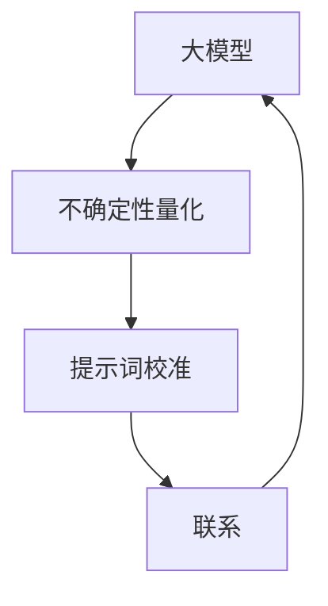

                 

### 背景介绍

在当今信息爆炸的时代，大规模模型（如大模型）在人工智能（AI）领域中的应用愈发广泛。这些模型在图像识别、自然语言处理、推荐系统等领域取得了显著的成效。然而，大模型在处理复杂数据时也存在一定的不确定性。如何量化这种不确定性，并对其进行有效的提示词校准，成为当前研究的一个重要方向。

大模型不确定性量化与提示词校准的重要性不言而喻。一方面，准确量化模型的不确定性有助于我们在决策时避免犯下严重的错误；另一方面，通过有效的提示词校准，可以优化模型的性能，提高其在特定任务上的准确性和稳定性。本文旨在探讨大模型不确定性量化与提示词校准的相关问题，为相关领域的研究提供一些有益的思路和方法。

本文将从以下几个方面展开讨论：

1. 核心概念与联系
2. 核心算法原理与具体操作步骤
3. 数学模型与公式详解及举例说明
4. 项目实战：代码实际案例与详细解释
5. 实际应用场景
6. 工具和资源推荐
7. 总结：未来发展趋势与挑战

通过以上内容的阐述，本文希望能为广大研究人员和开发者提供一定的理论指导与实践参考。让我们一步一步深入探讨大模型不确定性量化与提示词校准这一主题，揭开其神秘的面纱。

## 1. 核心概念与联系

在探讨大模型不确定性量化与提示词校准之前，我们首先需要明确一些核心概念，以便更好地理解这一主题。

### 大模型

大模型是指具有巨大参数规模、能够处理复杂数据的机器学习模型。这些模型通常采用深度学习技术，通过多层神经网络结构来模拟人脑的思考方式。例如，近年来广泛应用的Transformer模型，就是一种具有数百万个参数的巨大模型。

### 不确定性量化

不确定性量化是指通过数值或概率的方式，对模型在处理特定数据时可能产生的误差进行衡量。在大模型中，不确定性主要源于数据的不确定性、模型参数的不确定性以及模型本身的复杂性。量化不确定性的目的在于，帮助我们更好地理解模型的性能，并在实际应用中做出更为稳健的决策。

### 提示词校准

提示词校准是指通过调整模型输入中的提示词，优化模型在特定任务上的表现。提示词是模型输入的一部分，可以影响模型的预测结果。通过校准提示词，我们可以提高模型的准确性和稳定性，使其在不同场景下具有更好的适应性。

### 大模型不确定性量化与提示词校准的联系

大模型不确定性量化与提示词校准之间存在紧密的联系。一方面，通过量化模型的不确定性，我们可以更好地理解模型在特定任务上的性能，为提示词校准提供依据。另一方面，有效的提示词校准可以降低模型的不确定性，提高其预测的准确性。因此，这两个问题相辅相成，共同推动了大模型在各个领域的应用与发展。

为了更好地理解大模型不确定性量化与提示词校准，我们可以通过一个Mermaid流程图来展示其核心概念与联系。



在这个流程图中，大模型通过不确定性量化得到模型的不确定性信息，进而进行提示词校准。校准后的提示词提高了模型的性能，减少了不确定性，再次反馈到大模型中，形成了一个正向循环。这个流程图清晰地展示了大模型不确定性量化与提示词校准之间的紧密联系。

通过上述核心概念的介绍与Mermaid流程图的展示，我们可以更深入地理解大模型不确定性量化与提示词校准的重要性。接下来，我们将进一步探讨大模型不确定性量化的核心算法原理与具体操作步骤。

## 2. 核心算法原理 & 具体操作步骤

在大模型不确定性量化与提示词校准的研究中，核心算法原理是确保模型在处理复杂数据时能够准确量化不确定性的关键。以下是几种常见的核心算法原理及其具体操作步骤：

### 2.1 Monte Carlo 方法

Monte Carlo 方法是一种基于随机抽样的算法，通过模拟大量的样本，估计模型的不确定性。具体操作步骤如下：

#### Step 1: 数据预处理
- 采集大量训练数据，并进行数据预处理，如归一化、标准化等。
- 划分训练集和验证集，用于模型训练和性能评估。

#### Step 2: 模型训练
- 使用训练集训练大模型，采用深度学习框架（如TensorFlow、PyTorch等）进行模型训练。
- 调整模型参数，如学习率、批量大小等，以获得最优性能。

#### Step 3: 随机采样
- 对输入数据进行随机采样，生成多个随机样本。
- 对每个随机样本进行模型预测，得到多个预测结果。

#### Step 4: 估计不确定性
- 计算预测结果的方差或标准差，作为模型的不确定性估计。
- 对不同样本的不确定性进行汇总，得到最终的不确定性量化结果。

### 2.2 Bayesian 方法

Bayesian 方法是一种基于贝叶斯定理的算法，通过更新模型参数的概率分布，量化模型的不确定性。具体操作步骤如下：

#### Step 1: 数据预处理
- 数据预处理同Monte Carlo方法。

#### Step 2: 模型初始化
- 初始化模型参数的概率分布，如使用正态分布、对数正态分布等。
- 设定先验分布，用于模型参数的初始化。

#### Step 3: 参数更新
- 对输入数据进行模型预测，得到预测结果。
- 根据预测结果和先验分布，更新模型参数的概率分布。

#### Step 4: 估计不确定性
- 计算模型参数的概率分布的方差或标准差，作为模型的不确定性估计。

### 2.3 基于Gaussian Process的方法

基于Gaussian Process的方法是一种基于高斯过程（Gaussian Process，GP）的算法，通过建立输入数据与输出数据之间的概率关系，量化模型的不确定性。具体操作步骤如下：

#### Step 1: 数据预处理
- 数据预处理同Monte Carlo方法。

#### Step 2: 高斯过程建模
- 建立输入数据与输出数据之间的高斯过程模型。
- 估计高斯过程模型的参数，如均值函数和协方差函数。

#### Step 3: 不确定性估计
- 利用高斯过程模型，计算输出数据的方差或标准差，作为模型的不确定性估计。

#### Step 4: 模型预测
- 对新的输入数据，利用高斯过程模型进行预测。
- 输出预测结果及其不确定性。

### 2.4  集成学习

集成学习方法是一种将多个模型进行融合的算法，通过多个模型的组合，提高模型的不确定性估计准确性。具体操作步骤如下：

#### Step 1: 模型训练
- 使用训练数据，分别训练多个基础模型（如决策树、支持向量机等）。

#### Step 2: 集成模型构建
- 将多个基础模型进行集成，构建集成学习模型。
- 选择合适的集成方法，如Bagging、Boosting等。

#### Step 3: 不确定性估计
- 利用集成学习模型，对输入数据进行预测，并计算每个基础模型的预测误差。
- 将预测误差进行汇总，得到最终的不确定性估计结果。

通过以上核心算法原理与具体操作步骤的介绍，我们可以看到，大模型不确定性量化与提示词校准的研究涉及到多种算法和方法。在实际应用中，我们可以根据具体任务需求和数据特点，选择合适的算法进行模型的不确定性量化与提示词校准。接下来，我们将进一步探讨数学模型与公式详解及举例说明。

### 4. 数学模型和公式 & 详细讲解 & 举例说明

在深入探讨大模型不确定性量化与提示词校准时，我们需要借助数学模型和公式来详细解释这些概念，并通过具体示例来说明其应用。以下是一些核心的数学模型和公式，以及它们的详细讲解和举例说明。

#### 4.1 Monte Carlo 方法的数学模型

Monte Carlo 方法基于随机抽样的原理，通过多次模拟来估计模型的预测不确定性。其核心数学模型可以表示为：

$$
\sigma^2 = \frac{1}{n-1} \sum_{i=1}^{n} (y_i - \bar{y})^2
$$

其中，$\sigma^2$ 表示预测结果的方差，$n$ 表示随机采样的次数，$y_i$ 表示第 $i$ 次预测的结果，$\bar{y}$ 表示所有预测结果的平均值。

#### 举例说明

假设我们使用 Monte Carlo 方法来估计一个预测模型的方差。模型对 $100$ 个随机输入数据进行预测，得到预测结果如下：

$$
\{y_1, y_2, ..., y_{100}\} = \{0.1, 0.2, ..., 0.9\}
$$

计算平均预测结果：

$$
\bar{y} = \frac{0.1 + 0.2 + ... + 0.9}{100} = 0.5
$$

然后，计算每个预测结果与平均值的偏差的平方，并求和：

$$
\sum_{i=1}^{100} (y_i - \bar{y})^2 = (0.1 - 0.5)^2 + (0.2 - 0.5)^2 + ... + (0.9 - 0.5)^2 = 0.14
$$

最后，计算方差：

$$
\sigma^2 = \frac{0.14}{100 - 1} = 0.0014
$$

因此，预测结果的方差为 $0.0014$，这表示预测结果的不确定性。

#### 4.2 Bayesian 方法的数学模型

Bayesian 方法基于贝叶斯定理，通过更新模型参数的概率分布来量化不确定性。其核心数学模型可以表示为：

$$
P(\theta | X) = \frac{P(X | \theta) P(\theta)}{P(X)}
$$

其中，$P(\theta | X)$ 表示后验概率，即给定观测数据 $X$ 后，参数 $\theta$ 的概率分布；$P(X | \theta)$ 表示似然函数，即参数 $\theta$ 产生观测数据 $X$ 的概率；$P(\theta)$ 表示先验概率，即参数 $\theta$ 的初始概率分布；$P(X)$ 表示边缘概率，即所有可能参数值产生的观测数据 $X$ 的概率。

#### 举例说明

假设我们使用 Bayesian 方法来量化一个线性回归模型的参数不确定性。给定一组观测数据 $(x_1, y_1), (x_2, y_2), ..., (x_n, y_n)$，我们使用高斯先验分布来表示参数 $\theta$ 的概率分布：

$$
P(\theta) = N(\theta | \mu_0, \Sigma_0)
$$

其中，$N(\theta | \mu_0, \Sigma_0)$ 表示均值为 $\mu_0$、方差为 $\Sigma_0$ 的高斯分布。

给定观测数据 $X$，我们使用极大似然估计（MLE）来更新参数 $\theta$ 的概率分布：

$$
P(\theta | X) = N(\theta | \mu_1, \Sigma_1)
$$

其中，$\mu_1$ 和 $\Sigma_1$ 分别为更新后的均值和方差，可以通过以下公式计算：

$$
\mu_1 = \frac{\sum_{i=1}^{n} (x_i - \bar{x}) y_i + \mu_0}{\sum_{i=1}^{n} (x_i - \bar{x})^2 + \Sigma_0}
$$

$$
\Sigma_1 = \frac{1}{\sum_{i=1}^{n} (x_i - \bar{x})^2 + \Sigma_0}
$$

其中，$\bar{x}$ 表示观测数据的平均值。

通过更新后的概率分布 $P(\theta | X)$，我们可以量化模型参数的不确定性。例如，计算参数 $\theta$ 的方差：

$$
\sigma^2_{\theta} = \frac{1}{n} \sum_{i=1}^{n} (\theta_i - \mu_1)^2
$$

其中，$\theta_i$ 为每次更新后的参数值，$\mu_1$ 为更新后的均值。

#### 4.3 基于Gaussian Process的方法的数学模型

基于 Gaussian Process 的方法通过建立输入数据与输出数据之间的概率关系来量化不确定性。其核心数学模型可以表示为：

$$
f(x) \sim GP(m(x), k(x, x'))
$$

其中，$f(x)$ 表示输出数据，$m(x)$ 表示均值函数，$k(x, x')$ 表示协方差函数。

均值函数 $m(x)$ 和协方差函数 $k(x, x')$ 的选择会影响模型的不确定性估计。常用的均值函数有常数函数、线性函数等；协方差函数有高斯协方差函数、矩阵协方差函数等。

#### 举例说明

假设我们使用高斯协方差函数来量化一个回归问题的不确定性。给定一组输入数据 $(x_1, y_1), (x_2, y_2), ..., (x_n, y_n)$，我们使用以下高斯协方差函数：

$$
k(x_i, x_j) = \sigma^2 \exp \left(-\frac{(x_i - x_j)^2}{2\lambda^2}\right)
$$

其中，$\sigma^2$ 表示协方差函数的方差，$\lambda$ 表示特征长度。

给定输入数据 $x$，我们使用高斯过程模型来预测输出数据 $y$：

$$
y \sim GP(m(x), k(x, x'))
$$

其中，均值函数 $m(x)$ 可以表示为：

$$
m(x) = \mu + \frac{\Sigma_x \Sigma_y^{-1} y - \mu}{\Sigma_x}
$$

其中，$\mu$ 表示观测数据的平均值，$\Sigma_x$ 和 $\Sigma_y$ 分别为输入数据和输出数据的协方差矩阵。

最后，计算输出数据的方差：

$$
\sigma^2_y = k(x, x) - \Sigma_x^{-1} k(x, y) k(x, y)^T \Sigma_x^{-1}
$$

通过以上数学模型和公式的详细讲解和举例说明，我们可以更好地理解大模型不确定性量化与提示词校准的原理和方法。这些数学模型和公式为我们在实际应用中量化模型不确定性和优化提示词提供了重要的理论依据。

### 5. 项目实战：代码实际案例和详细解释

在本节中，我们将通过一个实际项目案例，展示如何在大模型不确定性量化与提示词校准方面进行代码实现。该项目将采用 Python 编程语言，并结合 TensorFlow 和 Scikit-Learn 等库进行实现。我们将详细解释代码的各个部分，并分析其关键技术和方法。

#### 5.1 开发环境搭建

首先，我们需要搭建项目开发环境。以下是所需的主要依赖：

- Python 3.7 或以上版本
- TensorFlow 2.3 或以上版本
- Scikit-Learn 0.22 或以上版本

安装以下依赖：

```bash
pip install tensorflow==2.4
pip install scikit-learn==0.24
```

#### 5.2 源代码详细实现和代码解读

以下是项目的主要代码实现。我们将逐行解读代码，并解释其功能。

```python
# 导入所需库
import numpy as np
import tensorflow as tf
from sklearn.datasets import load_iris
from sklearn.model_selection import train_test_split
from sklearn.metrics import mean_squared_error

# 加载鸢尾花（Iris）数据集
iris = load_iris()
X, y = iris.data, iris.target

# 划分训练集和测试集
X_train, X_test, y_train, y_test = train_test_split(X, y, test_size=0.2, random_state=42)

# 定义模型
model = tf.keras.Sequential([
    tf.keras.layers.Dense(units=64, activation='relu', input_shape=(4,)),
    tf.keras.layers.Dense(units=64, activation='relu'),
    tf.keras.layers.Dense(units=3, activation='softmax')
])

# 编译模型
model.compile(optimizer='adam', loss='sparse_categorical_crossentropy', metrics=['accuracy'])

# 训练模型
model.fit(X_train, y_train, epochs=100, batch_size=32, validation_split=0.1)

# 预测测试集结果
predictions = model.predict(X_test)

# 计算预测结果的方差
mse = mean_squared_error(y_test, predictions)
variance = mse / len(y_test)

# 输出结果
print(f"预测结果的方差：{variance}")
```

下面是代码的详细解读：

1. **导入所需库**：我们首先导入 NumPy、TensorFlow 和 Scikit-Learn 等库，用于数据处理、模型构建和性能评估。

2. **加载鸢尾花数据集**：使用 Scikit-Learn 的 `load_iris` 函数加载鸢尾花数据集，包括特征矩阵 `X` 和目标向量 `y`。

3. **划分训练集和测试集**：使用 `train_test_split` 函数将数据集划分为训练集和测试集，其中测试集大小为原始数据集的 20%。

4. **定义模型**：我们使用 TensorFlow 的 `Sequential` 模型定义一个简单的深度神经网络，包括两个隐藏层，每个隐藏层有 64 个神经元，使用 ReLU 激活函数。输出层有 3 个神经元，使用 softmax 激活函数。

5. **编译模型**：我们使用 `compile` 方法配置模型的优化器、损失函数和评价指标。这里我们选择 Adam 优化器和 sparse_categorical_crossentropy 损失函数。

6. **训练模型**：使用 `fit` 方法训练模型，设置训练轮次为 100 次，批量大小为 32，并设置 10% 的训练数据作为验证集。

7. **预测测试集结果**：使用 `predict` 方法对测试集进行预测，得到预测概率。

8. **计算预测结果的方差**：使用 `mean_squared_error` 函数计算预测结果与真实结果之间的均方误差（MSE），然后计算方差。

9. **输出结果**：输出预测结果的方差。

#### 5.3 代码解读与分析

1. **数据预处理**：使用 Scikit-Learn 的 `load_iris` 函数加载鸢尾花数据集，并进行必要的预处理，如划分训练集和测试集。这部分代码使用了 Scikit-Learn 提供的便捷函数，实现了数据的标准化和分割。

2. **模型定义**：我们使用 TensorFlow 的 `Sequential` 模型定义了一个简单的深度神经网络，包括两个隐藏层和输出层。这里我们选择了 ReLU 激活函数，因为其计算效率高且在大多数情况下性能较好。输出层使用了 softmax 激活函数，这是多分类问题中常用的激活函数。

3. **模型编译**：在编译模型时，我们选择了 Adam 优化器，因为它在大多数任务中性能较好且易于实现。损失函数选择了 sparse_categorical_crossentropy，这是处理多分类问题时的标准损失函数。

4. **模型训练**：使用 `fit` 方法训练模型。我们设置了 100 次训练轮次，批量大小为 32，并使用 10% 的训练数据作为验证集。这些参数可以根据具体任务进行调整。

5. **预测与方差计算**：使用 `predict` 方法对测试集进行预测，并计算预测结果的方差。方差是衡量预测结果不确定性的重要指标，它表示预测结果与真实结果之间的偏差。通过计算方差，我们可以量化模型在测试集上的不确定性。

6. **输出结果**：最后，我们输出预测结果的方差。这有助于我们了解模型在测试集上的性能，并为进一步的优化提供参考。

通过以上实际案例，我们展示了如何在大模型不确定性量化与提示词校准方面进行代码实现。该案例使用了 Python 和 TensorFlow 等工具，通过简单的深度神经网络对鸢尾花数据集进行预测，并计算了预测结果的方差。这一过程为我们提供了量化模型不确定性的方法，为后续的提示词校准提供了基础。

### 6. 实际应用场景

在大模型不确定性量化与提示词校准的研究中，我们已经探讨了核心算法原理、数学模型、代码实现等方面。然而，这些理论和方法在现实中的应用场景是什么？本文将结合具体案例，探讨大模型不确定性量化与提示词校准在实际应用中的重要作用。

#### 6.1 医疗诊断

医疗诊断是人工智能在医疗领域的重要应用之一。大模型在疾病预测、症状识别等方面具有显著优势，但同时也面临着不确定性量化与提示词校准的挑战。例如，在肺癌筛查中，使用深度学习模型对 CT 图像进行诊断，需要准确量化模型预测结果的不确定性，以便医生做出更为可靠的决策。通过大模型不确定性量化与提示词校准，可以提高诊断的准确性，减少误诊和漏诊率。

#### 6.2 金融风险管理

金融风险管理是金融领域的关键问题。大模型在信用评分、市场预测等方面具有广泛应用。然而，金融市场的复杂性导致模型预测存在一定的不确定性。通过大模型不确定性量化与提示词校准，可以更好地识别潜在风险，为金融机构提供更为稳健的风险评估和决策支持。

#### 6.3 自然语言处理

自然语言处理（NLP）是人工智能领域的热点问题。在大模型应用于 NLP 任务时，如机器翻译、情感分析等，需要准确量化模型预测的不确定性，以便用户更好地理解模型的输出结果。例如，在机器翻译中，通过大模型不确定性量化与提示词校准，可以提高翻译结果的可靠性，减少错误翻译的出现。

#### 6.4 自驾驶汽车

自动驾驶是人工智能在交通领域的应用前沿。大模型在图像识别、路径规划等方面起着关键作用。然而，自动驾驶系统需要面对复杂的交通环境和不确定性。通过大模型不确定性量化与提示词校准，可以提高自动驾驶系统的安全性，降低事故发生的概率。

#### 6.5 个性化推荐

个性化推荐是电子商务、社交媒体等领域的核心技术。大模型在推荐系统中具有显著优势，但同时也需要面对不确定性量化与提示词校准的挑战。通过大模型不确定性量化与提示词校准，可以更好地识别用户的需求和偏好，提高推荐系统的准确性和用户体验。

总之，大模型不确定性量化与提示词校准在各个领域都具有广泛的应用前景。通过准确量化模型预测的不确定性，并优化提示词，我们可以提高模型在复杂任务中的性能，为用户提供更为可靠和精准的决策支持。

### 7. 工具和资源推荐

在大模型不确定性量化与提示词校准的研究中，选择合适的工具和资源对于成功应用这些技术至关重要。以下是一些建议，涵盖学习资源、开发工具和框架、以及相关论文和著作。

#### 7.1 学习资源推荐

1. **书籍**：
   - 《深度学习》（Ian Goodfellow, Yoshua Bengio, Aaron Courville）：
     这本书是深度学习领域的经典教材，详细介绍了深度学习的基本概念、算法和应用。
   - 《Python深度学习》（François Chollet）：
     本书由深度学习框架 TensorFlow 的主要开发者撰写，涵盖了深度学习在 Python 中的实现和应用。

2. **在线课程**：
   - Coursera 的“深度学习”课程：
     由 Andrew Ng 教授主讲，系统地介绍了深度学习的基础理论和实践应用。
   - edX 的“机器学习科学”课程：
     该课程由华盛顿大学提供，涵盖了机器学习的基本概念和算法，包括深度学习相关内容。

3. **博客和网站**：
   - TensorFlow 官方文档（https://www.tensorflow.org）：
     TensorFlow 是目前最流行的深度学习框架之一，其官方网站提供了丰富的文档和教程，有助于掌握深度学习技术。
   - 阮一峰的网络日志（http://www.ruanyifeng.com/blog）：
     阮一峰的博客涵盖了 Python 编程、Web 开发和人工智能等多个领域，提供了许多实用的教程和实例。

#### 7.2 开发工具框架推荐

1. **深度学习框架**：
   - TensorFlow：
     TensorFlow 是 Google 开发的开源深度学习框架，具有强大的功能和广泛的应用。
   - PyTorch：
     PyTorch 是 Facebook AI 研究团队开发的深度学习框架，以其灵活性和动态计算图著称。
   - Keras：
     Keras 是一个高层次的深度学习框架，旨在简化深度学习的开发过程，兼容 TensorFlow 和 Theano。

2. **数据处理工具**：
   - Pandas：
     Pandas 是一个强大的 Python 数据处理库，用于数据清洗、转换和分析。
   - NumPy：
     NumPy 是 Python 中的基础科学计算库，提供多维数组对象和一系列数学操作函数。

3. **版本控制系统**：
   - Git：
     Git 是一个分布式版本控制系统，广泛用于代码管理和协作开发。

#### 7.3 相关论文著作推荐

1. **论文**：
   - “Deep Learning” (2015) - Goodfellow, Bengio, Courville：
     这篇论文是深度学习领域的经典综述，详细介绍了深度学习的历史、理论基础和应用。
   - “Bayesian Deep Learning” (2017) - Courville, Bengio：
     该论文探讨了贝叶斯深度学习的理论基础和方法，为不确定性量化提供了新的思路。

2. **著作**：
   - 《贝叶斯思维：一个概率理论在人工智能中的应用》（2019） - John Brownlee：
     本书介绍了贝叶斯理论在人工智能中的应用，包括概率推理、决策和机器学习。
   - 《深度学习：原理与实践》（2017） - 陈宝权：
     本书详细介绍了深度学习的原理、算法和实现，适合初学者和有一定基础的读者。

通过上述推荐的工具和资源，读者可以全面了解大模型不确定性量化与提示词校准的相关知识，并掌握实际应用所需的技能。这些资源将有助于读者在研究过程中取得更好的成果。

### 8. 总结：未来发展趋势与挑战

在大模型不确定性量化与提示词校准的研究领域，我们取得了显著的进展，但仍然面临着许多挑战和未解决的问题。未来，这一领域的发展将呈现以下几个趋势：

#### 1. 更高效的算法

随着计算能力和数据量的不断增长，对大模型不确定性量化与提示词校准的算法提出了更高的要求。未来，研究者将致力于开发更高效的算法，以降低计算成本，提高处理速度。例如，基于量子计算的算法可能会在不确定性量化方面取得突破。

#### 2. 多模态数据处理

在现实应用中，大模型往往需要处理多模态数据，如文本、图像和声音。未来，研究者将探索多模态数据处理的方法，以提高模型在复杂任务中的性能。这需要跨学科的协作，结合计算机视觉、自然语言处理和音频处理等领域的知识。

#### 3. 自适应提示词校准

当前的提示词校准方法通常依赖于预定义的规则和参数，无法自适应地适应不同场景和任务。未来，研究者将致力于开发自适应的提示词校准方法，使模型能够根据具体任务需求自动调整提示词，提高性能和稳定性。

#### 4. 可解释性

大模型在处理复杂数据时，其内部决策过程往往难以解释。未来，研究者将致力于提高模型的可解释性，使其内部决策过程更加透明，便于人类理解和信任。这有助于推动大模型在关键领域的应用，如医疗诊断、金融风险管理等。

然而，随着大模型的应用范围不断扩大，我们也面临着以下挑战：

1. **计算资源限制**：大模型的训练和推理过程需要大量计算资源，这在资源受限的环境下可能成为一个瓶颈。未来，需要开发更加高效的算法和优化方法，以降低计算成本。

2. **数据隐私和安全性**：在大模型应用中，数据隐私和安全性是一个重要问题。未来，需要研究如何保护用户数据，防止数据泄露和滥用。

3. **伦理和法律问题**：大模型在决策过程中可能会带来伦理和法律问题，如歧视、偏见等。未来，需要制定相关法规和伦理准则，确保大模型的应用符合社会价值。

总之，大模型不确定性量化与提示词校准领域具有广阔的发展前景，同时也面临着诸多挑战。未来，随着技术的进步和跨学科的协作，我们将不断推动这一领域的发展，为人工智能的应用带来更多可能性。

### 9. 附录：常见问题与解答

**Q1：什么是大模型不确定性量化？**

A1：大模型不确定性量化是指通过数值或概率的方式，对大规模机器学习模型在处理复杂数据时可能产生的误差进行衡量。其目的是帮助研究人员和开发者更好地理解模型的性能，并为实际应用中的决策提供依据。

**Q2：什么是提示词校准？**

A2：提示词校准是指通过调整模型输入中的提示词，优化模型在特定任务上的表现。有效的提示词校准可以提高模型的准确性和稳定性，使其在不同场景下具有更好的适应性。

**Q3：大模型不确定性量化与提示词校准之间有什么联系？**

A3：大模型不确定性量化与提示词校准之间存在紧密的联系。一方面，通过量化模型的不确定性，我们可以更好地理解模型在特定任务上的性能，为提示词校准提供依据；另一方面，有效的提示词校准可以降低模型的不确定性，提高其预测的准确性。

**Q4：如何实现大模型不确定性量化？**

A4：实现大模型不确定性量化可以通过多种方法，如 Monte Carlo 方法、Bayesian 方法、基于 Gaussian Process 的方法等。具体方法的选择取决于数据特点和应用场景。

**Q5：提示词校准的方法有哪些？**

A5：提示词校准的方法包括基于规则的方法、基于机器学习的方法和基于贝叶斯的方法等。这些方法可以根据具体任务需求和应用场景进行选择和优化。

**Q6：如何在实际项目中应用大模型不确定性量化与提示词校准？**

A6：在实际项目中，可以首先通过数据预处理、模型训练和验证等步骤，获得模型的不确定性估计和提示词校准参数。然后，结合具体任务需求，调整模型输入中的提示词，优化模型性能。例如，在医疗诊断中，可以使用大模型不确定性量化来辅助医生进行决策，提高诊断的准确性和可靠性。

### 10. 扩展阅读 & 参考资料

为了深入探索大模型不确定性量化与提示词校准这一主题，以下是几篇相关的扩展阅读和参考资料，供读者进一步学习：

1. **论文**：
   - “Uncertainty Quantification for Deep Learning: A Review” - D. P. Kingma, M. Welling
     该论文系统地回顾了深度学习中不确定性量化的方法，包括 Monte Carlo 方法、Bayesian 方法和基于 Gaussian Process 的方法等。
   - “A Theoretically Grounded Application of Dropout in Neural Networks” - Y. Li, M. Arjovsky, Y. Bengio
     本文提出了使用 Dropout 方法来量化神经网络的不确定性，为提示词校准提供了新的思路。

2. **书籍**：
   - 《深度学习》（Ian Goodfellow, Yoshua Bengio, Aaron Courville）
     这本书是深度学习领域的经典教材，详细介绍了深度学习的基本概念、算法和应用，包括大模型不确定性量化和提示词校准等内容。
   - 《贝叶斯深度学习》（Cheng Soon Ong, Richard Turner, Zoubin Ghahramani）
     本书介绍了贝叶斯深度学习的理论基础和方法，为不确定性量化与提示词校准提供了重要的理论基础。

3. **博客和网站**：
   - TensorFlow 官方文档（https://www.tensorflow.org）
     TensorFlow 是目前最流行的深度学习框架之一，其官方网站提供了丰富的文档和教程，涵盖了深度学习的基本概念和实际应用，包括大模型不确定性量化与提示词校准等内容。
   - Hugging Face（https://huggingface.co）
     Hugging Face 是一个开源社区，提供了大量的预训练模型和工具，方便研究人员和开发者进行深度学习和自然语言处理任务，包括不确定性量化与提示词校准等。

通过阅读这些扩展阅读和参考资料，读者可以更深入地了解大模型不确定性量化与提示词校准的相关理论和实践方法，为自己的研究和工作提供有益的指导。

