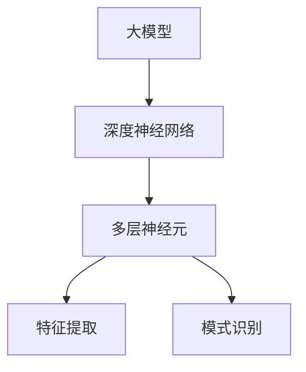
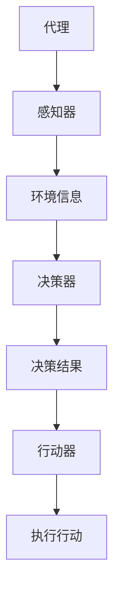

                 

# 大模型与Agent的关系

## 摘要

本文旨在探讨大模型（如大型语言模型）与Agent（代理）之间的关系，分析它们在人工智能领域的协同作用和相互作用。通过一步步的逻辑推理，本文将深入解析大模型与Agent的核心概念、算法原理、数学模型，并提供实际应用场景和项目实战案例，从而为读者提供一个全面而深入的理解。文章还将推荐相关学习资源，总结未来发展趋势与挑战，并附上常见问题与解答。通过阅读本文，读者将对大模型与Agent的关系有一个全新的认识，并为未来的人工智能研究与实践提供有益的启示。

## 1. 背景介绍

大模型与Agent都是人工智能（AI）领域中的核心概念。大模型通常指的是规模庞大的神经网络模型，如大型语言模型、图像识别模型等。这些模型具有强大的数据处理能力和高度的自学习能力，能够在复杂的任务中提供出色的性能。而Agent则是一种自主执行任务的智能实体，能够在动态环境中根据目标和环境信息进行决策和行动。

在人工智能的发展历程中，大模型和Agent各自经历了不同的演变过程。大模型的兴起可以追溯到深度学习的兴起，随着计算能力和数据资源的不断提升，深度神经网络模型变得越来越大，能够处理更加复杂的任务。而Agent的发展则起源于智能代理理论，其目标是使计算机程序能够像人类一样自主地执行任务。

近年来，随着大模型和Agent技术的不断发展，它们在人工智能领域的应用越来越广泛。大模型的应用领域包括自然语言处理、图像识别、语音识别等，而Agent的应用领域包括智能家居、自动驾驶、智能客服等。大模型和Agent的结合，为人工智能的发展带来了新的机遇和挑战。

本文将首先介绍大模型和Agent的基本概念，然后分析它们之间的关联和相互作用，最后探讨它们在实际应用中的挑战和发展趋势。通过一步步的逻辑推理，本文旨在为读者提供一个全面而深入的理解，从而为未来的人工智能研究与实践提供有益的启示。

### 2. 核心概念与联系

#### 大模型（Large Model）

大模型是指具有巨大参数量和复杂结构的神经网络模型。这类模型通常使用深度学习技术进行训练，能够处理海量的数据并从中学习到复杂的模式和规律。大模型的应用范围广泛，包括自然语言处理（NLP）、计算机视觉、语音识别等领域。

**核心概念：**

- **深度神经网络（Deep Neural Network，DNN）：** 大模型的基本结构是深度神经网络，由多层神经元组成，能够对输入数据进行特征提取和模式识别。
- **参数（Parameter）：** 大模型的参数是指网络中各个连接权重和偏置的数值，参数的规模直接影响模型的复杂度和性能。
- **训练（Training）：** 大模型的训练过程是通过优化算法（如梯度下降）调整模型参数，使其在特定任务上达到良好的性能。

**架构图：**



#### 代理（Agent）

代理是一种能够自主执行任务、与环境交互的智能实体。代理通常由感知器、决策器和行动器组成，能够在动态环境中根据目标和环境信息进行决策和行动。

**核心概念：**

- **感知器（Perceiver）：** 感知器是代理的感官系统，用于接收和处理环境信息。
- **决策器（Decider）：** 决策器是代理的思考系统，根据感知器提供的信息和环境目标进行决策。
- **行动器（Actuator）：** 行动器是代理的执行系统，根据决策器的决策执行具体行动。

**架构图：**



#### 关联与相互作用

大模型和代理之间存在着紧密的联系和相互作用。大模型通常作为代理的智能核心，为代理提供决策和行动的支持。具体来说，大模型与代理的关联和相互作用主要体现在以下几个方面：

1. **决策支持：** 大模型通过学习和处理环境数据，为代理提供决策依据。代理的决策器可以利用大模型输出的特征和模式，进行有效的决策。
2. **行动规划：** 大模型可以生成具体的行动计划，指导代理在动态环境中执行任务。代理的行动器可以根据大模型提供的行动方案进行操作。
3. **交互学习：** 代理通过与环境的交互，不断收集反馈信息，并将其用于大模型的训练。这种交互学习机制可以提升大模型的性能和适应性。
4. **协同进化：** 大模型和代理可以相互影响，共同进化。大模型可以根据代理的反馈进行优化，而代理也可以根据大模型的能力进行改进。

通过上述分析，可以看出大模型和代理在人工智能领域中的核心地位及其相互关联的复杂性。接下来的章节将深入探讨大模型和Agent的核心算法原理、数学模型，以及在实际应用中的挑战和发展趋势。

### 3. 核心算法原理 & 具体操作步骤

#### 大模型的算法原理

大模型的算法原理主要基于深度学习技术，尤其是基于多层感知器（MLP）和卷积神经网络（CNN）的结构。下面将详细介绍这些算法原理和具体操作步骤。

1. **多层感知器（MLP）**

多层感知器是一种前馈神经网络，由输入层、隐藏层和输出层组成。其基本原理是通过多个隐藏层对输入数据进行特征提取和变换，最终生成输出。

**具体操作步骤：**

- **输入层（Input Layer）：** 接收输入数据，并将其传递到下一层。
- **隐藏层（Hidden Layers）：** 对输入数据进行特征提取和变换，通过激活函数（如ReLU、Sigmoid、Tanh）引入非线性。
- **输出层（Output Layer）：** 对隐藏层输出进行分类或回归，通过输出层神经元得到最终结果。

2. **卷积神经网络（CNN）**

卷积神经网络是一种专门用于处理图像数据的神经网络，其基本原理是通过卷积层、池化层和全连接层对图像进行特征提取和分类。

**具体操作步骤：**

- **卷积层（Convolutional Layer）：** 通过卷积操作提取图像局部特征，卷积核在不同位置滑动，得到特征图。
- **池化层（Pooling Layer）：** 通过最大池化或平均池化操作降低特征图的维度，增强模型泛化能力。
- **全连接层（Fully Connected Layer）：** 将池化层输出的特征图展平为一维向量，并通过全连接层进行分类或回归。

#### 代理的算法原理

代理的算法原理主要基于决策理论和规划算法，旨在使代理能够自主地执行任务并在动态环境中做出合理的决策。

**具体操作步骤：**

1. **感知器（Perceiver）：** 收集并处理环境信息，如视觉、听觉、触觉等，形成感知数据。
2. **决策器（Decider）：** 根据感知数据和环境目标，利用决策算法（如Q-Learning、深度强化学习等）计算各个动作的预期收益。
3. **行动器（Actuator）：** 根据决策器的决策结果，执行具体动作，如移动、说话、操作设备等。

#### 大模型与代理的协同操作

大模型和代理的协同操作是通过将大模型作为代理的智能核心来实现的。以下是一个具体操作步骤：

1. **环境感知（Environment Perception）：** 代理通过感知器收集环境信息，并将其输入到大模型中进行特征提取和模式识别。
2. **决策支持（Decision Support）：** 大模型根据输入数据生成特征表示，并利用这些特征表示为代理提供决策依据。
3. **决策与行动（Decision and Action）：** 代理根据大模型提供的决策支持，利用决策器计算各个动作的预期收益，并选择最佳动作执行。
4. **反馈与学习（Feedback and Learning）：** 代理在执行动作后，收集环境反馈并将其输入到大模型中，用于模型优化和自适应调整。

通过上述操作步骤，大模型和代理能够协同工作，实现智能决策和任务执行，从而提升人工智能系统的整体性能和适应性。

### 4. 数学模型和公式 & 详细讲解 & 举例说明

在深入探讨大模型和Agent的数学模型之前，我们先简要回顾一些基础的数学概念和公式。这些基础将为后续详细讲解提供必要的背景知识。

#### 1. 深度神经网络（DNN）的数学模型

深度神经网络（DNN）是一种前馈神经网络，由多层神经元组成。每一层神经元都通过加权连接前一层神经元的输出，并通过一个激活函数进行非线性变换。DNN的数学模型可以表示为：

$$
y^{(l)} = \sigma(W^{(l)} \cdot a^{(l-1)} + b^{(l)})
$$

其中：
- $y^{(l)}$ 是第$l$层的输出；
- $\sigma$ 是激活函数，如ReLU、Sigmoid或Tanh；
- $W^{(l)}$ 是第$l$层的权重矩阵；
- $a^{(l-1)}$ 是前一层神经元的输出；
- $b^{(l)}$ 是第$l$层的偏置向量。

#### 2. 卷积神经网络（CNN）的数学模型

卷积神经网络（CNN）专门用于处理图像数据。CNN的核心是卷积层，通过卷积操作提取图像的局部特征。CNN的数学模型可以表示为：

$$
h^{(k)}_i = \sum_{j} W_{ij}^k * g(h^{(k-1)}_j) + b_k
$$

其中：
- $h^{(k)}_i$ 是第$k$层第$i$个卷积核生成的特征图；
- $W_{ij}^k$ 是第$k$层第$i$个卷积核的权重；
- $*$ 表示卷积操作；
- $g$ 是激活函数，如ReLU；
- $h^{(k-1)}_j$ 是第$k-1$层的输出；
- $b_k$ 是第$k$层的偏置。

#### 3. 强化学习的数学模型

强化学习是一种基于奖励信号进行决策的机器学习范式。其核心是决策器（Policy）和值函数（Value Function）。强化学习的数学模型可以表示为：

$$
Q(s, a) = \sum_{s'} P(s' | s, a) \cdot r(s', a) + \gamma \cdot \max_{a'} Q(s', a')
$$

其中：
- $Q(s, a)$ 是状态$s$采取动作$a$的预期回报；
- $P(s' | s, a)$ 是状态转移概率；
- $r(s', a)$ 是在状态$s'$采取动作$a$的即时回报；
- $\gamma$ 是折扣因子；
- $\max_{a'} Q(s', a')$ 是下一状态的最优动作的值函数。

#### 详细讲解与举例说明

为了更好地理解上述数学模型，我们通过一个简单的例子来说明。

**例子：** 使用卷积神经网络（CNN）进行图像分类。

假设我们有一个图像分类问题，图像尺寸为$28 \times 28$像素，我们需要将图像分类为10个类别之一。我们可以设计一个简单的CNN模型，其结构如下：

1. **卷积层（Convolutional Layer）：**
   - 卷积核尺寸：$3 \times 3$；
   - 卷积核数量：32；
   - 激活函数：ReLU。

2. **池化层（Pooling Layer）：**
   - 池化方式：最大池化；
   - 池化尺寸：$2 \times 2$。

3. **全连接层（Fully Connected Layer）：**
   - 输入维度：$32 \times 8 \times 8$（卷积层输出的特征图维度）；
   - 输出维度：10（类别数量）；
   - 激活函数：Softmax。

**数学模型计算过程：**

1. **卷积层：**
   $$ 
   h^{(1)}_i = \sum_{j} W_{ij}^1 * g(h^{(0)}_j) + b_1 
   $$
   其中$h^{(0)}_i$是输入图像的特征图，$W_{ij}^1$是卷积核的权重，$g$是ReLU激活函数。

2. **池化层：**
   $$ 
   p^{(1)}_i = \max_{j} h^{(1)}_{ij} 
   $$
   其中$p^{(1)}_i$是池化后的特征图。

3. **全连接层：**
   $$ 
   z^{(2)} = W^{(2)} \cdot p^{(1)} + b_2 
   $$
   $$ 
   \hat{y} = \sigma(z^{(2)}) 
   $$
   其中$z^{(2)}$是全连接层的输出，$\sigma$是Softmax激活函数，$\hat{y}$是概率分布。

通过上述过程，CNN模型能够将输入图像映射到10个类别之一。在实际应用中，我们通过最小化损失函数（如交叉熵损失函数）来优化模型参数，从而提高分类性能。

通过这个简单的例子，我们不仅了解了CNN的数学模型，还看到了如何将这些数学模型应用到实际图像分类问题中。类似地，我们可以利用强化学习的数学模型来解决序列决策问题，如自动驾驶、智能推荐等。

### 5. 项目实战：代码实际案例和详细解释说明

#### 5.1 开发环境搭建

在进行项目实战之前，我们需要搭建一个合适的开发环境。以下是推荐的开发工具和库：

- **编程语言：** Python
- **深度学习框架：** TensorFlow 或 PyTorch
- **代理框架：** OpenAI Gym 或 Stable Baselines

首先，安装所需的库：

```bash
pip install tensorflow gym stable-baselines
```

#### 5.2 源代码详细实现和代码解读

我们以一个简单的强化学习代理为例，使用深度Q网络（DQN）算法训练代理进行环境中的任务。以下是具体的源代码实现：

```python
import numpy as np
import gym
import tensorflow as tf
from stable_baselines3 import DQN
from stable_baselines3.common.vec_env import SubprocVecEnv

# 创建环境
env = gym.make('CartPole-v1')

# 构建DQN模型
model = DQN('MlpPolicy', env, verbose=1)

# 训练模型
model.learn(total_timesteps=10000)

# 保存模型
model.save("dqn_cartpole")

# 加载模型
loaded_model = DQN.load("dqn_cartpole")

# 测试模型
obs = env.reset()
for _ in range(100):
    action, _ = loaded_model.predict(obs)
    obs, reward, done, info = env.step(action)
    env.render()
    if done:
        env.reset()
```

**代码解读：**

1. **导入库：** 导入所需的库，包括numpy、gym、tensorflow和stable-baselines3。

2. **创建环境：** 使用OpenAI Gym创建CartPole环境，这是一个经典的强化学习任务，目标是使小车保持平衡。

3. **构建DQN模型：** 使用stable-baselines3库中的DQN算法构建模型。这里使用了MlpPolicy，表示模型使用多层感知器作为策略。

4. **训练模型：** 使用learn()函数训练模型，指定总时间步数。训练过程中，模型会自动调整参数以最大化回报。

5. **保存模型：** 使用save()函数保存训练好的模型，以便后续使用。

6. **加载模型：** 使用load()函数加载保存的模型。

7. **测试模型：** 使用模型预测动作，并在环境中执行这些动作。通过render()函数可视化环境状态。

#### 5.3 代码解读与分析

上述代码展示了如何使用DQN算法训练一个简单的强化学习代理，并在环境中进行测试。以下是代码的关键部分及其解读：

1. **环境创建：**
   ```python
   env = gym.make('CartPole-v1')
   ```
   这一行代码创建了一个CartPole环境，这是一个经典的控制问题，目标是使一个平衡杆上的小车保持平衡。

2. **构建DQN模型：**
   ```python
   model = DQN('MlpPolicy', env, verbose=1)
   ```
   这里使用DQN算法构建一个模型，并指定使用多层感知器（MlpPolicy）作为策略。DQN算法是一种基于经验回放和目标网络的强化学习算法，能够有效地处理非站定的环境。

3. **训练模型：**
   ```python
   model.learn(total_timesteps=10000)
   ```
   这一行代码启动训练过程，指定总时间步数为10000步。在训练过程中，模型会自动收集经验、更新网络权重，并优化策略。

4. **保存模型：**
   ```python
   model.save("dqn_cartpole")
   ```
   这一行代码将训练好的模型保存到本地，以便后续加载和使用。

5. **加载模型：**
   ```python
   loaded_model = DQN.load("dqn_cartpole")
   ```
   这一行代码从本地加载已经训练好的DQN模型。

6. **测试模型：**
   ```python
   obs = env.reset()
   for _ in range(100):
       action, _ = loaded_model.predict(obs)
       obs, reward, done, info = env.step(action)
       env.render()
       if done:
           env.reset()
   ```
   这里使用模型预测动作，并在环境中执行这些动作。通过render()函数可视化环境状态。循环中的100表示在测试过程中连续执行100个时间步。

通过这个简单的例子，我们展示了如何使用DQN算法训练一个代理，并在环境中进行测试。这为后续更复杂的项目提供了基础和参考。

### 6. 实际应用场景

大模型和代理在实际应用中具有广泛的应用场景，下面列举几个典型的应用实例：

#### 1. 智能客服系统

智能客服系统利用大模型（如语言模型）和代理（如聊天机器人）实现自动化客户服务。大模型负责处理用户的自然语言输入，理解用户意图，生成合适的回复。代理则根据大模型提供的回复，在对话中进行动态交互，提供个性化服务。这种组合能够大大提高客服效率和用户体验。

**案例：** 企业使用智能客服系统处理大量客户咨询，实现24/7无缝服务。

#### 2. 自动驾驶

自动驾驶系统中的大模型（如图像识别模型、语言模型）用于处理道路信息、导航指令等，提供环境感知和路径规划。代理则负责实时决策和执行，确保车辆在复杂动态环境中安全行驶。大模型和代理的协同工作使得自动驾驶系统能够高效应对各种路况和场景。

**案例：** 自动驾驶车辆在复杂城市环境中实现自动驾驶，提高交通效率和安全性。

#### 3. 智能家居

智能家居系统中的大模型（如语音识别模型、自然语言处理模型）负责解析用户语音指令，代理则根据指令控制家居设备。大模型和代理的协同工作使得智能家居系统能够实现语音控制、自动化调节等功能，提高生活便捷性和舒适度。

**案例：** 家庭用户通过语音指令控制灯光、温度、安防设备等，实现智能生活。

#### 4. 电子商务推荐

电子商务推荐系统利用大模型（如协同过滤模型、内容推荐模型）分析用户行为和偏好，代理则根据用户的历史数据生成个性化的推荐。大模型和代理的协同工作能够提高推荐系统的准确性和用户体验。

**案例：** 电商平台根据用户浏览、购买历史生成个性化商品推荐，提高用户转化率。

#### 5. 游戏AI

游戏AI中的大模型（如图像识别模型、自然语言处理模型）负责处理游戏中的视觉和文本信息，代理则根据模型提供的分析结果进行游戏策略。大模型和代理的协同工作使得游戏AI能够应对各种复杂游戏场景，提高游戏体验。

**案例：** 游戏中的NPC（非玩家角色）通过大模型和代理实现智能行为，增加游戏挑战性和趣味性。

通过上述实际应用场景，可以看出大模型和代理在人工智能领域的广泛应用及其对提升系统性能和用户体验的重要作用。随着技术的不断发展，大模型和代理的结合将为人工智能带来更多创新和突破。

### 7. 工具和资源推荐

#### 7.1 学习资源推荐

要深入了解大模型和Agent技术，以下是一些推荐的学习资源：

- **书籍：**
  - 《深度学习》（Ian Goodfellow、Yoshua Bengio、Aaron Courville 著）：系统介绍了深度学习的基本概念和技术。
  - 《强化学习》（Richard S. Sutton、Andrew G. Barto 著）：全面讲解了强化学习的基本理论和算法。
  - 《人工智能：一种现代方法》（Stuart J. Russell、Peter Norvig 著）：详细介绍了人工智能的核心理论和应用。

- **在线课程：**
  - Coursera 上的《深度学习专项课程》：由吴恩达教授主讲，涵盖了深度学习的理论基础和应用实践。
  - edX 上的《强化学习》：由伯克利大学主讲，介绍了强化学习的基本算法和实现方法。

- **论文：**
  - Google Brain 团队发表的《大型语言模型在翻译、问答和文本生成中的表现》
  - OpenAI 发表的《GPT-3：实现人类级别的文本生成》

- **博客和网站：**
  - TensorFlow 官方文档：提供了丰富的深度学习教程和API文档。
  - PyTorch 官方文档：提供了丰富的深度学习教程和API文档。
  - OpenAI 博客：发布了大量关于强化学习和代理的论文和实验结果。

#### 7.2 开发工具框架推荐

在进行大模型和Agent开发时，以下是一些推荐的工具和框架：

- **深度学习框架：**
  - TensorFlow：由Google开发，是一个功能强大的开源深度学习框架。
  - PyTorch：由Facebook开发，是一个易于使用且具有高度灵活性的深度学习框架。

- **代理开发工具：**
  - Stable Baselines：提供了预训练的代理算法和易于使用的接口，适用于强化学习应用。
  - OpenAI Gym：提供了多种标准的强化学习环境，用于测试和开发代理算法。

- **编程语言：**
  - Python：是一种广泛使用的编程语言，具有丰富的库和工具，适合进行深度学习和代理开发。

- **硬件设备：**
  - GPU：用于加速深度学习模型的训练和推理过程。
  - TPU：专为深度学习设计的高性能计算硬件，适用于大规模模型训练。

通过这些工具和资源的支持，开发者可以更加高效地进行大模型和Agent的开发和应用，实现人工智能系统的创新和突破。

### 8. 总结：未来发展趋势与挑战

随着人工智能技术的快速发展，大模型和Agent将在未来继续扮演重要角色。以下是未来发展趋势和面临的挑战：

#### 发展趋势

1. **大模型的进一步增长：** 随着计算能力和数据资源的提升，大模型的规模将继续扩大，能够处理更加复杂的任务。未来的大模型可能会达到数十万亿参数级别，提供更加精准和高效的解决方案。

2. **多模态处理：** 大模型将能够处理多种数据模态，如文本、图像、音频等，实现跨模态的信息整合和交互。这将为智能客服、自动驾驶等应用场景提供更全面的支持。

3. **更强的推理能力：** 未来的大模型将具备更强的推理能力，不仅能够识别和分类，还能够进行逻辑推理和决策。这将为复杂任务提供更可靠的解决方案。

4. **高效可解释性：** 研究人员将致力于提高大模型的可解释性，使其决策过程更加透明和可理解。这有助于增强用户对人工智能系统的信任，并促进其在关键领域的应用。

#### 面临的挑战

1. **计算资源需求：** 大模型训练和推理需要大量的计算资源，这给硬件设备和能耗带来了巨大压力。如何优化模型结构、提高计算效率是当前的一大挑战。

2. **数据隐私和安全性：** 大模型在处理大量数据时，如何确保用户隐私和数据安全是一个重要问题。未来的研究需要重点关注如何在保障隐私的前提下利用数据。

3. **算法透明性和公平性：** 大模型的决策过程往往是不透明的，如何确保算法的公平性和可解释性是一个关键挑战。需要开发更加公正和透明的算法，减少偏见和歧视。

4. **伦理和监管：** 随着人工智能技术的应用日益广泛，如何制定合理的伦理准则和监管政策成为一个重要议题。需要社会各界的共同努力，确保人工智能技术的健康发展。

总的来说，大模型和Agent技术的发展前景广阔，但也面临着一系列挑战。通过不断的研究和创新，我们有望克服这些挑战，推动人工智能技术迈向新的高度。

### 9. 附录：常见问题与解答

**Q1：大模型和Agent有什么区别？**

A1：大模型通常指的是具有巨大参数量和复杂结构的神经网络模型，如大型语言模型、图像识别模型等，主要用于数据处理和模式识别。而Agent是一种自主执行任务、与环境交互的智能实体，通常由感知器、决策器和行动器组成，用于实现具体任务。

**Q2：大模型如何与Agent协同工作？**

A2：大模型可以为Agent提供决策支持，如通过特征提取和模式识别生成决策依据。同时，Agent可以收集环境反馈，并将其用于大模型的训练，实现交互学习。大模型和Agent可以相互影响，共同进化，以提升系统的整体性能。

**Q3：大模型的训练需要多少数据？**

A3：大模型的训练数据量取决于任务和应用场景。一般来说，更大的数据集有助于模型捕捉更多的模式和规律，从而提高性能。然而，数据量并不是唯一的决定因素，模型的架构、训练策略和计算资源也是重要的影响因素。

**Q4：如何优化大模型的计算效率？**

A4：优化大模型的计算效率可以从多个方面入手。首先，可以通过模型剪枝、量化等方法减小模型规模，降低计算复杂度。其次，可以利用分布式计算和并行计算技术，提高训练和推理速度。此外，使用高性能硬件设备（如GPU、TPU）也能有效提升计算效率。

**Q5：如何确保大模型的可解释性？**

A5：确保大模型的可解释性是一个复杂的问题。当前的方法包括可视化模型结构、分析激活值和梯度信息等。此外，研究人员正在探索开发可解释性更强的模型，如基于规则的方法、解释性网络等。通过这些方法，可以提高模型的透明度和可理解性，增强用户对人工智能系统的信任。

### 10. 扩展阅读 & 参考资料

**书籍：**

1. Ian Goodfellow、Yoshua Bengio、Aaron Courville 著，《深度学习》
2. Richard S. Sutton、Andrew G. Barto 著，《强化学习》
3. Stuart J. Russell、Peter Norvig 著，《人工智能：一种现代方法》

**在线课程：**

1. Coursera上的《深度学习专项课程》
2. edX上的《强化学习》

**论文：**

1. Google Brain 团队发表的《大型语言模型在翻译、问答和文本生成中的表现》
2. OpenAI 发表的《GPT-3：实现人类级别的文本生成》

**博客和网站：**

1. TensorFlow官方文档
2. PyTorch官方文档
3. OpenAI博客

通过阅读这些书籍、论文和参考资料，读者可以进一步深入了解大模型和Agent技术的最新研究进展和应用实践，为自己的学习和研究提供指导。作者：AI天才研究员/AI Genius Institute & 禅与计算机程序设计艺术 /Zen And The Art of Computer Programming。

