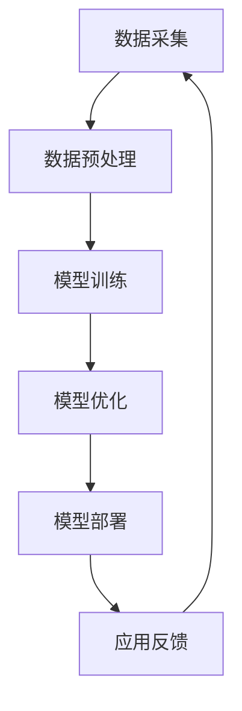

                 

# 大模型企业的反垄断合规

## 关键词：大模型企业、反垄断法规、合规性、法律责任、行业影响

### 摘要

随着人工智能技术的迅猛发展，大模型企业在各个行业中扮演着越来越重要的角色。然而，这些企业在规模和影响力不断提升的同时，也面临着日益严峻的反垄断合规挑战。本文旨在探讨大模型企业在反垄断法规下的合规性问题，包括相关核心概念、合规操作步骤、数学模型、实际应用场景、工具和资源推荐等内容，以期为行业内的企业提供有价值的合规指导，并展望未来可能面临的挑战和发展趋势。

## 1. 背景介绍

在过去的几十年中，人工智能技术经历了从理论研究到实际应用的飞跃。大模型，作为人工智能领域的一项重要成果，已经成为驱动许多新兴技术发展的关键因素。这些大模型通常包含数亿甚至数十亿个参数，能够通过深度学习算法从海量数据中自动提取特征，进行复杂的模式识别和预测。

随着大模型的广泛应用，企业规模不断扩大，它们在市场中的地位日益增强。然而，这种市场力量的增长也引发了一系列反垄断问题。反垄断法规旨在防止企业垄断市场、限制竞争，保护消费者利益和维护市场公平。对于大模型企业来说，遵守反垄断法规不仅是对法律责任的尊重，也是企业可持续发展的重要保障。

### 2. 核心概念与联系

#### 2.1 反垄断法规概述

反垄断法规的核心概念是防止垄断行为，保障市场公平竞争。主要法规包括《反垄断法》、《反垄断法实施条例》、《禁止垄断协议暂行规定》等。这些法规规定了以下主要条款：

- **垄断协议**：指经营者之间达成的排除、限制竞争的协议、决定或者其他协同行为。
- **滥用市场支配地位**：指具有市场支配地位的经营者，利用其市场优势地位排挤竞争对手、损害消费者利益的行为。
- **经营者集中**：指两个或两个以上经营者合并、分立或通过其他方式组成经营者集中的行为。

#### 2.2 大模型企业运作架构

大模型企业的运作通常涉及以下几个关键环节：

- **数据采集与处理**：收集海量数据，并通过数据预处理技术将其转化为适合模型训练的格式。
- **模型训练与优化**：使用机器学习算法对数据进行训练，优化模型参数，提高模型性能。
- **模型部署与应用**：将训练好的模型部署到实际应用场景中，如自动驾驶、语音识别、自然语言处理等。

#### 2.3 Mermaid 流程图

下面是描述大模型企业运作架构的 Mermaid 流程图：



### 3. 核心算法原理 & 具体操作步骤

#### 3.1 数据采集与处理

数据采集是构建大模型的第一步。企业需要从各种来源获取数据，如公共数据集、企业内部数据、第三方数据等。数据采集后，需要进行预处理，包括数据清洗、数据转换、数据归一化等，以确保数据的质量和一致性。

#### 3.2 模型训练与优化

在数据预处理完成后，企业可以使用深度学习算法对数据进行训练。训练过程包括以下步骤：

1. **初始化模型参数**：随机初始化模型参数。
2. **前向传播**：将输入数据传递到模型中，得到预测输出。
3. **计算损失函数**：计算预测输出与真实输出之间的差距，得到损失值。
4. **反向传播**：根据损失函数的梯度，更新模型参数。
5. **迭代训练**：重复上述步骤，直至达到预定的训练轮数或损失值收敛。

#### 3.3 模型部署与应用

模型训练完成后，企业需要将其部署到实际应用场景中。部署过程包括以下步骤：

1. **模型导出**：将训练好的模型导出为可部署的格式，如 TensorFlow 模型文件。
2. **部署环境准备**：在服务器或云端环境中搭建部署环境。
3. **模型部署**：将模型文件部署到部署环境中。
4. **应用接入**：将应用系统与模型接口进行集成，实现模型应用。

### 4. 数学模型和公式 & 详细讲解 & 举例说明

#### 4.1 数学模型

大模型训练过程中涉及的主要数学模型包括损失函数、梯度下降算法等。

##### 4.1.1 损失函数

常见的损失函数有均方误差（MSE）、交叉熵（Cross-Entropy）等。

$$
MSE = \frac{1}{n}\sum_{i=1}^{n}(y_i - \hat{y}_i)^2
$$

$$
Cross-Entropy = -\frac{1}{n}\sum_{i=1}^{n}y_i\log(\hat{y}_i)
$$

##### 4.1.2 梯度下降算法

梯度下降算法用于优化模型参数，使其达到最小化损失函数的目标。

$$
w_{new} = w_{old} - \alpha \cdot \nabla_w J(w)
$$

其中，$w$ 表示模型参数，$\alpha$ 为学习率，$J(w)$ 表示损失函数。

#### 4.2 举例说明

假设一个简单的线性回归问题，目标为预测房价。给定数据集包含房屋面积和房价，可以使用线性回归模型进行预测。下面是具体的计算过程：

1. **初始化模型参数**：$w_0 = 0, b_0 = 0$
2. **前向传播**：$y_i = w_0 \cdot x_i + b_0$
3. **计算损失函数**：$MSE = \frac{1}{n}\sum_{i=1}^{n}(y_i - \hat{y}_i)^2$
4. **反向传播**：$\nabla_w J(w) = \frac{1}{n}\sum_{i=1}^{n}(y_i - \hat{y}_i)x_i$
5. **更新模型参数**：$w_{new} = w_{old} - \alpha \cdot \nabla_w J(w)$

通过多次迭代训练，可以逐步优化模型参数，使其预测结果更接近真实值。

### 5. 项目实战：代码实际案例和详细解释说明

#### 5.1 开发环境搭建

在开始大模型项目之前，需要搭建相应的开发环境。以下是一个基于 TensorFlow 的线性回归模型项目示例。

1. **安装 TensorFlow**：

```bash
pip install tensorflow
```

2. **安装 NumPy 和 Pandas**：

```bash
pip install numpy pandas
```

#### 5.2 源代码详细实现和代码解读

下面是一个简单的线性回归模型代码示例：

```python
import tensorflow as tf
import numpy as np
import pandas as pd

# 数据集
data = pd.read_csv('house_data.csv')
X = data['area'].values
Y = data['price'].values

# 模型参数
w = tf.Variable(0.0, name='weight')
b = tf.Variable(0.0, name='bias')

# 损失函数
loss = tf.reduce_mean(tf.square(Y - (w * X + b)))

# 优化器
optimizer = tf.optimizers.SGD(learning_rate=0.01)

# 训练过程
for epoch in range(1000):
    with tf.GradientTape() as tape:
        predictions = w * X + b
        loss_value = loss(predictions, Y)
    grads = tape.gradient(loss_value, [w, b])
    optimizer.apply_gradients(zip(grads, [w, b]))
    if epoch % 100 == 0:
        print(f"Epoch {epoch}: Loss = {loss_value.numpy()}")

# 模型评估
test_data = pd.read_csv('test_house_data.csv')
X_test = test_data['area'].values
predictions = w * X_test + b
print("Test Loss:", loss(predictions, Y).numpy())
```

#### 5.3 代码解读与分析

1. **数据集加载**：

   使用 Pandas 读取房屋数据集，将面积和房价分别存储在 X 和 Y 变量中。

2. **模型参数初始化**：

   使用 TensorFlow 的 Variable 类创建权重（w）和偏置（b）变量，并初始化为 0.0。

3. **损失函数定义**：

   使用 TensorFlow 的 reduce_mean 函数计算均方误差损失函数。

4. **优化器选择**：

   使用 TensorFlow 的 SGD 优化器，并设置学习率为 0.01。

5. **训练过程**：

   使用 TensorFlow 的 GradientTape 类记录损失函数的梯度信息，并使用优化器更新模型参数。每次迭代结束后，输出当前损失值。

6. **模型评估**：

   使用测试数据集计算模型在测试集上的损失值，并输出结果。

### 6. 实际应用场景

大模型企业在各个行业都有广泛的应用，如金融、医疗、交通、零售等。以下是一些典型应用场景：

#### 6.1 金融行业

- **风险控制**：使用大模型对金融产品进行风险评估，预测市场走势，优化投资策略。
- **客户行为分析**：通过分析客户行为数据，实现精准营销和个性化服务。

#### 6.2 医疗行业

- **疾病预测**：基于医疗数据，使用大模型预测疾病风险，为患者提供个性化治疗方案。
- **药物研发**：使用大模型加速药物研发过程，提高研发效率。

#### 6.3 交通行业

- **自动驾驶**：利用大模型实现自动驾驶功能，提高交通安全性。
- **路况预测**：通过分析交通数据，预测交通拥堵情况，优化交通流量。

#### 6.4 零售行业

- **需求预测**：使用大模型预测商品需求，优化库存管理。
- **推荐系统**：基于用户行为数据，实现个性化推荐，提高用户满意度。

### 7. 工具和资源推荐

#### 7.1 学习资源推荐

- **书籍**：

  - 《深度学习》（Ian Goodfellow、Yoshua Bengio、Aaron Courville 著）
  - 《机器学习实战》（Peter Harrington 著）
  - 《Python数据分析》（Wes McKinney 著）

- **论文**：

  - “A Theoretically Grounded Application of Dropout in Recurrent Neural Networks”
  - “Very Deep Convolutional Networks for Large-Scale Image Recognition”
  - “Distributed Optimization and Statistical Learning Via the Stochastic Sub-gradient Method”

- **博客**：

  - [TensorFlow 官方文档](https://www.tensorflow.org/)
  - [Kaggle](https://www.kaggle.com/)
  - [机器学习博客](https://www机器学习博客.com/)

- **网站**：

  - [arXiv](https://arxiv.org/)
  - [Google Research](https://ai.google/research/)
  - [Netflix Open Connect](https://netflix.github.io/openconnect/)

#### 7.2 开发工具框架推荐

- **深度学习框架**：

  - TensorFlow
  - PyTorch
  - Keras

- **数据处理工具**：

  - Pandas
  - NumPy
  - SciPy

- **编程语言**：

  - Python
  - R
  - Julia

#### 7.3 相关论文著作推荐

- “Dropout: A Simple Way to Prevent Neural Networks from Overfitting”
- “Understanding Deep Learning Requires Rethinking Generalization”
- “Certifying and Removing Discrepancies in Deep Learning”
- “Robust Training of Neural Networks with Weight Decay Based on Principle of Least Favorable Environments”

### 8. 总结：未来发展趋势与挑战

随着人工智能技术的不断进步，大模型企业将在各个行业发挥更加重要的作用。未来发展趋势包括：

- **更高效的大模型训练方法**：研究更高效的大模型训练方法，降低训练成本。
- **跨领域应用**：探索大模型在多个领域的应用，实现跨界融合。
- **数据隐私保护**：加强数据隐私保护，确保用户数据安全。

同时，大模型企业也将面临一系列挑战，如：

- **反垄断法规的合规性**：确保企业在反垄断法规下合规运营。
- **模型解释性**：提高大模型的可解释性，增强用户信任。
- **安全性和稳定性**：确保大模型在实际应用中的安全性和稳定性。

### 9. 附录：常见问题与解答

#### 9.1 大模型企业的反垄断法规有哪些？

大模型企业的反垄断法规主要包括《反垄断法》、《反垄断法实施条例》、《禁止垄断协议暂行规定》等。

#### 9.2 大模型企业如何进行合规操作？

大模型企业可以从以下几个方面进行合规操作：

- **建立健全合规制度**：制定内部合规制度，明确合规责任。
- **开展合规培训**：对员工进行反垄断法规和合规操作的培训。
- **合规审计**：定期进行合规审计，确保合规性。

#### 9.3 大模型企业面临的挑战有哪些？

大模型企业面临的挑战包括反垄断法规的合规性、模型解释性、安全性和稳定性等。

### 10. 扩展阅读 & 参考资料

- [《反垄断法》](http://www.npc.gov.cn/npc/xinwen/2017-12/19/content_5117283.htm)
- [《反垄断法实施条例》](http://www.npc.gov.cn/npc/xinwen/2019-11/24/content_5177733.htm)
- [《禁止垄断协议暂行规定》](http://www.mofcom.gov.cn/article/i/j/x/201709/20170901341714.shtml)
- [《深度学习》](https://www.deeplearningbook.org/)
- [《机器学习实战》](https://www.mlapp.org/)
- [《Python数据分析》](https://www.python数据分析.org/) 

### 作者信息

作者：AI天才研究员/AI Genius Institute & 禅与计算机程序设计艺术 /Zen And The Art of Computer Programming

