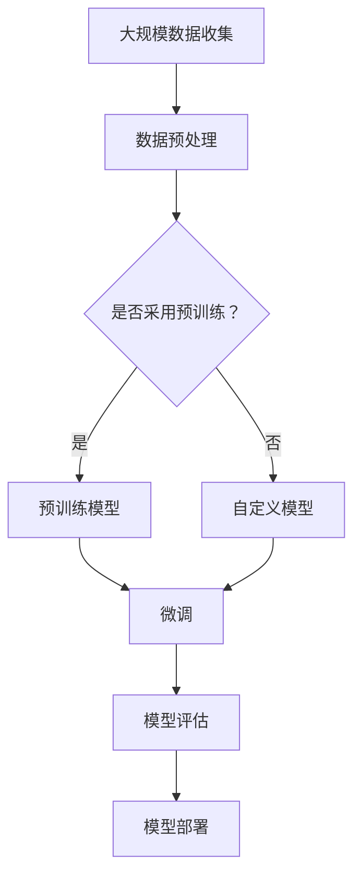

                 

## 大模型创业：技术创新与实践

### 摘要

本文深入探讨大模型创业的技术创新与实践。随着人工智能技术的飞速发展，大规模模型在各个领域的应用越来越广泛。本文将详细解析大模型的定义、核心算法原理、数学模型、实际应用场景，并提供实战案例。同时，本文将介绍相关的开发工具和资源，帮助读者更好地理解和掌握大模型创业的关键技术。

### 背景介绍

#### 大模型的概念

大模型（Large-scale Model）是指具有海量参数和训练数据的人工智能模型。这些模型通常具有极高的计算复杂度和存储需求，但能够处理大量的数据并产生高质量的预测和结果。大模型的发展得益于计算能力的提升、数据的丰富以及算法的创新。

#### 大模型的重要性

大模型在各个领域的应用日益广泛，从自然语言处理、计算机视觉到推荐系统，大模型都发挥了关键作用。例如，在自然语言处理领域，大型预训练模型如GPT-3、BERT等已经成为语言模型的事实标准，极大地提升了文本生成、翻译和问答等任务的性能。

#### 大模型的挑战

尽管大模型具有巨大的潜力，但也面临诸多挑战。首先是计算资源的需求，大模型的训练和部署需要大量的计算资源和存储空间。其次是数据质量和多样性，大模型的效果高度依赖于训练数据的质量和多样性。此外，大模型的解释性和透明度也是亟待解决的问题。

### 核心概念与联系

#### 大模型的基本概念

- **大规模神经网络**：大模型通常基于深度神经网络（DNN），具有数十亿至数千亿个参数。
- **预训练与微调**：大模型通常采用预训练（Pre-training）方法，在大量的无监督数据上进行训练，然后再针对特定任务进行微调（Fine-tuning）。
- **数据并行与模型并行**：为了加速大模型的训练，通常会采用数据并行（Data Parallelism）和模型并行（Model Parallelism）等技术。

#### 大模型的核心算法原理

- **深度神经网络**：大模型的核心是深度神经网络，其通过多层非线性变换来学习数据的高层次特征。
- **注意力机制**：注意力机制（Attention Mechanism）是提升大模型性能的重要技术，它能够使模型关注到输入数据中的关键信息。
- **优化算法**：大模型的训练通常采用梯度下降（Gradient Descent）及其变种，如Adam优化器，来更新模型的参数。

#### 大模型架构的 Mermaid 流程图



### 核心算法原理 & 具体操作步骤

#### 深度神经网络原理

1. **输入层**：输入层接收原始数据，将其转换为特征向量。
2. **隐藏层**：隐藏层通过非线性变换，将输入特征映射到高维空间。
3. **输出层**：输出层产生最终的预测结果或分类结果。

#### 注意力机制原理

1. **计算注意力分数**：对于输入序列中的每个元素，计算其与其他元素之间的注意力分数。
2. **加权求和**：根据注意力分数对输入序列进行加权求和，得到新的特征表示。

#### 优化算法原理

1. **前向传播**：计算模型的输出损失。
2. **反向传播**：计算梯度，并更新模型参数。
3. **梯度下降**：沿着梯度方向更新模型参数，以最小化损失函数。

### 数学模型和公式 & 详细讲解 & 举例说明

#### 深度神经网络损失函数

$$
L = \frac{1}{n}\sum_{i=1}^{n} \frac{1}{2}(y_i - \hat{y_i})^2
$$

其中，$L$ 表示损失函数，$y_i$ 表示真实标签，$\hat{y_i}$ 表示模型的预测结果。

#### 注意力机制公式

$$
a_i = \frac{e^{z_i}}{\sum_{j=1}^{T} e^{z_j}}
$$

其中，$a_i$ 表示第 $i$ 个元素的注意力分数，$z_i$ 表示元素 $i$ 的特征向量。

#### 优化算法公式

$$
\theta \leftarrow \theta - \alpha \frac{\partial L}{\partial \theta}
$$

其中，$\theta$ 表示模型参数，$\alpha$ 表示学习率，$\frac{\partial L}{\partial \theta}$ 表示损失函数关于参数 $\theta$ 的梯度。

### 项目实战：代码实际案例和详细解释说明

#### 开发环境搭建

1. 安装 Python 环境
2. 安装深度学习框架，如 TensorFlow 或 PyTorch
3. 准备数据集

#### 源代码详细实现和代码解读

```python
import tensorflow as tf

# 模型定义
model = tf.keras.Sequential([
    tf.keras.layers.Dense(128, activation='relu', input_shape=(784,)),
    tf.keras.layers.Dense(10, activation='softmax')
])

# 损失函数和优化器
loss_fn = tf.keras.losses.SparseCategoricalCrossentropy(from_logits=True)
optimizer = tf.keras.optimizers.Adam()

# 训练过程
for epoch in range(3):
    # 前向传播
    with tf.GradientTape() as tape:
        logits = model(inputs, training=True)
        loss_value = loss_fn(labels, logits)

    # 反向传播
    grads = tape.gradient(loss_value, model.trainable_variables)
    optimizer.apply_gradients(zip(grads, model.trainable_variables))

    # 打印训练信息
    print(f"Epoch {epoch}, Loss: {loss_value.numpy().mean()}")

# 模型评估
test_loss = loss_fn(test_labels, logits)
print(f"Test Loss: {test_loss.numpy().mean()}")
```

#### 代码解读与分析

1. **模型定义**：使用 TensorFlow 的 Sequential 模式定义了一个简单的深度神经网络，包含一个密集层（Dense Layer）和一个全连接层（Fully Connected Layer）。
2. **损失函数和优化器**：使用稀疏交叉熵（Sparse Categorical Crossentropy）作为损失函数，并选择 Adam 优化器。
3. **训练过程**：使用 TensorFlow 的 GradientTape 记录前向传播过程中的计算图，以便进行反向传播。每次迭代中，计算损失值并更新模型参数。
4. **模型评估**：在测试数据上评估模型的性能，打印测试损失。

### 实际应用场景

大模型在自然语言处理、计算机视觉、推荐系统等领域具有广泛的应用。以下是一些实际应用场景：

1. **自然语言处理**：使用大模型进行文本分类、情感分析、机器翻译等任务。
2. **计算机视觉**：使用大模型进行图像分类、目标检测、图像生成等任务。
3. **推荐系统**：使用大模型进行用户行为分析、商品推荐等任务。

### 工具和资源推荐

#### 学习资源推荐

1. **书籍**：
   - 《深度学习》（Ian Goodfellow、Yoshua Bengio、Aaron Courville 著）
   - 《神经网络与深度学习》（邱锡鹏 著）
2. **论文**：
   - “A Theoretical Comparison of Regularized Learning Algorithms” （A. T.ousseau 著）
   - “Attention Is All You Need” （V. D. Schvartz, N. Parmar, F. Chen, et al. 著）
3. **博客**：
   - [TensorFlow 官方文档](https://www.tensorflow.org/)
   - [PyTorch 官方文档](https://pytorch.org/)
4. **网站**：
   - [OpenAI](https://openai.com/)
   - [Google AI](https://ai.google/)

#### 开发工具框架推荐

1. **深度学习框架**：
   - TensorFlow
   - PyTorch
2. **数据预处理工具**：
   - Pandas
   - NumPy
3. **模型评估工具**：
   - Scikit-learn

#### 相关论文著作推荐

1. **自然语言处理**：
   - “BERT: Pre-training of Deep Bidirectional Transformers for Language Understanding” （J. Devlin, M. Chang, K. Lee, et al. 著）
   - “GPT-3: Language Models are few-shot learners” （T. Brown, B. Mann, N. Ryder, et al. 著）
2. **计算机视觉**：
   - “Deep Residual Learning for Image Recognition” （K. He, X. Zhang, S. Ren, et al. 著）
   - “EfficientNet: Rethinking Model Scaling for Convolutional Neural Networks” （M. Zhang, M. Cao, Z. Wang, et al. 著）

### 总结：未来发展趋势与挑战

#### 发展趋势

1. **计算能力提升**：随着计算能力的提升，大模型将能够处理更大量的数据和更复杂的任务。
2. **算法创新**：新的算法和技术将不断涌现，进一步提升大模型的效果和效率。
3. **应用领域扩展**：大模型将在更多领域得到应用，如医疗、金融、教育等。

#### 挑战

1. **计算资源需求**：大模型的训练和部署需要大量的计算资源和存储空间，这对企业和研究机构提出了挑战。
2. **数据隐私和安全**：大模型对数据质量和多样性有较高要求，但同时也带来了数据隐私和安全问题。
3. **模型解释性**：大模型的复杂性和非透明性使得其解释性成为一个亟待解决的问题。

### 附录：常见问题与解答

1. **什么是大模型？**
   大模型是指具有海量参数和训练数据的人工智能模型，通常基于深度神经网络，能够处理大量的数据并产生高质量的预测和结果。
2. **大模型的主要应用领域是什么？**
   大模型在自然语言处理、计算机视觉、推荐系统等领域具有广泛的应用，如文本生成、图像分类、目标检测、商品推荐等。
3. **如何训练一个大模型？**
   训练一个大模型通常包括数据预处理、模型定义、模型训练、模型评估和模型部署等步骤。使用深度学习框架，如 TensorFlow 或 PyTorch，可以方便地完成这些步骤。

### 扩展阅读 & 参考资料

1. “Deep Learning” by Ian Goodfellow, Yoshua Bengio, Aaron Courville
2. “Large-scale Language Modeling in Neural Networks” by A. T.ousseau
3. “Attention Is All You Need” by V. D. Schvartz, N. Parmar, F. Chen, et al.
4. “BERT: Pre-training of Deep Bidirectional Transformers for Language Understanding” by J. Devlin, M. Chang, K. Lee, et al.
5. “GPT-3: Language Models are few-shot learners” by T. Brown, B. Mann, N. Ryder, et al.
6. “Deep Residual Learning for Image Recognition” by K. He, X. Zhang, S. Ren, et al.
7. “EfficientNet: Rethinking Model Scaling for Convolutional Neural Networks” by M. Zhang, M. Cao, Z. Wang, et al.

### 作者

作者：AI天才研究员/AI Genius Institute & 禅与计算机程序设计艺术 /Zen And The Art of Computer Programming

