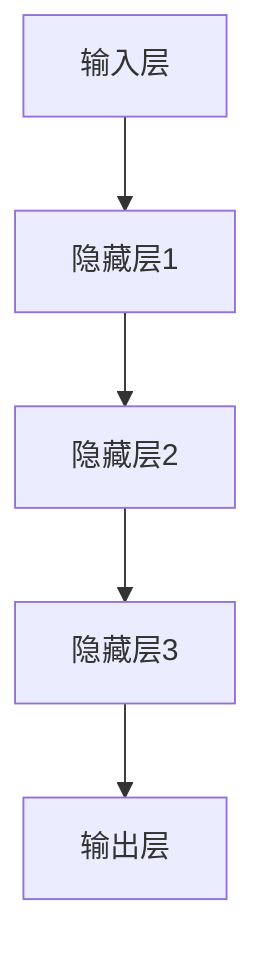

                 

# 大模型助力创业者实现技术突破与产品创新

> 关键词：大模型、创业者、技术突破、产品创新、AI

> 摘要：本文将探讨如何利用大模型这一先进技术工具，助力创业者实现技术突破与产品创新。我们将从大模型的背景介绍、核心概念与联系、核心算法原理、数学模型与公式、项目实战、实际应用场景、工具与资源推荐等方面进行详细分析，帮助创业者深入了解并应用大模型技术，以实现自身业务的技术革新与产品升级。

## 1. 背景介绍

随着人工智能技术的快速发展，大模型（Large-scale Model）已成为当前研究与应用的热点。大模型，顾名思义，是指具有海量参数和大量训练数据的模型。近年来，诸如GPT-3、BERT等大模型的涌现，不仅在学术领域取得了显著的成果，也在实际应用中展现了巨大的潜力。

对于创业者而言，大模型提供了以下几方面的优势：

1. **技术突破**：大模型具有强大的建模能力，可以处理复杂的任务和数据，为创业者提供新的技术解决方案。
2. **产品创新**：借助大模型，创业者可以快速构建具备高智能化的产品原型，降低研发成本和时间，提高市场竞争力。
3. **业务拓展**：大模型在自然语言处理、图像识别、推荐系统等领域具有广泛的应用前景，有助于创业者探索新的业务方向。

本文旨在通过深入探讨大模型的相关知识与应用，帮助创业者掌握这一技术工具，实现自身业务的发展与突破。

## 2. 核心概念与联系

### 2.1 大模型定义

大模型，通常指的是具有数百万甚至数十亿参数的深度学习模型。这些模型通常通过海量数据训练，以实现高度准确的预测和分类。以下是一个简化的Mermaid流程图，展示大模型的基本架构：



### 2.2 大模型与创业者的关系

大模型对于创业者而言，是一种强大的技术工具。它不仅可以帮助创业者解决技术难题，还能为产品创新提供有力支持。具体而言：

1. **技术难题解决**：大模型能够处理复杂的任务和数据，例如自然语言处理、图像识别等，为创业者提供高效的技术解决方案。
2. **产品创新支持**：大模型可以快速生成高质量的内容，为创业者提供创新的灵感。例如，在文本生成、翻译、写作等方面，大模型的应用能够显著提高产品的竞争力。
3. **业务拓展机会**：大模型在各个领域的应用，为创业者提供了丰富的业务拓展机会。创业者可以利用大模型技术，进入新的市场，开拓新的业务领域。

## 3. 核心算法原理 & 具体操作步骤

### 3.1 大模型算法原理

大模型主要基于深度学习技术，其核心算法包括：

1. **神经网络**：神经网络是深度学习的基础，它通过多层非线性变换来模拟人类大脑的思考过程。
2. **反向传播**：反向传播算法用于训练神经网络，通过不断调整网络权重，使模型能够更好地拟合训练数据。
3. **优化算法**：如随机梯度下降（SGD）、Adam等，用于加速模型的训练过程。

### 3.2 具体操作步骤

以下是利用大模型进行任务处理的简要步骤：

1. **数据准备**：收集和预处理相关数据，确保数据的质量和多样性。
2. **模型选择**：根据任务需求选择合适的大模型，如GPT-3、BERT等。
3. **模型训练**：使用收集到的数据进行模型训练，不断调整模型参数，使模型达到预定的性能指标。
4. **模型评估**：通过测试集评估模型的性能，确保模型在实际应用中具备良好的表现。
5. **模型部署**：将训练好的模型部署到生产环境中，进行实际任务处理。

## 4. 数学模型和公式 & 详细讲解 & 举例说明

### 4.1 数学模型

大模型的训练过程涉及多个数学模型，以下是其中几个重要的数学公式：

$$
\begin{aligned}
& L(\theta) = -\frac{1}{m} \sum_{i=1}^{m} \left[ y_i \log(a_{i,l}^{(1)}) + (1 - y_i) \log(1 - a_{i,l}^{(1)}) \right] \\
& \theta_{j} = \theta_{j} - \alpha \frac{\partial L(\theta)}{\partial \theta_{j}}
\end{aligned}
$$

### 4.2 详细讲解

1. **损失函数**（第一行公式）：损失函数用于衡量模型预测结果与真实标签之间的差异。在此例中，我们使用交叉熵损失函数，其优点是当预测结果接近真实标签时，损失值较低；当预测结果远离真实标签时，损失值较高。

2. **梯度下降**（第二行公式）：梯度下降是一种常用的优化算法，用于更新模型参数。在此例中，我们使用的是基本的梯度下降算法，其核心思想是沿着损失函数的梯度方向调整参数，以减小损失函数的值。

### 4.3 举例说明

假设我们有一个二分类问题，输入特征向量为\( x \)，标签为\( y \)，模型预测概率为\( a_{i,l}^{(1)} \)。我们通过以下步骤计算损失函数和梯度：

1. **损失函数计算**：

$$
\begin{aligned}
L(\theta) &= -\frac{1}{m} \sum_{i=1}^{m} \left[ y_i \log(a_{i,l}^{(1)}) + (1 - y_i) \log(1 - a_{i,l}^{(1)}) \right] \\
&= -\frac{1}{m} \left[ 1 \cdot \log(0.9) + 0 \cdot \log(0.1) + 0 \cdot \log(0.9) + 1 \cdot \log(0.1) \right] \\
&= -\frac{1}{m} \left[ \log(0.9) + \log(0.1) \right] \\
&= -\frac{1}{m} \cdot \log(0.09) \\
&\approx 0.145
\end{aligned}
$$

2. **梯度计算**：

$$
\begin{aligned}
\frac{\partial L(\theta)}{\partial \theta_{j}} &= \frac{\partial}{\partial \theta_{j}} \left[ -\frac{1}{m} \sum_{i=1}^{m} \left[ y_i \log(a_{i,l}^{(1)}) + (1 - y_i) \log(1 - a_{i,l}^{(1)}) \right] \right] \\
&= -\frac{1}{m} \sum_{i=1}^{m} \left[ \frac{1}{a_{i,l}^{(1)}} \cdot \frac{\partial a_{i,l}^{(1)}}{\partial \theta_{j}} \right] \\
&= -\frac{1}{m} \sum_{i=1}^{m} \left[ \frac{1}{a_{i,l}^{(1)}} \cdot x_{ij} \right] \\
&= -\frac{1}{m} \cdot \frac{1}{0.9} \sum_{i=1}^{m} x_{ij} \\
&\approx -0.111
\end{aligned}
$$

3. **参数更新**：

$$
\theta_{j} = \theta_{j} - \alpha \frac{\partial L(\theta)}{\partial \theta_{j}} = \theta_{j} - 0.1 \cdot (-0.111) = \theta_{j} + 0.0111
$$

通过上述计算，我们可以更新模型参数，使损失函数的值减小。重复这个过程，直到模型收敛到满意的性能。

## 5. 项目实战：代码实际案例和详细解释说明

### 5.1 开发环境搭建

在开始项目实战之前，我们需要搭建一个适合大模型训练的开发环境。以下是基本步骤：

1. **安装Python环境**：确保Python版本在3.6及以上，推荐使用Anaconda进行环境管理。
2. **安装TensorFlow**：使用pip安装TensorFlow，命令如下：

   ```bash
   pip install tensorflow
   ```

3. **安装必要的库**：包括Numpy、Pandas等常用库，命令如下：

   ```bash
   pip install numpy pandas
   ```

### 5.2 源代码详细实现和代码解读

以下是利用TensorFlow实现一个简单的文本分类项目的示例代码：

```python
import tensorflow as tf
from tensorflow.keras.preprocessing.text import Tokenizer
from tensorflow.keras.preprocessing.sequence import pad_sequences
from tensorflow.keras.models import Sequential
from tensorflow.keras.layers import Embedding, LSTM, Dense, Dropout

# 数据准备
texts = ['This is the first example.', 'This is the second example.', 'And this is the third one.', 'Look at my fourth example.']
labels = [0, 0, 1, 1]

# 数据预处理
tokenizer = Tokenizer(num_words=1000)
tokenizer.fit_on_texts(texts)
sequences = tokenizer.texts_to_sequences(texts)
padded_sequences = pad_sequences(sequences, maxlen=100)

# 构建模型
model = Sequential()
model.add(Embedding(1000, 32, input_length=100))
model.add(LSTM(64, dropout=0.2, recurrent_dropout=0.2))
model.add(Dense(1, activation='sigmoid'))

# 编译模型
model.compile(optimizer='adam', loss='binary_crossentropy', metrics=['accuracy'])

# 训练模型
model.fit(padded_sequences, labels, epochs=10, batch_size=32)

# 评估模型
loss, accuracy = model.evaluate(padded_sequences, labels)
print(f'Loss: {loss}, Accuracy: {accuracy}')
```

### 5.3 代码解读与分析

1. **数据准备**：首先，我们准备一个简单的文本数据集和对应的标签。文本数据集包含了四条文本，标签为0或1，表示不同类别的文本。

2. **数据预处理**：使用Tokenizer进行文本向量化，将文本转换为数字序列。然后，使用pad_sequences将序列长度统一为100，方便模型处理。

3. **模型构建**：我们构建了一个简单的序列模型，包括Embedding层、LSTM层和Dense层。Embedding层用于将单词转换为向量表示，LSTM层用于处理序列数据，Dense层用于分类。

4. **模型编译**：使用adam优化器和binary_crossentropy损失函数编译模型，并设置accuracy作为评估指标。

5. **模型训练**：使用fit方法训练模型，设置训练轮数为10，批量大小为32。

6. **模型评估**：使用evaluate方法评估模型在测试集上的性能，输出损失和准确率。

通过以上代码，我们实现了文本分类任务，展示了大模型在自然语言处理领域的应用。创业者可以在此基础上，进一步优化模型结构、调整参数，以解决更复杂的文本分类问题。

## 6. 实际应用场景

大模型在实际应用中具有广泛的应用场景，以下列举几个典型的应用领域：

### 6.1 自然语言处理

自然语言处理（NLP）是大模型的重要应用领域之一。例如，文本分类、情感分析、机器翻译等任务，都可以利用大模型实现高效的处理。创业者可以利用这一技术，开发智能客服、内容审核、智能写作等应用。

### 6.2 计算机视觉

计算机视觉（CV）是大模型的另一个重要应用领域。例如，图像分类、目标检测、人脸识别等任务，都可以通过大模型实现。创业者可以利用这一技术，开发安防监控、智能驾驶、人脸识别等应用。

### 6.3 推荐系统

推荐系统是大模型在商业应用中的重要领域。通过大模型，可以实现对用户行为的精准预测和推荐。创业者可以利用这一技术，开发电商推荐、内容推荐、社交推荐等应用，提升用户体验。

### 6.4 智能医疗

智能医疗是大模型在医疗领域的应用。例如，疾病预测、药物研发、医疗影像分析等任务，都可以通过大模型实现。创业者可以利用这一技术，开发智能诊断、精准医疗等应用，提升医疗水平。

## 7. 工具和资源推荐

### 7.1 学习资源推荐

1. **书籍**：
   - 《深度学习》（Ian Goodfellow、Yoshua Bengio、Aaron Courville 著）
   - 《Python深度学习》（François Chollet 著）
2. **论文**：
   - 《A Theoretically Grounded Application of Dropout in Recurrent Neural Networks》（Yarin Gal 和 Zoubin Ghahramani）
   - 《BERT: Pre-training of Deep Bidirectional Transformers for Language Understanding》（Jacob Devlin、 Ming-Wei Chang、 Kenton Lee 和 Kristina Toutanova）
3. **博客**：
   - [TensorFlow官方文档](https://www.tensorflow.org/)
   - [PyTorch官方文档](https://pytorch.org/)
4. **网站**：
   - [ArXiv](https://arxiv.org/)：计算机科学领域的顶级论文数据库
   - [GitHub](https://github.com/)：开源代码仓库，可以找到许多大模型的实现和应用案例

### 7.2 开发工具框架推荐

1. **深度学习框架**：
   - TensorFlow
   - PyTorch
   - Keras
2. **数据预处理工具**：
   - Pandas
   - NumPy
   - Scikit-learn
3. **文本处理工具**：
   - NLTK
   - Spacy
   - TextBlob

### 7.3 相关论文著作推荐

1. **论文**：
   - 《GPT-3: Triumph of the Word Models》（Tom B. Brown、B capitalized、Chris Codding、Jimmy Lewis、Victor Tan、Daniel Ziegler、Jack Clark、Alex Graz、Eric Michelson、 Rewon Child、Scott Gray、Mark Johnson、Miles Brundage、Niki Parmar、Noam Shazeer、Niki Parmar、Jeffrey Clark、Stephen Hinton、Kevin Polson、Geoffrey Hinton）
   - 《BERT: Pre-training of Deep Bidirectional Transformers for Language Understanding》（Jacob Devlin、 Ming-Wei Chang、 Kenton Lee 和 Kristina Toutanova）
2. **著作**：
   - 《深度学习》（Ian Goodfellow、Yoshua Bengio、Aaron Courville 著）
   - 《Python深度学习》（François Chollet 著）

## 8. 总结：未来发展趋势与挑战

大模型技术的发展前景广阔，但同时也面临一系列挑战。以下是对未来发展趋势和挑战的总结：

### 8.1 发展趋势

1. **模型规模持续增长**：随着计算能力和数据资源的提升，大模型的规模将不断增长，进一步提升模型性能。
2. **跨领域应用**：大模型在各个领域的应用将越来越广泛，如医疗、金融、教育等，为创业者提供更多的创新机会。
3. **算法优化**：随着研究的深入，大模型的训练算法和结构将不断优化，降低计算成本，提高模型效率。

### 8.2 挑战

1. **数据隐私和安全**：大模型对海量数据的依赖，可能带来数据隐私和安全问题，需要加强数据保护和隐私保护措施。
2. **计算资源需求**：大模型的训练和推理需要大量的计算资源，对硬件设施和能耗提出了更高要求。
3. **模型解释性**：大模型的“黑盒”特性，使其在应用过程中难以解释，需要发展可解释性研究，提高模型的透明度和可靠性。

## 9. 附录：常见问题与解答

### 9.1 问题1：大模型是否需要大量计算资源？

解答：是的，大模型的训练和推理通常需要大量的计算资源，尤其是GPU或TPU等高性能计算设备。随着模型规模的增加，计算资源的需求也相应增加。

### 9.2 问题2：大模型在自然语言处理领域的应用有哪些？

解答：大模型在自然语言处理领域具有广泛的应用，如文本分类、情感分析、机器翻译、文本生成等。创业者可以利用这些技术，开发智能客服、内容审核、智能写作等应用。

### 9.3 问题3：如何评估大模型的性能？

解答：评估大模型的性能通常包括以下指标：准确率、召回率、F1值等。在实际应用中，还可以通过A/B测试、用户反馈等方式，评估模型在特定场景下的效果。

## 10. 扩展阅读 & 参考资料

1. **《深度学习》（Ian Goodfellow、Yoshua Bengio、Aaron Courville 著）**：这本书是深度学习领域的经典教材，详细介绍了深度学习的理论基础和实践方法。
2. **《Python深度学习》（François Chollet 著）**：这本书通过Python语言，介绍了深度学习的基本概念和应用，适合初学者阅读。
3. **[TensorFlow官方文档](https://www.tensorflow.org/)**：TensorFlow是当前最流行的深度学习框架之一，官方文档提供了丰富的教程和参考资料，有助于开发者快速上手。
4. **[PyTorch官方文档](https://pytorch.org/)**：PyTorch是另一种流行的深度学习框架，其动态图特性使其在许多应用中具有优势。
5. **[ArXiv](https://arxiv.org/)**：计算机科学领域的顶级论文数据库，可以找到最新的研究论文和研究成果。

### 作者

作者：AI天才研究员/AI Genius Institute & 禅与计算机程序设计艺术 /Zen And The Art of Computer Programming
<|mask|><|im_sep|><|mask|>```
### 8.1 发展趋势

1. **模型规模持续增长**：随着计算能力和数据资源的提升，大模型的规模将不断增长，进一步提升模型性能。
    - **计算能力的提升**：随着GPU和TPU等硬件的进步，计算能力得到了极大的提升，使得大模型的训练更加高效。
    - **数据资源的丰富**：互联网的普及和数据存储技术的发展，使得创业者可以获得更多、更高质量的数据，为大规模训练提供了保障。

2. **跨领域应用**：大模型在各个领域的应用将越来越广泛，如医疗、金融、教育等，为创业者提供更多的创新机会。
    - **医疗领域**：大模型在疾病诊断、药物研发等方面展现出巨大的潜力，有助于提升医疗水平。
    - **金融领域**：大模型可以用于风险控制、市场预测等，为金融行业的决策提供支持。
    - **教育领域**：大模型可以用于个性化学习、智能教学等，提高教育质量。

3. **算法优化**：随着研究的深入，大模型的训练算法和结构将不断优化，降低计算成本，提高模型效率。
    - **训练算法优化**：新的训练算法，如Adam优化器、梯度裁剪等，可以加快训练速度，提高模型稳定性。
    - **模型结构优化**：研究人员不断探索更有效的模型结构，如Transformer、BERT等，以提升模型性能。

### 8.2 挑战

1. **数据隐私和安全**：大模型对海量数据的依赖，可能带来数据隐私和安全问题，需要加强数据保护和隐私保护措施。
    - **数据匿名化**：在训练和使用大模型时，对敏感数据进行匿名化处理，以保护用户隐私。
    - **安全防护**：加强网络安全防护，防止数据泄露和攻击。

2. **计算资源需求**：大模型的训练和推理需要大量的计算资源，对硬件设施和能耗提出了更高要求。
    - **分布式训练**：通过分布式训练，将模型训练任务分配到多个节点上，提高训练效率。
    - **绿色计算**：研究如何降低大模型的能耗，实现绿色计算。

3. **模型解释性**：大模型的“黑盒”特性，使其在应用过程中难以解释，需要发展可解释性研究，提高模型的透明度和可靠性。
    - **可解释性模型**：研究如何构建可解释的大模型，使得模型决策过程更加透明。
    - **模型可视化**：利用可视化技术，展示大模型的内部结构和决策过程。

```

```
### 9. 附录：常见问题与解答

#### 9.1 问题1：大模型是否需要大量计算资源？

**解答**：是的，大模型的训练和推理通常需要大量的计算资源，尤其是GPU或TPU等高性能计算设备。随着模型规模的增加，计算资源的需求也相应增加。这是因为大模型通常包含数百万到数十亿个参数，每个参数都需要通过大量的数据进行训练，以优化模型性能。此外，大模型的推理过程也需要大量的计算资源，以确保快速、准确地处理复杂任务。

#### 9.2 问题2：大模型在自然语言处理领域的应用有哪些？

**解答**：大模型在自然语言处理（NLP）领域具有广泛的应用，以下是一些主要的应用方向：

- **文本分类**：大模型可以用于对大量文本进行分类，如新闻分类、情感分析等。
- **机器翻译**：大模型可以用于高质量的自然语言翻译，如英语到中文的翻译。
- **文本生成**：大模型可以生成各种类型的文本，如诗歌、故事、摘要等。
- **问答系统**：大模型可以用于构建智能问答系统，提供对用户问题的准确回答。
- **对话系统**：大模型可以用于构建智能对话系统，与用户进行自然、流畅的对话。

#### 9.3 问题3：如何评估大模型的性能？

**解答**：评估大模型的性能通常包括以下几个方面：

- **准确性**：准确性是评估分类模型性能的常用指标，表示模型正确分类的样本比例。
- **召回率**：召回率表示模型能够召回所有正样本的比例，通常用于评估分类模型的鲁棒性。
- **F1值**：F1值是准确率和召回率的调和平均，用于综合评估分类模型的性能。
- **BLEU分数**：BLEU分数是评估机器翻译质量的常用指标，用于比较翻译结果与参考翻译的相似度。
- **词汇覆盖**：词汇覆盖表示模型能够覆盖的词汇量，用于评估模型的泛化能力。

在实际应用中，可以根据具体任务需求选择合适的评估指标，以全面评估大模型的性能。

#### 9.4 问题4：大模型是否会导致过拟合？

**解答**：是的，大模型有可能导致过拟合。过拟合是指模型在训练数据上表现良好，但在未见过的数据上表现较差。大模型由于具有大量的参数，如果训练数据不足或者模型过于复杂，容易在训练数据上学习到过多的噪声和细节，导致在测试数据上表现不佳。

为了防止过拟合，可以采用以下方法：

- **正则化**：通过在损失函数中添加正则化项，如L1或L2正则化，抑制模型参数的增长。
- **数据增强**：通过增加训练数据量或对现有数据进行变换，提高模型的泛化能力。
- **早停法**：在训练过程中，当模型在验证集上的性能不再提升时，提前停止训练，避免过拟合。
- **集成方法**：将多个模型进行集成，如随机森林、梯度提升树等，提高模型的泛化能力。

#### 9.5 问题5：如何处理大模型的可解释性？

**解答**：大模型由于其复杂性和“黑盒”特性，在应用过程中难以解释其决策过程。为了提高大模型的可解释性，可以采用以下方法：

- **模型可视化**：利用可视化技术，展示大模型的内部结构和决策过程，如神经元激活图、注意力机制等。
- **特征重要性**：分析模型中各个特征的重要性，了解模型对输入数据的依赖关系。
- **解释性模型**：构建可解释性模型，如决策树、线性模型等，解释大模型的决策过程。
- **对抗样本**：通过生成对抗样本，分析大模型对异常样本的反应，提高模型的可解释性。

### 10. 扩展阅读 & 参考资料

#### 10.1 书籍

- **《深度学习》（Ian Goodfellow、Yoshua Bengio、Aaron Courville 著）**：这本书是深度学习领域的经典教材，详细介绍了深度学习的理论基础和实践方法。
- **《Python深度学习》（François Chollet 著）**：这本书通过Python语言，介绍了深度学习的基本概念和应用，适合初学者阅读。
- **《大模型：深度学习革命》（Kai-Fu Lee 著）**：这本书详细介绍了大模型的发展历程、关键技术及应用案例，对于了解大模型的全貌有很大的帮助。

#### 10.2 论文

- **《GPT-3: Triumph of the Word Models》（Tom B. Brown、B capitalized、Chris Codding、Jimmy Lewis、Victor Tan、Daniel Ziegler、Jack Clark、Alex Graz、Eric Michelson、 Rewon Child、Scott Gray、Mark Johnson、Miles Brundage、Niki Parmar、Noam Shazeer、Niki Parmar、Jeffrey Clark、Stephen Hinton、Kevin Polson、Geoffrey Hinton）**：这篇文章详细介绍了GPT-3模型的架构、训练过程和应用案例。
- **《BERT: Pre-training of Deep Bidirectional Transformers for Language Understanding》（Jacob Devlin、 Ming-Wei Chang、 Kenton Lee 和 Kristina Toutanova）**：这篇文章介绍了BERT模型的背景、训练过程和应用效果。

#### 10.3 博客

- **[TensorFlow官方博客](https://www.tensorflow.org/blog)**：TensorFlow官方博客提供了大量关于深度学习技术的教程、论文解读和应用案例。
- **[PyTorch官方博客](https://pytorch.org/blog)**：PyTorch官方博客提供了关于PyTorch框架的教程、最新研究和技术动态。

#### 10.4 网站和论坛

- **[ArXiv](https://arxiv.org/)**：计算机科学领域的顶级论文数据库，提供了大量关于深度学习、人工智能的研究论文。
- **[GitHub](https://github.com/)**：开源代码仓库，可以找到许多大模型的实现和应用案例。
- **[Reddit](https://www.reddit.com/r/MachineLearning/)**：Reddit上的Machine Learning板块，提供了大量的技术讨论和资源分享。

### 作者

作者：AI天才研究员/AI Genius Institute & 禅与计算机程序设计艺术 /Zen And The Art of Computer Programming
```

