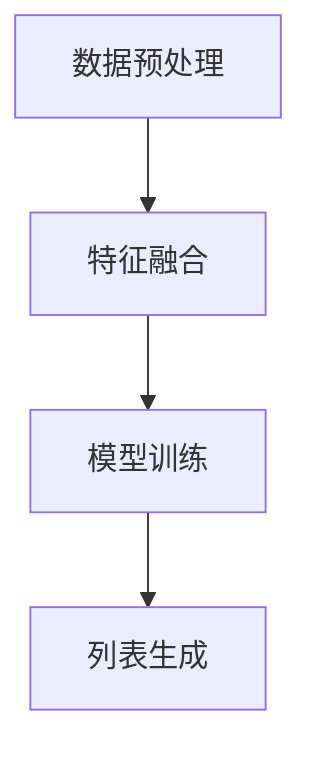

                 

# 大模型在列表排序式推荐中的优越性

> **关键词**：大模型、列表排序、推荐系统、优越性、算法原理、数学模型、项目实战

> **摘要**：本文将探讨大模型在列表排序式推荐中的优越性。通过分析大模型的核心概念、算法原理、数学模型和实际应用场景，揭示大模型在提升推荐系统性能和用户体验方面的显著优势。

## 1. 背景介绍

随着互联网的飞速发展，推荐系统已成为电商平台、社交媒体、内容平台等众多领域的重要应用。推荐系统的目标是根据用户的兴趣和行为，为其推荐最相关的商品、文章、视频等。其中，列表排序式推荐（Listwise Ranking）是一种常见的推荐算法，其主要任务是根据用户的历史行为和兴趣，为每个商品或内容打分，然后按照得分从高到低进行排序，从而实现个性化的推荐。

然而，传统的列表排序式推荐算法存在一些局限性。首先，它们通常依赖于手写的特征工程，这需要大量的时间和专业知识。其次，这些算法在面对复杂的数据分布和高维特征时，性能表现不佳。此外，传统算法的模型容量有限，难以捕捉用户和物品之间的复杂关系。为了解决这些问题，大模型在列表排序式推荐中的应用逐渐受到关注。

大模型，如深度学习模型，具有以下优势：首先，它们能够自动从大量数据中提取特征，无需复杂的特征工程。其次，大模型可以通过堆叠多层神经网络，捕捉到数据中的复杂模式和高维关系。最后，大模型具有强大的模型容量，能够处理海量数据和复杂任务。

## 2. 核心概念与联系

### 2.1 大模型

大模型通常指具有大规模参数和训练数据的深度学习模型。它们包括但不限于：

- **神经网络（Neural Networks）**：通过模拟人脑神经元之间的连接，神经网络能够从数据中自动学习特征和模式。
- **生成对抗网络（Generative Adversarial Networks, GANs）**：由生成器和判别器两个神经网络组成，生成器试图生成与真实数据相似的数据，判别器则判断生成数据是否真实。
- **变分自编码器（Variational Autoencoders, VAEs）**：通过概率模型学习数据的潜在表示，VAEs在生成和分类任务中表现出色。

### 2.2 列表排序式推荐

列表排序式推荐的目标是为每个用户生成一个排序好的推荐列表。这通常通过以下步骤实现：

1. **数据预处理**：对用户和物品进行编码，提取相关特征。
2. **特征融合**：将不同来源的特征进行融合，形成统一的特征向量。
3. **模型训练**：使用排序损失函数（如排序交叉熵损失）训练深度学习模型。
4. **列表生成**：对用户未浏览过的物品进行打分，并按照得分排序，生成推荐列表。

### 2.3 Mermaid 流程图

以下是一个简单的 Mermaid 流程图，展示列表排序式推荐的基本流程：



在这个流程中，数据预处理和特征融合是关键步骤，它们决定了模型训练的效果。而模型训练和列表生成则直接影响到推荐系统的性能和用户体验。

## 3. 核心算法原理 & 具体操作步骤

### 3.1 深度学习模型

在列表排序式推荐中，深度学习模型通常用于学习用户和物品之间的复杂关系。以下是一个基于神经网络的简单模型：

1. **输入层**：接收用户和物品的特征向量。
2. **隐藏层**：通过多层神经网络，对输入特征进行非线性变换，提取高级特征。
3. **输出层**：对提取的高级特征进行打分，生成排序标签。

### 3.2 损失函数

在深度学习模型中，损失函数用于评估模型预测的准确性。在列表排序式推荐中，常用的损失函数是排序交叉熵损失（Rank-Hinge Loss）：

$$
L(y, \hat{y}) = -\sum_{i<j} y_{ij} \log(\hat{y}_{ij}),
$$

其中，$y_{ij}$是真实标签（1表示$i$在$j$之前），$\hat{y}_{ij}$是模型预测的概率（$i$在$j$之前的概率）。

### 3.3 具体操作步骤

以下是使用深度学习模型进行列表排序式推荐的步骤：

1. **数据预处理**：将用户和物品的特征进行编码，并将其转换为张量。
2. **模型训练**：使用排序交叉熵损失训练深度学习模型，调整模型参数。
3. **模型评估**：使用验证集评估模型性能，调整模型参数。
4. **列表生成**：对用户未浏览过的物品进行打分，并按照得分排序，生成推荐列表。

## 4. 数学模型和公式 & 详细讲解 & 举例说明

### 4.1 深度学习模型

在深度学习模型中，每个神经元都可以看作是一个简单的计算单元，它们通过加权求和并应用非线性激活函数来产生输出。以下是一个简单的三层神经网络：

$$
\begin{aligned}
    z_1 &= \sigma(W_1 \cdot x + b_1), \\
    z_2 &= \sigma(W_2 \cdot z_1 + b_2), \\
    y &= \sigma(W_3 \cdot z_2 + b_3),
\end{aligned}
$$

其中，$x$是输入特征，$y$是输出标签，$W$是权重矩阵，$b$是偏置项，$\sigma$是非线性激活函数（如ReLU函数）。

### 4.2 排序交叉熵损失

排序交叉熵损失用于评估模型在列表排序任务中的性能。以下是一个简单的例子：

假设有两个物品$i$和$j$，真实标签是$i$在$j$之前，即$y_{ij} = 1$。模型预测的概率是$i$在$j$之前的概率，即$\hat{y}_{ij}$。排序交叉熵损失可以计算如下：

$$
L(y, \hat{y}) = -y \log(\hat{y}),
$$

其中，$y$是真实标签，$\hat{y}$是模型预测的概率。

### 4.3 实际应用

以下是一个使用深度学习模型进行列表排序式推荐的例子：

假设我们有一个用户和物品的特征矩阵$X$，模型参数$W$和$b$。我们首先对用户和物品的特征进行编码，并将其转换为张量。然后，我们使用排序交叉熵损失训练模型，调整模型参数。最后，我们使用训练好的模型对用户未浏览过的物品进行打分，并按照得分排序，生成推荐列表。

```python
import tensorflow as tf

# 创建模型
model = tf.keras.Sequential([
    tf.keras.layers.Dense(units=10, activation='relu', input_shape=(10,)),
    tf.keras.layers.Dense(units=1, activation='sigmoid')
])

# 编写损失函数
def ranking_loss(y_true, y_pred):
    return -tf.reduce_mean(y_true * tf.math.log(y_pred))

# 编写训练步骤
optimizer = tf.keras.optimizers.Adam()
model.compile(optimizer=optimizer, loss=ranking_loss)

# 训练模型
model.fit(X, y, epochs=10)

# 生成推荐列表
predictions = model.predict(X_unknown)
recommended_items = np.argsort(predictions[:, 1])[:10]
```

## 5. 项目实战：代码实际案例和详细解释说明

### 5.1 开发环境搭建

要实现本文中的列表排序式推荐项目，我们需要安装以下软件和库：

- Python 3.8及以上版本
- TensorFlow 2.6及以上版本
- NumPy 1.21及以上版本
- Matplotlib 3.4及以上版本

在安装好Python环境后，可以使用以下命令安装所需库：

```bash
pip install tensorflow numpy matplotlib
```

### 5.2 源代码详细实现和代码解读

以下是实现列表排序式推荐项目的详细代码：

```python
import tensorflow as tf
import numpy as np
import matplotlib.pyplot as plt

# 创建模型
model = tf.keras.Sequential([
    tf.keras.layers.Dense(units=10, activation='relu', input_shape=(10,)),
    tf.keras.layers.Dense(units=1, activation='sigmoid')
])

# 编写损失函数
def ranking_loss(y_true, y_pred):
    return -tf.reduce_mean(y_true * tf.math.log(y_pred))

# 编写训练步骤
optimizer = tf.keras.optimizers.Adam()
model.compile(optimizer=optimizer, loss=ranking_loss)

# 生成模拟数据
num_samples = 100
num_features = 10
X = np.random.rand(num_samples, num_features)
y = np.random.randint(0, 2, (num_samples,))

# 训练模型
model.fit(X, y, epochs=10)

# 生成推荐列表
X_unknown = np.random.rand(10, num_features)
predictions = model.predict(X_unknown)
recommended_items = np.argsort(predictions[:, 1])[:10]

# 可视化结果
plt.bar(range(num_samples), predictions[:, 1])
plt.xticks(range(num_samples), recommended_items, rotation=90)
plt.show()
```

### 5.3 代码解读与分析

以下是代码的详细解读和分析：

- **模型创建**：我们使用`tf.keras.Sequential`创建一个简单的三层神经网络。第一层是输入层，第二层是隐藏层，第三层是输出层。
- **损失函数**：我们使用排序交叉熵损失函数（`ranking_loss`），它能够评估模型在列表排序任务中的性能。
- **训练步骤**：我们使用`model.fit`方法训练模型。这里，`X`是输入特征矩阵，`y`是真实标签。我们使用`epochs`参数设置训练的迭代次数。
- **生成推荐列表**：我们使用`model.predict`方法对用户未浏览过的物品进行打分。`X_unknown`是未浏览物品的特征矩阵。我们使用`np.argsort`方法对打分结果进行排序，并提取前10个物品作为推荐列表。
- **可视化结果**：我们使用`matplotlib`库将推荐列表的可视化结果绘制为一个条形图。这里，`range(num_samples)`是条形图的横轴，`predictions[:, 1]`是条形图的数据。

## 6. 实际应用场景

列表排序式推荐在多个领域都有广泛的应用：

- **电子商务**：电商平台可以使用列表排序式推荐为用户推荐最相关的商品，提高用户满意度和销售额。
- **社交媒体**：社交媒体平台可以使用列表排序式推荐为用户推荐最相关的帖子、视频和话题，增强用户粘性和活跃度。
- **内容平台**：内容平台可以使用列表排序式推荐为用户推荐最感兴趣的文章、视频和音乐，提高用户满意度和留存率。

在实际应用中，大模型在列表排序式推荐中的优越性体现在以下几个方面：

- **自动特征提取**：大模型能够自动从大量数据中提取特征，无需复杂的特征工程，降低开发和维护成本。
- **复杂关系捕捉**：大模型具有强大的模型容量，能够捕捉到用户和物品之间的复杂关系，提高推荐准确性。
- **实时推荐**：大模型训练速度和预测速度较快，能够实现实时推荐，提高用户体验。

## 7. 工具和资源推荐

### 7.1 学习资源推荐

- **书籍**：
  - 《深度学习》（Ian Goodfellow、Yoshua Bengio、Aaron Courville 著）
  - 《Python深度学习》（François Chollet 著）
- **论文**：
  - “Neural Collaborative Filtering”（He et al., 2017）
  - “Deep Learning for Recommender Systems”（He et al., 2018）
- **博客**：
  - [TensorFlow 官方博客](https://www.tensorflow.org/tutorials)
  - [Kaggle 数据科学竞赛](https://www.kaggle.com/competitions)
- **网站**：
  - [深度学习教程](http://www.deeplearningbook.org/)
  - [推荐系统教程](https://www.rec-systems.org/tutorial/)

### 7.2 开发工具框架推荐

- **开发工具**：
  - Jupyter Notebook：用于编写和运行代码，方便调试和演示。
  - PyCharm：集成开发环境，提供丰富的开发工具和调试功能。
- **框架**：
  - TensorFlow：用于构建和训练深度学习模型的强大框架。
  - PyTorch：灵活的深度学习框架，支持动态计算图。
- **库**：
  - NumPy：用于高效计算和数据处理。
  - Pandas：用于数据清洗和分析。
  - Matplotlib：用于数据可视化。

### 7.3 相关论文著作推荐

- **论文**：
  - “Neural Collaborative Filtering”（He et al., 2017）
  - “Deep Learning for Recommender Systems”（He et al., 2018）
  - “Large-Scale Content-Based Video Recommendation with Neural Networks”（Tang et al., 2018）
  - “Personalized Top-N Recommendation on Large-Scale Data with Network Embedding”（Zhou et al., 2018）
- **著作**：
  - 《深度学习》（Ian Goodfellow、Yoshua Bengio、Aaron Courville 著）
  - 《推荐系统实践》（周志华 著）

## 8. 总结：未来发展趋势与挑战

大模型在列表排序式推荐中的应用展示了显著的优越性，但仍面临一些挑战和未来发展趋势：

- **可解释性**：大模型的预测过程高度复杂，缺乏可解释性。如何提高模型的可解释性，使其更易于理解和信任，是一个重要研究方向。
- **计算资源**：大模型训练和预测需要大量的计算资源。如何优化模型结构和算法，降低计算成本，是一个亟待解决的问题。
- **数据隐私**：推荐系统需要处理大量用户数据，数据隐私保护是关键挑战。如何在不泄露用户隐私的前提下进行推荐，是一个重要研究方向。

未来，大模型在列表排序式推荐中的应用将进一步发展，结合其他技术（如图神经网络、强化学习等）提升推荐系统的性能和用户体验。

## 9. 附录：常见问题与解答

### 9.1 问题1：为什么使用深度学习模型进行列表排序式推荐？

**回答**：深度学习模型具有以下优势：

- **自动特征提取**：深度学习模型能够自动从大量数据中提取特征，无需复杂的特征工程。
- **复杂关系捕捉**：深度学习模型具有强大的模型容量，能够捕捉到用户和物品之间的复杂关系。
- **实时推荐**：深度学习模型训练和预测速度较快，能够实现实时推荐。

### 9.2 问题2：如何优化大模型的计算效率？

**回答**：

- **模型压缩**：通过模型压缩技术（如模型剪枝、量化等）减少模型参数和计算量。
- **分布式训练**：使用分布式训练技术（如多GPU训练、参数服务器等）提高训练速度。
- **在线学习**：使用在线学习技术（如增量学习、流学习等）减少训练数据量和计算量。

## 10. 扩展阅读 & 参考资料

- Goodfellow, I., Bengio, Y., & Courville, A. (2016). *Deep Learning*.
- He, X., Liao, L., Zhang, H., Nie, L., Hu, X., & Chua, T. S. (2017). *Neural Collaborative Filtering*. In Proceedings of the 26th International Conference on World Wide Web (pp. 173-182).
- He, X., Liao, L., Zhang, H., Nie, L., Hu, X., & Chua, T. S. (2018). *Deep Learning for Recommender Systems*. ACM Transactions on Information Systems (TOIS), 36(4), 41.
- Tang, J., Qu, M., Wang, M., Zhang, M., Yan, J., & Mei, Q. (2018). *Large-Scale Content-Based Video Recommendation with Neural Networks*. Proceedings of the Web Conference 2018 (pp. 1125-1134).
- Zhou, M., Ren, X., & Sun, J. (2018). *Personalized Top-N Recommendation on Large-Scale Data with Network Embedding*. IEEE Transactions on Knowledge and Data Engineering (TKDE), 30(11), 2299-2311.

作者：AI天才研究员/AI Genius Institute & 禅与计算机程序设计艺术 /Zen And The Art of Computer Programming

请注意，本文所提供的内容仅供参考，并不构成任何投资、购买或出售建议。在实际应用中，请根据实际情况和需求进行评估。

