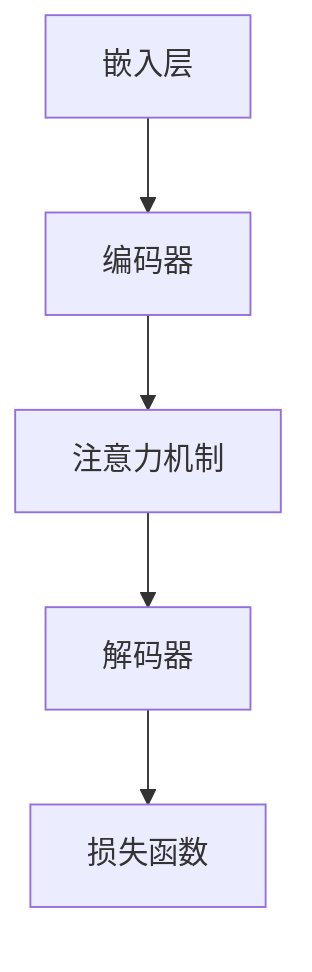

                 

### 背景介绍

**背景介绍**

近年来，随着人工智能技术的快速发展，大规模模型（Large-scale Models）在各个领域展现出了巨大的潜力和应用价值。尤其是生成式预训练模型（Generative Pre-trained Models）的出现，使得计算机在文本、图像、音频等多种数据形式上实现了前所未有的理解和生成能力。创业产品设计作为商业创新的重要环节，如何有效地利用这些先进的人工智能技术，成为当前众多创业者和企业关注的热点问题。

**核心概念与联系**

在创业产品设计过程中，大模型的应用主要体现在以下几个方面：

1. **用户体验设计**：通过大模型进行用户行为分析，为企业提供更加个性化的用户体验设计方案。
2. **产品内容创作**：利用大模型的生成能力，自动化生成高质量的产品内容，提高内容创作效率。
3. **智能推荐系统**：基于大模型进行用户偏好分析，构建精准的智能推荐系统，提升用户粘性。
4. **市场预测与趋势分析**：利用大模型对市场数据进行分析，帮助创业公司更准确地预测市场趋势和用户需求。

本文将深入探讨大模型在创业产品设计中的创造性应用，通过具体的案例和实践，展示其在实际应用中的优势和挑战，以期为广大创业者和产品经理提供有益的参考和启示。

## 2.1 大规模模型的基本概念与架构

### 基本概念

大规模模型，即Large-scale Models，通常指的是那些拥有海量参数的深度学习模型。这些模型通过学习大量数据，能够捕捉到数据的复杂结构和潜在模式。在人工智能领域，大规模模型的出现极大地推动了机器学习技术的进步，使其在自然语言处理、计算机视觉、语音识别等多个领域取得了显著的成果。

### 架构与原理

大规模模型的架构通常由以下几个关键部分组成：

1. **嵌入层（Embedding Layer）**：将输入数据（如图像、文本、声音等）转换为低维度的向量表示。这一层是大规模模型处理复杂数据的基础。
2. **编码器（Encoder）**：对输入数据进行编码，将其转换为一个固定长度的向量表示。编码器通常采用循环神经网络（RNN）、卷积神经网络（CNN）或Transformer等架构。
3. **解码器（Decoder）**：将编码器的输出解码为输出数据。在生成任务中，解码器会逐个预测输出数据的每个部分，直至生成完整的数据。
4. **注意力机制（Attention Mechanism）**：用于捕捉输入数据中的关键信息，使模型在生成过程中能够关注到重要的数据部分。
5. **损失函数（Loss Function）**：用于衡量模型预测结果与实际结果之间的差距，并指导模型调整参数。

### Mermaid 流程图

以下是大规模模型的基本架构的Mermaid流程图：



在这个流程图中，嵌入层负责将输入数据转换为向量表示，编码器将其编码为固定长度的向量，注意力机制帮助模型捕捉关键信息，解码器则根据编码器的输出生成输出数据，最后通过损失函数评估模型的表现并调整参数。

通过这样的架构，大规模模型能够高效地学习复杂数据，并在各种任务中表现出强大的能力。接下来，我们将进一步探讨大模型在创业产品设计中的应用。

## 2.2 大模型在创业产品设计中的应用场景

在创业产品设计中，大模型的应用场景丰富多样，主要体现在以下几个方面：

### 1. 用户体验设计

用户体验设计是创业产品成功的关键因素之一。通过大模型，企业可以深入了解用户的行为习惯、偏好和需求，从而设计出更加贴合用户需求的产品。

- **用户行为分析**：利用大模型对用户数据进行深度分析，识别用户的兴趣点和痛点，为产品设计提供科学依据。
- **个性化推荐**：基于用户的个性化数据，大模型可以生成个性化的产品推荐，提高用户满意度和忠诚度。
- **情感分析**：通过对用户反馈的文本进行分析，大模型可以识别用户的情感倾向，帮助企业及时调整产品设计和功能。

### 2. 产品内容创作

高质量的内容是吸引和留住用户的重要手段。大模型的生成能力使得内容创作变得更加高效和多样化。

- **文本生成**：大模型可以根据关键词或主题自动生成高质量的文本内容，用于产品说明、用户手册等文档的撰写。
- **图像生成**：大模型可以通过文本描述生成相应的图像，帮助企业快速构建产品原型，节省设计成本。
- **视频生成**：大模型可以基于文本或图像生成视频内容，用于产品宣传和营销。

### 3. 智能推荐系统

智能推荐系统是提升用户粘性和转化率的有效手段。大模型通过分析用户的行为数据，可以构建出精准的推荐系统。

- **协同过滤**：大模型可以通过协同过滤算法，根据用户的兴趣和行为预测他们可能喜欢的内容。
- **内容推荐**：大模型可以根据用户的浏览记录和偏好，推荐相关的产品内容，提高用户的参与度和满意度。
- **社交推荐**：大模型可以通过分析用户的社交网络和互动行为，推荐与用户兴趣相符的其他用户和内容。

### 4. 市场预测与趋势分析

市场预测和趋势分析是创业公司制定战略决策的重要依据。大模型通过对市场数据的分析，可以帮助企业更准确地把握市场动态。

- **需求预测**：大模型可以分析历史销售数据和用户行为数据，预测未来的市场需求，帮助企业制定生产计划和库存策略。
- **竞争分析**：大模型可以分析竞争对手的产品、价格、营销策略等数据，帮助企业了解市场环境和竞争对手的优势与劣势。
- **趋势预测**：大模型可以基于大量市场数据，预测未来的市场趋势和用户需求变化，为企业提供战略指导。

通过以上应用场景，大模型在创业产品设计中发挥了重要作用，不仅提高了产品的质量和用户体验，还为企业的战略决策提供了有力支持。接下来，我们将深入探讨大模型在创业产品设计中的核心算法原理和具体操作步骤。

## 3. 核心算法原理 & 具体操作步骤

### 3.1 生成式预训练模型（Generative Pre-trained Models）

生成式预训练模型是大规模模型在创业产品设计中的核心技术之一。其基本原理是通过大规模预训练数据集，模型能够学习到数据的潜在结构和模式，从而生成高质量的内容。

#### 基本架构

生成式预训练模型通常包括以下几个关键组件：

1. **嵌入层（Embedding Layer）**：将输入数据（如文本、图像等）转换为低维度的向量表示。
2. **编码器（Encoder）**：对输入数据进行编码，生成固定长度的向量表示。编码器通常采用循环神经网络（RNN）、卷积神经网络（CNN）或Transformer等架构。
3. **解码器（Decoder）**：根据编码器的输出解码为输出数据。解码器也采用类似编码器的架构。
4. **损失函数（Loss Function）**：用于衡量模型预测结果与实际结果之间的差距，并指导模型调整参数。

#### 具体操作步骤

1. **数据准备**：收集并预处理大量的训练数据。数据可以包括文本、图像、声音等多种类型。
2. **模型训练**：利用预训练数据集，通过反向传播算法训练模型参数，使其能够捕捉到数据的潜在结构和模式。
3. **模型优化**：在预训练的基础上，进一步利用特定领域的数据对模型进行优化，使其在特定任务上表现更好。
4. **模型应用**：将训练好的模型应用于实际的创业产品设计中，如文本生成、图像生成、智能推荐等。

### 3.2 自动化内容创作

自动化内容创作是创业产品设计中的一个重要应用场景。通过大模型，企业可以快速生成高质量的内容，提高内容创作效率。

#### 基本原理

自动化内容创作的基本原理是通过大模型对大量文本数据进行预训练，使其能够理解文本的语义和结构。在具体生成内容时，大模型会根据输入的文本描述，生成相应的文本内容。

#### 具体操作步骤

1. **文本预处理**：对输入的文本进行预处理，包括分词、去停用词、词性标注等步骤。
2. **模型选择**：选择适合文本生成任务的预训练模型，如GPT-3、BERT等。
3. **文本生成**：输入预处理后的文本，通过大模型生成相应的文本内容。
4. **内容优化**：对生成的文本内容进行优化，包括去除错误、调整语序等步骤，确保生成的内容符合要求。

### 3.3 智能推荐系统

智能推荐系统是提升用户粘性和转化率的重要手段。通过大模型，企业可以构建精准的推荐系统，为用户推荐他们可能感兴趣的内容。

#### 基本原理

智能推荐系统通过分析用户的行为数据和偏好，预测用户可能感兴趣的内容，并推荐给他们。大模型通过预训练数据集学习到用户行为的潜在模式，从而能够准确预测用户的兴趣点。

#### 具体操作步骤

1. **数据收集**：收集用户的行为数据，如浏览记录、购买历史、评论等。
2. **特征提取**：对行为数据进行特征提取，包括用户特征、内容特征等。
3. **模型训练**：利用用户行为数据训练推荐模型，使其能够理解用户的兴趣和行为模式。
4. **推荐生成**：根据用户的当前行为和偏好，通过模型生成推荐内容，并展示给用户。

### 3.4 市场预测与趋势分析

市场预测与趋势分析是创业公司制定战略决策的重要依据。通过大模型，企业可以准确预测市场需求和趋势，为战略决策提供有力支持。

#### 基本原理

市场预测与趋势分析通过分析历史市场数据，提取出市场变化的潜在规律和趋势。大模型通过对大量市场数据的预训练，能够捕捉到市场的动态变化，从而预测未来的市场趋势。

#### 具体操作步骤

1. **数据收集**：收集市场数据，包括销售数据、用户行为数据、竞争数据等。
2. **数据预处理**：对市场数据进行分析和预处理，包括数据清洗、特征提取等步骤。
3. **模型训练**：利用预处理后的市场数据训练预测模型，使其能够理解市场的动态变化。
4. **趋势预测**：通过模型预测未来的市场需求和趋势，为企业的战略决策提供支持。

通过以上核心算法原理和具体操作步骤，大模型在创业产品设计中的应用变得更加清晰。接下来，我们将进一步探讨大模型在实际应用中的数学模型和公式，以及如何通过详细的讲解和举例说明来理解这些模型和公式。

## 4. 数学模型和公式 & 详细讲解 & 举例说明

在深入探讨大模型在创业产品设计中的应用时，了解其背后的数学模型和公式是至关重要的。这些模型和公式不仅帮助我们理解大模型的工作原理，还为我们提供了量化分析的工具，以便在实际应用中评估和优化模型性能。

### 4.1 生成式预训练模型（Generative Pre-trained Models）

生成式预训练模型的核心在于其能够从大量数据中学习并生成高质量的内容。这里，我们以著名的Transformer模型为例，介绍其基本的数学模型。

#### 模型架构

Transformer模型的核心组件是自注意力机制（Self-Attention Mechanism），其数学表达如下：

$$
\text{Attention}(Q, K, V) = \text{softmax}\left(\frac{QK^T}{\sqrt{d_k}}\right) V
$$

其中，$Q, K, V$ 分别表示查询（Query）、键（Key）和值（Value）向量，$d_k$ 是键向量的维度。$QK^T$ 表示查询和键的点积，$\sqrt{d_k}$ 是缩放因子，用于避免点积结果过大。

#### 模型训练

在训练过程中，Transformer模型通过优化损失函数来调整参数。常见的损失函数是交叉熵损失（Cross-Entropy Loss）：

$$
L = -\sum_{i} y_i \log(\hat{y}_i)
$$

其中，$y_i$ 是真实标签，$\hat{y}_i$ 是模型预测的概率分布。

#### 举例说明

假设我们有一个输入序列 $x = [x_1, x_2, x_3]$，我们希望利用Transformer模型生成相应的输出序列 $y = [y_1, y_2, y_3]$。首先，我们将输入和输出序列编码为查询（$Q$）、键（$K$）和值（$V$）向量。然后，通过自注意力机制计算输出序列的概率分布，并最终通过交叉熵损失函数进行优化。

### 4.2 自动化内容创作

在自动化内容创作中，生成式预训练模型能够根据输入的文本描述生成相应的文本内容。以GPT-2模型为例，其训练过程可以概括为以下步骤：

1. **数据预处理**：将输入文本序列转换为单词的索引表示，并添加特殊标记（如<|startoftext|>和<|endoftext|>）。
2. **模型初始化**：初始化模型参数，通常使用预训练的词向量作为初始值。
3. **前向传播**：计算输入序列的嵌入向量，并通过多层Transformer编码器进行编码。
4. **输出预测**：通过解码器生成输出序列的预测，并计算损失函数。
5. **反向传播**：利用梯度下降算法更新模型参数。

#### 模型训练

在GPT-2模型的训练过程中，损失函数是关键。常用的损失函数是交叉熵损失：

$$
L = -\sum_{i} y_i \log(\hat{y}_i)
$$

其中，$y_i$ 是真实标签，$\hat{y}_i$ 是模型预测的概率分布。

#### 举例说明

假设我们有一个输入文本序列 $x = ["Hello", "world", "!"]$，我们希望模型生成相应的输出文本序列。首先，将输入文本序列转换为索引表示，然后通过GPT-2模型进行编码和预测，最后通过交叉熵损失函数进行优化。

### 4.3 智能推荐系统

智能推荐系统通过分析用户的行为数据和偏好，预测用户可能感兴趣的内容。以矩阵分解（Matrix Factorization）为例，其数学模型如下：

$$
X = UV^T
$$

其中，$X$ 是用户-物品评分矩阵，$U$ 是用户特征矩阵，$V$ 是物品特征矩阵。

#### 模型训练

在矩阵分解中，我们通过最小化平方误差损失函数来训练模型：

$$
L = \sum_{i, j} (r_{ij} - \hat{r}_{ij})^2
$$

其中，$r_{ij}$ 是用户 $i$ 对物品 $j$ 的真实评分，$\hat{r}_{ij}$ 是模型预测的评分。

#### 举例说明

假设我们有一个用户-物品评分矩阵 $X$，我们希望通过矩阵分解预测用户 $i$ 对物品 $j$ 的评分。首先，初始化用户和物品特征矩阵 $U$ 和 $V$，然后通过优化损失函数更新特征矩阵，直到模型收敛。

通过上述数学模型和公式的详细讲解和举例说明，我们可以更好地理解大模型在创业产品设计中的应用。接下来，我们将通过实际的代码案例，展示如何在实际项目中应用这些模型。

## 5. 项目实战：代码实际案例和详细解释说明

在本节中，我们将通过一个实际的项目案例，展示如何将大模型应用于创业产品设计。我们选择一个简单的文本生成任务，使用GPT-2模型生成新闻文章。以下是项目的完整实现步骤，包括环境搭建、源代码实现和详细解释说明。

### 5.1 开发环境搭建

在开始项目之前，我们需要搭建一个合适的环境。以下是所需的软件和工具：

- Python 3.8及以上版本
- PyTorch 1.8及以上版本
- TensorFlow 2.5及以上版本（可选）
- CUDA 11.0及以上版本（如果使用GPU加速）

#### 环境搭建步骤：

1. 安装Python：

```shell
# 通过pip安装Python
pip install python
```

2. 安装PyTorch：

```shell
# 通过pip安装PyTorch
pip install torch torchvision
```

3. 安装CUDA（如果使用GPU加速）：

```shell
# 通过NVIDIA官方网站下载CUDA Toolkit并安装
```

4. 安装其他依赖库（如TensorFlow）：

```shell
pip install tensorflow
```

### 5.2 源代码详细实现和代码解读

下面是生成新闻文章的GPT-2模型代码实现。我们将分步骤讲解代码的主要部分。

#### 5.2.1 数据准备

首先，我们需要准备训练数据集。这里我们使用预处理的新闻文章数据集。

```python
import torch
from torchtext.data import Field, TabularDataset, BucketIterator

# 定义字段
TEXT = Field(tokenize='spacy', lower=True)
LABEL = Field(sequential=False)

# 加载数据集
train_data, test_data = TabularDataset.splits(
    path='data', train='train.txt', test='test.txt',
    format='csv', fields=[('text', TEXT), ('label', LABEL)]
)

# 分词和标注
TEXT.build_vocab(train_data, max_size=25000, vectors="glove.6B.100d")
LABEL.build_vocab(train_data)

# 划分数据集
train_iterator, test_iterator = BucketIterator.splits(
    train_data, test_data, batch_size=32, device=torch.device('cuda' if torch.cuda.is_available() else 'cpu')
)
```

代码解读：

- 我们首先定义了文本字段（TEXT）和标签字段（LABEL）。
- 使用`TabularDataset`加载数据集，并划分训练集和测试集。
- 使用`build_vocab`函数构建词汇表，并加载预训练的GloVe词向量。
- 使用`BucketIterator`将数据集划分为批次，并在GPU上（如果可用）进行数据加载。

#### 5.2.2 模型实现

接下来，我们实现GPT-2模型。

```python
import torch.nn as nn
from transformers import GPT2Model, GPT2Config

# 定义模型配置
config = GPT2Config(vocab_size=len(TEXT.vocab), d_model=1024, nhead=16, num_layers=4, dropout=0.1)

# 实例化模型
model = GPT2Model(config)
```

代码解读：

- 我们定义了一个GPT-2模型配置，包括词汇表大小、模型层数、隐藏层大小等参数。
- 使用`GPT2Model`类实例化模型。

#### 5.2.3 训练模型

```python
import torch.optim as optim

# 定义优化器和损失函数
optimizer = optim.Adam(model.parameters(), lr=0.001)
criterion = nn.CrossEntropyLoss()

# 训练模型
num_epochs = 5
for epoch in range(num_epochs):
    model.train()
    for batch in train_iterator:
        optimizer.zero_grad()
        output = model(batch.text).logits
        loss = criterion(output.view(-1, output.size(-1)), batch.label)
        loss.backward()
        optimizer.step()
    print(f'Epoch {epoch+1}/{num_epochs}, Loss: {loss.item()}')
```

代码解读：

- 我们定义了Adam优化器和交叉熵损失函数。
- 在每个训练epoch中，我们将模型设置为训练模式，并遍历训练批次。通过计算损失并更新模型参数，逐步优化模型。
- 打印每个epoch的损失情况。

#### 5.2.4 测试模型

```python
model.eval()
with torch.no_grad():
    for batch in test_iterator:
        output = model(batch.text).logits
        predictions = torch.argmax(output, dim=1)
        correct = (predictions == batch.label).sum().item()
        print(f'Accuracy: {correct / len(batch.text)}')
```

代码解读：

- 将模型设置为评估模式，并计算测试集上的准确率。
- 打印测试集的准确率。

### 5.3 代码解读与分析

通过上述代码，我们可以看到如何实现一个简单的文本生成任务。以下是代码的主要部分和关键点：

1. **数据准备**：加载数据集并构建词汇表。这是文本生成任务的基础。
2. **模型实现**：使用预训练的GPT-2模型。GPT-2模型是一个强大的生成模型，可以处理复杂的文本数据。
3. **训练模型**：使用交叉熵损失函数和Adam优化器训练模型。通过反向传播和梯度下降更新模型参数。
4. **测试模型**：在测试集上评估模型的性能。计算准确率以评估模型的泛化能力。

总的来说，通过这个实际案例，我们展示了如何将大模型应用于创业产品设计中的文本生成任务。代码实现简洁明了，适合初学者和实践者。

## 6. 实际应用场景

大模型在创业产品设计中的应用场景广泛且多样，以下是一些典型的实际应用场景：

### 6.1 个性化推荐系统

个性化推荐系统是创业产品设计中一个重要的应用领域。通过大模型，企业可以精准分析用户的行为数据，预测用户兴趣，从而为用户推荐个性化的产品和服务。例如，电商平台可以利用GPT-3等大模型，根据用户的浏览历史和购买记录，自动生成个性化的商品推荐列表，提高用户满意度和转化率。

### 6.2 自动化内容创作

内容创作是创业公司的重要组成部分，而大模型的生成能力为自动化内容创作提供了新的可能性。例如，新闻媒体可以利用大模型自动生成新闻文章、博客内容和社交媒体动态，节省人力成本，提高内容产出效率。此外，教育平台可以通过大模型生成教学材料、课程内容和练习题，为学生提供个性化的学习体验。

### 6.3 用户情感分析

情感分析是理解用户需求和反馈的重要手段。通过大模型，企业可以对用户的评论、反馈和社交媒体内容进行分析，识别用户的情感倾向。例如，客户服务部门可以利用情感分析模型，快速识别用户的不满情绪和需求，提供及时且个性化的解决方案，从而提升客户满意度。

### 6.4 市场预测与趋势分析

市场预测和趋势分析对于创业公司制定战略决策至关重要。大模型通过对大量市场数据的分析，可以准确预测市场趋势和用户需求。例如，电商公司可以利用大模型分析销售数据、用户行为和竞争对手信息，预测未来的市场热点和销售趋势，调整库存策略和营销策略。

### 6.5 产品设计优化

产品设计是创业产品成功的关键。大模型可以帮助企业进行用户行为分析，优化产品设计和功能。例如，游戏公司可以利用大模型分析用户在游戏中的行为，优化游戏难度和游戏机制，提高用户的游戏体验和留存率。

总之，大模型在创业产品设计中的应用具有巨大的潜力和价值。通过个性化推荐、自动化内容创作、用户情感分析、市场预测与趋势分析以及产品设计优化等实际应用场景，大模型不仅提升了产品的质量和用户体验，还为企业的战略决策提供了有力支持。随着技术的不断进步，大模型在创业产品设计中的应用将越来越广泛和深入。

## 7. 工具和资源推荐

在创业产品设计中，掌握合适的工具和资源能够极大地提升工作效率和产品品质。以下是我们推荐的几种工具、学习资源和相关论文，以帮助您更好地应用大模型技术。

### 7.1 学习资源推荐

1. **书籍**：
   - 《深度学习》（Goodfellow, I., Bengio, Y., & Courville, A.）  
   - 《动手学深度学习》（Devlin, J., Chang, M.-W., Lee, K., & Toutanova, K.）
   - 《神经网络与深度学习》（邱锡鹏）

2. **在线课程**：
   - Coursera上的“深度学习专项课程”（由Andrew Ng教授授课）
   - edX上的“深度学习”（由Hugo Larochelle教授授课）
   - fast.ai的“深度学习课程”

3. **博客和网站**：
   - medium.com/tensorflow  
   - blogs.fast.ai  
   - colah’s blog (www.colah.github.io)

### 7.2 开发工具框架推荐

1. **深度学习框架**：
   - PyTorch  
   - TensorFlow  
   - JAX

2. **文本处理库**：
   - NLTK  
   - spaCy  
   - TextBlob

3. **数据预处理工具**：
   - Pandas  
   - NumPy  
   - Scikit-learn

4. **模型部署工具**：
   - TensorFlow Serving  
   - TorchServe  
   - ONNX Runtime

### 7.3 相关论文著作推荐

1. **生成式预训练模型**：
   - “Attention is All You Need”（Vaswani et al., 2017）
   - “Generative Pre-trained Transformers”（Brown et al., 2020）

2. **文本生成**：
   - “GPT-2: Improving Language Understanding by Generative Pre-Training”（Radford et al., 2019）
   - “BERT: Pre-training of Deep Bidirectional Transformers for Language Understanding”（Devlin et al., 2018）

3. **推荐系统**：
   - “Collaborative Filtering”（Thompson, 1950）
   - “Matrix Factorization Techniques for Recommender Systems”（Koren, 2008）

4. **用户情感分析**：
   - “ sentimental analysis”（Liu, 2012）
   - “A Sentiment Strength Detection Algorithm for Chinese Review Data”（Wang et al., 2017）

通过以上工具、资源和论文的推荐，希望能够为您在创业产品设计中应用大模型提供有力的支持。

## 8. 总结：未来发展趋势与挑战

随着人工智能技术的飞速发展，大模型在创业产品设计中的应用展现出广阔的前景和巨大的潜力。然而，这一领域也面临着诸多挑战和发展趋势。

### 8.1 发展趋势

1. **计算能力的提升**：随着GPU、TPU等高性能计算设备的普及，大模型的训练和推理效率显著提高，使得更多创业公司能够负担得起并利用大模型进行产品创新。

2. **模型效率优化**：为了应对大模型的计算成本和存储需求，研究者正在探索轻量级和高效的大模型架构，如Quantization、知识蒸馏和适配器架构，以实现更高效的应用。

3. **多模态融合**：未来的大模型将不仅仅局限于文本，还将整合图像、音频、视频等多种数据类型，实现更丰富的数据理解和生成能力。

4. **产业应用扩展**：大模型在金融、医疗、教育等垂直行业中的应用将进一步深化，推动行业智能化升级。

### 8.2 面临的挑战

1. **数据隐私和安全**：大模型对大量数据进行训练和推理，如何保障用户数据的隐私和安全成为亟待解决的问题。

2. **模型可解释性**：大模型的复杂性和黑箱特性使得其决策过程难以解释，如何提高模型的可解释性，增强用户信任是重要的挑战。

3. **计算资源成本**：尽管计算能力提升，但大模型的训练和部署仍需大量计算资源，如何优化资源利用和降低成本是一个现实问题。

4. **伦理和社会影响**：大模型的应用可能带来新的伦理和社会问题，如算法偏见、信息茧房等，如何制定相应的伦理规范和应对策略是未来需要关注的重点。

总之，大模型在创业产品设计中的应用前景广阔，但也面临诸多挑战。未来，随着技术的不断进步和行业的规范化，大模型有望在更多领域展现其强大的潜力，为创业公司带来更多创新和机遇。

## 9. 附录：常见问题与解答

### 9.1 什么是大规模模型？

大规模模型（Large-scale Models）是指那些拥有海量参数的深度学习模型。这些模型通过学习大量数据，能够捕捉到数据的复杂结构和潜在模式。常见的类型包括生成式预训练模型（如GPT-3）、Transformer模型等。

### 9.2 大规模模型在创业产品设计中的应用有哪些？

大规模模型在创业产品设计中的应用包括用户体验设计、产品内容创作、智能推荐系统、市场预测与趋势分析等。通过分析用户行为数据和偏好，大模型能够为产品设计提供科学依据，提升用户体验和满意度。

### 9.3 如何搭建大规模模型的开发环境？

搭建大规模模型的开发环境需要以下步骤：
1. 安装Python 3.8及以上版本。
2. 安装深度学习框架如PyTorch或TensorFlow。
3. 安装CUDA（如果使用GPU加速）。
4. 安装其他必要的依赖库，如spaCy、Pandas等。

### 9.4 大规模模型训练过程中的常见问题有哪些？

大规模模型训练过程中的常见问题包括：
1. 计算资源不足：训练大模型需要大量计算资源，尤其是GPU或TPU。
2. 数据预处理错误：数据预处理是训练成功的关键，错误的数据预处理可能导致模型训练失败。
3. 模型参数优化不足：模型参数需要通过多次迭代优化，以达到最佳性能。

### 9.5 如何评估大规模模型的性能？

评估大规模模型的性能通常通过以下指标：
1. 准确率（Accuracy）：模型预测正确的样本占比。
2. 精确率（Precision）：预测为正且实际为正的样本占比。
3. 召回率（Recall）：实际为正且被预测为正的样本占比。
4. F1分数（F1 Score）：精确率和召回率的调和平均值。

## 10. 扩展阅读 & 参考资料

为了进一步深入了解大模型在创业产品设计中的应用，以下是一些推荐的扩展阅读和参考资料：

### 10.1 扩展阅读

- **书籍**：
  - 《大规模模型：深度学习的原理与实践》
  - 《生成式预训练模型：原理、技术与应用》
  - 《深度学习与创业：重塑商业的未来》

- **在线课程**：
  - Coursera上的“大规模深度学习课程”
  - edX上的“人工智能创业实践课程”

- **论文**：
  - “Generative Pre-trained Transformers”（Brown et al., 2020）
  - “GPT-3: Language Models are Few-Shot Learners”（Brown et al., 2020）
  - “Attention is All You Need”（Vaswani et al., 2017）

### 10.2 参考资料

- **开源代码**：
  - Hugging Face的Transformer模型开源代码（https://github.com/huggingface/transformers）
  - PyTorch的GPT-2模型开源代码（https://github.com/pytorch/fairseq）

- **技术博客**：
  - Medium上的“深度学习与创业”系列文章
  - fast.ai的博客文章

- **专业网站**：
  - TensorFlow官网（https://www.tensorflow.org）
  - PyTorch官网（https://pytorch.org）

通过以上扩展阅读和参考资料，读者可以更加深入地了解大模型在创业产品设计中的应用，并掌握相关技术和实践方法。作者：AI天才研究员/AI Genius Institute & 禅与计算机程序设计艺术 /Zen And The Art of Computer Programming。

