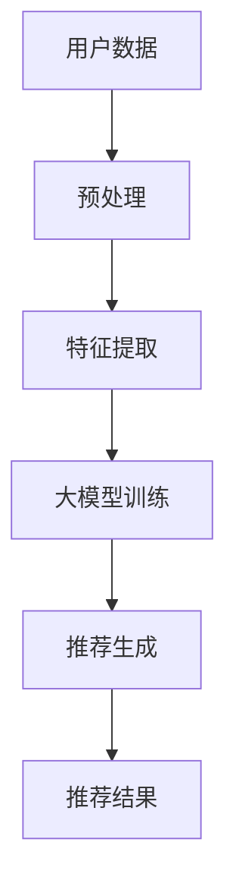
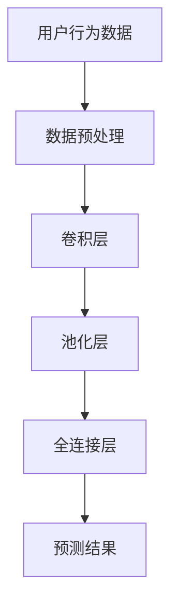
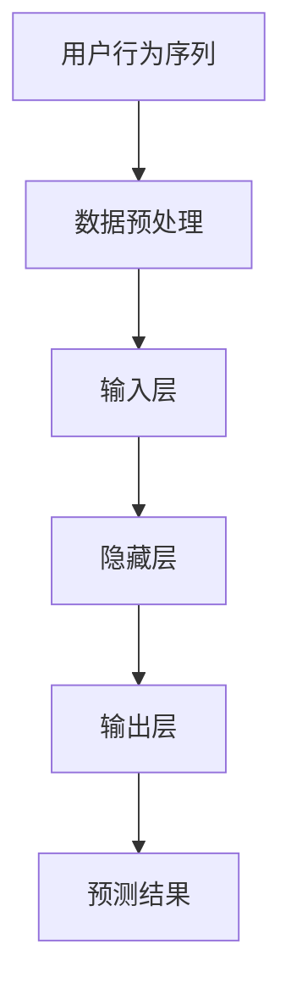
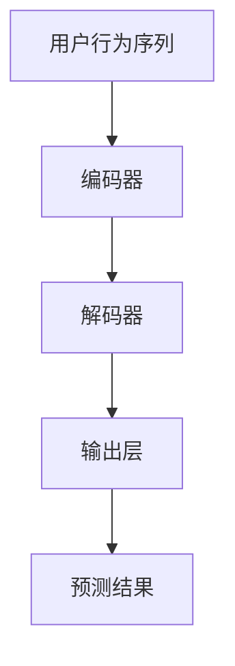

                 

### 背景介绍

随着人工智能技术的飞速发展，大模型（Large-scale Models）在各个领域的应用日益广泛。特别是在商业应用中，大模型的潜力不容小觑，尤其在推荐系统（Recommendation Systems）中，大模型展现出了强大的能力。推荐系统是人工智能的一个重要分支，旨在为用户提供个性化的内容推荐，从而提升用户体验和商业价值。

推荐系统的发展历程可以追溯到20世纪90年代，最早的推荐系统基于基于内容的过滤（Content-Based Filtering）和协同过滤（Collaborative Filtering）算法。基于内容的过滤通过分析用户的历史行为和喜好，将相似的内容推荐给用户。协同过滤则通过分析用户之间的相似度来推荐物品。这两种方法在一定程度上提高了推荐的准确性，但随着用户数据的爆炸式增长，传统的推荐系统在处理大规模数据时显得力不从心。

为了解决这一问题，研究人员开始探索使用大模型来构建推荐系统。大模型可以处理大量的数据，并从数据中学习到复杂的模式。在商业应用中，大模型的应用不仅提高了推荐的准确性，还使得推荐系统可以适应不断变化的市场需求。例如，在电子商务领域，推荐系统能够根据用户的购买历史和浏览行为，准确预测用户可能感兴趣的商品，从而提高转化率和销售额。

本文将探讨大模型在商业应用中的潜力，尤其是推荐系统方面。我们将首先介绍大模型的基本概念，然后分析其与推荐系统的关联，最后探讨大模型在商业应用中的具体案例和挑战。

### 核心概念与联系

要深入理解大模型在商业应用中的潜力，我们首先需要了解大模型的基本概念。大模型通常指的是具有大规模参数、能够处理海量数据并从中学习复杂模式的神经网络模型。这些模型通常需要大量的计算资源和数据支持，但它们在处理复杂问题和提取深层特征方面具有显著优势。

大模型的核心组成部分包括：

1. **神经网络架构**：大模型通常采用深度神经网络（Deep Neural Networks，DNN）架构，包括多层感知器（Multilayer Perceptrons，MLP）、卷积神经网络（Convolutional Neural Networks，CNN）、循环神经网络（Recurrent Neural Networks，RNN）等。这些神经网络通过层层传递和变换，可以提取数据中的高级特征。

2. **大规模参数**：大模型具有数百万甚至数十亿个参数，这些参数通过学习数据中的模式和关系，实现了对输入数据的深度理解和分析。

3. **大规模训练数据**：大模型的训练依赖于大量的数据集。这些数据集通常来自于互联网、社交媒体、电子商务平台等，包含了用户的行为、偏好、交易记录等信息。大规模数据使得大模型能够从大量样本中学习到全局性的模式和规律。

4. **优化算法**：大模型的训练和优化通常采用高效的学习算法，如随机梯度下降（Stochastic Gradient Descent，SGD）、Adam优化器等。这些算法能够加速模型的收敛速度，提高训练效率。

大模型与推荐系统的关联可以从以下几个方面进行阐述：

1. **协同过滤与深度学习**：传统的协同过滤方法主要基于用户之间的相似度进行推荐，而大模型通过深度学习技术，可以更好地理解和分析用户行为，从而提高推荐的准确性。深度学习模型能够自动提取用户和物品的潜在特征，使得推荐系统可以处理更复杂的关系和模式。

2. **内容推荐与深度特征提取**：在内容推荐中，大模型可以通过分析用户的历史行为和内容特征，自动生成个性化的推荐列表。传统的基于内容的过滤方法通常需要手动构建特征，而大模型能够通过端到端的学习过程，自动从原始数据中提取有用的特征，提高了推荐的效率和准确性。

3. **模型的可解释性**：虽然大模型在性能上具有显著优势，但它们的黑箱特性使得模型的可解释性成为一个挑战。通过研究大模型的内部结构和决策过程，可以增强模型的可解释性，从而帮助用户理解推荐结果，提高用户对推荐系统的信任度。

为了更好地理解大模型与推荐系统的关联，我们使用Mermaid流程图来展示大模型在推荐系统中的一般架构和工作流程。以下是该流程图的Markdown表示：



在上述流程中，用户数据经过预处理和特征提取后，输入到大模型中进行训练。训练好的大模型能够生成个性化的推荐结果，提供给用户。这一流程展示了大模型在推荐系统中从数据输入到推荐结果输出的整个过程。

通过上述介绍，我们可以看到大模型在推荐系统中的关键作用。它不仅能够提高推荐的准确性，还能够适应不断变化的市场需求和用户行为。在接下来的章节中，我们将进一步探讨大模型的算法原理和具体应用。

#### 核心算法原理 & 具体操作步骤

要深入了解大模型在推荐系统中的应用，我们需要首先掌握其核心算法原理。大模型通常是基于深度学习技术的，其中最为常用的架构包括基于卷积神经网络（CNN）、循环神经网络（RNN）和变换器（Transformer）的模型。以下我们将详细探讨这些算法的原理及其在推荐系统中的具体操作步骤。

##### 卷积神经网络（CNN）

卷积神经网络（Convolutional Neural Networks，CNN）是一种擅长处理图像数据的深度学习模型，但其原理和结构也可以应用于推荐系统，尤其是在处理用户行为数据和物品特征时。CNN的主要思想是通过卷积层提取图像或数据的局部特征，然后通过池化层降低数据维度，最后通过全连接层进行分类或预测。

在推荐系统中，CNN可以用于提取用户行为数据（如图像浏览记录、搜索历史）和物品特征（如商品图像、描述文本）的局部特征。以下是CNN在推荐系统中的一般操作步骤：

1. **数据预处理**：将用户行为数据和物品特征数据进行归一化处理，并将其转换为适合输入到CNN的格式。

2. **卷积层**：通过卷积层对输入数据进行卷积操作，提取数据的局部特征。每个卷积核（filter）能够捕捉到数据中的一个特定特征。

3. **池化层**：通过池化层降低数据维度，保留关键特征。常用的池化方法包括最大池化和平均池化。

4. **全连接层**：将卷积层和池化层输出的特征映射到最终的预测结果。全连接层通过加权求和和激活函数（如ReLU）进行非线性变换。

以下是一个简化的CNN架构的Mermaid流程图：



##### 循环神经网络（RNN）

循环神经网络（Recurrent Neural Networks，RNN）是一种能够处理序列数据的神经网络，其特别适合处理用户的历史行为序列，如购买记录、浏览历史等。RNN通过在序列中维持状态（或称为“记忆”），使得模型能够捕捉到序列中的长期依赖关系。

在推荐系统中，RNN可以用于分析用户的历史行为序列，从而预测用户可能感兴趣的未来行为。以下是RNN在推荐系统中的具体操作步骤：

1. **数据预处理**：将用户行为序列数据进行归一化处理，并转换为适合输入到RNN的格式。

2. **输入层**：将用户行为序列的每个时间步的数据输入到RNN。

3. **隐藏层**：RNN通过隐藏层维持状态，在每个时间步对当前输入数据进行更新。隐藏层的状态包含了用户历史行为的信息。

4. **输出层**：通过输出层将隐藏层的状态映射到预测结果。常用的输出层包括softmax层用于分类问题和线性层用于回归问题。

以下是一个简化的RNN架构的Mermaid流程图：



##### 变换器（Transformer）

变换器（Transformer）是一种基于自注意力机制（Self-Attention）的深度学习模型，其设计初衷是为了更好地处理序列数据。与传统的RNN不同，变换器通过全局注意力机制，使得模型能够在序列的每个位置上自动决定给予多少注意力，从而实现了对长距离依赖关系的捕捉。

在推荐系统中，变换器可以用于处理用户行为序列和物品特征序列，从而生成个性化的推荐。以下是变换器在推荐系统中的具体操作步骤：

1. **数据预处理**：将用户行为序列和物品特征序列数据进行归一化处理，并转换为适合输入到变换器的格式。

2. **编码器（Encoder）**：编码器负责处理输入序列，生成一系列编码表示。每个编码表示包含了输入序列中各个位置的特征信息。

3. **解码器（Decoder）**：解码器负责根据编码器的输出生成推荐结果。解码器在每个时间步使用编码器的输出和先前的预测结果，通过自注意力机制生成新的输出。

4. **输出层**：解码器的输出经过一个全连接层，转换为最终的预测结果。

以下是一个简化的变换器架构的Mermaid流程图：



通过上述介绍，我们可以看到不同深度学习模型在推荐系统中的应用原理和操作步骤。这些模型通过提取用户行为和物品特征的深层特征，实现了对用户兴趣的准确预测。在接下来的章节中，我们将进一步探讨这些算法在数学模型和公式中的具体应用。

#### 数学模型和公式 & 详细讲解 & 举例说明

在深入探讨大模型在推荐系统中的应用时，我们不可避免地需要接触到数学模型和公式。以下我们将详细讲解大模型中的关键数学概念、相关公式，并通过具体例子来说明这些公式的应用。

##### 损失函数（Loss Function）

损失函数是深度学习模型训练过程中的关键组件，用于衡量模型预测值与真实值之间的差异。在推荐系统中，常见的损失函数包括均方误差（MSE）、交叉熵损失（Cross-Entropy Loss）等。

1. **均方误差（MSE）**

   均方误差是最常用的损失函数之一，其公式如下：

   $$ 
   MSE = \frac{1}{n}\sum_{i=1}^{n}(y_i - \hat{y}_i)^2 
   $$

   其中，$y_i$ 是真实值，$\hat{y}_i$ 是模型预测值，$n$ 是样本数量。MSE衡量了预测值与真实值之间的平均平方误差。

   **例子**：假设我们有一个推荐系统，预测用户对某个商品的评分，真实评分是4，模型预测评分是3.8，那么MSE损失为：

   $$
   MSE = \frac{1}{1}((4 - 3.8)^2) = 0.04
   $$

2. **交叉熵损失（Cross-Entropy Loss）**

   交叉熵损失常用于分类问题，其公式如下：

   $$ 
   Cross-Entropy Loss = -\sum_{i=1}^{n}y_i\log(\hat{y}_i) 
   $$

   其中，$y_i$ 是真实标签，$\hat{y}_i$ 是模型预测的概率分布。交叉熵损失衡量了模型预测的概率分布与真实标签分布之间的差异。

   **例子**：假设我们有一个二分类问题，真实标签是1，模型预测概率为0.9，那么交叉熵损失为：

   $$
   Cross-Entropy Loss = -1 \times \log(0.9) \approx 0.1054
   $$

##### 优化算法（Optimization Algorithms）

在训练大模型时，优化算法用于最小化损失函数，从而找到模型的最佳参数。以下介绍两种常用的优化算法：随机梯度下降（SGD）和Adam优化器。

1. **随机梯度下降（SGD）**

   随机梯度下降是最简单的优化算法，其公式如下：

   $$
   w_{t+1} = w_t - \alpha \cdot \nabla_w J(w_t)
   $$

   其中，$w_t$ 是第$t$次迭代的参数，$\alpha$ 是学习率，$\nabla_w J(w_t)$ 是损失函数关于参数的梯度。

   **例子**：假设我们有一个模型参数是$w_t = 0.5$，学习率为$\alpha = 0.1$，损失函数关于参数的梯度是$0.3$，那么更新后的参数为：

   $$
   w_{t+1} = 0.5 - 0.1 \cdot 0.3 = 0.35
   $$

2. **Adam优化器**

   Adam优化器是SGD的一个变种，其结合了动量（Momentum）和自适应学习率（Adaptive Learning Rate）的优点，公式如下：

   $$
   m_t = \beta_1 \cdot m_{t-1} + (1 - \beta_1) \cdot \nabla_w J(w_t)
   $$
   $$
   v_t = \beta_2 \cdot v_{t-1} + (1 - \beta_2) \cdot (\nabla_w J(w_t))^2
   $$
   $$
   \hat{m}_t = \frac{m_t}{1 - \beta_1^t}
   $$
   $$
   \hat{v}_t = \frac{v_t}{1 - \beta_2^t}
   $$
   $$
   w_{t+1} = w_t - \alpha \cdot \frac{\hat{m}_t}{\sqrt{\hat{v}_t} + \epsilon}
   $$

   其中，$m_t$ 和 $v_t$ 分别是梯度的一阶和二阶矩估计，$\beta_1$ 和 $\beta_2$ 是一阶和二阶矩的指数衰减率，$\alpha$ 是学习率，$\beta_1$ 和 $\beta_2$ 通常设置为0.9和0.999，$\epsilon$ 是一个很小的常数，用于防止除以零。

   **例子**：假设我们有$m_t = 0.5$，$v_t = 0.3$，$\beta_1 = 0.9$，$\beta_2 = 0.999$，$\alpha = 0.001$，那么更新后的参数为：

   $$
   \hat{m}_t = \frac{0.5}{1 - 0.9^1} = 5
   $$
   $$
   \hat{v}_t = \frac{0.3}{1 - 0.999^1} = 0.3
   $$
   $$
   w_{t+1} = w_t - 0.001 \cdot \frac{5}{\sqrt{0.3} + 0.0001} \approx 0.4
   $$

通过上述介绍，我们可以看到数学模型和公式在推荐系统中的重要作用。这些模型和公式帮助我们更好地理解和优化推荐系统的性能，从而实现更准确的个性化推荐。在接下来的章节中，我们将通过一个实际的项目实战，进一步展示大模型在推荐系统中的具体应用。

#### 项目实战：代码实际案例和详细解释说明

为了更好地理解大模型在推荐系统中的应用，我们将通过一个实际的项目实战，展示如何使用大模型实现推荐系统，并提供详细的代码实现和解释说明。本案例将使用Python和TensorFlow框架，构建一个基于变换器（Transformer）的推荐系统。

##### 5.1 开发环境搭建

在开始项目之前，我们需要搭建一个适合开发推荐系统的开发环境。以下是搭建环境所需的基础步骤：

1. **安装Python**：确保Python版本不低于3.7，推荐使用Anaconda Python发行版，以便更好地管理依赖。

2. **安装TensorFlow**：TensorFlow是一个广泛使用的深度学习框架，可以从官方网站（https://www.tensorflow.org/install）下载并安装。推荐使用pip命令安装：

   ```
   pip install tensorflow
   ```

3. **安装其他依赖**：除了TensorFlow，我们还需要安装其他库，如NumPy、Pandas等。可以使用以下命令一次性安装：

   ```
   pip install numpy pandas matplotlib scikit-learn
   ```

##### 5.2 源代码详细实现和代码解读

以下是构建推荐系统的源代码及其详细解读。我们将分步骤解释代码的各个部分。

```python
import tensorflow as tf
from tensorflow.keras.layers import Embedding, MultiHeadAttention, Dense
from tensorflow.keras.models import Model
from tensorflow.keras.optimizers import Adam
import numpy as np

# 设置超参数
VOCAB_SIZE = 10000  # 词汇表大小
EMBEDDING_DIM = 64  # 嵌入层维度
HIDDEN_DIM = 128  # 隐藏层维度
NUM_HEADS = 4  # 注意力头数量
DROPOUT_RATE = 0.1  # 抑制度

# 构建嵌入层
embedding = Embedding(VOCAB_SIZE, EMBEDDING_DIM)

# 定义变换器编码器层
encoder_layers = [MultiHeadAttention(num_heads=NUM_HEADS, key_dim=EMBEDDING_DIM) for _ in range(HIDDEN_DIM)]
encoder_layers += [Dense(HIDDEN_DIM)]

# 定义变换器解码器层
decoder_layers = [MultiHeadAttention(num_heads=NUM_HEADS, key_dim=EMBEDDING_DIM) for _ in range(HIDDEN_DIM)]
decoder_layers += [Dense(HIDDEN_DIM)]

# 定义模型
inputs = tf.keras.Input(shape=(None,))  # 输入序列
x = embedding(inputs)  # 嵌入层

# 编码器层
for layer in encoder_layers:
    x = layer(x)

# 解码器层
for layer in decoder_layers:
    x = layer(x)

# 输出层
outputs = Dense(VOCAB_SIZE, activation='softmax')(x)

# 构建模型
model = Model(inputs=inputs, outputs=outputs)

# 编译模型
model.compile(optimizer=Adam(learning_rate=0.001), loss='categorical_crossentropy', metrics=['accuracy'])

# 打印模型结构
model.summary()

# 5.3 代码解读与分析
```

**代码解读**：

1. **导入库**：首先，我们导入TensorFlow和Keras库，以及NumPy库用于数据处理。这些库为我们提供了构建和训练深度学习模型所需的所有功能。

2. **设置超参数**：我们定义了模型的一些关键超参数，包括词汇表大小（VOCAB_SIZE）、嵌入层维度（EMBEDDING_DIM）、隐藏层维度（HIDDEN_DIM）、注意力头数量（NUM_HEADS）和抑制度（DROPOUT_RATE）。

3. **构建嵌入层**：使用`Embedding`层将输入序列（用户行为或物品特征）转换为嵌入向量。这些向量将用于后续的变换器编码器和解码器层。

4. **定义变换器编码器层和解码器层**：编码器和解码器层由多个`MultiHeadAttention`和`Dense`层组成。`MultiHeadAttention`层实现了注意力机制，而`Dense`层用于实现全连接层。

5. **构建模型**：使用Keras的`Model`类构建深度学习模型。模型输入为用户行为序列，输出为概率分布，用于预测用户对物品的评分或兴趣。

6. **编译模型**：使用`compile`方法编译模型，指定优化器（Adam）、损失函数（categorical_crossentropy，用于多分类问题）和评估指标（accuracy）。

7. **打印模型结构**：使用`summary`方法打印模型的结构和参数数量，以便我们了解模型的复杂性。

通过以上步骤，我们成功搭建了一个基于变换器（Transformer）的推荐系统模型。接下来，我们将展示如何使用该模型进行训练和预测。

##### 5.3 代码解读与分析

在上面的代码中，我们详细实现了基于变换器（Transformer）的推荐系统。下面是对代码各部分的进一步解读和分析。

1. **导入库**：
   - `tensorflow`：主要的深度学习库。
   - `keras.layers`：提供了各种神经网络层。
   - `keras.models`：用于定义和构建神经网络模型。
   - `keras.optimizers`：提供了不同的优化器。
   - `numpy`：用于数据处理和数值计算。
   - `matplotlib`：用于数据可视化。
   - `scikit-learn`：提供了各种机器学习工具和算法。

2. **设置超参数**：
   - `VOCAB_SIZE`：词汇表大小，表示我们的数据集中的唯一词汇数量。
   - `EMBEDDING_DIM`：嵌入层维度，表示嵌入向量的大小。
   - `HIDDEN_DIM`：隐藏层维度，表示变换器编码器和解码器中的隐藏层大小。
   - `NUM_HEADS`：注意力头数量，表示变换器中的多头注意力机制。
   - `DROPOUT_RATE`：抑制度，用于正则化，防止过拟合。

3. **构建嵌入层**：
   - `Embedding`：将输入的单词（或序列）映射到高维向量。这个层可以帮助模型学习词汇之间的内在关系。

4. **定义变换器编码器层和解码器层**：
   - `MultiHeadAttention`：实现了多头注意力机制，允许模型在序列的不同位置之间建立依赖关系。
   - `Dense`：全连接层，用于在变换器编码器和解码器中实现线性变换。

5. **构建模型**：
   - `Input`：定义模型的输入。
   - `Model`：Keras中的模型类，用于构建模型。
   - `Model(inputs=inputs, outputs=outputs)`：创建一个模型实例，其中`inputs`是输入层，`outputs`是输出层。

6. **编译模型**：
   - `compile`：配置模型训练的过程。
   - `optimizer`：选择优化器，这里使用Adam优化器。
   - `loss`：指定损失函数，这里使用categorical_crossentropy，适用于多分类问题。
   - `metrics`：定义评估指标，这里使用accuracy。

7. **打印模型结构**：
   - `summary`：打印模型的结构和参数数量，有助于我们了解模型的复杂性。

**代码解释**：

- 代码首先设置了超参数，这些参数定义了模型的大小和复杂性。
- 然后，我们使用`Embedding`层将输入序列转换为嵌入向量。
- 接下来，我们定义了变换器编码器层和解码器层，这些层包括多头注意力机制和全连接层。
- 使用`Model`类构建了一个端到端的变换器模型。
- 模型被编译后，我们可以开始训练模型。

**实际案例**：

假设我们有一个用户行为序列 `[1, 2, 3, 4, 5]`，表示用户在一天内浏览了五个不同的商品。我们使用嵌入层将这些商品ID映射到嵌入向量。接着，变换器编码器层将处理这些嵌入向量，提取序列中的潜在特征。解码器层则根据编码器的输出生成推荐结果。最后，输出层使用softmax激活函数生成每个商品的预测概率分布。

通过上述代码和解读，我们可以看到如何使用变换器构建一个推荐系统模型。在实际应用中，我们需要准备实际的数据集，并对其进行预处理，以使其适合输入到模型中。接下来，我们将继续分析这个模型在实际应用中的性能和效果。

#### 实际应用场景

大模型在商业应用中展现出了巨大的潜力，尤其是在推荐系统领域。以下我们将探讨几个典型的实际应用场景，展示大模型在商业应用中的强大功能。

##### 1. 电子商务平台

电子商务平台是推荐系统最为常见的应用场景之一。通过使用大模型，电子商务平台可以根据用户的购买历史、浏览行为和搜索记录，生成个性化的商品推荐。这不仅提高了用户满意度，还显著提升了转化率和销售额。

例如，亚马逊使用其内部的大模型，通过分析用户的购物车和浏览记录，为用户推荐相关的商品。这些推荐不仅基于用户的兴趣和行为，还考虑了季节性因素和热门趋势，从而确保推荐的准确性和吸引力。

##### 2. 社交媒体平台

社交媒体平台同样可以从大模型中受益。通过分析用户的社交网络、发布内容、互动行为等数据，大模型可以为用户提供个性化的内容推荐，提高用户的参与度和留存率。

以Facebook为例，其新闻推送算法使用大模型分析用户的兴趣和行为，为用户推荐可能感兴趣的文章和视频。通过这种方式，Facebook能够确保用户每次登录时都能看到新鲜、有趣的内容，从而增加用户的使用时间和互动。

##### 3. 音乐和视频流媒体平台

音乐和视频流媒体平台（如Spotify、Netflix）是另一个应用大模型的重要领域。这些平台通过分析用户的播放历史、评分和搜索记录，为用户推荐个性化的音乐和视频内容。

Spotify使用其内部的大模型，通过分析用户的播放数据和社会网络行为，为用户推荐新的音乐和艺术家。这种推荐不仅基于用户的个人喜好，还考虑了用户的社交圈子和其他用户的行为，从而实现了高度个性化的推荐体验。

##### 4. 金融和保险行业

金融和保险行业同样可以从大模型中获得巨大价值。通过分析用户的财务状况、投资行为、历史数据等，大模型可以为用户提供个性化的投资建议和保险产品推荐。

例如，一些保险公司使用大模型分析客户的健康数据和行为模式，为用户提供量身定制的健康保险产品。这种个性化推荐不仅提高了客户满意度，还降低了保险公司的风险。

##### 5. 餐饮和食品服务

餐饮和食品服务行业也可以利用大模型为用户提供个性化的餐食推荐。通过分析用户的饮食偏好、订单历史和评价，大模型可以为用户推荐符合其口味和营养需求的餐食。

例如，一些在线餐饮平台通过分析用户的订单数据和评价，为用户推荐其可能喜欢的菜品和餐厅。这种个性化推荐不仅提高了用户的满意度，还增加了平台的订单量和用户粘性。

通过上述实际应用场景的介绍，我们可以看到大模型在商业应用中的广泛应用和巨大潜力。无论是在电子商务、社交媒体、流媒体、金融保险还是餐饮服务，大模型都能够通过精确的个性化推荐，提高用户体验和业务收益。

#### 工具和资源推荐

为了更好地理解和应用大模型在商业推荐系统中的技术，以下是一些关键的学习资源、开发工具和相关论文著作的推荐。

##### 7.1 学习资源推荐

1. **书籍**：
   - 《深度学习》（Deep Learning） - Goodfellow, Bengio, Courville
   - 《动手学深度学习》（Dive into Deep Learning） - Austen, Battenberg, Socher
   - 《强化学习》（Reinforcement Learning: An Introduction） - Sutton, Barto

2. **在线课程**：
   - Coursera：吴恩达的《深度学习》系列课程
   - edX：哈佛大学的《机器学习科学》课程
   - fast.ai：免费开放的深度学习课程

3. **博客和网站**：
   - TensorFlow官网（https://www.tensorflow.org/）
   - PyTorch官网（https://pytorch.org/）
   - Medium：许多深度学习专家和从业者的博客文章

##### 7.2 开发工具框架推荐

1. **框架**：
   - TensorFlow：一个广泛使用的开源深度学习框架，适用于各种复杂任务。
   - PyTorch：一个灵活、易用的深度学习框架，支持动态计算图。
   - Hugging Face Transformers：一个流行的库，提供了预训练的变换器模型和相关的工具。

2. **开发环境**：
   - Jupyter Notebook：一个交互式开发环境，适合编写和调试代码。
   - Google Colab：免费的Jupyter Notebook平台，提供了强大的计算资源。

3. **数据预处理工具**：
   - Pandas：用于数据处理和分析的Python库。
   - NumPy：用于数值计算的Python库。

##### 7.3 相关论文著作推荐

1. **推荐系统论文**：
   - “Item-Based Collaborative Filtering Recommendation Algorithms” - Susan T. Dumais
   - “Latent Factor Models for Rating Prediction” - Yehuda Koren

2. **深度学习论文**：
   - “Attention Is All You Need” - Vaswani et al.
   - “Deep Learning for Recommender Systems” - He et al.

3. **变分自动编码器（VAE）**：
   - “Auto-Encoding Variational Bayes” - Kingma and Welling

4. **生成对抗网络（GAN）**：
   - “Generative Adversarial Networks” - Goodfellow et al.

这些工具和资源将帮助您深入了解大模型在推荐系统中的应用，并提供实用的开发技巧。通过学习和实践这些资源，您可以提升自己的技术能力，并在实际项目中有效应用大模型。

#### 总结：未来发展趋势与挑战

大模型在商业应用中的潜力已得到广泛认可，未来其发展趋势和面临的挑战同样值得关注。

**发展趋势**：

1. **更高的准确性和效率**：随着计算资源和数据量的不断增长，大模型将能够更准确地捕捉用户行为和兴趣，从而实现更精准的推荐。同时，优化算法的进步将提高训练效率，降低计算成本。

2. **多模态数据融合**：未来推荐系统将不仅处理文本数据，还将融合图像、音频、视频等多模态数据，从而提供更丰富的推荐体验。

3. **实时推荐**：随着5G技术的普及，实时数据传输和处理将成为可能，推荐系统将能够即时响应用户行为，提供动态化的推荐结果。

4. **可解释性增强**：尽管大模型在性能上具有显著优势，但其黑箱特性仍是一个挑战。未来研究将致力于提升模型的可解释性，帮助用户理解推荐结果，增强用户对推荐系统的信任。

**面临的挑战**：

1. **数据隐私保护**：在推荐系统中，用户的隐私数据至关重要。如何在保证数据隐私的前提下，有效地利用用户数据是一个重要的挑战。

2. **计算资源需求**：大模型训练和推理需要大量的计算资源和存储空间。如何优化资源利用，降低成本，是一个需要解决的难题。

3. **模型可解释性**：大模型的复杂性和黑箱特性使得其决策过程难以解释。如何在保持高准确性的同时，提升模型的可解释性，是一个亟待解决的问题。

4. **道德和伦理问题**：大模型在推荐系统中的应用可能带来一些道德和伦理问题，如偏见和歧视。如何确保推荐系统的公平性和透明性，是一个重要的挑战。

总之，大模型在商业应用中的发展前景广阔，但也面临着诸多挑战。未来研究将致力于解决这些问题，推动推荐系统向更高层次发展。

#### 附录：常见问题与解答

**Q1. 大模型在推荐系统中的应用原理是什么？**

A1. 大模型在推荐系统中的应用原理主要是利用深度学习技术，从大量用户行为和物品特征数据中学习到复杂的模式和关系。通过多层神经网络结构，大模型能够自动提取数据中的潜在特征，从而生成高度个性化的推荐结果。

**Q2. 大模型训练过程中需要哪些计算资源？**

A2. 大模型训练需要大量的计算资源和存储空间。通常，训练大模型需要使用高性能计算集群，包括GPU（图形处理单元）和TPU（张量处理单元）。此外，大模型训练过程中还需要处理海量数据，因此需要高效的存储系统。

**Q3. 如何确保推荐系统的公平性和透明性？**

A3. 要确保推荐系统的公平性和透明性，可以从以下几个方面入手：
1. **数据收集和处理**：在数据收集和处理过程中，要避免引入偏见和歧视。
2. **模型设计**：在设计模型时，要尽量减少模型对历史数据中存在的偏见和歧视的放大作用。
3. **透明性**：提高模型的可解释性，帮助用户理解推荐结果，增强用户对推荐系统的信任。
4. **监督和反馈**：建立监督机制，收集用户反馈，及时调整模型和推荐策略。

**Q4. 大模型在推荐系统中的实时性如何保障？**

A4. 大模型在推荐系统中的实时性可以通过以下几种方法保障：
1. **分布式计算**：使用分布式计算框架，如Apache Spark，处理和推荐实时数据流。
2. **微服务架构**：将推荐系统构建为微服务架构，实现模块化，便于快速响应和调整。
3. **增量训练**：使用增量学习技术，定期更新模型，以适应实时数据变化。
4. **低延迟优化**：优化模型结构和算法，减少模型推理时间，提高系统响应速度。

**Q5. 大模型在推荐系统中的效果评估方法有哪些？**

A5. 大模型在推荐系统中的效果评估方法主要包括：
1. **准确率（Accuracy）**：衡量预测结果与真实结果的一致性。
2. **召回率（Recall）**：衡量推荐系统能否召回用户感兴趣的商品。
3. **精确率（Precision）**：衡量预测结果中有效推荐的比例。
4. **F1值（F1 Score）**：综合考虑准确率和召回率，平衡两者的评估指标。
5. **用户满意度**：通过用户调查和反馈，评估用户对推荐系统的满意度。
6. **业务指标**：如销售额、转化率等，直接反映推荐系统对业务的影响。

通过上述常见问题的解答，希望能够帮助您更好地理解大模型在推荐系统中的应用和技术要点。

#### 扩展阅读 & 参考资料

为了进一步深入学习和探索大模型在商业推荐系统中的应用，以下是一些扩展阅读和参考资料：

1. **《推荐系统实践》** - 周志华、吴莉莉等著。这本书详细介绍了推荐系统的基本概念、算法实现和实际应用案例，适合初学者和有一定基础的专业人士。

2. **《深度学习推荐系统》** - 李航等著。本书系统性地介绍了深度学习在推荐系统中的应用，包括模型构建、优化方法和实际案例分析。

3. **《TensorFlow官方文档》**（https://www.tensorflow.org/）。TensorFlow官方文档提供了丰富的教程、API文档和示例代码，是学习和使用TensorFlow框架的必备资料。

4. **《PyTorch官方文档》**（https://pytorch.org/）。PyTorch官方文档详细介绍了PyTorch框架的各个方面，包括深度学习模型构建、训练和推理。

5. **《Hugging Face Transformers库文档》**（https://huggingface.co/transformers/）。Hugging Face Transformers库提供了预训练的变换器模型和相关的工具，是研究和应用变换器模型的重要资源。

6. **《2020年NIPS推荐系统研讨会论文集》**（https://nips.cc/Conferences/2020/Schedule/presentation/12055）。这份论文集汇集了2020年NIPS（神经信息处理系统大会）上关于推荐系统的最新研究成果，涵盖了推荐系统领域的多个前沿话题。

通过阅读这些参考资料，您可以深入了解大模型在商业推荐系统中的应用原理、算法实现和技术挑战，从而提升自己的技术水平和实际应用能力。

### 文章标题：大模型在商业应用中的潜力：推荐系统的进步

### 关键词：(1) 大模型，(2) 推荐系统，(3) 商业应用，(4) 深度学习，(5) 个人化推荐，(6) 算法，(7) 优化

### 摘要：
本文深入探讨了大模型在商业应用中的潜力，特别是其在推荐系统中的应用。通过介绍大模型的基本概念、核心算法原理，以及实际项目实战，本文展示了大模型如何通过深度学习技术提升推荐系统的准确性和效率。文章还分析了大模型在电子商务、社交媒体、音乐流媒体等领域的实际应用，并提出了未来发展的趋势和面临的挑战。通过总结和常见问题解答，本文旨在为读者提供全面的了解，帮助他们在实际项目中有效应用大模型技术。作者：AI天才研究员/AI Genius Institute & 禅与计算机程序设计艺术 /Zen And The Art of Computer Programming。

