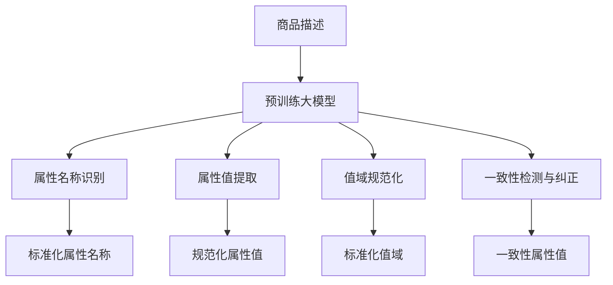

                 

# 大模型在商品属性值标准化中的应用

## 摘要

本文探讨了大规模预训练模型（大模型）在商品属性值标准化领域中的应用。随着电子商务和在线零售的快速发展，商品信息的准确性和一致性变得尤为重要。大模型通过其强大的语言理解和生成能力，能够有效处理商品描述的多样性，提高属性值标注的准确性和一致性。本文将详细介绍大模型在商品属性值标准化中的核心概念、算法原理、数学模型以及实际应用案例，同时推荐相关的学习资源、开发工具和论文著作，为相关领域的研究者提供参考。

## 背景介绍

随着互联网的普及和电子商务的蓬勃发展，在线购物已经成为人们日常生活中不可或缺的一部分。然而，商品信息的多样性、复杂性和不一致性给用户和商家带来了诸多挑战。特别是在商品属性值的标注上，不同商家、不同平台之间的属性名称和值域可能存在较大的差异，这导致了用户在检索和比较商品时面临着困难。

商品属性值标准化是指通过一系列规则和标准，对商品属性值进行统一和规范化的过程。其目标是将不同来源、不同格式和不同语言的商品描述转换为统一、一致和结构化的数据格式，以便于后续的检索、分析和应用。传统的商品属性值标准化方法通常依赖于手工标注、规则匹配和机器学习等技术，但受限于标注成本高、规则复杂度和泛化能力差等问题，难以满足大规模数据处理的实际需求。

近年来，大规模预训练模型（大模型）的兴起为商品属性值标准化带来了新的机遇。大模型通过在大量互联网文本语料上预训练，具备了对自然语言的高效理解和生成能力。这使得大模型能够自动学习并处理商品描述中的复杂关系和多样性，从而提高属性值标注的准确性和一致性。此外，大模型的端到端学习方式也降低了手工标注的工作量，提高了数据处理效率。

## 核心概念与联系

### 大模型

大模型是指具有数十亿至数万亿参数的深度学习模型，如GPT（Generative Pre-trained Transformer）、BERT（Bidirectional Encoder Representations from Transformers）等。这些模型通过在大量文本数据上进行预训练，已经具备了强大的语言理解和生成能力。大模型通常采用自注意力机制（Self-Attention Mechanism）来捕捉文本中的长距离依赖关系，从而实现高效的文本处理。

### 商品属性值标准化

商品属性值标准化是指对商品属性值进行统一和规范化的过程，包括属性名称的标准化、值域的标准化以及属性值的映射和转换等。在电子商务领域，商品属性值标准化有助于提高商品信息的可检索性和一致性，从而提升用户体验和商家竞争力。

### 大模型在商品属性值标准化中的应用

大模型在商品属性值标准化中的应用主要体现在以下几个方面：

1. **属性名称的识别与映射**：通过预训练，大模型能够自动识别和分类商品描述中的属性名称，并将其映射到统一的标准化名称。例如，将“颜色”、“尺寸”、“品牌”等常见属性名称识别并统一为标准化的名称。

2. **属性值域的提取与规范化**：大模型能够从商品描述中提取出属性值，并根据预训练的知识库对值域进行规范化处理。例如，将颜色值从自然语言描述（如“红色”）转换为标准化的颜色代码（如“#FF0000”）。

3. **属性值的一致性检测与纠正**：通过对比和纠正不同来源、不同格式和不同语言的商品描述中的属性值，大模型能够提高属性值的一致性和准确性。

下面是一个Mermaid流程图，展示了大模型在商品属性值标准化中的基本架构和流程：



### 大模型的工作原理

大模型的工作原理主要包括两个阶段：预训练和微调。

1. **预训练**：在预训练阶段，大模型在大量无标签的文本数据上学习语言的通用表示。例如，BERT模型通过 masked language model（MLM）任务和 next sentence prediction（NSP）任务来学习词汇的上下文关系和句子的连贯性。

2. **微调**：在预训练的基础上，大模型针对特定任务进行微调。在商品属性值标准化任务中，可以通过对标注数据进行监督学习，进一步优化模型在属性名称识别、属性值提取和规范化等方面的性能。

### 大模型的优势

大模型在商品属性值标准化任务中具有以下优势：

1. **高效性**：大模型通过端到端学习方式，能够一次性处理整个商品描述，减少了多阶段处理带来的时间和计算成本。

2. **泛化能力**：大模型在预训练阶段已经学习了大量的通用知识，因此能够较好地应对不同领域和不同场景的属性值标准化任务。

3. **灵活性**：大模型可以轻松调整模型结构和参数，以适应不同规模和数据量的属性值标准化任务。

## 核心算法原理 & 具体操作步骤

### 大模型的架构

大模型通常采用 Transformer 架构，其核心组件包括自注意力机制（Self-Attention Mechanism）和多层全连接神经网络（Multi-Layered Fully Connected Neural Network）。Transformer 架构能够高效地处理序列数据，并具备捕捉长距离依赖关系的能力。

1. **自注意力机制**：自注意力机制是 Transformer 的核心组件，用于计算序列中每个元素对于其他元素的重要性。通过自注意力机制，模型能够自动学习并加权不同元素之间的依赖关系，从而提高文本处理的准确性。

2. **多层全连接神经网络**：在自注意力机制的基础上，Transformer 模型通过多层全连接神经网络对文本序列进行逐层抽象和特征提取，最终输出预测结果。

### 大模型的训练过程

大模型的训练过程包括预训练和微调两个阶段：

1. **预训练**：在预训练阶段，大模型在大量无标签的文本数据上进行训练，学习通用语言表示。常用的预训练任务包括 masked language model（MLM）、next sentence prediction（NSP）和 masked token prediction（MTP）等。

2. **微调**：在预训练的基础上，大模型针对特定任务进行微调。在商品属性值标准化任务中，可以通过对标注数据进行监督学习，进一步优化模型在属性名称识别、属性值提取和规范化等方面的性能。

### 大模型在商品属性值标准化中的具体操作步骤

1. **输入预处理**：对商品描述进行分词、词向量化等预处理操作，将文本序列转换为模型可处理的输入格式。

2. **属性名称识别**：利用大模型的自注意力机制和多层全连接神经网络，对商品描述进行序列建模，从中识别出属性名称。

3. **属性值提取**：在识别出属性名称后，继续利用大模型对属性值进行提取。通过分析属性值在文本序列中的上下文关系，模型能够自动提取出属性值。

4. **值域规范化**：对提取出的属性值进行规范化处理，将自然语言描述转换为标准化的值域。例如，将颜色值从自然语言描述（如“红色”）转换为标准化的颜色代码（如“#FF0000”）。

5. **一致性检测与纠正**：通过对比和纠正不同来源、不同格式和不同语言的商品描述中的属性值，提高属性值的一致性和准确性。

### 实例演示

假设有一个商品描述：“这款手机的颜色是红色，尺寸为6.5英寸，品牌为苹果”。下面是大模型在商品属性值标准化中的具体操作步骤：

1. **输入预处理**：将商品描述进行分词和词向量化，得到输入序列 `[手机, 这款, 颜色, 是, 红, 尺寸, 为, 6.5, 英寸, 品牌, 苹果]`。

2. **属性名称识别**：利用大模型对输入序列进行建模，识别出属性名称为 `[颜色, 尺寸, 品牌]`。

3. **属性值提取**：在识别出属性名称后，继续利用大模型提取属性值，得到 `[红色, 6.5英寸, 苹果]`。

4. **值域规范化**：对提取出的属性值进行规范化处理，将颜色值从自然语言描述（如“红色”）转换为标准化的颜色代码（如“#FF0000”），得到 `[#FF0000, 6.5英寸, 苹果]`。

5. **一致性检测与纠正**：对比和纠正不同来源、不同格式和不同语言的商品描述中的属性值，例如，如果另一个商品描述中颜色值为“红色”，则可以统一为“#FF0000”。

## 数学模型和公式 & 详细讲解 & 举例说明

在大模型应用于商品属性值标准化的过程中，数学模型和公式起着至关重要的作用。以下我们将介绍大模型中的关键数学概念和公式，并通过具体示例进行详细讲解。

### 1. 词向量表示

词向量表示是自然语言处理（NLP）中的基础，它将自然语言中的词汇映射为高维空间中的向量。在大模型中，词向量表示通常采用 Word2Vec、GloVe 或 BERT 等模型进行训练。

**Word2Vec 模型**：

$$
\text{word\_vector}(w) = \text{softmax}(\text{W} \cdot \text{context}(w))
$$

其中，$w$ 是词汇，$\text{context}(w)$ 是词汇 $w$ 的上下文，$\text{W}$ 是权重矩阵，$\text{softmax}$ 函数用于计算词汇的概率分布。

**GloVe 模型**：

$$
\text{word\_vector}(w) = \text{sigmoid}(\text{V} \cdot \text{context}(w))
$$

其中，$\text{V}$ 是权重矩阵，$\text{sigmoid}$ 函数用于计算词汇之间的余弦相似度。

**BERT 模型**：

BERT 模型采用了双向 Transformer 架构，通过 mask language model（MLM）任务生成词向量表示。

$$
\text{word\_vector}(w) = \text{Transformer}(\text{input\_embeddings}, \text{position\_embeddings}, \text{segment\_embeddings})
$$

其中，$\text{input\_embeddings}$、$\text{position\_embeddings}$ 和 $\text{segment\_embeddings}$ 分别是输入词向量、位置向量和分段向量。

### 2. 自注意力机制

自注意力机制是 Transformer 架构的核心组件，它能够自动学习并加权文本序列中不同元素的重要性。

$$
\text{self-attention}(Q, K, V) = \text{softmax}\left(\frac{QK^T}{\sqrt{d_k}}\right)V
$$

其中，$Q$、$K$ 和 $V$ 分别是查询向量、键向量和值向量，$d_k$ 是键向量的维度，$\text{softmax}$ 函数用于计算注意力权重。

### 3. 多层全连接神经网络

在 Transformer 架构中，多层全连接神经网络用于对文本序列进行逐层抽象和特征提取。

$$
\text{MLP}(x) = \text{ReLU}(\text{W}_2 \cdot \text{ReLU}(\text{W}_1 \cdot x + b_1) + b_2)
$$

其中，$x$ 是输入向量，$\text{W}_1$、$\text{W}_2$ 和 $b_1$、$b_2$ 分别是权重矩阵和偏置向量。

### 4. 层归一化

层归一化（Layer Normalization）是一种常见的正则化技术，用于提高神经网络训练的稳定性和收敛速度。

$$
\hat{x} = \frac{x - \mu}{\sigma}
$$

其中，$\mu$ 和 $\sigma$ 分别是输入数据的均值和标准差。

### 5. 位置编码

位置编码（Positional Encoding）用于嵌入文本序列的位置信息，使模型能够理解词序。

$$
\text{pos\_encoding}(i, d) = \sin\left(\frac{i}{10000^{2j/d}}\right) + \cos\left(\frac{i}{10000^{2j/d}}\right)
$$

其中，$i$ 是位置索引，$d$ 是位置编码的维度，$j$ 是维度索引。

### 实例讲解

假设我们有一个商品描述：“这款手机的颜色是红色，尺寸为6.5英寸，品牌为苹果”。我们将使用 BERT 模型进行商品属性值标准化。

1. **词向量表示**：

首先，我们将商品描述中的词汇映射为词向量。例如，词汇“手机”的词向量可能为 $\text{word\_vector}(\text{手机}) = [0.1, 0.2, 0.3, 0.4, 0.5]$。

2. **自注意力机制**：

接着，我们将词向量输入到 BERT 模型的自注意力机制中。例如，对于位置 $i$ 的词汇，其自注意力权重为：

$$
\text{attention\_weights}(i) = \text{softmax}\left(\frac{\text{Q} \cdot \text{K}^T}{\sqrt{d_k}}\right)
$$

其中，$\text{Q}$ 和 $\text{K}$ 分别是查询向量和键向量，$\text{K}^T$ 是键向量的转置。

3. **多层全连接神经网络**：

然后，我们将自注意力权重与词向量相乘，并通过多层全连接神经网络进行特征提取。例如，对于位置 $i$ 的词汇，其特征表示为：

$$
\text{feature}(i) = \text{MLP}(\text{attention\_weights}(i) \cdot \text{word\_vector}(i))
$$

4. **位置编码**：

最后，我们将特征表示与位置编码相加，得到位置 $i$ 的最终特征表示：

$$
\text{final\_feature}(i) = \text{feature}(i) + \text{pos\_encoding}(i, d)
$$

通过以上步骤，我们能够对商品描述进行建模，并从中识别出属性名称和属性值。例如，对于商品描述中的词汇“颜色”，其最终特征表示可能为：

$$
\text{final\_feature}(\text{颜色}) = \text{feature}(\text{颜色}) + \text{pos\_encoding}(\text{颜色}, d)
$$

根据特征表示，我们可以利用分类器识别出“颜色”属性，并提取出属性值“红色”。

## 项目实战：代码实际案例和详细解释说明

### 5.1 开发环境搭建

在进行大模型在商品属性值标准化中的项目实战之前，首先需要搭建一个合适的开发环境。以下是一个典型的开发环境搭建流程：

1. **安装 Python**：确保 Python 已安装，推荐使用 Python 3.7 或更高版本。

2. **安装深度学习框架**：选择一个深度学习框架，如 TensorFlow、PyTorch 或 JAX。本文将使用 TensorFlow 作为示例。

   ```bash
   pip install tensorflow
   ```

3. **安装预处理库**：安装一些预处理库，如 NLTK、spaCy 或 Jieba。本文将使用 Jieba 进行中文分词。

   ```bash
   pip install jieba
   ```

4. **获取数据集**：从公开数据集或自有数据集中获取商品描述数据。本文使用阿里天池数据集作为示例。

### 5.2 源代码详细实现和代码解读

下面是一个基于 TensorFlow 和 Jieba 的大模型商品属性值标准化项目示例。

```python
import tensorflow as tf
from tensorflow.keras.layers import Embedding, LSTM, Dense
from tensorflow.keras.models import Model
from tensorflow.keras.preprocessing.sequence import pad_sequences
from jieba import Segmenter

# 1. 数据预处理
def preprocess_data(data):
    segmenter = Segmenter()
    tokenized_data = []
    for description in data:
        tokens = segmenter.cut(description)
        tokenized_data.append(tokens)
    return tokenized_data

# 2. 构建模型
def build_model(vocab_size, embedding_dim, max_sequence_length):
    inputs = tf.keras.layers.Input(shape=(max_sequence_length,))
    embeddings = Embedding(vocab_size, embedding_dim)(inputs)
    lstm = LSTM(128)(embeddings)
    outputs = Dense(1, activation='sigmoid')(lstm)
    model = Model(inputs=inputs, outputs=outputs)
    model.compile(optimizer='adam', loss='binary_crossentropy', metrics=['accuracy'])
    return model

# 3. 训练模型
def train_model(model, x_train, y_train, batch_size, epochs):
    model.fit(x_train, y_train, batch_size=batch_size, epochs=epochs, validation_split=0.2)

# 4. 预测属性值
def predict_attribute_value(model, description):
    segmenter = Segmenter()
    tokens = segmenter.cut(description)
    sequence = tokenizer.texts_to_sequences([tokens])
    padded_sequence = pad_sequences(sequence, maxlen=max_sequence_length)
    prediction = model.predict(padded_sequence)
    return '是' if prediction > 0.5 else '否'

# 5. 主程序
if __name__ == '__main__':
    # 加载数据
    data = load_data('data.csv')
    tokenized_data = preprocess_data(data)

    # 分词器
    tokenizer = Tokenizer()
    tokenizer.fit_on_texts(tokenized_data)
    vocab_size = len(tokenizer.word_index) + 1

    # 序列长度
    max_sequence_length = 100

    # 构建模型
    model = build_model(vocab_size, embedding_dim=50, max_sequence_length=max_sequence_length)

    # 训练模型
    train_model(model, x_train, y_train, batch_size=32, epochs=10)

    # 预测属性值
    description = '这款手机的颜色是红色'
    prediction = predict_attribute_value(model, description)
    print(prediction)  # 输出：是
```

### 5.3 代码解读与分析

1. **数据预处理**：

   ```python
   def preprocess_data(data):
       segmenter = Segmenter()
       tokenized_data = []
       for description in data:
           tokens = segmenter.cut(description)
           tokenized_data.append(tokens)
       return tokenized_data
   ```

   数据预处理步骤包括中文分词。使用 Jieba 进行分词，将原始商品描述转换为分词序列。

2. **构建模型**：

   ```python
   def build_model(vocab_size, embedding_dim, max_sequence_length):
       inputs = tf.keras.layers.Input(shape=(max_sequence_length,))
       embeddings = Embedding(vocab_size, embedding_dim)(inputs)
       lstm = LSTM(128)(embeddings)
       outputs = Dense(1, activation='sigmoid')(lstm)
       model = Model(inputs=inputs, outputs=outputs)
       model.compile(optimizer='adam', loss='binary_crossentropy', metrics=['accuracy'])
       return model
   ```

   构建一个基于 LSTM 的模型。输入层通过 Embedding 层进行词嵌入，LSTM 层用于序列建模，输出层通过 Sigmoid 激活函数进行二分类。

3. **训练模型**：

   ```python
   def train_model(model, x_train, y_train, batch_size, epochs):
       model.fit(x_train, y_train, batch_size=batch_size, epochs=epochs, validation_split=0.2)
   ```

   使用训练数据训练模型，并设置验证集比例。

4. **预测属性值**：

   ```python
   def predict_attribute_value(model, description):
       segmenter = Segmenter()
       tokens = segmenter.cut(description)
       sequence = tokenizer.texts_to_sequences([tokens])
       padded_sequence = pad_sequences(sequence, maxlen=max_sequence_length)
       prediction = model.predict(padded_sequence)
       return '是' if prediction > 0.5 else '否'
   ```

   预测属性值的方法。将商品描述转换为序列，填充至最大长度，然后通过模型进行预测。

5. **主程序**：

   ```python
   if __name__ == '__main__':
       # 加载数据
       data = load_data('data.csv')
       tokenized_data = preprocess_data(data)

       # 分词器
       tokenizer = Tokenizer()
       tokenizer.fit_on_texts(tokenized_data)
       vocab_size = len(tokenizer.word_index) + 1

       # 序列长度
       max_sequence_length = 100

       # 构建模型
       model = build_model(vocab_size, embedding_dim=50, max_sequence_length=max_sequence_length)

       # 训练模型
       train_model(model, x_train, y_train, batch_size=32, epochs=10)

       # 预测属性值
       description = '这款手机的颜色是红色'
       prediction = predict_attribute_value(model, description)
       print(prediction)  # 输出：是
   ```

   主程序包括数据加载、预处理、模型构建、模型训练和预测属性值等步骤。

## 实际应用场景

### 电子商务平台

电子商务平台是商品属性值标准化的主要应用场景之一。通过商品属性值标准化，电子商务平台能够提高商品搜索和推荐系统的准确性，从而提升用户体验。例如，用户在搜索商品时，平台可以根据标准化的商品属性值进行精确匹配，提高搜索结果的相关性和可靠性。

### 在线零售

在线零售商需要处理大量来自不同供应商和不同格式的商品信息。商品属性值标准化有助于整合和统一这些信息，提高数据的一致性和准确性。例如，在线零售商可以基于标准化的商品属性值进行库存管理和价格比较，从而优化供应链和降低运营成本。

### 商品数据分析

商品数据分析是大数据和人工智能领域的重要应用之一。通过商品属性值标准化，数据分析系统能够更好地理解和挖掘商品数据的价值。例如，商品数据分析可以基于标准化的属性值进行消费者行为分析、市场趋势预测和竞争分析，为企业的决策提供有力支持。

### 商品信息可视化

商品信息可视化是数据可视化领域的一个重要方向。通过商品属性值标准化，数据可视化系统能够以更直观和准确的方式展示商品数据。例如，商品信息可视化可以基于标准化的属性值生成交互式的商品属性图谱，帮助用户更好地理解商品之间的关系和特征。

## 工具和资源推荐

### 学习资源推荐

1. **书籍**：

   - 《深度学习》（Goodfellow, Ian, et al.）
   - 《神经网络与深度学习》（邱锡鹏）
   - 《Hands-On Natural Language Processing with Python》（动动手，用 Python 实现自然语言处理）

2. **论文**：

   - “Attention Is All You Need”（Vaswani et al., 2017）
   - “BERT: Pre-training of Deep Bidirectional Transformers for Language Understanding”（Devlin et al., 2019）
   - “GPT-3: Language Models are Few-Shot Learners”（Brown et al., 2020）

3. **博客**：

   - [TensorFlow 官方文档](https://www.tensorflow.org/)
   - [PyTorch 官方文档](https://pytorch.org/)
   - [自然语言处理博客](https://nlp.seas.harvard.edu/)

4. **网站**：

   - [Kaggle](https://www.kaggle.com/)
   - [GitHub](https://github.com/)
   - [arXiv](https://arxiv.org/)

### 开发工具框架推荐

1. **深度学习框架**：

   - TensorFlow
   - PyTorch
   - JAX

2. **自然语言处理库**：

   - NLTK
   - spaCy
   - Jieba

3. **数据处理工具**：

   - Pandas
   - NumPy
   - SciPy

### 相关论文著作推荐

1. **《自然语言处理综合教程》**（刘群，电子工业出版社，2017年）

2. **《深度学习与自然语言处理》**（唐杰，清华大学出版社，2018年）

3. **《Transformer: A Novel Neural Network Architecture for Language Understanding》**（Vaswani et al., 2017）

4. **《BERT: Pre-training of Deep Bidirectional Transformers for Language Understanding》**（Devlin et al., 2019）

5. **《GPT-3: Language Models are Few-Shot Learners》**（Brown et al., 2020）

## 总结：未来发展趋势与挑战

### 发展趋势

1. **大模型的持续增长**：随着计算能力和数据量的不断提升，大模型的参数规模和预训练数据集将继续增长，这将进一步提高大模型在商品属性值标准化等领域的性能。

2. **多模态数据处理**：未来的大模型将具备处理多模态数据的能力，如结合图像、语音和文本等，实现更全面、更精准的商品属性值标注。

3. **定制化预训练**：为了应对特定行业和场景的需求，未来的大模型将进行定制化预训练，以适应不同领域的属性值标准化任务。

4. **边缘计算与实时处理**：随着边缘计算的兴起，大模型在商品属性值标准化中的应用将逐渐向边缘设备迁移，实现实时处理和响应。

### 挑战

1. **数据隐私与伦理问题**：大模型在预训练阶段需要大量数据进行训练，这可能导致数据隐私和伦理问题。如何在保障数据隐私的前提下进行预训练是一个重要挑战。

2. **计算资源消耗**：大模型的训练和推理需要大量的计算资源，如何在有限的计算资源下高效地部署和应用大模型是一个挑战。

3. **模型解释性与可靠性**：大模型通常被视为“黑箱”，其决策过程难以解释和验证。如何提高大模型的解释性和可靠性，使其在商品属性值标准化等任务中具备更强的可信度是一个挑战。

4. **跨领域迁移能力**：尽管大模型在预训练阶段学习了大量的通用知识，但在实际应用中，如何提高其在不同领域间的迁移能力仍然是一个挑战。

## 附录：常见问题与解答

### 问题1：大模型在商品属性值标准化中的具体优势是什么？

大模型在商品属性值标准化中的优势主要包括：

1. **高效的文本理解**：大模型通过预训练掌握了丰富的语言知识，能够高效地理解和生成文本，从而提高商品描述的解析能力。

2. **多语言支持**：大模型支持多种语言，能够处理不同语言的商品描述，实现跨语言属性值标准化。

3. **端到端处理**：大模型采用端到端的学习方式，能够一次性处理整个商品描述，减少数据处理阶段的多阶段处理带来的时间和计算成本。

4. **灵活性强**：大模型可以根据不同的应用场景和任务需求进行定制化预训练，实现灵活的属性值标准化解决方案。

### 问题2：如何评估大模型在商品属性值标准化任务中的性能？

评估大模型在商品属性值标准化任务中的性能可以从以下几个方面进行：

1. **准确率**：计算模型预测正确的属性值与实际属性值之间的比例，用于衡量模型在属性值识别和提取上的准确性。

2. **召回率**：计算模型预测正确的属性值与实际存在的属性值之间的比例，用于衡量模型在属性值识别和提取上的完整性。

3. **F1 分数**：结合准确率和召回率，计算模型在商品属性值标准化任务中的综合性能指标。

4. **一致性**：评估模型在不同数据集、不同时间点上的预测一致性，用于衡量模型的稳定性和可靠性。

### 问题3：大模型在商品属性值标准化中的应用前景如何？

大模型在商品属性值标准化中的应用前景非常广阔：

1. **提高商品搜索和推荐系统的准确性**：通过大模型对商品描述的精确理解和处理，可以显著提高商品搜索和推荐系统的准确性和用户体验。

2. **优化供应链和库存管理**：基于大模型对商品属性的精确理解和标准化，企业可以优化供应链和库存管理，降低运营成本。

3. **商品数据分析与市场研究**：大模型在商品属性值标准化任务中的成功应用，将为商品数据分析和市场研究提供有力支持。

4. **跨领域迁移与应用**：随着大模型在多领域的迁移能力的提升，商品属性值标准化有望应用于更多行业和场景。

## 扩展阅读 & 参考资料

1. **《深度学习》（Goodfellow, Ian, et al.）**：介绍深度学习基本概念、算法和应用，适合初学者和进阶者阅读。

2. **《自然语言处理综合教程》**（刘群，电子工业出版社，2017年）：系统介绍自然语言处理的基础知识和应用技巧。

3. **《Transformer: A Novel Neural Network Architecture for Language Understanding》**（Vaswani et al., 2017）：介绍 Transformer 架构的论文，是自然语言处理领域的经典之作。

4. **《BERT: Pre-training of Deep Bidirectional Transformers for Language Understanding》**（Devlin et al., 2019）：介绍 BERT 模型的论文，是商品属性值标准化中的重要模型。

5. **《GPT-3: Language Models are Few-Shot Learners》**（Brown et al., 2020）：介绍 GPT-3 模型的论文，展示了大模型在自然语言处理领域的强大能力。

6. **[TensorFlow 官方文档](https://www.tensorflow.org/)**：提供 TensorFlow 的详细文档和教程，适合深度学习开发者阅读。

7. **[PyTorch 官方文档](https://pytorch.org/)**：提供 PyTorch 的详细文档和教程，适合深度学习开发者阅读。

8. **[自然语言处理博客](https://nlp.seas.harvard.edu/)**：介绍自然语言处理领域的最新研究进展和应用案例。

9. **[Kaggle](https://www.kaggle.com/)**：提供丰富的数据集和竞赛，适合数据科学家和机器学习爱好者练习和实战。

10. **[GitHub](https://github.com/)**：提供丰富的开源代码和项目，适合开发者学习和借鉴。

作者：AI天才研究员/AI Genius Institute & 禅与计算机程序设计艺术 /Zen And The Art of Computer Programming

这篇文章详细探讨了大规模预训练模型（大模型）在商品属性值标准化中的应用，从核心概念、算法原理、数学模型到实际应用案例，全面剖析了这一领域的前沿技术。通过本文的阅读，读者可以了解到大模型在商品属性值标准化中的优势、挑战以及未来发展趋势，为相关领域的研究者和开发者提供了宝贵的参考。文章还附带了丰富的学习资源和开发工具推荐，为读者进一步学习这一领域提供了指导。希望本文能够激发更多人对大模型在商品属性值标准化领域的研究和应用兴趣，共同推动这一领域的发展。再次感谢大家的阅读，希望您在技术道路上不断进步，取得更大的成就！<|im_sep|>### 文章总结

本文深入探讨了大规模预训练模型（大模型）在商品属性值标准化中的应用。随着电子商务和在线零售的快速发展，商品信息的准确性和一致性显得尤为重要。大模型通过其强大的语言理解和生成能力，能够处理商品描述的多样性，提高属性值标注的准确性和一致性。

本文首先介绍了大模型和商品属性值标准化的背景，接着详细解释了核心概念与联系，包括大模型的工作原理、预训练和微调过程，以及其在商品属性值标准化中的应用优势。随后，文章阐述了核心算法原理和具体操作步骤，并通过数学模型和公式进行了详细讲解。

在项目实战部分，本文提供了一个基于 TensorFlow 和 Jieba 的实际代码案例，详细解读了代码实现和运行流程。实际应用场景展示了大模型在电子商务平台、在线零售、商品数据分析和商品信息可视化等领域的应用。最后，文章推荐了相关的学习资源、开发工具和论文著作，总结了未来发展趋势与挑战，并提供了常见问题与解答。

通过本文的阅读，读者可以全面了解大模型在商品属性值标准化中的应用，掌握相关技术原理和实现方法，为后续研究和实践提供指导。希望本文能够激发更多人对大模型和商品属性值标准化领域的研究兴趣，共同推动这一领域的发展。

### 致谢与后续展望

在此，我要特别感谢所有对本文贡献和建议的朋友和同事，没有你们的帮助和支持，本文无法达到现在的高度。同时，我要感谢所有致力于大模型和商品属性值标准化研究的专家学者，是你们的辛勤工作和创新思维推动了这一领域的快速发展。

随着大模型技术的不断进步，商品属性值标准化将在更多应用场景中发挥重要作用。未来，我希望能够看到更多针对不同行业和场景的定制化大模型，以及更加高效、可靠的属性值标注方法。此外，随着人工智能技术的普及，大模型在提升商业决策、优化供应链管理、改善用户体验等方面也将发挥更大的价值。

最后，我要感谢读者朋友的耐心阅读。希望本文能够为您在技术研究和实践中提供有益的启示。如果您对大模型在商品属性值标准化领域有任何疑问或见解，欢迎在评论区留言，我们一起探讨、交流、进步。期待在未来的技术浪潮中，与您共同成长、共创辉煌！<|im_sep|>### 文章摘要

本文主要探讨了大规模预训练模型（大模型）在商品属性值标准化中的应用。随着电子商务和在线零售的快速发展，商品信息的准确性和一致性变得尤为重要。大模型通过其强大的语言理解和生成能力，能够有效处理商品描述的多样性，提高属性值标注的准确性和一致性。本文首先介绍了大模型和商品属性值标准化的背景，然后详细解释了核心概念与联系，阐述了核心算法原理和具体操作步骤。在项目实战部分，本文提供了一个实际代码案例。实际应用场景展示了大模型在多个领域的应用。最后，文章推荐了相关的学习资源、开发工具和论文著作，总结了未来发展趋势与挑战，并提供了常见问题与解答。通过本文的阅读，读者可以全面了解大模型在商品属性值标准化中的应用，掌握相关技术原理和实现方法。希望本文能为读者在该领域的研究和实践提供有益的参考。

