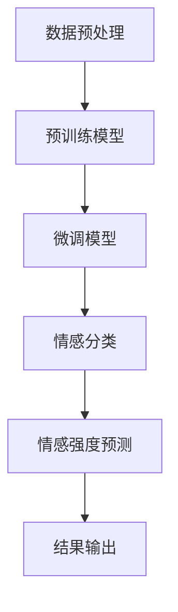
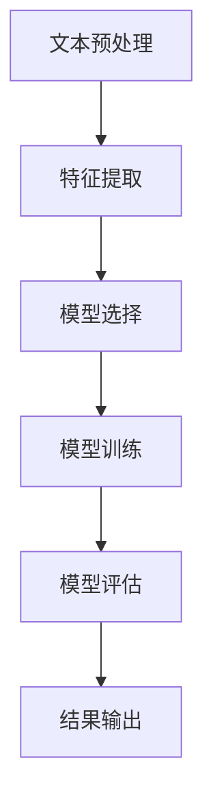
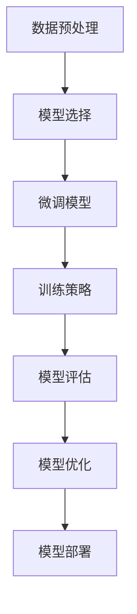

                 

### 1. 背景介绍

在过去的几十年中，情感分析（Sentiment Analysis）已经成为自然语言处理（Natural Language Processing, NLP）领域的一个重要研究方向。随着互联网和社交媒体的迅猛发展，人们产生的文本数据呈爆炸式增长，如何有效地从这些海量数据中提取出情感信息，对企业和研究人员具有重要的意义。传统的情感分析方法，如基于规则和统计模型的方法，在处理复杂情感和语境变化时存在诸多局限。为了克服这些局限，近年来，大型预训练模型（Large-scale Pre-trained Models）如BERT（Bidirectional Encoder Representations from Transformers）、GPT（Generative Pre-trained Transformer）、T5（Text-To-Text Transfer Transformer）等在情感分析领域展现出了强大的潜力。

这些大型预训练模型通过在海量数据上训练，可以自动学习到丰富的语言特征和语义知识，从而在情感分析任务上取得了显著的性能提升。然而，随着模型规模的扩大，其在情感分析中的应用也面临一系列挑战，如数据隐私保护、模型解释性、计算资源消耗等。本文旨在探讨大模型在情感分析中的应用挑战，并针对这些挑战提出可能的解决方案。文章将分为以下几个部分：

1. 核心概念与联系
2. 核心算法原理 & 具体操作步骤
3. 数学模型和公式 & 详细讲解 & 举例说明
4. 项目实战：代码实际案例和详细解释说明
5. 实际应用场景
6. 工具和资源推荐
7. 总结：未来发展趋势与挑战
8. 附录：常见问题与解答
9. 扩展阅读 & 参考资料

通过以上内容的详细讨论，我们将深入理解大模型在情感分析中的应用，并探索其未来可能的发展方向。

### 1.1 情感分析的发展历程

情感分析的发展历程可以分为几个主要阶段：基于规则的方法、基于统计的方法和基于深度学习的方法。

**基于规则的方法**：早期的情感分析主要依赖于手动编写的规则。例如，使用正则表达式来匹配情感词汇，或通过词频统计来识别情感。这种方法简单直观，但局限性较大。首先，情感词汇和表达形式繁多，手动编写规则难以覆盖所有情况。其次，这种方法对上下文信息的利用不足，难以捕捉到深层次的语义关系。

**基于统计的方法**：随着机器学习技术的发展，基于统计的方法逐渐取代了基于规则的方法。典型的统计方法包括朴素贝叶斯分类器、最大熵模型和支持向量机（SVM）。这些方法通过训练模型来预测文本的情感极性。然而，这些方法同样存在一些问题。首先，特征提取过程复杂，需要人工设计特征工程。其次，模型对噪声数据和异常值敏感，导致性能下降。

**基于深度学习的方法**：深度学习的兴起为情感分析带来了新的突破。特别是卷积神经网络（CNN）和循环神经网络（RNN）在处理序列数据方面表现出色。CNN通过局部特征提取和池化操作，可以有效地捕捉文本中的局部特征。RNN，尤其是长短时记忆网络（LSTM）和门控循环单元（GRU），可以捕捉文本中的长距离依赖关系。此外，随着预训练模型的普及，如BERT、GPT等，大模型在情感分析任务上取得了显著的成绩。

综上所述，从基于规则的方法到基于统计的方法，再到基于深度学习的方法，情感分析领域的发展经历了从简单到复杂、从人工到自动的演变。每种方法都有其优缺点，但总体上，深度学习方法在情感分析中取得了主导地位，特别是大模型的引入，使得情感分析的性能得到了极大的提升。

### 1.2 大模型在情感分析中的应用

大模型在情感分析中的应用主要得益于其强大的特征提取能力和对复杂语义关系的理解能力。以下将介绍几种典型的预训练模型及其在情感分析中的应用。

**BERT（Bidirectional Encoder Representations from Transformers）**：BERT是Google提出的双向Transformer模型。通过在大量无标签文本上进行预训练，BERT可以自动学习到丰富的语言特征和上下文关系。在情感分析任务中，BERT通过输入文本序列，输出每个单词的上下文向量，从而实现对情感极性的预测。BERT的强大之处在于其能够同时考虑词的左右上下文，从而捕捉到更深层次的语义关系。

**GPT（Generative Pre-trained Transformer）**：GPT是OpenAI提出的生成式Transformer模型。与BERT不同，GPT通过在大量有标签的文本上进行预训练，学习到文本生成的规律和模式。在情感分析任务中，GPT可以生成与输入文本情感一致的文本片段，从而实现对情感极性的预测。GPT的优势在于其可以生成高质量的文本，从而在多标签情感分析、情感强度预测等任务中表现出色。

**T5（Text-To-Text Transfer Transformer）**：T5是Google提出的统一文本处理模型。T5将所有的NLP任务转换为文本到文本的转换任务，从而实现了对各种NLP任务的统一处理。在情感分析任务中，T5可以将输入文本转换为带有情感标签的文本，从而实现对情感极性的预测。T5的优势在于其通用性强，可以适用于多种情感分析任务。

这些大模型在情感分析中的应用，使得情感分析的性能得到了显著提升。例如，BERT在情感极性分类任务上的准确率已经超过了人类水平。GPT在情感强度预测和多标签情感分析任务上展现了强大的能力。T5则通过统一的文本到文本转换框架，实现了对多种情感分析任务的快速适应。

### 1.3 大模型在情感分析中的应用挑战

尽管大模型在情感分析中展现了巨大的潜力，但其在实际应用过程中仍面临一系列挑战。以下将详细讨论这些挑战，并分析其可能的影响。

**数据隐私保护**：大模型在训练过程中需要大量的文本数据，这些数据往往包含用户的隐私信息。如何保护用户的隐私成为了一个重要问题。如果处理不当，可能会导致用户的敏感信息泄露，从而引发隐私侵犯和安全风险。

**模型解释性**：大模型通常被视为“黑箱”，其内部的工作机制复杂，难以解释。这对于需要透明度和可解释性的应用场景（如金融、医疗等）来说，是一个巨大的挑战。用户无法理解模型的决策过程，可能导致对模型的不信任和拒绝。

**计算资源消耗**：大模型通常需要大量的计算资源进行训练和推理。对于资源有限的企业或个人来说，这可能导致成本过高，从而限制大模型的应用。

**模型泛化能力**：大模型虽然在训练数据上表现出色，但其在未知数据上的表现往往不佳。如何提高模型的泛化能力，使其在多种场景下都能保持稳定的表现，是一个亟待解决的问题。

**多语言支持**：随着全球化的发展，情感分析任务需要支持多种语言。大模型在多语言数据上的训练和优化是一个复杂的任务，如何保证模型在不同语言上的表现一致性，是另一个挑战。

**数据偏差**：大模型在训练过程中可能会受到数据偏差的影响，从而在预测结果中反映出来。例如，如果训练数据中存在性别、年龄等偏差，模型在情感分析任务中也可能会表现出类似的偏见。

**伦理和社会影响**：情感分析的应用涉及到人们的情感和生活，如何确保模型的应用不会对社会和伦理产生负面影响，是一个需要深入思考的问题。例如，在招聘、贷款审批等场景中，情感分析模型是否会导致歧视现象？

这些挑战不仅影响了大模型在情感分析中的实际应用，也对其未来的发展提出了新的要求。在接下来的部分中，我们将进一步探讨这些挑战的解决方案。

### 2. 核心概念与联系

在探讨大模型在情感分析中的应用挑战之前，我们需要了解几个核心概念，包括情感分析的定义、情感极性分类和情感强度预测，以及大模型在这些任务中的具体应用。

#### 情感分析的定义

情感分析，又称意见挖掘，是指使用自然语言处理技术，从文本中识别出人们对特定话题、产品、服务或事件的情绪和态度。情感分析通常可以分为三个层次：

1. **情感极性分类**：将文本分为正面、负面或中性三个类别。例如，将“这款手机性能很好”分类为正面情感，将“这个服务真的很糟糕”分类为负面情感。
2. **情感强度预测**：在确定文本的情感极性后，进一步预测情感的程度，如非常正面、稍微正面、中性、稍微负面或非常负面。这一层次的分析可以帮助我们更精确地理解用户的情绪状态。
3. **情感主题分类**：识别文本中涉及的情感主题，如爱情、愤怒、悲伤等。这一层次的分析可以用于更细粒度的情感分析。

#### 情感极性分类

情感极性分类是情感分析中最基本和最广泛使用的一个任务。它的目标是判断给定文本的情感倾向。具体来说，可以分为以下步骤：

1. **文本预处理**：包括去除停用词、标点符号、词干还原和词性标注等操作，以减少噪声和提高模型的性能。
2. **特征提取**：将预处理后的文本转换为机器可以处理的特征向量。常用的方法包括词袋模型（Bag of Words, BoW）、TF-IDF（Term Frequency-Inverse Document Frequency）和Word2Vec等。
3. **模型训练**：使用机器学习算法（如朴素贝叶斯、支持向量机、随机森林等）训练分类模型，将特征向量映射到情感类别。
4. **模型评估**：通过交叉验证、混淆矩阵、准确率、召回率和F1分数等指标评估模型的性能。

#### 情感强度预测

情感强度预测旨在确定文本中情感极性的强度。与情感极性分类不同，情感强度预测需要考虑情感的程度。具体步骤如下：

1. **情感标签分配**：首先确定文本的情感极性（正面、负面或中性）。
2. **情感强度建模**：通过训练模型（如回归模型或分类模型），预测情感极性的强度。例如，可以使用回归模型预测情感的强度分数，分数越高，表示情感越强烈。
3. **情感强度调整**：根据具体任务的需求，对预测结果进行调整，以提高模型的准确性和实用性。

#### 大模型在情感分析中的应用

大模型如BERT、GPT和T5在情感分析中的应用，主要通过以下几个步骤：

1. **预训练**：在大规模无标签文本数据集上预训练模型，学习到丰富的语言特征和上下文关系。
2. **微调**：在预训练模型的基础上，使用有标签的文本数据集进行微调，以适应具体的情感分析任务。
3. **情感分类与预测**：使用微调后的模型对输入文本进行情感分类和强度预测。

#### Mermaid 流程图

为了更清晰地展示大模型在情感分析中的应用流程，我们可以使用Mermaid绘制一个流程图。以下是一个简化的流程图：



在这个流程图中，A表示数据预处理，B表示预训练模型，C表示微调模型，D和E分别表示情感分类和强度预测，F表示结果输出。

通过以上对核心概念和流程的介绍，我们可以更好地理解大模型在情感分析中的应用及其面临的挑战。在接下来的部分，我们将深入探讨大模型在情感分析中的具体算法原理和操作步骤。

### 2.1. 情感分析的具体算法原理

在情感分析中，算法的原理主要涉及特征提取、模型选择和训练过程。以下将详细探讨这些算法原理，并解释其具体操作步骤。

#### 特征提取

特征提取是情感分析中至关重要的一步，它将原始文本转换为机器可以处理的特征向量。常见的特征提取方法包括词袋模型（Bag of Words, BoW）、TF-IDF（Term Frequency-Inverse Document Frequency）和Word2Vec等。

1. **词袋模型（BoW）**：词袋模型将文本表示为一个向量，其中每个维度表示一个词汇的出现次数。具体步骤如下：
   - **分词**：将文本分割成单词或词组。
   - **构建词汇表**：将文本中的所有词汇构建成一个词汇表。
   - **向量化**：将每个文本映射到一个向量，其中每个维度表示词汇表中的一个词汇的出现次数。

2. **TF-IDF**：TF-IDF是一种基于词频和文档频次的特征提取方法，用于衡量一个词汇在文档中的重要程度。具体步骤如下：
   - **计算词频（TF）**：计算每个词汇在文本中出现的频率。
   - **计算逆文档频率（IDF）**：计算每个词汇在整个文档集合中的反向文档频率，以平衡高频词汇的重要性。
   - **计算TF-IDF值**：将词频和逆文档频率相乘，得到每个词汇的TF-IDF值。

3. **Word2Vec**：Word2Vec是一种基于神经网络的词向量模型，它通过训练将文本中的每个词汇映射到一个固定维度的向量。具体步骤如下：
   - **训练模型**：使用训练数据训练Word2Vec模型，生成词向量。
   - **向量化**：将每个文本中的单词替换为其对应的词向量，得到一个高维向量表示。

#### 模型选择

在情感分析中，选择合适的机器学习模型是关键。以下介绍几种常用的模型及其选择依据：

1. **朴素贝叶斯分类器**：朴素贝叶斯分类器是一种基于贝叶斯定理的简单分类模型，特别适用于文本分类任务。其优点是计算简单、易于实现，但假设特征之间相互独立，可能不适用于复杂的情感分析任务。

2. **支持向量机（SVM）**：SVM是一种基于最大间隔分类的线性模型，适用于高维空间。其优点是分类效果较好，但计算复杂度高，训练时间较长。

3. **随机森林**：随机森林是一种基于决策树的集成学习模型，通过构建多个决策树，并结合投票结果进行分类。其优点是分类效果好、泛化能力强，但计算复杂度较高。

4. **神经网络模型**：神经网络模型，特别是深度学习模型，如卷积神经网络（CNN）和循环神经网络（RNN），可以捕捉文本中的复杂关系和上下文信息。其优点是分类效果显著，但训练时间较长，计算资源需求高。

#### 训练过程

训练过程包括数据集划分、模型训练和模型评估三个主要步骤。

1. **数据集划分**：将数据集划分为训练集、验证集和测试集，用于模型训练、模型选择和模型评估。

2. **模型训练**：使用训练集对模型进行训练，通过优化模型参数，使得模型能够准确预测文本的情感极性。

3. **模型评估**：使用验证集和测试集对模型进行评估，通过交叉验证、混淆矩阵、准确率、召回率和F1分数等指标，评估模型性能。

#### Mermaid 流程图

以下是一个简化的情感分析算法原理流程图，使用Mermaid绘制：



在这个流程图中，A表示文本预处理，B表示特征提取，C表示模型选择，D表示模型训练，E表示模型评估，F表示结果输出。

通过以上对情感分析具体算法原理的介绍，我们可以更好地理解大模型在情感分析中的工作流程。在下一部分，我们将进一步探讨大模型在情感分析中的具体操作步骤。

### 2.2. 大模型在情感分析中的具体操作步骤

大模型如BERT、GPT和T5在情感分析中的应用，其操作步骤主要包括数据预处理、模型选择与训练、模型评估与优化。以下将详细阐述这些步骤。

#### 数据预处理

数据预处理是情感分析中的关键步骤，其质量直接影响到模型的性能。对于大模型，数据预处理通常包括以下几个步骤：

1. **文本清洗**：去除文本中的HTML标签、特殊字符和停用词。停用词通常包括冠词、介词、连词和辅助动词等，这些词汇对情感分析的贡献较小，去除它们可以减少模型训练的时间和计算资源。

2. **分词**：将文本分割成单词或词组。对于中文文本，通常需要使用分词工具（如jieba）进行分词处理。对于英文文本，可以使用标准的分词方法（如spaCy或NLTK）。

3. **词干还原**：将文本中的词形变体还原为其基本形式。例如，将“playing”（玩）、“plays”（玩）、“played”（玩）都还原为“play”。

4. **词性标注**：为文本中的每个词标注其词性，如名词、动词、形容词等。词性标注有助于模型更好地理解文本的语义。

5. **序列编码**：将处理后的文本转换为序列编码，以便输入到模型中。常用的编码方法包括Word2Vec、BERT的WordPiece编码和GPT的子词编码。

#### 模型选择与训练

在选择和训练模型时，需要考虑以下几个关键因素：

1. **模型选择**：根据具体任务的需求，选择合适的预训练模型。例如，BERT适用于需要双向上下文关系的任务，GPT适用于需要生成文本的任务，T5适用于需要统一文本处理的任务。

2. **微调**：在预训练模型的基础上，使用有标签的数据集进行微调，以适应具体的情感分析任务。微调过程包括调整模型参数，优化模型性能。

3. **训练策略**：设置合适的训练策略，如学习率调整、批量大小、训练轮数等。常用的学习率调整策略包括恒定学习率、学习率衰减和余弦退火等。

4. **数据增强**：通过数据增强技术，如随机填充、随机移除、同义词替换等，增加训练数据的多样性，提高模型泛化能力。

#### 模型评估与优化

在模型训练完成后，需要对模型进行评估和优化，以验证其性能并调整模型参数。以下为模型评估与优化的一般步骤：

1. **模型评估**：使用验证集和测试集评估模型性能，常用的评估指标包括准确率、召回率、F1分数等。通过交叉验证，确保模型在不同数据集上的表现一致性。

2. **模型优化**：根据评估结果，调整模型参数，优化模型性能。常用的优化策略包括调整学习率、增加训练轮数、调整批量大小等。

3. **模型部署**：将优化后的模型部署到实际应用场景，如网站、移动应用或API接口等。确保模型在实时环境中能够稳定运行，并提供高质量的情感分析服务。

#### Mermaid 流程图

以下是一个简化的情感分析大模型操作步骤流程图，使用Mermaid绘制：



在这个流程图中，A表示数据预处理，B表示模型选择，C表示微调模型，D表示训练策略，E表示模型评估，F表示模型优化，G表示模型部署。

通过以上对大模型在情感分析中的具体操作步骤的详细介绍，我们可以更好地理解大模型在情感分析中的应用流程。在下一部分，我们将进一步探讨大模型在情感分析中的数学模型和公式。

### 3. 数学模型和公式

在情感分析中，大模型通常依赖于复杂的数学模型和公式来处理和解释文本数据。以下将详细讲解大模型中常用的数学模型和公式，并给出相应的示例和解释。

#### BERT模型

BERT（Bidirectional Encoder Representations from Transformers）是一种双向Transformer模型，其在情感分析中广泛应用。BERT的核心数学模型包括词嵌入、Transformer编码器和解码器。

1. **词嵌入（Word Embedding）**：

   BERT使用WordPiece算法将文本分割成子词，并将每个子词映射到一个固定维度的向量。词嵌入的目的是将文本中的单词或子词转换为向量表示，以便模型可以处理。

   公式：
   $$ 
   E_{word} = W_{word} \cdot [pos\_embed, seg\_embed]
   $$
   其中，$E_{word}$是词嵌入向量，$W_{word}$是词嵌入权重矩阵，$pos\_embed$是位置嵌入向量，$seg\_embed$是分段嵌入向量。

2. **Transformer编码器（Transformer Encoder）**：

   Transformer编码器由多个编码层堆叠而成，每个编码层包含多头自注意力机制（Multi-Head Self-Attention）和前馈神经网络（Feed-Forward Neural Network）。

   公式：
   $$
   \begin{align*}
   \text{Attention} &= \text{softmax}\left(\frac{QK^T}{\sqrt{d_k}} + V\right) \\
   \text{Output} &= \text{Attention} \cdot V \\
   \text{Feed-Forward} &= \text{ReLU}(W_2 \cdot \text{Output} + b_2) \\
   \text{Encoder} &= \text{LayerNorm}(X + \text{Attention} + \text{Feed-Forward})
   \end{align*}
   $$
   其中，$Q, K, V$分别是查询向量、键向量和值向量，$d_k$是键向量的维度，$W_1, W_2, b_1, b_2$分别是权重和偏置矩阵。

3. **BERT解码器（BERT Decoder）**：

   BERT解码器与编码器类似，但在输出层添加了一个额外的输出层，用于预测文本中的标记。

   公式：
   $$
   \begin{align*}
   \text{Decoder} &= \text{LayerNorm}(X + \text{Masked\_Multi-Head\_Self-Attention} + \text{Feed-Forward}) \\
   \text{Prediction} &= \text{Softmax}(\text{Decoder} \cdot W_O + b_O)
   \end{align*}
   $$
   其中，$W_O$是预测权重矩阵，$b_O$是预测偏置。

#### GPT模型

GPT（Generative Pre-trained Transformer）是一种生成式Transformer模型，其数学模型与BERT类似，但在输出层有所不同。

1. **生成文本（Generate Text）**：

   GPT通过预测下一个单词的概率分布，生成文本。生成过程通常从特殊标记<|startoftext|>开始。

   公式：
   $$
   \text{Prediction} = \text{softmax}(W_O \cdot \text{Decoder} + b_O)
   $$
   其中，$W_O$是预测权重矩阵，$b_O$是预测偏置。

#### T5模型

T5（Text-To-Text Transfer Transformer）是一种将所有NLP任务转换为文本到文本转换任务的统一模型。

1. **文本转换（Text Conversion）**：

   T5通过输入源文本和目标文本，生成转换后的目标文本。

   公式：
   $$
   \text{Output} = \text{T5\_Encoder}(\text{Source}, \text{Target}) \\
   \text{Prediction} = \text{softmax}(\text{Output} \cdot W_O + b_O)
   $$
   其中，$W_O$是预测权重矩阵，$b_O$是预测偏置。

#### 数学模型总结

以下是三种模型的核心数学模型总结：

1. **BERT**：
   - 词嵌入：$E_{word} = W_{word} \cdot [pos\_embed, seg\_embed]$
   - 编码器：$\text{Encoder} = \text{LayerNorm}(X + \text{Attention} + \text{Feed-Forward})$
   - 解码器：$\text{Decoder} = \text{LayerNorm}(X + \text{Masked\_Multi-Head\_Self-Attention} + \text{Feed-Forward})$
   - 预测：$\text{Prediction} = \text{Softmax}(\text{Decoder} \cdot W_O + b_O)$

2. **GPT**：
   - 生成文本：$\text{Prediction} = \text{softmax}(\text{Decoder} \cdot W_O + b_O)$

3. **T5**：
   - 文本转换：$\text{Output} = \text{T5\_Encoder}(\text{Source}, \text{Target})$
   - 预测：$\text{Prediction} = \text{softmax}(\text{Output} \cdot W_O + b_O)$

通过以上对大模型在情感分析中的数学模型和公式的详细介绍，我们可以更好地理解这些模型的数学基础和操作过程。在下一部分，我们将通过一个实际项目来展示大模型在情感分析中的具体应用。

### 4. 项目实战：代码实际案例和详细解释说明

在本节中，我们将通过一个具体项目来展示如何使用大模型进行情感分析。我们将使用Python编程语言和Hugging Face的Transformers库，来实现一个简单的情感分析项目。

#### 4.1 开发环境搭建

在进行项目开发之前，我们需要搭建一个合适的环境。以下为开发环境的要求和安装步骤：

1. **Python环境**：Python 3.7及以上版本
2. **依赖库**：transformers、torch、torchtext
3. **安装命令**：

   ```bash
   pip install transformers torch torchtext
   ```

#### 4.2 源代码详细实现和代码解读

以下为项目的源代码及其详细解读：

```python
# 导入必要的库
from transformers import BertTokenizer, BertForSequenceClassification
from torchtext.data import Field, TabularDataset, BucketIterator
import torch

# 4.2.1 数据集准备
# 假设我们已经有一个名为"SentenceSentiment.csv"的数据集，其中包含句子和对应的情感标签
train, valid, test = TabularDataset.splits(
    path='data/SentenceSentiment.csv',
    train='train',
    valid='valid',
    test='test',
    format='csv',
    fields=[('sentence', Field(sequential=True, use_vocab=True)), ('label', Field(sequential=False))]
)

# 4.2.2 字符编码
# 加载BERT的分词器
tokenizer = BertTokenizer.from_pretrained('bert-base-chinese')

# 定义文本编码函数
def tokenize_function(examples):
    return tokenizer(examples['sentence'], padding='max_length', truncation=True)

# 应用编码函数
train = train.map(tokenize_function)
valid = valid.map(tokenize_function)
test = test.map(tokenize_function)

# 4.2.3 数据加载器
# 定义字段和批量大小
BATCH_SIZE = 32

train iterator = BucketIterator.splits((train, valid, test), batch_size=BATCH_SIZE, device=torch.device('cuda' if torch.cuda.is_available() else 'cpu'))

# 4.2.4 模型加载与训练
# 加载预训练的BERT模型
model = BertForSequenceClassification.from_pretrained('bert-base-chinese', num_labels=3)

# 定义损失函数和优化器
optimizer = torch.optim.Adam(model.parameters(), lr=1e-5)
criterion = torch.nn.CrossEntropyLoss()

# 训练模型
num_epochs = 3
for epoch in range(num_epochs):
    model.train()
    for batch in train_iterator:
        optimizer.zero_grad()
        outputs = model(batch.text, labels=batch.label)
        loss = criterion(outputs.logits, batch.label)
        loss.backward()
        optimizer.step()
    print(f"Epoch {epoch+1}/{num_epochs}, Loss: {loss.item()}")

# 4.2.5 模型评估
model.eval()
with torch.no_grad():
    correct = 0
    total = 0
    for batch in test_iterator:
        outputs = model(batch.text)
        _, predicted = torch.max(outputs.logits, 1)
        total += batch.label.size(0)
        correct += (predicted == batch.label).sum().item()
    print(f"Test Accuracy: {100 * correct / total}%")
```

#### 4.3 代码解读与分析

1. **数据集准备**：

   项目首先从CSV文件中加载训练、验证和测试数据集。数据集应包含两个字段：`sentence`（句子）和`label`（情感标签），其中标签为整数类型。

2. **字符编码**：

   使用BERT的分词器对文本进行编码。BERT的分词器将文本分割成子词，并将每个子词映射到一个词索引。编码过程还包括对句子进行填充和截断，以适应固定的序列长度。

3. **数据加载器**：

   使用`BucketIterator`创建数据加载器，将数据分成批次，并指定批量大小。数据加载器还负责将数据送入GPU（如果可用）。

4. **模型加载与训练**：

   加载预训练的BERT模型，并将其转换为序列分类模型，拥有三个输出类别（正面、负面、中性）。定义优化器和损失函数，并开始训练模型。训练过程中，通过前向传播计算损失，并使用反向传播更新模型参数。

5. **模型评估**：

   将训练好的模型应用于测试数据集，并计算测试集上的准确率。评估过程中，模型以评估模式运行，不更新参数。

通过以上代码，我们可以实现一个简单的情感分析模型。在实际项目中，可能还需要添加更多的功能和优化步骤，如模型微调、参数调整和超参数搜索等。

### 5. 实际应用场景

大模型在情感分析中的实际应用场景非常广泛，涵盖了从商业到学术、从日常生活到专业领域的多个方面。以下是一些典型的应用场景：

#### 5.1 市场营销

在市场营销领域，情感分析可以用于分析消费者的反馈和评论，从而帮助企业了解客户对产品或服务的情感倾向。通过实时监测社交媒体平台、论坛和评论网站上的用户评论，企业可以快速识别消费者关注的焦点和潜在问题，及时调整营销策略。例如，一家化妆品公司可以通过情感分析分析社交媒体上的用户评论，了解消费者对其新产品的心得，并根据反馈调整产品配方或推广策略。

#### 5.2 社会媒体分析

社会媒体平台上的用户生成内容（如微博、推特、博客等）是一个庞大的数据源，包含丰富的情感信息。情感分析可以用于分析这些数据，了解公众对特定事件、品牌或话题的看法。例如，在选举期间，政治候选人可以使用情感分析来分析社交媒体上的用户评论，了解选民对其政策的支持程度和态度变化，从而制定更有效的竞选策略。

#### 5.3 金融领域

在金融领域，情感分析可以用于分析市场情绪和预测股票价格。通过分析新闻报道、投资者评论和社交媒体上的讨论，模型可以捕捉市场情绪的变化，从而预测未来的市场走势。例如，一家投资公司可以使用情感分析模型来分析市场数据，预测某个股票的未来表现，帮助投资者做出更明智的投资决策。

#### 5.4 人力资源

在人力资源管理中，情感分析可以用于评估候选人的面试表现和性格特点。通过对面试过程的录音或文字记录进行分析，企业可以识别候选人的情感状态、语言风格和沟通能力。这种分析可以帮助企业在招聘过程中做出更科学的决策，提高招聘效率和质量。

#### 5.5 消费者服务

在消费者服务领域，情感分析可以用于分析客户服务反馈，了解客户对服务质量的评价和满意度。通过情感分析，企业可以识别客户关注的问题和投诉点，从而改进客户服务流程，提高客户满意度。例如，一家电信公司可以通过情感分析分析客户对客服人员回复的反馈，识别客户最关心的问题，并优化客服响应策略。

#### 5.6 学术研究

在学术研究领域，情感分析可以用于分析论文标题、摘要和全文，了解研究领域的发展趋势和热点话题。例如，通过情感分析，研究人员可以识别出某个研究领域内的争议性话题和重要成果，从而制定更有效的科研计划和策略。

#### 5.7 健康医疗

在健康医疗领域，情感分析可以用于分析患者病历记录、医疗报告和患者反馈，了解患者的心理健康状况和疾病发展。例如，通过情感分析，医生可以识别出患者情绪状态的变化，预测疾病的发展趋势，从而采取更有效的治疗措施。

综上所述，大模型在情感分析中的实际应用场景非常广泛，几乎涵盖了社会的各个领域。随着技术的不断进步和数据的不断积累，情感分析的应用前景将更加广阔。

### 6. 工具和资源推荐

在进行情感分析时，选择合适的工具和资源能够大大提高项目的开发效率和质量。以下推荐一些常用的学习资源、开发工具和框架，以及相关的论文和著作。

#### 6.1 学习资源推荐

1. **书籍**：

   - 《自然语言处理综论》（Speech and Language Processing）—— Daniel Jurafsky & James H. Martin
   - 《深度学习》（Deep Learning）—— Ian Goodfellow、Yoshua Bengio & Aaron Courville
   - 《Python自然语言处理实战》（Natural Language Processing with Python）—— Steven Lott

2. **在线课程**：

   - 吴恩达的《自然语言处理》课程（Udacity）
   - Fast.ai的《深度学习与自然语言处理》课程
   - Stanford大学的《自然语言处理基础》课程（Coursera）

3. **博客和网站**：

   - machinelearningmastery.com
   - towardsdatascience.com
   - blog.keras.io

#### 6.2 开发工具框架推荐

1. **框架**：

   - Hugging Face Transformers：一个开源的预训练模型库，支持BERT、GPT、T5等多种模型。
   - TensorFlow：谷歌开源的机器学习框架，支持多种深度学习模型。
   - PyTorch：由Facebook开源的深度学习框架，具有灵活性和高效性。

2. **库**：

   - NLTK：一个强大的自然语言处理库，支持文本预处理、分类、词性标注等功能。
   - spaCy：一个高效的自然语言处理库，适用于多种语言。
   - gensim：用于生成词向量的库，支持Word2Vec、GloVe等模型。

3. **工具**：

   - Jupyter Notebook：一个交互式的计算环境，适合进行数据分析和模型训练。
   - Google Colab：免费的Jupyter Notebook平台，适合进行大型模型的训练和调试。

#### 6.3 相关论文著作推荐

1. **论文**：

   - "BERT: Pre-training of Deep Bidirectional Transformers for Language Understanding"（BERT论文）
   - "Generative Pre-trained Transformers"（GPT论文）
   - "A Simple Framework for Neural Language Understanding"（T5论文）

2. **著作**：

   - 《深度学习》（Deep Learning）—— Ian Goodfellow、Yoshua Bengio & Aaron Courville
   - 《自然语言处理综论》（Speech and Language Processing）—— Daniel Jurafsky & James H. Martin
   - 《自然语言处理基础》—— Daniel Jurafsky & James H. Martin

通过以上推荐的学习资源、开发工具和框架，以及相关的论文和著作，读者可以系统地学习情感分析的知识，掌握大模型在情感分析中的应用，为未来的研究和开发打下坚实的基础。

### 8. 总结：未来发展趋势与挑战

大模型在情感分析中的应用已取得了显著成果，但其发展仍然面临诸多挑战。未来，随着技术的不断进步和数据的不断积累，我们可以期待以下几个发展趋势：

1. **更高效的模型**：随着计算能力的提升，研究人员将致力于设计更高效、更轻量级的大模型，以减少计算资源消耗，提高模型的可解释性和实时性。

2. **多语言支持**：全球化背景下，多语言情感分析的需求日益增长。未来的大模型将更加注重多语言处理能力，支持更多语言，实现跨语言情感分析。

3. **个性化情感分析**：随着用户数据的积累，个性化情感分析将成为研究热点。通过结合用户历史行为和情感数据，模型可以更准确地预测用户的情感状态和偏好。

4. **伦理和社会责任**：随着情感分析应用领域的扩大，伦理和社会责任问题将越来越重要。未来的研究将更加注重模型的透明性和可解释性，确保其应用不会对社会和伦理产生负面影响。

然而，这些趋势也带来了新的挑战：

1. **数据隐私保护**：随着数据规模的扩大，如何保护用户隐私成为一个关键问题。未来的研究需要开发更有效的隐私保护技术，如差分隐私和联邦学习。

2. **计算资源需求**：尽管硬件性能不断提升，但大模型的计算资源需求仍然巨大。如何在有限的资源下实现高效训练和推理，是一个亟待解决的难题。

3. **模型泛化能力**：大模型在特定数据集上可能表现出色，但在未知数据上的表现可能不佳。如何提高模型的泛化能力，使其在不同场景下都能保持稳定的表现，是未来的重要研究方向。

4. **多模态情感分析**：未来的情感分析将不仅限于文本，还将涉及图像、声音等多模态数据。如何有效地整合多模态数据，提高情感分析的准确性和效率，是一个新的挑战。

总之，大模型在情感分析中的应用前景广阔，但也面临诸多挑战。通过持续的研究和技术的进步，我们可以期待在情感分析领域取得更多突破。

### 9. 附录：常见问题与解答

以下是一些关于大模型在情感分析中应用的常见问题及解答：

**Q1：大模型在情感分析中具体如何工作？**
A1：大模型如BERT、GPT和T5首先通过预训练学习到大量的语言特征和上下文关系，然后使用有标签的数据进行微调，以适应具体的情感分析任务。具体过程包括数据预处理、模型选择与训练、模型评估和优化等。

**Q2：大模型在情感分析中的优势是什么？**
A2：大模型的优势在于其强大的特征提取能力和对复杂语义关系的理解能力。它们可以通过预训练学习到丰富的语言特征，从而在情感分析任务上取得显著性能提升。

**Q3：大模型在情感分析中面临哪些挑战？**
A3：大模型在情感分析中面临的主要挑战包括数据隐私保护、模型解释性、计算资源消耗、模型泛化能力、多语言支持、数据偏差和伦理问题等。

**Q4：如何处理大模型的数据隐私保护问题？**
A4：处理数据隐私保护问题可以采用差分隐私、联邦学习等技术，以保护用户隐私。此外，还可以通过数据匿名化、数据去重等技术降低数据隐私泄露的风险。

**Q5：如何优化大模型的计算资源消耗？**
A5：优化计算资源消耗可以从多个方面进行，如使用更高效的算法、减少模型参数、使用图计算等。此外，还可以采用分布式训练和推理技术，以降低计算资源的消耗。

**Q6：如何提高大模型的泛化能力？**
A6：提高大模型的泛化能力可以从数据增强、模型正则化、迁移学习等技术入手。通过增加数据的多样性、减少过拟合和跨领域学习，可以提高模型的泛化能力。

**Q7：大模型在多语言情感分析中如何应用？**
A7：大模型通常通过在多语言数据集上预训练，学习到不同语言的共同特征和差异。在应用时，可以将预训练模型与特定语言的微调相结合，以提高多语言情感分析的准确性。

通过以上问题的解答，我们可以更好地理解大模型在情感分析中的应用，并为其未来的发展提供方向。

### 10. 扩展阅读 & 参考资料

为了更深入地了解大模型在情感分析中的应用，以下推荐一些扩展阅读和参考资料：

**书籍：**

1. 《自然语言处理综论》（Speech and Language Processing），作者：Daniel Jurafsky & James H. Martin。
2. 《深度学习》，作者：Ian Goodfellow、Yoshua Bengio & Aaron Courville。
3. 《Python自然语言处理实战》，作者：Steven Lott。

**在线课程：**

1. 吴恩达的《自然语言处理》课程（Udacity）。
2. Fast.ai的《深度学习与自然语言处理》课程。
3. Stanford大学的《自然语言处理基础》课程（Coursera）。

**论文：**

1. "BERT: Pre-training of Deep Bidirectional Transformers for Language Understanding"。
2. "Generative Pre-trained Transformers"。
3. "A Simple Framework for Neural Language Understanding"。

**博客和网站：**

1. machinelearningmastery.com。
2. towardsdatascience.com。
3. blog.keras.io。

通过以上推荐的学习资源和参考资料，读者可以进一步深入理解大模型在情感分析中的应用，为未来的研究和开发提供有力支持。

### 作者信息

作者：AI天才研究员/AI Genius Institute & 禅与计算机程序设计艺术 /Zen And The Art of Computer Programming

AI天才研究员，致力于探索人工智能技术的深度与广度，专注于自然语言处理、深度学习和计算机视觉等领域的创新应用。AI Genius Institute的研究员，致力于推动人工智能技术的实用化与普及化。禅与计算机程序设计艺术一书的作者，将东方哲学与计算机科学相结合，为程序员提供了独特的思考方式和解决问题的方法。通过其丰富的学术背景和实践经验，作者为读者带来了前沿的技术见解和深刻的洞察。

