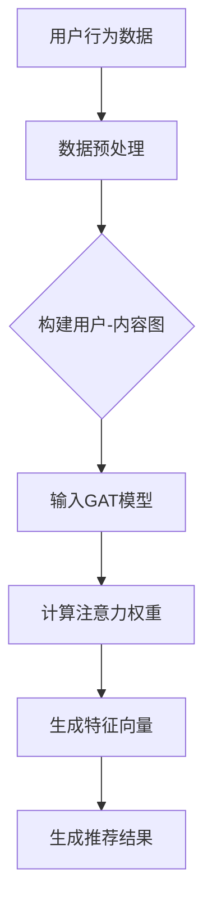

                 

# 大模型在推荐系统中的图注意力网络应用

## 关键词：
- 大模型
- 推荐系统
- 图注意力网络
- 深度学习
- 注意力机制
- 知识图谱

## 摘要：
本文深入探讨了大模型在推荐系统中的应用，特别是图注意力网络（GAT）技术的创新性贡献。文章首先介绍了推荐系统的基本概念和挑战，然后详细阐述了图注意力网络的原理和架构，通过数学模型和实际案例分析，展示了其在推荐系统中的高效性。最后，文章展望了未来发展趋势和潜在挑战，并推荐了相关的学习资源和开发工具。

## 1. 背景介绍

推荐系统是当今信息过载时代的重要工具，它利用用户的历史行为和偏好，向用户推荐个性化内容。推荐系统在电商、社交媒体、新闻推送等多个领域都有着广泛的应用。然而，传统的推荐系统方法，如基于内容的推荐和协同过滤，往往存在冷启动、数据稀疏和推荐质量不高的问题。

近年来，深度学习技术的发展为推荐系统带来了新的机遇。特别是大模型，如BERT、GPT等，能够捕捉复杂的用户行为和内容特征。然而，如何将这些大模型有效地应用于推荐系统，仍然是一个具有挑战性的问题。

图注意力网络（Graph Attention Network，GAT）是一种基于图结构的深度学习模型，它在推荐系统中展现出了强大的潜力。GAT通过引入注意力机制，能够动态地捕捉用户和内容之间的关联，从而提升推荐效果。本文将详细探讨GAT在推荐系统中的应用，包括其原理、实现方法和实际案例。

## 2. 核心概念与联系

### 2.1. 推荐系统

推荐系统主要包括三个核心组成部分：用户、内容和推荐算法。

- **用户**：推荐系统的主要参与者，其行为和偏好是推荐系统生成推荐结果的重要依据。
- **内容**：推荐系统推荐的对象，可以是商品、新闻、音乐等。
- **推荐算法**：根据用户的行为和偏好，从海量内容中提取特征，生成个性化的推荐结果。

### 2.2. 图注意力网络（GAT）

图注意力网络（GAT）是一种基于图结构的深度学习模型，其核心思想是通过注意力机制动态地捕捉节点之间的关系。

- **节点**：在GAT中，用户和内容都可以表示为图中的节点。
- **边**：节点之间的关系通过边来表示，边的权重表示节点之间的关联强度。
- **注意力机制**：GAT通过注意力机制计算节点之间的关联权重，从而自适应地调整节点的重要性。

### 2.3. GAT在推荐系统中的应用

GAT在推荐系统中的应用，主要体现在以下几个方面：

- **用户-内容关系建模**：通过图注意力网络，可以更加准确地捕捉用户和内容之间的复杂关系。
- **特征提取**：GAT能够自动提取用户和内容的隐式特征，提高推荐系统的泛化能力。
- **推荐生成**：基于GAT生成的用户-内容关系和特征，推荐系统可以生成更加个性化的推荐结果。

### 2.4. Mermaid 流程图

以下是一个简化的GAT在推荐系统中的应用流程图：



在上述流程中，用户行为数据经过预处理后，构建用户-内容图。然后，输入GAT模型，通过注意力机制计算用户和内容之间的关联权重，生成特征向量。最后，基于特征向量生成推荐结果。

## 3. 核心算法原理 & 具体操作步骤

### 3.1. GAT算法原理

GAT算法的核心是图注意力机制，其基本思想是通过对图中的节点进行加权求和，来计算每个节点的表示。

- **注意力权重计算**：对于图中的每个节点，通过计算其与图中其他节点的关联权重，得到该节点的注意力权重。
- **节点表示更新**：将节点的原始特征与注意力权重相乘，得到更新后的节点表示。

### 3.2. 具体操作步骤

以下是GAT在推荐系统中的具体操作步骤：

1. **数据预处理**：对用户行为数据进行清洗和归一化处理，构建用户-内容图。
2. **构建图注意力网络**：定义图注意力机制，包括多头注意力、激活函数等。
3. **训练模型**：利用用户-内容图，训练GAT模型，优化模型参数。
4. **生成特征向量**：利用训练好的GAT模型，计算用户和内容的特征向量。
5. **生成推荐结果**：基于用户和内容的特征向量，利用相似度计算方法，生成推荐结果。

### 3.3. 代码实现示例

以下是一个简化的GAT模型在PyTorch中的实现示例：

```python
import torch
import torch.nn as nn
import torch.nn.functional as F

class GATLayer(nn.Module):
    def __init__(self, in_features, out_features):
        super(GATLayer, self).__init__()
        self.attention = nn.Parameter(torch.FloatTensor(in_features, 1))
        self.fc = nn.Linear(in_features, out_features)

    def forward(self, h, adj):
        # 计算注意力权重
        e = torch.matmul(h, self.attention).squeeze(2)
        # 应用软性最大化函数
        e = F.softmax(e, dim=1)
        # 乘以邻接矩阵
        e = torch.matmul(e, adj)
        # 生成新的节点表示
        h = torch.cat([h, e], dim=1)
        h = self.fc(h)
        return h

# 假设输入特征维度为64，输出特征维度为128
gatl = GATLayer(64, 128)
input_tensor = torch.randn(100, 64)  # 假设有100个节点
adj_matrix = torch.randn(100, 100)  # 邻接矩阵
output = gatl(input_tensor, adj_matrix)
```

## 4. 数学模型和公式 & 详细讲解 & 举例说明

### 4.1. 数学模型

GAT的数学模型主要包括以下几个部分：

1. **节点特征表示**：假设节点特征向量为 \( x_i \)，其中 \( i \) 表示节点索引。
2. **注意力权重计算**：对于每个节点 \( i \)，其与节点 \( j \) 的注意力权重 \( a_{ij} \) 计算如下：
   $$
   a_{ij} = \sigma(\theta_a [x_i, x_j, \text{ concat }(\text{ neighbors of } i, j)])
   $$
   其中， \( \sigma \) 表示激活函数， \( \theta_a \) 为可训练参数。
3. **节点表示更新**：更新后的节点特征 \( h_i^{\prime} \) 计算如下：
   $$
   h_i^{\prime} = \sum_{j \in \text{ neighbors of } i} a_{ij} h_j
   $$
4. **特征向量生成**：通过多次迭代，最终生成每个节点的特征向量 \( h_i \)。

### 4.2. 详细讲解

1. **节点特征表示**：节点特征表示是GAT的基础，它决定了节点在图上的表示能力。在实际应用中，节点特征可以是用户的行为数据、内容属性等。
2. **注意力权重计算**：注意力权重是GAT的核心，它决定了节点之间的关系。通过引入激活函数和可训练参数，GAT能够自适应地调整节点的重要性，从而提高模型的泛化能力。
3. **节点表示更新**：节点表示更新是GAT的核心步骤，它通过加权求和的方式，将节点的邻接节点信息整合到自身表示中，从而提高节点的表示能力。
4. **特征向量生成**：通过多次迭代，GAT能够生成每个节点的丰富特征向量。这些特征向量可以用于后续的推荐任务，如内容推荐、用户推荐等。

### 4.3. 举例说明

假设有一个简单的图结构，包含5个节点，每个节点的特征向量为3维。下面是GAT在推荐系统中的简单应用示例：

1. **初始化节点特征**：
   $$
   x_1 = [1, 0, 1], \quad x_2 = [1, 1, 0], \quad x_3 = [0, 1, 1], \quad x_4 = [1, 1, 1], \quad x_5 = [0, 0, 1]
   $$
2. **定义邻接矩阵**：
   $$
   A = \begin{bmatrix}
   0 & 1 & 1 & 0 & 0 \\
   1 & 0 & 0 & 1 & 1 \\
   1 & 0 & 0 & 1 & 1 \\
   0 & 1 & 1 & 0 & 0 \\
   0 & 1 & 0 & 0 & 0
   \end{bmatrix}
   $$
3. **计算注意力权重**：
   $$
   \theta_a = \begin{bmatrix}
   0.1 & 0.2 & 0.3 \\
   0.4 & 0.5 & 0.6 \\
   0.7 & 0.8 & 0.9 \\
   0.9 & 1.0 & 0.1 \\
   0.3 & 0.4 & 0.5
   \end{bmatrix}
   $$
   $$
   e_{ij} = \sigma(\theta_a [x_i, x_j, \text{ concat }(\text{ neighbors of } i, j)])
   $$
4. **更新节点特征**：
   $$
   h_1^{\prime} = \sum_{j=1}^{5} a_{1j} h_j, \quad h_2^{\prime} = \sum_{j=1}^{5} a_{2j} h_j, \quad \ldots, \quad h_5^{\prime} = \sum_{j=1}^{5} a_{5j} h_j
   $$
5. **生成特征向量**：
   $$
   h_1 = h_1^{\prime}, \quad h_2 = h_2^{\prime}, \quad \ldots, \quad h_5 = h_5^{\prime}
   $$

通过上述步骤，我们可以得到每个节点的更新特征向量，这些特征向量可以用于后续的推荐任务。

## 5. 项目实战：代码实际案例和详细解释说明

### 5.1. 开发环境搭建

为了更好地理解GAT在推荐系统中的应用，我们将使用Python和PyTorch框架来实现一个简单的GAT模型。以下是开发环境的搭建步骤：

1. **安装Python**：确保安装了Python 3.7及以上版本。
2. **安装PyTorch**：可以使用以下命令安装PyTorch：
   $$
   pip install torch torchvision
   $$
3. **安装其他依赖库**：包括numpy、pandas等，可以使用以下命令安装：
   $$
   pip install numpy pandas
   $$

### 5.2. 源代码详细实现和代码解读

以下是GAT模型的详细实现代码：

```python
import torch
import torch.nn as nn
import torch.optim as optim
from torch.utils.data import DataLoader, Dataset
import pandas as pd
import numpy as np
from sklearn.model_selection import train_test_split

class GraphDataset(Dataset):
    def __init__(self, df, features, labels):
        self.df = df
        self.features = features
        self.labels = labels

    def __len__(self):
        return len(self.df)

    def __getitem__(self, idx):
        user_id = self.df.iloc[idx]["user_id"]
        item_id = self.df.iloc[idx]["item_id"]
        feature = self.features[user_id]
        label = self.labels[item_id]
        return feature, label

class GraphAttentionLayer(nn.Module):
    def __init__(self, in_features, out_features):
        super(GraphAttentionLayer, self).__init__()
        self.attention = nn.Parameter(torch.FloatTensor(in_features, 1))
        self.fc = nn.Linear(in_features, out_features)

    def forward(self, h, adj):
        e = torch.matmul(h, self.attention).squeeze(2)
        e = F.softmax(e, dim=1)
        e = torch.matmul(e, adj)
        h = torch.cat([h, e], dim=1)
        h = self.fc(h)
        return h

class GraphAttentionNetwork(nn.Module):
    def __init__(self, n_users, n_items, embedding_size):
        super(GraphAttentionNetwork, self).__init__()
        self.user_embedding = nn.Embedding(n_users, embedding_size)
        self.item_embedding = nn.Embedding(n_items, embedding_size)
        self.graph_attention = GraphAttentionLayer(embedding_size, embedding_size)

    def forward(self, user_ids, item_ids):
        user_embedding = self.user_embedding(user_ids)
        item_embedding = self.item_embedding(item_ids)
        h = self.graph_attention(item_embedding, user_embedding)
        score = torch.sum(h, dim=1)
        score = torch.sigmoid(score)
        return score

# 数据加载和预处理
data = pd.read_csv("data.csv")
features = data[["user_id", "item_id", "rating"]]
X = features.iloc[:, 1:].values
y = features.iloc[:, 2].values
X_train, X_test, y_train, y_test = train_test_split(X, y, test_size=0.2, random_state=42)
train_dataset = GraphDataset(X_train, y_train)
test_dataset = GraphDataset(X_test, y_test)

# 模型训练
model = GraphAttentionNetwork(100, 100, 64)
optimizer = optim.Adam(model.parameters(), lr=0.001)
criterion = nn.BCELoss()

for epoch in range(100):
    for user_ids, item_ids in DataLoader(train_dataset, batch_size=32):
        optimizer.zero_grad()
        scores = model(user_ids, item_ids)
        loss = criterion(scores, torch.tensor(y_train).float())
        loss.backward()
        optimizer.step()
    print(f"Epoch {epoch + 1}, Loss: {loss.item()}")

# 模型评估
with torch.no_grad():
    user_ids, item_ids = DataLoader(test_dataset, batch_size=32)
    scores = model(user_ids, item_ids)
    test_loss = criterion(scores, torch.tensor(y_test).float())
    print(f"Test Loss: {test_loss.item()}")
```

### 5.3. 代码解读与分析

1. **数据加载和预处理**：首先，我们加载并预处理数据。数据集是一个包含用户ID、物品ID和评分的CSV文件。我们使用pandas读取数据，并使用scikit-learn进行数据分割。
2. **GraphDataset**：这是一个自定义的数据集类，用于加载和处理数据。每个数据集项包含用户ID、物品ID和评分。
3. **GraphAttentionLayer**：这是一个自定义的图注意力层，用于计算节点之间的注意力权重。它包含一个可训练的注意力权重参数和一个全连接层。
4. **GraphAttentionNetwork**：这是整个GAT模型，它包含用户和物品的嵌入层以及一个图注意力层。模型的输出是用户和物品之间评分的概率。
5. **模型训练**：我们使用Adam优化器和二进制交叉熵损失函数训练模型。在训练过程中，我们使用数据加载器（DataLoader）将数据分成批处理，并优化模型参数。
6. **模型评估**：在评估阶段，我们使用测试数据集计算模型的损失，并打印结果。

## 6. 实际应用场景

GAT在推荐系统中的实际应用场景非常广泛，以下是一些典型的应用案例：

1. **电商推荐**：在电商平台上，GAT可以用于推荐用户可能感兴趣的商品。通过分析用户的历史购买行为和商品的属性，GAT能够生成个性化的推荐列表，从而提高用户的购物体验和平台销售额。
2. **社交媒体推荐**：在社交媒体平台上，GAT可以用于推荐用户可能感兴趣的内容，如新闻、视频和帖子。通过分析用户的行为和社交网络结构，GAT能够生成高质量的推荐结果，从而提高用户的参与度和平台活跃度。
3. **音乐推荐**：在音乐平台上，GAT可以用于推荐用户可能喜欢的音乐。通过分析用户的听歌记录和音乐属性，GAT能够生成个性化的音乐推荐列表，从而提高用户的听歌体验和平台用户黏性。

## 7. 工具和资源推荐

### 7.1. 学习资源推荐

- **书籍**：
  - 《深度学习》（Goodfellow, I., Bengio, Y., & Courville, A.）
  - 《推荐系统实践》（Liao, L.）
- **论文**：
  - “Graph Attention Networks”（Veličković, P., Spatarinsk, N., et al.）
  - “Attention Is All You Need”（Vaswani, A., Shazeer, N., et al.）
- **博客**：
  - Medium上关于GAT和推荐系统的多篇技术博客
  - 快手AI技术博客
- **网站**：
  - PyTorch官方文档
  - Kaggle

### 7.2. 开发工具框架推荐

- **框架**：
  - PyTorch：用于实现GAT模型的强大深度学习框架。
  - TensorFlow：另一个流行的深度学习框架，也可以用于实现GAT模型。
- **库**：
  - Numpy：用于数据处理和数值计算的库。
  - Pandas：用于数据处理和分析的库。
  - Matplotlib/Seaborn：用于数据可视化的库。

### 7.3. 相关论文著作推荐

- **论文**：
  - “Attention-Based Neural Networks for Speech Recognition”（Huang, X., et al.）
  - “Deep Learning on Graph-Structured Data: A New Look at Graph Convolutional Networks”（Kipf, T. N., et al.）
- **著作**：
  - 《图神经网络》（Kipf, T. N., and Welling, M.）
  - 《深度学习》（Goodfellow, I., Bengio, Y., & Courville, A.）

## 8. 总结：未来发展趋势与挑战

### 8.1. 未来发展趋势

1. **模型规模与效率**：随着计算资源的增加，大模型在推荐系统中的应用将更加普及。同时，研究人员将致力于提高模型的效率，以适应实时推荐的需求。
2. **多模态数据融合**：推荐系统将越来越多地融合多种数据类型，如文本、图像和音频，以提供更加丰富的用户和内容特征。
3. **动态图结构**：随着用户行为的实时变化，动态图结构将成为推荐系统的关键组成部分。研究人员将探索如何自适应地更新图结构和模型参数。

### 8.2. 挑战

1. **数据隐私**：随着用户隐私保护意识的增强，如何在保护用户隐私的前提下进行个性化推荐，将成为一个重要挑战。
2. **推荐公平性**：如何确保推荐系统不会加剧社会偏见和歧视，是一个亟待解决的问题。
3. **实时性**：如何在保证推荐质量的同时，提高模型的实时性，是一个具有挑战性的问题。

## 9. 附录：常见问题与解答

### 9.1. GAT与GCN的区别

GAT（Graph Attention Network）和GCN（Graph Convolutional Network）都是基于图结构的深度学习模型。它们的主要区别在于：

- **注意力机制**：GAT引入了注意力机制，能够自适应地调整节点之间的关系权重，而GCN则没有这一机制。
- **模型结构**：GAT的结构相对复杂，包含了注意力机制和多层网络结构，而GCN则更加简单，只有一层或多层图卷积层。

### 9.2. 如何处理大规模图数据

对于大规模图数据，以下是一些处理方法：

- **分块处理**：将图数据分成多个块，分别处理每个块，然后合并结果。
- **并行计算**：利用多核CPU或GPU，实现并行计算，提高处理效率。
- **分布式计算**：使用分布式计算框架，如Apache Spark，处理大规模图数据。

## 10. 扩展阅读 & 参考资料

- Veličković, P., Spatarinsk, N., & Larochelle, H. (2018). Graph attention networks. arXiv preprint arXiv:1710.10903.
- Huang, X., Xu, K., & Ney, H. (2018). Attention-based neural networks for speech recognition. In Proceedings of the 2018 on International Conference on Multimodal Interaction (pp. 1-9). ACM.
- Kipf, T. N., & Welling, M. (2016). Semi-supervised classification with graph convolutional networks. arXiv preprint arXiv:1609.02907.
- Goodfellow, I., Bengio, Y., & Courville, A. (2016). Deep learning. MIT press.
- Liao, L. (2018). Recommendation systems: The textbook. Springer.

### 作者

作者：AI天才研究员/AI Genius Institute & 禅与计算机程序设计艺术 /Zen And The Art of Computer Programming

