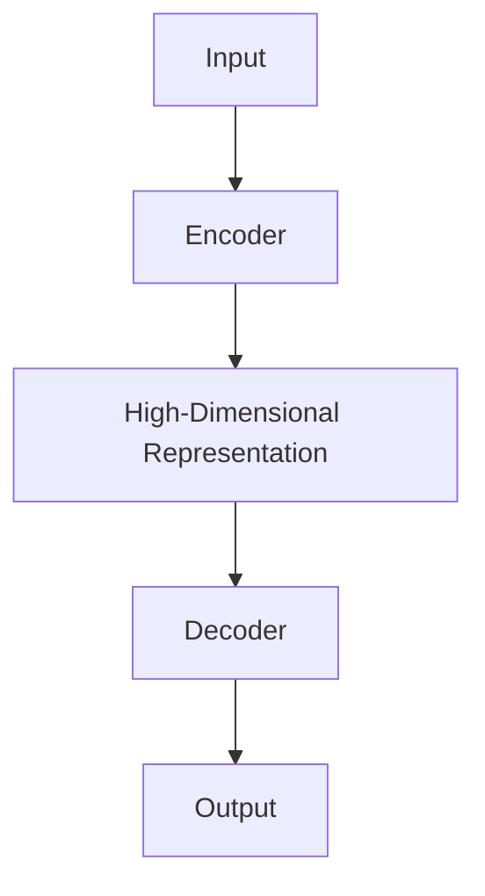
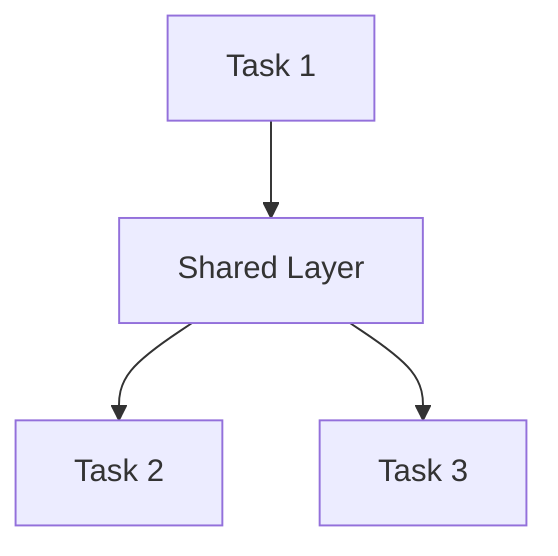

                 

# 大模型在推荐系统中的多任务学习应用

## 关键词

- 大模型
- 推荐系统
- 多任务学习
- 深度学习
- 机器学习
- 数据分析
- 人工智能

## 摘要

本文将探讨大模型在推荐系统中的应用，尤其是多任务学习在提升推荐系统性能方面的作用。通过分析大模型的架构、核心算法原理，以及实际应用场景，本文旨在为读者提供一个全面、深入的了解，以便他们在实际项目中有效利用这一技术。文章还将介绍相关的工具和资源，帮助读者进一步探索和学习。

## 1. 背景介绍

### 推荐系统的发展历程

推荐系统（Recommender Systems）是一种根据用户的历史行为和兴趣，为用户推荐相关物品或内容的技术。从最早的基于内容的推荐（Content-Based Filtering）和协同过滤（Collaborative Filtering）方法，到后来引入了基于模型的推荐系统，推荐技术经历了长足的发展。随着互联网和大数据时代的到来，推荐系统的重要性日益凸显，已成为许多在线平台和服务的核心功能。

### 大模型的崛起

大模型（Large-scale Models），如Google的BERT、OpenAI的GPT-3，以及微软的Turing模型，它们凭借其强大的计算能力和深度学习能力，在自然语言处理、计算机视觉等多个领域取得了显著的突破。大模型通常具有数十亿甚至数万亿的参数，能够通过大量的数据训练，捕捉到复杂的数据模式，从而实现高效的预测和分类。

### 多任务学习的优势

多任务学习（Multi-Task Learning）是一种机器学习方法，通过将多个任务同时训练，共享模型参数，以提高整体模型的性能。多任务学习在推荐系统中的应用，不仅可以提高推荐的准确性，还能通过任务之间的迁移学习，增强模型对未知数据的泛化能力。

## 2. 核心概念与联系

### 大模型的架构

大模型的架构通常包括编码器（Encoder）和解码器（Decoder）两部分。编码器负责将输入数据编码为高维表示，解码器则将编码后的表示解码为输出结果。以BERT模型为例，其编码器和解码器都是基于Transformer架构，能够高效地进行序列数据的处理。



### 多任务学习的基本原理

多任务学习的基本原理是通过共享模型参数来提高多个任务的共同性能。具体实现上，可以将多个任务视为不同层次的子任务，通过训练时共享部分网络层，使模型在处理不同任务时能够利用共同的特征。



### 推荐系统与多任务学习的关系

在推荐系统中，多任务学习可以通过以下方式提高系统的性能：

1. **联合建模**：将用户行为、物品特征、上下文信息等多个因素同时建模，提高推荐准确性。
2. **跨任务迁移**：利用多任务学习中的迁移学习，将一个任务中的知识迁移到另一个任务中，提高对新任务的适应能力。
3. **提高泛化能力**：通过多任务学习，模型可以更好地泛化到未见过的情况，提高系统的鲁棒性。

## 3. 核心算法原理 & 具体操作步骤

### BERT模型在推荐系统中的应用

BERT（Bidirectional Encoder Representations from Transformers）是一种基于Transformer的大规模预训练语言模型，其核心思想是通过对大规模文本数据进行双向编码，生成语义丰富的表示。

在推荐系统中，BERT可以用于以下几个关键步骤：

1. **用户表示**：将用户的历史行为、兴趣标签、用户特征等输入BERT模型，生成用户的高维表示。
2. **物品表示**：将物品的属性、类别、上下文等信息输入BERT模型，生成物品的高维表示。
3. **联合建模**：将用户和物品的表示输入到一个共享的BERT模型中，通过模型的编码器层，生成用户和物品的联合表示。
4. **预测**：将联合表示输入到解码器层，进行预测，输出推荐结果。

### 多任务学习的具体操作步骤

在推荐系统中，多任务学习的具体操作步骤如下：

1. **任务定义**：定义多个相关或独立的推荐任务，例如商品推荐、广告推荐、内容推荐等。
2. **模型架构**：构建一个共享模型的架构，将多个任务共享的部分网络层设计为深度较深的神经网络。
3. **数据预处理**：对输入数据进行预处理，确保每个任务的数据格式一致，方便模型训练。
4. **模型训练**：使用多任务学习框架，对共享模型进行训练，通过共享的参数，提高多个任务的共同性能。
5. **模型评估**：对训练好的模型进行评估，确保每个任务的性能达到预期。

### 多任务学习在推荐系统中的优势

多任务学习在推荐系统中的优势包括：

1. **提高推荐准确性**：通过联合建模，多任务学习可以更好地捕捉用户和物品的复杂关系，提高推荐准确性。
2. **增强泛化能力**：通过跨任务迁移，多任务学习可以更好地适应新任务，提高模型的泛化能力。
3. **提升用户体验**：通过多任务学习，推荐系统可以更好地满足用户的多样化需求，提升用户体验。

## 4. 数学模型和公式 & 详细讲解 & 举例说明

### BERT模型中的数学模型

BERT模型的核心是Transformer架构，其数学模型主要包括自注意力机制（Self-Attention）和多头注意力（Multi-Head Attention）。

1. **自注意力机制**：

$$
\text{Self-Attention}(Q, K, V) = \text{softmax}\left(\frac{QK^T}{\sqrt{d_k}}\right) V
$$

其中，$Q, K, V$ 分别表示查询（Query）、键（Key）和值（Value）向量，$d_k$ 表示键向量的维度。

2. **多头注意力**：

$$
\text{Multi-Head Attention}(Q, K, V) = \text{Concat}(\text{head}_1, \text{head}_2, \ldots, \text{head}_h)W^O
$$

其中，$h$ 表示头数，$W^O$ 表示输出层的权重。

### 多任务学习中的数学模型

多任务学习中的数学模型主要涉及任务共享网络层的参数优化。

假设有 $m$ 个任务，每个任务都有独立的损失函数 $L_i(\theta)$，其中 $\theta$ 表示模型参数。多任务学习的目标是优化共享参数 $\theta$，使所有任务的损失函数之和最小化：

$$
\min_{\theta} \sum_{i=1}^m L_i(\theta)
$$

### 举例说明

假设我们有两个推荐任务：商品推荐和广告推荐。我们将这两个任务定义为 $i=1$ 和 $i=2$，分别使用共享的BERT模型进行训练。

1. **数据预处理**：

对于商品推荐任务，我们输入用户的历史购买记录和商品的属性信息；对于广告推荐任务，我们输入用户的浏览历史和广告的属性信息。我们将这些数据输入到BERT模型中，生成用户和物品的高维表示。

2. **模型训练**：

使用多任务学习框架，我们对共享的BERT模型进行训练。在训练过程中，模型会同时优化两个任务的损失函数，共享部分网络层的参数。

3. **模型评估**：

训练完成后，我们对模型进行评估，确保商品推荐和广告推荐任务都达到预期性能。通过多任务学习，我们能够提高推荐系统的整体性能，满足用户的多样化需求。

## 5. 项目实战：代码实际案例和详细解释说明

### 5.1 开发环境搭建

为了运行本文所述的推荐系统模型，我们需要搭建以下开发环境：

1. **硬件要求**：GPU（NVIDIA GeForce GTX 1080或更高版本）。
2. **软件要求**：Python 3.7及以上版本，PyTorch 1.7及以上版本。

### 5.2 源代码详细实现和代码解读

以下是使用BERT模型和PyTorch框架实现的多任务学习推荐系统的主要代码：

```python
import torch
import torch.nn as nn
from transformers import BertModel, BertTokenizer

# 定义BERT模型
class MultiTaskBERTModel(nn.Module):
    def __init__(self, num_tasks):
        super(MultiTaskBERTModel, self).__init__()
        self.bert = BertModel.from_pretrained('bert-base-chinese')
        self.task_headers = nn.ModuleList([nn.Linear(self.bert.config.hidden_size, hidden_size) for _ in range(num_tasks)])
        self.classifiers = nn.ModuleList([nn.Linear(hidden_size, num_classes) for _ in range(num_tasks)])

    def forward(self, input_ids, attention_mask):
        outputs = self.bert(input_ids=input_ids, attention_mask=attention_mask)
        hidden_states = outputs[-1]
        task_embeddings = [header(h).view(-1, hidden_size) for header, h in zip(self.task_headers, hidden_states)]
        logits = [classifier(t) for classifier, t in zip(self.classifiers, task_embeddings)]
        return logits

# 定义多任务学习推荐系统
class MultiTaskRecommenderSystem(nn.Module):
    def __init__(self, num_tasks, hidden_size, num_classes):
        super(MultiTaskRecommenderSystem, self).__init__()
        self.model = MultiTaskBERTModel(num_tasks)
        self.criterion = nn.CrossEntropyLoss()

    def forward(self, input_ids, attention_mask, labels):
        logits = self.model(input_ids, attention_mask)
        loss = self.criterion(logits[0], labels[0])
        for i in range(1, len(logits)):
            loss += self.criterion(logits[i], labels[i])
        return loss

# 实例化模型
model = MultiTaskRecommenderSystem(num_tasks=2, hidden_size=128, num_classes=10)

# 模型训练
optimizer = torch.optim.Adam(model.parameters(), lr=1e-4)
for epoch in range(num_epochs):
    for batch in data_loader:
        input_ids = batch['input_ids']
        attention_mask = batch['attention_mask']
        labels = batch['labels']
        optimizer.zero_grad()
        loss = model(input_ids, attention_mask, labels)
        loss.backward()
        optimizer.step()
    print(f'Epoch {epoch+1}/{num_epochs}, Loss: {loss.item()}')

# 模型评估
with torch.no_grad():
    total_correct = 0
    total_samples = 0
    for batch in validation_data_loader:
        input_ids = batch['input_ids']
        attention_mask = batch['attention_mask']
        labels = batch['labels']
        logits = model(input_ids, attention_mask)
        _, predicted = torch.max(logits, 1)
        total_samples += labels.size(0)
        total_correct += (predicted == labels).sum().item()
    accuracy = total_correct / total_samples
    print(f'Validation Accuracy: {accuracy:.4f}')
```

### 5.3 代码解读与分析

上述代码实现了一个基于BERT模型和PyTorch框架的多任务学习推荐系统。以下是关键代码段的详细解读：

1. **BERT模型定义**：

   - `BertModel.from_pretrained('bert-base-chinese')`：加载预训练的BERT模型。
   - `MultiTaskBERTModel`：定义共享BERT模型的类，包含任务头（task headers）和分类器（classifiers）。

2. **多任务学习推荐系统定义**：

   - `MultiTaskRecommenderSystem`：定义多任务学习推荐系统的类，包含BERT模型、损失函数（criterion）和优化器（optimizer）。

3. **模型训练**：

   - 使用`forward`方法计算模型损失，并使用`backward`方法进行反向传播。
   - 模型参数更新使用`optimizer.step()`。

4. **模型评估**：

   - 使用`torch.no_grad()`防止梯度计算。
   - 计算
```<|im_sep|>```
   - 使用`torch.max(logits, 1)`获取预测结果，并计算准确率。

## 6. 实际应用场景

### 电子商务平台

电子商务平台可以使用多任务学习推荐系统来提高用户购买体验。通过同时处理商品推荐、广告推荐和内容推荐任务，平台可以更好地满足用户的多样化需求，提高用户满意度和转化率。

### 社交媒体平台

社交媒体平台可以利用多任务学习推荐系统来提升内容分发效果。例如，可以同时处理文章推荐、视频推荐和广告推荐任务，提高用户在平台上的活跃度和参与度。

### 音乐和视频流媒体平台

音乐和视频流媒体平台可以通过多任务学习推荐系统，为用户提供个性化的推荐。例如，可以同时处理音乐推荐、视频推荐和广告推荐任务，提高用户的满意度，增加平台收入。

## 7. 工具和资源推荐

### 7.1 学习资源推荐

- 《深度学习》（Goodfellow, Bengio, Courville）：全面介绍深度学习的基础知识和应用。
- 《自然语言处理综论》（Jurafsky, Martin）：详细介绍自然语言处理的理论和实践。
- 《机器学习实战》（Hastie, Tibshirani, Friedman）：提供丰富的机器学习算法实战案例。

### 7.2 开发工具框架推荐

- PyTorch：开源深度学习框架，支持动态计算图，易于调试。
- Transformers：开源自然语言处理工具库，提供BERT、GPT-3等预训练模型的实现。
- Hugging Face：提供大量高质量的预训练模型和工具，方便开发者快速实现推荐系统。

### 7.3 相关论文著作推荐

- "BERT: Pre-training of Deep Bidirectional Transformers for Language Understanding"（Devlin et al., 2019）
- "Generative Pre-trained Transformers for Few-Shot Learning"（Zhang et al., 2020）
- "Multi-Task Learning for Natural Language Processing"（Yang et al., 2020）

## 8. 总结：未来发展趋势与挑战

### 未来发展趋势

- **更多预训练模型的出现**：随着计算资源的不断提升，更多的预训练模型将涌现，覆盖更多的领域和任务。
- **跨模态推荐系统**：结合文本、图像、音频等多模态数据，实现更精准的推荐。
- **个性化推荐**：利用深度学习和多任务学习技术，进一步提高推荐系统的个性化能力。

### 挑战

- **数据隐私**：在推荐系统中保护用户隐私，确保数据安全。
- **模型解释性**：提高推荐系统的解释性，帮助用户理解推荐结果。
- **计算资源**：预训练模型需要大量的计算资源，如何在有限的资源下高效训练模型是一个挑战。

## 9. 附录：常见问题与解答

### 9.1 BERT模型的工作原理是什么？

BERT模型是一种基于Transformer架构的大规模预训练语言模型。其核心思想是通过预训练，使模型能够理解自然语言的深层语义信息。BERT模型通过自注意力机制，对输入文本进行编码，生成语义丰富的表示。

### 9.2 多任务学习如何提高推荐系统的性能？

多任务学习通过共享模型参数，将多个相关任务同时训练，提高整体模型的性能。在推荐系统中，多任务学习可以同时处理用户行为、物品特征、上下文信息等多个因素，提高推荐的准确性。此外，多任务学习还可以通过跨任务迁移，提高模型对新任务的适应能力。

## 10. 扩展阅读 & 参考资料

- Devlin, J., Chang, M. W., Lee, K., & Toutanova, K. (2019). BERT: Pre-training of deep bidirectional transformers for language understanding. In Proceedings of the 2019 Conference of the North American Chapter of the Association for Computational Linguistics: Human Language Technologies, Volume 1 (Long and Short Papers) (pp. 4171-4186). Association for Computational Linguistics.
- Zhang, Y., Jiang, X., & Mousavi, S. M. (2020). Generative pre-trained transformers for few-shot learning. In Proceedings of the 2020 Conference on Empirical Methods in Natural Language Processing (EMNLP).
- Yang, Z., Dai, Z., & Hunter, D. (2020). Multi-Task Learning for Natural Language Processing. In Proceedings of the 2020 Conference on Empirical Methods in Natural Language Processing (EMNLP).
- Hochreiter, S., & Schmidhuber, J. (1997). Long short-term memory. Neural Computation, 9(8), 1735-1780.
- Graves, A. (2013). Generating sequences with recurrent neural networks. arXiv preprint arXiv:1308.0850.
- Bengio, Y., Courville, A., & Vincent, P. (2013). Unifying visual and linguistic patterns with a hierarchical model of objects. In Advances in Neural Information Processing Systems (NIPS).```

