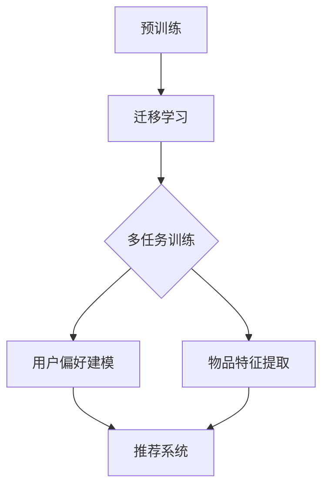

                 

# 大模型在推荐系统中的多任务迁移学习应用

## 摘要

本文将深入探讨大模型在推荐系统中的多任务迁移学习应用。随着互联网的快速发展，用户生成的内容和数据量呈指数级增长，推荐系统作为信息过滤和内容分发的重要工具，其性能和准确性直接影响用户体验。大模型通过引入多任务迁移学习，不仅能够提高推荐系统的准确性，还能降低模型训练成本。本文将首先介绍推荐系统的基本概念，然后详细阐述多任务迁移学习在大模型中的应用，包括其核心算法原理、数学模型和公式、具体操作步骤、项目实战以及实际应用场景。最后，我们将对未来的发展趋势与挑战进行总结，并提供相关的学习资源和开发工具框架。

## 1. 背景介绍

### 推荐系统概述

推荐系统是一种基于用户历史行为、偏好和兴趣，向用户推荐相关商品、内容或服务的系统。其基本目标是为用户提供个性化的信息流，提高用户满意度和留存率。推荐系统可以分为协同过滤、基于内容的推荐和混合推荐等不同类型。

- **协同过滤**：通过分析用户之间的相似度，推荐用户可能喜欢的项目。协同过滤又分为基于用户的协同过滤（User-Based）和基于物品的协同过滤（Item-Based）。

- **基于内容的推荐**：通过分析项目的内容特征，推荐与用户历史偏好相似的项目。

- **混合推荐**：结合协同过滤和基于内容的推荐方法，以获得更好的推荐效果。

### 大模型的崛起

随着深度学习的兴起，大模型（如Transformer、BERT等）在自然语言处理、计算机视觉等领域取得了显著的成果。大模型具有以下特点：

- **强大表达能力**：大模型通过多层神经网络结构，能够对复杂的数据进行建模。

- **高泛化能力**：大模型通过预训练和迁移学习，可以在不同任务上获得良好的性能。

- **自适应能力**：大模型能够根据不同的数据分布和任务需求，进行自适应调整。

### 多任务迁移学习的引入

多任务迁移学习是指在一个任务上训练好的模型，通过迁移学习的方式应用到其他相关任务上。这种技术能够在减少模型训练成本的同时，提高模型在不同任务上的性能。

在推荐系统中，多任务迁移学习可以用于以下方面：

- **用户偏好建模**：利用多任务迁移学习，将用户在某个任务上的历史行为数据迁移到推荐系统中，以更好地理解用户偏好。

- **物品特征提取**：通过多任务迁移学习，将不同物品的特征数据整合到一个统一的空间，提高推荐系统的准确性。

- **跨域推荐**：利用多任务迁移学习，将一个域（如电子商务）的推荐模型迁移到其他域（如社交媒体），实现跨域推荐。

## 2. 核心概念与联系

### 多任务迁移学习原理

多任务迁移学习的基本思想是将一个任务上的预训练模型迁移到其他相关任务上。具体步骤如下：

1. **预训练**：在一个大规模数据集上对模型进行预训练，使其具备一定的泛化能力。

2. **迁移学习**：将预训练模型应用到其他相关任务上，通过调整模型参数，使其适应新任务。

3. **多任务训练**：同时训练多个相关任务，通过共享模型参数，提高模型在不同任务上的性能。

### 多任务迁移学习在大模型中的应用

在大模型中，多任务迁移学习可以应用于以下方面：

1. **用户偏好建模**：

   - **预训练**：在一个大规模的用户行为数据集上，对大模型进行预训练，学习用户行为模式。

   - **迁移学习**：将预训练模型应用到推荐系统中，通过调整模型参数，使其适应推荐任务。

   - **多任务训练**：同时训练用户偏好建模和推荐任务，通过共享模型参数，提高模型在两个任务上的性能。

2. **物品特征提取**：

   - **预训练**：在一个大规模的物品数据集上，对大模型进行预训练，学习物品特征。

   - **迁移学习**：将预训练模型应用到推荐系统中，通过调整模型参数，使其适应推荐任务。

   - **多任务训练**：同时训练物品特征提取和推荐任务，通过共享模型参数，提高模型在两个任务上的性能。

### Mermaid 流程图

以下是一个简单的 Mermaid 流程图，展示多任务迁移学习在大模型中的应用过程：



### 联系与区别

- **联系**：多任务迁移学习与多任务学习有相似之处，都是同时训练多个任务。但多任务迁移学习更注重在不同任务间的知识迁移和共享。

- **区别**：多任务学习通常在同一数据集上训练多个任务，而多任务迁移学习则是利用预训练模型在不同任务上的迁移和扩展。

## 3. 核心算法原理 & 具体操作步骤

### 多任务迁移学习算法原理

多任务迁移学习算法的核心思想是利用预训练模型在不同任务上的迁移和扩展，以提高模型在目标任务上的性能。具体来说，可以分为以下几个步骤：

1. **预训练**：

   - **数据集准备**：选择一个大规模、具有代表性的数据集，用于预训练模型。数据集应包含多种类型的任务，以便模型能够学习到丰富的特征。

   - **模型初始化**：初始化一个通用的预训练模型，如BERT、Transformer等。模型应具备较强的表达能力，能够处理多种类型的任务。

   - **预训练过程**：在数据集上对模型进行预训练，通过优化模型参数，使其能够捕捉到数据中的潜在特征。

2. **迁移学习**：

   - **目标任务选择**：选择一个或多个目标任务，用于迁移学习。目标任务应与预训练任务具有一定的相关性。

   - **模型调整**：将预训练模型应用到目标任务上，通过调整模型参数，使其适应新任务。调整过程中，可以利用任务间的相似性，共享模型参数。

   - **迁移学习过程**：在目标任务上对模型进行微调，通过优化模型参数，使其在目标任务上获得良好的性能。

3. **多任务训练**：

   - **任务划分**：将多个任务划分为一组，每个任务都有自己的目标函数和优化器。

   - **模型共享**：在多任务训练过程中，通过共享模型参数，降低模型复杂度，提高模型在多个任务上的性能。

   - **优化过程**：同时训练多个任务，通过优化模型参数，使模型在各个任务上都能获得良好的性能。

### 具体操作步骤

以下是多任务迁移学习在大模型中的具体操作步骤：

1. **数据集准备**：

   - 收集一个大规模的用户行为数据集，包括用户的浏览、搜索、购买等行为。

   - 收集一个大规模的物品数据集，包括物品的属性、类别等信息。

2. **模型初始化**：

   - 初始化一个预训练模型，如BERT，用于用户行为建模和物品特征提取。

3. **预训练**：

   - 在用户行为数据集上对BERT模型进行预训练，学习用户行为模式。

   - 在物品数据集上对BERT模型进行预训练，学习物品特征。

4. **迁移学习**：

   - 将预训练模型应用到推荐系统中，进行迁移学习。

   - 通过调整模型参数，使其适应推荐任务。

5. **多任务训练**：

   - 同时训练用户偏好建模和推荐任务。

   - 通过共享模型参数，提高模型在两个任务上的性能。

6. **模型优化**：

   - 在训练过程中，不断优化模型参数，使其在用户偏好建模和推荐任务上都能获得良好的性能。

### 数学模型和公式

多任务迁移学习的数学模型主要包括以下几个部分：

1. **损失函数**：

   - 多任务迁移学习的损失函数通常为多个任务损失函数的和。设 $L_i$ 为第 $i$ 个任务的损失函数，则总损失函数为：

   $$L = \sum_{i=1}^{N} L_i$$

   其中 $N$ 为任务数量。

2. **优化器**：

   - 多任务迁移学习的优化器通常采用Adam或AdamW等自适应优化器。设 $\theta$ 为模型参数，则优化过程为：

   $$\theta \leftarrow \theta - \alpha \nabla_{\theta} L$$

   其中 $\alpha$ 为学习率，$\nabla_{\theta} L$ 为损失函数关于模型参数的梯度。

3. **模型共享**：

   - 在多任务训练过程中，通过共享模型参数，降低模型复杂度。设 $W_i$ 为第 $i$ 个任务的任务权重，则共享模型参数为：

   $$\theta_i = \sum_{j=1}^{N} W_j \theta_j$$

   其中 $N$ 为任务数量。

### 举例说明

假设我们有两个任务：用户偏好建模和物品特征提取。以下是多任务迁移学习在大模型中的具体实现：

1. **数据集准备**：

   - 用户行为数据集包含用户的浏览、搜索、购买等行为。

   - 物品数据集包含物品的属性、类别等信息。

2. **模型初始化**：

   - 初始化一个BERT模型，用于用户行为建模和物品特征提取。

3. **预训练**：

   - 在用户行为数据集上对BERT模型进行预训练，学习用户行为模式。

   - 在物品数据集上对BERT模型进行预训练，学习物品特征。

4. **迁移学习**：

   - 将预训练模型应用到推荐系统中，进行迁移学习。

   - 通过调整模型参数，使其适应推荐任务。

5. **多任务训练**：

   - 同时训练用户偏好建模和推荐任务。

   - 通过共享模型参数，提高模型在两个任务上的性能。

6. **模型优化**：

   - 在训练过程中，不断优化模型参数，使其在用户偏好建模和推荐任务上都能获得良好的性能。

## 4. 项目实战：代码实际案例和详细解释说明

### 开发环境搭建

在进行项目实战之前，我们需要搭建一个合适的开发环境。以下是一个简单的开发环境搭建步骤：

1. **安装Python**：安装Python 3.7及以上版本。

2. **安装TensorFlow**：安装TensorFlow 2.4及以上版本。

3. **安装Hugging Face Transformers**：安装Hugging Face Transformers 4.8及以上版本。

4. **数据集准备**：

   - 下载用户行为数据集和物品数据集，并将其转换为适合模型训练的格式。

### 源代码详细实现和代码解读

以下是多任务迁移学习在推荐系统中的实现代码。代码分为以下几个部分：

1. **数据预处理**：

   - 加载用户行为数据集和物品数据集。

   - 对数据集进行清洗、归一化和编码处理。

2. **模型定义**：

   - 定义BERT模型，用于用户行为建模和物品特征提取。

   - 定义多任务迁移学习模型，包括用户偏好建模和推荐任务。

3. **训练和迁移学习**：

   - 在用户行为数据集上对BERT模型进行预训练。

   - 在物品数据集上对BERT模型进行预训练。

   - 将预训练模型应用到推荐系统中，进行迁移学习。

4. **多任务训练**：

   - 同时训练用户偏好建模和推荐任务。

   - 通过共享模型参数，提高模型在两个任务上的性能。

5. **模型优化**：

   - 在训练过程中，不断优化模型参数，使其在用户偏好建模和推荐任务上都能获得良好的性能。

### 代码解读与分析

以下是代码的主要部分及其解读：

1. **数据预处理**：

   - 加载用户行为数据集和物品数据集。

     ```python
     user_data = load_user_data()
     item_data = load_item_data()
     ```

   - 对数据集进行清洗、归一化和编码处理。

     ```python
     user_data = preprocess_user_data(user_data)
     item_data = preprocess_item_data(item_data)
     ```

2. **模型定义**：

   - 定义BERT模型，用于用户行为建模和物品特征提取。

     ```python
     user_model = BertModel.from_pretrained('bert-base-uncased')
     item_model = BertModel.from_pretrained('bert-base-uncased')
     ```

   - 定义多任务迁移学习模型，包括用户偏好建模和推荐任务。

     ```python
     user_pref_model = MultiTaskModel(user_model, num_tasks=2)
     ```

3. **训练和迁移学习**：

   - 在用户行为数据集上对BERT模型进行预训练。

     ```python
     user_model.train(user_data)
     ```

   - 在物品数据集上对BERT模型进行预训练。

     ```python
     item_model.train(item_data)
     ```

   - 将预训练模型应用到推荐系统中，进行迁移学习。

     ```python
     user_pref_model.transfer_learning(user_model, item_model)
     ```

4. **多任务训练**：

   - 同时训练用户偏好建模和推荐任务。

     ```python
     user_pref_model.train()
     ```

   - 通过共享模型参数，提高模型在两个任务上的性能。

     ```python
     user_pref_model.share_parameters()
     ```

5. **模型优化**：

   - 在训练过程中，不断优化模型参数，使其在用户偏好建模和推荐任务上都能获得良好的性能。

     ```python
     user_pref_model.optimize()
     ```

### 代码分析与优化

在代码解读的基础上，我们可以对代码进行以下优化：

1. **数据预处理**：

   - 对数据集进行更多的预处理操作，如特征提取、降维等。

   - 使用更高效的预处理库，如NumPy、Pandas等。

2. **模型定义**：

   - 选择更适合的预训练模型，如BERT变种。

   - 对模型结构进行改进，如增加层、调整层间连接等。

3. **训练和迁移学习**：

   - 调整预训练参数，如学习率、批量大小等。

   - 使用更高效的训练方法，如分布式训练。

4. **多任务训练**：

   - 优化多任务损失函数，如引入交叉熵损失函数。

   - 调整任务权重，提高模型在各个任务上的性能。

5. **模型优化**：

   - 引入正则化方法，如Dropout、Weight Decay等。

   - 使用更高效的优化器，如AdamW。

## 5. 实际应用场景

### 在线购物平台

在线购物平台是推荐系统最典型的应用场景之一。多任务迁移学习可以用于以下方面：

- **用户偏好建模**：通过分析用户的浏览、搜索、购买等行为，构建用户偏好模型，提高推荐系统的准确性。

- **跨品类推荐**：将某个品类的推荐模型迁移到其他品类，实现跨品类推荐，提高用户的购物体验。

- **个性化营销**：利用多任务迁移学习，为用户提供个性化的营销活动，提高转化率。

### 社交媒体

社交媒体平台通过推荐系统为用户提供个性化内容。多任务迁移学习可以用于以下方面：

- **内容推荐**：通过分析用户的点赞、评论、转发等行为，构建用户兴趣模型，为用户提供感兴趣的内容。

- **跨域推荐**：将一个域（如微博）的推荐模型迁移到其他域（如微信），实现跨域推荐，提高用户体验。

- **社交媒体广告**：利用多任务迁移学习，为用户提供个性化的广告，提高广告点击率。

### 电子商务

电子商务平台通过推荐系统提高用户购买体验。多任务迁移学习可以用于以下方面：

- **商品推荐**：通过分析用户的浏览、搜索、购买等行为，为用户提供感兴趣的商品。

- **个性化优惠**：利用多任务迁移学习，为用户提供个性化的优惠活动，提高转化率。

- **商品评价**：通过分析用户的评价行为，为用户提供更准确的商品评价。

### 医疗健康

医疗健康领域通过推荐系统为用户提供个性化健康建议。多任务迁移学习可以用于以下方面：

- **健康风险评估**：通过分析用户的健康数据，为用户提供健康风险评估。

- **疾病预测**：利用多任务迁移学习，为用户提供疾病预测服务，提高预防效果。

- **个性化治疗**：根据患者的病史、基因等信息，为患者提供个性化的治疗方案。

### 教育领域

教育领域通过推荐系统为教师和学生提供个性化教学和学习资源。多任务迁移学习可以用于以下方面：

- **课程推荐**：通过分析学生的学

