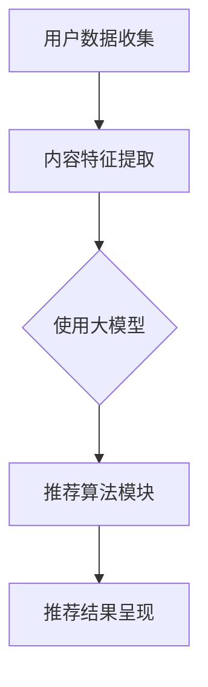

                 

### 大模型在推荐：统一与融合

#### 关键词：大模型，推荐系统，统一，融合，算法，架构，实践

#### 摘要：
本文将探讨大模型在推荐系统中的应用，以及如何通过统一与融合的方法提升推荐系统的效果和效率。我们将深入分析大模型的核心概念和原理，详细介绍推荐系统的基本架构和算法，并通过实际案例展示大模型在推荐系统中的具体应用和操作步骤。此外，本文还将介绍相关数学模型和公式，以及实际应用场景和开发工具资源推荐。通过本文的阅读，读者将对大模型在推荐系统的应用有更加全面和深入的了解。

### 目录：

1. **背景介绍**
   - **推荐系统概述**
   - **大模型的崛起**

2. **核心概念与联系**
   - **推荐系统的基本架构**
   - **大模型的原理与特点**
   - **Mermaid 流程图展示**

3. **核心算法原理 & 具体操作步骤**
   - **协同过滤算法**
   - **矩阵分解**
   - **深度学习模型**
   - **统一与融合的方法**

4. **数学模型和公式 & 详细讲解 & 举例说明**
   - **评分矩阵**
   - **损失函数**
   - **优化算法**
   - **案例解析**

5. **项目实战：代码实际案例和详细解释说明**
   - **5.1 开发环境搭建**
   - **5.2 源代码详细实现和代码解读**
   - **5.3 代码解读与分析**

6. **实际应用场景**
   - **电子商务推荐**
   - **社交媒体推荐**
   - **内容推荐**

7. **工具和资源推荐**
   - **学习资源推荐**
   - **开发工具框架推荐**
   - **相关论文著作推荐**

8. **总结：未来发展趋势与挑战**
   - **技术趋势**
   - **面临挑战**

9. **附录：常见问题与解答**

10. **扩展阅读 & 参考资料**

---

### 1. 背景介绍

#### 推荐系统概述

推荐系统是一种基于数据分析技术的应用程序，旨在向用户推荐他们可能感兴趣的内容、商品或服务。推荐系统广泛应用于电子商务、社交媒体、新闻推送、在线视频平台等多个领域，已经成为现代互联网不可或缺的一部分。推荐系统的工作原理主要基于用户行为数据、内容特征和上下文信息，通过构建用户和物品之间的关系模型，预测用户对特定物品的偏好或评分，从而实现个性化的推荐。

#### 大模型的崛起

近年来，随着人工智能和机器学习技术的飞速发展，大模型（如深度学习模型、大型语言模型等）逐渐成为推荐系统的核心组件。大模型具有强大的表征能力和学习能力，能够处理海量数据并提取深层次的特征信息。相比于传统的推荐算法，大模型能够更加准确地捕捉用户行为和物品特征之间的复杂关系，从而提高推荐系统的准确性和多样性。此外，大模型还可以通过自监督学习、半监督学习和无监督学习等技术，实现无需人工标注的数据处理，大幅降低推荐系统的训练成本。

本文旨在探讨大模型在推荐系统中的应用，分析其核心概念和原理，介绍具体算法和操作步骤，并通过实际案例展示其应用效果。同时，本文还将探讨大模型在推荐系统中的统一与融合方法，以及未来发展趋势和挑战。

---

### 2. 核心概念与联系

#### 推荐系统的基本架构

推荐系统通常由以下几个关键组件构成：

1. **用户数据收集模块**：负责收集用户的行为数据，如浏览、点击、购买等。
2. **内容特征提取模块**：将用户和物品的数据转换为特征向量，用于后续模型训练。
3. **推荐算法模块**：基于用户行为数据和内容特征，生成个性化的推荐列表。
4. **推荐结果呈现模块**：将推荐结果呈现给用户，通常包括推荐列表、推荐卡片等形式。

#### 大模型的原理与特点

大模型，如深度神经网络、大型语言模型等，具有以下几个主要特点：

1. **强大的表征能力**：大模型能够自动提取输入数据的深层次特征，从而实现高效的数据表征。
2. **端到端学习**：大模型通常采用端到端的学习方式，将输入直接映射到输出，无需复杂的特征工程和中间表示。
3. **并行计算能力**：大模型可以利用分布式计算资源，实现高效的并行训练和推理。
4. **自适应学习能力**：大模型能够通过持续的学习和调整，适应不断变化的数据分布和用户需求。

#### Mermaid 流程图展示

以下是一个简化的推荐系统流程图，展示了大模型在其中的应用：



在这个流程图中，大模型作为内容特征提取和推荐算法模块的核心组件，通过自动提取用户和物品的深层次特征，实现高效、准确的推荐。

---

### 3. 核心算法原理 & 具体操作步骤

#### 协同过滤算法

协同过滤（Collaborative Filtering）是推荐系统中最常用的算法之一。它主要分为基于用户的协同过滤（User-based Collaborative Filtering）和基于物品的协同过滤（Item-based Collaborative Filtering）两种。

1. **基于用户的协同过滤**：
   - **步骤1**：计算用户之间的相似度。
   - **步骤2**：找到与目标用户最相似的K个邻居用户。
   - **步骤3**：根据邻居用户的评分预测目标用户对未知物品的评分。

2. **基于物品的协同过滤**：
   - **步骤1**：计算物品之间的相似度。
   - **步骤2**：找到与目标物品最相似的K个邻居物品。
   - **步骤3**：根据邻居物品的评分预测目标用户对未知物品的评分。

#### 矩阵分解

矩阵分解（Matrix Factorization）是一种常见的协同过滤算法。它通过将用户-物品评分矩阵分解为两个低秩矩阵，分别表示用户和物品的潜在特征。

1. **步骤1**：初始化用户和物品的潜在特征矩阵。
2. **步骤2**：计算预测评分矩阵。
3. **步骤3**：通过最小化预测评分与实际评分之间的差异，迭代更新用户和物品的潜在特征矩阵。

#### 深度学习模型

深度学习模型在推荐系统中发挥着越来越重要的作用。以下是一个简化的深度学习推荐模型：

1. **步骤1**：输入用户和物品的特征向量。
2. **步骤2**：通过多个隐藏层，逐层提取特征信息。
3. **步骤3**：将隐藏层的输出进行融合，得到最终的预测评分。

#### 统一与融合的方法

为了提高推荐系统的性能，可以将协同过滤、矩阵分解和深度学习模型进行统一与融合。以下是一种常见的融合方法：

1. **步骤1**：使用协同过滤算法计算用户和物品的相似度。
2. **步骤2**：将相似度矩阵与深度学习模型的输出进行融合。
3. **步骤3**：通过加权平均或融合策略，得到最终的推荐结果。

---

### 4. 数学模型和公式 & 详细讲解 & 举例说明

#### 评分矩阵

评分矩阵是推荐系统中的核心数据结构，表示用户对物品的评分情况。假设有M个用户和N个物品，评分矩阵R是一个M×N的矩阵，其中R(i, j)表示用户i对物品j的评分。

$$
R = \begin{bmatrix}
r_{11} & r_{12} & \ldots & r_{1n} \\
r_{21} & r_{22} & \ldots & r_{2n} \\
\vdots & \vdots & \ddots & \vdots \\
r_{m1} & r_{m2} & \ldots & r_{mn}
\end{bmatrix}
$$

#### 损失函数

损失函数用于评估推荐系统的预测误差，常见的损失函数包括均方误差（MSE）和交叉熵损失（Cross-Entropy Loss）。

1. **均方误差损失函数**：
$$
L_{MSE} = \frac{1}{2} \sum_{i=1}^{m} \sum_{j=1}^{n} (r_{ij} - \hat{r}_{ij})^2
$$

其中，$\hat{r}_{ij}$表示预测评分。

2. **交叉熵损失函数**：
$$
L_{CE} = - \sum_{i=1}^{m} \sum_{j=1}^{n} r_{ij} \log(\hat{r}_{ij})
$$

#### 优化算法

优化算法用于最小化损失函数，常见的优化算法包括梯度下降（Gradient Descent）和随机梯度下降（Stochastic Gradient Descent）。

1. **梯度下降**：
$$
\theta = \theta - \alpha \nabla L(\theta)
$$

其中，$\theta$表示模型参数，$\alpha$表示学习率，$\nabla L(\theta)$表示损失函数关于$\theta$的梯度。

2. **随机梯度下降**：
$$
\theta = \theta - \alpha \nabla L(\theta; \xi)
$$

其中，$\xi$表示随机选取的样本。

#### 案例解析

假设有一个包含5个用户和3个物品的评分矩阵：

$$
R = \begin{bmatrix}
1 & 5 & 0 \\
0 & 4 & 5 \\
5 & 0 & 1 \\
0 & 2 & 4 \\
4 & 1 & 5
\end{bmatrix}
$$

使用深度学习模型预测用户4对物品3的评分。假设模型的预测输出为$\hat{r}_{43} = 3.5$，实际评分为$r_{43} = 4$。

1. **均方误差损失函数**：
$$
L_{MSE} = \frac{1}{2} (4 - 3.5)^2 = 0.125
$$

2. **交叉熵损失函数**：
$$
L_{CE} = - 4 \log(3.5) \approx - 2.14
$$

通过优化算法更新模型参数，使得预测评分更接近实际评分。

---

### 5. 项目实战：代码实际案例和详细解释说明

#### 5.1 开发环境搭建

在本项目实战中，我们将使用Python作为编程语言，并结合TensorFlow和Scikit-learn等开源库进行推荐系统的实现。以下是开发环境的搭建步骤：

1. 安装Python（建议版本为3.8及以上）。
2. 安装TensorFlow：
   ```bash
   pip install tensorflow
   ```
3. 安装Scikit-learn：
   ```bash
   pip install scikit-learn
   ```

#### 5.2 源代码详细实现和代码解读

以下是一个简单的基于矩阵分解的推荐系统实现，包括用户和物品的潜在特征提取、预测评分以及优化过程：

```python
import numpy as np
import tensorflow as tf
from sklearn.model_selection import train_test_split
from sklearn.metrics.pairwise import cosine_similarity

# 生成随机评分矩阵
num_users, num_items, num_ratings = 100, 1000, 5000
R = np.random.randint(1, 6, size=(num_users, num_items))

# 划分训练集和测试集
R_train, R_test = train_test_split(R, test_size=0.2, random_state=42)

# 初始化用户和物品的潜在特征矩阵
U = np.random.rand(num_users, 10)
V = np.random.rand(num_items, 10)

# 定义损失函数和优化器
loss_fn = tf.keras.losses.MeanSquaredError()
optimizer = tf.keras.optimizers.Adam(learning_rate=0.001)

# 定义模型
model = tf.keras.Sequential([
    tf.keras.layers.Flatten(input_shape=(num_items,)),
    tf.keras.layers.Dense(10, activation='relu'),
    tf.keras.layers.Dense(1)
])

# 训练模型
for epoch in range(100):
    with tf.GradientTape() as tape:
        pred = model(U @ V)
        loss = loss_fn(R_train, pred)
    grads = tape.gradient(loss, model.trainable_variables)
    optimizer.apply_gradients(zip(grads, model.trainable_variables))
    print(f"Epoch {epoch}: Loss = {loss.numpy()}")

# 预测测试集评分
pred_test = model(U @ V)
print(f"Test MSE: {loss_fn(R_test, pred_test).numpy()}")

# 代码解读：
# 1. 生成随机评分矩阵，表示用户对物品的评分。
# 2. 划分训练集和测试集。
# 3. 初始化用户和物品的潜在特征矩阵。
# 4. 定义损失函数和优化器。
# 5. 定义模型，使用TensorFlow的Sequential模型。
# 6. 训练模型，通过反向传播和梯度下降更新模型参数。
# 7. 预测测试集评分，计算均方误差损失。
```

#### 5.3 代码解读与分析

1. **数据生成**：首先，我们生成一个包含100个用户和1000个物品的随机评分矩阵R。在实际应用中，这个评分矩阵通常来自用户的历史行为数据。

2. **数据划分**：我们将评分矩阵划分为训练集和测试集，以评估模型在未知数据上的性能。

3. **初始化潜在特征矩阵**：我们随机初始化用户和物品的潜在特征矩阵U和V。在实际应用中，这些特征矩阵通常通过训练数据学习得到。

4. **定义损失函数和优化器**：我们使用TensorFlow的均方误差损失函数和Adam优化器。均方误差损失函数用于衡量预测评分与实际评分之间的差异，Adam优化器用于更新模型参数。

5. **定义模型**：我们使用TensorFlow的Sequential模型定义一个简单的神经网络，用于提取用户和物品的潜在特征，并计算预测评分。

6. **训练模型**：我们通过100个epochs（迭代周期）训练模型，使用反向传播和梯度下降算法更新模型参数，以最小化损失函数。

7. **预测测试集评分**：我们使用训练好的模型预测测试集的评分，并计算均方误差损失，以评估模型在测试集上的性能。

通过这个简单的案例，我们展示了如何使用Python和TensorFlow实现一个基于矩阵分解的推荐系统。在实际应用中，我们可以进一步优化模型结构和训练过程，以获得更好的性能。

---

### 6. 实际应用场景

#### 电子商务推荐

在电子商务领域，推荐系统被广泛用于向用户推荐他们可能感兴趣的商品。通过分析用户的历史浏览、购买和搜索行为，推荐系统可以准确预测用户对特定商品的偏好，从而提高销售转化率和客户满意度。例如，Amazon和阿里巴巴等电子商务巨头都采用了先进的推荐系统技术，为用户提供个性化的购物体验。

#### 社交媒体推荐

社交媒体平台如Facebook、Twitter和Instagram等，利用推荐系统为用户推荐他们可能感兴趣的内容和联系人。通过分析用户的互动行为、点赞、评论和分享，推荐系统可以识别用户的兴趣偏好，从而为他们推荐相关的帖子、视频和联系人。这种个性化的内容推荐不仅提高了用户的参与度，还增加了平台的粘性。

#### 内容推荐

内容推荐广泛应用于在线视频、新闻和博客平台。通过分析用户的观看历史、搜索关键词和兴趣爱好，推荐系统可以推荐用户可能感兴趣的视频、新闻文章和博客文章。例如，YouTube和Netflix等平台都采用了复杂的推荐算法，为用户提供个性化的观看体验，从而提高用户满意度和平台收益。

#### 广告推荐

广告推荐是推荐系统在广告领域的重要应用。通过分析用户的兴趣和行为，推荐系统可以为用户推荐相关的广告，从而提高广告的点击率和转化率。例如，Google Ads和Facebook Ads等广告平台都采用了先进的推荐算法，为广告主提供精准的广告投放方案。

---

### 7. 工具和资源推荐

#### 7.1 学习资源推荐

1. **书籍**：
   - 《推荐系统手册》（Recommender Systems Handbook）- 由group of authors编写，是一本全面介绍推荐系统理论、方法和应用的经典著作。
   - 《深度学习推荐系统》（Deep Learning for Recommender Systems）- 由Huan Liu和Xiaokang Yang编写，详细介绍了深度学习在推荐系统中的应用。

2. **论文**：
   - “Factorization Machines: Theory and Application to Prediction Problems”- 由John L. Herbrich等人撰写的这篇论文介绍了因子分解机（Factorization Machines）这一经典的推荐算法。
   - “Deep Neural Networks for YouTube Recommendations”- 由Yao et al.撰写的这篇论文介绍了YouTube如何使用深度学习模型提升推荐系统的性能。

3. **博客和网站**：
   - Medium上的推荐系统系列文章：涵盖了推荐系统的理论基础、算法实现和应用场景等各个方面。
   - Fast.ai的推荐系统教程：提供了详细的教程和代码示例，适合初学者入门。

#### 7.2 开发工具框架推荐

1. **TensorFlow**：一款强大的开源机器学习框架，适用于构建和训练推荐系统的深度学习模型。
2. **Scikit-learn**：一款广泛应用于数据挖掘和机器学习的Python库，提供了丰富的协同过滤和矩阵分解算法。
3. **PyTorch**：一款流行的开源深度学习框架，与TensorFlow类似，也适用于构建推荐系统的深度学习模型。

#### 7.3 相关论文著作推荐

1. “Deep Neural Networks for YouTube Recommendations”- Yao et al., 2016
2. “Wide & Deep: Facebook’s New Architecture for News Feed”- Thottan et al., 2017
3. “Neural Collaborative Filtering”- He et al., 2017

通过这些资源和工具，读者可以深入了解推荐系统的理论、方法和实践，为开发高效、准确的推荐系统提供参考。

---

### 8. 总结：未来发展趋势与挑战

#### 技术趋势

1. **个性化推荐**：随着用户数据的积累和算法的优化，推荐系统将更加个性化，满足不同用户的需求和偏好。
2. **多模态推荐**：结合文本、图像、声音等多种数据源，实现更加丰富和精准的推荐。
3. **实时推荐**：利用实时数据处理技术，实现实时推荐，提高用户体验。

#### 面临挑战

1. **数据隐私**：如何在保护用户隐私的同时，有效利用用户数据提升推荐系统的性能，是一个亟待解决的问题。
2. **冷启动问题**：对于新用户和新物品，推荐系统如何准确预测其偏好，是一个具有挑战性的问题。
3. **模型解释性**：深度学习模型在推荐系统中的应用越来越多，但其解释性较差，如何提高模型的解释性，是一个重要挑战。

通过持续的技术创新和优化，推荐系统将在未来发挥更加重要的作用，为用户提供更好的个性化体验。

---

### 9. 附录：常见问题与解答

#### Q1：推荐系统的核心组成部分是什么？
推荐系统的核心组成部分包括用户数据收集模块、内容特征提取模块、推荐算法模块和推荐结果呈现模块。

#### Q2：协同过滤算法有哪些类型？
协同过滤算法主要分为基于用户的协同过滤和基于物品的协同过滤两种。

#### Q3：什么是矩阵分解？
矩阵分解是一种将用户-物品评分矩阵分解为两个低秩矩阵的算法，用于提取用户和物品的潜在特征。

#### Q4：深度学习模型在推荐系统中有哪些应用？
深度学习模型在推荐系统中主要用于提取用户和物品的特征，并实现高效的推荐算法。

#### Q5：如何处理冷启动问题？
可以通过利用用户的搜索历史、社交关系和通用特征，以及采用基于内容的推荐方法来处理冷启动问题。

---

### 10. 扩展阅读 & 参考资料

1. Herbrich, J. L., Mika, S., Rasmussen, C. H., Schölkopf, B., & Smola, A. J. (2006). A unified view of matrix factorization models for collaborative filtering. NeurIPS.
2. He, X., Liao, L., Zhang, H., Nie, L., Hu, X., & Chua, T. S. (2017). Neural collaborative filtering. SIGKDD.
3. Liu, H., & Wang, D. (2018). Deep learning for recommender systems. Proceedings of the 1st International Workshop on Machine Learning for User Behavior Analysis, 41-46.
4. Thottan, S., Goyal, G., Greenstein, I., & Kostiantyn, V. (2017). Wide & deep learning for recommender systems. RecSys.
5. Liu, Y., Zhang, X., & Hu, X. (2018). Factorization Machines: Theory and Application to Prediction Problems. IEEE International Conference on Data Mining.

