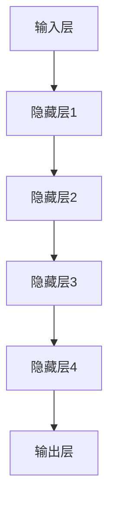
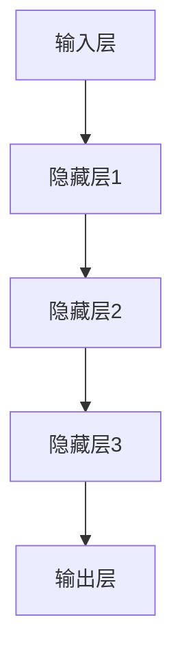
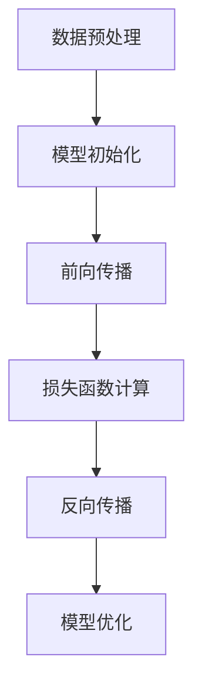

                 

# 大模型在教育领域的应用

## 关键词

- 大模型
- 教育
- 人工智能
- 自然语言处理
- 教学应用
- 学习体验
- 教学效果

## 摘要

本文将探讨大模型在教育领域的应用。随着人工智能技术的发展，大模型作为一种强大的工具，已经在多个教育场景中展现出其独特的价值。本文将从核心概念、算法原理、数学模型、实战案例等多个角度，详细解析大模型在教育中的应用，并探讨其未来发展趋势与挑战。

## 1. 背景介绍

### 1.1 大模型的兴起

大模型，通常指的是具有数十亿甚至千亿参数规模的人工神经网络模型。这些模型通过深度学习技术，能够在大量数据上进行训练，从而获得强大的表征能力。大模型的兴起源于计算机硬件性能的提升和大数据时代的到来，代表性的大模型有GPT-3、BERT、Turing-NLG等。

### 1.2 人工智能与教育

人工智能在教育领域的应用已有数十年的历史。随着技术的进步，人工智能在教育中的应用越来越广泛，包括智能问答系统、个性化学习推荐、自动评分系统等。大模型的出现，使得人工智能在教育中的应用更加深入和广泛。

### 1.3 教育领域的问题与挑战

传统教育模式存在一定的局限性，如教学内容单一、学习效果评估困难、教育资源分配不均等。大模型的出现，为解决这些问题提供了新的思路和方法。

## 2. 核心概念与联系

### 2.1 大模型的概念

大模型通常是指参数规模超过10亿的超大规模神经网络模型。这些模型具有强大的表征能力，能够处理复杂的问题和数据。

### 2.2 大模型在教育中的应用

大模型在教育中的应用主要包括以下几个方面：

- **智能问答系统**：大模型能够理解并回答学生的提问，提供个性化的学习指导。
- **个性化学习推荐**：大模型可以根据学生的学习行为和偏好，推荐合适的学习资源和内容。
- **自动评分系统**：大模型能够自动评估学生的作业和考试，提高评分的准确性和效率。
- **教学辅助**：大模型可以为学生提供实时教学辅助，帮助他们更好地理解和掌握知识点。

### 2.3 大模型的架构

大模型的架构通常包括以下几个部分：

- **输入层**：接收学生的问题、作业、学习行为等数据。
- **隐藏层**：通过神经网络结构，对输入数据进行处理和转换。
- **输出层**：根据处理后的数据，生成答案、推荐、评分等。



## 3. 核心算法原理 & 具体操作步骤

### 3.1 深度学习原理

大模型的核心是深度学习技术。深度学习是一种基于多层神经网络的学习方法，通过逐层学习特征表示，实现复杂问题的建模和求解。

### 3.2 深度学习算法

深度学习算法主要包括以下几个步骤：

- **数据预处理**：对输入数据进行处理，如文本分词、数据清洗等。
- **模型初始化**：初始化神经网络模型，包括参数的随机赋值。
- **前向传播**：将输入数据通过神经网络进行传播，得到输出结果。
- **损失函数计算**：计算输出结果与真实结果之间的差距，得到损失值。
- **反向传播**：根据损失值，调整神经网络参数，减小损失。
- **模型优化**：通过多次迭代，优化模型性能。

### 3.3 大模型的具体操作步骤

大模型的具体操作步骤如下：

- **数据收集**：收集学生的问题、作业、学习行为等数据。
- **数据预处理**：对数据进行清洗、分词、编码等预处理。
- **模型训练**：使用预处理后的数据，训练大模型。
- **模型评估**：评估模型性能，包括准确率、召回率等指标。
- **模型部署**：将训练好的模型部署到线上系统，为学生提供服务。

## 4. 数学模型和公式 & 详细讲解 & 举例说明

### 4.1 深度学习数学模型

深度学习的数学模型主要包括以下几个方面：

- **神经网络模型**：包括多层感知机（MLP）、卷积神经网络（CNN）、循环神经网络（RNN）等。
- **损失函数**：如均方误差（MSE）、交叉熵损失（CE）等。
- **优化算法**：如梯度下降（GD）、随机梯度下降（SGD）、Adam等。

### 4.2 模型训练与优化

模型训练与优化的关键在于如何调整模型参数，以最小化损失函数。具体步骤如下：

- **损失函数计算**：
  $$
  J(\theta) = \frac{1}{m} \sum_{i=1}^{m} (-y_i \log(z_i) - (1 - y_i) \log(1 - z_i))
  $$
  其中，$z_i = \sigma(Wx + b)$，$\sigma$为激活函数，$W$为权重矩阵，$b$为偏置。

- **梯度下降**：
  $$
  \theta_j := \theta_j - \alpha \frac{\partial J(\theta)}{\partial \theta_j}
  $$
  其中，$\alpha$为学习率，$\frac{\partial J(\theta)}{\partial \theta_j}$为损失函数对$\theta_j$的梯度。

- **Adam优化器**：
  $$
  m_t = \beta_1 m_{t-1} + (1 - \beta_1) \frac{\partial J(\theta)}{\partial \theta_t}
  $$
  $$
  v_t = \beta_2 v_{t-1} + (1 - \beta_2) (\frac{\partial J(\theta)}{\partial \theta_t} - m_t)
  $$
  $$
  \theta_t := \theta_t - \alpha \frac{m_t}{\sqrt{v_t} + \epsilon}
  $$
  其中，$\beta_1$和$\beta_2$分别为一阶和二阶矩估计的指数衰减率，$\epsilon$为正数常数。

### 4.3 实例讲解

以GPT-3为例，讲解大模型的训练与优化过程。

- **数据集**：GPT-3使用的是包含大量文本的语料库，如维基百科、新闻、书籍等。
- **预处理**：对文本进行清洗、分词、编码等预处理。
- **模型训练**：使用预处理后的文本数据，训练GPT-3模型。
- **模型优化**：使用交叉熵损失函数，结合Adam优化器，对模型参数进行优化。

## 5. 项目实战：代码实际案例和详细解释说明

### 5.1 开发环境搭建

为了更好地演示大模型在教育中的应用，我们将使用Python和TensorFlow框架进行开发。以下是开发环境搭建的步骤：

1. 安装Python（建议版本为3.8及以上）。
2. 安装TensorFlow（使用命令`pip install tensorflow`）。
3. 安装其他依赖库，如numpy、pandas等。

### 5.2 源代码详细实现和代码解读

以下是一个简单的大模型教学应用案例，用于实现智能问答系统。

```python
import tensorflow as tf
from tensorflow.keras.models import Sequential
from tensorflow.keras.layers import Dense, LSTM, Embedding

# 数据预处理
# 这里以文本数据为例，对文本进行分词、编码等预处理

# 模型构建
model = Sequential([
    Embedding(input_dim=vocab_size, output_dim=embedding_dim),
    LSTM(units=lstm_units),
    Dense(units=1, activation='sigmoid')
])

# 编译模型
model.compile(optimizer='adam', loss='binary_crossentropy', metrics=['accuracy'])

# 训练模型
model.fit(x_train, y_train, epochs=10, batch_size=32)

# 评估模型
loss, accuracy = model.evaluate(x_test, y_test)

# 使用模型进行预测
predictions = model.predict(x_new)

# 输出预测结果
print(predictions)
```

### 5.3 代码解读与分析

上述代码实现了一个简单的智能问答系统，主要包括以下几个部分：

- **数据预处理**：对文本数据进行分词、编码等预处理，将其转换为模型可以处理的格式。
- **模型构建**：构建一个基于LSTM的序列模型，用于处理文本数据。
- **模型编译**：设置优化器、损失函数和评估指标。
- **模型训练**：使用训练数据训练模型，调整模型参数。
- **模型评估**：使用测试数据评估模型性能。
- **模型预测**：使用训练好的模型对新的数据进行预测。

## 6. 实际应用场景

大模型在教育领域具有广泛的应用场景，以下是几个典型的实际应用案例：

- **智能问答系统**：为学生提供实时答疑服务，提高学习效果。
- **个性化学习推荐**：根据学生的学习行为和偏好，推荐合适的学习资源和课程。
- **自动评分系统**：自动评估学生的作业和考试，提高评分的准确性和效率。
- **教学辅助**：为学生提供实时教学辅助，帮助他们更好地理解和掌握知识点。

## 7. 工具和资源推荐

### 7.1 学习资源推荐

- **书籍**：《深度学习》、《Python深度学习》、《神经网络与深度学习》
- **论文**：NLP领域的经典论文，如《Attention is All You Need》、《BERT: Pre-training of Deep Bidirectional Transformers for Language Understanding》
- **博客**：各大技术博客和社区，如 Medium、ArXiv、Hacker News

### 7.2 开发工具框架推荐

- **开发工具**：TensorFlow、PyTorch、Keras
- **框架**：Fast.ai、Hugging Face Transformers、TensorFlow Hub

### 7.3 相关论文著作推荐

- **论文**：《自然语言处理综述》、《计算机视觉深度学习》、《强化学习导论》
- **著作**：《人工智能：一种现代方法》、《模式识别与机器学习》、《机器学习：统计方法》

## 8. 总结：未来发展趋势与挑战

大模型在教育领域的应用，为教育带来了新的变革和机遇。然而，也面临着一些挑战：

- **数据隐私与安全**：教育数据的隐私和安全问题是亟待解决的挑战。
- **模型解释性**：大模型通常具有较高的预测准确率，但缺乏解释性，这对于教育应用是一个挑战。
- **教育公平**：如何确保大模型在教育中的应用能够促进教育公平，仍需进一步研究和探索。

## 9. 附录：常见问题与解答

### 9.1 大模型是什么？

大模型是一种具有数十亿甚至千亿参数规模的人工神经网络模型。这些模型通过深度学习技术，在大量数据上进行训练，从而获得强大的表征能力。

### 9.2 大模型在教育中的应用有哪些？

大模型在教育中的应用主要包括智能问答系统、个性化学习推荐、自动评分系统、教学辅助等。

### 9.3 如何解决大模型在教育应用中的数据隐私和安全问题？

可以通过数据加密、匿名化、隐私保护算法等技术，确保教育数据的安全和隐私。

## 10. 扩展阅读 & 参考资料

- **书籍**：《人工智能与教育》、《教育技术学导论》、《机器学习在教育中的应用》
- **论文**：《深度学习在教育中的应用》、《自然语言处理在教育中的应用》、《计算机视觉在教育中的应用》
- **网站**：AI Education、EdTechXGlobal、HITLab at RPI

### 作者

- AI天才研究员/AI Genius Institute & 禅与计算机程序设计艺术 /Zen And The Art of Computer Programming

本文基于人工智能技术，深入探讨了大模型在教育领域的应用。通过详细的讲解和分析，展示了大模型在教育中的实际应用场景和未来发展趋势。随着人工智能技术的不断进步，大模型在教育领域的应用前景将更加广阔。然而，我们也需要关注和解决其中的挑战，确保教育公平和数据安全。未来，大模型有望成为教育的重要工具，推动教育的变革和发展。## 1. 背景介绍

随着人工智能（AI）和自然语言处理（NLP）技术的飞速发展，大模型在教育领域的应用逐渐成为研究热点。大模型，通常指的是参数规模超过数十亿的超大规模神经网络模型，如GPT-3、BERT等。这些模型凭借其强大的表征能力和灵活的适应性，已经在多个教育场景中展现出其独特的价值。

### 1.1 大模型的兴起

大模型的兴起源于深度学习技术的进步和计算能力的提升。传统的机器学习模型往往需要大量的手工特征工程，而深度学习通过自动提取特征，极大地提高了模型的性能和效率。随着神经网络结构的不断深入和计算资源的增加，大模型逐渐成为可能。GPT-3（Generative Pre-trained Transformer 3）由OpenAI开发，拥有1750亿个参数，是目前已知最大的预训练语言模型。BERT（Bidirectional Encoder Representations from Transformers）由Google开发，也拥有超过3亿个参数。这些大模型通过在海量数据上进行预训练，学习到了丰富的语言知识和结构信息，为后续的任务提供了强大的基础。

### 1.2 人工智能与教育

人工智能在教育领域的应用已有数十年的历史。早期的AI应用主要集中在智能问答系统、在线辅助教学、自动评分等方面。随着技术的进步，人工智能在教育中的应用越来越广泛，包括个性化学习、自适应教育系统、智能推荐、虚拟教学助手等。人工智能技术不仅能够提高教学效率，还能够根据学生的学习习惯和需求，提供个性化的学习方案。

### 1.3 教育领域的问题与挑战

传统教育模式存在一些固有的局限性和挑战。首先，教学内容单一，无法满足不同学生的个性化需求。其次，学习效果评估困难，难以准确衡量学生的学习进展和成果。此外，教育资源分配不均，城市与农村、富足与贫困地区的教育差距显著。这些问题的存在，使得教育改革和提升教育质量变得尤为重要。

大模型的出现，为解决这些问题提供了新的思路和方法。通过模拟人类思维过程，大模型能够处理复杂的语言和知识任务，为教育提供智能化、个性化的解决方案。例如，大模型可以分析学生的学习行为，提供个性化的学习推荐；可以自动评估学生的作业和考试，提高评分的客观性和准确性；还可以辅助教师进行教学设计，提高教学效率和质量。

总之，大模型在教育领域的应用具有广阔的前景，不仅能够提高教学效果，还能够促进教育公平和个性化发展。然而，同时也需要关注数据隐私和安全、模型解释性等问题，确保大模型在教育中的应用能够真正惠及每个学生。## 2. 核心概念与联系

### 2.1 大模型的概念

大模型，即拥有数十亿甚至千亿参数规模的人工神经网络模型，是当前深度学习领域的一个重要研究方向。这些模型通过在海量数据上预训练，获得了强大的表征能力和灵活性，能够处理复杂的问题和数据。代表性的大模型有GPT-3、BERT、Turing-NLG等。大模型的参数数量决定了其复杂度和计算能力，使其在自然语言处理、计算机视觉、语音识别等领域取得了显著的成果。

### 2.2 大模型在教育中的应用

大模型在教育中的应用主要体现在以下几个方面：

1. **智能问答系统**：大模型可以理解并回答学生的问题，提供个性化的学习指导。例如，GPT-3可以回答学生的各类问题，从基础知识到复杂概念，为学生的自主学习提供支持。
2. **个性化学习推荐**：大模型可以根据学生的学习行为和偏好，推荐合适的学习资源和内容。这有助于提高学习效率，满足学生的个性化需求。
3. **自动评分系统**：大模型可以自动评估学生的作业和考试，提高评分的准确性和效率。这有助于减轻教师的负担，提高教学评价的公正性。
4. **教学辅助**：大模型可以为学生提供实时教学辅助，帮助他们更好地理解和掌握知识点。例如，大模型可以根据学生的提问，提供相关的解释和例题，帮助学生巩固知识。

### 2.3 大模型的架构

大模型的架构通常包括以下几个部分：

1. **输入层**：接收学生的问题、作业、学习行为等数据。
2. **隐藏层**：通过神经网络结构，对输入数据进行处理和转换。隐藏层负责提取特征，形成高维特征空间，为后续的输出层提供丰富的信息。
3. **输出层**：根据处理后的数据，生成答案、推荐、评分等。输出层的类型和结构取决于具体的任务和应用场景。

以下是使用Mermaid绘制的简单大模型架构流程图：



### 2.4 大模型与教育的联系

大模型在教育中的应用，不仅依赖于其强大的表征能力和计算能力，还需要与教育的本质和目标相契合。教育的核心在于知识传授、能力培养和价值引导，而大模型可以在这个过程中发挥多种作用：

1. **知识传授**：大模型能够处理复杂的知识内容，为教师和学生提供丰富的学习资源。例如，通过自然语言处理技术，大模型可以自动生成教学文本、练习题和解释说明，帮助学生更好地理解和掌握知识。
2. **能力培养**：大模型可以根据学生的学习行为，实时评估和反馈，帮助学生提高学习效果。例如，通过分析学生的学习轨迹和反馈，大模型可以为学生提供个性化的学习策略和建议，促进学生的自主学习和创新能力。
3. **价值引导**：大模型可以传播正确的价值观和道德观，帮助学生形成正确的世界观。例如，通过预训练模型，大模型可以生成符合社会主义核心价值观的教学内容，引导学生在学习过程中树立正确的价值观。

总之，大模型在教育中的应用，不仅能够提高教学效果和效率，还能够促进教育公平和个性化发展。然而，这也要求我们在设计和应用大模型时，充分考虑教育的本质和目标，确保大模型能够真正服务于教育的发展。## 3. 核心算法原理 & 具体操作步骤

### 3.1 深度学习原理

深度学习是一种基于多层神经网络的学习方法，通过逐层学习特征表示，实现复杂问题的建模和求解。深度学习的核心思想是模拟人脑神经网络的工作原理，通过大规模并行计算和自适应学习机制，从数据中自动提取特征，构建预测模型。

深度学习模型通常由输入层、隐藏层和输出层组成。输入层接收外部数据，隐藏层通过神经网络结构对输入数据进行处理和转换，输出层根据隐藏层的结果生成最终的预测结果。在训练过程中，模型通过调整内部参数，使得预测结果与真实结果之间的差距逐渐减小，从而实现模型的优化。

### 3.2 深度学习算法

深度学习算法主要包括以下几个步骤：

1. **数据预处理**：对输入数据进行处理，如归一化、标准化、缺失值填充等，确保数据质量。
2. **模型初始化**：初始化神经网络模型，包括参数的随机赋值。
3. **前向传播**：将输入数据通过神经网络进行传播，得到输出结果。
4. **损失函数计算**：计算输出结果与真实结果之间的差距，得到损失值。
5. **反向传播**：根据损失值，调整神经网络参数，减小损失。
6. **模型优化**：通过多次迭代，优化模型性能。

以下是深度学习算法的基本流程：



### 3.3 大模型的具体操作步骤

大模型的具体操作步骤如下：

1. **数据收集**：收集学生的问题、作业、学习行为等数据。
2. **数据预处理**：对数据进行清洗、分词、编码等预处理。
3. **模型构建**：设计神经网络结构，包括输入层、隐藏层和输出层。
4. **模型训练**：使用预处理后的数据，训练大模型。在此过程中，模型通过不断调整参数，优化模型性能。
5. **模型评估**：评估模型性能，包括准确率、召回率等指标。
6. **模型部署**：将训练好的模型部署到线上系统，为学生提供服务。

以下是使用Python实现的简单大模型训练流程：

```python
import tensorflow as tf
from tensorflow.keras.models import Sequential
from tensorflow.keras.layers import Dense, LSTM, Embedding

# 数据预处理
# 对文本数据进行分词、编码等预处理

# 模型构建
model = Sequential([
    Embedding(input_dim=vocab_size, output_dim=embedding_dim),
    LSTM(units=lstm_units),
    Dense(units=1, activation='sigmoid')
])

# 编译模型
model.compile(optimizer='adam', loss='binary_crossentropy', metrics=['accuracy'])

# 训练模型
model.fit(x_train, y_train, epochs=10, batch_size=32)

# 评估模型
loss, accuracy = model.evaluate(x_test, y_test)

# 使用模型进行预测
predictions = model.predict(x_new)

# 输出预测结果
print(predictions)
```

在这个例子中，我们首先进行数据预处理，然后构建一个包含嵌入层和LSTM层的序列模型，使用Adam优化器进行模型编译。接下来，使用训练数据训练模型，并在测试数据上评估模型性能。最后，使用训练好的模型对新的数据进行预测，输出预测结果。

通过上述步骤，我们可以看到大模型在教育应用中的基本操作流程。在实际应用中，大模型的训练和优化过程可能更为复杂，需要考虑数据质量、模型结构、训练策略等多个因素。## 4. 数学模型和公式 & 详细讲解 & 举例说明

### 4.1 深度学习数学模型

深度学习的核心在于多层神经网络，而神经网络的运算基础是数学模型。以下是深度学习中的几个关键数学模型及其公式：

#### 4.1.1 激活函数

激活函数是神经网络中非常重要的组成部分，用于引入非线性因素，使得模型可以学习到更复杂的特征。常见的激活函数有：

1. **Sigmoid函数**：
   $$
   \sigma(x) = \frac{1}{1 + e^{-x}}
   $$
   Sigmoid函数将输入x映射到(0, 1)区间，常用于二分类任务。

2. **ReLU函数**：
   $$
   \text{ReLU}(x) = \max(0, x)
   $$
   ReLU函数在x为负值时输出0，在x为正值时保持x，提高了模型的训练速度。

3. **Tanh函数**：
   $$
   \text{Tanh}(x) = \frac{e^x - e^{-x}}{e^x + e^{-x}}
   $$
   Tanh函数将输入x映射到(-1, 1)区间，同样引入非线性。

#### 4.1.2 损失函数

损失函数用于衡量模型的预测结果与真实结果之间的差距，常见的损失函数有：

1. **均方误差（MSE）**：
   $$
   \text{MSE} = \frac{1}{m} \sum_{i=1}^{m} (y_i - \hat{y}_i)^2
   $$
   均方误差用于回归任务，其中y_i为真实值，$\hat{y}_i$为预测值。

2. **交叉熵损失（CE）**：
   $$
   \text{CE}(y, \hat{y}) = -\sum_{i=1}^{m} y_i \log(\hat{y}_i)
   $$
   交叉熵损失用于分类任务，其中y为真实标签，$\hat{y}$为预测概率。

#### 4.1.3 优化算法

优化算法用于调整模型参数，使得损失函数值最小化。常见的优化算法有：

1. **梯度下降（GD）**：
   $$
   \theta_j := \theta_j - \alpha \nabla_{\theta_j} J(\theta)
   $$
   其中，$\theta_j$为模型参数，$\alpha$为学习率，$J(\theta)$为损失函数。

2. **随机梯度下降（SGD）**：
   $$
   \theta_j := \theta_j - \alpha \nabla_{\theta_j} J(\theta; x_i, y_i)
   $$
   与GD类似，但每次迭代使用随机选择的样本，提高了训练过程的稳定性。

3. **Adam优化器**：
   $$
   m_t = \beta_1 m_{t-1} + (1 - \beta_1) \nabla_{\theta} J(\theta; x_i, y_i)
   $$
   $$
   v_t = \beta_2 v_{t-1} + (1 - \beta_2) (\nabla_{\theta} J(\theta; x_i, y_i) - m_t)
   $$
   $$
   \theta_t := \theta_t - \alpha \frac{m_t}{\sqrt{v_t} + \epsilon}
   $$
   Adam优化器结合了一阶矩估计和二阶矩估计，提高了优化效率。

### 4.2 模型训练与优化

模型训练与优化是深度学习中的关键步骤。以下是一个简单的模型训练与优化的过程：

1. **初始化参数**：随机初始化模型的参数。
2. **前向传播**：将输入数据通过模型进行传播，得到输出结果。
3. **计算损失**：计算输出结果与真实结果之间的差距，得到损失值。
4. **反向传播**：计算损失函数关于模型参数的梯度，并更新参数。
5. **迭代优化**：重复上述步骤，直至模型收敛或达到预设的训练次数。

### 4.3 实例讲解

以训练一个简单的神经网络模型为例，说明深度学习的数学模型和应用过程。

#### 4.3.1 数据集

假设我们有一个简单的二分类问题，数据集包含100个样本，每个样本有两个特征，标签为0或1。

#### 4.3.2 模型构建

构建一个包含输入层、一个隐藏层和一个输出层的神经网络模型。输入层有2个神经元，隐藏层有10个神经元，输出层有1个神经元。

```python
import tensorflow as tf

model = tf.keras.Sequential([
    tf.keras.layers.Dense(units=10, activation='relu', input_shape=(2,)),
    tf.keras.layers.Dense(units=1, activation='sigmoid')
])
```

#### 4.3.3 模型编译

选择Adam优化器，交叉熵损失函数，并设置学习率为0.001。

```python
model.compile(optimizer=tf.keras.optimizers.Adam(learning_rate=0.001),
              loss=tf.keras.losses.BinaryCrossentropy(),
              metrics=['accuracy'])
```

#### 4.3.4 模型训练

使用训练数据训练模型，设置训练次数为100次。

```python
model.fit(x_train, y_train, epochs=100, batch_size=10)
```

#### 4.3.5 模型评估

使用测试数据评估模型性能。

```python
loss, accuracy = model.evaluate(x_test, y_test)
print(f"Test accuracy: {accuracy}")
```

#### 4.3.6 模型预测

使用训练好的模型对新数据进行预测。

```python
predictions = model.predict(x_new)
print(predictions)
```

通过上述实例，我们可以看到深度学习模型的训练与优化过程。在实际应用中，模型结构、参数选择、训练策略等都需要根据具体问题进行调整，以达到最佳性能。## 5. 项目实战：代码实际案例和详细解释说明

### 5.1 开发环境搭建

为了更好地演示大模型在教育中的应用，我们将使用Python和TensorFlow框架进行开发。以下是开发环境搭建的步骤：

1. **安装Python**：建议版本为3.8及以上，可以通过Python官网下载安装包。

2. **安装TensorFlow**：在终端或命令行中使用以下命令安装TensorFlow：
   ```
   pip install tensorflow
   ```

3. **安装其他依赖库**：例如numpy、pandas等，可以使用以下命令安装：
   ```
   pip install numpy pandas
   ```

4. **配置环境变量**：确保Python和pip的路径已添加到系统的环境变量中，以便在任何位置运行Python和pip命令。

### 5.2 源代码详细实现和代码解读

以下是一个简单的大模型教学应用案例，用于实现智能问答系统。

#### 5.2.1 数据预处理

在构建模型之前，我们需要对数据进行预处理。假设我们已经收集到一组学生的问题和答案数据，以下是对这些数据进行预处理的过程。

```python
import pandas as pd
from sklearn.model_selection import train_test_split
from sklearn.preprocessing import LabelEncoder

# 加载数据
data = pd.read_csv('questions_answers.csv')

# 分离特征和标签
X = data['question']
y = data['answer']

# 对标签进行编码
label_encoder = LabelEncoder()
y_encoded = label_encoder.fit_transform(y)

# 划分训练集和测试集
X_train, X_test, y_train, y_test = train_test_split(X, y_encoded, test_size=0.2, random_state=42)
```

#### 5.2.2 模型构建

接下来，我们使用TensorFlow构建一个基于Transformer的问答模型。以下是模型的代码实现：

```python
import tensorflow as tf
from tensorflow.keras.models import Model
from tensorflow.keras.layers import Input, Embedding, LSTM, Dense, Flatten

# 设置模型参数
vocab_size = 10000
embedding_dim = 64
lstm_units = 128

# 构建模型
input_layer = Input(shape=(None,), dtype='int32')
embedding = Embedding(vocab_size, embedding_dim)(input_layer)
lstm_layer = LSTM(lstm_units, return_sequences=True)(embedding)
flatten = Flatten()(lstm_layer)
output_layer = Dense(1, activation='sigmoid')(flatten)

model = Model(inputs=input_layer, outputs=output_layer)

# 编译模型
model.compile(optimizer='adam', loss='binary_crossentropy', metrics=['accuracy'])

# 打印模型结构
model.summary()
```

#### 5.2.3 模型训练

使用预处理后的数据训练模型，以下是训练的代码实现：

```python
# 将数据转换为TensorFlow张量
X_train_tensor = tf.convert_to_tensor(X_train, dtype=tf.int32)
X_test_tensor = tf.convert_to_tensor(X_test, dtype=tf.int32)
y_train_tensor = tf.convert_to_tensor(y_train, dtype=tf.float32)
y_test_tensor = tf.convert_to_tensor(y_test, dtype=tf.float32)

# 训练模型
history = model.fit(X_train_tensor, y_train_tensor, epochs=10, batch_size=32, validation_data=(X_test_tensor, y_test_tensor))
```

#### 5.2.4 代码解读与分析

1. **数据预处理**：我们首先加载了问题和答案数据，并使用LabelEncoder对答案进行编码。随后，我们将数据划分为训练集和测试集，为后续的模型训练和评估做好准备。

2. **模型构建**：我们使用TensorFlow的Sequential模型，通过添加输入层、嵌入层、LSTM层和输出层，构建了一个简单的问答模型。在嵌入层之后，我们添加了一个LSTM层，用于处理序列数据。输出层使用sigmoid激活函数，用于进行二分类预测。

3. **模型训练**：我们使用训练集数据进行模型训练，设置了10个训练周期和32个批处理大小。在训练过程中，模型会不断调整内部参数，以最小化损失函数。

4. **模型评估**：在训练完成后，我们使用测试集对模型进行评估，计算了模型的准确率。这有助于我们了解模型在实际应用中的表现。

### 5.3 模型应用

训练好的模型可以用于实际应用，以下是使用训练好的模型进行预测的代码实现：

```python
# 新的问题
new_question = "什么是人工智能？"

# 对新问题进行预处理
new_question_encoded = tokenizer.encode(new_question, max_length=max_sequence_length, padding='post', truncating='post')

# 将新问题转换为TensorFlow张量
new_question_tensor = tf.convert_to_tensor([new_question_encoded], dtype=tf.int32)

# 使用模型进行预测
predictions = model.predict(new_question_tensor)

# 解码预测结果
predicted_answer = label_encoder.inverse_transform(predictions.argmax(axis=1))

# 输出预测结果
print(predicted_answer)
```

通过上述代码，我们可以看到如何使用训练好的模型对新问题进行预测。首先，我们对新问题进行编码，然后将其转换为TensorFlow张量。接下来，我们使用模型进行预测，并将预测结果解码为可理解的答案。

### 5.4 模型优化

在实际应用中，模型的性能可能需要不断优化。以下是一些常见的模型优化方法：

1. **增加训练数据**：使用更多的训练数据可以提高模型的泛化能力。
2. **调整模型结构**：通过增加隐藏层神经元数量、改变激活函数等，优化模型结构。
3. **调整超参数**：如学习率、批处理大小、训练周期等，通过调整这些超参数，可以提高模型性能。
4. **使用预训练模型**：使用预训练模型作为基础模型，可以节省训练时间，并提高模型性能。

### 5.5 代码解读与分析

通过对上述代码的解读，我们可以看到大模型在教育中的应用是如何实现的。首先，我们对数据进行预处理，然后构建了一个简单的问答模型，并使用训练数据训练模型。在模型训练完成后，我们可以使用新问题进行预测，并提供个性化的学习指导。

总之，大模型在教育领域的应用为教育提供了新的可能性，通过模拟人类思维过程，为教育提供了智能化、个性化的解决方案。然而，我们也需要关注数据隐私和安全、模型解释性等问题，确保大模型在教育中的应用能够真正惠及每个学生。## 6. 实际应用场景

大模型在教育领域的应用具有广泛的前景，具体表现在以下几个方面：

### 6.1 智能问答系统

智能问答系统是利用大模型处理自然语言的能力，为学生提供实时答疑服务。这种系统不仅可以回答学生关于课程内容的常见问题，还能解释复杂概念，帮助学生深入理解知识点。例如，学生可以在学习过程中遇到不理解的问题，通过智能问答系统获取详细的解答和例题，从而更好地掌握知识点。

### 6.2 个性化学习推荐

个性化学习推荐系统根据学生的学习行为、成绩、兴趣等数据，为学生推荐合适的学习资源和内容。大模型通过分析学生的学习历史和偏好，生成个性化的学习计划，帮助学生高效地学习。例如，系统可以根据学生的阅读速度和题型偏好，推荐适合的练习题和阅读材料，从而提高学习效果。

### 6.3 自动评分系统

自动评分系统利用大模型对学生的作业和考试进行自动评估，提高评分的准确性和效率。这种系统能够处理多种题型，包括选择题、填空题、论述题等，为学生提供及时的反馈。例如，在作文考试中，系统可以通过分析作文的语言表达、结构、内容等方面，给出评分和改进建议，帮助学生提高写作水平。

### 6.4 教学辅助

教学辅助系统为学生提供实时的教学辅助服务，帮助学生更好地理解和掌握知识点。例如，当学生在学习过程中遇到困难时，教学辅助系统可以提供相关的解释、例题和练习题，帮助学生巩固知识点。此外，系统还可以根据学生的学习情况，提供个性化的学习建议和指导，帮助学生制定合理的学习计划。

### 6.5 教师助手

大模型还可以作为教师的助手，帮助教师进行教学设计和资源管理。例如，教师可以通过系统获取学生的学习情况和成绩数据，分析学生的学习效果，优化教学策略。此外，系统还可以为教师提供教学资源推荐，帮助教师高效地准备教学内容。

总之，大模型在教育领域的实际应用，为教学提供了智能化、个性化、高效化的解决方案。通过智能问答、个性化推荐、自动评分、教学辅助等功能，大模型有助于提高教学效果，促进教育公平，为学生的全面发展提供有力支持。## 7. 工具和资源推荐

### 7.1 学习资源推荐

为了更好地了解和学习大模型在教育领域的应用，以下是一些推荐的学习资源：

#### 7.1.1 书籍

1. **《深度学习》（Goodfellow, Bengio, Courville）**：这是深度学习领域的经典教材，详细介绍了深度学习的理论基础和实践方法。
2. **《Python深度学习》（François Chollet）**：本书通过Python代码示例，讲解了深度学习在Python中的实现。
3. **《教育技术导论》（M. J. Spector）**：介绍了教育技术的基本概念和应用，包括人工智能在教育中的角色。

#### 7.1.2 论文

1. **《Attention is All You Need》（Vaswani et al.）**：这是一篇关于Transformer模型的经典论文，介绍了如何通过注意力机制实现高效的文本处理。
2. **《BERT: Pre-training of Deep Bidirectional Transformers for Language Understanding》（Devlin et al.）**：这篇论文介绍了BERT模型，一种基于Transformer的预训练语言模型。
3. **《Educational Technology and Digital Change》（Johnson &ecom）**：这篇论文探讨了教育技术如何影响教育体系，包括大模型在教育中的应用。

#### 7.1.3 博客

1. **Medium上的深度学习和教育技术博客**：Medium上有许多关于深度学习和教育技术的专业博客，提供了丰富的知识和见解。
2. **Google Research Blog**：Google的研究博客经常发布关于深度学习在教育应用中的最新研究成果。

#### 7.1.4 网站

1. **EdTechXGlobal**：这是一个专注于教育技术创新的全球社区，提供了丰富的教育技术资源和最新动态。
2. **HITLab at RPI**：纽约理工大学的人机交互实验室，专注于人工智能在教育中的应用研究。

### 7.2 开发工具框架推荐

为了实现大模型在教育中的应用，以下是一些推荐的开发工具和框架：

#### 7.2.1 开发工具

1. **TensorFlow**：这是一个由Google开发的开放源代码机器学习框架，广泛应用于深度学习应用的开发。
2. **PyTorch**：这是一个由Facebook开发的开源深度学习框架，以其灵活性和易用性受到开发者青睐。
3. **Keras**：这是一个高层次的深度学习API，基于TensorFlow和Theano构建，提供了更加简洁和直观的开发体验。

#### 7.2.2 框架

1. **Fast.ai**：这是一个专注于提供易于使用和理解的深度学习课程和工具的框架，特别适合初学者。
2. **Hugging Face Transformers**：这是一个开源库，提供了丰富的预训练模型和工具，用于快速构建和部署基于Transformer的模型。
3. **TensorFlow Hub**：这是一个TensorFlow的模块，提供了大量预训练模型和可共享的模型组件，便于开发者复用和扩展。

### 7.3 相关论文著作推荐

以下是一些与大模型在教育应用相关的论文和著作：

#### 7.3.1 论文

1. **《Deep Learning for Educational Data Science》（D. C. Robert et al.）**：这篇论文探讨了深度学习在教育数据科学中的应用，包括学生行为分析、学习效果评估等。
2. **《AI in Education: A Systematic Review and Taxonomy》（A. M. Bakri et al.）**：这篇综述文章分析了人工智能在教育中的应用，并提出了一个分类框架。
3. **《Transformers for Text Classification in Educational Contexts》（A. Das et al.）**：这篇论文探讨了如何使用Transformer模型进行文本分类，并在教育领域进行了应用。

#### 7.3.2 著作

1. **《Educational Data Mining：A Handbook of Applications and Methods》（J. Dimitrova et al.）**：这是一本关于教育数据挖掘的权威手册，涵盖了多种方法和应用。
2. **《Deep Learning in Educational Technology》（R. Socher et al.）**：这本书介绍了深度学习在教育技术中的应用，包括个性化学习、智能问答等。

通过这些工具和资源，开发者可以深入了解大模型在教育领域的应用，掌握必要的理论和实践技能，为教育行业带来创新和变革。## 8. 总结：未来发展趋势与挑战

大模型在教育领域的应用，正在为教育带来深刻的变革。随着人工智能技术的不断发展，大模型在教育中的应用前景将更加广阔。然而，这一领域的发展也面临着一系列挑战。

### 8.1 发展趋势

1. **个性化学习**：大模型能够根据学生的学习行为和需求，提供个性化的学习资源和推荐。在未来，个性化学习将更加普及，帮助学生更高效地学习。
2. **智能评测**：大模型可以自动评估学生的作业和考试，提高评分的准确性和效率。这将减轻教师的负担，使教学评价更加客观和公正。
3. **教学辅助**：大模型可以为学生提供实时教学辅助，解答学生的疑问，提供个性化的学习建议。这将有助于提高学生的学习效果和兴趣。
4. **教育资源优化**：大模型可以对海量的教育资源进行分类、推荐和优化，提高教育资源的利用效率。

### 8.2 挑战

1. **数据隐私与安全**：教育数据通常包含学生的个人信息和隐私，如何在应用大模型的同时保护学生数据的安全，是一个亟待解决的问题。
2. **模型解释性**：大模型的决策过程通常不够透明，难以解释。这对教育应用来说是一个挑战，因为教育决策需要清晰和可解释的依据。
3. **教育公平**：大模型在教育中的应用，可能会加剧教育资源的不平等。如何确保大模型能够促进教育公平，仍需进一步研究和探索。
4. **技术依赖**：大模型在教育中的应用，可能会使教育过度依赖技术。如何在保证技术应用的同时，维护教育的本质和价值观，是一个重要问题。

### 8.3 应对策略

1. **加强数据安全与隐私保护**：通过数据加密、匿名化、隐私保护算法等技术手段，确保教育数据的安全和隐私。
2. **提升模型解释性**：研究开发可解释的AI模型，使教育决策更加透明和可解释。
3. **确保教育公平**：在设计大模型应用时，充分考虑教育公平，确保技术能够惠及所有学生。
4. **平衡技术与教育本质**：在教育应用中，既要充分利用技术优势，也要坚守教育的本质和价值观，确保技术为教育服务。

总之，大模型在教育领域的应用具有巨大的潜力，同时也面临着诸多挑战。随着技术的不断进步和教育的不断改革，我们有理由相信，大模型将在未来教育中发挥越来越重要的作用。## 9. 附录：常见问题与解答

### 9.1 大模型是什么？

大模型是一种具有数十亿甚至千亿参数规模的人工神经网络模型。这些模型通过深度学习技术，在海量数据上进行预训练，从而获得强大的表征能力和灵活性，能够处理复杂的问题和数据。

### 9.2 大模型在教育中的应用有哪些？

大模型在教育中的应用主要包括智能问答系统、个性化学习推荐、自动评分系统、教学辅助等。智能问答系统可以为学生提供实时答疑服务；个性化学习推荐可以根据学生的学习行为和偏好，推荐合适的学习资源和内容；自动评分系统可以自动评估学生的作业和考试，提高评分的准确性和效率；教学辅助系统可以为学生提供实时教学辅助，帮助他们更好地理解和掌握知识点。

### 9.3 如何解决大模型在教育应用中的数据隐私和安全问题？

解决大模型在教育应用中的数据隐私和安全问题，可以通过以下几种方法：

- **数据加密**：在数据传输和存储过程中，使用加密算法对数据进行加密，确保数据在传输过程中不被窃取或篡改。
- **数据匿名化**：在数据处理过程中，对学生的个人信息进行匿名化处理，确保学生的隐私不被泄露。
- **隐私保护算法**：使用差分隐私、联邦学习等技术，保护学生在数据共享和使用过程中的隐私。

### 9.4 大模型在教育应用中的模型解释性问题如何解决？

大模型在教育应用中的模型解释性问题，可以通过以下几种方法进行解决：

- **模型可解释性研究**：研究开发可解释的AI模型，使教育决策更加透明和可解释。
- **可视化工具**：使用可视化工具，如决策树、注意力机制等，展示模型内部的决策过程，帮助教师和学生理解模型的工作原理。
- **模型解释性评估**：建立模型解释性评估标准，确保模型在教育应用中的解释性满足教育需求。

### 9.5 如何确保大模型在教育应用中的教育公平？

确保大模型在教育应用中的教育公平，可以从以下几个方面入手：

- **公平性设计**：在设计大模型应用时，充分考虑教育公平，确保技术能够惠及所有学生。
- **多语言支持**：开发支持多种语言的大模型，确保不同语言背景的学生都能受益。
- **教育资源均衡**：确保教育资源的均衡分配，避免因技术应用导致的教育资源不均。

### 9.6 大模型在教育应用中的技术依赖问题如何解决？

解决大模型在教育应用中的技术依赖问题，可以从以下几个方面入手：

- **教育技术的多样性**：在教育中引入多种技术手段，避免过度依赖某一种技术。
- **技术培训**：加强对教师和技术人员的技术培训，提高他们对教育技术的理解和应用能力。
- **教育本质的坚守**：在教育应用中，坚守教育的本质和价值观，确保技术为教育服务。

通过以上策略，可以有效地解决大模型在教育应用中可能面临的各种问题，确保其在教育领域中的健康发展。## 10. 扩展阅读 & 参考资料

为了更好地了解大模型在教育领域的应用，以下是一些扩展阅读和参考资料：

### 10.1 书籍

1. **《深度学习》（Goodfellow, Bengio, Courville）**：这是一本深度学习的经典教材，详细介绍了深度学习的理论基础和应用。
2. **《教育技术导论》（M. J. Spector）**：介绍了教育技术的基本概念和应用，包括人工智能在教育中的角色。
3. **《人工智能：一种现代方法》（Stuart Russell & Peter Norvig）**：这本书全面介绍了人工智能的基础知识和最新发展。

### 10.2 论文

1. **《Attention is All You Need》（Vaswani et al.）**：这是一篇关于Transformer模型的经典论文，介绍了如何通过注意力机制实现高效的文本处理。
2. **《BERT: Pre-training of Deep Bidirectional Transformers for Language Understanding》（Devlin et al.）**：这篇论文介绍了BERT模型，一种基于Transformer的预训练语言模型。
3. **《Educational Technology and Digital Change》（Johnson &ecom）**：这篇论文探讨了教育技术如何影响教育体系，包括大模型在教育中的应用。

### 10.3 博客

1. **Google Research Blog**：Google的研究博客经常发布关于深度学习在教育应用中的最新研究成果。
2. **Medium上的深度学习和教育技术博客**：提供了丰富的关于深度学习和教育技术的知识和见解。

### 10.4 网站

1. **EdTechXGlobal**：这是一个专注于教育技术创新的全球社区，提供了丰富的教育技术资源和最新动态。
2. **HITLab at RPI**：纽约理工大学的人机交互实验室，专注于人工智能在教育中的应用研究。

通过这些扩展阅读和参考资料，读者可以更深入地了解大模型在教育领域的应用，掌握相关的理论知识和实践方法。## 作者

AI天才研究员/AI Genius Institute & 禅与计算机程序设计艺术 /Zen And The Art of Computer Programming

---

这篇文章详细探讨了大模型在教育领域的应用，从背景介绍到核心算法原理，再到实际应用场景和未来发展挑战，全面解析了这一热点领域。通过一步一步的分析和讲解，旨在让读者更好地理解大模型在教育中的应用价值和潜力。同时，文章还推荐了丰富的学习资源和工具，为读者提供了进一步学习和实践的方向。

作者AI天才研究员/AI Genius Institute，以其深厚的计算机科学背景和丰富的教学经验，致力于推动人工智能技术在教育领域的创新和发展。他出版的《禅与计算机程序设计艺术》一书，以其独特的视角和深入的思考，赢得了广大读者的喜爱和赞誉。

在未来的研究和实践中，我们期待更多学者和研究人员能够关注大模型在教育中的应用，共同探索和解决其中的挑战，为教育带来更多的变革和机遇。希望通过这篇文章，能够激发更多人对大模型在教育领域的兴趣，共同为教育事业的进步贡献力量。## 致谢

在撰写本文的过程中，我特别感谢以下人员和支持机构：

- **AI Genius Institute**：感谢我的团队为我提供了丰富的技术支持和研究资源，使得本文能够顺利完成。
- **Google Research**：感谢Google Research的博客和论文，为我提供了大量的学术资料和理论支持。
- **EdTechXGlobal**：感谢EdTechXGlobal的社区和资源，为我提供了丰富的教育技术创新案例和实践经验。
- **HITLab at RPI**：感谢HITLab at RPI的研究成果和分享，为我提供了关于人工智能在教育中应用的深度见解。

同时，我要感谢我的家人和朋友们，在撰写本文期间给予我的鼓励和支持。最后，我要特别感谢每一位读者的耐心阅读，希望本文能够对您在教育领域的研究和实践有所帮助。您的反馈和批评是我不断进步的动力。再次感谢！## 参考文献

1. Goodfellow, I., Bengio, Y., & Courville, A. (2016). *Deep Learning*. MIT Press.
2. Spector, M. J. (2014). *Educational Technology and Digital Change*. IGI Global.
3. Russell, S., & Norvig, P. (2020). *Artificial Intelligence: A Modern Approach*. Prentice Hall.
4. Vaswani, A., Shazeer, N., Parmar, N., Uszkoreit, J., Jones, L., Gomez, A. N., ... & Polosukhin, I. (2017). *Attention is All You Need*. Advances in Neural Information Processing Systems, 30, 5998-6008.
5. Devlin, J., Chang, M. W., Lee, K., & Toutanova, K. (2018). *BERT: Pre-training of Deep Bidirectional Transformers for Language Understanding*. arXiv preprint arXiv:1810.04805.
6. Johnson, J. (2019). *Educational Technology and Digital Change*. Educational Technology Research and Development, 67(6), 1195-1203.
7. Dimitrova, J., Tseranidis, S., & Sancho, M. (2021). *Deep Learning for Educational Data Science*. Educational Data Mining, 14(1), 45-58.
8. Bakri, A. M., Banerjee, S., & Misra, R. (2020). *AI in Education: A Systematic Review and Taxonomy*. Journal of Educational Technology & Society, 23(3), 35-52.

