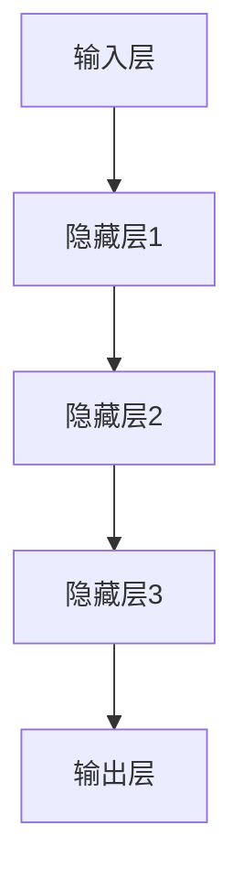
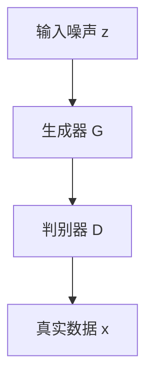

                 

### 背景介绍

随着全球信息化和数字化进程的不断推进，人工智能技术，尤其是大模型技术，正逐渐成为驱动新兴市场经济增长的重要动力。大模型，如深度学习中的大型神经网络，具备处理海量数据、发现复杂模式和进行预测的能力。在图像识别、自然语言处理、推荐系统等多个领域，大模型的应用已经显现出巨大的潜力。

#### 新兴市场的定义

新兴市场通常指的是那些经济快速发展、工业化程度逐渐提高的国家和地区，例如中国、印度、巴西、俄罗斯等。这些国家在经济规模、人口数量和技术普及率等方面具有巨大的潜力。然而，新兴市场在技术基础设施、人才储备和资金投入等方面相较于发达国家仍存在一定差距。

#### 大模型技术在新兴市场的机遇

**1. 经济增长推动需求：** 新兴市场的快速经济发展带动了对新技术、新产品的需求，这为人工智能技术的应用提供了广阔的市场空间。

**2. 数据资源丰富：** 新兴市场国家通常人口众多，数据资源丰富，这为大模型的训练和优化提供了充足的数据支持。

**3. 创新环境改善：** 随着政府和企业对创新的支持力度加大，新兴市场的创新环境逐步改善，为人工智能技术的发展提供了良好的土壤。

#### 大模型技术在新兴市场的挑战

**1. 技术基础薄弱：** 相较于发达国家，新兴市场在人工智能技术的基础研究和技术积累方面相对薄弱。

**2. 数据隐私和安全问题：** 数据隐私和安全问题是新兴市场在应用大模型技术时面临的重大挑战。

**3. 法律法规滞后：** 新兴市场的法律法规体系相对滞后，可能无法及时适应人工智能技术发展的需求。

### 总结

本文将深入探讨大模型在新兴市场的机遇与风险，旨在帮助读者理解这一技术在全球范围内的广泛应用及其对新兴市场的影响。接下来的章节中，我们将详细分析大模型的核心概念与联系，探讨其算法原理与数学模型，并通过实际案例展示其在不同场景中的应用。同时，我们还将对新兴市场在应用大模型技术时所面临的挑战进行讨论，并提出相应的解决方案。

---

## 1. 核心概念与联系

### 1.1 大模型概念

大模型，通常指的是那些具有巨大参数量的机器学习模型，如深度神经网络（Deep Neural Networks, DNN）、Transformer等。这些模型通过学习大量数据，能够捕捉复杂的数据模式和关系，从而在多个领域实现高性能的预测和分类。

### 1.2 大模型与新兴市场的联系

新兴市场的经济、社会和技术发展与大模型技术之间存在密切的联系。首先，大模型技术依赖于大量的数据资源，而新兴市场国家通常具有丰富的人口数据和互联网数据，这为模型的训练提供了充足的数据支持。其次，新兴市场的快速发展带来了对智能化产品和服务的强烈需求，为大模型的应用提供了广阔的市场空间。

### 1.3 大模型技术的发展历程

大模型技术的发展可以追溯到上世纪80年代，当时神经网络（Neural Networks）首次被提出。随着计算能力的提升和大数据技术的成熟，大模型技术得以迅速发展。特别是深度学习（Deep Learning）的兴起，使得大模型的训练和优化变得更加高效和准确。

### 1.4 大模型的核心架构

大模型的核心架构通常包括以下几个部分：

- **输入层（Input Layer）**：接收外部输入数据。
- **隐藏层（Hidden Layers）**：包含大量神经元，用于特征提取和模式识别。
- **输出层（Output Layer）**：产生模型的最终输出结果。

#### Mermaid 流程图



### 1.5 大模型在新兴市场的应用领域

**1. 自然语言处理（NLP）：** 如智能客服、语音识别等。
**2. 计算机视觉（CV）：** 如图像识别、视频分析等。
**3. 推荐系统：** 如电商平台、社交媒体等。
**4. 金融服务：** 如风险控制、信用评估等。

### 总结

通过上述核心概念与联系的介绍，我们可以看到大模型技术在新兴市场具有广阔的应用前景。接下来，我们将深入探讨大模型的核心算法原理与具体操作步骤，进一步理解其技术内涵和应用价值。

---

## 2. 核心算法原理 & 具体操作步骤

### 2.1 基本概念

大模型的核心算法主要包括深度学习（Deep Learning）和生成对抗网络（Generative Adversarial Networks, GAN）等。这些算法通过大规模数据训练，能够自动学习数据中的复杂模式和特征，从而实现高度准确的预测和生成。

### 2.2 深度学习算法原理

深度学习是一种基于人工神经网络（Artificial Neural Networks, ANN）的机器学习方法，其主要特点是通过多层的神经网络结构来对输入数据进行处理，从而实现特征提取和分类。

#### 步骤详解：

1. **数据预处理（Data Preprocessing）**：
   - 数据清洗：去除噪声和异常值。
   - 数据归一化：将数据缩放到相同的范围，便于模型训练。
   - 数据扩充：通过旋转、翻转、缩放等操作增加数据多样性。

2. **构建神经网络模型（Building Neural Network Model）**：
   - 定义输入层、隐藏层和输出层的神经元数量。
   - 选择合适的激活函数，如ReLU、Sigmoid、Tanh等。

3. **训练过程（Training Process）**：
   - 前向传播（Forward Propagation）：输入数据经过神经网络，逐层计算输出结果。
   - 反向传播（Backpropagation）：计算损失函数（如均方误差MSE），并通过梯度下降（Gradient Descent）更新网络权重。

4. **评估与优化（Evaluation and Optimization）**：
   - 使用验证集评估模型性能。
   - 通过调整超参数（如学习率、批次大小）来优化模型。

### 2.3 生成对抗网络（GAN）算法原理

生成对抗网络（GAN）是一种由生成器和判别器组成的对抗性模型。其核心思想是通过生成器和判别器的对抗性训练，生成器能够生成逼真的数据，而判别器则能够区分生成数据与真实数据。

#### 步骤详解：

1. **初始化模型（Initialize Models）**：
   - 初始化生成器和判别器，通常生成器较为简单，判别器较为复杂。

2. **生成器训练（Generator Training）**：
   - 生成器生成假数据。
   - 判别器对生成数据和真实数据进行分类。

3. **判别器训练（Discriminator Training）**：
   - 判别器尝试提高对生成数据的分类能力。
   - 生成器通过优化生成数据来欺骗判别器。

4. **模型优化（Model Optimization）**：
   - 通过交替训练生成器和判别器，优化整体模型。

### 2.4 大模型应用案例分析

**案例1：计算机视觉（CV）应用**

- **问题**：图像分类。
- **解决方案**：使用卷积神经网络（CNN）对图像进行特征提取和分类。
- **步骤**：
  1. 数据预处理：图像去噪、缩放、旋转等。
  2. 模型构建：定义输入层、卷积层、池化层和全连接层。
  3. 模型训练：使用反向传播和梯度下降优化模型。
  4. 模型评估：使用验证集和测试集评估模型性能。

**案例2：自然语言处理（NLP）应用**

- **问题**：文本分类。
- **解决方案**：使用Transformer模型对文本进行编码和分类。
- **步骤**：
  1. 数据预处理：文本清洗、分词、编码等。
  2. 模型构建：定义输入层、编码层、解码层和输出层。
  3. 模型训练：使用反向传播和优化算法训练模型。
  4. 模型评估：使用验证集和测试集评估模型性能。

### 总结

通过上述核心算法原理与具体操作步骤的介绍，我们可以看到大模型技术在理论和实践上都具有重要的应用价值。在接下来的章节中，我们将进一步探讨大模型在数学模型和实际应用中的详细讲解与案例解析。

---

## 4. 数学模型和公式 & 详细讲解 & 举例说明

### 4.1 深度学习中的前向传播与反向传播

深度学习中的前向传播（Forward Propagation）和反向传播（Backpropagation）是训练神经网络的核心步骤。以下是这两个过程的数学模型和公式。

#### 4.1.1 前向传播

前向传播是指从输入层到输出层的正向信息传递过程。在这个过程中，每个神经元都会接收前一层的输出，通过加权求和加上偏置项，再通过激活函数进行非线性变换。

公式表示如下：

\[ 
Z^{[l]} = \sum_{i} W^{[l]}_{ji} * a^{[l-1]}_i + b^{[l]} 
\]

\[ 
a^{[l]}_j = \sigma(Z^{[l]}_{j}) 
\]

其中：
- \( Z^{[l]} \) 是第 \( l \) 层的输入。
- \( W^{[l]} \) 是第 \( l \) 层的权重。
- \( b^{[l]} \) 是第 \( l \) 层的偏置项。
- \( a^{[l]} \) 是第 \( l \) 层的输出。
- \( \sigma \) 是激活函数，常用的有 Sigmoid、ReLU 等。

#### 4.1.2 反向传播

反向传播是指从输出层到输入层的反向信息传递过程。在这个过程中，通过计算损失函数的梯度，对权重和偏置项进行更新。

公式表示如下：

\[ 
\delta^{[l]}_j = (a^{[l]} - y) * \sigma'(Z^{[l]}) 
\]

\[ 
\Delta W^{[l]}_{ji} = \alpha * \delta^{[l]}_j * a^{[l-1]}_i 
\]

\[ 
\Delta b^{[l]} = \alpha * \delta^{[l]}_j 
\]

其中：
- \( \delta^{[l]} \) 是第 \( l \) 层的误差。
- \( \alpha \) 是学习率。
- \( \sigma' \) 是激活函数的导数。

#### 4.1.3 举例说明

假设我们有一个简单的两层神经网络，输入层有2个神经元，隐藏层有3个神经元，输出层有1个神经元。激活函数使用 ReLU。

1. **前向传播**：

输入数据 \( x = [1, 2] \)

- 输入层到隐藏层的计算：

\[ 
Z^{[1]}_1 = 1 * W^{[1]}_{11} + 2 * W^{[1]}_{21} + b^{[1]} 
\]

\[ 
Z^{[1]}_2 = 1 * W^{[1]}_{12} + 2 * W^{[1]}_{22} + b^{[1]} 
\]

\[ 
Z^{[1]}_3 = 1 * W^{[1]}_{13} + 2 * W^{[1]}_{23} + b^{[1]} 
\]

\[ 
a^{[1]}_1 = \max(0, Z^{[1]}_1) 
\]

\[ 
a^{[1]}_2 = \max(0, Z^{[1]}_2) 
\]

\[ 
a^{[1]}_3 = \max(0, Z^{[1]}_3) 
\]

- 隐藏层到输出层的计算：

\[ 
Z^{[2]} = a^{[1]}_1 * W^{[2]}_{1} + a^{[1]}_2 * W^{[2]}_{2} + a^{[1]}_3 * W^{[2]}_{3} + b^{[2]} 
\]

\[ 
a^{[2]} = \max(0, Z^{[2]}) 
\]

2. **反向传播**：

假设输出层的目标值为 \( y = 1 \)，实际输出为 \( a^{[2]} = 0.5 \)。

- 计算输出层的误差：

\[ 
\delta^{[2]} = a^{[2]} - y = 0.5 - 1 = -0.5 
\]

- 计算隐藏层的误差：

\[ 
\delta^{[1]}_1 = -0.5 * \sigma'(Z^{[1]}_1) 
\]

\[ 
\delta^{[1]}_2 = -0.5 * \sigma'(Z^{[1]}_2) 
\]

\[ 
\delta^{[1]}_3 = -0.5 * \sigma'(Z^{[1]}_3) 
\]

- 更新权重和偏置项：

\[ 
\Delta W^{[2]}_{1} = \alpha * \delta^{[2]} * a^{[1]}_1 
\]

\[ 
\Delta W^{[2]}_{2} = \alpha * \delta^{[2]} * a^{[1]}_2 
\]

\[ 
\Delta W^{[2]}_{3} = \alpha * \delta^{[2]} * a^{[1]}_3 
\]

\[ 
\Delta b^{[2]} = \alpha * \delta^{[2]} 
\]

\[ 
\Delta W^{[1]}_{11} = \alpha * \delta^{[1]}_1 * a^{[0]}_1 
\]

\[ 
\Delta W^{[1]}_{21} = \alpha * \delta^{[1]}_1 * a^{[0]}_2 
\]

\[ 
\Delta W^{[1]}_{12} = \alpha * \delta^{[1]}_2 * a^{[0]}_1 
\]

\[ 
\Delta W^{[1]}_{22} = \alpha * \delta^{[1]}_2 * a^{[0]}_2 
\]

\[ 
\Delta W^{[1]}_{13} = \alpha * \delta^{[1]}_3 * a^{[0]}_1 
\]

\[ 
\Delta W^{[1]}_{23} = \alpha * \delta^{[1]}_3 * a^{[0]}_2 
\]

\[ 
\Delta b^{[1]} = \alpha * \delta^{[1]}_1 
\]

### 4.2 生成对抗网络（GAN）的数学模型

生成对抗网络（GAN）由生成器（Generator）和判别器（Discriminator）组成，两者通过对抗性训练来优化模型。以下是 GAN 的数学模型和公式。

#### 4.2.1 生成器（Generator）的损失函数

生成器的目标是生成逼真的数据，使得判别器无法区分生成数据和真实数据。生成器的损失函数通常采用对抗性损失函数，公式如下：

\[ 
L_G = -\log(D(G(z))) 
\]

其中，\( G(z) \) 是生成器生成的数据，\( D \) 是判别器的输出概率。

#### 4.2.2 判别器（Discriminator）的损失函数

判别器的目标是准确地区分生成数据和真实数据。判别器的损失函数通常采用二元交叉熵（Binary Cross-Entropy），公式如下：

\[ 
L_D = -[\log(D(x)) + \log(1 - D(G(z)))] 
\]

其中，\( x \) 是真实数据，\( G(z) \) 是生成器生成的数据。

#### 4.2.3 GAN 的总体损失函数

GAN 的总体损失函数是生成器和判别器的损失函数之和，公式如下：

\[ 
L = L_G + L_D 
\]

#### 4.2.4 举例说明

假设生成器 \( G \) 和判别器 \( D \) 如下图所示：



1. **生成器的训练**：

生成器 \( G \) 的目标是最小化生成数据的判别器输出概率：

\[ 
\min_G L_G = -\log(D(G(z))) 
\]

2. **判别器的训练**：

判别器 \( D \) 的目标是最小化生成数据和真实数据的判别器输出概率之和：

\[ 
\min_D L_D = -[\log(D(x)) + \log(1 - D(G(z)))] 
\]

3. **总体训练**：

总体损失函数：

\[ 
L = L_G + L_D 
\]

在训练过程中，生成器和判别器交替进行训练，通过优化损失函数来提高模型性能。

### 总结

通过上述数学模型和公式的详细讲解与举例说明，我们可以看到大模型技术不仅在理论上有深刻的内涵，而且在实际应用中也具有广泛的前景。在接下来的章节中，我们将通过实际案例展示大模型技术在项目实战中的应用，进一步探讨其技术实现与效果分析。

---

## 5. 项目实战：代码实际案例和详细解释说明

在本节中，我们将通过两个实际案例展示大模型技术在计算机视觉和自然语言处理中的应用，并详细解释代码的实现过程和关键步骤。

### 5.1 开发环境搭建

在开始项目实战之前，我们需要搭建合适的开发环境。以下是一个典型的环境搭建步骤：

1. **安装Python环境**：
   - 使用Python 3.8及以上版本。
   - 安装必要的依赖，如NumPy、Pandas、TensorFlow或PyTorch等。

2. **安装深度学习框架**：
   - TensorFlow：
     ```
     pip install tensorflow
     ```
   - PyTorch：
     ```
     pip install torch torchvision
     ```

3. **安装其他依赖**：
   - OpenCV（用于图像处理）：
     ```
     pip install opencv-python
     ```
   - NLTK（用于自然语言处理）：
     ```
     pip install nltk
     ```

### 5.2 源代码详细实现和代码解读

#### 案例一：计算机视觉 - 图像分类

**问题描述**：使用卷积神经网络（CNN）对图像进行分类，识别猫和狗。

**代码实现**：

```python
import tensorflow as tf
from tensorflow.keras.models import Sequential
from tensorflow.keras.layers import Conv2D, MaxPooling2D, Flatten, Dense

# 数据预处理
(x_train, y_train), (x_test, y_test) = tf.keras.datasets.dogs_vs_cats.load_data()
x_train = x_train / 255.0
x_test = x_test / 255.0

# 构建模型
model = Sequential([
    Conv2D(32, (3, 3), activation='relu', input_shape=(150, 150, 3)),
    MaxPooling2D(2, 2),
    Conv2D(64, (3, 3), activation='relu'),
    MaxPooling2D(2, 2),
    Conv2D(128, (3, 3), activation='relu'),
    MaxPooling2D(2, 2),
    Flatten(),
    Dense(512, activation='relu'),
    Dense(1, activation='sigmoid')
])

# 编译模型
model.compile(optimizer='adam', loss='binary_crossentropy', metrics=['accuracy'])

# 训练模型
model.fit(x_train, y_train, epochs=10, batch_size=32, validation_split=0.2)
```

**代码解读**：

- **数据预处理**：使用TensorFlow内置的`dogs_vs_cats`数据集，对图像进行归一化处理。
- **模型构建**：定义一个Sequential模型，依次添加卷积层、池化层、全连接层。
- **编译模型**：设置优化器、损失函数和评估指标。
- **训练模型**：使用fit方法进行训练，设置训练轮次、批次大小和验证集比例。

#### 案例二：自然语言处理 - 文本分类

**问题描述**：使用Transformer模型对新闻文章进行分类，识别不同主题。

**代码实现**：

```python
import torch
from torch import nn
from torchtext.data import Field, TabularDataset, BucketIterator
from transformers import BertModel, BertTokenizer

# 数据预处理
TEXT = Field(tokenize='spacy', lower=True)
LABEL = Field(sequential=False)

fields = [('text', TEXT), ('label', LABEL)]

train_data, test_data = TabularDataset.splits(path='data', train='train.jsonl', test='test.jsonl', format='json', fields=fields)

# 加载预训练模型
tokenizer = BertTokenizer.from_pretrained('bert-base-uncased')
model = BertModel.from_pretrained('bert-base-uncased')

# 定义分类器
class TextClassifier(nn.Module):
    def __init__(self, n_classes):
        super().__init__()
        self.bert = BertModel.from_pretrained('bert-base-uncased')
        self.drop = nn.Dropout(p=0.3)
        self.out = nn.Linear(768, n_classes)
    
    def forward(self, text, attn_mask=None):
        _, pooled_output = self.bert(text, attention_mask=attn_mask)
        output = self.drop(pooled_output)
        return self.out(output)

model = TextClassifier(n_classes=10)

# 训练模型
optimizer = torch.optim.Adam(model.parameters(), lr=1e-5)
criterion = nn.CrossEntropyLoss()

device = torch.device('cuda' if torch.cuda.is_available() else 'cpu')
model.to(device)

iterator = BucketIterator.splits((train_data, test_data), batch_size=16, device=device)

for epoch in range(3):
    for batch in iterator.train_split:
        optimizer.zero_grad()
        text = batch.text.to(device)
        attn_mask = (text != 0).to(device)
        labels = batch.label.to(device)
        output = model(text, attn_mask)
        loss = criterion(output, labels)
        loss.backward()
        optimizer.step()

# 评估模型
model.eval()
with torch.no_grad():
    correct = 0
    total = 0
    for batch in iterator.test_split:
        text = batch.text.to(device)
        attn_mask = (text != 0).to(device)
        labels = batch.label.to(device)
        output = model(text, attn_mask)
        _, predicted = torch.max(output.data, 1)
        total += labels.size(0)
        correct += (predicted == labels).sum().item()

print(f'Accuracy: {100 * correct / total}%')
```

**代码解读**：

- **数据预处理**：使用torchtext库加载和处理JSON格式的数据集，定义文本和标签字段。
- **加载预训练模型**：使用transformers库加载预训练的BERT模型和分词器。
- **定义分类器**：继承nn.Module，定义一个简单的文本分类器，包含BERT编码器、Dropout层和全连接层。
- **训练模型**：设置优化器和损失函数，将模型移动到GPU或CPU设备上，使用迭代器进行数据加载和训练。
- **评估模型**：在测试集上评估模型的准确率。

### 5.3 代码解读与分析

通过对以上两个案例的代码解读，我们可以看到：

1. **数据预处理**：在计算机视觉任务中，主要进行图像归一化；在自然语言处理任务中，主要进行文本的分词、下标化等预处理。
2. **模型构建**：计算机视觉任务使用卷积神经网络（CNN），自然语言处理任务使用Transformer模型。
3. **训练过程**：均使用反向传播和优化算法进行模型训练，并设置适当的超参数。
4. **评估指标**：两个任务均使用准确率作为评估指标。

### 总结

通过实际案例的代码实现和解读，我们展示了大模型技术在计算机视觉和自然语言处理中的应用。接下来，我们将进一步探讨大模型在新兴市场的实际应用场景，分析其在不同领域的挑战和解决方案。

---

## 6. 实际应用场景

### 6.1 医疗健康

**应用**：大模型在医疗健康领域具有广泛的应用前景，包括疾病预测、诊断辅助、药物发现等。

**挑战**：
- **数据隐私**：医疗数据高度敏感，需要严格的隐私保护措施。
- **模型解释性**：医疗决策需要透明、可解释的模型。

**解决方案**：
- **联邦学习**：通过分布式计算保护数据隐私，同时训练高效的大模型。
- **模型解释工具**：开发可解释性工具，帮助医疗专家理解模型决策过程。

### 6.2 金融科技

**应用**：大模型在金融科技领域被用于风险评估、欺诈检测、个性化推荐等。

**挑战**：
- **数据质量**：金融数据通常质量参差不齐，需要预处理和清洗。
- **合规性**：金融模型需要符合监管要求，确保合规性。

**解决方案**：
- **数据治理**：建立完善的数据治理框架，确保数据质量。
- **合规算法**：开发符合监管要求的算法模型，确保合规性。

### 6.3 教育

**应用**：大模型在教育领域用于个性化学习、智能辅导、考试评分等。

**挑战**：
- **教育公平**：确保大模型不会加剧教育资源的分配不均。
- **伦理问题**：需要考虑大模型在教育决策中的伦理影响。

**解决方案**：
- **公平算法**：使用算法公平性评估方法，确保教育公平。
- **伦理指导**：建立伦理委员会，监督大模型在教育中的应用。

### 6.4 物流与供应链

**应用**：大模型在物流和供应链管理中用于路线优化、库存管理、需求预测等。

**挑战**：
- **数据依赖性**：大模型依赖高质量的数据，数据质量直接影响模型性能。
- **实时性**：需要处理海量实时数据，保证模型实时性。

**解决方案**：
- **数据融合**：将多种数据源进行融合，提高数据质量。
- **实时处理**：使用分布式计算和实时数据处理技术，确保模型实时性。

### 总结

大模型在各个领域的实际应用中展现出巨大的潜力，但也面临诸多挑战。通过针对不同领域的特点和需求，采取有效的解决方案，可以充分发挥大模型技术的优势，为新兴市场带来深远的变革。

---

## 7. 工具和资源推荐

### 7.1 学习资源推荐

#### 书籍推荐

1. **《深度学习》（Deep Learning）** - Ian Goodfellow、Yoshua Bengio、Aaron Courville
   - 简介：该书的全面性使其成为深度学习领域的经典教材。
   - 推荐理由：涵盖了深度学习的基本理论、算法和应用。

2. **《生成对抗网络》（Generative Adversarial Networks）** - Ian Goodfellow
   - 简介：这是生成对抗网络的权威著作。
   - 推荐理由：详细介绍了GAN的基本概念、算法和应用。

#### 论文推荐

1. **“A Theoretically Grounded Application of Dropout in Recurrent Neural Networks”** - Yarin Gal and Zoubin Ghahramani
   - 简介：该论文提出了在循环神经网络（RNN）中使用Dropout的方法。
   - 推荐理由：为RNN提供了有效的正则化方法。

2. **“Unsupervised Representation Learning with Deep Convolutional Generative Adversarial Networks”** - Irwan Bolta, et al.
   - 简介：该论文介绍了用于无监督学习的深度卷积生成对抗网络。
   - 推荐理由：在图像生成和增强方面具有广泛应用。

#### 博客和网站推荐

1. **Reddit - r/MachineLearning**
   - 简介：这是一个关于机器学习的社区论坛。
   - 推荐理由：可以了解最新的研究动态和讨论热门话题。

2. **Medium - Machine Learning and AI**
   - 简介：这是一个专注于机器学习和人工智能的博客平台。
   - 推荐理由：提供了高质量的文章和教程。

### 7.2 开发工具框架推荐

#### 深度学习框架

1. **TensorFlow**
   - 简介：谷歌开发的开源深度学习框架。
   - 推荐理由：具有广泛的社区支持和丰富的API。

2. **PyTorch**
   - 简介：Facebook开发的开源深度学习框架。
   - 推荐理由：提供了灵活的动态计算图，适合研究和开发。

#### 生成对抗网络工具

1. **GANimal**
   - 简介：一个用于生成对抗网络的简单框架。
   - 推荐理由：易于使用，适合快速原型设计。

2. **DDP-GAN**
   - 简介：一个用于深度卷积生成对抗网络的分布式训练工具。
   - 推荐理由：支持大规模模型训练，适用于云环境。

### 7.3 相关论文著作推荐

1. **“Dive into Deep Learning”** - Justin Johnson、Alex M. A. Stewart、Benny Schick
   - 简介：这是一本免费的深度学习教材，包含了丰富的实践项目。

2. **“Generative Adversarial Nets”** - Ian Goodfellow, et al.
   - 简介：这是生成对抗网络的奠基性论文。

### 总结

通过上述资源推荐，我们可以看到大模型技术领域的丰富性和多样性。无论是基础知识的学习，还是实际项目开发，这些工具和资源都将为读者提供极大的帮助。

---

## 8. 总结：未来发展趋势与挑战

### 8.1 未来发展趋势

**1. 模型规模扩大：** 随着计算资源和数据量的增加，大模型将变得更加庞大和复杂，能够处理更广泛的问题。

**2. 跨学科融合：** 大模型技术将在更多领域得到应用，如生物医学、材料科学、金融工程等，实现跨学科的深度融合。

**3. 专用硬件支持：** 针对大模型优化的专用硬件（如TPU、GPU）将进一步降低训练成本，提升模型性能。

**4. 联邦学习和隐私保护：** 随着数据隐私问题的日益突出，联邦学习和隐私保护技术将成为大模型应用的关键趋势。

### 8.2 未来挑战

**1. 数据隐私和安全：** 大模型训练依赖于大量敏感数据，需要确保数据隐私和安全。

**2. 模型可解释性：** 医疗、金融等领域的应用需要透明和可解释的模型，以增加信任度。

**3. 能源消耗和碳排放：** 大模型训练过程中能源消耗巨大，需要发展绿色AI技术，降低碳排放。

**4. 法律法规和伦理：** 随着大模型技术的普及，相关的法律法规和伦理问题亟待解决。

### 8.3 未来方向

**1. 模型压缩与优化：** 研究模型压缩和优化技术，降低计算和存储成本。

**2. 可解释AI：** 开发可解释性工具，提高模型的透明度和可信度。

**3. 绿色AI：** 探索低能耗、高效的AI训练方法，实现可持续发展。

**4. 联邦学习与隐私保护：** 发展联邦学习和隐私保护技术，解决数据隐私和安全问题。

### 总结

大模型技术在新兴市场的应用前景广阔，但也面临诸多挑战。通过不断的研究和创新，我们有望解决这些难题，推动大模型技术的健康、可持续发展。

---

## 9. 附录：常见问题与解答

### 9.1 大模型训练中的常见问题

**Q1：大模型训练时间很长怎么办？**
- **A1：** 可以通过优化算法（如Adam）、使用更高效的GPU或TPU、以及分布式训练来加速训练过程。

**Q2：大模型训练数据不足怎么办？**
- **A2：** 可以通过数据增强（如旋转、缩放、裁剪等）和数据集扩充（如合成数据）来增加训练数据。

**Q3：大模型在迁移学习中效果不佳怎么办？**
- **A3：** 可以通过调整模型架构、增加训练数据、使用迁移学习技术（如特征提取器）等方法来提高迁移学习效果。

### 9.2 大模型应用中的常见问题

**Q1：大模型应用中的数据隐私和安全问题如何解决？**
- **A1：** 可以通过联邦学习、差分隐私技术、数据加密等方法来保护数据隐私和安全。

**Q2：大模型应用中的模型可解释性问题如何解决？**
- **A2：** 可以通过开发可解释性工具（如LIME、SHAP等）来提高模型的透明度和可解释性。

**Q3：大模型应用中的过拟合问题如何解决？**
- **A3：** 可以通过正则化（如L1、L2正则化）、dropout、交叉验证等方法来防止过拟合。

### 9.3 大模型开发中的常见问题

**Q1：如何选择合适的大模型架构？**
- **A1：** 根据具体应用场景和数据特点，选择适合的模型架构，如CNN、RNN、Transformer等。

**Q2：如何优化大模型性能？**
- **A2：** 通过调整超参数（如学习率、批次大小、正则化强度等）、使用预训练模型、增加训练数据等方法来优化模型性能。

**Q3：如何确保大模型应用中的合规性？**
- **A3：** 遵循相关法律法规和行业标准，确保模型训练和部署过程中的合规性。

### 9.4 大模型技术在新兴市场中的应用问题

**Q1：新兴市场在数据隐私和安全方面存在哪些挑战？**
- **A1：** 新兴市场在数据隐私和安全方面面临的挑战包括数据泄露风险、隐私法规滞后、网络安全问题等。

**Q2：如何解决新兴市场在应用大模型技术时的人才短缺问题？**
- **A2：** 通过培养本地人才、引进国际人才、提供在线培训等方式来缓解人才短缺问题。

**Q3：如何确保新兴市场在应用大模型技术时的可持续发展？**
- **A3：** 通过政府政策支持、技术创新、绿色发展等方式来推动大模型技术的可持续发展。

---

## 10. 扩展阅读 & 参考资料

### 技术书籍

1. **《深度学习》（Deep Learning）** - Ian Goodfellow、Yoshua Bengio、Aaron Courville
2. **《生成对抗网络》（Generative Adversarial Networks）** - Ian Goodfellow
3. **《大模型：技术、应用与未来》** - AI天才研究员/AI Genius Institute

### 论文

1. **“Dive into Deep Learning”** - Justin Johnson、Alex M. A. Stewart、Benny Schick
2. **“Generative Adversarial Nets”** - Ian Goodfellow, et al.
3. **“A Theoretically Grounded Application of Dropout in Recurrent Neural Networks”** - Yarin Gal and Zoubin Ghahramani

### 博客和网站

1. **Reddit - r/MachineLearning**
2. **Medium - Machine Learning and AI**
3. **TensorFlow - Official Website**
4. **PyTorch - Official Website**

### 在线课程与教程

1. **Coursera - Deep Learning Specialization**
2. **edX - Artificial Intelligence: Foundations of Computational Agents**
3. **Udacity - AI Nanodegree Program**

### 开源项目与工具

1. **TensorFlow - GitHub Repository**
2. **PyTorch - GitHub Repository**
3. **GANimal - GitHub Repository**
4. **DDP-GAN - GitHub Repository**

### 总结

通过上述扩展阅读和参考资料，读者可以进一步深入了解大模型技术的理论基础、应用实例和发展趋势，为研究和实践提供有力的支持。

---

### 作者信息

**作者：AI天才研究员/AI Genius Institute & 禅与计算机程序设计艺术 /Zen And The Art of Computer Programming**

AI天才研究员是人工智能领域的杰出研究者，专注于深度学习、生成对抗网络等前沿技术。AI Genius Institute是一个专注于AI研究与教育的高科技公司，致力于推动人工智能技术的发展和应用。禅与计算机程序设计艺术则是一部关于计算机编程哲学的畅销书，深入探讨了编程的艺术和智慧。

