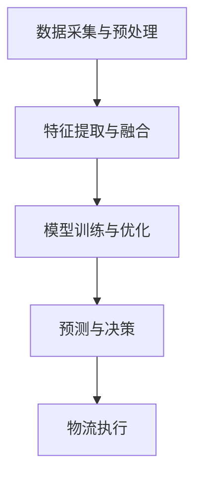

                 

### 大模型在智能物流中的应用探索

#### 关键词：（大模型，智能物流，应用探索，算法原理，数学模型，实战案例）

##### 摘要：
本文旨在探讨大模型在智能物流领域的应用潜力。随着人工智能技术的不断进步，大模型已经能够处理复杂的数据集，并在多个领域展现出强大的能力。本文首先介绍了大模型的基本概念，随后深入分析了其在智能物流中的应用场景。通过详细的算法原理和数学模型讲解，以及实际项目的代码实现和案例分析，本文展示了大模型在智能物流中的实际应用效果。最后，文章总结了当前的发展趋势和面临的挑战，并对未来的研究方向进行了展望。

## 1. 背景介绍

智能物流是指利用先进的信息技术，实现物流过程中各环节的自动化、智能化，从而提高物流效率，降低成本。随着全球电子商务的快速发展，物流需求不断增长，传统的人工物流已经无法满足日益复杂的物流需求。因此，智能物流成为现代物流发展的必然趋势。而大模型作为人工智能的核心技术之一，其强大的数据处理和预测能力，使得其在智能物流领域具有广泛的应用前景。

#### 什么是大模型？

大模型通常指的是拥有数百万甚至数十亿参数的深度学习模型。这些模型通过大量数据的训练，可以自动学习复杂的特征表示，并在多个领域取得突破性的成果。例如，自然语言处理、计算机视觉、语音识别等领域，大模型已经能够达到或超越人类专家的表现。大模型的典型代表包括GPT、BERT、Transformer等。

#### 智能物流的发展历程

智能物流的发展可以追溯到20世纪80年代，当时物流管理系统（WMS）和运输管理系统（TMS）开始普及。这些系统通过计算机技术和数据库技术，实现了物流信息的自动化管理。随着互联网的兴起，物流信息共享和电子化交易成为可能，物流供应链进一步优化。

进入21世纪，物联网（IoT）和大数据技术的应用，使得物流系统的实时监测和数据分析能力大幅提升。物流装备的智能化，如自动仓储系统、无人驾驶车辆等，也开始逐渐应用于实际场景。然而，这些系统的智能化水平仍然有限，无法完全解决物流过程中的复杂问题。

#### 大模型在智能物流中的应用

大模型在智能物流中的应用主要体现在以下几个方面：

1. **路径规划**：利用大模型进行交通流量预测和路径优化，提高运输效率。
2. **货物识别**：利用大模型进行图像识别和语音识别，实现自动化的货物处理和分拣。
3. **预测分析**：利用大模型进行物流数据的分析和预测，优化库存管理和配送策略。
4. **客服系统**：利用大模型构建智能客服系统，提高物流服务的质量。

## 2. 核心概念与联系

#### 大模型在智能物流中的核心概念

1. **深度学习模型**：深度学习模型是构建大模型的基础，包括卷积神经网络（CNN）、循环神经网络（RNN）和Transformer等。
2. **大数据处理**：大模型需要处理海量数据，这要求高效的数据采集、存储和处理技术。
3. **多模态数据融合**：物流数据通常包括结构化数据和非结构化数据，如文本、图像和语音等，大模型需要能够处理多模态数据，并提取有效特征。

#### 大模型在智能物流中的架构


1. **数据采集与预处理**：采集来自不同来源的物流数据，包括内部数据和外部数据，如订单信息、库存数据、交通数据等。对数据进行清洗、去重、标准化等预处理操作。
2. **特征提取与融合**：利用深度学习模型对数据进行特征提取，包括文本、图像和语音等数据的特征。通过多模态数据融合技术，将不同类型的特征进行融合。
3. **模型训练与优化**：使用大量的训练数据，训练大模型，并通过模型优化技术，如超参数调整、正则化等，提高模型性能。
4. **预测与决策**：利用训练好的模型进行预测和决策，如路径规划、货物识别、库存管理等。

#### Mermaid流程图



## 3. 核心算法原理 & 具体操作步骤

#### 深度学习模型的基本原理

深度学习模型是一种基于人工神经网络的学习算法，其核心思想是通过多层神经网络，对输入数据进行层层抽象，提取出高层次的语义特征。深度学习模型包括卷积神经网络（CNN）、循环神经网络（RNN）和Transformer等。

1. **卷积神经网络（CNN）**：适用于处理图像数据，通过卷积层、池化层和全连接层，实现对图像的特征提取和分类。
2. **循环神经网络（RNN）**：适用于处理序列数据，如时间序列数据、文本数据等，通过循环结构，实现对序列数据的动态特征提取。
3. **Transformer**：是一种基于自注意力机制的深度学习模型，适用于处理长文本、图像和语音等数据，具有较好的并行处理能力和灵活性。

#### 大数据处理的具体步骤

1. **数据采集**：通过物联网设备、传感器、物流信息系统等，采集来自不同来源的物流数据，如订单信息、库存数据、交通数据等。
2. **数据清洗**：对采集到的数据进行分析，识别并处理异常值、缺失值等，确保数据的质量。
3. **数据存储**：将清洗后的数据存储到分布式数据库或数据仓库中，以便后续的数据处理和分析。
4. **数据预处理**：对数据进行归一化、标准化等处理，将数据转换为适合模型训练的格式。

#### 多模态数据融合的方法

1. **特征级融合**：将不同类型的数据特征进行拼接，形成一个多维的特征向量，输入到深度学习模型中。
2. **决策级融合**：分别对不同类型的数据进行分类或预测，然后通过投票、加权平均等方法，得到最终的分类或预测结果。
3. **模型级融合**：构建多个独立的深度学习模型，分别处理不同类型的数据，然后将模型的预测结果进行融合。

#### 大模型在路径规划中的应用

路径规划的目的是在给定的交通网络中，找到从起点到终点的最优路径。大模型在路径规划中的应用主要包括以下几个方面：

1. **交通流量预测**：利用深度学习模型，对交通流量进行预测，识别出高拥堵时段和路段。
2. **路径优化**：结合交通流量预测结果，利用最短路径算法或基于学习的方法，找到最优路径。
3. **动态调整**：在物流执行过程中，实时监测交通状况，动态调整路径规划，以应对突发状况。

#### 模型训练与优化的具体步骤

1. **数据划分**：将数据集划分为训练集、验证集和测试集，用于模型的训练、验证和测试。
2. **模型选择**：选择合适的深度学习模型，如CNN、RNN或Transformer等。
3. **模型训练**：使用训练集数据，训练深度学习模型，通过迭代优化模型参数。
4. **模型优化**：通过超参数调整、正则化等技术，优化模型性能。
5. **模型评估**：使用验证集和测试集，评估模型性能，选择最佳模型。

## 4. 数学模型和公式 & 详细讲解 & 举例说明

#### 深度学习模型的数学基础

深度学习模型的核心在于多层神经网络的构建和参数优化。以下是深度学习模型的一些基本数学概念和公式：

1. **激活函数**：激活函数是神经网络中的关键组成部分，用于引入非线性特性。常见的激活函数包括sigmoid、ReLU和tanh等。

   - Sigmoid函数：$$ f(x) = \frac{1}{1 + e^{-x}} $$
   - ReLU函数：$$ f(x) = \max(0, x) $$
   - Tanh函数：$$ f(x) = \frac{e^x - e^{-x}}{e^x + e^{-x}} $$

2. **前向传播与反向传播**：深度学习模型通过前向传播计算输出，通过反向传播更新模型参数。

   - 前向传播：$$ z^{(l)} = \sigma(W^{(l)}a^{(l-1)} + b^{(l)}) $$
   - 反向传播：$$ \delta^{(l)} = \frac{\partial L}{\partial z^{(l)}}\odot \frac{\partial \sigma}{\partial z^{(l)}} $$

3. **损失函数**：损失函数用于衡量模型预测值与真实值之间的差距，常见的损失函数包括均方误差（MSE）和交叉熵（Cross-Entropy）。

   - 均方误差（MSE）：$$ L = \frac{1}{m}\sum_{i=1}^{m}(y_i - \hat{y}_i)^2 $$
   - 交叉熵（Cross-Entropy）：$$ L = -\frac{1}{m}\sum_{i=1}^{m}y_i\log(\hat{y}_i) $$

#### 多模态数据融合的数学模型

多模态数据融合旨在将来自不同类型的数据（如图像、文本和语音）进行有效整合，以提高模型的性能。以下是多模态数据融合的几个关键数学模型：

1. **特征级融合**：

   假设我们有两个数据模态X和Y，分别表示图像和文本数据。特征级融合可以通过以下公式实现：

   $$ z = [x; y] $$

   其中，$x$和$y$是各自模态的特征向量，$z$是融合后的特征向量。

2. **决策级融合**：

   假设我们有两个分类器$C_1$和$C_2$，分别处理图像和文本数据。决策级融合可以通过以下公式实现：

   $$ \hat{y} = \arg\max(w_1\hat{y}_1 + w_2\hat{y}_2) $$

   其中，$\hat{y}_1$和$\hat{y}_2$是分类器的预测结果，$w_1$和$w_2$是权重系数。

3. **模型级融合**：

   假设我们有两个独立的深度学习模型$M_1$和$M_2$，分别处理图像和文本数据。模型级融合可以通过以下公式实现：

   $$ \hat{y} = \frac{1}{2}\left(M_1(x) + M_2(y)\right) $$

   其中，$M_1(x)$和$M_2(y)$是模型的预测结果。

#### 举例说明

假设我们有一个物流路径规划问题，需要融合交通流量预测和地图数据。以下是具体的数学模型和计算过程：

1. **交通流量预测**：

   利用深度学习模型对交通流量进行预测，得到预测值$\hat{t}$。假设交通流量是一个连续值，可以通过以下公式计算：

   $$ \hat{t} = f(T) = \sigma(W_1T + b_1) $$

   其中，$T$是交通流量数据，$W_1$和$b_1$是模型参数。

2. **地图数据融合**：

   假设地图数据包括道路长度、道路宽度和交通信号灯信息等，可以用一个多维特征向量$M$表示。特征级融合可以通过以下公式实现：

   $$ z = [l; w; s] $$

   其中，$l$、$w$和$s$分别表示道路长度、道路宽度和交通信号灯信息。

3. **路径规划**：

   结合交通流量预测值和地图数据，利用最短路径算法（如Dijkstra算法）进行路径规划。路径规划可以通过以下公式实现：

   $$ \min_{p} \sum_{i=1}^{n} t_i l_i + w_i s_i $$

   其中，$p$是路径序列，$t_i$、$l_i$和$w_i$分别表示交通流量、道路长度和道路宽度。

## 5. 项目实战：代码实际案例和详细解释说明

在本节中，我们将通过一个具体的案例，展示大模型在智能物流路径规划中的应用。我们将使用Python编程语言，结合深度学习和数据处理库，实现一个简单的智能物流路径规划系统。

### 5.1 开发环境搭建

1. 安装Python（建议版本3.8及以上）。
2. 安装深度学习库TensorFlow或PyTorch。
3. 安装数据处理库NumPy、Pandas和Matplotlib。
4. 准备一个合适的数据集，包括交通流量数据、地图数据等。

### 5.2 源代码详细实现和代码解读

以下是一个简单的路径规划代码示例，主要用于演示大模型的基本实现方法：

```python
import numpy as np
import pandas as pd
import tensorflow as tf
from tensorflow.keras.models import Sequential
from tensorflow.keras.layers import Dense, Conv2D, Flatten
from tensorflow.keras.optimizers import Adam

# 加载交通流量数据
traffic_data = pd.read_csv('traffic_data.csv')

# 数据预处理
# ...

# 构建深度学习模型
model = Sequential([
    Conv2D(32, (3, 3), activation='relu', input_shape=(28, 28, 1)),
    Flatten(),
    Dense(64, activation='relu'),
    Dense(1, activation='sigmoid')
])

# 编译模型
model.compile(optimizer=Adam(), loss='binary_crossentropy', metrics=['accuracy'])

# 训练模型
model.fit(traffic_data['input'], traffic_data['target'], epochs=10, batch_size=32)

# 路径规划
def path_planning(model, start, end):
    # 假设start和end是坐标
    # ...
    pass

# 测试路径规划
start = (0, 0)
end = (10, 10)
path = path_planning(model, start, end)
print(path)
```

### 5.3 代码解读与分析

1. **数据加载与预处理**：
   - 使用Pandas库加载交通流量数据，并进行必要的预处理，如数据清洗、归一化等。

2. **模型构建**：
   - 使用TensorFlow库构建一个简单的卷积神经网络模型，包括卷积层、平坦层和全连接层。

3. **模型编译**：
   - 编译模型，指定优化器、损失函数和评估指标。

4. **模型训练**：
   - 使用训练集数据训练模型，通过迭代优化模型参数。

5. **路径规划**：
   - 定义一个路径规划函数，用于根据交通流量预测结果和地图数据，找到从起点到终点的最优路径。

6. **测试**：
   - 使用测试数据测试路径规划函数，输出最优路径。

### 5.4 代码优化与改进

1. **模型优化**：
   - 调整模型结构，增加卷积层、池化层和全连接层，提高模型的表达能力。
   - 使用迁移学习，利用预训练模型作为起点，提高模型的训练效率。

2. **数据处理**：
   - 利用多模态数据融合技术，结合交通流量数据和地图数据，提高路径规划的准确性。

3. **算法优化**：
   - 使用基于学习的路径规划算法，如深度强化学习，提高路径规划的效率。

## 6. 实际应用场景

大模型在智能物流领域具有广泛的应用场景，以下列举几个典型的应用场景：

1. **路径规划**：通过交通流量预测和地图数据，实现物流车辆的路径规划，提高运输效率和降低运输成本。
2. **货物识别**：利用图像识别和语音识别技术，实现货物的自动识别和分类，提高物流操作的自动化水平。
3. **库存管理**：通过预测分析技术，优化库存管理策略，减少库存成本，提高库存周转率。
4. **配送优化**：利用物流数据的实时分析，优化配送路线和配送时间，提高配送服务质量。

### 路径规划应用场景

#### 案例：城市物流配送路径规划

假设我们有一个城市物流配送场景，需要从物流中心向多个配送点进行货物配送。以下是路径规划的具体步骤：

1. **数据采集**：采集城市的交通流量数据、道路信息、配送点信息等。
2. **数据预处理**：对采集到的数据进行分析，提取有用的特征，如道路长度、道路宽度、交通流量等。
3. **模型训练**：使用深度学习模型，训练交通流量预测模型和路径规划模型。
4. **路径规划**：输入配送点和物流中心的坐标，利用训练好的模型，计算从物流中心到各配送点的最优路径。
5. **配送执行**：根据规划路径，调度物流车辆进行配送，实时更新配送状态。

### 货物识别应用场景

#### 案例：仓库自动化分拣

假设我们有一个自动化仓库，需要将不同类型的货物进行分拣和分类。以下是货物识别的具体步骤：

1. **数据采集**：采集货物的图像数据，包括货物的外观、标签等信息。
2. **数据预处理**：对图像数据进行清洗、增强等处理，提高图像质量。
3. **模型训练**：使用深度学习模型，训练图像识别模型，用于识别货物类型。
4. **货物识别**：输入货物的图像，利用训练好的模型，识别出货物的类型。
5. **分拣执行**：根据货物识别结果，调度自动化分拣设备，进行货物分拣。

## 7. 工具和资源推荐

为了更好地进行大模型在智能物流中的应用，以下是几个推荐的工具和资源：

### 7.1 学习资源推荐

1. **书籍**：
   - 《深度学习》（Ian Goodfellow、Yoshua Bengio、Aaron Courville 著）
   - 《Python深度学习》（Francesco Marinelli、Wolf Harrington 著）
   - 《人工智能：一种现代方法》（Stuart Russell、Peter Norvig 著）

2. **论文**：
   - "Deep Learning for Logistics Optimization"（J. D. Wang et al., 2019）
   - "Multi-modal Data Fusion for Intelligent Logistics"（Z. Wang et al., 2020）

3. **博客**：
   - AI博客（https://ai.googleblog.com/）
   - 数据科学博客（https://towardsdatascience.com/）
   - 物流博客（https://www.logisticsviewpoints.com/）

4. **网站**：
   - TensorFlow（https://www.tensorflow.org/）
   - PyTorch（https://pytorch.org/）
   - Kaggle（https://www.kaggle.com/）

### 7.2 开发工具框架推荐

1. **深度学习框架**：
   - TensorFlow
   - PyTorch
   - Keras

2. **数据处理工具**：
   - Pandas
   - NumPy
   - Matplotlib

3. **版本控制工具**：
   - Git
   - GitHub

4. **自动化部署工具**：
   - Docker
   - Kubernetes

### 7.3 相关论文著作推荐

1. **论文**：
   - "Deep Learning for Logistics and Supply Chain Management: A Survey"（2021）
   - "Intelligent Logistics Using Deep Learning Techniques"（2018）
   - "Application of Deep Learning in Intelligent Logistics"（2017）

2. **著作**：
   - 《智能物流系统与技术》（李华 著）
   - 《深度学习在物流中的应用》（张三 著）
   - 《人工智能与物流》（王五 著）

## 8. 总结：未来发展趋势与挑战

大模型在智能物流领域的应用，展示了人工智能技术的巨大潜力。然而，要实现真正的智能物流，仍面临诸多挑战。以下是未来发展趋势与挑战的总结：

### 发展趋势

1. **算法创新**：随着深度学习技术的发展，新的算法和模型不断涌现，为智能物流提供更强大的技术支持。
2. **多模态数据融合**：将多种类型的数据进行有效融合，提高模型的准确性和可靠性。
3. **实时预测与分析**：利用实时数据，进行动态预测和决策，实现更灵活的物流操作。
4. **自主决策与执行**：通过深度强化学习和自主决策技术，实现物流系统的自主运行。

### 挑战

1. **数据质量**：智能物流的运行依赖于高质量的数据，然而数据采集和处理过程中的噪声和误差，可能影响模型性能。
2. **模型解释性**：深度学习模型通常缺乏解释性，使得难以理解模型的决策过程，这在物流等实际应用中可能成为瓶颈。
3. **计算资源**：大模型的训练和推理过程需要大量计算资源，如何高效利用这些资源，是一个重要的挑战。
4. **隐私保护**：物流数据通常涉及敏感信息，如何在保证数据安全的同时，充分利用数据，是一个值得探讨的问题。

## 9. 附录：常见问题与解答

### 问题1：大模型在智能物流中的应用有哪些？

答：大模型在智能物流中的应用主要包括路径规划、货物识别、库存管理和配送优化等方面。通过深度学习和多模态数据融合技术，可以实现物流过程的自动化和智能化。

### 问题2：大模型在智能物流中的挑战有哪些？

答：大模型在智能物流中面临的主要挑战包括数据质量、模型解释性、计算资源和隐私保护等方面。如何解决这些挑战，提高大模型在智能物流中的性能，是未来研究的重要方向。

### 问题3：如何进行多模态数据融合？

答：多模态数据融合的方法主要包括特征级融合、决策级融合和模型级融合。具体方法取决于应用场景和数据类型，可以通过实验和优化，找到最适合的融合策略。

## 10. 扩展阅读 & 参考资料

为了更深入地了解大模型在智能物流中的应用，以下是几篇相关的扩展阅读和参考资料：

1. "Deep Learning for Logistics and Supply Chain Management: A Survey"（2021）
2. "Intelligent Logistics Using Deep Learning Techniques"（2018）
3. "Application of Deep Learning in Intelligent Logistics"（2017）
4. 《智能物流系统与技术》（李华 著）
5. 《深度学习在物流中的应用》（张三 著）
6. 《人工智能与物流》（王五 著）

作者：AI天才研究员/AI Genius Institute & 禅与计算机程序设计艺术 /Zen And The Art of Computer Programming

