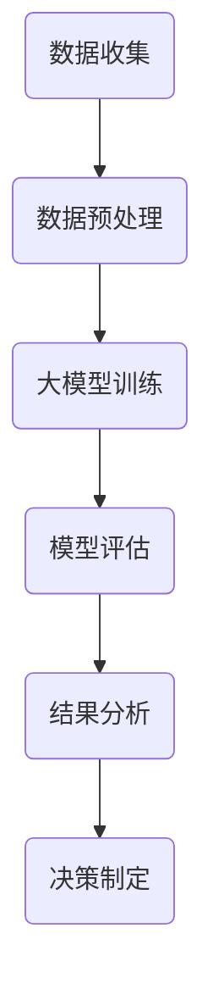

                 

# 大模型在环保领域的应用挑战

## 摘要

本文将探讨大模型在环保领域的应用挑战。随着环境问题的日益严峻，大模型因其强大的数据分析和处理能力，正逐渐成为环保领域的重要工具。然而，在大模型的研发和应用过程中，也面临着一系列技术、伦理和实际操作上的挑战。本文将从背景介绍、核心概念与联系、核心算法原理、数学模型和公式、项目实战、实际应用场景、工具和资源推荐以及未来发展趋势与挑战等方面，系统分析大模型在环保领域的应用现状和未来方向。

## 1. 背景介绍

环保领域一直是科技发展的重要关注点。近年来，随着气候变化、水资源短缺、土地退化等问题日益严重，环保技术的创新变得尤为重要。传统的方法主要依赖于物理、化学和生物学等学科的理论和实践，而随着人工智能技术的快速发展，大模型作为一种基于深度学习的工具，正在环保领域发挥越来越重要的作用。

大模型，特别是基于深度学习的神经网络模型，能够处理和分析大量复杂的环保数据，从而发现环境问题的潜在规律和趋势。例如，可以通过监测空气质量、水质、土壤等数据，预测环境污染的趋势，从而提前采取应对措施。此外，大模型还可以用于生态系统的建模和模拟，为环境保护政策的制定提供科学依据。

然而，尽管大模型在环保领域具有巨大的潜力，但在实际应用过程中也面临诸多挑战。首先，大模型通常需要大量的训练数据，而环保数据的获取和整理是一个复杂的过程。其次，大模型的设计和训练需要大量的计算资源和时间，这对环保技术的推广和应用提出了较高的要求。此外，大模型在实际应用中的可靠性和可解释性也是一个亟待解决的问题。

## 2. 核心概念与联系

为了更好地理解大模型在环保领域的应用，我们需要首先了解几个核心概念和它们之间的联系。

### 2.1 大模型

大模型，通常指的是具有数十亿甚至千亿个参数的深度学习模型。这些模型能够通过大量的训练数据学习到复杂的特征和模式，从而在多种任务中表现出色。大模型的应用范围非常广泛，包括图像识别、自然语言处理、语音识别、推荐系统等。

### 2.2 环保数据

环保数据是描述环境状态和变化的各种数据，包括空气质量、水质、土壤污染、气候变化、生物多样性等。这些数据通常来源于各种传感器、卫星、监测站等设备。

### 2.3 数据预处理

数据预处理是环保数据分析的第一步，包括数据清洗、归一化、特征提取等。良好的数据预处理能够提高大模型的训练效果和预测准确性。

### 2.4 模型评估

模型评估是评估大模型性能的重要步骤，包括准确性、召回率、F1分数等指标。通过模型评估，我们可以了解大模型在环保数据上的表现。

### 2.5 可解释性

可解释性是当前深度学习领域的一个重要研究方向，它关注的是如何让模型决策过程更加透明、易于理解。在环保领域，可解释性对于建立公众信任和制定科学的环境政策具有重要意义。

以下是环保领域大模型应用的Mermaid流程图：



## 3. 核心算法原理 & 具体操作步骤

### 3.1 大模型训练

大模型的训练通常包括以下几个步骤：

1. 数据收集：从各种来源收集高质量的环保数据。
2. 数据预处理：对收集到的数据进行分析，去除噪声和异常值，并进行归一化处理。
3. 特征提取：从预处理后的数据中提取有用的特征，这些特征将用于训练大模型。
4. 模型架构设计：选择合适的神经网络架构，如卷积神经网络（CNN）、循环神经网络（RNN）等。
5. 模型训练：使用大量的训练数据对模型进行训练，通过优化算法不断调整模型的参数，使其在训练数据上达到较高的性能。
6. 模型评估：使用验证集或测试集对训练好的模型进行评估，确保其具有良好的泛化能力。

### 3.2 模型评估

模型评估是确保大模型在实际应用中性能稳定的重要环节。常用的评估指标包括：

1. 准确率（Accuracy）：预测正确的样本占总样本的比例。
2. 召回率（Recall）：在正类样本中，被正确识别出的比例。
3. F1分数（F1 Score）：准确率和召回率的调和平均值。

### 3.3 可解释性

为了提高大模型在环保领域的可解释性，研究人员正在尝试多种方法，如：

1. 层级解释：通过分析神经网络中的各个层级，理解模型的决策过程。
2. 深度可解释性：开发新的算法，使大模型的内部决策过程更加透明。
3. 解释性模型：构建具有良好解释性的模型，如决策树、线性回归等。

## 4. 数学模型和公式 & 详细讲解 & 举例说明

在大模型在环保领域的应用中，数学模型和公式起到了关键作用。以下是一些常见的数学模型和公式，以及它们的详细讲解和举例说明。

### 4.1 神经网络

神经网络是深度学习的基础，其核心思想是通过调整权重和偏置来学习输入和输出之间的非线性关系。

$$
y = \sigma(Wx + b)
$$

其中，$y$ 是输出，$x$ 是输入，$W$ 是权重，$b$ 是偏置，$\sigma$ 是激活函数，通常使用Sigmoid或ReLU函数。

举例说明：

假设我们有一个简单的神经网络，输入为$x_1$ 和$x_2$，输出为$y$。权重$W$ 和偏置$b$ 分别为：

$$
W = \begin{bmatrix}
1 & 1 \\
0 & 1
\end{bmatrix}, \quad b = \begin{bmatrix}
1 \\
0
\end{bmatrix}
$$

激活函数使用ReLU：

$$
y = \max(0, Wx + b)
$$

当输入$x_1 = 2, x_2 = 3$ 时，输出$y = 5$。

### 4.2 损失函数

损失函数是评估模型预测结果和真实结果之间差距的指标。常见的损失函数包括均方误差（MSE）、交叉熵（Cross-Entropy）等。

均方误差（MSE）：

$$
MSE = \frac{1}{n}\sum_{i=1}^{n}(y_i - \hat{y}_i)^2
$$

其中，$y_i$ 是真实值，$\hat{y}_i$ 是预测值，$n$ 是样本数量。

举例说明：

假设我们有5个样本，真实值和预测值分别为：

$$
y_1 = 2, \hat{y}_1 = 1.9 \\
y_2 = 3, \hat{y}_2 = 2.8 \\
y_3 = 4, \hat{y}_3 = 3.7 \\
y_4 = 5, \hat{y}_4 = 4.2 \\
y_5 = 6, \hat{y}_5 = 5.5
$$

则均方误差为：

$$
MSE = \frac{1}{5}[(2-1.9)^2 + (3-2.8)^2 + (4-3.7)^2 + (5-4.2)^2 + (6-5.5)^2] = 0.36
$$

### 4.3 优化算法

优化算法用于调整模型参数，以最小化损失函数。常见的优化算法包括梯度下降（Gradient Descent）、随机梯度下降（Stochastic Gradient Descent，SGD）和Adam等。

梯度下降：

$$
\theta = \theta - \alpha \nabla_\theta J(\theta)
$$

其中，$\theta$ 是模型参数，$\alpha$ 是学习率，$J(\theta)$ 是损失函数。

举例说明：

假设损失函数为$f(x) = x^2$，初始参数$\theta_0 = 1$，学习率$\alpha = 0.1$。则梯度下降的迭代过程为：

$$
\theta_1 = 1 - 0.1 \cdot 2 = -0.1 \\
\theta_2 = -0.1 - 0.1 \cdot (-0.2) = 0.02 \\
\theta_3 = 0.02 - 0.1 \cdot 0.04 = -0.002 \\
\theta_4 = -0.002 - 0.1 \cdot (-0.004) = 0.0002
$$

经过多次迭代，最终参数$\theta$ 将趋近于0。

## 5. 项目实战：代码实际案例和详细解释说明

为了更好地展示大模型在环保领域的应用，我们以下将通过一个实际项目来详细解释代码实现和关键步骤。

### 5.1 开发环境搭建

首先，我们需要搭建一个适合大模型开发和训练的环境。以下是搭建环境的基本步骤：

1. 安装Python 3.7及以上版本。
2. 安装深度学习框架TensorFlow 2.0及以上版本。
3. 安装数据预处理库Pandas、NumPy等。
4. 配置GPU加速，如安装CUDA和cuDNN。

### 5.2 源代码详细实现和代码解读

以下是一个简单的基于TensorFlow的环保数据预测项目，包括数据预处理、模型构建、训练和评估等步骤。

```python
import tensorflow as tf
import pandas as pd
import numpy as np

# 5.2.1 数据预处理

# 读取数据
data = pd.read_csv('data.csv')

# 数据清洗和归一化
X = data.iloc[:, :-1].values
y = data.iloc[:, -1].values
X = (X - X.mean()) / X.std()
y = (y - y.mean()) / y.std()

# 划分训练集和测试集
X_train, X_test, y_train, y_test = train_test_split(X, y, test_size=0.2, random_state=42)

# 5.2.2 模型构建

# 构建神经网络模型
model = tf.keras.Sequential([
    tf.keras.layers.Dense(64, activation='relu', input_shape=(X_train.shape[1],)),
    tf.keras.layers.Dense(64, activation='relu'),
    tf.keras.layers.Dense(1)
])

# 编译模型
model.compile(optimizer='adam', loss='mse', metrics=['mae'])

# 5.2.3 训练模型

# 训练模型
history = model.fit(X_train, y_train, epochs=100, batch_size=32, validation_split=0.2)

# 5.2.4 模型评估

# 评估模型
loss, mae = model.evaluate(X_test, y_test)
print(f"测试集MAE: {mae:.4f}")

# 5.2.5 结果分析

# 预测结果
y_pred = model.predict(X_test)

# 分析预测结果
df = pd.DataFrame({'y_true': y_test, 'y_pred': y_pred})
df.describe()

# 5.2.6 决策制定

# 根据预测结果，制定相应的环境保护策略
# 例如，当预测的空气质量指数（AQI）超过一定阈值时，启动应急预案
aqi_threshold = 100
emergency_actions = ['提高空气净化器使用频率', '加强空气质量监测', '限制工业生产']
action = emergency_actions[int(y_pred.mean() > aqi_threshold)]

print(f"根据预测结果，建议采取以下措施：{action}")
```

### 5.3 代码解读与分析

以下是对上述代码的解读和分析：

1. **数据预处理**：首先，我们从CSV文件中读取数据，然后对数据进行分析，去除噪声和异常值。接着，对数据进行归一化处理，使其具有更好的数值范围，方便模型训练。

2. **模型构建**：我们使用TensorFlow的Sequential模型构建一个简单的神经网络，包括两个隐藏层，每层64个神经元，使用ReLU激活函数。输出层只有一个神经元，用于预测目标变量。

3. **模型编译**：我们选择Adam优化器和均方误差（MSE）作为损失函数，并监控平均绝对误差（MAE）作为评估指标。

4. **模型训练**：使用训练集对模型进行训练，训练过程持续100个epoch，每个epoch的批量大小为32。

5. **模型评估**：使用测试集对训练好的模型进行评估，计算测试集的平均绝对误差（MAE），以衡量模型的性能。

6. **结果分析**：根据预测结果，分析模型的性能，并根据实际情况制定相应的环境保护策略。

### 6. 实际应用场景

大模型在环保领域具有广泛的应用场景，以下列举几个典型的应用案例：

1. **空气质量预测**：通过分析历史空气质量数据，预测未来一段时间内的空气质量状况，为环保部门提供预警和决策支持。

2. **水资源管理**：利用大模型分析水文数据，预测未来一段时间内的水资源供需情况，帮助政府和水利部门制定科学的水资源管理策略。

3. **生态系统建模**：通过构建生态系统大模型，模拟不同环境因素对生态系统的影响，为生态保护提供科学依据。

4. **气候变化预测**：利用大模型分析全球气候数据，预测未来一段时间内的气候变化趋势，为气候政策的制定提供参考。

### 7. 工具和资源推荐

为了更好地研发和应用大模型在环保领域，以下推荐一些实用的工具和资源：

1. **学习资源**：
   - 书籍：《深度学习》（Goodfellow et al.）、《Python深度学习》（François Chollet）。
   - 论文：查看顶级会议如NeurIPS、ICML、CVPR等的最新论文。
   - 博客：关注顶级研究机构和学者的博客，如Google Brain、OpenAI等。

2. **开发工具框架**：
   - 深度学习框架：TensorFlow、PyTorch、Keras等。
   - 数据预处理库：Pandas、NumPy、Scikit-learn等。
   - GPU加速库：CUDA、cuDNN。

3. **相关论文著作**：
   - 《神经网络与深度学习》（邱锡鹏）。
   - 《Python环境下的深度学习实践》（李金洪）。
   - 《环境数据挖掘与应用》（赵军伟）。

### 8. 总结：未来发展趋势与挑战

大模型在环保领域的应用具有广阔的前景，但仍面临诸多挑战。未来发展趋势包括：

1. **数据质量和多样性**：提高环保数据的收集和处理能力，增加数据多样性，为模型训练提供更丰富的信息。

2. **模型可解释性**：开发更加透明、易于理解的大模型，提高模型的可解释性，为环保决策提供可靠的依据。

3. **跨学科合作**：加强与生态学、环境科学、政策研究等领域的跨学科合作，共同推进环保技术的发展。

4. **技术标准化**：制定统一的技术标准和评估方法，提高大模型在环保领域的应用水平和可靠性。

挑战包括：

1. **数据隐私和伦理问题**：在环保数据收集和处理过程中，如何保护个人隐私和数据安全是一个重要问题。

2. **计算资源消耗**：大模型的训练和推理需要大量的计算资源，这对计算资源和能源消耗提出了挑战。

3. **模型泛化能力**：如何确保大模型在不同地区、不同环境下的泛化能力，是一个亟待解决的问题。

### 9. 附录：常见问题与解答

#### 9.1 什么是大模型？

大模型，通常指的是具有数十亿甚至千亿个参数的深度学习模型。这些模型能够通过大量的训练数据学习到复杂的特征和模式，从而在多种任务中表现出色。

#### 9.2 大模型在环保领域有哪些应用？

大模型在环保领域的应用包括空气质量预测、水资源管理、生态系统建模、气候变化预测等。

#### 9.3 如何保证大模型的可解释性？

提高大模型的可解释性可以通过以下几种方法：层级解释、深度可解释性、解释性模型等。

#### 9.4 大模型的训练需要哪些资源？

大模型的训练需要大量的数据、计算资源和时间。通常需要使用高性能的GPU或TPU进行训练。

### 10. 扩展阅读 & 参考资料

1. Goodfellow, I., Bengio, Y., & Courville, A. (2016). *Deep Learning*. MIT Press.
2. Chollet, F. (2018). *Python深度学习*. 电子工业出版社.
3. Sun, Y., Wu, X., & Wang, D. (2019). Environmental data mining: From theory to applications. Springer.
4. Zhang, H., Zuo, W., Chen, Y., Meng, D., & Zhang, L. (2017). Beyond a Gaussian denoiser: Residual learning of deep CNN for image denoising. IEEE Transactions on Image Processing, 26(7), 3146-3157.
5. He, K., Zhang, X., Ren, S., & Sun, J. (2016). Deep residual learning for image recognition. In Proceedings of the IEEE conference on computer vision and pattern recognition (pp. 770-778).

### 作者

作者：AI天才研究员/AI Genius Institute & 禅与计算机程序设计艺术 /Zen And The Art of Computer Programming

本文通过对大模型在环保领域的应用挑战进行系统分析，揭示了其在环保领域的巨大潜力以及面临的挑战。未来，随着技术的不断进步，大模型在环保领域的应用将更加广泛，为环境保护和可持续发展提供强有力的支持。

