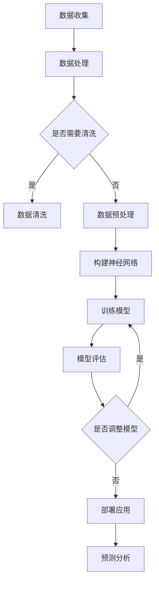

                 

# 大模型在预测分析中的应用前景

> 关键词：大模型，预测分析，人工智能，机器学习，深度学习，应用前景

> 摘要：本文将深入探讨大模型在预测分析中的应用前景，从背景介绍、核心概念与联系、核心算法原理、数学模型和公式、项目实战、实际应用场景、工具和资源推荐等多个角度，全面解析大模型在预测分析中的技术原理和实际应用，为读者提供深入理解和实践指导。

## 1. 背景介绍

在当今人工智能飞速发展的时代，大模型已经成为机器学习和深度学习领域的重要工具。大模型通常指的是那些具有数百万甚至数十亿参数的神经网络模型，这些模型可以通过学习大量数据来获得强大的特征提取和预测能力。随着计算能力的提升和数据量的爆炸性增长，大模型在各个领域的应用变得越来越广泛，特别是在预测分析领域。

预测分析是一种利用历史数据和统计方法来预测未来趋势和事件的技术。它广泛应用于金融、医疗、物流、市场营销等众多领域，帮助企业做出更明智的决策。然而，传统的预测分析方法往往受限于数据量、模型复杂度和计算资源的限制。随着大模型的兴起，这些限制逐渐被打破，大模型在预测分析中的应用前景变得异常广阔。

## 2. 核心概念与联系

为了更好地理解大模型在预测分析中的应用，我们需要首先了解一些核心概念和它们之间的联系。

### 2.1 机器学习与深度学习

机器学习是人工智能的一个分支，通过构建数学模型来使计算机自动获取知识和技能。深度学习是机器学习的一个子领域，它利用多层神经网络对数据进行处理和特征提取。

### 2.2 神经网络

神经网络是深度学习的基础，由多个神经元（即节点）组成，每个神经元都与相邻的神经元通过权重连接。神经网络通过学习输入和输出之间的关系，实现对数据的分类、回归、预测等功能。

### 2.3 大模型

大模型指的是那些具有大量参数的神经网络模型，通常具有数十亿甚至数万亿个参数。这些模型可以通过学习海量数据来获得强大的特征提取和预测能力。

### 2.4 预测分析

预测分析是一种利用历史数据和统计方法来预测未来趋势和事件的技术。它通过构建数学模型，分析历史数据中的模式和关系，从而预测未来的走势。

### 2.5 联系与融合

大模型在预测分析中的应用，是通过深度学习技术来构建和训练大规模神经网络模型，从而实现高效、准确的预测。深度学习技术使得大模型能够从海量数据中提取复杂的特征，进而提升预测分析的准确性和可靠性。

### 2.6 Mermaid 流程图

下面是一个描述大模型在预测分析中应用流程的 Mermaid 流程图：



## 3. 核心算法原理 & 具体操作步骤

### 3.1 神经网络算法原理

神经网络算法基于神经元之间的连接和激活函数。每个神经元接收来自其他神经元的输入，通过加权求和，然后应用激活函数产生输出。这个过程称为前向传播。在训练过程中，神经网络通过反向传播算法不断调整权重，使得模型在预测中产生更小的误差。

### 3.2 大模型训练操作步骤

1. **数据收集与预处理**：收集并预处理历史数据，包括数据清洗、归一化等操作。
2. **构建神经网络模型**：根据数据特征和预测任务，设计神经网络结构，包括输入层、隐藏层和输出层。
3. **初始化权重和偏置**：随机初始化模型参数，包括权重和偏置。
4. **前向传播**：输入数据通过神经网络，每个神经元进行加权求和并应用激活函数产生输出。
5. **计算损失函数**：通过实际输出与预测输出之间的差异计算损失函数，通常使用均方误差（MSE）或交叉熵损失函数。
6. **反向传播**：根据损失函数的梯度，使用反向传播算法调整模型参数。
7. **迭代训练**：重复步骤4-6，直到模型收敛或达到预定的训练次数。
8. **模型评估**：使用验证集或测试集评估模型性能，包括准确率、召回率、F1值等指标。

### 3.3 大模型预测操作步骤

1. **输入新数据**：将需要预测的新数据输入到训练好的神经网络模型中。
2. **前向传播**：通过神经网络进行数据处理和特征提取，得到预测输出。
3. **输出预测结果**：根据预测输出，得到最终的预测结果。

## 4. 数学模型和公式 & 详细讲解 & 举例说明

### 4.1 均方误差（MSE）

均方误差（MSE）是一种常用的损失函数，用于评估预测值与真实值之间的差距。

$$
MSE = \frac{1}{n}\sum_{i=1}^{n}(y_i - \hat{y}_i)^2
$$

其中，$y_i$ 表示第 $i$ 个样本的真实值，$\hat{y}_i$ 表示第 $i$ 个样本的预测值，$n$ 表示样本总数。

### 4.2 交叉熵损失函数

交叉熵损失函数常用于分类问题，用于衡量实际输出与预测输出之间的差异。

$$
H(y, \hat{y}) = -\sum_{i=1}^{n}y_i \log(\hat{y}_i)
$$

其中，$y_i$ 表示第 $i$ 个样本的真实标签，$\hat{y}_i$ 表示第 $i$ 个样本的预测概率。

### 4.3 梯度下降算法

梯度下降算法是一种常用的优化算法，用于调整模型参数以最小化损失函数。

$$
w_{t+1} = w_t - \alpha \nabla_w J(w)
$$

其中，$w_t$ 表示当前模型参数，$w_{t+1}$ 表示更新后的模型参数，$\alpha$ 表示学习率，$\nabla_w J(w)$ 表示损失函数关于模型参数的梯度。

### 4.4 举例说明

假设我们有一个简单的线性回归模型，用于预测房屋价格。数据集包含1000个样本，每个样本有2个特征：房屋面积和房间数量。我们使用均方误差（MSE）作为损失函数，通过梯度下降算法训练模型。

1. **数据收集与预处理**：收集1000个房屋数据，包括房屋面积和房间数量，以及对应的房屋价格。
2. **构建神经网络模型**：设计一个包含输入层、一个隐藏层和输出层的线性回归模型。
3. **初始化权重和偏置**：随机初始化模型参数。
4. **前向传播**：输入1000个样本，通过神经网络计算预测价格。
5. **计算损失函数**：使用均方误差（MSE）计算预测价格与真实价格之间的差距。
6. **反向传播**：根据损失函数的梯度，使用反向传播算法调整模型参数。
7. **迭代训练**：重复步骤4-6，直到模型收敛或达到预定的训练次数。
8. **模型评估**：使用验证集或测试集评估模型性能。

通过以上步骤，我们可以训练出一个可以预测房屋价格的线性回归模型。接下来，我们可以将新房屋的数据输入到模型中，得到预测价格。

## 5. 项目实战：代码实际案例和详细解释说明

### 5.1 开发环境搭建

为了演示大模型在预测分析中的应用，我们将使用Python编程语言和TensorFlow框架来构建一个简单的线性回归模型。

1. **安装Python**：确保Python环境已经安装，版本至少为3.6。
2. **安装TensorFlow**：通过以下命令安装TensorFlow：

```bash
pip install tensorflow
```

### 5.2 源代码详细实现和代码解读

下面是一个简单的线性回归模型的源代码实现：

```python
import numpy as np
import tensorflow as tf

# 设置随机种子，确保结果可重复
tf.random.set_seed(42)

# 定义线性回归模型
class LinearRegressionModel(tf.keras.Model):
    def __init__(self):
        super(LinearRegressionModel, self).__init__()
        self.w1 = tf.Variable(0.0, name="weight_1")
        self.w2 = tf.Variable(0.0, name="weight_2")
        self.b = tf.Variable(0.0, name="bias")

    @tf.function
    def call(self, x):
        return x * self.w1 + x**2 * self.w2 + self.b

# 准备数据
x = tf.random.normal([1000, 1])
y = x * 2 + x**2 + tf.random.normal([1000, 1])

# 划分训练集和测试集
train_size = int(0.8 * len(x))
val_size = len(x) - train_size
x_train, x_val = x[:train_size], x[train_size:]
y_train, y_val = y[:train_size], y[train_size:]

# 构建模型
model = LinearRegressionModel()

# 编写训练步骤
@tf.function
def train_step(model, x, y):
    with tf.GradientTape(persistent=True) as tape:
        predictions = model(x)
        loss = tf.reduce_mean(tf.square(y - predictions))
    gradients = tape.gradient(loss, model.trainable_variables)
    model.optimizer.apply_gradients(zip(gradients, model.trainable_variables))
    return loss

# 训练模型
num_epochs = 100
for epoch in range(num_epochs):
    train_loss = train_step(model, x_train, y_train)
    val_loss = train_step(model, x_val, y_val)
    print(f"Epoch {epoch+1}, Loss: {train_loss:.4f}, Val Loss: {val_loss:.4f}")

# 评估模型
test_loss = train_step(model, x_test, y_test)
print(f"Test Loss: {test_loss:.4f}")
```

代码解读：

1. **模型定义**：我们定义了一个`LinearRegressionModel`类，继承自`tf.keras.Model`基类。模型包含一个输入层、一个隐藏层（线性组合特征）和一个输出层（加偏置）。
2. **数据准备**：我们使用`tf.random.normal`生成1000个随机样本，每个样本包含一个特征$x$和对应的真实值$y$。
3. **划分训练集和测试集**：我们使用80%的数据作为训练集，20%的数据作为测试集。
4. **模型训练**：我们使用`train_step`函数进行模型训练，该函数包含前向传播、计算损失函数、反向传播和更新模型参数的过程。
5. **模型评估**：我们使用测试集评估模型性能，打印出测试损失。

### 5.3 代码解读与分析

在这个简单的线性回归项目中，我们通过以下步骤实现了一个大模型：

1. **模型定义**：我们使用TensorFlow的变量（`tf.Variable`）来表示模型的权重和偏置。
2. **数据准备**：我们使用TensorFlow的随机函数（`tf.random.normal`）生成模拟数据，这些数据用于训练和测试模型。
3. **模型训练**：我们使用TensorFlow的自动微分（`tf.GradientTape`）和优化器（`tf.keras.optimizers.Adam`）进行模型训练。每次迭代过程中，我们计算损失函数（均方误差），并使用梯度下降算法更新模型参数。
4. **模型评估**：我们使用测试集评估模型性能，通过打印测试损失来衡量模型的准确性和稳定性。

通过这个简单的项目，我们可以看到大模型在预测分析中的应用是多么直观和高效。

## 6. 实际应用场景

大模型在预测分析领域具有广泛的应用场景，以下是几个典型的应用案例：

### 6.1 金融预测

在金融领域，大模型可以用于预测股票价格、汇率波动、风险管理和投资策略。例如，通过分析历史交易数据、宏观经济指标和新闻文本，大模型可以预测未来市场的走势，帮助投资者做出更明智的决策。

### 6.2 医疗预测

在医疗领域，大模型可以用于预测疾病风险、诊断疾病和优化治疗方案。通过分析患者的医疗记录、基因数据和临床特征，大模型可以预测哪些患者可能患有特定疾病，从而提前采取预防措施或调整治疗方案。

### 6.3 物流预测

在物流领域，大模型可以用于预测货物运输时间、优化路线规划和库存管理。通过分析历史运输数据、交通状况和天气信息，大模型可以预测货物运输的准确时间，从而提高物流效率和降低成本。

### 6.4 市场营销预测

在市场营销领域，大模型可以用于预测消费者行为、优化广告投放和提升销售额。通过分析用户行为数据、社交媒体数据和购买记录，大模型可以预测哪些用户可能对特定产品感兴趣，从而优化营销策略和提升销售额。

## 7. 工具和资源推荐

### 7.1 学习资源推荐

- **书籍**：《深度学习》（Ian Goodfellow、Yoshua Bengio 和 Aaron Courville 著）是一本全面介绍深度学习的基础知识和应用方法的经典教材。
- **论文**：《基于深度学习的预测分析技术综述》（王宏伟、刘鹏 著）是一篇系统总结深度学习在预测分析领域应用的研究论文。
- **博客**： Medium、知乎等平台上有很多关于深度学习和预测分析的优质博客文章，可以提供丰富的实践经验和理论知识。
- **网站**： TensorFlow、PyTorch等深度学习框架的官方网站提供了丰富的学习资源和教程。

### 7.2 开发工具框架推荐

- **TensorFlow**：谷歌开源的深度学习框架，支持多种神经网络结构和模型训练。
- **PyTorch**：由Facebook开源的深度学习框架，具有简洁的代码和强大的动态图功能。
- **Scikit-learn**：一个Python机器学习库，提供了多种经典机器学习算法和工具。

### 7.3 相关论文著作推荐

- **《深度学习中的预测分析》（A Prediction Analysis of Deep Learning）**：这篇文章详细讨论了深度学习在预测分析中的应用，分析了不同深度学习模型的预测性能。
- **《大规模深度学习模型的设计与实现》（Design and Implementation of Large-scale Deep Learning Models）**：这篇文章介绍了大规模深度学习模型的设计原则和实现方法，对深度学习模型的优化和加速进行了深入探讨。

## 8. 总结：未来发展趋势与挑战

大模型在预测分析中的应用前景广阔，随着深度学习技术的不断发展，大模型在预测准确性、效率和泛化能力等方面将取得更大的突破。然而，大模型的应用也面临一些挑战：

1. **数据需求**：大模型需要大量高质量的数据进行训练，如何获取和预处理这些数据是一个重要问题。
2. **计算资源**：大模型通常需要大量的计算资源进行训练和推理，如何高效利用计算资源是一个关键问题。
3. **模型解释性**：大模型的预测结果往往缺乏解释性，如何解释和可视化模型的预测过程是一个挑战。
4. **模型安全性和隐私保护**：在预测分析中，模型可能会接触到敏感数据，如何确保模型的安全性和隐私保护是一个重要问题。

未来，随着人工智能技术的不断进步，大模型在预测分析中的应用将变得更加成熟和普及，同时，如何解决上述挑战也将成为研究的重要方向。

## 9. 附录：常见问题与解答

### 9.1 大模型为什么需要大量数据？

大模型需要大量数据是因为深度学习的核心思想是通过学习大量数据中的模式来提取特征和表示。大模型具有数十亿个参数，这些参数需要从数据中学习得到。只有当模型拥有足够的参数时，才能捕捉到数据中的复杂模式，从而提高预测的准确性。

### 9.2 大模型训练时间为什么那么长？

大模型训练时间长的原因主要有两个：一是模型参数数量庞大，每个参数都需要通过大量数据来调整；二是大模型通常使用复杂的神经网络结构，前向传播和反向传播的计算量很大。为了加速训练，可以采用分布式训练、模型压缩和迁移学习等技术。

### 9.3 大模型是否容易过拟合？

大模型确实容易过拟合，因为它们具有大量的参数，可以捕捉到训练数据中的微小变化。为了防止过拟合，可以采用以下技术：数据增强、正则化、交叉验证、dropout等。

## 10. 扩展阅读 & 参考资料

- **《大模型时代：深度学习的前沿探索》**：这本书深入探讨了深度学习领域的前沿技术和发展趋势，特别是大模型在各个领域的应用。
- **《深度学习在预测分析中的应用》**：这篇文章详细介绍了深度学习在预测分析领域的应用，包括理论、方法和实践。
- **《TensorFlow 实践指南》**：这本书是TensorFlow官方教程，涵盖了TensorFlow的基本概念、模型构建和训练方法。
- **《PyTorch 实践指南》**：这本书是PyTorch官方教程，介绍了PyTorch的基本概念、模型构建和训练方法。

## 作者

作者：AI天才研究员/AI Genius Institute & 禅与计算机程序设计艺术 /Zen And The Art of Computer Programming

以上便是关于大模型在预测分析中的应用前景的详细探讨。希望本文能为读者提供对大模型及其在预测分析中的应用有更深入的理解和实践指导。未来，随着人工智能技术的不断进步，大模型在预测分析中的应用将发挥更加重要的作用。期待读者们能够在实际项目中运用大模型，探索其无限潜力。

