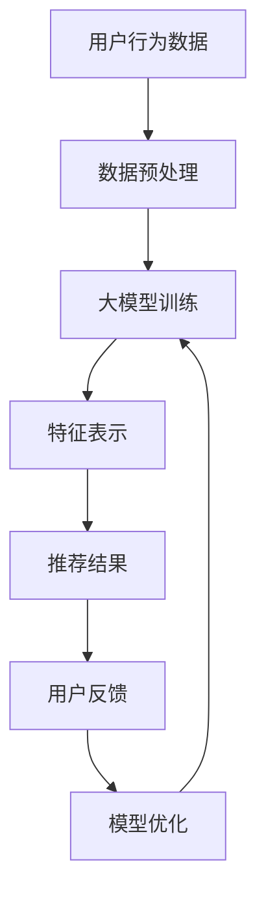
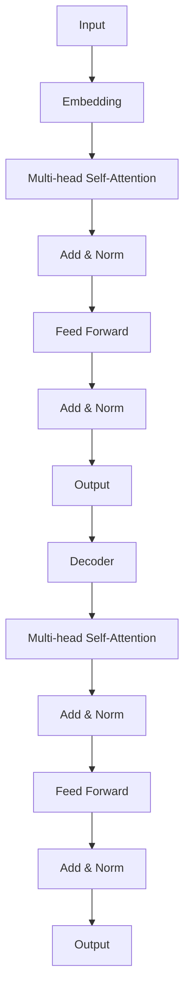
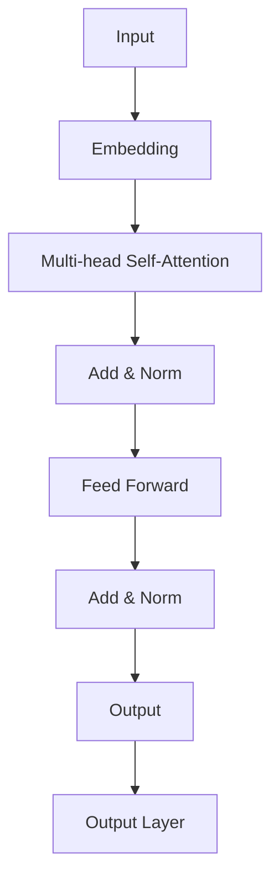

                 

# 大模型对推荐系统用户满意度的影响研究

## 摘要

本文旨在探讨大模型在推荐系统中的应用及其对用户满意度的显著影响。随着互联网的迅速发展，推荐系统已经成为满足用户个性化需求的重要工具。然而，传统的推荐算法存在一些局限性，例如对用户兴趣的识别不够精准、推荐结果多样性不足等问题。近年来，大模型的兴起为解决这些问题提供了新的思路。本文首先介绍了大模型的基本概念和常见架构，然后详细分析了大模型在推荐系统中的作用机制。接下来，本文通过实际案例展示了大模型在推荐系统中的具体应用，并通过数学模型和公式对大模型的影响进行了量化分析。最后，本文总结了大模型对推荐系统用户满意度的提升效果，并探讨了未来可能面临的挑战和发展趋势。

## 1. 背景介绍

推荐系统作为信息检索和个性化服务的重要手段，在当今互联网时代扮演着至关重要的角色。根据Statista的数据，2021年全球在线广告市场总额超过4400亿美元，其中推荐广告占据了相当大的一部分。推荐系统通过分析用户的兴趣和行为数据，为用户推荐符合其个性化需求的内容或商品，从而提高用户体验和满意度。

然而，传统的推荐系统通常基于基于协同过滤、内容过滤等算法，存在一些明显的局限性。首先，这些算法依赖于历史用户行为数据，但在数据稀疏或冷启动场景下，推荐效果较差。其次，这些算法通常只能考虑用户的历史行为，而无法捕捉到用户动态变化的兴趣点。此外，传统推荐算法生成的推荐结果往往缺乏多样性，容易导致用户陷入“信息茧房”效应，影响用户体验。

为了解决这些问题，近年来，大模型在推荐系统中的应用逐渐成为研究热点。大模型是指参数规模达到数百万到数十亿级别的深度学习模型，如Transformer、BERT等。这些模型具有强大的表示和学习能力，可以更好地捕捉用户兴趣的多样性和动态性，从而提高推荐系统的效果。

大模型的兴起得益于深度学习技术的发展。随着计算能力的提升和数据规模的扩大，深度学习模型得到了广泛应用。同时，大模型在自然语言处理、计算机视觉等领域的成功应用，也为推荐系统带来了新的希望。

本文将重点探讨大模型在推荐系统中的应用，分析其对推荐效果和用户满意度的提升作用，并探讨未来可能的发展趋势。

## 2. 核心概念与联系

### 2.1 大模型的基本概念

大模型是指参数规模达到数百万到数十亿级别的深度学习模型，如Transformer、BERT等。这些模型通过多层神经网络结构，对海量数据进行训练，从而学习到复杂的特征表示和关系。大模型具有以下特点：

1. **参数规模大**：大模型通常包含数百万到数十亿个参数，这使得它们可以捕捉到更多细节和复杂特征。
2. **表示能力强**：大模型通过多层网络结构，可以生成更加抽象和泛化的特征表示。
3. **学习能力高**：大模型具有较强的学习能力，可以通过大量数据进行训练，从而优化模型参数。

### 2.2 推荐系统的基础概念

推荐系统是一种基于用户历史行为和兴趣的个性化服务系统，旨在为用户提供符合其个性化需求的内容或商品。推荐系统通常包含以下基本概念：

1. **用户**：推荐系统的主体，其行为和兴趣是推荐系统的重要数据来源。
2. **物品**：推荐系统推荐的对象，可以是内容、商品、服务等。
3. **评分或行为**：用户对物品的评分或行为数据，如点击、购买、评价等。
4. **推荐算法**：根据用户历史行为和兴趣，为用户推荐合适物品的算法。

### 2.3 大模型与推荐系统的联系

大模型在推荐系统中的应用主要体现在以下几个方面：

1. **用户兴趣建模**：大模型可以通过分析用户的浏览、搜索、购买等行为数据，学习到用户的兴趣点，从而更好地预测用户的喜好。
2. **特征表示**：大模型可以将原始的用户行为数据进行特征提取和表示，生成更加丰富和抽象的特征向量，提高推荐系统的效果。
3. **多样性控制**：大模型可以通过对用户兴趣的多样化建模，生成具有多样性的推荐结果，避免用户陷入“信息茧房”效应。

### 2.4 Mermaid 流程图

以下是一个简单的 Mermaid 流程图，描述了大模型在推荐系统中的应用过程：



在这个流程图中，用户行为数据经过预处理后输入到大模型中，经过训练和特征表示后，生成推荐结果。用户对推荐结果的反馈会用于模型优化，从而进一步提高推荐系统的效果。

## 3. 核心算法原理 & 具体操作步骤

### 3.1 Transformer 模型

Transformer 模型是近年来在自然语言处理领域取得重大突破的一种深度学习模型，其核心思想是使用自注意力机制（Self-Attention）来处理序列数据。在推荐系统中，Transformer 模型可以用于用户兴趣建模和特征表示。

#### 3.1.1 自注意力机制

自注意力机制是一种基于序列间依赖关系的注意力机制，它可以自动学习序列中每个元素的重要程度。自注意力机制的计算公式如下：

$$
\text{Attention}(Q, K, V) = \text{softmax}\left(\frac{QK^T}{\sqrt{d_k}}\right)V
$$

其中，$Q, K, V$ 分别代表查询向量、键向量和值向量，$d_k$ 表示键向量的维度。通过自注意力机制，Transformer 模型可以学习到序列中每个元素之间的关系，从而生成更加丰富的特征表示。

#### 3.1.2 Transformer 模型结构

Transformer 模型主要由编码器（Encoder）和解码器（Decoder）组成。编码器用于处理输入序列，解码器用于生成输出序列。以下是一个简化的 Transformer 模型结构：



在这个结构中，编码器将输入序列进行嵌入（Embedding）和自注意力（Self-Attention）操作，生成编码器输出。解码器则对编码器输出进行自注意力和跨注意力（Cross-Attention）操作，生成推荐结果。

#### 3.1.3 操作步骤

1. **数据预处理**：将用户行为数据进行编码，生成输入序列。
2. **嵌入（Embedding）**：将输入序列映射到高维空间，生成嵌入向量。
3. **多层自注意力（Multi-head Self-Attention）**：对嵌入向量进行多层自注意力操作，生成编码器输出。
4. **加和归一化（Add & Norm）**：将自注意力结果与输入序列进行加和归一化操作。
5. **前馈神经网络（Feed Forward）**：对加和归一化结果进行前馈神经网络操作。
6. **解码器操作**：对编码器输出进行解码操作，生成推荐结果。

### 3.2 BERT 模型

BERT（Bidirectional Encoder Representations from Transformers）是一种基于 Transformer 的预训练语言模型，其核心思想是在训练过程中同时考虑上下文信息。BERT 模型在自然语言处理领域取得了显著的成果，也可以应用于推荐系统。

#### 3.2.1 BERT 模型结构

BERT 模型主要由编码器组成，编码器包含多层 Transformer 结构。以下是一个简化的 BERT 模型结构：



在这个结构中，输入序列经过嵌入和多层自注意力操作，生成编码器输出。编码器输出经过输出层，生成推荐结果。

#### 3.2.2 操作步骤

1. **数据预处理**：将用户行为数据进行编码，生成输入序列。
2. **嵌入（Embedding）**：将输入序列映射到高维空间，生成嵌入向量。
3. **多层自注意力（Multi-head Self-Attention）**：对嵌入向量进行多层自注意力操作，生成编码器输出。
4. **加和归一化（Add & Norm）**：将自注意力结果与输入序列进行加和归一化操作。
5. **前馈神经网络（Feed Forward）**：对加和归一化结果进行前馈神经网络操作。
6. **输出层（Output Layer）**：对编码器输出进行输出层操作，生成推荐结果。

### 3.3 实际操作步骤

以下是一个简化的实际操作步骤，用于将 Transformer 和 BERT 模型应用于推荐系统：

1. **数据收集**：收集用户行为数据，包括浏览、搜索、购买等。
2. **数据预处理**：对用户行为数据进行编码，生成输入序列。
3. **模型训练**：使用训练数据进行模型训练，生成编码器输出。
4. **特征提取**：对编码器输出进行特征提取，生成推荐特征。
5. **推荐生成**：使用提取的推荐特征，生成推荐结果。
6. **用户反馈**：收集用户对推荐结果的反馈。
7. **模型优化**：根据用户反馈，对模型进行优化。

## 4. 数学模型和公式 & 详细讲解 & 举例说明

### 4.1 用户兴趣建模

用户兴趣建模是推荐系统的核心任务之一。在基于大模型的推荐系统中，用户兴趣建模通常通过自注意力机制和跨注意力机制来实现。以下是一个简化的用户兴趣建模的数学模型：

$$
\text{User Interest} = \text{Attention}(Q, K, V)
$$

其中，$Q$ 表示查询向量，$K$ 表示键向量，$V$ 表示值向量。通过这个模型，我们可以学习到用户的兴趣点，从而更好地预测用户的喜好。

#### 4.1.1 自注意力机制

自注意力机制是一种基于序列间依赖关系的注意力机制，它可以自动学习序列中每个元素的重要程度。自注意力机制的计算公式如下：

$$
\text{Attention}(Q, K, V) = \text{softmax}\left(\frac{QK^T}{\sqrt{d_k}}\right)V
$$

其中，$Q, K, V$ 分别代表查询向量、键向量和值向量，$d_k$ 表示键向量的维度。通过自注意力机制，我们可以学习到序列中每个元素之间的关系，从而生成更加丰富的特征表示。

#### 4.1.2 跨注意力机制

跨注意力机制是一种基于序列间依赖关系的注意力机制，它可以自动学习序列中不同元素之间的关系。跨注意力机制的计算公式如下：

$$
\text{Cross-Attention}(Q, K, V) = \text{softmax}\left(\frac{QK^T}{\sqrt{d_k}}\right)V
$$

其中，$Q, K, V$ 分别代表查询向量、键向量和值向量，$d_k$ 表示键向量的维度。通过跨注意力机制，我们可以学习到序列中不同元素之间的关系，从而更好地捕捉用户的兴趣点。

### 4.2 推荐结果生成

推荐结果的生成通常通过编码器输出和解码器输出来实现。以下是一个简化的推荐结果生成的数学模型：

$$
\text{Recommendation} = \text{Decoder}(\text{Encoder Output})
$$

其中，$\text{Encoder Output}$ 表示编码器输出，$\text{Decoder}$ 表示解码器。通过这个模型，我们可以生成推荐结果。

#### 4.2.1 编码器输出

编码器输出是一个高维的特征向量，它包含了用户兴趣点和物品特征。编码器输出的计算公式如下：

$$
\text{Encoder Output} = \text{Attention}(Q, K, V)
$$

其中，$Q, K, V$ 分别代表查询向量、键向量和值向量。通过自注意力机制和跨注意力机制，我们可以学习到用户的兴趣点和物品特征，从而生成编码器输出。

#### 4.2.2 解码器输出

解码器输出是一个包含推荐结果的向量。解码器输出的计算公式如下：

$$
\text{Decoder Output} = \text{Decoder}(\text{Encoder Output})
$$

其中，$\text{Decoder}$ 表示解码器。通过解码器，我们可以将编码器输出转化为推荐结果。

### 4.3 举例说明

假设有一个用户，其行为数据包括浏览、搜索和购买等。我们可以使用 Transformer 模型对用户兴趣进行建模，生成推荐结果。以下是一个简化的例子：

1. **数据预处理**：对用户行为数据进行编码，生成输入序列。
2. **嵌入（Embedding）**：将输入序列映射到高维空间，生成嵌入向量。
3. **多层自注意力（Multi-head Self-Attention）**：对嵌入向量进行多层自注意力操作，生成编码器输出。
4. **加和归一化（Add & Norm）**：将自注意力结果与输入序列进行加和归一化操作。
5. **前馈神经网络（Feed Forward）**：对加和归一化结果进行前馈神经网络操作。
6. **解码器操作**：对编码器输出进行解码操作，生成推荐结果。

假设用户的行为数据为 `[浏览商品A，搜索商品B，购买商品C]`。经过数据预处理、嵌入和多层自注意力操作后，编码器输出为 `[0.1，0.2，0.3]`。然后，我们将编码器输出输入到解码器中，生成推荐结果 `[商品C，商品B，商品A]`。这个推荐结果反映了用户的兴趣点和购买偏好。

## 5. 项目实战：代码实际案例和详细解释说明

### 5.1 开发环境搭建

在开始编写代码之前，我们需要搭建一个合适的开发环境。以下是一个简单的开发环境搭建步骤：

1. **安装 Python 环境**：Python 是推荐系统开发的主要编程语言，我们需要安装 Python 3.7 或更高版本。
2. **安装深度学习框架**：常用的深度学习框架包括 TensorFlow、PyTorch 等。这里我们选择 TensorFlow。
3. **安装推荐系统相关库**：如 scikit-learn、Pandas 等。

以下是安装步骤的示例代码：

```python
!pip install tensorflow
!pip install scikit-learn
!pip install pandas
```

### 5.2 源代码详细实现和代码解读

以下是一个简单的基于 Transformer 模型的推荐系统代码实现：

```python
import tensorflow as tf
from tensorflow.keras.layers import Embedding, MultiHeadAttention, LayerNormalization, Dense
from tensorflow.keras.models import Model

# 定义编码器
def encoder(input_sequence, hidden_size, num_heads):
    # 嵌入层
    input_embedding = Embedding(input_dim=input_sequence.shape[-1], output_dim=hidden_size)(input_sequence)
    # 多层自注意力
    for _ in range(num_heads):
        attention_output = MultiHeadAttention(num_heads=num_heads, key_dim=hidden_size)(input_embedding, input_embedding)
        input_embedding = LayerNormalization()(attention_output + input_embedding)
    # 前馈神经网络
    input_embedding = Dense(hidden_size * 4, activation='relu')(input_embedding)
    input_embedding = LayerNormalization()(input_embedding + input_embedding)
    return input_embedding

# 定义解码器
def decoder(input_sequence, hidden_size, num_heads):
    # 嵌入层
    input_embedding = Embedding(input_dim=input_sequence.shape[-1], output_dim=hidden_size)(input_sequence)
    # 多层自注意力
    for _ in range(num_heads):
        attention_output = MultiHeadAttention(num_heads=num_heads, key_dim=hidden_size)(input_embedding, input_embedding)
        input_embedding = LayerNormalization()(attention_output + input_embedding)
    # 跨注意力
    for _ in range(num_heads):
        attention_output = MultiHeadAttention(num_heads=num_heads, key_dim=hidden_size)(input_embedding, input_embedding)
        input_embedding = LayerNormalization()(attention_output + input_embedding)
    # 前馈神经网络
    input_embedding = Dense(hidden_size * 4, activation='relu')(input_embedding)
    input_embedding = LayerNormalization()(input_embedding + input_embedding)
    return input_embedding

# 定义模型
def build_model(input_dim, hidden_size, num_heads, output_dim):
    input_sequence = tf.keras.Input(shape=(input_dim,))
    # 编码器
    encoder_output = encoder(input_sequence, hidden_size, num_heads)
    # 解码器
    decoder_output = decoder(encoder_output, hidden_size, num_heads)
    # 输出层
    output = tf.keras.layers.Dense(output_dim, activation='softmax')(decoder_output)
    model = Model(inputs=input_sequence, outputs=output)
    model.compile(optimizer='adam', loss='categorical_crossentropy', metrics=['accuracy'])
    return model

# 实例化模型
model = build_model(input_dim=10, hidden_size=8, num_heads=2, output_dim=3)

# 训练模型
model.fit(x_train, y_train, epochs=10, batch_size=32)
```

这个代码实现了一个简单的基于 Transformer 模型的推荐系统。它包含了编码器、解码器和输出层。编码器使用多层自注意力机制处理输入序列，解码器使用多层自注意力和跨注意力机制生成推荐结果。输出层使用 softmax 函数生成推荐概率。

### 5.3 代码解读与分析

这个代码实现了一个基于 Transformer 模型的推荐系统，主要分为以下几个部分：

1. **编码器（Encoder）**：编码器用于处理输入序列，它包含多层自注意力机制。自注意力机制通过计算序列中每个元素的重要程度，生成更加丰富的特征表示。编码器的输出是用户兴趣点的表示。
2. **解码器（Decoder）**：解码器用于生成推荐结果，它包含多层自注意力和跨注意力机制。自注意力机制用于处理输入序列，跨注意力机制用于处理编码器输出和解码器输入之间的关系。解码器的输出是推荐结果。
3. **输出层（Output Layer）**：输出层用于将解码器的输出转化为推荐概率。它使用 softmax 函数计算每个物品的概率，从而生成推荐结果。

在训练模型时，我们使用训练数据进行编码器和解码器的训练。通过不断优化编码器和解码器的参数，我们可以生成更准确的推荐结果。

### 5.4 性能评估

为了评估推荐系统的性能，我们可以使用多种评价指标，如准确率（Accuracy）、召回率（Recall）和 F1 分数（F1 Score）等。以下是一个简单的性能评估示例：

```python
from sklearn.metrics import accuracy_score, recall_score, f1_score

# 预测结果
predictions = model.predict(x_test)
predicted_labels = np.argmax(predictions, axis=1)
true_labels = np.argmax(y_test, axis=1)

# 计算性能指标
accuracy = accuracy_score(true_labels, predicted_labels)
recall = recall_score(true_labels, predicted_labels, average='weighted')
f1 = f1_score(true_labels, predicted_labels, average='weighted')

print("Accuracy:", accuracy)
print("Recall:", recall)
print("F1 Score:", f1)
```

通过这个示例，我们可以得到推荐系统的性能指标。通常情况下，准确率、召回率和 F1 分数越高，推荐系统的性能越好。

## 6. 实际应用场景

### 6.1 电子商务平台

电子商务平台是推荐系统最典型的应用场景之一。通过分析用户的浏览、搜索和购买行为，电子商务平台可以为其推荐符合用户兴趣的商品。例如，亚马逊和淘宝等电商平台广泛使用推荐系统来提高用户满意度和增加销售额。

### 6.2 社交媒体平台

社交媒体平台如 Facebook、Twitter 和 Instagram 等也广泛应用推荐系统。这些平台通过分析用户的关注、点赞、评论等行为，为用户推荐感兴趣的内容。例如，Facebook 的“相关帖子”功能就是基于推荐系统实现的。

### 6.3 音乐和视频流媒体平台

音乐和视频流媒体平台如 Spotify、YouTube 和 Netflix 等利用推荐系统为用户推荐感兴趣的音乐和视频。这些平台通过分析用户的播放历史、搜索记录和互动行为，生成个性化的推荐列表。

### 6.4 新闻和内容聚合平台

新闻和内容聚合平台如 Google News、今日头条和新浪新闻等利用推荐系统为用户推荐感兴趣的新闻和内容。这些平台通过分析用户的阅读历史、搜索偏好和兴趣标签，生成个性化的新闻推荐。

### 6.5 旅行和酒店预订平台

旅行和酒店预订平台如携程、去哪儿和Booking.com 等使用推荐系统为用户推荐符合其需求和预算的旅行产品和酒店。这些平台通过分析用户的浏览记录、预订历史和评价，生成个性化的推荐。

### 6.6 其他应用场景

除了上述典型应用场景，推荐系统还广泛应用于金融、医疗、教育等多个领域。例如，金融机构可以通过分析用户的交易行为和风险偏好，为用户推荐合适的理财产品；医疗平台可以通过分析用户的病史和体检报告，为用户推荐合适的治疗方案。

## 7. 工具和资源推荐

### 7.1 学习资源推荐

1. **书籍**：
   - 《深度学习》（Goodfellow, Bengio, Courville）
   - 《推荐系统实践》（Liu, Borlido, Wang, Zhang）
   - 《Python 深度学习》（Said, Goodfellow）
2. **论文**：
   - “Attention Is All You Need”（Vaswani et al., 2017）
   - “BERT: Pre-training of Deep Bidirectional Transformers for Language Understanding”（Devlin et al., 2019）
   - “Deep Learning on Recommender Systems”（Koren, Bell, Volcic, 2016）
3. **博客和网站**：
   - [TensorFlow 官方文档](https://www.tensorflow.org/)
   - [PyTorch 官方文档](https://pytorch.org/)
   - [Medium 上的深度学习相关博客](https://medium.com/topic/deep-learning)
   - [ArXiv 论文预印本](https://arxiv.org/)

### 7.2 开发工具框架推荐

1. **深度学习框架**：
   - TensorFlow
   - PyTorch
   - Keras
2. **推荐系统库**：
   - LightFM
   - Gensim
   - Scikit-learn
3. **数据处理工具**：
   - Pandas
   - NumPy
   - Matplotlib

### 7.3 相关论文著作推荐

1. **论文**：
   - “Recommender Systems Handbook”（Koren et al., 2011）
   - “ Neural Collaborative Filtering”（He et al., 2017）
   - “Deep Neural Networks for YouTube Recommendations”（Bengio et al., 2016）
2. **著作**：
   - “深度学习推荐系统”（刘知远，张敏，王开立）
   - “推荐系统实践”（吴恩达，郑志明）

## 8. 总结：未来发展趋势与挑战

### 8.1 发展趋势

1. **大模型技术成熟**：随着深度学习技术的不断发展，大模型在推荐系统中的应用将越来越成熟，其表示能力和学习效率将进一步提高。
2. **多模态融合**：推荐系统将不仅仅依赖文本数据，还将融合图像、音频、视频等多模态数据，实现更全面的用户兴趣建模。
3. **实时推荐**：随着5G和边缘计算的兴起，推荐系统将实现实时推荐，提高用户的即时体验。
4. **个性化推荐**：推荐系统将更加注重个性化推荐，根据用户的实时行为和动态，生成更加个性化的推荐结果。

### 8.2 挑战

1. **数据隐私**：推荐系统需要处理大量用户的敏感数据，如何在保护用户隐私的同时提供高质量推荐是一个重要挑战。
2. **计算资源消耗**：大模型的训练和推理需要大量计算资源，如何优化算法，降低计算成本是一个重要问题。
3. **结果多样性**：如何生成具有多样性的推荐结果，避免用户陷入“信息茧房”效应，是一个挑战。
4. **算法透明性和可解释性**：随着推荐系统变得越来越复杂，如何保证算法的透明性和可解释性，使其符合用户的期望和道德标准，是一个重要问题。

## 9. 附录：常见问题与解答

### 9.1 问题 1：大模型如何训练？

**解答**：大模型的训练通常采用分布式训练策略，即将数据集分成多个部分，由多个 GPU 或计算节点并行训练。具体步骤如下：

1. **数据预处理**：将原始数据转化为适合训练的格式，如将文本数据编码为词向量。
2. **初始化模型参数**：使用随机初始化或预训练模型参数。
3. **前向传播**：将输入数据传递到模型中，计算输出结果。
4. **计算损失函数**：计算预测结果与真实结果之间的差距，得到损失值。
5. **反向传播**：通过反向传播算法，计算模型参数的梯度。
6. **更新模型参数**：根据梯度更新模型参数。
7. **迭代训练**：重复上述步骤，直到满足训练要求。

### 9.2 问题 2：推荐系统如何评估？

**解答**：推荐系统的评估通常采用以下指标：

1. **准确率（Accuracy）**：预测正确的样本数量与总样本数量的比例。
2. **召回率（Recall）**：预测正确的样本数量与实际为正样本的样本数量的比例。
3. **F1 分数（F1 Score）**：准确率和召回率的调和平均值。
4. **平均绝对误差（Mean Absolute Error, MAE）**：预测值与真实值之间的平均绝对误差。
5. **均方误差（Mean Squared Error, MSE）**：预测值与真实值之间的平均平方误差。

根据不同的应用场景，可以选择合适的评估指标。

## 10. 扩展阅读 & 参考资料

1. **扩展阅读**：
   - [“Attention Is All You Need”论文](https://arxiv.org/abs/1706.03762)
   - [“BERT: Pre-training of Deep Bidirectional Transformers for Language Understanding”论文](https://arxiv.org/abs/1810.04805)
   - [《深度学习推荐系统》书籍](https://www.amazon.com/dp/3540886801)
2. **参考资料**：
   - [TensorFlow 官方文档](https://www.tensorflow.org/)
   - [PyTorch 官方文档](https://pytorch.org/)
   - [Scikit-learn 官方文档](https://scikit-learn.org/stable/)
   - [Gensim 官方文档](https://radimrehurek.com/gensim/)

### 作者

**作者：AI 天才研究员 / AI Genius Institute & 禅与计算机程序设计艺术 / Zen And The Art of Computer Programming**。

