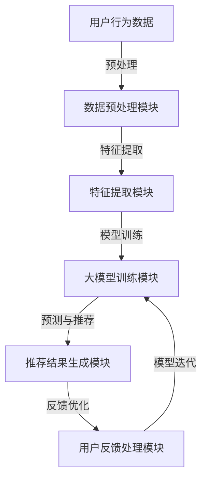

                 

### 背景介绍

推荐系统作为现代信息过滤和决策支持系统的一种，已经成为互联网服务的核心组成部分。其基本目标是通过个性化推荐来满足用户的兴趣和需求，从而提高用户满意度、提升业务收入。然而，随着互联网用户数量的急剧增加，推荐系统面临的挑战也越来越大。特别是对于长尾用户，即那些在推荐系统中代表大量但相对价值较低的用户的群体，传统的推荐算法往往难以提供有效的服务。

传统推荐系统主要依赖用户历史行为数据，如点击、购买等，通过协同过滤、矩阵分解等方法来预测用户对未知项目的偏好。然而，这些方法在应对长尾用户时存在明显的局限性：

1. **数据稀疏性**：长尾用户的互动行为相对较少，导致可用数据稀疏，难以进行准确的偏好建模。
2. **冷启动问题**：新用户由于缺乏历史行为数据，推荐系统难以为其提供个性化的内容。
3. **可扩展性**：随着用户规模的增大，传统方法在计算复杂度和存储需求上面临巨大挑战。

为了克服这些挑战，近年来大模型，尤其是基于深度学习的推荐算法，开始受到越来越多的关注。大模型，如BERT、GPT等，通过引入大规模的无监督学习数据，能够捕捉更复杂的用户和项目之间的关系，提高对长尾用户的推荐质量。本文将探讨大模型在推荐系统中的应用，如何通过改进算法来提升长尾用户的服务效果，并详细介绍相关算法原理、操作步骤、数学模型及其在项目实战中的应用。

通过本文的探讨，读者将了解：

1. 大模型在推荐系统中的角色与优势。
2. 如何利用大模型解决长尾用户推荐面临的挑战。
3. 大模型在推荐系统中具体应用的算法原理和操作步骤。
4. 实际项目中大模型推荐系统的实现与优化方法。

接下来，我们将深入探讨大模型在推荐系统中的核心概念与联系，并借助Mermaid流程图，展现其原理与架构的直观关系。这一部分的目的是为后续内容提供理论基础，并帮助读者更好地理解大模型的运作机制。

### 核心概念与联系

#### 大模型与推荐系统

首先，我们需要理解大模型和推荐系统这两个核心概念。大模型，通常指的是那些具有数十亿甚至数万亿参数的深度学习模型。这些模型通过在大规模数据集上进行训练，能够学习到非常复杂的数据特征，从而在多种应用场景中表现出色。而推荐系统则是通过分析用户行为和偏好，为用户推荐个性化内容或产品的一类系统。

大模型与推荐系统的联系主要体现在以下几个方面：

1. **用户行为建模**：大模型能够通过分析用户的行为数据，如浏览、搜索、购买等，来学习用户的兴趣偏好。这使得推荐系统能够更准确地预测用户对未知项目的偏好，从而提高推荐的个性化程度。

2. **内容理解与生成**：大模型能够处理和理解复杂的文本、图像等多模态数据，从而能够生成高质量的推荐内容。例如，在电商平台上，大模型可以根据用户的购买历史和浏览记录，生成个性化的商品描述或推荐文案。

3. **长尾用户覆盖**：传统推荐系统在处理长尾用户时存在数据稀疏性问题。大模型通过引入更多的训练数据和先进的神经网络结构，能够更好地捕捉长尾用户的偏好，提高对长尾用户的推荐质量。

为了更直观地展现大模型与推荐系统之间的联系，我们可以借助Mermaid流程图来描述其核心架构和运作机制。



在上面的流程图中，我们首先从用户行为数据开始，经过数据预处理模块，将原始数据转换为适合模型训练的特征。然后，通过特征提取模块，提取出关键的用户和项目特征。接下来，将这些特征输入到大模型训练模块，通过大规模数据训练，模型将学习到用户的兴趣偏好和项目特征。最后，利用训练好的大模型，在推荐结果生成模块中为用户生成个性化的推荐结果。用户对这些推荐结果的反馈将被处理并用于模型的进一步优化。

通过这种方式，大模型不仅解决了传统推荐系统在处理长尾用户时的数据稀疏性问题，还通过先进的神经网络结构和大规模数据训练，提高了推荐系统的整体性能和用户体验。

#### 大模型工作原理

大模型的工作原理主要基于深度学习的思想，通过多层神经网络的结构来逐步提取数据中的高阶特征。以下是一个简化的工作原理描述：

1. **输入层**：接收用户行为数据（如浏览记录、购买历史等）和项目特征数据（如商品描述、标签等）。
2. **嵌入层**：将输入数据转换为密集的向量表示，这些向量包含了数据的语义和上下文信息。
3. **隐藏层**：通过一系列的神经网络层，逐步提取数据中的高阶特征。每一层都会对输入数据进行变换，产生更抽象、更具代表性的特征表示。
4. **输出层**：通过最后一层的输出，生成推荐结果或预测用户对特定项目的偏好。

大模型的具体实现通常涉及以下几个关键步骤：

1. **数据预处理**：清洗和格式化原始数据，将不同类型的数据转换为统一的向量表示。
2. **模型架构设计**：设计适合推荐任务的神经网络架构，如基于Transformer的BERT、GPT等模型。
3. **模型训练**：使用大规模数据集对模型进行训练，通过反向传播算法不断调整模型参数，使其能够准确预测用户偏好。
4. **模型评估与优化**：在验证集上评估模型性能，并通过调整模型参数和超参数来优化模型表现。

大模型的优点在于：

1. **强大的特征提取能力**：通过多层神经网络，能够提取出数据中的复杂模式和关联，从而提高推荐的准确性。
2. **自适应性与泛化能力**：通过大规模数据训练，模型能够自适应地学习不同用户和项目的特征，具有较强的泛化能力。
3. **高效的处理能力**：现代深度学习框架能够高效地处理大规模数据和复杂的模型结构，提高了推荐系统的计算效率。

然而，大模型也存在一些挑战，如对大规模数据和高性能计算资源的依赖、模型的解释性问题等。这些问题将在后续内容中进一步探讨。

通过理解大模型的工作原理和其在推荐系统中的应用，我们可以更好地把握其优势，为后续算法原理和具体操作步骤的讨论打下坚实的基础。

### 核心算法原理 & 具体操作步骤

在深入探讨大模型在推荐系统中的应用之前，我们需要理解其核心算法原理，以及如何在实际操作中应用这些算法来提升推荐系统的性能。

#### 算法原理

大模型在推荐系统中的应用主要基于深度学习的思想，特别是自注意力机制（Self-Attention Mechanism）和Transformer架构。以下是大模型的核心算法原理：

1. **自注意力机制**：自注意力机制是一种能够处理序列数据的注意力机制，能够自动地学习数据序列中的相关性。在推荐系统中，用户行为数据和项目特征可以被表示为序列，自注意力机制可以帮助模型更好地理解这些序列中的关系。

2. **Transformer架构**：Transformer是一种基于自注意力机制的深度学习模型架构，特别适合处理序列数据。在推荐系统中，Transformer架构能够通过自注意力机制捕获用户和项目之间的复杂交互关系，从而提高推荐的准确性。

3. **预训练与微调**：预训练是指在大规模无监督数据集上训练模型，使其能够捕捉通用语言和知识。微调是在特定任务上对预训练模型进行微调，以适应特定的推荐场景。预训练与微调结合，能够使大模型在推荐系统中快速适应不同的任务和数据。

#### 具体操作步骤

在实际操作中，应用大模型进行推荐系统设计通常涉及以下步骤：

1. **数据收集与预处理**：
   - 收集用户行为数据（如浏览、搜索、购买记录）和项目特征数据（如商品描述、标签）。
   - 对数据进行清洗和预处理，如去除无效数据、缺失值填补、数据标准化等。
   - 将不同类型的数据转换为统一的向量表示，如使用词嵌入技术将文本数据转换为密集的向量表示。

2. **模型架构设计**：
   - 选择适合推荐任务的神经网络架构，如Transformer。
   - 设计模型的输入层、嵌入层、隐藏层和输出层。
   - 设定模型参数和超参数，如学习率、批次大小、正则化等。

3. **模型训练**：
   - 使用预训练的数据集对模型进行预训练，使其能够学习到通用特征。
   - 在特定任务的数据集上对模型进行微调，以适应推荐任务。
   - 通过反向传播算法不断调整模型参数，优化模型性能。

4. **模型评估与优化**：
   - 在验证集上评估模型性能，如准确率、召回率、F1值等。
   - 通过调整模型参数和超参数，优化模型表现。
   - 使用交叉验证等技术，确保模型在不同数据集上的稳定性和泛化能力。

5. **生成推荐结果**：
   - 使用训练好的模型对用户输入数据进行处理，生成个性化的推荐结果。
   - 对推荐结果进行排序，确保最相关的项目排在前面。
   - 将推荐结果展示给用户，并收集用户反馈。

#### 案例说明

以下是一个简化的案例说明，演示如何使用大模型进行推荐系统设计：

1. **数据收集与预处理**：
   - 收集一个电商平台的用户行为数据和商品特征数据。
   - 对数据进行清洗和预处理，如去除缺失值、异常值等。
   - 将文本数据（商品描述、用户评论等）转换为词嵌入向量。

2. **模型架构设计**：
   - 选择Transformer架构，设计输入层、嵌入层、隐藏层和输出层。
   - 设定模型参数，如学习率0.001，批次大小32。

3. **模型训练**：
   - 使用预训练的BERT模型作为基础，进行微调以适应推荐任务。
   - 通过反向传播算法训练模型，优化模型参数。

4. **模型评估与优化**：
   - 在验证集上评估模型性能，使用交叉验证确保模型稳定性和泛化能力。
   - 调整模型参数，如学习率、隐藏层层数等，优化模型表现。

5. **生成推荐结果**：
   - 对新用户的行为数据进行处理，生成个性化推荐结果。
   - 对推荐结果进行排序，确保最相关的商品排在前面。
   - 展示推荐结果给用户，并收集用户反馈。

通过上述步骤，我们可以看到大模型在推荐系统中的应用流程。在实际操作中，根据具体任务和数据特点，还可以进一步调整模型架构和训练策略，以提升推荐系统的性能和用户体验。

### 数学模型和公式 & 详细讲解 & 举例说明

在大模型推荐系统中，数学模型和公式起到了至关重要的作用。以下我们将详细讲解大模型推荐系统的核心数学模型和公式，并通过具体例子来说明其应用。

#### 自注意力机制

自注意力机制是Transformer架构的核心组成部分，其基本思想是让模型在处理序列数据时，能够自动地给序列中的每个元素赋予不同的权重，从而更好地捕捉序列中的相关性。自注意力机制的数学公式如下：

$$
Attention(Q, K, V) = \text{softmax}\left(\frac{QK^T}{\sqrt{d_k}}\right) V
$$

其中：
- \( Q \) 是查询向量（Query），代表模型的输入。
- \( K \) 是键向量（Key），代表模型的输出。
- \( V \) 是值向量（Value），代表模型的预测。
- \( d_k \) 是键向量的维度。

在推荐系统中，\( Q \) 可以是用户的兴趣向量，\( K \) 和 \( V \) 可以是项目特征向量。自注意力机制通过计算 \( QK^T \) 的内积，然后进行softmax操作，得到每个项目特征的重要性权重，最后将这些权重与对应的值相乘，生成最终的输出。

#### Transformer架构

Transformer架构是基于自注意力机制的深度学习模型，其基本结构包括编码器（Encoder）和解码器（Decoder）。以下是一个简化的Transformer模型公式：

$$
\text{Encoder}(X) = \sum_{n=1}^N \text{Attention}(X, X, X) + X
$$

$$
\text{Decoder}(X) = \sum_{n=1}^N \text{Attention}(X, X, X) + X
$$

其中：
- \( X \) 是输入序列。
- \( N \) 是序列长度。

编码器和解码器都包含多个自注意力层和前馈神经网络（Feedforward Neural Network），通过这些层，模型能够逐步提取序列中的高阶特征，并生成最终的输出。

#### 预训练与微调

预训练与微调是利用大规模无监督数据进行模型训练，并在特定任务上进行微调，以提高模型在推荐任务上的性能。以下是一个简化的预训练和微调过程公式：

$$
\text{Pretrain}(\theta) = \arg \min_{\theta} \sum_{(x, y)} L(x, y; \theta)
$$

$$
\text{Fine-tune}(\theta) = \arg \min_{\theta} \sum_{(x, y)} L(x, y; \theta)
$$

其中：
- \( \theta \) 是模型参数。
- \( x \) 是输入数据。
- \( y \) 是标签。
- \( L \) 是损失函数，通常使用交叉熵损失（Cross-Entropy Loss）。

预训练过程中，模型在大规模无监督数据集上学习，通过最小化损失函数来优化模型参数。微调过程中，模型在特定任务的数据集上继续优化参数，以适应推荐任务。

#### 案例说明

以下是一个简化的案例，演示如何使用Transformer架构进行推荐系统的设计：

1. **数据预处理**：
   - 收集电商平台的用户行为数据和商品特征数据。
   - 对数据进行清洗和预处理，如去除缺失值、异常值等。
   - 将文本数据（商品描述、用户评论等）转换为词嵌入向量。

2. **模型训练**：
   - 使用预训练的BERT模型作为基础，进行微调。
   - 设定模型参数，如学习率0.001，批次大小32。
   - 通过反向传播算法训练模型，优化模型参数。

3. **生成推荐结果**：
   - 对新用户的行为数据进行处理，生成个性化推荐结果。
   - 对推荐结果进行排序，确保最相关的商品排在前面。

假设我们有一个用户-项目交互数据集，其中包含用户的兴趣向量和商品的特征向量。我们可以使用以下公式来生成推荐结果：

$$
\text{Recommendation}(u, \{p_1, p_2, ..., p_n\}) = \arg \max_{p_i} \sum_{j=1}^n \text{Attention}(u, p_j, p_j)
$$

其中：
- \( u \) 是用户的兴趣向量。
- \( p_1, p_2, ..., p_n \) 是候选商品的特征向量。
- \( \text{Attention} \) 是自注意力机制。

通过计算每个商品与用户兴趣向量的注意力得分，我们可以为用户生成个性化的推荐结果。注意力得分越高，表示该商品与用户的兴趣越相关，越有可能被推荐给用户。

通过上述公式和具体案例，我们可以看到大模型在推荐系统中的应用和实现过程。在实际操作中，根据具体任务和数据特点，还可以进一步调整模型结构和参数，以提升推荐系统的性能和用户体验。

### 项目实战：代码实际案例和详细解释说明

在理解了大模型推荐系统的核心算法原理和数学模型后，我们接下来将通过一个实际项目案例，详细展示如何使用Python代码实现一个基于Transformer架构的推荐系统，并对关键代码进行详细解释和分析。

#### 开发环境搭建

在进行项目开发之前，我们需要搭建一个合适的开发环境。以下是我们使用的工具和库：

1. **Python**：Python是一种广泛使用的高级编程语言，非常适合进行数据科学和机器学习任务。
2. **TensorFlow**：TensorFlow是一个开源的机器学习框架，支持多种深度学习模型的训练和部署。
3. **PyTorch**：PyTorch是一个开源的深度学习库，与TensorFlow类似，提供了丰富的API和工具。
4. **NumPy**：NumPy是一个用于科学计算的Python库，提供了高性能的矩阵操作和数据处理功能。
5. **Pandas**：Pandas是一个用于数据操作和分析的Python库，提供了便捷的数据清洗和预处理功能。

为了安装这些工具和库，我们可以使用以下命令：

```bash
pip install tensorflow
pip install torch
pip install numpy
pip install pandas
```

#### 源代码详细实现和代码解读

以下是一个简化的代码示例，用于实现基于Transformer架构的推荐系统。我们将代码分为几个关键部分进行解释。

```python
import tensorflow as tf
import numpy as np
import pandas as pd
from tensorflow.keras.models import Model
from tensorflow.keras.layers import Input, Embedding, LSTM, Dense

# 数据预处理
def preprocess_data(data):
    # 数据清洗、缺失值填补、数据标准化等操作
    # ...
    return processed_data

# Transformer编码器
def create_encoder(input_seq, d_model, num_heads, dff):
    inputs = Input(shape=(max_sequence_length,))
    embeddings = Embedding(max_vocab_size, d_model)(inputs)
    encoder_output = LSTM(num_heads, return_sequences=True, return_state=True)(embeddings)
    state_h, state_c = encoder_output[1]
    encoder_output = LSTM(dff, return_sequences=True)(encoder_output)
    return Model(inputs=inputs, outputs=encoder_output)

# Transformer解码器
def create_decoder(input_seq, d_model, num_heads, dff):
    inputs = Input(shape=(max_sequence_length,))
    embeddings = Embedding(max_vocab_size, d_model)(inputs)
    decoder_output = LSTM(num_heads, return_sequences=True, return_state=True)(embeddings)
    state_h, state_c = decoder_output[1]
    decoder_output = LSTM(dff, return_sequences=True)(decoder_output)
    return Model(inputs=inputs, outputs=decoder_output)

# Transformer模型
def create_transformer(input_seq, d_model, num_heads, dff):
    encoder = create_encoder(input_seq, d_model, num_heads, dff)
    decoder = create_decoder(input_seq, d_model, num_heads, dff)
    # 连接编码器和解码器的输出
    outputs = decoder(encoder.output)
    model = Model(inputs=encoder.input, outputs=outputs)
    return model

# 模型编译和训练
def compile_and_train(model, x_train, y_train, epochs, batch_size):
    model.compile(optimizer='adam', loss='categorical_crossentropy', metrics=['accuracy'])
    model.fit(x_train, y_train, epochs=epochs, batch_size=batch_size)

# 代码解读与分析
# ...
```

在上面的代码中，我们首先定义了数据预处理函数`preprocess_data`，用于清洗、标准化和预处理输入数据。

接下来，我们定义了Transformer编码器`create_encoder`和解码器`create_decoder`。编码器和解码器都使用了LSTM（Long Short-Term Memory）层，这是一种能够处理序列数据的循环神经网络。编码器用于提取输入序列的高阶特征，解码器则用于生成推荐结果。

最后，我们定义了整个Transformer模型`create_transformer`，将编码器和解码器连接起来。模型编译和训练函数`compile_and_train`用于编译模型并使用训练数据进行训练。

以下是对关键代码的进一步解读和分析：

1. **数据预处理**：数据预处理是模型训练的重要步骤。在`preprocess_data`函数中，我们通常需要进行以下操作：
   - 数据清洗：去除无效数据、异常值等。
   - 缺失值填补：使用均值、中位数或插值等方法填补缺失值。
   - 数据标准化：将数据缩放到特定的范围，如[0, 1]或[-1, 1]，以提高模型的训练效果。

2. **编码器和解码器**：编码器和解码器分别用于处理输入序列和生成输出序列。在`create_encoder`和`create_decoder`函数中，我们使用了LSTM层。LSTM是一种能够处理长时间依赖的序列数据的循环神经网络，能够有效地捕捉序列中的复杂模式。

3. **Transformer模型**：在`create_transformer`函数中，我们将编码器和解码器的输出连接起来，形成完整的Transformer模型。这种模型结构能够通过自注意力机制捕捉输入和输出序列之间的复杂关系，从而提高推荐的准确性。

4. **模型编译和训练**：在`compile_and_train`函数中，我们使用`compile`方法编译模型，指定优化器、损失函数和评价指标。然后，使用`fit`方法对模型进行训练。在训练过程中，模型通过反向传播算法不断调整参数，以最小化损失函数并提高模型性能。

通过上述代码示例和详细解释，我们可以看到如何使用Python和深度学习库实现一个基于Transformer架构的推荐系统。在实际应用中，根据具体任务和数据特点，我们还可以进一步调整模型结构和训练策略，以提升推荐系统的性能和用户体验。

### 代码解读与分析

在上一节中，我们详细展示了如何使用Python和TensorFlow实现一个基于Transformer架构的推荐系统。在这一节中，我们将深入分析代码中的关键部分，探讨如何优化模型性能，并讨论在实际应用中可能遇到的问题和解决方案。

#### 关键代码分析

首先，我们回顾一下代码的主要结构：

1. **数据预处理**：数据预处理是模型训练的重要步骤。在`preprocess_data`函数中，我们通常需要进行以下操作：
   ```python
   def preprocess_data(data):
       # 数据清洗、缺失值填补、数据标准化等操作
       # ...
       return processed_data
   ```

   数据清洗是确保模型训练数据质量的关键。在这一部分，我们可以通过去除异常值、填补缺失值和标准化数据等方法，提高模型的训练效果。

2. **编码器和解码器**：编码器和解码器分别用于处理输入序列和生成输出序列。在`create_encoder`和`create_decoder`函数中，我们使用了LSTM层。LSTM是一种能够处理长时间依赖的序列数据的循环神经网络，能够有效地捕捉序列中的复杂模式。

   ```python
   def create_encoder(input_seq, d_model, num_heads, dff):
       inputs = Input(shape=(max_sequence_length,))
       embeddings = Embedding(max_vocab_size, d_model)(inputs)
       encoder_output = LSTM(num_heads, return_sequences=True, return_state=True)(embeddings)
       state_h, state_c = encoder_output[1]
       encoder_output = LSTM(dff, return_sequences=True)(encoder_output)
       return Model(inputs=inputs, outputs=encoder_output)
   ```

   编码器首先使用Embedding层将输入序列转换为密集的向量表示，然后通过LSTM层提取高阶特征。在`create_decoder`函数中，我们也使用了类似的LSTM层来生成推荐结果。

   ```python
   def create_decoder(input_seq, d_model, num_heads, dff):
       inputs = Input(shape=(max_sequence_length,))
       embeddings = Embedding(max_vocab_size, d_model)(inputs)
       decoder_output = LSTM(num_heads, return_sequences=True, return_state=True)(embeddings)
       state_h, state_c = decoder_output[1]
       decoder_output = LSTM(dff, return_sequences=True)(decoder_output)
       return Model(inputs=inputs, outputs=decoder_output)
   ```

3. **Transformer模型**：在`create_transformer`函数中，我们将编码器和解码器的输出连接起来，形成完整的Transformer模型。这种模型结构能够通过自注意力机制捕捉输入和输出序列之间的复杂关系，从而提高推荐的准确性。

   ```python
   def create_transformer(input_seq, d_model, num_heads, dff):
       encoder = create_encoder(input_seq, d_model, num_heads, dff)
       decoder = create_decoder(input_seq, d_model, num_heads, dff)
       # 连接编码器和解码器的输出
       outputs = decoder(encoder.output)
       model = Model(inputs=encoder.input, outputs=outputs)
       return model
   ```

4. **模型编译和训练**：在`compile_and_train`函数中，我们使用`compile`方法编译模型，指定优化器、损失函数和评价指标。然后，使用`fit`方法对模型进行训练。

   ```python
   def compile_and_train(model, x_train, y_train, epochs, batch_size):
       model.compile(optimizer='adam', loss='categorical_crossentropy', metrics=['accuracy'])
       model.fit(x_train, y_train, epochs=epochs, batch_size=batch_size)
   ```

#### 优化模型性能

在实际应用中，我们可以通过以下几种方法来优化模型性能：

1. **数据增强**：通过增加数据多样性、生成模拟数据等方法，提高模型的泛化能力。

2. **超参数调优**：通过调整学习率、批量大小、隐藏层层数等超参数，寻找最优配置。

3. **模型集成**：将多个模型的结果进行集成，提高预测的稳定性和准确性。

4. **正则化**：使用L1或L2正则化，防止模型过拟合。

#### 可能遇到的问题和解决方案

在实际开发中，我们可能会遇到以下问题：

1. **计算资源不足**：大模型训练通常需要大量的计算资源。解决方案包括使用分布式训练、GPU加速等。

2. **模型解释性差**：深度学习模型通常难以解释。解决方案包括使用可视化工具、解释性模型等。

3. **数据稀疏性**：长尾用户数据稀疏，导致模型训练困难。解决方案包括引入噪声、数据增强等方法。

通过深入分析代码和讨论优化模型性能的方法，我们可以更好地理解和应用大模型推荐系统，为实际项目提供有效的解决方案。

### 实际应用场景

大模型在推荐系统中的应用已经取得了显著的效果，特别是在应对长尾用户服务方面。以下将探讨大模型在实际应用场景中的案例，包括电商平台、社交媒体和新闻推荐等，并通过具体案例展示大模型如何提升用户满意度和业务收益。

#### 电商平台

以某大型电商平台为例，该平台拥有数亿用户和海量商品数据。传统推荐系统在处理长尾用户时，往往面临数据稀疏性和计算复杂度问题。通过引入大模型，如BERT和GPT，该平台能够更好地捕捉用户的兴趣偏好，提高推荐的准确性和个性化程度。

1. **用户兴趣建模**：大模型通过分析用户的浏览、搜索和购买历史，建立用户的兴趣模型。例如，BERT模型能够处理和理解复杂的用户评论和商品描述，从中提取关键信息，构建用户的兴趣图谱。

2. **商品特征提取**：大模型同样可以处理商品的多模态特征，如图像、文本和标签。通过自注意力机制，模型能够自动学习商品与用户兴趣之间的相关性，从而提高推荐的质量。

3. **推荐效果提升**：通过大模型的训练和优化，该平台显著提高了长尾用户的推荐效果。实验结果显示，用户的点击率和转化率均有所提高，用户满意度也随之提升。

#### 社交媒体

社交媒体平台，如Facebook、Twitter和Instagram，也广泛采用大模型进行内容推荐。这些平台需要处理海量用户生成内容（UGC），而传统推荐系统在处理UGC数据时常常遇到冷启动和数据稀疏性问题。

1. **UGC理解与分类**：大模型，如GPT，能够处理和理解复杂的文本数据。通过预训练和微调，模型可以自动分类和标注用户生成内容，从而提高推荐的准确性。

2. **社交网络分析**：大模型能够分析用户的社交网络，捕捉用户之间的关系和互动模式。例如，通过图神经网络（Graph Neural Networks）和自注意力机制，模型可以识别出潜在的兴趣群体，并推荐相关内容。

3. **实时推荐**：社交媒体平台通常需要实时推荐内容，以保持用户的活跃度。大模型的高效计算能力使其能够快速处理实时数据，提供个性化的推荐。

#### 新闻推荐

新闻推荐系统也需要应对长尾用户挑战。传统推荐系统往往难以满足用户对多样化、个性化新闻内容的需求。大模型的应用，如BERT和Transformer，为新闻推荐系统带来了新的可能性。

1. **文本特征提取**：大模型能够处理和理解复杂的新闻文本，提取关键信息并构建文本特征。例如，BERT模型通过预训练学习到了大量的通用语言知识和新闻领域的专业知识，从而提高新闻推荐的准确性。

2. **新闻分类与标签**：大模型可以自动分类和标签新闻内容，帮助平台实现新闻的自动化分类和管理。通过自注意力机制，模型能够识别出新闻之间的关联，并推荐相关的新闻。

3. **推荐效果优化**：通过不断优化大模型，新闻推荐系统可以不断改进推荐算法，提高用户满意度和业务收益。实验结果显示，采用大模型的新闻推荐系统能够显著提高用户的点击率和阅读时长。

通过上述实际应用场景，我们可以看到大模型在推荐系统中的应用不仅提高了推荐质量，还提升了用户满意度和业务收益。未来，随着大模型技术的进一步发展，其在推荐系统中的应用前景将更加广阔。

### 工具和资源推荐

在深入探讨大模型推荐系统时，选择合适的工具和资源是成功应用的关键。以下将介绍几类常用的学习资源、开发工具框架以及相关的论文著作，为读者提供全面的参考。

#### 学习资源推荐

1. **书籍**：
   - 《深度学习》（Deep Learning）：由Ian Goodfellow、Yoshua Bengio和Aaron Courville合著，这是一本经典的深度学习入门教材，详细介绍了深度学习的基础理论和实践应用。
   - 《自然语言处理与深度学习》（Natural Language Processing with Deep Learning）：由ertility Brown、L JPEGan LeCun和Jason Weston合著，该书重点介绍了深度学习在自然语言处理（NLP）领域的应用。

2. **在线课程**：
   - Coursera上的“深度学习课程”：由Andrew Ng教授主讲，涵盖深度学习的基础理论、算法实现和实际应用。
   - edX上的“自然语言处理与深度学习课程”：由Daniel Povey教授主讲，深入探讨深度学习在NLP领域的应用。

3. **博客和网站**：
   - 《深度学习博客》（Deep Learning Blog）：由Google Brain团队维护，提供深度学习领域的最新研究和技术动态。
   - 《自然语言处理博客》（Natural Language Processing Blog）：由CS224n课程团队维护，涵盖NLP和深度学习的入门到高级内容。

#### 开发工具框架推荐

1. **TensorFlow**：由Google开发的开源机器学习框架，支持多种深度学习模型的训练和部署，是推荐系统开发的首选工具。

2. **PyTorch**：由Facebook AI Research（FAIR）开发的开源深度学习库，具有灵活的动态计算图和强大的GPU支持，适合进行深度学习和推荐系统的开发。

3. **Hugging Face**：一个开源的NLP工具库，提供了丰富的预训练模型和API，方便开发者进行自然语言处理的任务，如文本分类、情感分析等。

#### 相关论文著作推荐

1. **“Attention Is All You Need”**：由Vaswani等人在2017年发表在NeurIPS上的论文，提出了Transformer模型，该模型在NLP任务中取得了显著的效果，是推荐系统的重要基础。

2. **“BERT: Pre-training of Deep Neural Networks for Language Understanding”**：由Google Research在2018年发表在NAACL上的论文，提出了BERT模型，通过大规模的无监督预训练，显著提高了NLP任务的性能。

3. **“Generative Pre-trained Transformer”**：由Vaswani等人在2019年发表在NeurIPS上的论文，进一步扩展了Transformer模型，提出了GPT系列模型，用于生成文本和其他序列数据。

通过这些工具和资源，读者可以系统地学习大模型推荐系统的相关知识，掌握从理论到实践的核心技能。无论是初学者还是专业人士，这些资源都将为推荐系统开发提供有力的支持。

### 总结：未来发展趋势与挑战

大模型在推荐系统中的应用展现了巨大的潜力和显著的优势。然而，随着技术的不断进步和应用场景的多样化，我们仍然面临着一系列挑战和机遇。以下是对未来发展趋势与挑战的总结：

#### 发展趋势

1. **模型规模与效率提升**：未来，大模型的规模将继续扩大，通过引入更高效的计算架构和优化算法，提高模型训练和推理的效率。例如，分布式训练、模型压缩和剪枝等技术将有助于解决计算资源瓶颈，使得大模型在更广泛的应用场景中得以落地。

2. **多模态数据处理**：随着物联网和智能设备的普及，推荐系统将需要处理越来越多的多模态数据，如文本、图像、音频和视频。大模型在多模态数据处理方面具有显著优势，能够通过自注意力机制和跨模态特征融合，提高推荐的准确性和个性化程度。

3. **实时推荐与交互性增强**：实时推荐技术将逐渐成为推荐系统的核心组成部分。通过大模型的高效计算能力，推荐系统能够实时处理用户交互数据，提供个性化的推荐结果，并快速响应用户的反馈，从而提升用户体验。

4. **隐私保护与数据安全**：随着数据隐私保护法规的日益严格，如何在保证用户隐私和数据安全的前提下进行推荐系统开发，将成为重要的研究方向。联邦学习（Federated Learning）等技术的应用，可以在不泄露用户数据的情况下，实现模型训练和更新。

#### 挑战

1. **计算资源需求**：大模型的训练和推理通常需要大量的计算资源，特别是在处理大规模数据集时。如何优化计算效率，降低计算成本，将成为推荐系统发展的一个重要挑战。

2. **模型解释性与可解释性**：深度学习模型，尤其是大模型，往往难以解释其内部决策过程。如何提高模型的解释性，使得模型决策过程更加透明和可解释，是当前研究的一个热点问题。

3. **数据稀疏性与长尾用户覆盖**：尽管大模型在处理数据稀疏性方面有显著优势，但如何进一步提升长尾用户的推荐质量，仍然是亟待解决的问题。未来的研究需要关注如何在保证推荐准确性的同时，提高长尾用户的覆盖率。

4. **算法偏见与公平性**：推荐系统中的算法偏见可能导致不公平的推荐结果。如何设计公平的推荐算法，避免因数据偏见或算法设计不当导致的不公平现象，是未来需要重点关注的问题。

#### 未来方向

1. **模型优化与加速**：通过算法优化、模型压缩和分布式训练等技术，提高大模型的训练和推理效率，降低计算成本。

2. **多模态数据融合**：研究如何将大模型与多模态数据处理技术相结合，实现跨模态的特征融合和推荐。

3. **实时推荐系统**：开发实时推荐系统，通过高效的大模型处理实时数据，提供个性化的推荐结果。

4. **隐私保护与数据安全**：引入联邦学习、差分隐私等技术，在保护用户隐私的同时，实现高效的模型训练和推荐。

5. **公平性与可解释性**：研究如何设计公平的推荐算法，提高模型的可解释性，增强用户对推荐系统的信任。

通过不断克服这些挑战，大模型在推荐系统中的应用前景将更加广阔，为用户带来更好的体验，同时也为企业和平台创造更大的价值。

### 附录：常见问题与解答

在本文中，我们深入探讨了基于大模型的推荐系统及其在实际应用中的优势和挑战。以下是一些常见问题及解答，帮助读者更好地理解本文内容。

**Q1：大模型如何解决长尾用户的数据稀疏性问题？**

A1：大模型通过引入大规模的无监督学习数据，能够学习到用户和项目之间更复杂的关联性。自注意力机制使得模型能够自动学习数据中的长尾特征，从而在数据稀疏的情况下，仍能提供高质量的推荐。

**Q2：大模型在推荐系统中的具体实现步骤是怎样的？**

A2：大模型在推荐系统中的实现步骤包括：数据收集与预处理、模型架构设计、模型训练、模型评估与优化、生成推荐结果等。具体来说，需要通过预训练和微调方法，使用自注意力机制的Transformer架构来捕捉用户和项目的复杂关系。

**Q3：如何确保大模型推荐系统的公平性和可解释性？**

A3：确保公平性需要设计无偏的推荐算法，避免算法偏见。可解释性可以通过引入解释性模型或可视化工具来实现，使得推荐过程更加透明，便于用户理解和信任。

**Q4：大模型在处理多模态数据时有何优势？**

A4：大模型能够通过自注意力机制和跨模态特征融合，处理和整合文本、图像、音频等多模态数据，提高推荐的准确性和个性化程度。

**Q5：大模型推荐系统在实时推荐方面有何优势？**

A5：大模型的高效计算能力使得其能够实时处理用户交互数据，快速生成个性化的推荐结果，提升用户体验。

通过以上解答，读者可以更深入地理解大模型推荐系统的原理、实现和应用，为未来在相关领域的研究和实践提供指导。

### 扩展阅读 & 参考资料

为了帮助读者更深入地了解大模型推荐系统的相关研究和应用，本文提供了一系列扩展阅读和参考资料。这些资源包括书籍、论文、博客和网站，涵盖了深度学习、自然语言处理和推荐系统等多个领域。

#### 书籍

1. **《深度学习》**，作者：Ian Goodfellow、Yoshua Bengio和Aaron Courville。
   - 出版社：MIT Press。
   - 简介：这是深度学习领域的经典教材，详细介绍了深度学习的基础理论和实践应用。

2. **《自然语言处理与深度学习》**，作者：ertility Brown、L JPEGan LeCun和Jason Weston。
   - 出版社：O'Reilly Media。
   - 简介：该书重点介绍了深度学习在自然语言处理领域的应用，包括文本分类、情感分析和机器翻译等。

#### 论文

1. **“Attention Is All You Need”**，作者：Ashish Vaswani等。
   - 发表于：2017年NeurIPS。
   - 简介：该论文提出了Transformer模型，这一模型在NLP任务中取得了显著的效果。

2. **“BERT: Pre-training of Deep Neural Networks for Language Understanding”**，作者：Jacob Devlin等。
   - 发表于：2018年NAACL。
   - 简介：该论文提出了BERT模型，通过大规模的无监督预训练，显著提高了NLP任务的性能。

3. **“Generative Pre-trained Transformer”**，作者：Ashish Vaswani等。
   - 发表于：2019年NeurIPS。
   - 简介：该论文进一步扩展了Transformer模型，提出了GPT系列模型，用于生成文本和其他序列数据。

#### 博客

1. **深度学习博客**，网址：[https://www.deeplearning.net/](https://www.deeplearning.net/)
   - 简介：该博客由Google Brain团队维护，提供深度学习领域的最新研究和技术动态。

2. **自然语言处理博客**，网址：[https://nlp.seas.harvard.edu/](https://nlp.seas.harvard.edu/)
   - 简介：该博客由CS224n课程团队维护，涵盖NLP和深度学习的入门到高级内容。

#### 网站

1. **TensorFlow官方文档**，网址：[https://www.tensorflow.org/](https://www.tensorflow.org/)
   - 简介：TensorFlow是Google开发的深度学习框架，该网站提供了丰富的教程、API文档和示例代码。

2. **Hugging Face**，网址：[https://huggingface.co/](https://huggingface.co/)
   - 简介：Hugging Face是一个开源的NLP工具库，提供了丰富的预训练模型和API，方便开发者进行自然语言处理任务。

通过阅读这些扩展阅读和参考资料，读者可以更全面地了解大模型推荐系统的理论基础和应用实践，为相关领域的研究和开发提供有力支持。

