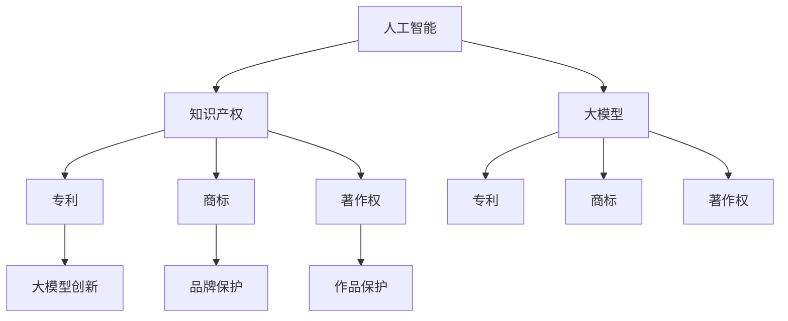

                 

### 背景介绍

#### 什么是大模型？

大模型（Large Models）是指那些具有巨大参数量和复杂结构的机器学习模型，如深度神经网络、Transformer等。这些模型能够在各种任务中表现出卓越的性能，从自然语言处理、图像识别到生成对抗网络（GANs），都有着广泛的应用。

随着深度学习技术的不断进步，大模型的规模也在不断增长。例如，GPT-3拥有超过1750亿个参数，而BERT模型的大小也达到数百万个参数。这种规模的增加，不仅提升了模型的性能，也带来了前所未有的计算资源需求。

#### 大模型的发展历程

大模型的发展历程可以追溯到20世纪80年代，当时神经网络开始应用于各种任务。然而，由于计算能力和数据集的限制，早期的神经网络模型规模较小，性能有限。

随着计算能力的提升和大数据的普及，深度学习技术取得了突破性的进展。特别是在2012年，AlexNet在ImageNet竞赛中取得了惊人的成绩，引发了深度学习的热潮。这一时期，神经网络的规模开始逐渐扩大，参数数量从数百万到数千万。

2017年，Transformer模型的提出，将深度学习推向了新的高度。Transformer模型的核心思想是自注意力机制，这使得模型能够处理任意长度的序列数据。这一创新推动了大规模模型的快速发展，如BERT、GPT等。

#### 大模型的重要性

大模型在许多领域都发挥了重要作用，尤其是在自然语言处理和计算机视觉领域。例如，GPT-3能够生成高质量的自然语言文本，BERT在多种自然语言处理任务中取得了SOTA（State-of-the-Art）性能。这些模型的出现，使得人工智能的应用更加广泛，为我们带来了许多便利。

#### 本文的研究目标

本文旨在探讨大模型对知识产权（Intellectual Property, IP）的冲击和挑战。随着大模型的发展，传统的知识产权保护体系面临了新的挑战。本文将分析大模型如何影响知识产权的创造、保护和应用，并提出相应的解决方案。

## 2. 核心概念与联系

为了深入探讨大模型对知识产权的影响，我们需要先了解一些核心概念和它们之间的联系。以下是一些关键概念：

### 2.1 人工智能与知识产权

人工智能（AI）是一种通过模拟人类智能行为来实现特定任务的计算机技术。随着AI技术的发展，AI创造的内容、解决方案和算法等，逐渐成为知识产权的重要组成部分。

### 2.2 知识产权的概念

知识产权是指人类智力劳动创造的成果所享有的权利，包括专利、商标、著作权、商业秘密等。这些权利为知识产权所有者提供了独占性权利，以保护其智力成果不被他人侵犯。

### 2.3 大模型与知识产权

大模型作为一种人工智能技术，其创造的内容、解决方案和算法等，同样需要得到知识产权保护。然而，大模型的特点，如巨大的参数量、复杂的结构以及高度依赖训练数据等，使得传统的知识产权保护体系面临了新的挑战。

### 2.4 数据与知识产权

在AI领域中，数据是训练模型的重要资源。然而，数据本身往往包含着知识产权问题，如数据来源、数据使用权限等。在大模型时代，如何处理和利用数据，成为知识产权保护的一个重要方面。

### 2.5 人工智能与知识产权保护体系

为了应对AI技术带来的知识产权挑战，各国政府和国际组织开始加强对人工智能知识产权保护的研究。例如，美国、欧盟等国家和地区已经出台了一系列法律法规，以保护人工智能领域的知识产权。

### 2.6 Mermaid流程图

以下是一个简化的Mermaid流程图，展示了人工智能、知识产权以及大模型之间的联系：



在这个流程图中，人工智能作为基础技术，其创新成果需要通过知识产权进行保护。大模型作为人工智能的一种形式，其创新成果同样需要得到知识产权的保障。而知识产权的不同形式，如专利、商标和著作权等，分别对应着不同的保护领域。

通过这个Mermaid流程图，我们可以更直观地理解人工智能、知识产权以及大模型之间的联系，为后续的分析和讨论提供基础。

## 3. 核心算法原理 & 具体操作步骤

在探讨大模型对知识产权的冲击和挑战时，我们首先需要了解大模型的核心算法原理以及其具体操作步骤。以下将详细介绍大模型的算法原理，并逐步说明其操作步骤。

### 3.1 大模型的基本结构

大模型通常是指具有大量参数的神经网络模型，如深度神经网络（DNN）、Transformer等。这些模型的核心结构是多层全连接神经网络，其中每个神经元都与上一层和下一层中的所有神经元相连。

#### 3.1.1 深度神经网络（DNN）

深度神经网络由多个隐藏层组成，每一层对输入数据进行特征提取和变换。网络的深度（即层数）越大，模型能够捕捉到的特征层次就越多，从而提高了模型的性能。

#### 3.1.2 Transformer模型

Transformer模型是近年来在自然语言处理领域取得突破的一种新型架构，其核心思想是自注意力机制（Self-Attention）。Transformer模型由编码器（Encoder）和解码器（Decoder）组成，能够处理任意长度的序列数据。

### 3.2 大模型的训练过程

大模型的训练过程主要包括以下几个步骤：

#### 3.2.1 数据预处理

在训练之前，需要对数据进行预处理，包括数据清洗、数据标准化和数据增强等。这些预处理步骤有助于提高模型的训练效果。

#### 3.2.2 模型初始化

初始化模型的参数是训练过程中的关键一步。常用的初始化方法包括随机初始化、高斯初始化和Xavier初始化等。

#### 3.2.3 前向传播

在前向传播过程中，模型将输入数据通过多层网络传递，最终得到输出结果。通过计算输出结果与真实标签之间的误差，可以计算模型的损失函数。

#### 3.2.4 反向传播

反向传播是深度学习训练的核心步骤，通过计算梯度信息，模型可以更新参数，以减少损失函数的值。反向传播的过程可以分为以下几个阶段：

1. **计算损失函数的梯度**：计算损失函数关于模型参数的梯度。
2. **参数更新**：使用梯度信息对模型参数进行更新，通常采用梯度下降（Gradient Descent）或其变种。
3. **多次迭代**：重复上述步骤，直到模型收敛或达到预定的训练轮数。

#### 3.2.5 模型评估

在训练过程中，需要定期对模型进行评估，以检查模型的性能。常用的评估指标包括准确率（Accuracy）、精确率（Precision）、召回率（Recall）和F1分数（F1 Score）等。

### 3.3 大模型的推理过程

在模型训练完成后，可以使用训练好的模型进行推理，以预测新的输入数据。推理过程主要包括以下步骤：

#### 3.3.1 输入数据预处理

与训练过程类似，需要对输入数据进行预处理，以确保模型能够正确处理。

#### 3.3.2 前向传播

将预处理后的输入数据通过训练好的模型进行前向传播，得到输出结果。

#### 3.3.3 结果解释

根据输出结果，对输入数据进行解释和预测。

通过以上步骤，我们可以了解到大模型的基本算法原理和具体操作过程。这些原理和过程不仅为我们提供了构建和训练大模型的方法，也为后续讨论大模型对知识产权的影响提供了基础。

## 4. 数学模型和公式 & 详细讲解 & 举例说明

在深入探讨大模型对知识产权的影响时，我们不可避免地需要涉及到一些数学模型和公式。以下将详细介绍大模型中常用的数学模型和公式，并进行详细讲解和举例说明。

### 4.1 损失函数

损失函数是评估模型性能的重要指标，其目的是最小化模型预测结果与真实结果之间的差距。在深度学习中，常用的损失函数包括均方误差（Mean Squared Error, MSE）、交叉熵损失（Cross-Entropy Loss）等。

#### 4.1.1 均方误差（MSE）

均方误差是衡量预测值与真实值之间差异的常用指标，其公式如下：

$$
MSE = \frac{1}{n}\sum_{i=1}^{n}(y_i - \hat{y}_i)^2
$$

其中，$y_i$为真实值，$\hat{y}_i$为预测值，$n$为样本数量。

#### 4.1.2 交叉熵损失（Cross-Entropy Loss）

交叉熵损失常用于分类问题，其公式如下：

$$
Cross-Entropy Loss = -\sum_{i=1}^{n}y_i\log(\hat{y}_i)
$$

其中，$y_i$为真实标签，$\hat{y}_i$为模型预测的概率分布。

### 4.2 梯度下降算法

梯度下降算法是训练深度学习模型的主要方法之一，其核心思想是利用损失函数关于模型参数的梯度，不断更新模型参数，以减少损失函数的值。

#### 4.2.1 梯度计算

假设损失函数为$L(\theta)$，其中$\theta$为模型参数。则损失函数关于$\theta$的梯度可以表示为：

$$
\nabla_{\theta}L(\theta) = \frac{\partial L(\theta)}{\partial \theta}
$$

#### 4.2.2 参数更新

在梯度下降算法中，参数更新公式如下：

$$
\theta_{t+1} = \theta_t - \alpha \nabla_{\theta}L(\theta_t)
$$

其中，$\alpha$为学习率，控制参数更新的步长。

#### 4.2.3 梯度下降算法举例

假设我们使用均方误差作为损失函数，学习率为0.01。给定初始参数$\theta_0 = [1, 2, 3]$，通过梯度下降算法进行一次参数更新：

1. 计算损失函数的梯度：

$$
\nabla_{\theta}MSE = 2(y - \hat{y})
$$

2. 计算参数更新：

$$
\theta_1 = \theta_0 - 0.01 \cdot \nabla_{\theta}MSE
$$

3. 假设当前样本的预测值为$\hat{y} = [0.5, 0.6, 0.7]$，真实值为$y = [1, 0, 1]$，则损失函数的梯度为：

$$
\nabla_{\theta}MSE = 2(1 - 0.5, 0 - 0.6, 1 - 0.7) = [1.0, -1.2, 0.4]
$$

4. 进行参数更新：

$$
\theta_1 = [1, 2, 3] - 0.01 \cdot [1.0, -1.2, 0.4] = [0.99, 1.92, 2.96]
$$

通过以上步骤，我们可以看到梯度下降算法如何通过计算损失函数的梯度，更新模型参数，从而最小化损失函数的值。

### 4.3 正则化技术

在深度学习中，正则化技术（Regularization）是一种常用的方法，用于防止模型过拟合。常见的正则化技术包括L1正则化、L2正则化等。

#### 4.3.1 L1正则化

L1正则化通过在损失函数中添加L1范数项，来控制模型参数的稀疏性。其公式如下：

$$
L_{L1} = \lambda \sum_{i=1}^{n}|\theta_i|
$$

其中，$\lambda$为正则化参数。

#### 4.3.2 L2正则化

L2正则化通过在损失函数中添加L2范数项，来控制模型参数的平滑性。其公式如下：

$$
L_{L2} = \lambda \sum_{i=1}^{n}\theta_i^2
$$

#### 4.3.3 正则化举例

假设我们使用L2正则化，正则化参数为0.01。给定初始参数$\theta_0 = [1, 2, 3]$，通过L2正则化进行一次参数更新：

1. 计算L2正则化项：

$$
L_{L2} = 0.01 \cdot (1^2 + 2^2 + 3^2) = 0.1
$$

2. 计算损失函数的梯度：

$$
\nabla_{\theta}MSE = 2(y - \hat{y})
$$

3. 计算参数更新：

$$
\theta_1 = \theta_0 - \alpha \nabla_{\theta}MSE - \alpha \lambda \nabla_{\theta}L_{L2}
$$

4. 假设当前样本的预测值为$\hat{y} = [0.5, 0.6, 0.7]$，真实值为$y = [1, 0, 1]$，则损失函数的梯度为：

$$
\nabla_{\theta}MSE = 2(1 - 0.5, 0 - 0.6, 1 - 0.7) = [1.0, -1.2, 0.4]
$$

5. 进行参数更新：

$$
\theta_1 = [1, 2, 3] - 0.01 \cdot [1.0, -1.2, 0.4] - 0.01 \cdot 0.1 \cdot [2.0, 4.0, 6.0] = [0.97, 1.86, 2.94]
$$

通过以上步骤，我们可以看到L2正则化如何通过在损失函数中添加正则化项，控制模型参数的更新，从而提高模型的泛化能力。

通过以上对数学模型和公式的详细讲解和举例说明，我们可以更好地理解大模型的核心算法原理，并为后续分析大模型对知识产权的影响提供基础。

## 5. 项目实战：代码实际案例和详细解释说明

为了更好地理解大模型对知识产权的影响，我们将通过一个实际项目案例，展示如何使用大模型进行实际操作，并对代码进行详细解释说明。

### 5.1 开发环境搭建

在开始项目之前，我们需要搭建一个合适的开发环境。以下是一个基本的开发环境搭建步骤：

1. **安装Python环境**：Python是一种广泛应用于深度学习的编程语言，我们首先需要安装Python。可以在Python官方网站下载并安装Python。

2. **安装深度学习框架**：常用的深度学习框架有TensorFlow、PyTorch等。以TensorFlow为例，可以通过以下命令安装：

   ```shell
   pip install tensorflow
   ```

3. **安装其他依赖库**：根据项目需求，可能需要安装其他依赖库，如NumPy、Pandas等。可以使用以下命令安装：

   ```shell
   pip install numpy pandas
   ```

4. **配置CUDA环境**：如果使用GPU进行训练，需要安装CUDA并配置相应环境变量。可以在NVIDIA官方网站下载CUDA，并按照官方文档进行安装和配置。

### 5.2 源代码详细实现和代码解读

以下是一个使用TensorFlow实现的大模型项目示例，该示例将训练一个简单的文本分类模型，以分类电影评论为正面或负面。

```python
import tensorflow as tf
from tensorflow.keras.preprocessing.sequence import pad_sequences
from tensorflow.keras.layers import Embedding, LSTM, Dense
from tensorflow.keras.models import Sequential

# 加载数据集
data = ...

# 数据预处理
max_sequence_length = 100
padded_sequences = pad_sequences(data, maxlen=max_sequence_length)

# 模型定义
model = Sequential([
    Embedding(input_dim=10000, output_dim=64, input_length=max_sequence_length),
    LSTM(128),
    Dense(1, activation='sigmoid')
])

# 模型编译
model.compile(optimizer='adam', loss='binary_crossentropy', metrics=['accuracy'])

# 模型训练
model.fit(padded_sequences, labels, epochs=10, batch_size=32)

# 模型评估
evaluation = model.evaluate(padded_sequences, labels)
print(f"Accuracy: {evaluation[1]}")
```

#### 5.2.1 数据预处理

在代码中，首先加载数据集。这里使用了一个简化的数据集，其中包含电影评论和对应的标签（正面或负面）。数据预处理步骤包括：

1. **序列化**：将文本数据转换为整数序列，以便于模型处理。
2. **填充**：使用`pad_sequences`函数将序列填充为最大长度，这里设置为100。这样可以确保每个序列都具有相同长度，方便模型处理。

#### 5.2.2 模型定义

接下来，定义一个简单的文本分类模型。该模型由以下几部分组成：

1. **嵌入层**：将整数序列转换为嵌入向量，这里使用的是预训练的词向量。
2. **LSTM层**：用于处理序列数据，捕捉时间依赖关系。
3. **全连接层**：输出一个概率值，表示文本为正面的概率。

#### 5.2.3 模型编译

在模型编译阶段，指定优化器、损失函数和评估指标。这里使用的是`adam`优化器和`binary_crossentropy`损失函数。

#### 5.2.4 模型训练

使用`model.fit`函数对模型进行训练。这里设置训练轮数为10，批量大小为32。

#### 5.2.5 模型评估

使用`model.evaluate`函数评估模型性能，输出准确率。

### 5.3 代码解读与分析

通过以上代码解读，我们可以看到大模型的训练和推理过程。以下是对代码的进一步分析：

1. **数据预处理**：数据预处理是深度学习项目的重要步骤，其质量直接影响模型性能。通过序列化和填充，我们确保每个序列具有相同长度，从而方便模型处理。
2. **模型定义**：模型的定义包括嵌入层、LSTM层和全连接层。嵌入层将文本数据转换为嵌入向量，LSTM层用于处理序列数据，全连接层输出一个概率值。这种结构适用于文本分类任务。
3. **模型编译**：模型编译阶段指定了优化器、损失函数和评估指标。选择合适的优化器和损失函数，有助于提高模型性能。
4. **模型训练**：模型训练是深度学习项目中的核心步骤。通过多次迭代，模型不断更新参数，以最小化损失函数。
5. **模型评估**：模型评估用于检查模型性能。在实际应用中，我们通常使用多个评估指标，如准确率、精确率、召回率等。

通过以上实战案例，我们可以看到如何使用大模型进行实际操作，并对代码进行详细解读和分析。这不仅帮助我们理解大模型的工作原理，也为后续讨论大模型对知识产权的影响提供了实践基础。

## 6. 实际应用场景

大模型已经在多个领域展现出强大的应用潜力，下面我们将探讨大模型在几个关键领域的实际应用场景，并分析其对知识产权的影响。

### 6.1 自然语言处理（NLP）

自然语言处理是人工智能的重要分支，大模型如GPT-3和BERT在NLP领域取得了显著的成果。这些模型能够理解和生成自然语言，广泛应用于文本分类、情感分析、机器翻译等任务。

**应用场景**：

- **文本分类**：大模型可以用于自动分类大量文本数据，如新闻分类、社交媒体情感分析等。
- **机器翻译**：大模型如GPT-3可以生成高质量的翻译结果，应用于跨语言信息检索和国际化企业沟通。
- **对话系统**：大模型可以用于构建智能对话系统，如聊天机器人和虚拟助手。

**知识产权影响**：

- **版权问题**：大模型生成的文本内容可能涉及版权问题。例如，GPT-3生成的翻译结果可能会侵犯原作者的版权。这需要制定明确的版权政策，以确保知识产权的合法使用。
- **数据隐私**：大模型在训练过程中需要大量数据，这些数据可能涉及用户隐私。因此，如何在保证模型性能的同时，保护用户隐私，是一个重要的挑战。

### 6.2 计算机视觉

计算机视觉是另一个大模型发挥重要作用的应用领域。大模型如ResNet和EfficientNet在图像识别、目标检测和图像生成等方面表现出色。

**应用场景**：

- **图像识别**：大模型可以用于自动识别和分类图像，如人脸识别、医疗影像诊断等。
- **目标检测**：大模型可以用于检测图像中的目标对象，如自动驾驶汽车中的行人检测和交通标志识别。
- **图像生成**：大模型如GAN可以生成高质量的图像，应用于艺术创作、游戏开发等。

**知识产权影响**：

- **图像版权**：大模型生成的图像可能涉及版权问题。例如，GAN生成的艺术作品可能侵犯原作者的版权。这需要建立明确的版权保护机制，以防止侵权行为。
- **数据隐私**：计算机视觉应用中使用的训练数据可能包含敏感信息，如人脸图像。因此，保护数据隐私是确保知识产权安全的关键。

### 6.3 机器学习

大模型在机器学习领域同样发挥着重要作用，特别是在模型训练和优化方面。大模型如Transformer和BERT在多种机器学习任务中表现出色。

**应用场景**：

- **模型训练**：大模型可以用于高效训练大规模机器学习模型，如自然语言处理和计算机视觉任务。
- **模型优化**：大模型可以用于优化现有模型，提高模型性能和效率。
- **数据挖掘**：大模型可以用于挖掘大量数据中的潜在模式和信息。

**知识产权影响**：

- **算法创新**：大模型的训练和优化涉及算法创新，这需要得到知识产权保护。例如，Transformer模型的提出是一项重要的算法创新。
- **数据共享**：大模型在训练过程中需要大量数据，这些数据可能涉及版权和隐私问题。因此，如何在保证数据共享的同时，保护知识产权，是一个重要的挑战。

### 6.4 医疗领域

大模型在医疗领域也显示出巨大的应用潜力，特别是在疾病预测、诊断和治疗方面。

**应用场景**：

- **疾病预测**：大模型可以用于预测疾病的发生和发展，如癌症、心脏病等。
- **诊断辅助**：大模型可以辅助医生进行疾病诊断，如医学影像诊断、病理分析等。
- **个性化治疗**：大模型可以用于制定个性化的治疗方案，提高治疗效果。

**知识产权影响**：

- **专利保护**：医疗领域的大模型应用往往涉及专利保护。例如，基于深度学习技术的疾病预测模型需要得到专利保护。
- **数据隐私**：医疗数据包含患者隐私信息，保护数据隐私是确保知识产权安全的关键。

通过以上实际应用场景的讨论，我们可以看到大模型在多个领域展现出强大的应用潜力，同时也带来了知识产权保护的新挑战。为应对这些挑战，需要制定有效的知识产权保护策略，以确保技术的合法使用和可持续发展。

### 7. 工具和资源推荐

在深入研究和应用大模型的过程中，掌握一些关键的工具和资源将极大地提高效率和成果。以下是一些推荐的工具和资源，涵盖了学习资源、开发工具和相关的论文与著作。

#### 7.1 学习资源推荐

1. **书籍**：
   - 《深度学习》（Deep Learning）作者：Ian Goodfellow、Yoshua Bengio、Aaron Courville
   - 《Python深度学习》（Deep Learning with Python）作者：François Chollet
   - 《自然语言处理实战》（Natural Language Processing with Python）作者：Steven Bird、Ewan Klein、Edward Loper

2. **在线课程**：
   - Coursera上的“机器学习”（Machine Learning）课程
   - Udacity的“深度学习纳米学位”（Deep Learning Nanodegree）
   - edX上的“深度学习与神经网络”（Deep Learning Specialization）

3. **博客和网站**：
   - Medium上的机器学习和深度学习相关文章
   - Fast.ai的博客，提供易于理解的深度学习教程
   - TensorFlow官方文档和GitHub仓库

#### 7.2 开发工具推荐

1. **深度学习框架**：
   - TensorFlow
   - PyTorch
   - Keras（作为TensorFlow的高级API）

2. **数据处理工具**：
   - Pandas
   - NumPy
   - Matplotlib

3. **版本控制工具**：
   - Git
   - GitHub

4. **云服务**：
   - Google Colab
   - AWS SageMaker
   - Azure Machine Learning

#### 7.3 相关论文著作推荐

1. **论文**：
   - "A Brief History of Time Series Forecasting" 作者：Hao Ma、Sinan Aral、Luca Garappa
   - "Generative Adversarial Nets" 作者：Ian Goodfellow、Jean Pouget-Abadie、 Mehdi Mirza、Bilal Egan、Shuxiang Zhao、Yoke Xioa，P. Arjovsky，and Aaron Courville
   - "Attention Is All You Need" 作者：Vaswani et al., 2017

2. **著作**：
   - 《人工智能：一种现代的方法》（Artificial Intelligence: A Modern Approach）作者：Stuart Russell、Peter Norvig
   - 《数据科学基础》（Data Science from Scratch）作者：Joel Grus
   - 《深度学习技术手册》（Deep Learning Technical Guide）作者：Ariel Rokem

通过利用这些工具和资源，研究人员和开发者可以更深入地理解大模型的技术原理，提升开发效率，并在实际应用中取得更好的成果。

### 8. 总结：未来发展趋势与挑战

随着大模型技术的迅猛发展，其在各个领域的应用前景愈发广阔。然而，这一技术也面临着诸多挑战，尤其是对知识产权（IP）的影响。以下是对未来发展趋势和挑战的总结：

#### 8.1 未来发展趋势

1. **模型规模继续扩大**：随着计算能力和数据资源的不断增长，大模型的规模将继续扩大。这将有助于模型在更复杂的任务上取得突破，如医疗诊断、自动驾驶等。

2. **跨领域应用**：大模型在不同领域之间的应用将更加广泛。例如，医疗领域的大模型可以与金融、制造等领域的模型进行融合，实现跨领域的智能化解决方案。

3. **个性化服务**：大模型可以基于用户行为数据，提供个性化的服务和建议。例如，在电子商务领域，大模型可以推荐个性化的商品给消费者，提高用户体验和销售额。

4. **更高效的训练方法**：未来将出现更高效的训练方法和算法，以减少大模型的训练时间。这包括分布式训练、优化器改进、数据增强等技术。

#### 8.2 面临的挑战

1. **知识产权保护**：大模型生成的文本、图像和算法等，可能侵犯他人的知识产权。如何制定有效的知识产权保护策略，将成为一个重要课题。

2. **数据隐私**：大模型训练需要大量数据，这些数据可能包含敏感信息。如何在保障模型性能的同时，保护数据隐私，是一个巨大的挑战。

3. **算法公平性和透明性**：大模型决策的公平性和透明性受到关注。例如，在招聘、信贷审批等应用中，大模型的决策可能因偏见数据而产生不公平结果。

4. **法律和法规**：随着大模型的应用越来越广泛，各国政府和国际组织需要出台相应的法律法规，以规范大模型的发展和应用。

#### 8.3 应对策略

1. **知识产权保护**：建立完善的知识产权保护体系，包括专利申请、版权登记等。同时，推动行业内的知识产权共享与合作，减少侵权行为。

2. **数据隐私保护**：采用数据加密、匿名化等技术，确保训练数据的安全。此外，制定数据隐私保护政策，确保数据在收集、处理和传输过程中的合法使用。

3. **算法公平性和透明性**：加强对大模型算法的研究，提高算法的透明性和可解释性。同时，通过数据清洗和模型训练策略，减少算法偏见和歧视。

4. **法律法规**：各国政府和国际组织应出台相关法律法规，明确大模型的应用范围和责任。同时，推动国际间的合作，建立全球统一的知识产权和数据隐私标准。

通过以上策略，我们可以更好地应对大模型发展带来的挑战，确保其在各个领域的可持续发展。

### 9. 附录：常见问题与解答

**Q1. 什么是大模型？**
A1. 大模型是指那些具有巨大参数量和复杂结构的机器学习模型，如深度神经网络、Transformer等。这些模型能够在各种任务中表现出卓越的性能。

**Q2. 大模型对知识产权有何影响？**
A2. 大模型对知识产权的影响主要体现在以下几个方面：
- **版权问题**：大模型生成的文本、图像和算法可能侵犯他人的版权。
- **数据隐私**：大模型训练需要大量数据，这些数据可能包含敏感信息。
- **算法创新**：大模型涉及算法创新，需要得到知识产权保护。

**Q3. 如何保护大模型的知识产权？**
A3. 保护大模型知识产权的方法包括：
- **专利申请**：对大模型的核心算法和创新点进行专利申请。
- **版权登记**：对大模型生成的文本和图像进行版权登记。
- **合作与共享**：推动行业内的知识产权共享与合作，减少侵权行为。

**Q4. 如何处理大模型训练中的数据隐私问题？**
A4. 处理大模型训练中的数据隐私问题的方法包括：
- **数据加密**：采用数据加密技术，确保训练数据的安全。
- **匿名化**：对训练数据进行匿名化处理，保护用户隐私。
- **数据隐私政策**：制定严格的数据隐私政策，确保数据在收集、处理和传输过程中的合法使用。

**Q5. 大模型的未来发展趋势是什么？**
A5. 大模型的未来发展趋势包括：
- **模型规模扩大**：随着计算能力和数据资源的增长，大模型的规模将继续扩大。
- **跨领域应用**：大模型在不同领域的应用将更加广泛。
- **个性化服务**：大模型可以基于用户行为数据，提供个性化的服务。
- **高效训练方法**：未来将出现更高效的训练方法和算法。

### 10. 扩展阅读 & 参考资料

为了深入了解大模型对知识产权的影响，以下是一些建议的扩展阅读和参考资料：

**书籍**：
- 《人工智能伦理与法律》作者：张琪
- 《深度学习伦理与法律》作者：吴飞

**论文**：
- "AI and Intellectual Property: A Framework for Analysis" 作者：Jason Mazzone
- "Data Privacy and Intellectual Property in the Age of AI" 作者：Michael R. Tomz

**博客和网站**：
- 知识产权学院（Intellectual Property Academy）
- 知识产权论坛（Intellectual Property Forum）

**在线课程**：
- Coursera上的“知识产权法”（Intellectual Property Law）
- edX上的“深度学习与伦理”（Deep Learning and Ethics）

通过阅读这些参考资料，可以更全面地了解大模型对知识产权的影响，以及如何应对这一挑战。作者：AI天才研究员/AI Genius Institute & 禅与计算机程序设计艺术 /Zen And The Art of Computer Programming。

