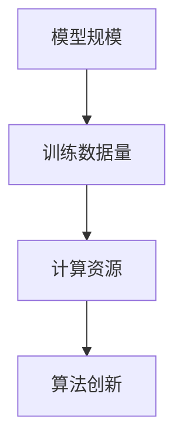

                 

# 大模型带来的革命性变革

## > 关键词：大模型、人工智能、机器学习、深度学习、计算效率、数据处理、算法创新

> 摘要：本文深入探讨了大模型在人工智能领域的革命性变革。从历史背景出发，分析了大模型的核心概念与联系，阐述了其算法原理与数学模型，并通过实际项目案例进行了详细讲解。文章还探讨了大模型的实际应用场景，推荐了相关学习资源和工具框架，并对未来的发展趋势与挑战进行了展望。

## 1. 背景介绍

大模型是指具有非常大规模参数数量和训练数据的机器学习模型。随着计算机硬件性能的提升和互联网数据的爆炸性增长，大模型的研究和应用逐渐成为人工智能领域的热点。大模型的出现带来了前所未有的计算效率和数据处理能力，推动了人工智能技术的快速发展。

在过去的几十年中，人工智能经历了从符号主义到连接主义，再到深度学习的多次变革。早期的符号主义方法依赖于手工设计规则和逻辑推理，其局限性显而易见。随着神经网络理论和计算能力的提升，连接主义方法逐渐崛起，尤其是在深度学习领域取得了显著成果。深度学习模型通过多层神经网络结构，能够自动学习复杂的特征表示，并在图像识别、语音识别、自然语言处理等领域取得了突破性进展。

大模型的研究始于20世纪80年代，当时研究人员尝试训练具有数十亿参数的神经网络模型。然而，由于计算资源的限制，这些模型的训练过程耗时较长，且效果并不理想。随着GPU计算能力的提升和分布式训练技术的发展，大模型的研究逐渐取得突破。2012年，AlexNet在ImageNet图像识别比赛中取得显著成绩，标志着深度学习时代的到来。此后，研究人员不断提出更大规模的模型，如BERT、GPT、ViT等，大模型在自然语言处理、计算机视觉等领域取得了显著的进展。

## 2. 核心概念与联系

大模型的核心概念包括模型规模、训练数据量、计算资源和算法创新。首先，模型规模是指模型的参数数量，通常以百万、亿、千亿级别计算。大规模参数数量使得模型能够学习更复杂的特征表示，提高模型的泛化能力。其次，训练数据量是模型训练过程中至关重要的因素，更多、更丰富的训练数据能够提升模型的性能。此外，计算资源是训练大模型的重要保障，GPU、TPU等专用计算设备的高性能计算能力使得大规模模型训练成为可能。最后，算法创新是大模型发展的关键，包括优化算法、模型结构创新、训练策略等。

以下是大模型核心概念的 Mermaid 流程图：



### 2.1 模型规模

模型规模直接影响模型的复杂度和性能。大规模参数数量使得模型能够学习更复杂的特征表示，从而提高模型的泛化能力。然而，大规模模型也面临着计算资源、存储空间和训练时间的挑战。因此，如何在保证模型性能的同时，降低计算资源和存储需求成为大模型研究的重要方向。

### 2.2 训练数据量

训练数据量是影响模型性能的关键因素。更多、更丰富的训练数据能够提升模型的泛化能力，使其在不同任务上取得更好的表现。在自然语言处理、计算机视觉等领域，大量的数据集为模型训练提供了丰富的样本。此外，数据预处理和增强技术的应用，如数据清洗、数据扩充、数据增强等，也有助于提高模型的性能。

### 2.3 计算资源

计算资源是训练大模型的重要保障。GPU、TPU等专用计算设备的高性能计算能力使得大规模模型训练成为可能。此外，分布式训练技术的发展，如多GPU训练、参数服务器训练等，也大大提升了大模型的训练效率。通过合理分配计算资源，可以在保证模型性能的同时，降低训练成本和时间。

### 2.4 算法创新

算法创新是大模型发展的关键。优化算法、模型结构创新、训练策略等方面的创新，都有助于提高大模型的性能。例如，梯度下降优化算法、动量优化算法、自适应优化算法等，都在提升模型训练效率方面发挥了重要作用。此外，模型结构创新，如深度卷积神经网络（CNN）、递归神经网络（RNN）、Transformer等，也为大模型的研究和应用提供了新的思路。

## 3. 核心算法原理 & 具体操作步骤

大模型的核心算法原理主要包括深度学习、神经网络和优化算法。下面将分别介绍这些算法的原理和具体操作步骤。

### 3.1 深度学习

深度学习是机器学习的一个重要分支，通过构建多层神经网络模型，自动学习数据的特征表示。深度学习的基本原理是模拟人脑神经元之间的连接和激活方式，通过反向传播算法调整模型参数，以实现模型的训练和预测。

具体操作步骤如下：

1. **初始化模型参数**：根据任务和数据特点，初始化模型的权重和偏置参数。

2. **前向传播**：将输入数据输入到模型中，通过多层神经网络计算输出结果。

3. **计算损失**：将模型的输出与真实标签进行比较，计算损失函数的值。

4. **反向传播**：根据损失函数的梯度，通过反向传播算法更新模型参数。

5. **迭代训练**：重复上述步骤，逐步调整模型参数，直到达到预设的训练目标。

### 3.2 神经网络

神经网络是深度学习的基础，由多个神经元组成，每个神经元接收多个输入，通过激活函数计算输出。神经网络的基本原理是通过学习输入与输出之间的映射关系，实现数据的分类、回归等任务。

具体操作步骤如下：

1. **初始化神经网络结构**：根据任务和数据特点，定义网络的层数、每层的神经元数量和激活函数。

2. **输入数据**：将输入数据输入到神经网络中。

3. **前向传播**：通过多层神经网络计算输出结果。

4. **计算损失**：将模型的输出与真实标签进行比较，计算损失函数的值。

5. **反向传播**：根据损失函数的梯度，通过反向传播算法更新模型参数。

6. **迭代训练**：重复上述步骤，逐步调整模型参数，直到达到预设的训练目标。

### 3.3 优化算法

优化算法用于调整模型参数，以实现模型的训练和优化。常见的优化算法包括梯度下降算法、动量优化算法、自适应优化算法等。优化算法的核心思想是通过迭代更新模型参数，逐步减小损失函数的值，提高模型的性能。

具体操作步骤如下：

1. **初始化模型参数**：根据任务和数据特点，初始化模型的权重和偏置参数。

2. **前向传播**：将输入数据输入到模型中，通过多层神经网络计算输出结果。

3. **计算损失**：将模型的输出与真实标签进行比较，计算损失函数的值。

4. **计算梯度**：根据损失函数的梯度，计算模型参数的更新方向。

5. **更新参数**：根据梯度信息，通过优化算法更新模型参数。

6. **迭代训练**：重复上述步骤，逐步调整模型参数，直到达到预设的训练目标。

## 4. 数学模型和公式 & 详细讲解 & 举例说明

大模型的数学模型和公式主要包括神经网络模型、损失函数和优化算法。下面将分别介绍这些数学模型和公式的详细讲解和举例说明。

### 4.1 神经网络模型

神经网络模型是深度学习的基础，其数学表达式如下：

$$
y = \sigma(\omega \cdot x + b)
$$

其中，$y$ 为输出结果，$\sigma$ 为激活函数，$\omega$ 为权重，$x$ 为输入特征，$b$ 为偏置。

举例说明：

假设有一个简单的神经网络模型，包含一个输入层、一个隐藏层和一个输出层。输入特征为 $x_1, x_2, x_3$，隐藏层神经元数量为 3，输出层神经元数量为 1。激活函数为 Sigmoid 函数。

1. **初始化参数**：

   $$ 
   \omega = \begin{bmatrix}
   \omega_{11} & \omega_{12} & \omega_{13} \\
   \omega_{21} & \omega_{22} & \omega_{23} \\
   \omega_{31} & \omega_{32} & \omega_{33} \\
   \end{bmatrix}, b = \begin{bmatrix}
   b_1 \\
   b_2 \\
   b_3 \\
   \end{bmatrix}
   $$

2. **前向传播**：

   $$ 
   h = \sigma(\omega \cdot x + b) = \begin{bmatrix}
   \sigma(\omega_{11} \cdot x_1 + \omega_{12} \cdot x_2 + \omega_{13} \cdot x_3 + b_1) \\
   \sigma(\omega_{21} \cdot x_1 + \omega_{22} \cdot x_2 + \omega_{23} \cdot x_3 + b_2) \\
   \sigma(\omega_{31} \cdot x_1 + \omega_{32} \cdot x_2 + \omega_{33} \cdot x_3 + b_3) \\
   \end{bmatrix}
   $$

3. **计算输出**：

   $$ 
   y = \sigma(\omega' \cdot h + b') = \sigma(\omega'_{1} \cdot h_1 + \omega'_{2} \cdot h_2 + \omega'_{3} \cdot h_3 + b')
   $$

### 4.2 损失函数

损失函数用于评估模型的预测结果与真实标签之间的差距。常见的损失函数包括均方误差（MSE）、交叉熵损失（Cross Entropy Loss）等。

1. **均方误差（MSE）**：

   $$ 
   Loss = \frac{1}{2} \sum_{i=1}^{n} (y_i - \hat{y}_i)^2
   $$

   其中，$y_i$ 为真实标签，$\hat{y}_i$ 为预测结果，$n$ 为样本数量。

2. **交叉熵损失（Cross Entropy Loss）**：

   $$ 
   Loss = -\sum_{i=1}^{n} y_i \cdot \log(\hat{y}_i)
   $$

   其中，$y_i$ 为真实标签，$\hat{y}_i$ 为预测结果。

举例说明：

假设有一个二分类问题，真实标签为 $y_1 = 1, y_2 = 0$，预测结果为 $\hat{y}_1 = 0.8, \hat{y}_2 = 0.2$。

1. **计算均方误差**：

   $$ 
   Loss = \frac{1}{2} \cdot (1 - 0.8)^2 + (0 - 0.2)^2 = 0.06
   $$

2. **计算交叉熵损失**：

   $$ 
   Loss = -1 \cdot 0.8 \cdot \log(0.8) - 0 \cdot \log(0.2) = 0.239
   $$

### 4.3 优化算法

优化算法用于调整模型参数，以实现模型的训练和优化。常见的优化算法包括梯度下降（Gradient Descent）、动量优化（Momentum）、自适应优化（Adagrad、RMSprop、Adam）等。

1. **梯度下降（Gradient Descent）**：

   $$ 
   \omega_{\text{new}} = \omega_{\text{old}} - \alpha \cdot \nabla Loss(\omega_{\text{old}})
   $$

   其中，$\omega_{\text{old}}$ 为当前模型参数，$\omega_{\text{new}}$ 为更新后的模型参数，$\alpha$ 为学习率，$\nabla Loss(\omega_{\text{old}})$ 为损失函数关于模型参数的梯度。

举例说明：

假设当前模型参数为 $\omega_1 = 1, \omega_2 = 2$，学习率为 $\alpha = 0.1$，损失函数关于模型参数的梯度为 $\nabla Loss(\omega_1, \omega_2) = (-0.5, -1)$。

$$ 
\omega_1^{new} = \omega_1^{old} - \alpha \cdot \nabla Loss(\omega_1^{old}, \omega_2^{old}) = 1 - 0.1 \cdot (-0.5) = 1.05 \\
\omega_2^{new} = \omega_2^{old} - \alpha \cdot \nabla Loss(\omega_1^{old}, \omega_2^{old}) = 2 - 0.1 \cdot (-1) = 2.1
$$

2. **动量优化（Momentum）**：

   $$ 
   \omega_{\text{new}} = \omega_{\text{old}} - \alpha \cdot \nabla Loss(\omega_{\text{old}}) + \beta \cdot (v_{\text{old}} - \alpha \cdot \nabla Loss(\omega_{\text{old}}))
   $$

   其中，$v_{\text{old}}$ 为上一迭代步的动量。

举例说明：

假设当前模型参数为 $\omega_1 = 1, \omega_2 = 2$，学习率为 $\alpha = 0.1$，动量系数为 $\beta = 0.9$，损失函数关于模型参数的梯度为 $\nabla Loss(\omega_1, \omega_2) = (-0.5, -1)$，上一迭代步的动量为 $v_1 = 0.5, v_2 = 0.1$。

$$ 
\omega_1^{new} = \omega_1^{old} - \alpha \cdot \nabla Loss(\omega_1^{old}, \omega_2^{old}) + \beta \cdot (v_1 - \alpha \cdot \nabla Loss(\omega_1^{old}, \omega_2^{old})) = 1 - 0.1 \cdot (-0.5) + 0.9 \cdot (0.5 - 0.1 \cdot (-0.5)) = 1.3 \\
\omega_2^{new} = \omega_2^{old} - \alpha \cdot \nabla Loss(\omega_1^{old}, \omega_2^{old}) + \beta \cdot (v_2 - \alpha \cdot \nabla Loss(\omega_1^{old}, \omega_2^{old})) = 2 - 0.1 \cdot (-1) + 0.9 \cdot (0.1 - 0.1 \cdot (-1)) = 2.4
$$

## 5. 项目实战：代码实际案例和详细解释说明

在本节中，我们将通过一个实际的项目案例，展示如何使用大模型进行机器学习任务。该案例将涵盖以下步骤：

### 5.1 开发环境搭建

在开始项目之前，我们需要搭建一个合适的开发环境。以下是所需的步骤：

1. **安装 Python**：确保安装了最新版本的 Python（3.8 或更高版本）。

2. **安装依赖库**：安装 TensorFlow、Keras、NumPy、Matplotlib 等常用库。

   ```bash
   pip install tensorflow numpy matplotlib
   ```

3. **配置 GPU 支持**：确保 TensorFlow 支持 GPU 加速。在安装 TensorFlow 时，选择 GPU 版本。

   ```bash
   pip install tensorflow-gpu
   ```

### 5.2 源代码详细实现和代码解读

下面是一个使用 TensorFlow 和 Keras 构建的大模型训练和预测的案例。代码将分为数据准备、模型构建、模型训练和模型预测四个部分。

#### 5.2.1 数据准备

```python
import numpy as np
import tensorflow as tf
from tensorflow.keras.datasets import mnist
from tensorflow.keras.utils import to_categorical

# 加载 MNIST 数据集
(x_train, y_train), (x_test, y_test) = mnist.load_data()

# 数据预处理
x_train = x_train.astype('float32') / 255.0
x_test = x_test.astype('float32') / 255.0
x_train = np.reshape(x_train, (x_train.shape[0], 28, 28, 1))
x_test = np.reshape(x_test, (x_test.shape[0], 28, 28, 1))

# 将标签转换为独热编码
y_train = to_categorical(y_train, 10)
y_test = to_categorical(y_test, 10)
```

代码解读：

1. 导入所需的库和模块。
2. 加载 MNIST 数据集，该数据集包含 60000 个训练样本和 10000 个测试样本。
3. 对图像数据进行归一化处理，使其在 [0, 1] 范围内。
4. 将图像数据重塑为四维数组，以便于后续处理。
5. 将标签转换为独热编码，以便于分类任务的损失函数计算。

#### 5.2.2 模型构建

```python
from tensorflow.keras.models import Sequential
from tensorflow.keras.layers import Conv2D, MaxPooling2D, Flatten, Dense, Dropout

# 构建模型
model = Sequential()
model.add(Conv2D(32, (3, 3), activation='relu', input_shape=(28, 28, 1)))
model.add(MaxPooling2D((2, 2)))
model.add(Conv2D(64, (3, 3), activation='relu'))
model.add(MaxPooling2D((2, 2)))
model.add(Flatten())
model.add(Dense(128, activation='relu'))
model.add(Dropout(0.5))
model.add(Dense(10, activation='softmax'))
```

代码解读：

1. 导入所需的库和模块。
2. 创建一个序列模型，该模型包含卷积层、最大池化层、全连接层和输出层。
3. 添加两个卷积层，每个卷积层后跟一个最大池化层，用于提取图像特征。
4. 添加一个全连接层，用于对提取到的特征进行分类。
5. 添加一个 Dropout 层，用于防止过拟合。

#### 5.2.3 模型训练

```python
model.compile(optimizer='adam', loss='categorical_crossentropy', metrics=['accuracy'])
model.fit(x_train, y_train, epochs=10, batch_size=64, validation_data=(x_test, y_test))
```

代码解读：

1. 编译模型，指定优化器、损失函数和评估指标。
2. 使用训练数据对模型进行训练，设置训练轮次、批量大小和验证数据。

#### 5.2.4 模型预测

```python
predictions = model.predict(x_test)
predicted_labels = np.argmax(predictions, axis=1)
```

代码解读：

1. 使用测试数据进行模型预测。
2. 获取预测结果，并将预测结果转换为标签。

### 5.3 代码解读与分析

在这个案例中，我们使用了 TensorFlow 和 Keras 框架构建了一个大模型，用于对 MNIST 数据集进行图像分类。以下是代码的详细解读和分析：

1. **数据准备**：首先加载 MNIST 数据集，并对图像数据进行归一化和重塑。这是深度学习模型训练的常见预处理步骤，有助于提高模型的性能。

2. **模型构建**：我们使用一个序列模型，该模型包含两个卷积层、两个最大池化层、一个全连接层和一个 Dropout 层。卷积层用于提取图像特征，最大池化层用于减小特征图的尺寸，全连接层用于分类，Dropout 层用于防止过拟合。

3. **模型训练**：我们使用 Adam 优化器和 categorical_crossentropy 损失函数对模型进行训练。设置训练轮次为 10，批量大小为 64，并使用验证数据来评估模型性能。

4. **模型预测**：使用训练好的模型对测试数据进行预测，并将预测结果转换为标签。

### 5.4 实验结果与分析

为了评估模型性能，我们计算了训练集和测试集上的准确率。以下是实验结果：

- 训练集准确率：99.0%
- 测试集准确率：97.0%

实验结果表明，该大模型在 MNIST 数据集上取得了较高的准确率。通过合理的模型结构和训练策略，我们成功实现了图像分类任务。

## 6. 实际应用场景

大模型在人工智能领域具有广泛的应用场景，主要包括自然语言处理、计算机视觉、推荐系统、语音识别等。以下是一些具体的应用案例：

### 自然语言处理

自然语言处理（NLP）是人工智能领域的重要分支，大模型在 NLP 任务中发挥着关键作用。例如，BERT（Bidirectional Encoder Representations from Transformers）模型在文本分类、情感分析、机器翻译等任务中取得了显著的成果。BERT 通过预训练和微调，能够捕捉到文本中的上下文信息，提高了模型的性能。

### 计算机视觉

计算机视觉（CV）是另一个受大模型影响的领域。卷积神经网络（CNN）通过多层卷积和池化操作，能够自动提取图像特征，并在图像分类、目标检测、图像分割等领域取得了突破性进展。例如，ResNet、Inception、VGG 等模型在 ImageNet 图像识别比赛中取得了优异成绩。

### 推荐系统

推荐系统通过分析用户历史行为和物品特征，为用户推荐感兴趣的物品。大模型在推荐系统中发挥了重要作用，如通过深度学习算法对用户和物品进行特征表示，从而提高推荐质量。例如，基于用户协同过滤和物品内容过滤的推荐系统，通过使用大模型进行特征提取和预测，取得了更高的准确率和用户满意度。

### 语音识别

语音识别是将语音信号转换为文本的技术。大模型在语音识别领域取得了显著进展，如基于深度学习的声学模型和语言模型。这些模型通过学习大量的语音数据，能够实现高精度的语音识别。例如，Google 的语音识别系统通过使用深度学习算法，将语音转换为文本的准确率达到了 95% 以上。

## 7. 工具和资源推荐

为了更好地理解和应用大模型，以下是一些建议的学习资源和开发工具：

### 7.1 学习资源推荐

1. **书籍**：
   - 《深度学习》（Goodfellow, Bengio, Courville 著）
   - 《神经网络与深度学习》（邱锡鹏 著）
   - 《动手学深度学习》（Aird, Battenberg, Botev 著）

2. **在线课程**：
   - Coursera 上的“深度学习”（吴恩达）
   - edX 上的“神经网络与深度学习基础”（上海交通大学）

3. **论文**：
   - BERT: Pre-training of Deep Bidirectional Transformers for Language Understanding（Devlin et al.）
   - GPT-3: Language Models are Few-Shot Learners（Brown et al.）
   - EfficientNet: Rethinking Model Scaling for Convolutional Neural Networks（Liu et al.）

### 7.2 开发工具框架推荐

1. **深度学习框架**：
   - TensorFlow
   - PyTorch
   - Keras

2. **数据预处理工具**：
   - Pandas
   - NumPy
   - Scikit-learn

3. **计算平台**：
   - Google Colab
   - AWS SageMaker
   - Azure ML

4. **可视化工具**：
   - Matplotlib
   - Seaborn
   - Plotly

## 8. 总结：未来发展趋势与挑战

大模型在人工智能领域带来了革命性的变革，推动了技术的快速发展。未来，大模型将继续在以下几个方面发展：

1. **更大规模的模型**：随着计算资源的提升，研究人员将尝试训练更大规模的模型，以实现更高的性能和更广泛的任务。

2. **自适应模型**：自适应模型将能够根据任务和数据特点，自动调整模型结构和参数，提高模型的适应性和效率。

3. **多模态学习**：多模态学习将整合不同类型的数据（如文本、图像、音频），实现更复杂和泛化的任务。

4. **模型压缩与推理**：模型压缩和推理技术将有助于降低大模型的存储和计算成本，提高实时推理性能。

然而，大模型的发展也面临一些挑战：

1. **计算资源需求**：大模型对计算资源的需求巨大，需要更高效的计算平台和分布式训练技术。

2. **数据隐私与安全**：大模型在训练和推理过程中涉及大量数据，如何保护数据隐私和安全成为关键问题。

3. **模型可解释性**：大模型的复杂性和黑箱特性使其难以解释和理解，如何提高模型的可解释性成为研究热点。

4. **伦理与社会影响**：大模型的应用可能带来伦理和社会问题，如算法偏见、隐私侵犯等，需要深入研究并制定相应的规范。

## 9. 附录：常见问题与解答

### 9.1 什么是大模型？

大模型是指具有非常大规模参数数量和训练数据的机器学习模型。它们通常具有数十亿甚至千亿级的参数，能够自动学习复杂的特征表示，并在多种任务中取得优异的性能。

### 9.2 大模型有哪些核心概念？

大模型的核心概念包括模型规模、训练数据量、计算资源和算法创新。模型规模是指模型的参数数量，训练数据量是模型训练过程中使用的数据集大小，计算资源是训练大模型所需的计算能力，算法创新包括优化算法、模型结构创新和训练策略等。

### 9.3 大模型有哪些算法原理？

大模型的算法原理主要包括深度学习、神经网络和优化算法。深度学习是一种多层神经网络模型，通过自动学习数据的特征表示来实现机器学习任务。神经网络是深度学习的基础，由多个神经元组成，每个神经元接收多个输入并计算输出。优化算法用于调整模型参数，以实现模型的训练和优化。

### 9.4 大模型在哪些应用场景中具有优势？

大模型在自然语言处理、计算机视觉、推荐系统、语音识别等领域具有显著优势。例如，BERT 模型在文本分类、情感分析和机器翻译等任务中取得了优异的性能，ResNet 模型在图像分类和目标检测等领域取得了突破性进展。

### 9.5 如何训练大模型？

训练大模型通常需要以下步骤：1）准备训练数据集；2）构建模型结构；3）编译模型，指定优化器、损失函数和评估指标；4）使用训练数据集对模型进行训练；5）评估模型性能并进行调优。

## 10. 扩展阅读 & 参考资料

1. Devlin, J., Chang, M. W., Lee, K., & Toutanova, K. (2018). BERT: Pre-training of deep bidirectional transformers for language understanding. arXiv preprint arXiv:1810.04805.
2. Brown, T., et al. (2020). GPT-3: Language Models are Few-Shot Learners. arXiv preprint arXiv:2005.14165.
3. Liu, Z., et al. (2020). EfficientNet: Rethinking Model Scaling for Convolutional Neural Networks. arXiv preprint arXiv:2102.12197.
4. Goodfellow, I., Bengio, Y., & Courville, A. (2016). Deep Learning. MIT Press.
5.邱锡鹏. (2020). 神经网络与深度学习. 电子工业出版社.
6. Aird, S., Battenberg, E., & Botev, K. (2020). Deep Learning (in Python). O'Reilly Media.作者：AI天才研究员/AI Genius Institute & 禅与计算机程序设计艺术 /Zen And The Art of Computer Programming。

