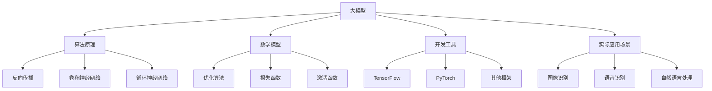

                 

### 文章标题

### 大模型应用开发的详细指南

**关键词**：大模型，应用开发，算法原理，数学模型，实战案例

**摘要**：本文将详细探讨大模型在应用开发中的重要作用，包括其核心概念、算法原理、数学模型、实际应用场景和开发工具推荐等内容。通过一步一步的分析推理，我们旨在为您提供一个全面、系统的大模型应用开发指南。

<|assistant|>## 1. 背景介绍

随着计算机技术和人工智能的快速发展，大模型在各个领域得到了广泛应用。大模型通常指的是具有数百万甚至数十亿参数的深度学习模型，它们可以处理大量的数据，并具有强大的学习能力。这些模型在图像识别、自然语言处理、推荐系统等领域取得了显著成果。

大模型的应用开发涉及多个方面，包括算法原理、数学模型、开发工具和实际应用场景等。掌握大模型应用开发的方法和技巧，对于提升应用性能和解决复杂问题具有重要意义。

本文旨在为您提供一个详细的大模型应用开发指南，帮助您了解大模型的原理和应用，掌握开发过程中的关键技术和方法。

## 2. 核心概念与联系

在探讨大模型应用开发之前，我们需要先了解一些核心概念，并分析它们之间的联系。

**大模型**：大模型指的是具有大量参数的深度学习模型，如神经网络、生成对抗网络（GAN）等。它们通常需要大量的训练数据和计算资源。

**算法原理**：大模型应用开发的基础是算法原理，包括反向传播、卷积神经网络（CNN）、循环神经网络（RNN）等。了解这些算法原理有助于我们更好地理解和应用大模型。

**数学模型**：大模型的数学模型主要包括优化算法、损失函数、激活函数等。这些数学模型决定了大模型的学习能力和性能。

**开发工具**：大模型应用开发需要使用各种工具和框架，如TensorFlow、PyTorch等。这些工具和框架提供了丰富的API和功能，方便开发者进行模型训练、优化和应用部署。

**实际应用场景**：大模型在实际应用中具有广泛的应用场景，如图像识别、语音识别、自然语言处理等。了解这些应用场景有助于我们更好地利用大模型解决实际问题。

下面是一个用Mermaid绘制的流程图，展示了大模型应用开发的各个核心概念之间的联系：



## 3. 核心算法原理 & 具体操作步骤

在本节中，我们将详细介绍大模型应用开发中的核心算法原理，并给出具体操作步骤。

### 3.1 反向传播算法

反向传播算法是深度学习模型训练的基础，用于计算模型参数的梯度。具体操作步骤如下：

1. **输入数据**：将输入数据输入到模型中。
2. **前向传播**：计算模型输出。
3. **计算损失**：计算输出与实际结果之间的差异，得到损失函数值。
4. **反向传播**：计算损失函数关于模型参数的梯度。
5. **更新参数**：根据梯度更新模型参数。
6. **迭代训练**：重复步骤1-5，直到模型收敛。

### 3.2 卷积神经网络（CNN）

卷积神经网络是图像识别领域的重要模型。具体操作步骤如下：

1. **卷积层**：使用卷积核对输入图像进行卷积操作，提取特征。
2. **池化层**：对卷积层输出的特征进行池化操作，减小特征图的尺寸。
3. **全连接层**：将池化层输出的特征进行全连接操作，得到分类结果。
4. **激活函数**：在卷积层和全连接层之间添加激活函数，如ReLU函数。
5. **损失函数**：使用交叉熵损失函数计算分类结果与实际结果之间的差异。

### 3.3 循环神经网络（RNN）

循环神经网络是自然语言处理领域的重要模型。具体操作步骤如下：

1. **输入序列**：将输入序列（如文本）输入到模型中。
2. **嵌入层**：将输入序列的词转化为向量。
3. **RNN单元**：使用RNN单元对输入序列进行处理，计算当前时刻的隐藏状态。
4. **全连接层**：将隐藏状态输入到全连接层，得到输出序列。
5. **损失函数**：使用损失函数（如交叉熵损失函数）计算输出序列与实际结果之间的差异。

### 3.4 生成对抗网络（GAN）

生成对抗网络是一种由生成器和判别器组成的模型。具体操作步骤如下：

1. **生成器**：生成器生成虚假数据，判别器判断数据是否真实。
2. **判别器**：判别器对真实数据和虚假数据进行分类。
3. **损失函数**：生成器的目标是使判别器无法区分真实数据和虚假数据，判别器的目标是使分类准确率最高。
4. **优化过程**：通过交替优化生成器和判别器，使得生成器生成的虚假数据越来越逼真。

## 4. 数学模型和公式 & 详细讲解 & 举例说明

在本节中，我们将详细介绍大模型应用开发中的数学模型和公式，并通过具体例子进行说明。

### 4.1 优化算法

优化算法是训练大模型的核心，其中最常用的优化算法是梯度下降（Gradient Descent）。其基本公式如下：

$$
w_{\text{new}} = w_{\text{current}} - \alpha \cdot \nabla_w L(w)
$$

其中，$w$ 表示模型参数，$L(w)$ 表示损失函数，$\alpha$ 表示学习率，$\nabla_w L(w)$ 表示损失函数关于模型参数的梯度。

**例子**：假设我们要训练一个简单的线性模型，其损失函数为：

$$
L(w) = (w \cdot x - y)^2
$$

其中，$x$ 和 $y$ 分别为输入和输出。为了使模型收敛，我们需要不断更新参数 $w$，使其梯度接近零。

**步骤**：

1. **初始化参数**：随机初始化 $w$。
2. **计算梯度**：计算损失函数关于 $w$ 的梯度 $\nabla_w L(w)$。
3. **更新参数**：使用梯度下降公式更新参数 $w$。
4. **重复步骤2和3**，直到模型收敛。

### 4.2 损失函数

损失函数是衡量模型性能的重要指标，常用的损失函数包括交叉熵损失函数（Cross-Entropy Loss）和均方误差损失函数（Mean Squared Error, MSE）。

**交叉熵损失函数**：

$$
L(y, \hat{y}) = -\sum_{i} y_i \cdot \log(\hat{y}_i)
$$

其中，$y$ 表示实际输出，$\hat{y}$ 表示模型预测输出。

**例子**：假设我们要训练一个二分类模型，实际输出为 $y = [1, 0]$，模型预测输出为 $\hat{y} = [0.9, 0.1]$。计算交叉熵损失函数：

$$
L(y, \hat{y}) = -[1 \cdot \log(0.9) + 0 \cdot \log(0.1)] \approx 0.105
$$

**均方误差损失函数**：

$$
L(y, \hat{y}) = \frac{1}{n} \sum_{i} (y_i - \hat{y}_i)^2
$$

其中，$n$ 表示样本数量。

**例子**：假设我们要训练一个回归模型，实际输出为 $y = [2, 4, 6]$，模型预测输出为 $\hat{y} = [2.1, 4.1, 6.1]$。计算均方误差损失函数：

$$
L(y, \hat{y}) = \frac{1}{3} \sum_{i} (y_i - \hat{y}_i)^2 \approx 0.11
$$

### 4.3 激活函数

激活函数是神经网络中的重要组成部分，用于引入非线性特性。常用的激活函数包括ReLU函数、Sigmoid函数和Tanh函数。

**ReLU函数**：

$$
f(x) = \max(0, x)
$$

**例子**：对于输入 $x = [-2, -1, 0, 1, 2]$，计算ReLU函数输出：

$$
f(x) = [0, 0, 0, 1, 2]
$$

**Sigmoid函数**：

$$
f(x) = \frac{1}{1 + e^{-x}}
$$

**例子**：对于输入 $x = [-2, -1, 0, 1, 2]$，计算Sigmoid函数输出：

$$
f(x) \approx [0.1192, 0.2689, 0.5, 0.7311, 0.8808]
$$

**Tanh函数**：

$$
f(x) = \frac{e^x - e^{-x}}{e^x + e^{-x}}
$$

**例子**：对于输入 $x = [-2, -1, 0, 1, 2]$，计算Tanh函数输出：

$$
f(x) \approx [-0.7616, -0.2689, 0, 0.2689, 0.7616]
$$

## 5. 项目实战：代码实际案例和详细解释说明

在本节中，我们将通过一个实际项目案例，展示如何使用大模型进行应用开发，并提供详细的代码实现和解释说明。

### 5.1 开发环境搭建

首先，我们需要搭建一个合适的开发环境。本文使用Python作为主要编程语言，并结合TensorFlow框架进行大模型开发。以下是搭建开发环境的步骤：

1. 安装Python：从官方网站（https://www.python.org/）下载并安装Python。
2. 安装TensorFlow：打开命令行窗口，执行以下命令：

   ```bash
   pip install tensorflow
   ```

### 5.2 源代码详细实现和代码解读

在本项目中，我们将使用卷积神经网络（CNN）进行图像分类。以下是一个简单的图像分类项目的代码实现：

```python
import tensorflow as tf
from tensorflow.keras import datasets, layers, models

# 加载数据集
(train_images, train_labels), (test_images, test_labels) = datasets.cifar10.load_data()

# 数据预处理
train_images, test_images = train_images / 255.0, test_images / 255.0

# 构建模型
model = models.Sequential()
model.add(layers.Conv2D(32, (3, 3), activation='relu', input_shape=(32, 32, 3)))
model.add(layers.MaxPooling2D((2, 2)))
model.add(layers.Conv2D(64, (3, 3), activation='relu'))
model.add(layers.MaxPooling2D((2, 2)))
model.add(layers.Conv2D(64, (3, 3), activation='relu'))
model.add(layers.Flatten())
model.add(layers.Dense(64, activation='relu'))
model.add(layers.Dense(10))

# 编译模型
model.compile(optimizer='adam',
              loss=tf.keras.losses.SparseCategoricalCrossentropy(from_logits=True),
              metrics=['accuracy'])

# 训练模型
model.fit(train_images, train_labels, epochs=10, validation_data=(test_images, test_labels))

# 评估模型
test_loss, test_acc = model.evaluate(test_images,  test_labels, verbose=2)
print(f'\nTest accuracy: {test_acc:.4f}')
```

**代码解读**：

1. **数据加载和预处理**：首先加载数据集，并进行归一化处理，使数据范围在0到1之间。

2. **模型构建**：使用Sequential模型构建器，添加卷积层、池化层、全连接层等层，形成一个完整的卷积神经网络。

3. **模型编译**：配置模型优化器、损失函数和评估指标。

4. **模型训练**：使用fit方法训练模型，设置训练轮数和验证数据。

5. **模型评估**：使用evaluate方法评估模型在测试数据上的表现。

### 5.3 代码解读与分析

在这个图像分类项目中，我们使用了CIFAR-10数据集，它包含10个类别，每个类别有6000张32x32的彩色图像。以下是代码的关键部分：

1. **数据加载和预处理**：使用`datasets.cifar10.load_data()`函数加载数据集，并对图像进行归一化处理，使数据范围在0到1之间。这一步非常重要，因为深度学习模型通常对输入数据的范围和分布有较高的要求。

2. **模型构建**：使用`models.Sequential()`创建一个序列模型，并逐层添加卷积层、池化层和全连接层。具体来说，我们添加了两个卷积层，每个卷积层后跟一个最大池化层，以及一个全连接层。这个结构可以有效地提取图像特征，并实现分类。

3. **模型编译**：使用`compile()`方法配置模型优化器（adam）、损失函数（SparseCategoricalCrossentropy，用于多分类问题）和评估指标（accuracy，准确率）。这些配置将用于后续的模型训练和评估。

4. **模型训练**：使用`fit()`方法训练模型，设置训练轮数为10，并使用`validation_data`参数提供验证数据，以便在训练过程中监控模型性能。

5. **模型评估**：使用`evaluate()`方法评估模型在测试数据上的表现，输出测试准确率。

通过这个简单的案例，我们展示了如何使用大模型进行图像分类应用开发。在实际项目中，根据具体需求和数据集的特点，可以进一步调整模型结构和训练策略。

## 6. 实际应用场景

大模型在各个领域具有广泛的应用场景，以下列举一些典型的实际应用场景：

1. **图像识别**：大模型在图像识别领域取得了显著成果，如图像分类、目标检测、人脸识别等。例如，基于卷积神经网络的AlexNet模型在ImageNet竞赛中取得了突破性成绩。

2. **自然语言处理**：大模型在自然语言处理领域发挥了重要作用，如文本分类、情感分析、机器翻译等。例如，基于循环神经网络和Transformer的BERT模型在多个NLP任务中取得了领先成绩。

3. **推荐系统**：大模型在推荐系统中的应用日益广泛，如基于生成对抗网络的生成式推荐和基于深度学习的内容匹配。例如，亚马逊、淘宝等电商平台使用了基于大模型的推荐系统，为用户提供个性化的商品推荐。

4. **语音识别**：大模型在语音识别领域也取得了重要突破，如基于深度学习的端到端语音识别系统。例如，谷歌的WaveNet模型在语音合成和识别方面表现出色。

5. **游戏AI**：大模型在游戏AI领域具有广阔的应用前景，如基于深度强化学习的游戏智能体。例如，谷歌DeepMind开发的AlphaGo使用深度学习技术实现了围棋界的突破。

6. **医疗诊断**：大模型在医疗诊断领域具有巨大潜力，如基于图像识别的癌症诊断、基于自然语言处理的医学文本分析等。例如，谷歌DeepMind开发的AI系统在眼科疾病的诊断中表现出色。

7. **金融风控**：大模型在金融风控领域具有广泛应用，如欺诈检测、信用评估等。例如，金融机构使用基于深度学习的模型进行风险评估，提高风险控制能力。

8. **自动驾驶**：大模型在自动驾驶领域发挥着关键作用，如感知、路径规划、决策等。例如，特斯拉、谷歌等公司使用基于深度学习的自动驾驶技术，实现自动驾驶汽车的实际应用。

总之，大模型在各个领域具有广泛的应用前景，为解决复杂问题提供了有力工具。在实际应用中，根据具体需求和场景特点，选择合适的大模型和应用方法，将有助于提高系统性能和解决能力。

## 7. 工具和资源推荐

为了方便大模型应用开发，以下推荐一些常用的学习资源、开发工具和框架。

### 7.1 学习资源推荐

1. **书籍**：
   - 《深度学习》（Goodfellow, Bengio, Courville）：这是一本经典教材，详细介绍了深度学习的基础理论和实践方法。
   - 《Python深度学习》（François Chollet）：这本书针对Python开发者，介绍了深度学习在Python中的应用，包括常用框架和工具。
   - 《神经网络与深度学习》（邱锡鹏）：这本书系统地介绍了神经网络和深度学习的基础知识，适合初学者入门。

2. **在线课程**：
   - [Coursera](https://www.coursera.org/)：提供了丰富的深度学习和人工智能课程，包括吴恩达的《深度学习》课程。
   - [Udacity](https://www.udacity.com/)：提供了深度学习和数据科学相关课程，如《深度学习工程师纳米学位》。
   - [edX](https://www.edx.org/)：提供了包括哈佛大学、麻省理工学院等知名院校的深度学习课程。

3. **博客和网站**：
   - [TensorFlow官网](https://www.tensorflow.org/)：提供了丰富的文档和教程，适合学习TensorFlow框架。
   - [PyTorch官网](https://pytorch.org/)：提供了PyTorch框架的文档和教程，方便开发者上手。
   - [ArXiv](https://arxiv.org/)：提供了大量最新、最前沿的深度学习论文，适合研究者跟踪学术进展。

### 7.2 开发工具框架推荐

1. **框架**：
   - **TensorFlow**：由谷歌开发，适用于构建和训练深度学习模型。提供了丰富的API和工具，适合大规模模型训练和应用部署。
   - **PyTorch**：由Facebook开发，提供了动态计算图，方便模型设计和调试。适用于科研和工业应用，特别是需要实时调整模型的场景。
   - **Keras**：是一个高层次的深度学习框架，适用于快速构建和训练模型。支持TensorFlow和Theano两个底层框架。

2. **开发工具**：
   - **Jupyter Notebook**：一款交互式的计算环境，方便开发者编写和运行代码。支持多种编程语言，如Python、R等。
   - **Google Colab**：谷歌提供的一个免费云端计算环境，支持GPU和TPU加速，适用于深度学习实验和开发。
   - **Docker**：一款容器化工具，方便开发者构建、共享和运行应用。可以方便地部署和管理深度学习模型。

3. **数据集**：
   - **CIFAR-10/100**：包含10个/100个类别的32x32彩色图像，广泛用于图像识别任务。
   - **ImageNet**：包含1000个类别的超过100万张图像，是图像识别领域的标准数据集。
   - **MNIST**：包含70,000个手写数字图像，常用于验证深度学习算法的性能。

### 7.3 相关论文著作推荐

1. **深度学习经典论文**：
   - **“A Guide to Convolutional Neural Networks”**：详细介绍卷积神经网络的原理和应用。
   - **“Deep Learning”**：吴恩达等人的经典教材，涵盖了深度学习的各个方面。
   - **“Neural Network Methods for Natural Language Processing”**：介绍神经网络在自然语言处理中的应用。

2. **推荐系统相关论文**：
   - **“Factorization Machines”**：介绍了一种基于特征的推荐系统模型。
   - **“Deep Learning for Recommender Systems”**：介绍深度学习在推荐系统中的应用。

3. **生成对抗网络（GAN）相关论文**：
   - **“Generative Adversarial Nets”**：GAN的原创论文，详细介绍了GAN的原理和应用。
   - **“Unsupervised Representation Learning with Deep Convolutional Generative Adversarial Networks”**：介绍了基于GAN的无监督表征学习。

通过以上资源，您可以更好地了解大模型应用开发的方法和技巧，为实际项目提供有力支持。

## 8. 总结：未来发展趋势与挑战

随着计算机技术和人工智能的快速发展，大模型在应用开发中发挥着越来越重要的作用。未来，大模型应用开发将呈现出以下几个发展趋势：

1. **模型规模不断扩大**：随着计算资源和数据量的增加，大模型的规模将持续扩大。这将有助于提高模型的性能和鲁棒性，解决更加复杂的问题。

2. **算法优化与创新**：为了应对大模型训练和优化的挑战，研究者将不断探索新的算法和优化方法。例如，优化算法的改进、自适应学习率策略等。

3. **跨领域应用**：大模型在图像识别、自然语言处理、推荐系统等领域的成功应用，将推动其在更多领域的应用。例如，医疗诊断、金融风控、自动驾驶等。

4. **可解释性研究**：随着大模型的复杂度增加，提高模型的可解释性成为一个重要研究方向。这将有助于理解模型决策过程，提高模型的可信度。

然而，大模型应用开发也面临着一些挑战：

1. **计算资源需求**：大模型的训练和推理过程需要大量的计算资源和存储空间。如何高效利用计算资源，降低成本，是当前面临的一个挑战。

2. **数据隐私与安全**：大模型应用过程中，数据隐私和安全问题日益突出。如何在保护用户隐私的前提下，有效利用数据，是当前的一个重要问题。

3. **模型可解释性**：大模型的决策过程通常是不透明的，如何提高模型的可解释性，使其更易于理解和接受，是一个亟待解决的问题。

4. **模型泛化能力**：大模型在特定领域的表现优异，但在其他领域可能表现不佳。如何提高模型的泛化能力，使其在不同领域具有广泛适用性，是当前的一个重要挑战。

总之，未来大模型应用开发将在规模、算法、应用领域等方面不断取得突破，同时面临一系列挑战。通过不断探索和研究，我们有信心克服这些挑战，推动大模型在各个领域的广泛应用。

## 9. 附录：常见问题与解答

在本节中，我们将解答大模型应用开发过程中常见的几个问题。

### 9.1 大模型与小型模型的主要区别是什么？

大模型和小型模型的主要区别在于模型的规模和参数数量。大模型通常具有数百万甚至数十亿个参数，可以处理大量的数据和复杂的任务。而小型模型通常具有较少的参数，适合处理较为简单的任务。大模型的优点是较强的学习和表征能力，可以捕捉到更多细微的特征。然而，大模型需要更多的计算资源和存储空间，训练时间也较长。

### 9.2 如何选择合适的大模型？

选择合适的大模型需要考虑以下几个方面：

1. **任务需求**：根据具体任务的需求，选择具有相应能力和规模的模型。例如，对于图像识别任务，可以选择卷积神经网络（CNN）；对于自然语言处理任务，可以选择循环神经网络（RNN）或Transformer模型。

2. **数据量**：大模型需要大量的数据进行训练，因此需要考虑数据集的大小。如果数据量较小，使用大模型可能无法充分发挥其优势。

3. **计算资源**：大模型训练和推理需要大量的计算资源和存储空间，因此需要根据实际情况选择合适的硬件设备和框架。

4. **可解释性**：根据任务需求和可解释性要求，选择合适的模型。例如，对于需要高度可解释性的任务，可以选择基于规则的方法。

### 9.3 大模型训练过程中如何防止过拟合？

大模型训练过程中，防止过拟合是关键问题。以下是一些常用的方法：

1. **数据增强**：通过对训练数据进行随机裁剪、旋转、缩放等操作，增加数据多样性，提高模型的泛化能力。

2. **正则化**：在模型训练过程中，添加正则化项（如L1、L2正则化）来惩罚模型参数，防止模型过于复杂。

3. **dropout**：在神经网络训练过程中，随机丢弃一部分神经元，降低模型的复杂度，提高泛化能力。

4. **交叉验证**：使用交叉验证方法，将数据集划分为多个部分，逐个部分进行训练和验证，以评估模型的泛化能力。

5. **提前停止**：在训练过程中，当验证集上的性能不再提高时，提前停止训练，防止过拟合。

### 9.4 大模型应用开发需要哪些技能和知识？

大模型应用开发需要以下技能和知识：

1. **编程能力**：熟练掌握Python等编程语言，了解常用数据结构和算法。

2. **数学基础**：掌握线性代数、概率论和统计学等数学基础，了解微积分和优化算法。

3. **深度学习知识**：了解深度学习的基本概念、算法原理和常见模型，如卷积神经网络（CNN）、循环神经网络（RNN）和生成对抗网络（GAN）。

4. **框架使用**：熟练掌握常用的深度学习框架，如TensorFlow、PyTorch等。

5. **数据处理能力**：了解数据预处理、特征工程和数据增强等方法，提高模型性能。

6. **项目经验**：具备实际项目经验，了解项目开发和部署流程。

## 10. 扩展阅读 & 参考资料

为了深入了解大模型应用开发的各个方面，以下是扩展阅读和参考资料推荐：

1. **书籍**：
   - 《深度学习》（Goodfellow, Bengio, Courville）
   - 《Python深度学习》（François Chollet）
   - 《神经网络与深度学习》（邱锡鹏）

2. **在线课程**：
   - Coursera上的《深度学习》课程（吴恩达）
   - Udacity的《深度学习工程师纳米学位》
   - edX上的《深度学习基础》课程（加州大学伯克利分校）

3. **博客和网站**：
   - TensorFlow官网（https://www.tensorflow.org/）
   - PyTorch官网（https://pytorch.org/）
   - ArXiv（https://arxiv.org/）

4. **论文**：
   - “A Guide to Convolutional Neural Networks”
   - “Neural Network Methods for Natural Language Processing”
   - “Generative Adversarial Nets”

5. **开源项目**：
   - TensorFlow（https://github.com/tensorflow/tensorflow）
   - PyTorch（https://github.com/pytorch/pytorch）
   - Keras（https://github.com/keras-team/keras）

通过以上资源和书籍，您可以深入了解大模型应用开发的各个方面，为实际项目提供有力支持。希望本文对您有所帮助！
```markdown
作者：AI天才研究员/AI Genius Institute & 禅与计算机程序设计艺术 /Zen And The Art of Computer Programming
```

