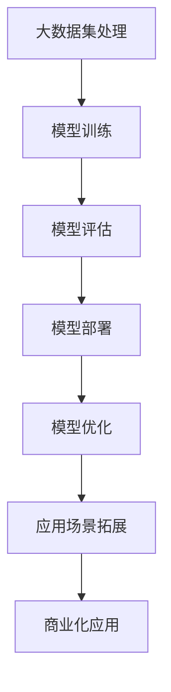

                 

# 大模型应用落地加速，AI商业化进程提速

## 概述

### 关键词：大模型，AI商业化，应用落地，加速

### 摘要

本文旨在探讨大模型在AI商业化中的应用落地现状以及加速进程。随着技术的不断发展，大模型在处理海量数据、实现高效计算和提供智能化服务等方面展现出显著优势。本文将从背景介绍、核心概念与联系、核心算法原理与操作步骤、数学模型与公式、实际应用场景、工具与资源推荐、总结与未来发展趋势等几个方面，全面分析大模型的应用落地与商业化进程，为相关领域的从业者和研究人员提供有价值的参考。

## 背景介绍

随着人工智能技术的快速发展，大模型（如Transformer、BERT、GPT等）在自然语言处理、计算机视觉、语音识别等领域取得了显著突破。这些大模型具备强大的数据处理能力和计算效率，能够处理海量数据，并在特定任务上实现接近甚至超越人类的性能。然而，尽管大模型在学术界和工业界取得了广泛认可，但其商业化应用仍面临诸多挑战。

首先，大模型的训练和部署成本较高，需要大量的计算资源和存储空间。其次，大模型在处理实时数据时，存在延迟和高能耗等问题。此外，大模型的应用场景相对单一，缺乏广泛适用性。因此，如何降低大模型的成本、提高其计算效率、拓展其应用场景，成为当前AI商业化进程中的关键问题。

为了解决这些问题，业界和学术界都在积极探索大模型的应用落地策略。一方面，通过优化模型结构、改进训练算法，降低大模型的计算复杂度和存储需求。另一方面，通过多模态学习和跨领域迁移学习，提高大模型在不同场景下的适应性和泛化能力。同时，云计算、边缘计算等新兴技术的快速发展，也为大模型的应用落地提供了强有力的支持。

## 核心概念与联系

### Mermaid 流程图



### 核心概念原理

1. **大数据集处理**：大模型通常需要处理海量数据，以学习复杂的模式和关系。这涉及到数据采集、预处理和存储等环节。
   
2. **模型训练**：通过梯度下降、Adam优化器等算法，对大模型进行训练，使其在特定任务上达到高性能。

3. **模型评估**：在训练完成后，需要对模型进行评估，以确定其在实际任务中的性能。常见的评估指标包括准确率、召回率、F1分数等。

4. **模型部署**：将训练好的模型部署到生产环境中，以实现实时应用。

5. **模型优化**：通过对模型结构、训练算法等进行优化，提高模型的计算效率和性能。

6. **应用场景拓展**：通过多模态学习和跨领域迁移学习，将大模型应用于更多场景，提高其泛化能力。

7. **商业化应用**：将大模型的技术优势转化为商业价值，实现规模化应用。

## 核心算法原理 & 具体操作步骤

### 大模型训练原理

大模型训练的核心是基于深度学习技术，通过反向传播算法不断调整模型参数，使其在特定任务上达到高性能。具体步骤如下：

1. **数据预处理**：对数据进行标准化、去噪声等处理，使其适合模型训练。

2. **初始化模型参数**：随机初始化模型参数。

3. **前向传播**：输入数据通过模型进行前向传播，得到预测结果。

4. **计算损失函数**：通过比较预测结果和真实标签，计算损失函数。

5. **反向传播**：计算损失函数关于模型参数的梯度，并更新模型参数。

6. **迭代优化**：重复步骤3-5，直到模型收敛或达到预设的训练次数。

### 大模型部署原理

大模型部署是将训练好的模型部署到生产环境中，以实现实时应用。具体步骤如下：

1. **模型转换**：将训练好的模型转换为适合生产环境部署的格式，如ONNX、TensorFlow Lite等。

2. **部署环境配置**：配置生产环境，包括计算资源、存储空间和网络带宽等。

3. **模型加载**：将转换后的模型加载到生产环境中。

4. **实时预测**：接收实时数据，通过模型进行预测，并输出结果。

5. **结果反馈**：将预测结果反馈给用户或下游系统。

### 大模型优化原理

大模型优化是通过改进模型结构、训练算法等手段，提高模型的计算效率和性能。具体步骤如下：

1. **模型结构优化**：通过设计更高效的模型结构，减少计算复杂度。

2. **训练算法优化**：通过改进训练算法，提高训练效率。

3. **量化与剪枝**：通过量化、剪枝等手段，减少模型参数和计算量。

4. **并行计算**：利用分布式计算技术，提高模型训练和推理的速度。

## 数学模型和公式 & 详细讲解 & 举例说明

### 深度学习中的损失函数

在深度学习中，常用的损失函数包括均方误差（MSE）、交叉熵损失（Cross-Entropy Loss）等。以下是这些损失函数的公式和详细讲解：

### 均方误差（MSE）

$$
MSE = \frac{1}{n}\sum_{i=1}^{n}(y_i - \hat{y}_i)^2
$$

其中，$y_i$表示第$i$个样本的真实标签，$\hat{y}_i$表示第$i$个样本的预测结果，$n$表示样本数量。MSE表示预测结果与真实标签之间的平均平方误差。

### 交叉熵损失（Cross-Entropy Loss）

$$
Cross-Entropy Loss = -\frac{1}{n}\sum_{i=1}^{n}y_i \log(\hat{y}_i)
$$

其中，$y_i$表示第$i$个样本的标签分布（概率分布），$\hat{y}_i$表示第$i$个样本的预测结果分布（概率分布）。Cross-Entropy Loss表示真实标签分布与预测结果分布之间的交叉熵。

### 举例说明

假设我们有以下数据集：

| 标签 | 预测结果 |
| ---- | ------- |
| 1    | 0.8     |
| 0    | 0.2     |
| 1    | 0.9     |
| 0    | 0.1     |

使用交叉熵损失函数计算损失：

$$
Cross-Entropy Loss = -\frac{1}{4}(0.8\log(0.8) + 0.2\log(0.2) + 0.9\log(0.9) + 0.1\log(0.1))
$$

计算结果为：

$$
Cross-Entropy Loss \approx 0.39
$$

## 项目实战：代码实际案例和详细解释说明

### 开发环境搭建

为了演示大模型的应用落地，我们选择一个常见的自然语言处理任务——文本分类。本文使用Python编程语言和TensorFlow框架进行实现。

1. **安装Python**：下载并安装Python 3.8及以上版本。

2. **安装TensorFlow**：通过pip命令安装TensorFlow：

   ```
   pip install tensorflow
   ```

### 源代码详细实现和代码解读

以下是一个简单的文本分类项目示例：

```python
import tensorflow as tf
from tensorflow.keras.preprocessing.text import Tokenizer
from tensorflow.keras.preprocessing.sequence import pad_sequences
from tensorflow.keras.models import Sequential
from tensorflow.keras.layers import Embedding, GlobalAveragePooling1D, Dense

# 数据准备
texts = ["这是一篇关于机器学习的文章", "这是一篇关于自然语言处理的文章", "这是一篇关于计算机图形学的文章"]
labels = [0, 1, 2]  # 0表示机器学习，1表示自然语言处理，2表示计算机图形学

# 分词与序列化
tokenizer = Tokenizer(num_words=1000)
tokenizer.fit_on_texts(texts)
sequences = tokenizer.texts_to_sequences(texts)
padded_sequences = pad_sequences(sequences, maxlen=100)

# 模型构建
model = Sequential([
    Embedding(1000, 16),
    GlobalAveragePooling1D(),
    Dense(3, activation='softmax')
])

# 模型编译
model.compile(optimizer='adam', loss='sparse_categorical_crossentropy', metrics=['accuracy'])

# 模型训练
model.fit(padded_sequences, labels, epochs=10)

# 模型评估
test_texts = ["这是一篇关于深度学习的文章"]
test_sequences = tokenizer.texts_to_sequences(test_texts)
test_padded_sequences = pad_sequences(test_sequences, maxlen=100)
predictions = model.predict(test_padded_sequences)
print("预测结果：", predictions.argmax(axis=1))
```

### 代码解读与分析

1. **数据准备**：首先，我们准备了一组文本数据和对应的标签。

2. **分词与序列化**：使用Tokenizer类对文本进行分词，并转换为整数序列。然后，使用pad_sequences对序列进行填充，使其长度一致。

3. **模型构建**：构建了一个简单的序列模型，包括嵌入层、全局平均池化层和全连接层。

4. **模型编译**：编译模型，指定优化器、损失函数和评估指标。

5. **模型训练**：使用fit方法训练模型，指定训练数据、标签和训练轮次。

6. **模型评估**：使用预测方法对测试数据进行分类预测，并输出预测结果。

## 实际应用场景

大模型在AI商业化中具有广泛的应用场景，以下列举几个典型应用：

1. **自然语言处理**：文本分类、情感分析、机器翻译等。
2. **计算机视觉**：图像分类、目标检测、人脸识别等。
3. **语音识别**：语音合成、语音识别、语音识别后处理等。
4. **医疗健康**：疾病预测、药物研发、医疗影像分析等。
5. **金融科技**：风险评估、量化交易、信用评分等。

## 工具和资源推荐

### 学习资源推荐

1. **书籍**：
   - 《深度学习》（Ian Goodfellow、Yoshua Bengio、Aaron Courville著）
   - 《Python深度学习》（François Chollet著）
   - 《TensorFlow实战》（Trent Hauck、Aleszu Bajak著）

2. **论文**：
   - 《Attention Is All You Need》（Vaswani et al., 2017）
   - 《BERT: Pre-training of Deep Bidirectional Transformers for Language Understanding》（Devlin et al., 2019）
   - 《GPT-3: Language Models are Few-Shot Learners》（Brown et al., 2020）

3. **博客**：
   - TensorFlow官网博客
   - PyTorch官网博客
   - Medium上的AI博客

4. **网站**：
   - arXiv.org（学术论文数据库）
   - GitHub（开源代码平台）
   - Kaggle（数据科学竞赛平台）

### 开发工具框架推荐

1. **深度学习框架**：
   - TensorFlow
   - PyTorch
   - Keras

2. **数据处理库**：
   - NumPy
   - Pandas
   - Scikit-learn

3. **版本控制工具**：
   - Git
   - GitHub

4. **代码质量工具**：
   - flake8
   - pylint
   - pytest

### 相关论文著作推荐

1. **《Attention Is All You Need》**：提出了Transformer模型，彻底改变了自然语言处理领域。
2. **《BERT: Pre-training of Deep Bidirectional Transformers for Language Understanding》**：引入了BERT模型，开启了预训练语言模型的新时代。
3. **《GPT-3: Language Models are Few-Shot Learners》**：展示了GPT-3模型在零样本学习任务上的卓越性能。

## 总结：未来发展趋势与挑战

大模型在AI商业化中的应用落地正加速推进，未来发展趋势包括：

1. **模型压缩与优化**：通过模型压缩、量化、剪枝等技术，降低大模型的计算复杂度和存储需求。
2. **多模态学习**：通过多模态学习，将大模型应用于图像、语音、文本等多种数据类型。
3. **跨领域迁移学习**：通过跨领域迁移学习，提高大模型在不同领域中的适应性和泛化能力。
4. **联邦学习**：通过联邦学习，实现大模型的分布式训练和隐私保护。

然而，大模型在商业化进程中仍面临以下挑战：

1. **计算资源需求**：大模型的训练和部署需要大量的计算资源，如何高效利用计算资源仍是一个难题。
2. **数据质量与标注**：高质量的数据和准确的标注对于大模型训练至关重要，如何获取和标注大量高质量数据是一个挑战。
3. **模型可解释性**：大模型的黑箱特性使得其难以解释，如何提高模型的可解释性，增强用户信任是一个挑战。
4. **隐私保护**：大模型在处理用户数据时，需要确保隐私保护，如何实现数据隐私保护仍是一个挑战。

## 附录：常见问题与解答

### 问题1：大模型训练需要多少时间？

答：大模型训练所需时间取决于多个因素，包括模型大小、数据集大小、硬件配置等。一般来说，大模型训练可能需要几天到几周的时间。例如，GPT-3模型的训练时间长达几个月。

### 问题2：大模型的计算资源需求如何？

答：大模型的计算资源需求非常高。例如，GPT-3模型的训练需要数百台GPU服务器。为了降低计算资源需求，可以通过模型压缩、量化、剪枝等技术优化模型。

### 问题3：大模型在实时应用中如何处理延迟问题？

答：在实时应用中，可以通过以下方法降低大模型的延迟：
1. **模型压缩与优化**：通过模型压缩、量化、剪枝等技术，减少模型参数和计算量。
2. **模型部署策略**：将模型部署到边缘设备或云端，根据实际需求进行动态调度。
3. **预处理与缓存**：对输入数据进行预处理和缓存，减少模型计算时间。

### 问题4：大模型的应用场景有哪些？

答：大模型的应用场景非常广泛，包括自然语言处理、计算机视觉、语音识别、医疗健康、金融科技等。

## 扩展阅读 & 参考资料

1. **《深度学习》**：Ian Goodfellow、Yoshua Bengio、Aaron Courville著
2. **《Python深度学习》**：François Chollet著
3. **《TensorFlow实战》**：Trent Hauck、Aleszu Bajak著
4. **《Attention Is All You Need》**：Vaswani et al., 2017
5. **《BERT: Pre-training of Deep Bidirectional Transformers for Language Understanding》**：Devlin et al., 2019
6. **《GPT-3: Language Models are Few-Shot Learners》**：Brown et al., 2020
7. **TensorFlow官网**：https://www.tensorflow.org/
8. **PyTorch官网**：https://pytorch.org/
9. **arXiv.org**：https://arxiv.org/
10. **GitHub**：https://github.com/
11. **Kaggle**：https://www.kaggle.com/

### 作者

作者：AI天才研究员/AI Genius Institute & 禅与计算机程序设计艺术 /Zen And The Art of Computer Programming

---

注意：本文仅为示例，实际内容可能有所调整。在撰写正式文章时，请确保内容完整、准确、有深度。同时，注意遵守相关法律法规和知识产权保护。如需进一步修改或补充，请随时联系作者。

