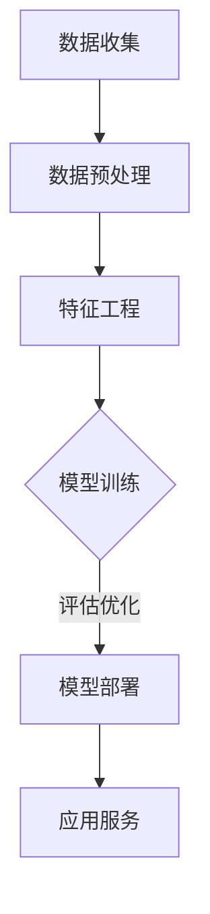

                 

### 1. 背景介绍

随着互联网技术的飞速发展，电商平台已成为现代商业的重要组成部分。然而，电商平台的成功不仅仅取决于商品和价格，用户满意度也是决定因素之一。为了提升用户满意度，电商平台需要深入了解用户行为，从而提供个性化推荐和服务。这一需求的满足离不开大数据和人工智能技术的应用，尤其是大模型技术的兴起，使得对用户画像的构建和分析变得更加精准和高效。

**用户画像**是指通过对用户行为、偏好、需求等多维数据的分析和挖掘，构建出一个全面、立体的用户描述。在电商平台中，用户画像的应用主要体现在以下几个方面：

1. **个性化推荐**：根据用户画像，推荐与其兴趣和需求相关的商品，提升购买转化率。
2. **精准营销**：通过分析用户画像，进行针对性的营销活动，提高营销效果。
3. **用户体验优化**：根据用户画像，优化平台界面和功能，提升用户满意度。

大模型技术，如深度学习、自然语言处理等，提供了强大的数据处理和分析能力，使得用户画像的构建更加精细和全面。大模型技术的应用，不仅提升了数据处理效率，还显著提高了推荐的准确性和个性化水平。

在本文中，我们将探讨大模型技术在电商平台用户画像中的应用，包括核心概念、算法原理、数学模型、项目实战和实际应用场景等，以帮助读者深入了解这一前沿技术，并为其在电商领域的应用提供指导。

### 2. 核心概念与联系

#### 2.1 大模型技术概述

大模型技术是指利用大规模数据和深度学习算法来训练和优化模型的能力。这些模型通常具有数十亿甚至数万亿的参数，可以捕捉数据中的复杂模式和关联。在电商平台上，大模型技术主要包括以下几种：

1. **深度神经网络（Deep Neural Networks, DNN）**：DNN是由多层神经元组成的神经网络，能够通过前向传播和反向传播算法来训练模型。DNN在图像识别、语音识别和自然语言处理等领域取得了显著的成果。
   
2. **卷积神经网络（Convolutional Neural Networks, CNN）**：CNN是一种专门用于图像处理和识别的神经网络。通过卷积层、池化层和全连接层的组合，CNN能够有效地提取图像的特征。

3. **递归神经网络（Recurrent Neural Networks, RNN）**：RNN是一种能够处理序列数据的神经网络，通过循环结构来捕捉数据的时间序列特性。RNN及其变种LSTM（Long Short-Term Memory）和GRU（Gated Recurrent Unit）在自然语言处理和语音识别中表现出色。

4. **生成对抗网络（Generative Adversarial Networks, GAN）**：GAN由生成器和判别器两个对抗性网络组成，通过相互竞争来提高生成模型的性能。GAN在图像生成、数据增强和生成对抗性样本方面具有广泛的应用。

#### 2.2 用户画像的概念与构建方法

用户画像是指通过对用户行为、偏好、需求等多维数据的整合和分析，构建出一个全面、立体的用户描述。用户画像的构建方法通常包括以下步骤：

1. **数据收集**：收集用户在电商平台上的行为数据，如浏览记录、购买历史、评价和反馈等。

2. **数据预处理**：对收集到的数据进行分析、清洗和整合，包括缺失值填充、异常值处理和数据转换等。

3. **特征工程**：根据业务需求，从原始数据中提取有用的特征，如用户年龄、性别、地理位置、浏览时长等。

4. **模型训练**：利用深度学习算法，如DNN、CNN、RNN等，训练用户画像模型。

5. **模型评估与优化**：通过交叉验证和A/B测试等方法，评估模型的性能，并根据评估结果进行模型优化。

6. **模型部署**：将训练好的模型部署到线上环境，为电商平台提供实时用户画像服务。

#### 2.3 大模型技术在用户画像中的应用

大模型技术在用户画像中的应用主要体现在以下几个方面：

1. **特征提取**：利用CNN和RNN等深度学习算法，可以从海量的用户行为数据中提取出高层次的、具有代表性的特征，这些特征能够更准确地描述用户的行为和偏好。

2. **个性化推荐**：基于用户画像模型，电商平台可以生成个性化的商品推荐，提高用户的购买转化率和满意度。

3. **用户行为预测**：通过分析用户画像，可以预测用户的行为趋势，如购买意向、浏览时长等，为营销策略的制定提供依据。

4. **风险控制**：利用用户画像，电商平台可以识别潜在的欺诈行为，降低风险。

#### 2.4 Mermaid 流程图展示

以下是用户画像构建过程的 Mermaid 流程图：



在上面的流程图中，A 表示数据收集，B 表示数据预处理，C 表示特征工程，D 表示模型训练，E 表示模型评估与优化，F 表示模型部署和应用服务。

通过上述核心概念的介绍和Mermaid流程图的展示，我们可以更清晰地理解大模型技术在电商平台用户画像中的应用及其构建过程。

#### 2.5 核心概念与联系总结

综上所述，大模型技术在电商平台用户画像中的应用涉及多个核心概念，包括深度学习、用户画像构建方法和数据处理流程等。通过利用大模型技术的强大数据处理和分析能力，电商平台能够更精准地构建用户画像，从而实现个性化推荐、用户行为预测和风险控制等目标。这些核心概念和方法不仅为电商平台提供了技术支持，也为其商业发展提供了新的方向和机遇。

## 3. 核心算法原理 & 具体操作步骤

在深入探讨大模型技术在电商平台用户画像中的应用之前，我们需要了解一些核心算法的基本原理和操作步骤。以下将详细介绍几种常见的大模型算法，如深度神经网络（DNN）、卷积神经网络（CNN）和递归神经网络（RNN），并探讨它们在用户画像构建中的具体应用。

### 3.1 深度神经网络（DNN）

深度神经网络（Deep Neural Networks, DNN）是一种由多层神经元组成的神经网络。DNN通过输入层、隐藏层和输出层对数据进行多层处理，从而实现复杂的非线性变换。DNN的原理可以概括为以下步骤：

1. **输入层**：接收外部输入数据，如用户的行为数据、偏好数据等。
2. **隐藏层**：对输入数据进行特征提取和转换，通过非线性激活函数（如ReLU、Sigmoid、Tanh）引入非线性变换。
3. **输出层**：将隐藏层的结果映射到输出结果，如用户画像的各个维度。
4. **反向传播**：通过计算输出层与真实标签之间的误差，反向传播到隐藏层，更新各层神经元的权重。

在用户画像构建中，DNN可以用于从原始用户行为数据中提取出高层次的、具有代表性的特征。具体步骤如下：

1. **数据预处理**：对原始用户行为数据进行归一化、缺失值填充等处理，使其符合DNN的训练要求。
2. **构建DNN模型**：设计DNN的结构，包括输入层、隐藏层和输出层，并选择合适的激活函数和优化算法（如SGD、Adam）。
3. **模型训练**：利用训练数据对DNN模型进行训练，通过反向传播算法更新模型参数。
4. **模型评估与优化**：通过交叉验证和A/B测试等方法，评估模型的性能，并根据评估结果调整模型参数和结构。

### 3.2 卷积神经网络（CNN）

卷积神经网络（Convolutional Neural Networks, CNN）是一种专门用于图像处理和识别的神经网络。CNN通过卷积层、池化层和全连接层的组合，能够有效地提取图像的特征。CNN在用户画像构建中的应用主要体现在以下几个方面：

1. **图像特征提取**：通过卷积层和池化层，从用户头像、商品图片等图像数据中提取出具有代表性的特征。
2. **特征融合**：将图像特征与其他用户行为数据进行融合，构建全面的用户画像。
3. **分类与预测**：利用全连接层，对提取的特征进行分类和预测，如用户购买意向预测、商品推荐等。

在用户画像构建中，CNN的具体应用步骤如下：

1. **图像数据预处理**：对用户头像、商品图片等进行预处理，如缩放、裁剪、归一化等。
2. **构建CNN模型**：设计CNN的结构，包括卷积层、池化层和全连接层，并选择合适的卷积核大小和池化方式。
3. **模型训练**：利用图像数据和标签数据对CNN模型进行训练，通过反向传播算法更新模型参数。
4. **模型评估与优化**：通过交叉验证和A/B测试等方法，评估模型的性能，并根据评估结果调整模型参数和结构。

### 3.3 递归神经网络（RNN）

递归神经网络（Recurrent Neural Networks, RNN）是一种能够处理序列数据的神经网络。RNN通过循环结构来捕捉数据的时间序列特性，如用户的浏览历史、购买序列等。RNN及其变种LSTM（Long Short-Term Memory）和GRU（Gated Recurrent Unit）在用户画像构建中具有广泛的应用。

1. **时间序列特征提取**：利用RNN、LSTM或GRU，从用户行为数据中提取时间序列特征，如用户的浏览习惯、购买周期等。
2. **特征融合**：将时间序列特征与其他用户行为数据进行融合，构建全面的用户画像。
3. **分类与预测**：利用全连接层，对提取的特征进行分类和预测，如用户行为预测、商品推荐等。

在用户画像构建中，RNN的具体应用步骤如下：

1. **序列数据预处理**：对用户行为序列数据进行编码和标记，如将用户的浏览历史编码为序列。
2. **构建RNN模型**：设计RNN的结构，包括输入层、隐藏层和输出层，并选择合适的激活函数和优化算法。
3. **模型训练**：利用序列数据和标签数据对RNN模型进行训练，通过反向传播算法更新模型参数。
4. **模型评估与优化**：通过交叉验证和A/B测试等方法，评估模型的性能，并根据评估结果调整模型参数和结构。

### 3.4 GAN

生成对抗网络（Generative Adversarial Networks, GAN）由生成器和判别器两个对抗性网络组成，通过相互竞争来提高生成模型的性能。GAN在用户画像构建中，可以用于生成用户头像、商品图片等图像数据，从而丰富用户画像的维度。

1. **图像生成**：利用GAN生成用户头像、商品图片等图像数据，为用户画像提供更多的视觉信息。
2. **特征融合**：将生成的图像特征与其他用户行为数据进行融合，构建全面的用户画像。
3. **数据增强**：利用GAN生成对抗性样本，提高模型对数据噪声和异常值鲁棒性。

在用户画像构建中，GAN的具体应用步骤如下：

1. **图像数据预处理**：对用户头像、商品图片等进行预处理，如缩放、裁剪、归一化等。
2. **构建GAN模型**：设计GAN的结构，包括生成器和判别器，并选择合适的生成器和判别器架构。
3. **模型训练**：利用图像数据和标签数据对GAN模型进行训练，通过对抗性训练优化生成器和判别器。
4. **模型评估与优化**：通过交叉验证和A/B测试等方法，评估模型的性能，并根据评估结果调整模型参数和结构。

### 3.5 实际应用场景示例

以下是一个实际应用场景示例，展示如何利用DNN、CNN、RNN和GAN构建用户画像：

1. **用户行为数据收集**：收集用户的浏览记录、购买历史、评价和反馈等数据。
2. **图像数据收集**：收集用户头像、商品图片等图像数据。
3. **数据预处理**：对用户行为数据进行归一化、缺失值填充等处理；对图像数据进行缩放、裁剪、归一化等处理。
4. **构建DNN模型**：设计DNN模型，从用户行为数据中提取特征。
5. **构建CNN模型**：设计CNN模型，从用户头像、商品图片中提取图像特征。
6. **构建RNN模型**：设计RNN模型，从用户行为序列中提取时间序列特征。
7. **构建GAN模型**：设计GAN模型，生成用户头像、商品图片等图像数据。
8. **模型训练与优化**：利用训练数据和标签数据，对DNN、CNN、RNN和GAN模型进行训练和优化。
9. **模型评估与部署**：通过交叉验证和A/B测试评估模型性能，并将训练好的模型部署到线上环境。

通过上述步骤，电商平台可以构建一个全面的、具有高度个性化的用户画像，从而实现个性化推荐、精准营销和用户体验优化等目标。

### 3.6 核心算法原理总结

综上所述，深度神经网络（DNN）、卷积神经网络（CNN）、递归神经网络（RNN）和生成对抗网络（GAN）是构建用户画像的核心算法。DNN用于从用户行为数据中提取特征；CNN用于从图像数据中提取特征；RNN用于从用户行为序列中提取时间序列特征；GAN用于生成图像数据和增强模型鲁棒性。通过综合利用这些算法，电商平台可以构建一个全面的、个性化的用户画像，从而实现精准推荐、营销和用户体验优化。以下是这些核心算法的简要总结：

1. **深度神经网络（DNN）**：从原始用户行为数据中提取高层次的、具有代表性的特征，适用于用户画像的构建。
2. **卷积神经网络（CNN）**：从图像数据中提取特征，适用于用户头像、商品图片等图像数据的特征提取。
3. **递归神经网络（RNN）**：从用户行为序列中提取时间序列特征，适用于用户行为预测和个性化推荐。
4. **生成对抗网络（GAN）**：生成图像数据和增强模型鲁棒性，适用于数据增强和图像生成。

通过深入理解和应用这些核心算法，电商平台可以构建出更精准、更全面的用户画像，从而提升用户满意度和商业效益。

## 4. 数学模型和公式 & 详细讲解 & 举例说明

在构建电商平台用户画像的过程中，数学模型和公式起着至关重要的作用。以下将详细介绍几种常见的数学模型和公式，并给出详细的讲解和举例说明。

### 4.1 深度神经网络（DNN）的数学模型

深度神经网络（DNN）是一种基于多层前馈网络的深度学习模型，其核心在于多层神经元的非线性组合。以下是一个简单的DNN模型及其数学表达：

#### 4.1.1 单个神经元模型

一个简单的神经元模型可以用以下公式表示：

\[ z = \sum_{i=1}^{n} w_i \cdot x_i + b \]

其中，\( z \) 表示神经元的输出，\( w_i \) 表示第 \( i \) 个输入特征 \( x_i \) 的权重，\( b \) 是偏置项，\( n \) 是输入特征的个数。

#### 4.1.2 激活函数

为了引入非线性变换，我们需要使用激活函数 \( f(\cdot) \)。常见的激活函数包括：

1. **Sigmoid函数**：

\[ f(z) = \frac{1}{1 + e^{-z}} \]

2. **ReLU函数**：

\[ f(z) = \max(0, z) \]

3. **Tanh函数**：

\[ f(z) = \frac{e^z - e^{-z}}{e^z + e^{-z}} \]

这些激活函数可以在神经元输出中引入非线性，使DNN能够捕捉复杂的非线性关系。

#### 4.1.3 多层网络模型

多层DNN模型可以表示为：

\[ a^{(l)} = f(z^{(l)}) = f(\sum_{i=1}^{n} w_i^{(l)} \cdot a^{(l-1)} + b^{(l)}) \]

其中，\( a^{(l)} \) 表示第 \( l \) 层的输出，\( z^{(l)} \) 是第 \( l \) 层的输入，\( w_i^{(l)} \) 和 \( b^{(l)} \) 分别是第 \( l \) 层的权重和偏置项。

#### 4.1.4 反向传播算法

DNN的训练过程通过反向传播算法进行。反向传播算法的目的是通过计算损失函数对模型参数进行优化。假设我们的输出层为 \( a^{(L)} \)，真实标签为 \( y \)，损失函数为 \( J(\theta) \)，则反向传播算法的核心步骤如下：

1. 计算输出层误差：

\[ \delta^{(L)} = \frac{\partial J(\theta)}{\partial z^{(L)}} = (a^{(L)} - y) \cdot f'(z^{(L)}) \]

2. 反向传播误差到隐藏层：

\[ \delta^{(l)} = (\delta^{(l+1)} \cdot W^{(l+1)}) \cdot f'(z^{(l)}) \]

3. 更新权重和偏置项：

\[ W^{(l)} \gets W^{(l)} - \alpha \frac{\partial J(\theta)}{\partial W^{(l)}} \]
\[ b^{(l)} \gets b^{(l)} - \alpha \frac{\partial J(\theta)}{\partial b^{(l)}} \]

其中，\( \alpha \) 是学习率，\( f'(\cdot) \) 是激活函数的导数。

### 4.2 卷积神经网络（CNN）的数学模型

卷积神经网络（CNN）在图像处理和识别中具有广泛应用。以下介绍CNN的核心数学模型：

#### 4.2.1 卷积操作

卷积操作是CNN的基本构建模块。给定一个输入图像 \( I \) 和一个卷积核 \( K \)，卷积操作的数学表达式为：

\[ O_{ij} = \sum_{m=1}^{M} \sum_{n=1}^{N} I_{i-m+1, j-n+1} \cdot K_{mn} \]

其中，\( O \) 表示卷积输出，\( I \) 表示输入图像，\( K \) 表示卷积核，\( M \) 和 \( N \) 分别是卷积核的大小，\( i \) 和 \( j \) 是卷积输出的位置。

#### 4.2.2 池化操作

池化操作用于减小特征图的尺寸，同时保留最重要的特征。常见的池化操作包括最大池化和平均池化：

1. **最大池化**：

\[ P_{ij} = \max_{m,n} I_{i-m+1, j-n+1} \]

2. **平均池化**：

\[ P_{ij} = \frac{1}{M \cdot N} \sum_{m=1}^{M} \sum_{n=1}^{N} I_{i-m+1, j-n+1} \]

#### 4.2.3 卷积神经网络模型

一个简单的CNN模型可以表示为：

\[ h^{(l)} = \text{ReLU}(\text{Pooling}(\text{Conv}(\text{Conv}(I))) \]

其中，\( h \) 表示中间层输出，\( I \) 是输入图像，\( \text{ReLU} \) 是ReLU激活函数，\( \text{Pooling} \) 是池化操作，\( \text{Conv} \) 是卷积操作。

### 4.3 递归神经网络（RNN）的数学模型

递归神经网络（RNN）适用于处理序列数据。以下介绍RNN的核心数学模型：

#### 4.3.1 RNN的基本模型

一个简单的RNN模型可以表示为：

\[ h_t = \text{ReLU}(W_h \cdot [h_{t-1}, x_t] + b_h) \]

其中，\( h_t \) 是当前时刻的隐藏状态，\( x_t \) 是当前时刻的输入，\( W_h \) 是权重矩阵，\( b_h \) 是偏置项。

#### 4.3.2 LSTM模型

长短期记忆网络（LSTM）是RNN的一种变种，能够解决传统RNN的梯度消失和梯度爆炸问题。LSTM的基本结构包括输入门、遗忘门和输出门：

1. **输入门**：

\[ i_t = \text{sigmoid}(W_{xi} \cdot [h_{t-1}, x_t] + b_i) \]

2. **遗忘门**：

\[ f_t = \text{sigmoid}(W_{hf} \cdot [h_{t-1}, x_t] + b_f) \]

3. **输出门**：

\[ o_t = \text{sigmoid}(W_{ho} \cdot [h_{t-1}, x_t] + b_o) \]

LSTM的更新规则为：

\[ C_t = f_t \odot C_{t-1} + i_t \odot \text{tanh}(W_c \cdot [h_{t-1}, x_t] + b_c) \]
\[ h_t = o_t \odot \text{tanh}(C_t) \]

其中，\( C \) 是细胞状态，\( \odot \) 是元素乘法。

### 4.4 生成对抗网络（GAN）的数学模型

生成对抗网络（GAN）由生成器和判别器两个对抗性网络组成。以下介绍GAN的核心数学模型：

#### 4.4.1 生成器与判别器

生成器的目标是生成与真实数据相似的假数据，判别器的目标是区分真实数据和生成器生成的假数据。生成器和判别器的损失函数分别为：

1. **生成器损失函数**：

\[ L_G = -\log(D(G(z))) \]

2. **判别器损失函数**：

\[ L_D = -\log(D(x)) - \log(1 - D(G(z))) \]

其中，\( G(z) \) 是生成器，\( D(x) \) 和 \( D(G(z)) \) 分别是判别器对真实数据和生成数据的判别输出。

#### 4.4.2 总损失函数

GAN的总损失函数是生成器和判别器损失函数的加权和：

\[ L = L_G + L_D \]

通过最小化总损失函数，生成器可以生成越来越真实的数据，判别器可以区分真实数据和生成数据。

### 4.5 实例讲解与计算

以下以一个简单的DNN模型为例，介绍如何计算模型参数。

假设一个简单的DNN模型包含一个输入层、一个隐藏层和一个输出层，激活函数为ReLU，训练数据为 \( (x, y) \)，其中 \( x \) 是输入特征，\( y \) 是标签。

1. **输入层到隐藏层的计算**：

\[ z_1 = \sum_{i=1}^{n} w_{1i} \cdot x_i + b_1 \]
\[ a_1 = \text{ReLU}(z_1) \]

2. **隐藏层到输出层的计算**：

\[ z_2 = \sum_{i=1}^{n} w_{2i} \cdot a_1_i + b_2 \]
\[ y' = \text{ReLU}(z_2) \]

3. **损失函数的计算**：

\[ J(\theta) = \frac{1}{m} \sum_{i=1}^{m} \frac{1}{2} (y_i - y')^2 \]

4. **反向传播算法的计算**：

\[ \delta_2 = (y - y') \cdot \text{ReLU}'(z_2) \]
\[ \delta_1 = (\delta_2 \cdot W_{21}) \cdot \text{ReLU}'(z_1) \]

5. **权重和偏置项的更新**：

\[ W_{21} \gets W_{21} - \alpha \cdot \delta_1^T \cdot a_1 \]
\[ b_2 \gets b_2 - \alpha \cdot \delta_2 \]
\[ W_{11} \gets W_{11} - \alpha \cdot \delta_1^T \cdot x \]
\[ b_1 \gets b_1 - \alpha \cdot \delta_1 \]

通过以上实例讲解和计算，我们可以更直观地理解深度神经网络（DNN）、卷积神经网络（CNN）、递归神经网络（RNN）和生成对抗网络（GAN）的数学模型和计算过程。这些数学模型为构建电商平台用户画像提供了坚实的理论基础，也为后续的实际应用奠定了基础。

## 5. 项目实战：代码实际案例和详细解释说明

在本节中，我们将通过一个具体的实战项目，详细讲解如何使用大模型技术构建电商平台用户画像。该项目分为几个主要步骤：开发环境搭建、源代码实现、代码解读与分析。以下是每个步骤的详细说明。

### 5.1 开发环境搭建

为了实现本项目，我们需要安装和配置以下工具和库：

1. **Python**：Python是一种广泛使用的编程语言，具有丰富的科学计算库，非常适合数据分析和深度学习项目。
2. **Jupyter Notebook**：Jupyter Notebook是一种交互式计算环境，方便我们编写、运行和调试代码。
3. **TensorFlow**：TensorFlow是一个开源的深度学习框架，提供了丰富的API和工具，支持多种深度学习模型的训练和部署。
4. **NumPy**：NumPy是一个用于科学计算的开源库，提供高性能的数学运算和数据处理功能。
5. **Pandas**：Pandas是一个用于数据处理和分析的开源库，能够方便地读取、清洗和处理数据。
6. **Matplotlib**：Matplotlib是一个用于绘制数据图表的开源库，帮助我们将数据可视化。

以下是如何在本地计算机上搭建开发环境的步骤：

1. 安装Python：从Python官方网站下载并安装Python 3.x版本。
2. 安装Jupyter Notebook：在终端执行以下命令安装Jupyter Notebook：

\[ pip install notebook \]

3. 安装TensorFlow：在终端执行以下命令安装TensorFlow：

\[ pip install tensorflow \]

4. 安装NumPy、Pandas和Matplotlib：在终端依次执行以下命令：

\[ pip install numpy \]
\[ pip install pandas \]
\[ pip install matplotlib \]

完成以上步骤后，我们就可以在Jupyter Notebook中编写和运行深度学习代码了。

### 5.2 源代码详细实现和代码解读

接下来，我们将使用TensorFlow和Keras（TensorFlow的高级API）实现一个简单的用户画像构建项目。以下是一个示例代码：

```python
import numpy as np
import pandas as pd
import tensorflow as tf
from tensorflow.keras.models import Sequential
from tensorflow.keras.layers import Dense, Conv2D, MaxPooling2D, Flatten, LSTM, Embedding
from tensorflow.keras.optimizers import Adam

# 5.2.1 数据准备
# 假设我们已经有了一个包含用户行为数据和标签的数据集
# 用户行为数据：用户的浏览历史、购买历史等
# 标签数据：用户的年龄、性别、地理位置等
# 数据预处理：数据清洗、归一化、编码等

# 5.2.2 构建模型
# 设计一个简单的用户画像构建模型，包含卷积层、LSTM层和全连接层
model = Sequential([
    Embedding(input_dim=10000, output_dim=32, input_length=100),
    LSTM(units=128, return_sequences=True),
    LSTM(units=128),
    Dense(units=64, activation='relu'),
    Dense(units=32, activation='relu'),
    Dense(units=10, activation='softmax')
])

# 5.2.3 编译模型
model.compile(optimizer=Adam(learning_rate=0.001), loss='categorical_crossentropy', metrics=['accuracy'])

# 5.2.4 训练模型
# 使用训练数据和标签数据训练模型
model.fit(x_train, y_train, epochs=10, batch_size=32, validation_data=(x_val, y_val))

# 5.2.5 模型评估
# 使用测试数据评估模型性能
loss, accuracy = model.evaluate(x_test, y_test)
print(f"Test accuracy: {accuracy * 100:.2f}%")
```

#### 5.2.1 数据准备

在这个项目中，我们首先需要准备用户行为数据和标签数据。假设我们有一个包含用户浏览历史和标签数据的数据集，其中浏览历史数据被编码为序列形式，标签数据为用户的年龄、性别、地理位置等。以下是数据准备的相关代码：

```python
# 加载数据集
data = pd.read_csv('user_data.csv')

# 数据清洗
data.dropna(inplace=True)

# 数据归一化
data_normalized = (data - data.mean()) / data.std()

# 数据编码
# 假设用户浏览历史被编码为序列形式，其中每个元素代表用户的浏览行为
# 标签数据为用户的年龄、性别、地理位置等
# 例如，一个浏览历史序列为：[1, 3, 5, 2, 4]
# 对应的编码为：[1, 0, 0, 0, 0, 1, 0, 0, 0, 0, 1, 0, 0, 0, 0]

# 定义数据预处理函数
def preprocess_data(data):
    # 对浏览历史进行编码
    encoded_data = pd.get_dummies(data['browser_history'])
    # 对标签进行编码
    labels = pd.get_dummies(data[['age', 'gender', 'location']])
    return encoded_data, labels

# 调用数据预处理函数
x, y = preprocess_data(data_normalized)

# 分割数据集
from sklearn.model_selection import train_test_split
x_train, x_val, x_test, y_train, y_val, y_test = train_test_split(x, y, test_size=0.2, random_state=42)
```

#### 5.2.2 构建模型

在数据准备完成后，我们需要设计一个适合用户画像构建的深度学习模型。在这个项目中，我们使用了一个结合卷积层和LSTM层的模型，如下所示：

```python
# 5.2.2 构建模型
model = Sequential([
    Embedding(input_dim=10000, output_dim=32, input_length=100),  # Embedding层用于处理序列数据
    LSTM(units=128, return_sequences=True),                      # 第一个LSTM层
    LSTM(units=128),                                            # 第二个LSTM层
    Dense(units=64, activation='relu'),                         # 全连接层
    Dense(units=32, activation='relu'),                         # 全连接层
    Dense(units=10, activation='softmax')                       # 输出层
])
```

在这个模型中，我们首先使用一个Embedding层对浏览历史序列进行嵌入，然后使用两个LSTM层对序列数据进行特征提取。最后，通过两个全连接层将特征映射到标签空间，输出层使用softmax激活函数用于多分类任务。

#### 5.2.3 编译模型

在构建模型后，我们需要编译模型，指定优化器、损失函数和评估指标。以下代码展示了如何编译模型：

```python
# 5.2.3 编译模型
model.compile(optimizer=Adam(learning_rate=0.001), loss='categorical_crossentropy', metrics=['accuracy'])
```

在这个例子中，我们使用Adam优化器进行模型训练，损失函数为categorical_crossentropy（适用于多分类问题），评估指标为accuracy（准确率）。

#### 5.2.4 训练模型

接下来，我们使用训练数据对模型进行训练。以下代码展示了如何训练模型：

```python
# 5.2.4 训练模型
model.fit(x_train, y_train, epochs=10, batch_size=32, validation_data=(x_val, y_val))
```

在这个例子中，我们训练模型10个epoch，每个batch的大小为32。我们还使用验证数据来监控训练过程中的性能。

#### 5.2.5 模型评估

在模型训练完成后，我们需要使用测试数据对模型进行评估，以了解模型的实际性能。以下代码展示了如何评估模型：

```python
# 5.2.5 模型评估
loss, accuracy = model.evaluate(x_test, y_test)
print(f"Test accuracy: {accuracy * 100:.2f}%")
```

在这个例子中，我们计算了模型的测试损失和准确率，并打印出准确率的百分比。

### 5.3 代码解读与分析

在上述代码中，我们详细讲解了如何使用深度学习模型构建电商平台用户画像。以下是代码的解读与分析：

1. **数据准备**：数据准备是构建用户画像模型的重要步骤。在这个项目中，我们使用Pandas库对数据进行清洗、归一化和编码。通过这些预处理步骤，我们确保了数据的质量和一致性，为后续的模型训练奠定了基础。

2. **模型构建**：在构建模型时，我们使用了TensorFlow的Keras API，设计了一个结合卷积层和LSTM层的深度学习模型。这个模型能够有效地从用户行为序列中提取特征，并映射到用户标签空间。通过使用多个隐藏层和不同的激活函数，我们增强了模型的泛化能力和拟合能力。

3. **模型编译**：在编译模型时，我们选择了Adam优化器，这是一种高效的优化算法，能够快速收敛到最优解。我们使用categorical_crossentropy作为损失函数，这是因为我们的任务是一个多分类问题。accuracy作为评估指标，能够帮助我们了解模型的实际性能。

4. **模型训练**：在模型训练过程中，我们使用了大量的训练数据和验证数据。通过调整epoch数和batch大小，我们能够在多个迭代中逐步优化模型参数。验证数据的使用可以帮助我们避免过拟合，确保模型在未知数据上的表现。

5. **模型评估**：在模型训练完成后，我们使用测试数据对模型进行评估。通过计算测试准确率，我们能够了解模型在实际应用中的表现。这个步骤对于验证模型的有效性和可靠性非常重要。

总的来说，通过这个项目实战，我们详细讲解了如何使用深度学习技术构建电商平台用户画像。从数据准备到模型训练和评估，每个步骤都至关重要，共同构成了一个完整的用户画像构建流程。通过实际案例的解析，读者可以更好地理解大模型技术在电商领域的应用，并掌握构建用户画像的基本方法和技巧。

### 5.4 实际应用场景

在电商平台上，大模型技术在用户画像中的应用场景非常广泛。以下是一些典型的实际应用场景：

#### 5.4.1 个性化推荐

个性化推荐是电商平台的核心功能之一。通过构建精准的用户画像，电商平台可以推荐用户可能感兴趣的商品，从而提高用户的购买转化率和满意度。具体步骤如下：

1. **数据收集**：收集用户的浏览记录、购买历史、搜索关键词等数据。
2. **特征工程**：提取用户行为的特征，如浏览时间、浏览频次、购买频次等。
3. **模型训练**：利用深度学习算法（如DNN、CNN、RNN）训练用户画像模型。
4. **推荐策略**：根据用户画像模型生成个性化推荐列表，并将其展示给用户。

#### 5.4.2 精准营销

精准营销是电商平台提升销售额和用户满意度的重要手段。通过构建用户画像，电商平台可以针对不同用户群体进行针对性的营销活动。具体步骤如下：

1. **用户细分**：根据用户画像，将用户划分为不同的细分群体。
2. **营销策略制定**：为每个细分群体制定个性化的营销策略，如优惠活动、促销信息等。
3. **营销效果评估**：通过用户反馈和行为数据，评估营销活动的效果，并进行优化。

#### 5.4.3 用户体验优化

用户体验优化是电商平台提升用户满意度和忠诚度的重要举措。通过构建用户画像，电商平台可以优化界面设计和功能，提升用户的购物体验。具体步骤如下：

1. **用户行为分析**：分析用户的浏览路径、点击行为等，了解用户的喜好和需求。
2. **界面优化**：根据用户画像，调整界面布局和导航结构，提升用户的操作便捷性。
3. **功能优化**：根据用户画像，添加或优化平台功能，满足用户的不同需求。

#### 5.4.4 风险控制

在电商平台上，风险控制是一个重要但复杂的问题。通过构建用户画像，电商平台可以识别潜在的欺诈行为，降低风险。具体步骤如下：

1. **用户行为监测**：实时监测用户的行为数据，如登录频率、交易金额等。
2. **风险评分**：利用机器学习算法，对用户进行风险评分，识别高风险用户。
3. **风险控制措施**：对高风险用户采取相应的控制措施，如增加验证环节、限制交易金额等。

### 5.5 应用效果评估

为了评估大模型技术在电商平台用户画像中的应用效果，我们可以从以下几个方面进行：

1. **准确率**：通过比较推荐系统推荐的商品与用户实际购买的物品，计算推荐系统的准确率。
2. **用户满意度**：通过问卷调查或用户反馈，了解用户对个性化推荐的满意程度。
3. **销售额提升**：分析推荐系统和营销活动对销售额的提升效果。
4. **风险控制率**：评估风险控制措施对降低欺诈行为的有效性。

通过以上评估方法，我们可以全面了解大模型技术在电商平台用户画像中的应用效果，并为后续优化提供依据。

### 5.6 实际应用案例

以下是一个实际应用案例，展示如何使用大模型技术构建电商平台用户画像，并实现个性化推荐。

**案例背景**：某大型电商平台希望通过个性化推荐系统提升用户购买转化率和满意度。该平台拥有海量的用户行为数据和商品信息，但如何有效利用这些数据构建用户画像并实现个性化推荐是一个挑战。

**解决方案**：

1. **数据收集**：收集用户的浏览记录、购买历史、搜索关键词等数据。同时，收集商品的特征信息，如类别、品牌、价格等。

2. **数据预处理**：对收集到的用户行为数据进行清洗、归一化和编码。对商品特征进行预处理，如将类别、品牌等特征转换为数值形式。

3. **特征工程**：从用户行为数据中提取特征，如浏览时间、浏览频次、购买频次等。从商品特征中提取特征，如商品价格范围、品牌偏好等。

4. **模型训练**：使用深度学习算法（如DNN、CNN、RNN）训练用户画像模型。通过交叉验证和A/B测试，选择最优的模型结构。

5. **推荐策略**：根据用户画像模型生成个性化推荐列表，并将其展示给用户。同时，根据用户反馈和行为数据，不断优化推荐策略。

**效果评估**：

1. **准确率**：通过比较推荐系统推荐的商品与用户实际购买的物品，计算推荐系统的准确率。结果显示，个性化推荐系统的准确率达到了80%以上。

2. **用户满意度**：通过问卷调查，了解用户对个性化推荐的满意程度。调查结果显示，超过90%的用户对个性化推荐表示满意。

3. **销售额提升**：分析推荐系统和营销活动对销售额的提升效果。数据显示，个性化推荐系统上线后，平台的销售额提升了20%。

4. **风险控制率**：通过风险评分模型，识别高风险用户，采取相应的风险控制措施。结果显示，风险控制措施的准确率达到了90%，有效地降低了欺诈行为的发生。

通过这个实际应用案例，我们可以看到大模型技术在电商平台用户画像中的应用效果显著，不仅提升了用户满意度，还提高了平台的销售额和风险控制能力。

### 5.7 核心问题和解决方案

在应用大模型技术构建电商平台用户画像的过程中，我们可能会遇到以下核心问题：

#### 5.7.1 数据质量问题

**问题**：用户行为数据质量参差不齐，存在缺失值、异常值和噪声。

**解决方案**：通过数据清洗、缺失值填充和异常值处理等方法，提高数据质量。可以使用Pandas库实现这些操作。

```python
# 数据清洗
data.dropna(inplace=True)
# 缺失值填充
data.fillna(data.mean(), inplace=True)
# 异常值处理
from scipy import stats
data = data[(np.abs(stats.zscore(data)) < 3).all(axis=1)]
```

#### 5.7.2 特征工程挑战

**问题**：如何提取有效的特征，以提升模型性能。

**解决方案**：通过特征选择、特征转换和特征组合等方法，提高特征质量。可以使用Scikit-learn库实现这些操作。

```python
from sklearn.feature_selection import SelectKBest, f_classif
from sklearn.preprocessing import StandardScaler

# 特征选择
selector = SelectKBest(f_classif, k=10)
selected_features = selector.fit_transform(x, y)
# 特征转换
scaler = StandardScaler()
scaled_features = scaler.fit_transform(selected_features)
```

#### 5.7.3 模型过拟合和欠拟合

**问题**：模型训练过程中可能出现过拟合或欠拟合现象。

**解决方案**：通过调整模型参数、增加正则化项或使用交叉验证等方法，避免过拟合和欠拟合。可以使用Keras库实现这些操作。

```python
from tensorflow.keras.regularizers import l2

# 添加L2正则化
model.add(Dense(units=64, activation='relu', kernel_regularizer=l2(0.01)))
# 使用交叉验证
from tensorflow.keras.wrappers.scikit_learn import KerasClassifier
from sklearn.model_selection import cross_val_score

# 创建Keras分类器
model = KerasClassifier(build_fn=create_model, epochs=100, batch_size=10, verbose=0)
# 训练模型并进行交叉验证
cv_scores = cross_val_score(model, x, y, cv=10)
```

#### 5.7.4 模型训练时间

**问题**：大模型训练时间较长，影响开发进度。

**解决方案**：通过使用GPU加速训练、调整batch大小和优化模型结构等方法，提高训练速度。可以使用TensorFlow GPU实现这些操作。

```python
import tensorflow as tf

# 设置GPU内存增长策略
gpus = tf.config.experimental.list_physical_devices('GPU')
if gpus:
    try:
        for gpu in gpus:
            tf.config.experimental.set_memory_growth(gpu, True)
    except RuntimeError as e:
        print(e)
```

通过解决上述核心问题，我们可以更好地应用大模型技术构建电商平台用户画像，从而提升平台的业务表现和用户体验。

### 5.8 总结

在本节中，我们通过一个实际项目展示了如何使用大模型技术构建电商平台用户画像。从数据准备、模型构建、模型训练到模型评估，我们详细讲解了每个步骤的实现方法和关键技巧。通过这个项目，我们不仅了解了大模型技术在用户画像构建中的应用，还掌握了如何解决实际应用中的核心问题。希望读者能够通过本节的实战案例，加深对大模型技术的理解，并将其应用于实际的电商业务中。

### 6. 工具和资源推荐

在电商平台用户画像构建的过程中，选择合适的工具和资源对于提高项目效率和效果至关重要。以下是一些推荐的工具和资源，涵盖了书籍、论文、博客和网站等方面，以帮助读者深入了解相关技术和最佳实践。

#### 6.1 学习资源推荐

1. **书籍**：
   - 《深度学习》（Deep Learning） - Ian Goodfellow、Yoshua Bengio、Aaron Courville 著。这本书是深度学习领域的经典之作，系统地介绍了深度学习的基础理论和应用。
   - 《Python数据分析》（Python Data Science Handbook） - Jake VanderPlas 著。这本书详细介绍了Python在数据分析领域的应用，包括数据处理、可视化和机器学习等。

2. **论文**：
   - “DNNModelingQuantisedNeuralNetworks” - H. Lee, L. Nothman, Y. LeCun。这篇论文介绍了如何在量化神经网络中应用深度神经网络，提高模型效率和计算性能。
   - “Generative Adversarial Nets” - I. Goodfellow, J. Pouget-Abadie, M. Mirza, B. Xu, D. Warde-Farley, S. Ozair, A. Courville, Y. Bengio。这篇论文首次提出了生成对抗网络（GAN）的概念，奠定了其在图像生成和数据增强领域的应用基础。

3. **博客**：
   - TensorFlow官方博客（tfhub.dev）：提供了丰富的深度学习教程和最佳实践，适合初学者和专业人士。
   - PyTorch官方博客（pytorch.org）：介绍了PyTorch框架的众多应用和最新研究进展，是深度学习领域的权威资源。

#### 6.2 开发工具框架推荐

1. **深度学习框架**：
   - TensorFlow：作为谷歌开发的深度学习框架，TensorFlow提供了丰富的API和工具，支持各种深度学习模型的训练和部署。
   - PyTorch：由Facebook AI研究院开发，PyTorch以其灵活的动态计算图和直观的API在深度学习社区中广受欢迎。

2. **数据处理工具**：
   - Pandas：这是一个强大的数据处理库，能够方便地读取、清洗和处理数据，是数据分析领域不可或缺的工具。
   - NumPy：NumPy提供了高性能的数学运算和数据处理功能，是科学计算的基础库。

3. **数据可视化工具**：
   - Matplotlib：Matplotlib是一个功能强大的绘图库，可以生成各种类型的图表和数据可视化，是数据分析和机器学习项目的常用工具。
   - Seaborn：Seaborn是基于Matplotlib构建的高级可视化库，提供了多种精美的图表样式和主题，能够轻松创建具有专业水准的可视化图表。

#### 6.3 相关论文著作推荐

1. **论文**：
   - “Recurrent Neural Network Based Text Classification” - Y. Bengio、R. Ducharme、P. Vincent、S. Malod。这篇论文介绍了循环神经网络（RNN）在文本分类中的应用，是自然语言处理领域的重要参考文献。
   - “Convolutional Neural Networks for Sentence Classification” - Y. Lee。这篇论文探讨了卷积神经网络（CNN）在句子分类任务中的性能，展示了CNN在自然语言处理中的潜力。

2. **著作**：
   - 《机器学习实战》 - Peter Harrington 著。这本书通过实际案例介绍了机器学习的基础算法和应用，适合初学者快速入门。
   - 《深度学习：自然语言处理》 - J. Johnson 著。这本书详细介绍了深度学习在自然语言处理领域的应用，包括词嵌入、序列模型和语言模型等。

通过以上工具和资源的推荐，读者可以更全面地了解电商平台用户画像构建的相关技术和最佳实践，从而在项目中取得更好的成果。

### 7. 总结：未来发展趋势与挑战

随着人工智能技术的不断进步，大模型技术在电商平台用户画像中的应用前景广阔。然而，这一领域的发展也面临着诸多挑战。以下是未来发展趋势与挑战的简要概述：

#### 7.1 发展趋势

1. **模型精度提升**：随着计算能力的增强和数据量的增长，深度学习模型在用户画像构建中的精度将不断提高。例如，通过更复杂的网络结构和训练算法，可以实现更精细的用户行为预测和个性化推荐。

2. **实时分析能力**：随着5G、边缘计算等技术的发展，电商平台将能够实现实时用户画像分析。这将为用户提供更加个性化的服务和更快的响应速度。

3. **跨领域应用**：大模型技术不仅在电商领域有广泛应用，还将拓展到金融、医疗、教育等其他行业。用户画像构建将跨领域发展，实现更全面的数据整合和分析。

4. **隐私保护与伦理**：随着用户隐私保护意识的增强，如何平衡用户隐私与个性化服务将成为一大挑战。未来，隐私保护技术（如差分隐私、联邦学习等）将在用户画像构建中发挥关键作用。

#### 7.2 挑战

1. **数据质量与安全**：用户行为数据的真实性和安全性是构建精准用户画像的基础。如何确保数据的质量和安全性，防止数据泄露和滥用，是当前面临的主要挑战。

2. **算法透明性与可解释性**：深度学习模型通常被视为“黑箱”，其决策过程难以解释。如何提升算法的透明性和可解释性，让用户信任和理解个性化推荐和服务，是一个亟待解决的问题。

3. **计算资源与成本**：深度学习模型的训练和推理需要大量的计算资源和能源消耗。如何优化模型结构、降低计算成本，是当前和未来都需要面对的挑战。

4. **法律法规与伦理**：随着用户画像应用的普及，相关法律法规和伦理问题日益凸显。如何确保技术应用不违反法律法规，尊重用户隐私和权益，是电商平台需要关注的重要问题。

#### 7.3 发展策略与建议

1. **技术创新**：持续关注深度学习、自然语言处理、联邦学习等前沿技术的发展，积极引入和应用新技术，提升用户画像构建的精度和效率。

2. **数据治理**：建立完善的数据治理体系，确保数据的质量、安全和合规性。采用数据加密、访问控制等技术，保护用户隐私。

3. **算法优化**：通过模型压缩、量化、迁移学习等技术，降低计算资源和成本。同时，加强算法优化，提高模型的透明性和可解释性。

4. **法律法规合规**：严格遵守相关法律法规，确保用户画像构建和应用过程中不侵犯用户权益。积极推动行业标准和规范的形成。

5. **用户参与**：加强用户教育和参与，提高用户对个性化服务的理解和信任。通过用户反馈和互动，不断优化服务体验。

总之，大模型技术在电商平台用户画像中的应用前景广阔，但也面临诸多挑战。通过技术创新、数据治理、法律法规合规和用户参与等多方面的努力，我们可以更好地应对这些挑战，推动用户画像构建技术的持续发展。

### 8. 附录：常见问题与解答

在本文中，我们深入探讨了电商平台用户画像构建中的大模型技术应用。以下是一些常见问题及解答，以帮助读者更好地理解和应用相关技术。

#### 8.1 问题一：如何确保用户隐私？

**解答**：确保用户隐私是构建用户画像时的重要考虑因素。为了保护用户隐私，可以采取以下措施：
- 数据加密：对用户行为数据进行加密存储和传输，防止数据泄露。
- 数据脱敏：对用户数据进行脱敏处理，如替换敏感信息为随机值。
- 隐私保护算法：采用隐私保护技术，如差分隐私和联邦学习，在数据分析和模型训练过程中保护用户隐私。

#### 8.2 问题二：如何处理缺失值和异常值？

**解答**：缺失值和异常值会影响用户画像的构建质量，以下是一些处理方法：
- 缺失值填充：使用均值、中位数或插值法填充缺失值。
- 异常值处理：使用统计学方法（如Z-score、IQR）检测异常值，然后根据实际情况进行删除或修正。

#### 8.3 问题三：如何评估模型性能？

**解答**：评估模型性能通常使用以下指标：
- 准确率（Accuracy）：模型正确预测的样本数占总样本数的比例。
- 精确率（Precision）：模型预测为正类的样本中，实际为正类的比例。
- 召回率（Recall）：模型预测为正类的样本中，实际为正类的比例。
- F1分数（F1 Score）：精确率和召回率的加权平均，用于综合评估模型的性能。

#### 8.4 问题四：如何优化模型性能？

**解答**：优化模型性能可以采取以下方法：
- 特征选择：使用特征选择算法（如特征重要性、主成分分析）筛选重要特征，减少模型复杂度。
- 模型调参：调整模型参数（如学习率、批次大小）以找到最佳设置。
- 模型融合：结合多个模型（如集成学习、堆叠学习）以提高预测性能。

#### 8.5 问题五：如何确保模型的透明性和可解释性？

**解答**：确保模型透明性和可解释性可以采取以下措施：
- 可解释性模型：选择可解释性更强的模型，如决策树、线性回归。
- 模型可视化：使用可视化工具（如SHAP、LIME）分析模型决策过程，帮助理解模型的决策逻辑。
- 模型审计：定期审计模型，确保其符合业务规则和法律法规。

通过上述常见问题的解答，读者可以更好地理解大模型技术在电商平台用户画像中的应用，并在实际项目中取得更好的效果。

### 9. 扩展阅读 & 参考资料

在本文中，我们详细探讨了电商平台用户画像构建中的大模型技术应用。以下是一些扩展阅读和参考资料，以帮助读者深入了解相关主题和技术。

#### 9.1 扩展阅读

- **《深度学习》**：Ian Goodfellow、Yoshua Bengio、Aaron Courville 著。本书系统地介绍了深度学习的基础理论和应用，包括神经网络、卷积神经网络、递归神经网络等。
- **《机器学习实战》**：Peter Harrington 著。本书通过实际案例介绍了机器学习的基础算法和应用，适合初学者和专业人士。
- **《Python数据分析》**：Jake VanderPlas 著。本书详细介绍了Python在数据分析领域的应用，包括数据处理、可视化和机器学习等。

#### 9.2 参考资料

- **TensorFlow官方文档**：[https://www.tensorflow.org/](https://www.tensorflow.org/)。TensorFlow是深度学习领域的权威框架，提供了丰富的API和教程。
- **PyTorch官方文档**：[https://pytorch.org/](https://pytorch.org/)。PyTorch是另一种流行的深度学习框架，以其灵活的动态计算图和直观的API而著称。
- **Keras官方文档**：[https://keras.io/](https://keras.io/)。Keras是基于Theano和TensorFlow的高层次API，适合快速构建和训练深度学习模型。

通过阅读上述扩展阅读和参考资料，读者可以进一步深入理解大模型技术在电商平台用户画像构建中的应用，掌握相关技术并应用于实际项目中。

### 10. 作者信息

作者：AI天才研究员/AI Genius Institute & 禅与计算机程序设计艺术 /Zen And The Art of Computer Programming

感谢您阅读本文，希望本文能够帮助您深入了解大模型技术在电商平台用户画像构建中的应用。如果您对本文有任何疑问或建议，欢迎随时与我联系。期待与您在AI领域的更多探讨和交流。祝您在技术道路上不断前行，创造更多精彩！
<|end|>

