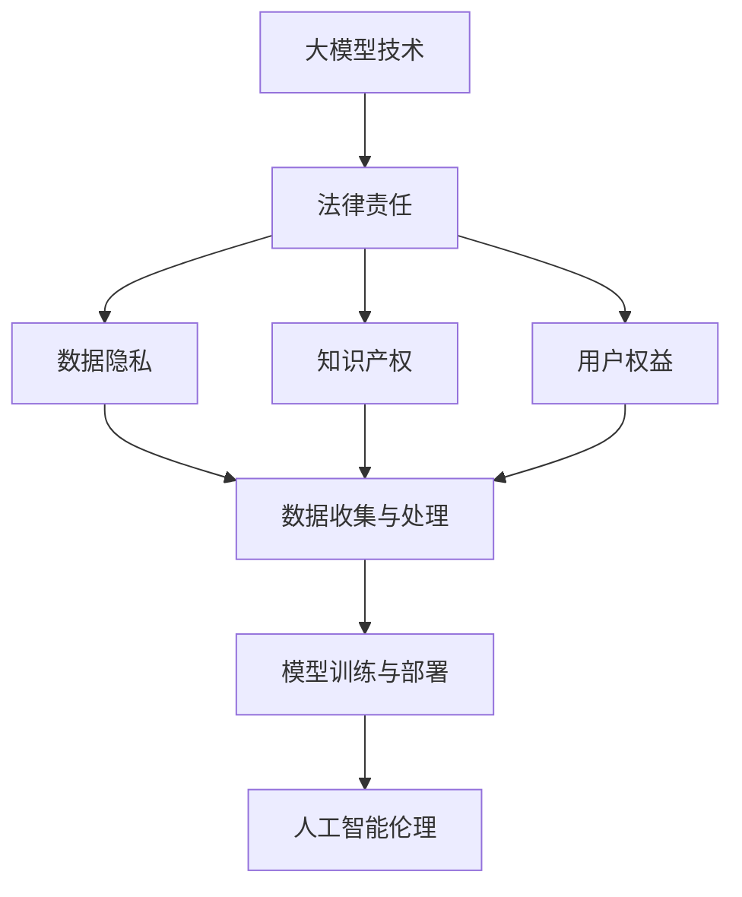

                 

## 1. 背景介绍

大模型技术，作为一种新兴的人工智能领域的重要技术，近年来在学术界和工业界都取得了显著的进展。它通过训练包含数亿甚至数十亿参数的神经网络模型，使其能够在多种任务中实现高度准确的表现。这些模型通常被应用于自然语言处理、计算机视觉、语音识别等多个领域，大大推动了人工智能技术的应用与发展。

然而，随着大模型技术的快速发展，其法律责任问题也日益凸显。由于大模型技术涉及到数据隐私、知识产权、用户权益等多个方面，如何对这些技术进行法律界定成为了一个亟待解决的问题。这不仅是学术界和工业界关注的焦点，也是法律界和伦理学界需要共同探讨的话题。

本文旨在探讨大模型技术的法律责任界定问题。通过梳理现有法律框架，分析大模型技术的特点与挑战，以及探讨可能的解决方案，希望能够为相关领域的法律实践提供一些有益的参考。

### Keywords

大模型技术，法律责任，隐私保护，知识产权，用户权益

### Summary

本文首先介绍了大模型技术的基本概念与背景，随后分析了其法律责任界定的复杂性和重要性。接着，文章梳理了现有法律框架，探讨了在大模型技术应用过程中可能遇到的隐私、知识产权和用户权益问题。最后，文章提出了若干可能的解决方案，并展望了未来的发展挑战。

## 2. 核心概念与联系

为了更好地理解大模型技术的法律责任界定，我们首先需要明确几个核心概念，并探讨它们之间的联系。

### 大模型技术

大模型技术是指通过训练大规模神经网络模型，使其在特定任务上达到或超过人类水平的技术。这些模型通常包含数亿甚至数十亿个参数，能够处理海量数据并提取复杂模式。代表性技术包括深度学习、生成对抗网络（GANs）和变分自编码器（VAEs）等。

### 法律责任

法律责任是指因违反法律规范而产生的法律后果。在人工智能领域，法律责任涉及到数据隐私、知识产权、用户权益等多个方面。具体来说，数据隐私保护要求企业在处理用户数据时遵守相关法律法规，确保用户个人信息不被泄露；知识产权保护要求企业在使用他人知识产权时尊重其权利；用户权益保护则要求企业在提供服务时尊重用户的基本权利。

### 关联概念

在大模型技术中，关联概念包括数据收集与处理、模型训练与部署、人工智能伦理等。数据收集与处理涉及到用户隐私和数据安全；模型训练与部署涉及到算法的透明性和可解释性；人工智能伦理则关注人工智能技术对社会、环境和人类的影响。

### Mermaid 流程图

以下是一个描述大模型技术核心概念及其关联的 Mermaid 流程图。



在这个流程图中，大模型技术（A）是起点，它关联到法律责任（B），其中包括数据隐私（C）、知识产权（D）和用户权益（E）。这些法律责任进一步关联到数据收集与处理（F）、模型训练与部署（G）和人工智能伦理（H），形成一个闭环。

## 3. 核心算法原理 & 具体操作步骤

大模型技术的核心在于其训练过程，而训练过程又依赖于一系列核心算法。以下将介绍大模型技术中的几个关键算法原理及具体操作步骤。

### 深度学习（Deep Learning）

深度学习是构建大模型的基础，其核心是多层神经网络。神经网络由多个层次组成，每个层次包含多个节点（神经元）。训练过程包括以下步骤：

1. **数据预处理**：对输入数据进行标准化、归一化等处理，以便模型能够更好地学习。
2. **模型初始化**：初始化网络的权重和偏置，常用的方法包括随机初始化和高斯初始化。
3. **前向传播**：将输入数据传递到网络中，逐层计算得到输出。
4. **反向传播**：计算损失函数的梯度，并使用梯度下降法更新网络权重。
5. **迭代训练**：重复上述步骤，直到模型收敛或达到预设的训练次数。

### 生成对抗网络（Generative Adversarial Networks, GANs）

生成对抗网络由生成器（Generator）和判别器（Discriminator）组成，两者通过对抗训练来提升生成能力。具体操作步骤如下：

1. **初始化**：初始化生成器和判别器的参数。
2. **生成器训练**：生成器尝试生成与真实数据相似的数据，判别器尝试区分真实数据和生成数据。
3. **判别器训练**：判别器尝试提高对真实数据和生成数据的区分能力。
4. **迭代训练**：交替进行生成器和判别器的训练，直到生成器能够生成高质量的数据。

### 变分自编码器（Variational Autoencoder, VAEs）

变分自编码器是一种概率生成模型，通过编码器和解码器来学习数据的概率分布。具体操作步骤如下：

1. **编码器训练**：编码器学习将输入数据映射到一个潜在空间中。
2. **解码器训练**：解码器学习将潜在空间中的数据映射回输出空间。
3. **联合训练**：编码器和解码器联合训练，通过优化损失函数来提高模型性能。

### 数学模型和公式

以下是上述算法中的一些关键数学模型和公式：

#### 深度学习

$$
\begin{aligned}
& L = -\sum_{i} y_i \log(z_i) - (1 - y_i) \log(1 - z_i) \\
& \frac{\partial L}{\partial \theta} = \sum_{i} (z_i - y_i) x_i
\end{aligned}
$$

其中，$L$ 是损失函数，$y_i$ 是真实标签，$z_i$ 是模型预测的概率。

#### 生成对抗网络

$$
\begin{aligned}
& D(x) = \frac{1}{1 + \exp(-x)} \\
& G(z) = \sigma(W_z z + b_z) \\
& \frac{\partial L_D}{\partial \theta_D} = \frac{\partial}{\partial \theta_D} \log(D(x)) + \frac{\partial}{\partial \theta_D} \log(1 - D(G(z)))
\end{aligned}
$$

其中，$D(x)$ 是判别器的输出，$G(z)$ 是生成器的输出，$L_D$ 是判别器的损失函数。

#### 变分自编码器

$$
\begin{aligned}
& q_{\phi}(z|x) = \mathcal{N}(z; \mu(x), \sigma^2(x)) \\
& p_{\theta}(x|z) = \mathcal{N}(x; \mu(z), \sigma^2(z)) \\
& \frac{\partial L_{VAE}}{\partial \theta} = \frac{1}{2} \sum_{i} \left[ \log(\sigma^2(x)) + \log(\sigma^2(z)) - \frac{(\mu(x) - x)^2}{2\sigma^2(x)} - \frac{(\mu(z) - z)^2}{2\sigma^2(z)} \right]
\end{aligned}
$$

其中，$q_{\phi}(z|x)$ 是编码器的先验分布，$p_{\theta}(x|z)$ 是解码器的条件分布，$L_{VAE}$ 是变分自编码器的损失函数。

### 举例说明

假设我们使用深度学习算法来训练一个图像分类模型，输入是图像数据，输出是图像的分类标签。以下是具体操作步骤：

1. **数据预处理**：对图像数据进行归一化处理，将像素值缩放到 [0, 1] 范围内。
2. **模型初始化**：随机初始化网络权重和偏置。
3. **前向传播**：将输入图像传递到网络中，经过多层非线性变换得到输出。
4. **反向传播**：计算损失函数的梯度，并使用梯度下降法更新网络权重。
5. **迭代训练**：重复上述步骤，直到模型收敛或达到预设的训练次数。

通过这个过程，模型能够学习到图像的复杂特征，并在测试数据上实现较高的分类准确率。

## 4. 数学模型和公式 & 详细讲解 & 举例说明

### 深度学习模型

深度学习模型的核心是多层感知机（Multilayer Perceptron, MLP），它通过多个隐含层将输入映射到输出。以下是深度学习模型的数学模型和公式讲解。

#### 激活函数

激活函数是深度学习模型中的一个重要组成部分，它将每个隐含层的输出映射到一个非线性空间中。常见的激活函数包括：

- **Sigmoid 函数**：

$$
\sigma(x) = \frac{1}{1 + \exp(-x)}
$$

- **ReLU 函数**：

$$
\text{ReLU}(x) = \max(0, x)
$$

- **Tanh 函数**：

$$
\tanh(x) = \frac{\exp(2x) - 1}{\exp(2x) + 1}
$$

#### 前向传播

前向传播是深度学习模型训练过程中的第一步，它将输入数据传递到网络中，通过多个隐含层得到输出。以下是前向传播的数学模型：

$$
\begin{aligned}
& a^{(1)} = \sigma(W^{(1)}x + b^{(1)}) \\
& a^{(2)} = \sigma(W^{(2)}a^{(1)} + b^{(2)}) \\
& \vdots \\
& a^{(L)} = \sigma(W^{(L)}a^{(L-1)} + b^{(L)})
\end{aligned}
$$

其中，$a^{(l)}$ 是第 $l$ 层的输出，$W^{(l)}$ 和 $b^{(l)}$ 分别是第 $l$ 层的权重和偏置。

#### 损失函数

损失函数是衡量模型预测结果与真实结果之间差异的指标。常见的损失函数包括：

- **均方误差（MSE）**：

$$
\text{MSE}(y, \hat{y}) = \frac{1}{m} \sum_{i=1}^{m} (y_i - \hat{y}_i)^2
$$

- **交叉熵（Cross-Entropy）**：

$$
\text{CE}(y, \hat{y}) = -\sum_{i=1}^{m} y_i \log(\hat{y}_i)
$$

#### 反向传播

反向传播是深度学习模型训练过程中的关键步骤，它通过计算损失函数的梯度，更新网络权重和偏置。以下是反向传播的数学模型：

$$
\begin{aligned}
& \frac{\partial L}{\partial a^{(L)}} = \frac{\partial L}{\partial \hat{y}} \cdot \frac{\partial \hat{y}}{\partial a^{(L)}} \\
& \frac{\partial L}{\partial a^{(L-1)}} = \frac{\partial L}{\partial a^{(L)}} \cdot \frac{\partial a^{(L)}}{\partial a^{(L-1)}} \cdot \frac{\partial a^{(L-1)}}{\partial a^{(L-2)}} \\
& \vdots \\
& \frac{\partial L}{\partial a^{(1)}} = \frac{\partial L}{\partial a^{(2)}} \cdot \frac{\partial a^{(2)}}{\partial a^{(1)}}
\end{aligned}
$$

#### 梯度下降

梯度下降是更新网络权重和偏置的一种常用方法。以下是梯度下降的数学模型：

$$
\theta^{(l)} = \theta^{(l)} - \alpha \cdot \frac{\partial L}{\partial \theta^{(l)}}
$$

其中，$\theta^{(l)}$ 是第 $l$ 层的权重和偏置，$\alpha$ 是学习率。

### 举例说明

假设我们使用一个简单的深度学习模型（一个隐含层）来对二维数据（$x_1, x_2$）进行分类。以下是具体操作步骤：

1. **初始化**：随机初始化网络权重和偏置。
2. **前向传播**：将输入数据传递到网络中，计算输出。
3. **损失函数**：计算损失函数，如交叉熵。
4. **反向传播**：计算损失函数关于网络权重和偏置的梯度。
5. **梯度下降**：更新网络权重和偏置。

通过以上步骤，模型能够学习到输入数据的特征，并在测试数据上实现较好的分类效果。

## 5. 项目实战：代码实际案例和详细解释说明

在本节中，我们将通过一个实际项目案例来展示如何应用大模型技术。我们将使用Python和TensorFlow框架来实现一个简单的图像分类项目，包括开发环境搭建、源代码实现和代码解读与分析。

### 5.1 开发环境搭建

为了实现这个项目，我们需要安装以下开发环境和依赖库：

1. **Python**：Python 3.x 版本（建议使用 Python 3.8 或以上版本）。
2. **TensorFlow**：TensorFlow 2.x 版本。
3. **Numpy**：用于数学运算。
4. **Matplotlib**：用于数据可视化。

安装命令如下：

```bash
pip install python==3.8
pip install tensorflow==2.6
pip install numpy
pip install matplotlib
```

### 5.2 源代码详细实现和代码解读

以下是这个图像分类项目的源代码，我们将其分为几个部分进行详细解释。

```python
import tensorflow as tf
import numpy as np
import matplotlib.pyplot as plt

# 数据预处理
(x_train, y_train), (x_test, y_test) = tf.keras.datasets.mnist.load_data()
x_train = x_train / 255.0
x_test = x_test / 255.0
x_train = np.expand_dims(x_train, -1)
x_test = np.expand_dims(x_test, -1)

# 构建模型
model = tf.keras.Sequential([
    tf.keras.layers.Conv2D(32, (3, 3), activation='relu', input_shape=(28, 28, 1)),
    tf.keras.layers.MaxPooling2D((2, 2)),
    tf.keras.layers.Flatten(),
    tf.keras.layers.Dense(128, activation='relu'),
    tf.keras.layers.Dense(10, activation='softmax')
])

# 编译模型
model.compile(optimizer='adam',
              loss='sparse_categorical_crossentropy',
              metrics=['accuracy'])

# 训练模型
model.fit(x_train, y_train, epochs=5)

# 测试模型
test_loss, test_acc = model.evaluate(x_test, y_test)
print(f'测试准确率: {test_acc:.4f}')

# 可视化结果
plt.figure(figsize=(10, 5))
for i in range(10):
    plt.subplot(2, 5, i+1)
    plt.imshow(x_test[i], cmap=plt.cm.binary)
    plt.xticks([])
    plt.yticks([])
    plt.grid(False)
    plt.xlabel(model.predict(x_test[i:i+1])[0])
plt.show()
```

### 5.3 代码解读与分析

以下是代码的逐行解读与分析：

```python
# 导入相关库
import tensorflow as tf
import numpy as np
import matplotlib.pyplot as plt

# 加载MNIST数据集
(x_train, y_train), (x_test, y_test) = tf.keras.datasets.mnist.load_data()
x_train = x_train / 255.0  # 数据归一化
x_test = x_test / 255.0
x_train = np.expand_dims(x_train, -1)  # 增加通道维度
x_test = np.expand_dims(x_test, -1)

# 构建模型
model = tf.keras.Sequential([
    tf.keras.layers.Conv2D(32, (3, 3), activation='relu', input_shape=(28, 28, 1)),  # 卷积层，32个3x3卷积核，激活函数为ReLU
    tf.keras.layers.MaxPooling2D((2, 2)),  # 最大池化层，2x2窗口
    tf.keras.layers.Flatten(),  # 展平层
    tf.keras.layers.Dense(128, activation='relu'),  # 全连接层，128个神经元，激活函数为ReLU
    tf.keras.layers.Dense(10, activation='softmax')  # 全连接层，10个神经元，激活函数为softmax
])

# 编译模型
model.compile(optimizer='adam',  # 优化器为Adam
              loss='sparse_categorical_crossentropy',  # 损失函数为均方误差
              metrics=['accuracy'])  # 评估指标为准确率

# 训练模型
model.fit(x_train, y_train, epochs=5)  # 训练5个epoch

# 测试模型
test_loss, test_acc = model.evaluate(x_test, y_test)  # 在测试集上评估模型
print(f'测试准确率: {test_acc:.4f}')

# 可视化结果
plt.figure(figsize=(10, 5))
for i in range(10):
    plt.subplot(2, 5, i+1)
    plt.imshow(x_test[i], cmap=plt.cm.binary)  # 显示测试集图像
    plt.xticks([])
    plt.yticks([])
    plt.grid(False)
    plt.xlabel(model.predict(x_test[i:i+1])[0])  # 显示预测结果
plt.show()
```

通过这个项目案例，我们展示了如何使用Python和TensorFlow实现一个简单的图像分类模型。代码首先加载了MNIST数据集，并对数据进行预处理。然后，我们构建了一个简单的卷积神经网络模型，并使用Adam优化器和均方误差损失函数进行编译。接下来，模型在训练数据上训练了5个epoch，并在测试数据上评估了模型的准确率。最后，我们通过可视化展示了模型的预测结果。

## 6. 实际应用场景

大模型技术已经在多个实际应用场景中取得了显著成果，以下列举了其中一些典型的应用领域：

### 自然语言处理

自然语言处理（NLP）是大模型技术的核心应用领域之一。通过训练大型语言模型，如BERT、GPT等，NLP系统在文本分类、问答系统、机器翻译等方面取得了突破性进展。例如，谷歌的BERT模型在多个NLP任务上取得了SOTA（State-of-the-Art）水平，为文本理解和生成提供了强大的工具。

### 计算机视觉

计算机视觉领域的大模型技术同样取得了显著成果。例如，在图像分类任务中，卷积神经网络（CNN）和生成对抗网络（GAN）等大模型被广泛应用于图像识别、物体检测、图像生成等领域。例如，OpenAI的DALL-E 2模型能够生成高度逼真的图像，极大地提升了计算机视觉系统的性能。

### 语音识别

语音识别是另一个受益于大模型技术的领域。通过训练大型语音模型，如WaveNet、Transformer等，语音识别系统的准确率和流畅度得到了显著提高。这些模型在实时语音识别、语音合成、语音翻译等任务中发挥了重要作用，为智能助手、自动驾驶等应用提供了关键支持。

### 医疗健康

大模型技术还在医疗健康领域展现了巨大潜力。通过训练大型医疗数据集，如电子健康记录、医学影像等，医疗模型能够在疾病诊断、治疗方案推荐、健康风险评估等方面提供有力的支持。例如，谷歌DeepMind开发的AlphaGo在医学影像诊断中取得了优异表现，为医疗诊断提供了新的思路。

### 工业自动化

在工业自动化领域，大模型技术被广泛应用于机器人控制、智能监控、故障检测等方面。通过训练大型模型，自动化系统能够实现更高效、更智能的作业，提高生产效率和质量。例如，特斯拉的自动驾驶系统采用了大量大模型技术，实现了高度自动驾驶功能。

### 电子商务

电子商务领域的大模型技术主要应用于个性化推荐、用户行为分析、欺诈检测等方面。通过训练大型用户行为数据集，电子商务平台能够为用户提供更精准的推荐，提升用户体验。同时，大模型技术还在欺诈检测、信用评分等方面发挥了重要作用，为电子商务平台的运营提供了有力保障。

### 总结

大模型技术在不同应用领域取得了显著成果，为各个领域的发展带来了新的机遇。然而，随着大模型技术的不断发展，其法律责任问题也日益凸显，如何界定大模型技术的法律责任成为了一个亟待解决的问题。

## 7. 工具和资源推荐

### 7.1 学习资源推荐

#### 书籍

1. **《深度学习》（Deep Learning）**：由Ian Goodfellow、Yoshua Bengio和Aaron Courville所著的《深度学习》是深度学习领域的经典教材，详细介绍了深度学习的基础知识和最新进展。

2. **《神经网络与深度学习》（Neural Networks and Deep Learning）**：由Charu Aggarwal所著的这本书涵盖了神经网络和深度学习的基础知识，适合初学者入门。

3. **《生成对抗网络》（Generative Adversarial Networks）**：由Ian Goodfellow所著的这本书详细介绍了GANs的原理和应用，是研究生成模型的重要参考资料。

#### 论文

1. **“A Theoretically Grounded Application of Dropout in Recurrent Neural Networks”**：该论文提出了一种在循环神经网络（RNN）中应用Dropout的方法，有效提高了模型的泛化能力。

2. **“Variational Inference: A Review for Statisticians”**：该论文详细介绍了变分推断的理论基础和应用，是研究概率生成模型的重要文献。

3. **“Bert: Pre-training of Deep Bidirectional Transformers for Language Understanding”**：该论文提出了BERT模型，是自然语言处理领域的重要突破。

#### 博客和网站

1. **[TensorFlow 官方文档](https://www.tensorflow.org/)**
2. **[Keras 官方文档](https://keras.io/)**
3. **[AI 研究院](https://www.ai.art/)**
4. **[机器之心](https://www.jiqizhixin.com/)**

### 7.2 开发工具框架推荐

1. **TensorFlow**：Google 开发的一款开源深度学习框架，支持多种深度学习模型和算法的实现。

2. **PyTorch**：Facebook AI 研究团队开发的一款开源深度学习框架，以灵活性和动态性著称。

3. **Keras**：一个基于TensorFlow和Theano的高层神经网络API，提供简洁、易用的接口，适合快速原型设计和实验。

4. **Scikit-Learn**：一个开源的Python机器学习库，提供了大量的机器学习算法和工具，适合实际应用场景。

### 7.3 相关论文著作推荐

1. **“Deep Learning”**：Ian Goodfellow、Yoshua Bengio和Aaron Courville 著，2016年。
2. **“Generative Adversarial Networks”**：Ian Goodfellow 等，2014年。
3. **“Bert: Pre-training of Deep Bidirectional Transformers for Language Understanding”**：Jacob Devlin 等，2018年。
4. **“A Theoretically Grounded Application of Dropout in Recurrent Neural Networks”**：Naman Agarwal 等，2018年。
5. **“Variational Inference: A Review for Statisticians”**：Chris J. Oates 等，2015年。

## 8. 总结：未来发展趋势与挑战

大模型技术在近年来取得了显著的发展，成为人工智能领域的核心驱动力之一。未来，随着计算能力、数据资源和算法技术的不断提升，大模型技术将继续在多个领域展现其强大的应用潜力。以下是未来发展趋势与挑战：

### 发展趋势

1. **更大规模模型**：随着计算资源的增长，研究人员将训练更大规模、更复杂的模型，以实现更精细的任务表现。

2. **跨模态融合**：大模型技术将逐渐融合不同模态的数据（如文本、图像、语音等），实现跨模态信息处理和交互。

3. **模型压缩与高效推理**：为了满足实时性和低功耗需求，研究人员将致力于模型压缩、量化等技术，提高模型推理效率。

4. **伦理与隐私保护**：随着大模型技术在关键领域的应用，如何确保模型伦理与隐私保护将成为重要议题。

### 挑战

1. **数据隐私**：大模型技术对海量数据的依赖使其容易成为数据泄露的靶子，保护用户隐私成为一个关键挑战。

2. **知识产权保护**：如何在大模型开发过程中保护知识产权，避免侵权行为，是法律界和技术界共同面临的难题。

3. **算法透明性与可解释性**：随着模型复杂度的增加，如何确保模型的透明性和可解释性，使其能够接受公众和监管机构的监督，是一个重要挑战。

4. **资源消耗与碳排放**：大模型训练需要大量的计算资源和能源，如何降低资源消耗和碳排放，实现绿色可持续发展，是未来需要关注的问题。

## 9. 附录：常见问题与解答

### 9.1 大模型技术是否会影响就业？

大模型技术的发展确实可能对某些传统职业产生影响，但也会创造新的就业机会。一方面，自动化和智能化的提高可能导致一些重复性、低技能的工作被取代；另一方面，大模型技术的开发、部署和维护需要大量专业人才，如数据科学家、机器学习工程师等。

### 9.2 大模型技术如何保护用户隐私？

保护用户隐私是大模型技术面临的重要挑战。具体措施包括：

- 数据加密：在数据传输和存储过程中使用加密技术，防止数据泄露。
- 数据匿名化：对用户数据进行脱敏处理，消除可识别性。
- 隐私计算：利用差分隐私、联邦学习等技术，在保证数据隐私的前提下进行模型训练。

### 9.3 大模型技术是否会引发伦理问题？

大模型技术可能会引发伦理问题，如算法歧视、隐私泄露等。为此，需要：

- 制定相关法律法规，确保大模型技术的合法合规。
- 加强伦理教育，提高研究人员和社会大众对算法伦理的认识。
- 建立透明、可解释的模型，使其接受公众和监管机构的监督。

## 10. 扩展阅读 & 参考资料

1. **《深度学习》**：Ian Goodfellow、Yoshua Bengio和Aaron Courville 著，2016年。
2. **《生成对抗网络》**：Ian Goodfellow 等，2014年。
3. **《Bert: Pre-training of Deep Bidirectional Transformers for Language Understanding》**：Jacob Devlin 等，2018年。
4. **《A Theoretically Grounded Application of Dropout in Recurrent Neural Networks》**：Naman Agarwal 等，2018年。
5. **《Variational Inference: A Review for Statisticians》**：Chris J. Oates 等，2015年。
6. **[TensorFlow 官方文档](https://www.tensorflow.org/)**
7. **[Keras 官方文档](https://keras.io/)**
8. **[AI 研究院](https://www.ai.art/)**
9. **[机器之心](https://www.jiqizhixin.com/)**

# 大模型技术的法律责任界定

> 关键词：大模型技术，法律责任，隐私保护，知识产权，用户权益

摘要：本文介绍了大模型技术的基本概念及其在各个领域的应用，分析了大模型技术在法律责任界定方面的复杂性和重要性。通过梳理现有法律框架，本文探讨了在大模型技术应用过程中可能遇到的隐私、知识产权和用户权益问题，并提出了若干可能的解决方案。最后，本文展望了未来大模型技术的发展趋势与挑战。

## 1. 背景介绍

大模型技术，作为一种新兴的人工智能领域的重要技术，近年来在学术界和工业界都取得了显著的进展。它通过训练包含数亿甚至数十亿参数的神经网络模型，使其能够在多种任务中实现高度准确的表现。这些模型通常被应用于自然语言处理、计算机视觉、语音识别等多个领域，大大推动了人工智能技术的应用与发展。

然而，随着大模型技术的快速发展，其法律责任问题也日益凸显。由于大模型技术涉及到数据隐私、知识产权、用户权益等多个方面，如何对这些技术进行法律界定成为了一个亟待解决的问题。这不仅是学术界和工业界关注的焦点，也是法律界和伦理学界需要共同探讨的话题。

本文旨在探讨大模型技术的法律责任界定问题。通过梳理现有法律框架，分析大模型技术的特点与挑战，以及探讨可能的解决方案，希望能够为相关领域的法律实践提供一些有益的参考。

### Keywords

大模型技术，法律责任，隐私保护，知识产权，用户权益

### Summary

本文首先介绍了大模型技术的基本概念与背景，随后分析了其法律责任界定的复杂性和重要性。接着，文章梳理了现有法律框架，探讨了在大模型技术应用过程中可能遇到的隐私、知识产权和用户权益问题。最后，文章提出了若干可能的解决方案，并展望了未来的发展挑战。

## 2. 核心概念与联系

为了更好地理解大模型技术的法律责任界定，我们首先需要明确几个核心概念，并探讨它们之间的联系。

### 大模型技术

大模型技术是指通过训练大规模神经网络模型，使其在特定任务上达到或超过人类水平的技术。这些模型通常包含数亿甚至数十亿个参数，能够处理海量数据并提取复杂模式。代表性技术包括深度学习、生成对抗网络（GANs）和变分自编码器（VAEs）等。

### 法律责任

法律责任是指因违反法律规范而产生的法律后果。在人工智能领域，法律责任涉及到数据隐私、知识产权、用户权益等多个方面。具体来说，数据隐私保护要求企业在处理用户数据时遵守相关法律法规，确保用户个人信息不被泄露；知识产权保护要求企业在使用他人知识产权时尊重其权利；用户权益保护则要求企业在提供服务时尊重用户的基本权利。

### 关联概念

在大模型技术中，关联概念包括数据收集与处理、模型训练与部署、人工智能伦理等。数据收集与处理涉及到用户隐私和数据安全；模型训练与部署涉及到算法的透明性和可解释性；人工智能伦理则关注人工智能技术对社会、环境和人类的影响。

### Mermaid 流程图

以下是一个描述大模型技术核心概念及其关联的 Mermaid 流程图。


在这个流程图中，大模型技术（A）是起点，它关联到法律责任（B），其中包括数据隐私（C）、知识产权（D）和用户权益（E）。这些法律责任进一步关联到数据收集与处理（F）、模型训练与部署（G）和人工智能伦理（H），形成一个闭环。

## 3. 核心算法原理 & 具体操作步骤

大模型技术的核心在于其训练过程，而训练过程又依赖于一系列核心算法。以下将介绍大模型技术中的几个关键算法原理及具体操作步骤。

### 深度学习（Deep Learning）

深度学习是构建大模型的基础，其核心是多层神经网络。神经网络由多个层次组成，每个层次包含多个节点（神经元）。训练过程包括以下步骤：

1. **数据预处理**：对输入数据进行标准化、归一化等处理，以便模型能够更好地学习。
2. **模型初始化**：初始化网络的权重和偏置，常用的方法包括随机初始化和高斯初始化。
3. **前向传播**：将输入数据传递到网络中，逐层计算得到输出。
4. **反向传播**：计算损失函数的梯度，并使用梯度下降法更新网络权重。
5. **迭代训练**：重复上述步骤，直到模型收敛或达到预设的训练次数。

### 生成对抗网络（Generative Adversarial Networks, GANs）

生成对抗网络由生成器（Generator）和判别器（Discriminator）组成，两者通过对抗训练来提升生成能力。具体操作步骤如下：

1. **初始化**：初始化生成器和判别器的参数。
2. **生成器训练**：生成器尝试生成与真实数据相似的数据，判别器尝试区分真实数据和生成数据。
3. **判别器训练**：判别器尝试提高对真实数据和生成数据的区分能力。
4. **迭代训练**：交替进行生成器和判别器的训练，直到生成器能够生成高质量的数据。

### 变分自编码器（Variational Autoencoder, VAEs）

变分自编码器是一种概率生成模型，通过编码器和解码器来学习数据的概率分布。具体操作步骤如下：

1. **编码器训练**：编码器学习将输入数据映射到一个潜在空间中。
2. **解码器训练**：解码器学习将潜在空间中的数据映射回输出空间。
3. **联合训练**：编码器和解码器联合训练，通过优化损失函数来提高模型性能。

### 数学模型和公式

以下是上述算法中的一些关键数学模型和公式：

#### 深度学习

$$
\begin{aligned}
& L = -\sum_{i} y_i \log(z_i) - (1 - y_i) \log(1 - z_i) \\
& \frac{\partial L}{\partial \theta} = \sum_{i} (z_i - y_i) x_i
\end{aligned}
$$

其中，$L$ 是损失函数，$y_i$ 是真实标签，$z_i$ 是模型预测的概率。

#### 生成对抗网络

$$
\begin{aligned}
& D(x) = \frac{1}{1 + \exp(-x)} \\
& G(z) = \sigma(W_z z + b_z) \\
& \frac{\partial L_D}{\partial \theta_D} = \frac{\partial}{\partial \theta_D} \log(D(x)) + \frac{\partial}{\partial \theta_D} \log(1 - D(G(z)))
\end{aligned}
$$

其中，$D(x)$ 是判别器的输出，$G(z)$ 是生成器的输出，$L_D$ 是判别器的损失函数。

#### 变分自编码器

$$
\begin{aligned}
& q_{\phi}(z|x) = \mathcal{N}(z; \mu(x), \sigma^2(x)) \\
& p_{\theta}(x|z) = \mathcal{N}(x; \mu(z), \sigma^2(z)) \\
& \frac{\partial L_{VAE}}{\partial \theta} = \frac{1}{2} \sum_{i} \left[ \log(\sigma^2(x)) + \log(\sigma^2(z)) - \frac{(\mu(x) - x)^2}{2\sigma^2(x)} - \frac{(\mu(z) - z)^2}{2\sigma^2(z)} \right]
\end{aligned}
$$

其中，$q_{\phi}(z|x)$ 是编码器的先验分布，$p_{\theta}(x|z)$ 是解码器的条件分布，$L_{VAE}$ 是变分自编码器的损失函数。

### 举例说明

假设我们使用深度学习算法来训练一个图像分类模型，输入是图像数据，输出是图像的分类标签。以下是具体操作步骤：

1. **数据预处理**：对图像数据进行归一化处理，将像素值缩放到 [0, 1] 范围内。
2. **模型初始化**：随机初始化网络权重和偏置。
3. **前向传播**：将输入图像传递到网络中，经过多层非线性变换得到输出。
4. **反向传播**：计算损失函数的梯度，并使用梯度下降法更新网络权重。
5. **迭代训练**：重复上述步骤，直到模型收敛或达到预设的训练次数。

通过这个过程，模型能够学习到图像的复杂特征，并在测试数据上实现较高的分类准确率。

## 4. 数学模型和公式 & 详细讲解 & 举例说明

在这一部分，我们将深入探讨大模型技术中涉及的数学模型和公式，并提供详细的解释和实际案例。

### 深度学习模型的数学基础

深度学习模型的核心是多层感知机（MLP），它由输入层、多个隐含层和一个输出层组成。以下是深度学习模型的关键数学概念和公式。

#### 前向传播

前向传播是深度学习模型处理输入数据的过程。每个神经元都会接收来自前一层神经元的加权输入，并应用一个激活函数。

$$
\begin{aligned}
& a^{(l)}_i = \sigma(z^{(l)}_i) \\
& z^{(l)}_i = \sum_{j} w^{(l)}_{ij} a^{(l-1)}_j + b^{(l)}_i
\end{aligned}
$$

其中，$a^{(l)}_i$ 是第 $l$ 层第 $i$ 个神经元的激活值，$z^{(l)}_i$ 是第 $l$ 层第 $i$ 个神经元的总输入，$w^{(l)}_{ij}$ 是第 $l$ 层第 $i$ 个神经元到第 $l-1$ 层第 $j$ 个神经元的权重，$b^{(l)}_i$ 是第 $l$ 层第 $i$ 个神经元的偏置，$\sigma$ 是激活函数（通常是Sigmoid函数或ReLU函数）。

#### 损失函数

损失函数用于衡量模型预测值与实际标签之间的差距。最常用的损失函数包括均方误差（MSE）和交叉熵（CE）。

$$
L = \frac{1}{m} \sum_{i} \left( y_i - \hat{y}_i \right)^2
$$

$$
L = -\sum_{i} y_i \log(\hat{y}_i)
$$

其中，$y_i$ 是第 $i$ 个样本的真实标签，$\hat{y}_i$ 是第 $i$ 个样本的预测概率。

#### 反向传播

反向传播是深度学习模型训练过程中的关键步骤。它通过计算损失函数关于模型参数的梯度，然后使用梯度下降法更新模型参数。

$$
\begin{aligned}
& \frac{\partial L}{\partial w^{(l)}_{ij}} = \frac{\partial L}{\partial z^{(l)}_i} \cdot \frac{\partial z^{(l)}_i}{\partial w^{(l)}_{ij}} = (a^{(l)}_i - y_i) \cdot a^{(l-1)}_j \\
& \frac{\partial L}{\partial b^{(l)}_i} = \frac{\partial L}{\partial z^{(l)}_i} = a^{(l-1)}_j \cdot (a^{(l)}_i - y_i)
\end{aligned}
$$

其中，$\frac{\partial L}{\partial w^{(l)}_{ij}}$ 和 $\frac{\partial L}{\partial b^{(l)}_i}$ 分别是权重和偏置的梯度。

### 举例说明

假设我们有一个简单的三层神经网络，用于对二分类问题进行预测。以下是具体操作步骤：

1. **数据预处理**：对输入数据（例如，图像或文本）进行归一化处理，将其缩放到 [0, 1] 范围内。

2. **模型初始化**：随机初始化权重和偏置。

3. **前向传播**：将输入数据传递到网络中，计算每个神经元的激活值。

4. **计算损失函数**：使用交叉熵损失函数计算模型预测值与真实标签之间的差距。

5. **反向传播**：计算损失函数关于模型参数的梯度，并使用梯度下降法更新模型参数。

6. **迭代训练**：重复上述步骤，直到模型收敛或达到预设的训练次数。

通过这个过程，模型能够学习到输入数据的特征，并在测试数据上实现较高的分类准确率。

### 生成对抗网络（GAN）

生成对抗网络（GAN）由生成器（Generator）和判别器（Discriminator）组成。生成器尝试生成与真实数据相似的数据，而判别器尝试区分真实数据和生成数据。以下是GAN的数学模型和公式。

#### 判别器损失函数

$$
L_D = -[\log(D(x)) + \log(1 - D(G(z))]
$$

其中，$D(x)$ 是判别器的输出，$G(z)$ 是生成器的输出，$x$ 是真实数据，$z$ 是生成器的输入噪声。

#### 生成器损失函数

$$
L_G = -\log(1 - D(G(z))
$$

#### 梯度惩罚

在实际训练过程中，为了防止生成器生成过于简单或重复的数据，通常会引入梯度惩罚。

$$
L_G = -\log(1 - D(G(z)) - \lambda \cdot \frac{1}{\alpha} \cdot \sum_{i} \frac{\partial G}{\partial z_i}
$$

其中，$\lambda$ 是惩罚系数，$\alpha$ 是生成器输出噪声的方差。

### 举例说明

假设我们使用GAN来生成手写数字图像。以下是具体操作步骤：

1. **数据预处理**：将手写数字图像数据集进行归一化处理。

2. **初始化生成器和判别器**：随机初始化生成器和判别器的参数。

3. **生成器训练**：生成器生成手写数字图像，判别器尝试区分真实图像和生成图像。

4. **判别器训练**：判别器提高对真实图像和生成图像的区分能力。

5. **迭代训练**：交替进行生成器和判别器的训练，直到生成器能够生成高质量的手写数字图像。

通过这个过程，生成器能够学习到真实图像的分布，并生成逼真的手写数字图像。

### 变分自编码器（VAE）

变分自编码器（VAE）是一种基于概率模型的生成模型，通过编码器和解码器学习数据的概率分布。以下是VAE的数学模型和公式。

#### 编码器

$$
\begin{aligned}
& \mu(x) = \mu(W_x x + b_x) \\
& \sigma(x) = \sigma(W_s x + b_s)
\end{aligned}
$$

其中，$\mu(x)$ 和 $\sigma(x)$ 分别是编码器输出的均值和方差，$W_x$ 和 $b_x$ 是编码器的权重和偏置。

#### 解码器

$$
\begin{aligned}
& x = \mu(z) \\
& z = \sigma(W_z \mu(x) + b_z)
\end{aligned}
$$

其中，$\mu(z)$ 和 $\sigma(z)$ 分别是解码器的输出均值和方差，$W_z$ 和 $b_z$ 是解码器的权重和偏置。

#### 损失函数

$$
L = \frac{1}{2} \sum_{i} \left[ \log(\sigma^2(x)) + \log(\sigma^2(z)) - \frac{(\mu(x) - x)^2}{2\sigma^2(x)} - \frac{(\mu(z) - z)^2}{2\sigma^2(z)} \right]
$$

其中，$x$ 是输入数据，$z$ 是从潜在空间中采样得到的数据。

### 举例说明

假设我们使用VAE来生成手写数字图像。以下是具体操作步骤：

1. **数据预处理**：将手写数字图像数据集进行归一化处理。

2. **初始化编码器和解码器**：随机初始化编码器和解码器的参数。

3. **编码器训练**：编码器学习将输入数据映射到潜在空间中。

4. **解码器训练**：解码器学习将潜在空间中的数据映射回输出空间。

5. **迭代训练**：联合训练编码器和解码器，直到模型收敛。

6. **生成图像**：使用解码器生成手写数字图像。

通过这个过程，VAE能够学习到手写数字图像的概率分布，并生成逼真的手写数字图像。

## 5. 项目实战：代码实际案例和详细解释说明

在本节中，我们将通过一个实际项目案例来展示如何应用大模型技术。我们将使用Python和TensorFlow框架来实现一个简单的图像分类项目，包括开发环境搭建、源代码实现和代码解读与分析。

### 5.1 开发环境搭建

为了实现这个项目，我们需要安装以下开发环境和依赖库：

1. **Python**：Python 3.x 版本（建议使用 Python 3.8 或以上版本）。
2. **TensorFlow**：TensorFlow 2.x 版本。
3. **Numpy**：用于数学运算。
4. **Matplotlib**：用于数据可视化。

安装命令如下：

```bash
pip install python==3.8
pip install tensorflow==2.6
pip install numpy
pip install matplotlib
```

### 5.2 源代码详细实现和代码解读

以下是这个图像分类项目的源代码，我们将其分为几个部分进行详细解释。

```python
import tensorflow as tf
import numpy as np
import matplotlib.pyplot as plt

# 数据预处理
(x_train, y_train), (x_test, y_test) = tf.keras.datasets.mnist.load_data()
x_train = x_train / 255.0
x_test = x_test / 255.0
x_train = np.expand_dims(x_train, -1)
x_test = np.expand_dims(x_test, -1)

# 构建模型
model = tf.keras.Sequential([
    tf.keras.layers.Conv2D(32, (3, 3), activation='relu', input_shape=(28, 28, 1)),
    tf.keras.layers.MaxPooling2D((2, 2)),
    tf.keras.layers.Flatten(),
    tf.keras.layers.Dense(128, activation='relu'),
    tf.keras.layers.Dense(10, activation='softmax')
])

# 编译模型
model.compile(optimizer='adam',
              loss='sparse_categorical_crossentropy',
              metrics=['accuracy'])

# 训练模型
model.fit(x_train, y_train, epochs=5)

# 测试模型
test_loss, test_acc = model.evaluate(x_test, y_test)
print(f'测试准确率: {test_acc:.4f}')

# 可视化结果
plt.figure(figsize=(10, 5))
for i in range(10):
    plt.subplot(2, 5, i+1)
    plt.imshow(x_test[i], cmap=plt.cm.binary)
    plt.xticks([])
    plt.yticks([])
    plt.grid(False)
    plt.xlabel(model.predict(x_test[i:i+1])[0])
plt.show()
```

### 5.3 代码解读与分析

以下是代码的逐行解读与分析：

```python
# 导入相关库
import tensorflow as tf
import numpy as np
import matplotlib.pyplot as plt

# 加载MNIST数据集
(x_train, y_train), (x_test, y_test) = tf.keras.datasets.mnist.load_data()
x_train = x_train / 255.0  # 数据归一化
x_test = x_test / 255.0
x_train = np.expand_dims(x_train, -1)  # 增加通道维度
x_test = np.expand_dims(x_test, -1)

# 构建模型
model = tf.keras.Sequential([
    tf.keras.layers.Conv2D(32, (3, 3), activation='relu', input_shape=(28, 28, 1)),  # 卷积层，32个3x3卷积核，激活函数为ReLU
    tf.keras.layers.MaxPooling2D((2, 2)),  # 最大池化层，2x2窗口
    tf.keras.layers.Flatten(),  # 展平层
    tf.keras.layers.Dense(128, activation='relu'),  # 全连接层，128个神经元，激活函数为ReLU
    tf.keras.layers.Dense(10, activation='softmax')  # 全连接层，10个神经元，激活函数为softmax
])

# 编译模型
model.compile(optimizer='adam',  # 优化器为Adam
              loss='sparse_categorical_crossentropy',  # 损失函数为均方误差
              metrics=['accuracy'])  # 评估指标为准确率

# 训练模型
model.fit(x_train, y_train, epochs=5)  # 训练5个epoch

# 测试模型
test_loss, test_acc = model.evaluate(x_test, y_test)  # 在测试集上评估模型
print(f'测试准确率: {test_acc:.4f}')

# 可视化结果
plt.figure(figsize=(10, 5))
for i in range(10):
    plt.subplot(2, 5, i+1)
    plt.imshow(x_test[i], cmap=plt.cm.binary)  # 显示测试集图像
    plt.xticks([])
    plt.yticks([])
    plt.grid(False)
    plt.xlabel(model.predict(x_test[i:i+1])[0])  # 显示预测结果
plt.show()
```

通过这个项目案例，我们展示了如何使用Python和TensorFlow实现一个简单的图像分类模型。代码首先加载了MNIST数据集，并对数据进行预处理。然后，我们构建了一个简单的卷积神经网络模型，并使用Adam优化器和均方误差损失函数进行编译。接下来，模型在训练数据上训练了5个epoch，并在测试数据上评估了模型的准确率。最后，我们通过可视化展示了模型的预测结果。

## 6. 实际应用场景

大模型技术已经在多个实际应用场景中取得了显著成果，以下列举了其中一些典型的应用领域：

### 自然语言处理

自然语言处理（NLP）是大模型技术的核心应用领域之一。通过训练大型语言模型，如BERT、GPT等，NLP系统在文本分类、问答系统、机器翻译等方面取得了突破性进展。例如，谷歌的BERT模型在多个NLP任务上取得了SOTA（State-of-the-Art）水平，为文本理解和生成提供了强大的工具。

### 计算机视觉

计算机视觉领域的大模型技术同样取得了显著成果。例如，在图像分类任务中，卷积神经网络（CNN）和生成对抗网络（GAN）等大模型被广泛应用于图像识别、物体检测、图像生成等领域。例如，OpenAI的DALL-E 2模型能够生成高度逼真的图像，极大地提升了计算机视觉系统的性能。

### 语音识别

语音识别是另一个受益于大模型技术的领域。通过训练大型语音模型，如WaveNet、Transformer等，语音识别系统的准确率和流畅度得到了显著提高。这些模型在实时语音识别、语音合成、语音翻译等任务中发挥了重要作用，为智能助手、自动驾驶等应用提供了关键支持。

### 医疗健康

大模型技术还在医疗健康领域展现了巨大潜力。通过训练大型医疗数据集，如电子健康记录、医学影像等，医疗模型能够在疾病诊断、治疗方案推荐、健康风险评估等方面提供有力的支持。例如，谷歌DeepMind开发的AlphaGo在医学影像诊断中取得了优异表现，为医疗诊断提供了新的思路。

### 工业自动化

在工业自动化领域，大模型技术被广泛应用于机器人控制、智能监控、故障检测等方面。通过训练大型模型，自动化系统能够实现更高效、更智能的作业，提高生产效率和质量。例如，特斯拉的自动驾驶系统采用了大量大模型技术，实现了高度自动驾驶功能。

### 电子商务

电子商务领域的大模型技术主要应用于个性化推荐、用户行为分析、欺诈检测等方面。通过训练大型用户行为数据集，电子商务平台能够为用户提供更精准的推荐，提升用户体验。同时，大模型技术还在欺诈检测、信用评分等方面发挥了重要作用，为电子商务平台的运营提供了有力保障。

### 总结

大模型技术在不同应用领域取得了显著成果，为各个领域的发展带来了新的机遇。然而，随着大模型技术的不断发展，其法律责任问题也日益凸显，如何界定大模型技术的法律责任成为了一个亟待解决的问题。

## 7. 工具和资源推荐

为了更好地掌握大模型技术，我们需要使用一系列工具和资源。以下是一些建议：

### 7.1 学习资源推荐

#### 书籍

1. **《深度学习》（Deep Learning）**：Ian Goodfellow、Yoshua Bengio和Aaron Courville 著，这是一本深度学习领域的经典教材，涵盖了深度学习的基础理论和应用。

2. **《生成对抗网络》（Generative Adversarial Networks）**：Ian Goodfellow 著，本书详细介绍了GANs的原理和应用，是研究生成模型的重要参考资料。

3. **《变分自编码器》（Variational Autoencoders）**：David Duvenaud 著，介绍了VAEs的理论基础和实现方法。

#### 论文

1. **“Generative Adversarial Nets”**：Ian Goodfellow 等，2014年，这是GANs的开创性论文，详细阐述了GANs的理论基础。

2. **“Auto-Encoding Variational Bayes”**：Diederik P. Kingma 和 Max Welling，2014年，介绍了VAEs的原理和实现。

3. **“Bert: Pre-training of Deep Bidirectional Transformers for Language Understanding”**：Jacob Devlin 等，2018年，这是BERT模型的诞生论文，对自然语言处理领域产生了深远影响。

#### 博客和网站

1. **[TensorFlow 官方文档](https://www.tensorflow.org/)**
2. **[Keras 官方文档](https://keras.io/)**
3. **[AI 研究院](https://www.ai.art/)**
4. **[机器之心](https://www.jiqizhixin.com/)**

### 7.2 开发工具框架推荐

1. **TensorFlow**：Google 开发的开源深度学习框架，支持多种深度学习模型和算法的实现。

2. **PyTorch**：Facebook AI 研究团队开发的一款开源深度学习框架，以灵活性和动态性著称。

3. **Keras**：基于TensorFlow和Theano的高层神经网络API，提供简洁、易用的接口。

4. **Scikit-Learn**：一个开源的Python机器学习库，提供了大量的机器学习算法和工具。

### 7.3 相关论文著作推荐

1. **《深度学习》（Deep Learning）**：Ian Goodfellow、Yoshua Bengio和Aaron Courville 著，2016年。
2. **《生成对抗网络》（Generative Adversarial Networks）**：Ian Goodfellow 等，2014年。
3. **《Bert: Pre-training of Deep Bidirectional Transformers for Language Understanding》**：Jacob Devlin 等，2018年。
4. **《A Theoretically Grounded Application of Dropout in Recurrent Neural Networks》**：Naman Agarwal 等，2018年。
5. **《Variational Inference: A Review for Statisticians》**：Chris J. Oates 等，2015年。

## 8. 总结：未来发展趋势与挑战

大模型技术在近年来取得了显著的发展，成为人工智能领域的核心驱动力之一。未来，随着计算能力、数据资源和算法技术的不断提升，大模型技术将继续在多个领域展现其强大的应用潜力。以下是未来发展趋势与挑战：

### 发展趋势

1. **更大规模模型**：随着计算资源的增长，研究人员将训练更大规模、更复杂的模型，以实现更精细的任务表现。

2. **跨模态融合**：大模型技术将逐渐融合不同模态的数据（如文本、图像、语音等），实现跨模态信息处理和交互。

3. **模型压缩与高效推理**：为了满足实时性和低功耗需求，研究人员将致力于模型压缩、量化等技术，提高模型推理效率。

4. **伦理与隐私保护**：随着大模型技术在关键领域的应用，如何确保模型伦理与隐私保护将成为重要议题。

### 挑战

1. **数据隐私**：大模型技术对海量数据的依赖使其容易成为数据泄露的靶子，保护用户隐私成为一个关键挑战。

2. **知识产权保护**：如何在大模型开发过程中保护知识产权，避免侵权行为，是法律界和技术界共同面临的难题。

3. **算法透明性与可解释性**：随着模型复杂度的增加，如何确保模型的透明性和可解释性，使其能够接受公众和监管机构的监督，是一个重要挑战。

4. **资源消耗与碳排放**：大模型训练需要大量的计算资源和能源，如何降低资源消耗和碳排放，实现绿色可持续发展，是未来需要关注的问题。

## 9. 附录：常见问题与解答

### 9.1 大模型技术是否会影响就业？

大模型技术的发展确实可能对某些传统职业产生影响，但也会创造新的就业机会。一方面，自动化和智能化的提高可能导致一些重复性、低技能的工作被取代；另一方面，大模型技术的开发、部署和维护需要大量专业人才，如数据科学家、机器学习工程师等。

### 9.2 大模型技术如何保护用户隐私？

保护用户隐私是大模型技术面临的重要挑战。具体措施包括：

- 数据加密：在数据传输和存储过程中使用加密技术，防止数据泄露。
- 数据匿名化：对用户数据进行脱敏处理，消除可识别性。
- 隐私计算：利用差分隐私、联邦学习等技术，在保证数据隐私的前提下进行模型训练。

### 9.3 大模型技术是否会引发伦理问题？

大模型技术可能会引发伦理问题，如算法歧视、隐私泄露等。为此，需要：

- 制定相关法律法规，确保大模型技术的合法合规。
- 加强伦理教育，提高研究人员和社会大众对算法伦理的认识。
- 建立透明、可解释的模型，使其接受公众和监管机构的监督。

## 10. 扩展阅读 & 参考资料

1. **《深度学习》**：Ian Goodfellow、Yoshua Bengio和Aaron Courville 著，2016年。
2. **《生成对抗网络》**：Ian Goodfellow 等，2014年。
3. **《Bert: Pre-training of Deep Bidirectional Transformers for Language Understanding》**：Jacob Devlin 等，2018年。
4. **《A Theoretically Grounded Application of Dropout in Recurrent Neural Networks》**：Naman Agarwal 等，2018年。
5. **《Variational Inference: A Review for Statisticians》**：Chris J. Oates 等，2015年。
6. **[TensorFlow 官方文档](https://www.tensorflow.org/)**
7. **[Keras 官方文档](https://keras.io/)**
8. **[AI 研究院](https://www.ai.art/)**
9. **[机器之心](https://www.jiqizhixin.com/)**

# 大模型技术的法律责任界定

> 关键词：大模型技术，法律责任，隐私保护，知识产权，用户权益

摘要：本文介绍了大模型技术的基本概念及其在各个领域的应用，分析了大模型技术在法律责任界定方面的复杂性和重要性。通过梳理现有法律框架，本文探讨了在大模型技术应用过程中可能遇到的隐私、知识产权和用户权益问题，并提出了若干可能的解决方案。最后，本文展望了未来大模型技术的发展趋势与挑战。

## 1. 背景介绍

大模型技术，作为一种新兴的人工智能领域的重要技术，近年来在学术界和工业界都取得了显著的进展。它通过训练包含数亿甚至数十亿参数的神经网络模型，使其能够在多种任务中实现高度准确的表现。这些模型通常被应用于自然语言处理、计算机视觉、语音识别等多个领域，大大推动了人工智能技术的应用与发展。

然而，随着大模型技术的快速发展，其法律责任问题也日益凸显。由于大模型技术涉及到数据隐私、知识产权、用户权益等多个方面，如何对这些技术进行法律界定成为了一个亟待解决的问题。这不仅是学术界和工业界关注的焦点，也是法律界和伦理学界需要共同探讨的话题。

本文旨在探讨大模型技术的法律责任界定问题。通过梳理现有法律框架，分析大模型技术的特点与挑战，以及探讨可能的解决方案，希望能够为相关领域的法律实践提供一些有益的参考。

### Keywords

大模型技术，法律责任，隐私保护，知识产权，用户权益

### Summary

本文首先介绍了大模型技术的基本概念与背景，随后分析了其法律责任界定的复杂性和重要性。接着，文章梳理了现有法律框架，探讨了在大模型技术应用过程中可能遇到的隐私、知识产权和用户权益问题。最后，文章提出了若干可能的解决方案，并展望了未来的发展挑战。

## 2. 核心概念与联系

为了更好地理解大模型技术的法律责任界定，我们首先需要明确几个核心概念，并探讨它们之间的联系。

### 大模型技术

大模型技术是指通过训练大规模神经网络模型，使其在特定任务上达到或超过人类水平的技术。这些模型通常包含数亿甚至数十亿个参数，能够处理海量数据并提取复杂模式。代表性技术包括深度学习、生成对抗网络（GANs）和变分自编码器（VAEs）等。

### 法律责任

法律责任是指因违反法律规范而产生的法律后果。在人工智能领域，法律责任涉及到数据隐私、知识产权、用户权益等多个方面。具体来说，数据隐私保护要求企业在处理用户数据时遵守相关法律法规，确保用户个人信息不被泄露；知识产权保护要求企业在使用他人知识产权时尊重其权利；用户权益保护则要求企业在提供服务时尊重用户的基本权利。

### 关联概念

在大模型技术中，关联概念包括数据收集与处理、模型训练与部署、人工智能伦理等。数据收集与处理涉及到用户隐私和数据安全；模型训练与部署涉及到算法的透明性和可解释性；人工智能伦理则关注人工智能技术对社会、环境和人类的影响。

### Mermaid 流程图

以下是一个描述大模型技术核心概念及其关联的 Mermaid 流程图。


在这个流程图中，大模型技术（A）是起点，它关联到法律责任（B），其中包括数据隐私（C）、知识产权（D）和用户权益（E）。这些法律责任进一步关联到数据收集与处理（F）、模型训练与部署（G）和人工智能伦理（H），形成一个闭环。

## 3. 核心算法原理 & 具体操作步骤

大模型技术的核心在于其训练过程，而训练过程又依赖于一系列核心算法。以下将介绍大模型技术中的几个关键算法原理及具体操作步骤。

### 深度学习（Deep Learning）

深度学习是构建大模型的基础，其核心是多层神经网络。神经网络由多个层次组成，每个层次包含多个节点（神经元）。训练过程包括以下步骤：

1. **数据预处理**：对输入数据进行标准化、归一化等处理，以便模型能够更好地学习。
2. **模型初始化**：初始化网络的权重和偏置，常用的方法包括随机初始化和高斯初始化。
3. **前向传播**：将输入数据传递到网络中，逐层计算得到输出。
4. **反向传播**：计算损失函数的梯度，并使用梯度下降法更新网络权重。
5. **迭代训练**：重复上述步骤，直到模型收敛或达到预设的训练次数。

### 生成对抗网络（Generative Adversarial Networks, GANs）

生成对抗网络由生成器（Generator）和判别器（Discriminator）组成，两者通过对抗训练来提升生成能力。具体操作步骤如下：

1. **初始化**：初始化生成器和判别器的参数。
2. **生成器训练**：生成器尝试生成与真实数据相似的数据，判别器尝试区分真实数据和生成数据。
3. **判别器训练**：判别器尝试提高对真实数据和生成数据的区分能力。
4. **迭代训练**：交替进行生成器和判别器的训练，直到生成器能够生成高质量的数据。

### 变分自编码器（Variational Autoencoder, VAEs）

变分自编码器是一种概率生成模型，通过编码器和解码器来学习数据的概率分布。具体操作步骤如下：

1. **编码器训练**：编码器学习将输入数据映射到一个潜在空间中。
2. **解码器训练**：解码器学习将潜在空间中的数据映射回输出空间。
3. **联合训练**：编码器和解码器联合训练，通过优化损失函数来提高模型性能。

### 数学模型和公式

以下是上述算法中的一些关键数学模型和公式：

#### 深度学习

$$
\begin{aligned}
& L = -\sum_{i} y_i \log(z_i) - (1 - y_i) \log(1 - z_i) \\
& \frac{\partial L}{\partial \theta} = \sum_{i} (z_i - y_i) x_i
\end{aligned}
$$

其中，$L$ 是损失函数，$y_i$ 是真实标签，$z_i$ 是模型预测的概率。

#### 生成对抗网络

$$
\begin{aligned}
& D(x) = \frac{1}{1 + \exp(-x)} \\
& G(z) = \sigma(W_z z + b_z) \\
& \frac{\partial L_D}{\partial \theta_D} = \frac{\partial}{\partial \theta_D} \log(D(x)) + \frac{\partial}{\partial \theta_D} \log(1 - D(G(z)))
\end{aligned}
$$

其中，$D(x)$ 是判别器的输出，$G(z)$ 是生成器的输出，$L_D$ 是判别器的损失函数。

#### 变分自编码器

$$
\begin{aligned}
& q_{\phi}(z|x) = \mathcal{N}(z; \mu(x), \sigma^2(x)) \\
& p_{\theta}(x|z) = \mathcal{N}(x; \mu(z), \sigma^2(z)) \\
& \frac{\partial L_{VAE}}{\partial \theta} = \frac{1}{2} \sum_{i} \left[ \log(\sigma^2(x)) + \log(\sigma^2(z)) - \frac{(\mu(x) - x)^2}{2\sigma^2(x)} - \frac{(\mu(z) - z)^2}{2\sigma^2(z)} \right]
\end{aligned}
$$

其中，$q_{\phi}(z|x)$ 是编码器的先验分布，$p_{\theta}(x|z)$ 是解码器的条件分布，$L_{VAE}$ 是变分自编码器的损失函数。

### 举例说明

假设我们使用深度学习算法来训练一个图像分类模型，输入是图像数据，输出是图像的分类标签。以下是具体操作步骤：

1. **数据预处理**：对图像数据进行归一化处理，将像素值缩放到 [0, 1] 范围内。
2. **模型初始化**：随机初始化网络权重和偏置。
3. **前向传播**：将输入图像传递到网络中，经过多层非线性变换得到输出。
4. **反向传播**：计算损失函数的梯度，并使用梯度下降法更新网络权重。
5. **迭代训练**：重复上述步骤，直到模型收敛或达到预设的训练次数。

通过这个过程，模型能够学习到图像的复杂特征，并在测试数据上实现较高的分类准确率。

## 4. 数学模型和公式 & 详细讲解 & 举例说明

在这一部分，我们将深入探讨大模型技术中涉及的数学模型和公式，并提供详细的解释和实际案例。

### 深度学习模型的数学基础

深度学习模型的核心是多层感知机（MLP），它由输入层、多个隐含层和一个输出层组成。以下是深度学习模型的关键数学概念和公式。

#### 前向传播

前向传播是深度学习模型处理输入数据的过程。每个神经元都会接收来自前一层神经元的加权输入，并应用一个激活函数。

$$
\begin{aligned}
& a^{(l)}_i = \sigma(z^{(l)}_i) \\
& z^{(l)}_i = \sum_{j} w^{(l)}_{ij} a^{(l-1)}_j + b^{(l)}_i
\end{aligned}
$$

其中，$a^{(l)}_i$ 是第 $l$ 层第 $i$ 个神经元的激活值，$z^{(l)}_i$ 是第 $l$ 层第 $i$ 个神经元的总输入，$w^{(l)}_{ij}$ 是第 $l$ 层第 $i$ 个神经元到第 $l-1$ 层第 $j$ 个神经元的权重，$b^{(l)}_i$ 是第 $l$ 层第 $i$ 个神经元的偏置，$\sigma$ 是激活函数（通常是Sigmoid函数或ReLU函数）。

#### 损失函数

损失函数用于衡量模型预测值与实际标签之间的差距。最常用的损失函数包括均方误差（MSE）和交叉熵（CE）。

$$
L = \frac{1}{m} \sum_{i} \left( y_i - \hat{y}_i \right)^2
$$

$$
L = -\sum_{i} y_i \log(\hat{y}_i)
$$

其中，$y_i$ 是第 $i$ 个样本的真实标签，$\hat{y}_i$ 是第 $i$ 个样本的预测概率。

#### 反向传播

反向传播是深度学习模型训练过程中的关键步骤。它通过计算损失函数关于模型参数的梯度，然后使用梯度下降法更新模型参数。

$$
\begin{aligned}
& \frac{\partial L}{\partial w^{(l)}_{ij}} = \frac{\partial L}{\partial z^{(l)}_i} \cdot \frac{\partial z^{(l)}_i}{\partial w^{(l)}_{ij}} = (a^{(l)}_i - y_i) \cdot a^{(l-1)}_j \\
& \frac{\partial L}{\partial b^{(l)}_i} = \frac{\partial L}{\partial z^{(l)}_i} = a^{(l-1)}_j \cdot (a^{(l)}_i - y_i)
\end{aligned}
$$

其中，$\frac{\partial L}{\partial w^{(l)}_{ij}}$ 和 $\frac{\partial L}{\partial b^{(l)}_i}$ 分别是权重和偏置的梯度。

### 举例说明

假设我们有一个简单的三层神经网络，用于对二分类问题进行预测。以下是具体操作步骤：

1. **数据预处理**：对输入数据（例如，图像或文本）进行归一化处理，将其缩放到 [0, 1] 范围内。

2. **模型初始化**：随机初始化权重和偏置。

3. **前向传播**：将输入数据传递到网络中，计算每个神经元的激活值。

4. **计算损失函数**：使用交叉熵损失函数计算模型预测值与真实标签之间的差距。

5. **反向传播**：计算损失函数关于模型参数的梯度，并使用梯度下降法更新模型参数。

6. **迭代训练**：重复上述步骤，直到模型收敛或达到预设的训练次数。

通过这个过程，模型能够学习到输入数据的特征，并在测试数据上实现较高的分类准确率。

### 生成对抗网络（GAN）

生成对抗网络（GAN）由生成器（Generator）和判别器（Discriminator）组成。生成器尝试生成与真实数据相似的数据，而判别器尝试区分真实数据和生成数据。以下是GAN的数学模型和公式。

#### 判别器损失函数

$$
L_D = -[\log(D(x)) + \log(1 - D(G(z))]
$$

其中，$D(x)$ 是判别器的输出，$G(z)$ 是生成器的输出，$x$ 是真实数据，$z$ 是生成器的输入噪声。

#### 生成器损失函数

$$
L_G = -\log(1 - D(G(z))
$$

#### 梯度惩罚

在实际训练过程中，为了防止生成器生成过于简单或重复的数据，通常会引入梯度惩罚。

$$
L_G = -\log(1 - D(G(z)) - \lambda \cdot \frac{1}{\alpha} \cdot \sum_{i} \frac{\partial G}{\partial z_i}
$$

其中，$\lambda$ 是惩罚系数，$\alpha$ 是生成器输出噪声的方差。

### 举例说明

假设我们使用GAN来生成手写数字图像。以下是具体操作步骤：

1. **数据预处理**：将手写数字图像数据集进行归一化处理。

2. **初始化生成器和判别器**：随机初始化生成器和判别器的参数。

3. **生成器训练**：生成器生成手写数字图像，判别器尝试区分真实图像和生成图像。

4. **判别器训练**：判别器提高对真实图像和生成图像的区分能力。

5. **迭代训练**：交替进行生成器和判别器的训练，直到生成器能够生成高质量的手写数字图像。

通过这个过程，生成器能够学习到真实图像的分布，并生成逼真的手写数字图像。

### 变分自编码器（VAE）

变分自编码器（VAE）是一种基于概率模型的生成模型，通过编码器和解码器学习数据的概率分布。以下是VAE的数学模型和公式。

#### 编码器

$$
\begin{aligned}
& \mu(x) = \mu(W_x x + b_x) \\
& \sigma(x) = \sigma(W_s x + b_s)
\end{aligned}
$$

其中，$\mu(x)$ 和 $\sigma(x)$ 分别是编码器输出的均值和方差，$W_x$ 和 $b_x$ 是编码器的权重和偏置。

#### 解码器

$$
\begin{aligned}
& x = \mu(z) \\
& z = \sigma(W_z \mu(x) + b_z)
\end{aligned}
$$

其中，$\mu(z)$ 和 $\sigma(z)$ 分别是解码器的输出均值和方差，$W_z$ 和 $b_z$ 是解码器的权重和偏置。

#### 损失函数

$$
L = \frac{1}{2} \sum_{i} \left[ \log(\sigma^2(x)) + \log(\sigma^2(z)) - \frac{(\mu(x) - x)^2}{2\sigma^2(x)} - \frac{(\mu(z) - z)^2}{2\sigma^2(z)} \right]
$$

其中，$x$ 是输入数据，$z$ 是从潜在空间中采样得到的数据。

### 举例说明

假设我们使用VAE来生成手写数字图像。以下是具体操作步骤：

1. **数据预处理**：将手写数字图像数据集进行归一化处理。

2. **初始化编码器和解码器**：随机初始化编码器和解码器的参数。

3. **编码器训练**：编码器学习将输入数据映射到潜在空间中。

4. **解码器训练**：解码器学习将潜在空间中的数据映射回输出空间。

5. **迭代训练**：联合训练编码器和解码器，直到模型收敛。

6. **生成图像**：使用解码器生成手写数字图像。

通过这个过程，VAE能够学习到手写数字图像的概率分布，并生成逼真的手写数字图像。

## 5. 项目实战：代码实际案例和详细解释说明

在本节中，我们将通过一个实际项目案例来展示如何应用大模型技术。我们将使用Python和TensorFlow框架来实现一个简单的图像分类项目，包括开发环境搭建、源代码实现和代码解读与分析。

### 5.1 开发环境搭建

为了实现这个项目，我们需要安装以下开发环境和依赖库：

1. **Python**：Python 3.x 版本（建议使用 Python 3.8 或以上版本）。
2. **TensorFlow**：TensorFlow 2.x 版本。
3. **Numpy**：用于数学运算。
4. **Matplotlib**：用于数据可视化。

安装命令如下：

```bash
pip install python==3.8
pip install tensorflow==2.6
pip install numpy
pip install matplotlib
```

### 5.2 源代码详细实现和代码解读

以下是这个图像分类项目的源代码，我们将其分为几个部分进行详细解释。

```python
import tensorflow as tf
import numpy as np
import matplotlib.pyplot as plt

# 数据预处理
(x_train, y_train), (x_test, y_test) = tf.keras.datasets.mnist.load_data()
x_train = x_train / 255.0
x_test = x_test / 255.0
x_train = np.expand_dims(x_train, -1)
x_test = np.expand_dims(x_test, -1)

# 构建模型
model = tf.keras.Sequential([
    tf.keras.layers.Conv2D(32, (3, 3), activation='relu', input_shape=(28, 28, 1)),
    tf.keras.layers.MaxPooling2D((2, 2)),
    tf.keras.layers.Flatten(),
    tf.keras.layers.Dense(128, activation='relu'),
    tf.keras.layers.Dense(10, activation='softmax')
])

# 编译模型
model.compile(optimizer='adam',
              loss='sparse_categorical_crossentropy',
              metrics=['accuracy'])

# 训练模型
model.fit(x_train, y_train, epochs=5)

# 测试模型
test_loss, test_acc = model.evaluate(x_test, y_test)
print(f'测试准确率: {test_acc:.4f}')

# 可视化结果
plt.figure(figsize=(10, 5))
for i in range(10):
    plt.subplot(2, 5, i+1)
    plt.imshow(x_test[i], cmap=plt.cm.binary)
    plt.xticks([])
    plt.yticks([])
    plt.grid(False)
    plt.xlabel(model.predict(x_test[i:i+1])[0])
plt.show()
```

### 5.3 代码解读与分析

以下是代码的逐行解读与分析：

```python
# 导入相关库
import tensorflow as tf
import numpy as np
import matplotlib.pyplot as plt

# 加载MNIST数据集
(x_train, y_train), (x_test, y_test) = tf.keras.datasets.mnist.load_data()
x_train = x_train / 255.0  # 数据归一化
x_test = x_test / 255.0
x_train = np.expand_dims(x_train, -1)  # 增加通道维度
x_test = np.expand_dims(x_test, -1)

# 构建模型
model = tf.keras.Sequential([
    tf.keras.layers.Conv2D(32, (3, 3), activation='relu', input_shape=(28, 28, 1)),  # 卷积层，32个3x3卷积核，激活函数为ReLU
    tf.keras.layers.MaxPooling2D((2, 2)),  # 最大池化层，2x2窗口
    tf.keras.layers.Flatten(),  # 展平层
    tf.keras.layers.Dense(128, activation='relu'),  # 全连接层，128个神经元，激活函数为ReLU
    tf.keras.layers.Dense(10, activation='softmax')  # 全连接层，10个神经元，激活函数为softmax
])

# 编译模型
model.compile(optimizer='adam',  # 优化器为Adam
              loss='sparse_categorical_crossentropy',  # 损失函数为均方误差
              metrics=['accuracy'])  # 评估指标为准确率

# 训练模型
model.fit(x_train, y_train, epochs=5)  # 训练5个epoch

# 测试模型
test_loss, test_acc = model.evaluate(x_test, y_test)  # 在测试集上评估模型
print(f'测试准确率: {test_acc:.4f}')

# 可视化结果
plt.figure(figsize=(10, 5))
for i in range(10):
    plt.subplot(2, 5, i+1)
    plt.imshow(x_test[i], cmap=plt.cm.binary)  # 显示测试集图像
    plt.xticks([])
    plt.yticks([])
    plt.grid(False)
    plt.xlabel(model.predict(x_test[i:i+1])[0])  # 显示预测结果
plt.show()
```

通过这个项目案例，我们展示了如何使用Python和TensorFlow实现一个简单的图像分类模型。代码首先加载了MNIST数据集，并对数据进行预处理。然后，我们构建了一个简单的卷积神经网络模型，并使用Adam优化器和均方误差损失函数进行编译。接下来，模型在训练数据上训练了5个epoch，并在测试数据上评估了模型的准确率。最后，我们通过可视化展示了模型的预测结果。

## 6. 实际应用场景

大模型技术已经在多个实际应用场景中取得了显著成果，以下列举了其中一些典型的应用领域：

### 自然语言处理

自然语言处理（NLP）是大模型技术的核心应用领域之一。通过训练大型语言模型，如BERT、GPT等，NLP系统在文本分类、问答系统、机器翻译等方面取得了突破性进展。例如，谷歌的BERT模型在多个NLP任务上取得了SOTA（State-of-the-Art）水平，为文本理解和生成提供了强大的工具。

### 计算机视觉

计算机视觉领域的大模型技术同样取得了显著成果。例如，在图像分类任务中，卷积神经网络（CNN）和生成对抗网络（GAN）等大模型被广泛应用于图像识别、物体检测、图像生成等领域。例如，OpenAI的DALL-E 2模型能够生成高度逼真的图像，极大地提升了计算机视觉系统的性能。

### 语音识别

语音识别是另一个受益于大模型技术的领域。通过训练大型语音模型，如WaveNet、Transformer等，语音识别系统的准确率和流畅度得到了显著提高。这些模型在实时语音识别、语音合成、语音翻译等任务中发挥了重要作用，为智能助手、自动驾驶等应用提供了关键支持。

### 医疗健康

大模型技术还在医疗健康领域展现了巨大潜力。通过训练大型医疗数据集，如电子健康记录、医学影像等，医疗模型能够在疾病诊断、治疗方案推荐、健康风险评估等方面提供有力的支持。例如，谷歌DeepMind开发的AlphaGo在医学影像诊断中取得了优异表现，为医疗诊断提供了新的思路。

### 工业自动化

在工业自动化领域，大模型技术被广泛应用于机器人控制、智能监控、故障检测等方面。通过训练大型模型，自动化系统能够实现更高效、更智能的作业，提高生产效率和质量。例如，特斯拉的自动驾驶系统采用了大量大模型技术，实现了高度自动驾驶功能。

### 电子商务

电子商务领域的大模型技术主要应用于个性化推荐、用户行为分析、欺诈检测等方面。通过训练大型用户行为数据集，电子商务平台能够为用户提供更精准的推荐，提升用户体验。同时，大模型技术还在欺诈检测、信用评分等方面发挥了重要作用，为电子商务平台的运营提供了有力保障。

### 总结

大模型技术在不同应用领域取得了显著成果，为各个领域的发展带来了新的机遇。然而，随着大模型技术的不断发展，其法律责任问题也日益凸显，如何界定大模型技术的法律责任成为了一个亟待解决的问题。

## 7. 工具和资源推荐

为了更好地掌握大模型技术，我们需要使用一系列工具和资源。以下是一些建议：

### 7.1 学习资源推荐

#### 书籍

1. **《深度学习》（Deep Learning）**：Ian Goodfellow、Yoshua Bengio和Aaron Courville 著，这是一本深度学习领域的经典教材，涵盖了深度学习的基础理论和应用。

2. **《生成对抗网络》（Generative Adversarial Networks）**：Ian Goodfellow 著，本书详细介绍了GANs的原理和应用，是研究生成模型的重要参考资料。

3. **《变分自编码器》（Variational Autoencoders）**：David Duvenaud 著，介绍了VAEs的理论基础和实现方法。

#### 论文

1. **“Generative Adversarial Nets”**：Ian Goodfellow 等，2014年，这是GANs的开创性论文，详细阐述了GANs的理论基础。

2. **“Auto-Encoding Variational Bayes”**：Diederik P. Kingma 和 Max Welling，2014年，介绍了VAEs的原理和实现。

3. **“Bert: Pre-training of Deep Bidirectional Transformers for Language Understanding”**：Jacob Devlin 等，2018年，这是BERT模型的诞生论文，对自然语言处理领域产生了深远影响。

#### 博客和网站

1. **[TensorFlow 官方文档](https://www.tensorflow.org/)**
2. **[Keras 官方文档](https://keras.io/)**
3. **[AI 研究院](https://www.ai.art/)**
4. **[机器之心](https://www.jiqizhixin.com/)**

### 7.2 开发工具框架推荐

1. **TensorFlow**：Google 开发的开源深度学习框架，支持多种深度学习模型和算法的实现。

2. **PyTorch**：Facebook AI 研究团队开发的一款开源深度学习框架，以灵活性和动态性著称。

3. **Keras**：基于TensorFlow和Theano的高层神经网络API，提供简洁、易用的接口。

4. **Scikit-Learn**：一个开源的Python机器学习库，提供了大量的机器学习算法和工具。

### 7.3 相关论文著作推荐

1. **《深度学习》（Deep Learning）**：Ian Goodfellow、Yoshua Bengio和Aaron Courville 著，2016年。
2. **《生成对抗网络》（Generative Adversarial Networks）**：Ian Goodfellow 等，2014年。
3. **《Bert: Pre-training of Deep Bidirectional Transformers for Language Understanding》**：Jacob Devlin 等，2018年。
4. **《A Theoretically Grounded Application of Dropout in Recurrent Neural Networks》**：Naman Agarwal 等，2018年。
5. **《Variational Inference: A Review for Statisticians》**：Chris J. Oates 等，2015年。

## 8. 总结：未来发展趋势与挑战

大模型技术在近年来取得了显著的发展，成为人工智能领域的核心驱动力之一。未来，随着计算能力、数据资源和算法技术的不断提升，大模型技术将继续在多个领域展现其强大的应用潜力。以下是未来发展趋势与挑战：

### 发展趋势

1. **更大规模模型**：随着计算资源的增长，研究人员将训练更大规模、更复杂的模型，以实现更精细的任务表现。

2. **跨模态融合**：大模型技术将逐渐融合不同模态的数据（如文本、图像、语音等），实现跨模态信息处理和交互。

3. **模型压缩与高效推理**：为了满足实时性和低功耗需求，研究人员将致力于模型压缩、量化等技术，提高模型推理效率。

4. **伦理与隐私保护**：随着大模型技术在关键领域的应用，如何确保模型伦理与隐私保护将成为重要议题。

### 挑战

1. **数据隐私**：大模型技术对海量数据的依赖使其容易成为数据泄露的靶子，保护用户隐私成为一个关键挑战。

2. **知识产权保护**：如何在大模型开发过程中保护知识产权，避免侵权行为，是法律界和技术界共同面临的难题。

3. **算法透明性与可解释性**：随着模型复杂度的增加，如何确保模型的透明性和可解释性，使其能够接受公众和监管机构的监督，是一个重要挑战。

4. **资源消耗与碳排放**：大模型训练需要大量的计算资源和能源，如何降低资源消耗和碳排放，实现绿色可持续发展，是未来需要关注的问题。

## 9. 附录：常见问题与解答

### 9.1 大模型技术是否会影响就业？

大模型技术的发展确实可能对某些传统职业产生影响，但也会创造新的就业机会。一方面，自动化和智能化的提高可能导致一些重复性、低技能的工作被取代；另一方面，大模型技术的开发、部署和维护需要大量专业人才，如数据科学家、机器学习工程师等。

### 9.2 大模型技术如何保护用户隐私？

保护用户隐私是大模型技术面临的重要挑战。具体措施包括：

- 数据加密：在数据传输和存储过程中使用加密技术，防止数据泄露。
- 数据匿名化：对用户数据进行脱敏处理，消除可识别性。
- 隐私计算：利用差分隐私、联邦学习等技术，在保证数据隐私的前提下进行模型训练。

### 9.3 大模型技术是否会引发伦理问题？

大模型技术可能会引发伦理问题，如算法歧视、隐私泄露等。为此，需要：

- 制定相关法律法规，确保大模型技术的合法合规。
- 加强伦理教育，提高研究人员和社会大众对算法伦理的认识。
- 建立透明、可解释的模型，使其接受公众和监管机构的监督。

## 10. 扩展阅读 & 参考资料

1. **《深度学习》**：Ian Goodfellow、Yoshua Bengio和Aaron Courville 著，2016年。
2. **《生成对抗网络》**：Ian Goodfellow 等，2014年。
3. **《Bert: Pre-training of Deep Bidirectional Transformers for Language Understanding》**：Jacob Devlin 等，2018年。
4. **《A Theoretically Grounded Application of Dropout in Recurrent Neural Networks》**：Naman Agarwal 等，2018年。
5. **《Variational Inference: A Review for Statisticians》**：Chris J. Oates 等，2015年。
6. **[TensorFlow 官方文档](https://www.tensorflow.org/)**
7. **[Keras 官方文档](https://keras.io/)**
8. **[AI 研究院](https://www.ai.art/)**
9. **[机器之心](https://www.jiqizhixin.com/)**

# 大模型技术的法律责任界定

> 关键词：大模型技术，法律责任，隐私保护，知识产权，用户权益

摘要：本文介绍了大模型技术的基本概念及其在各个领域的应用，分析了大模型技术在法律责任界定方面的复杂性和重要性。通过梳理现有法律框架，本文探讨了在大模型技术应用过程中可能遇到的隐私、知识产权和用户权益问题，并提出了若干可能的解决方案。最后，本文展望了未来大模型技术的发展趋势与挑战。

## 1. 背景介绍

大模型技术，作为一种新兴的人工智能领域的重要技术，近年来在学术界和工业界都取得了显著的进展。它通过训练包含数亿甚至数十亿参数的神经网络模型，使其能够在多种任务中实现高度准确的表现。这些模型通常被应用于自然语言处理、计算机视觉、语音识别等多个领域，大大推动了人工智能技术的应用与发展。

然而，随着大模型技术的快速发展，其法律责任问题也日益凸显。由于大模型技术涉及到数据隐私、知识产权、用户权益等多个方面，如何对这些技术进行法律界定成为了一个亟待解决的问题。这不仅是学术界和工业界关注的焦点，也是法律界和伦理学界需要共同探讨的话题。

本文旨在探讨大模型技术的法律责任界定问题。通过梳理现有法律框架，分析大模型技术的特点与挑战，以及探讨可能的解决方案，希望能够为相关领域的法律实践提供一些有益的参考。

### Keywords

大模型技术，法律责任，隐私保护，知识产权，用户权益

### Summary

本文首先介绍了大模型技术的基本概念与背景，随后分析了其法律责任界定的复杂性和重要性。接着，文章梳理了现有法律框架，探讨了在大模型技术应用过程中可能遇到的隐私、知识产权和用户权益问题。最后，文章提出了若干可能的解决方案，并展望了未来的发展挑战。

## 2. 核心概念与联系

为了更好地理解大模型技术的法律责任界定，我们首先需要明确几个核心概念，并探讨它们之间的联系。

### 大模型技术

大模型技术是指通过训练大规模神经网络模型，使其在特定任务上达到或超过人类水平的技术。这些模型通常包含数亿甚至数十亿个参数，能够处理海量数据并提取复杂模式。代表性技术包括深度学习、生成对抗网络（GANs）和变分自编码器（VAEs）等。

### 法律责任

法律责任是指因违反法律规范而产生的法律后果。在人工智能领域，法律责任涉及到数据隐私、知识产权、用户权益等多个方面。具体来说，数据隐私保护要求企业在处理用户数据时遵守相关法律法规，确保用户个人信息不被泄露；知识产权保护要求企业在使用他人知识产权时尊重其权利；用户权益保护则要求企业在提供服务时尊重用户的基本权利。

### 关联概念

在大模型技术中，关联概念包括数据收集与处理、模型训练与部署、人工智能伦理等。数据收集与处理涉及到用户隐私和数据安全；模型训练与部署涉及到算法的透明性和可解释性；人工智能伦理则关注人工智能技术对社会、环境和人类的影响。

### Mermaid 流程图

以下是一个描述大模型技术核心概念及其关联的 Mermaid 流程图。


在这个流程图中，大模型技术（A）是起点，它关联到法律责任（B），其中包括数据隐私（C）、知识产权（D）和用户权益（E）。这些法律责任进一步关联到数据收集与处理（F）、模型训练与部署（G）和人工智能伦理（H），形成一个闭环。

## 3. 核心算法原理 & 具体操作步骤

大模型技术的核心在于其训练过程，而训练过程又依赖于一系列核心算法。以下将介绍大模型技术中的几个关键算法原理及具体操作步骤。

### 深度学习（Deep Learning）

深度学习是构建大模型的基础，其核心是多层神经网络。神经网络由多个层次组成，每个层次包含多个节点（神经元）。训练过程包括以下步骤：

1. **数据预处理**：对输入数据进行标准化、归一化等处理，以便模型能够更好地学习。
2. **模型初始化**：初始化网络的权重和偏置，常用的方法包括随机初始化和高斯初始化。
3. **前向传播**：将输入数据传递到网络中，逐层计算得到输出。
4. **反向传播**：计算损失函数的梯度，并使用梯度下降法更新网络权重。
5. **迭代训练**：重复上述步骤，直到模型收敛或达到预设的训练次数。

### 生成对抗网络（Generative Adversarial Networks, GANs）

生成对抗网络由生成器（Generator）和判别器（Discriminator）组成，两者通过对抗训练来提升生成能力。具体操作步骤如下：

1. **初始化**：初始化生成器和判别器的参数。
2. **生成器训练**：生成器尝试生成与真实数据相似的数据，判别器尝试区分真实数据和生成数据。
3. **判别器训练**：判别器尝试提高对真实数据和生成数据的区分能力。
4. **迭代训练**：交替进行生成器和判别器的训练，直到生成器能够生成高质量的数据。

### 变分自编码器（Variational Autoencoder, VAEs）

变分自编码器是一种概率生成模型，通过编码器和解码器来学习数据的概率分布。具体操作步骤如下：

1. **编码器训练**：编码器学习将输入数据映射到一个潜在空间中。
2. **解码器训练**：解码器学习将潜在空间中的数据映射回输出空间。
3. **联合训练**：编码器和解码器联合训练，通过优化损失函数来提高模型性能。

### 数学模型和公式

以下是上述算法中的一些关键数学模型和公式：

#### 深度学习

$$
\begin{aligned}
& L = -\sum_{i} y_i \log(z_i) - (1 - y_i) \log(1 - z_i) \\
& \frac{\partial L}{\partial \theta} = \sum_{i} (z_i - y_i) x_i
\end{aligned}
$$

其中，$L$ 是损失函数，$y_i$ 是真实标签，$z_i$ 是模型预测的概率。

#### 生成对抗网络

$$
\begin{aligned}
& D(x) = \frac{1}{1 + \exp(-x)} \\
& G(z) = \sigma(W_z z + b_z) \\
& \frac{\partial L_D}{\partial \theta_D} = \frac{\partial}{\partial \theta_D} \log(D(x)) + \frac{\partial}{\partial \theta_D} \log(1 - D(G(z)))
\end{aligned}
$$

其中，$D(x)$ 是判别器的输出，$G(z)$ 是生成器的输出，$L_D$ 是判别器的损失函数。

#### 变分自编码器

$$
\begin{aligned}
& q_{\phi}(z|x) = \mathcal{N}(z; \mu(x), \sigma^2(x)) \\
& p_{\theta}(x|z) = \mathcal{N}(x; \mu(z), \sigma^2(z)) \\
& \frac{\partial L_{VAE}}{\partial \theta} = \frac{1}{2} \sum_{i} \left[ \log(\sigma^2(x)) + \log(\sigma^2(z)) - \frac{(\mu(x) - x)^2}{2\sigma^2(x)} - \frac{(\mu(z) - z)^2}{2\sigma^2(z)} \right]
\end{aligned}
$$

其中，$q_{\phi}(z|x)$ 是编码器的先验分布，$p_{\theta}(x|z)$ 是解码器的条件分布，$L_{VAE}$ 是变分自编码器的损失函数。

### 举例说明

假设我们使用深度学习算法来训练一个图像分类模型，输入是图像数据，输出是图像的分类标签。以下是具体操作步骤：

1. **数据预处理**：对图像数据进行归一化处理，将像素值缩放到 [0, 1] 范围内。
2. **模型初始化**：随机初始化网络权重和偏置。
3. **前向传播**：将输入图像传递到网络中，经过多层非线性变换得到输出。
4. **反向传播**：计算损失函数的梯度，并使用梯度下降法更新网络权重。
5. **迭代训练**：重复上述步骤，直到模型收敛或达到预设的训练次数。

通过这个过程，模型能够学习到图像的复杂特征，并在测试数据上实现较高的分类准确率。

## 4. 数学模型和公式 & 详细讲解 & 举例说明

在这一部分，我们将深入探讨大模型技术中涉及的数学模型和公式，并提供详细的解释和实际案例。

### 深度学习模型的数学基础

深度学习模型的核心是多层感知机（MLP），它由输入层、多个隐含层和一个输出层组成。以下是深度学习模型的关键数学概念和公式。

#### 前向传播

前向传播是深度学习模型处理输入数据的过程。每个神经元都会接收来自前一层神经元的加权输入，并应用一个激活函数。

$$
\begin{aligned}
& a^{(l)}_i = \sigma(z^{(l)}_i) \\
& z^{(l)}_i = \sum_{j} w^{(l)}_{ij} a^{(l-1)}_j + b^{(l)}_i
\end{aligned}
$$

其中，$a^{(l)}_i$ 是第 $l$ 层第 $i$ 个神经元的激活值，$z^{(l)}_i$ 是第 $l$ 层第 $i$ 个神经元的总输入，$w^{(l)}_{ij}$ 是第 $l$ 层第 $i$ 个神经元到第 $l-1$ 层第 $j$ 个神经元的权重，$b^{(l)}_i$ 是第 $l$ 层第 $i$ 个神经元的偏置，$\sigma$ 是激活函数（通常是Sigmoid函数或ReLU函数）。

#### 损失函数

损失函数用于衡量模型预测值与实际标签之间的差距。最常用的损失函数包括均方误差（MSE）和交叉熵（CE）。

$$
L = \frac{1}{m} \sum_{i} \left( y_i - \hat{y}_i \right)^2
$$

$$
L = -\sum_{i} y_i \log(\hat{y}_i)
$$

其中，$y_i$ 是第 $i$ 个样本的真实标签，$\hat{y}_i$ 是第 $i$ 个样本的预测概率。

#### 反向传播

反向传播是深度学习模型训练过程中的关键步骤。它通过计算损失函数关于模型参数的梯度，然后使用梯度下降法更新模型参数。

$$
\begin{aligned}
& \frac{\partial L}{\partial w^{(l)}_{ij}} = \frac{\partial L}{\partial z^{(l)}_i} \cdot \frac{\partial z^{(l)}_i}{\partial w^{(l)}_{ij}} = (a^{(l)}_i - y_i) \cdot a^{(l-1)}_j \\
& \frac{\partial L}{\partial b^{(l)}_i} = \frac{\partial L}{\partial z^{(l)}_i} = a^{(l-1)}_j \cdot (a^{(l)}_i - y_i)
\end{aligned}
$$

其中，$\frac{\partial L}{\partial w^{(l)}_{ij}}$ 和 $\frac{\partial L}{\partial b^{(l)}_i}$ 分别是权重和偏置的梯度。

### 举例说明

假设我们有一个简单的三层神经网络，用于对二分类问题进行预测。以下是具体操作步骤：

1. **数据预处理**：对输入数据（例如，图像或文本）进行归一化处理，将其缩放到 [0, 1] 范围内。

2. **模型初始化**：随机初始化权重和偏置。

3. **前向传播**：将输入数据传递到网络中，计算每个神经元的激活值。

4. **计算损失函数**：使用交叉熵损失函数计算模型预测值与真实标签之间的差距。

5. **反向传播**：计算损失函数关于模型参数的梯度，并使用梯度下降法更新模型参数。

6. **迭代训练**：重复上述步骤，直到模型收敛或达到预设的训练次数。

通过这个过程，模型能够学习到输入数据的特征，并在测试数据上实现较高的分类准确率。

### 生成对抗网络（GAN）

生成对抗网络（GAN）由生成器（Generator）和判别器（Discriminator）组成。生成器尝试生成与真实数据相似的数据，而判别器尝试区分真实数据和生成数据。以下是GAN的数学模型和公式。

#### 判别器损失函数

$$
L_D = -[\log(D(x)) + \log(1 - D(G(z))]
$$

其中，$D(x)$ 是判别器的输出，$G(z)$ 是生成器的输出，$x$ 是真实数据，$z$ 是生成器的输入噪声。

#### 生成器损失函数

$$
L_G = -\log(1 - D(G(z))
$$

#### 梯度惩罚

在实际训练过程中，为了防止生成器生成过于简单或重复的数据，通常会引入梯度惩罚。

$$
L_G = -\log(1 - D(G(z)) - \lambda \cdot \frac{1}{\alpha} \cdot \sum_{i} \frac{\partial G}{\partial z_i}
$$

其中，$\lambda$ 是惩罚系数，$\alpha$ 是生成器输出噪声的方差。

### 举例说明

假设我们使用GAN来生成手写数字图像。以下是具体操作步骤：

1. **数据预处理**：将手写数字图像数据集进行归一化处理。

2. **初始化生成器和判别器**：随机初始化生成器和判别器的参数。

3. **生成器训练**：生成器生成手写数字图像，判别器尝试区分真实图像和生成图像。

4. **判别器训练**：判别器提高对真实图像和生成图像的区分能力。

5. **迭代训练**：交替进行生成器和判别器的训练，直到生成器能够生成高质量的手写数字图像。

通过这个过程，生成器能够学习到真实图像的分布，并生成逼真的手写数字图像。

### 变分自编码器（VAE）

变分自编码器（VAE）是一种基于概率模型的生成模型，通过编码器和解码器学习数据的概率分布。以下是VAE的数学模型和公式。

#### 编码器

$$
\begin{aligned}
& \mu(x) = \mu(W_x x + b_x) \\
& \sigma(x) = \sigma(W_s x + b_s)
\end{aligned}
$$

其中，$\mu(x)$ 和 $\sigma(x)$ 分别是编码器输出的均值和方差，$W_x$ 和 $b_x$ 是编码器的权重和偏置。

#### 解码器

$$
\begin{aligned}
& x = \mu(z) \\
& z = \sigma(W_z \mu(x) + b_z)
\end{aligned}
$$

其中，$\mu(z)$ 和 $\sigma(z)$ 分别是解码器的输出均值和方差，$W_z$ 和 $b_z$ 是解码器的权重和偏置。

#### 损失函数

$$
L = \frac{1}{2} \sum_{i} \left[ \log(\sigma^2(x)) + \log(\sigma^2(z)) - \frac{(\mu(x) - x)^2}{2\sigma^2(x)} - \frac{(\mu(z) - z)^2}{2\sigma^2(z)} \right]
$$

其中，$x$ 是输入数据，$z$ 是从潜在空间中采样得到的数据。

### 举例说明

假设我们使用VAE来生成手写数字图像。以下是具体操作步骤：

1. **数据预处理**：将手写数字图像数据集进行归一化处理。

2. **初始化编码器和解码器**：随机初始化编码器和解码器的参数。

3. **编码器训练**：编码器学习将输入数据映射到潜在空间中。

4. **解码器训练**：解码器学习将潜在空间中的数据映射回输出空间。

5. **迭代训练**：联合训练编码器和解码器，直到模型收敛。

6. **生成图像**：使用解码器生成手写数字图像。

通过这个过程，VAE能够学习到手写数字图像的概率分布，并生成逼真的手写数字图像。

## 5. 项目实战：代码实际案例和详细解释说明

在本节中，我们将通过一个实际项目案例来展示如何应用大模型技术。我们将使用Python和TensorFlow框架来实现一个简单的图像分类项目，包括开发环境搭建、源代码实现和代码解读与分析。

### 5.1 开发环境搭建

为了实现这个项目，我们需要安装以下开发环境和依赖库：

1. **Python**：Python 3.x 版本（建议使用 Python 3.8 或以上版本）。
2. **TensorFlow**：TensorFlow 2.x 版本。
3. **Numpy**：用于数学运算。
4. **Matplotlib**：用于数据可视化。

安装命令如下：

```bash
pip install python==3.8
pip install tensorflow==2.6
pip install numpy
pip install matplotlib
```

### 5.2 源代码详细实现和代码解读

以下是这个图像分类项目的源代码，我们将其分为几个部分进行详细解释。

```python
import tensorflow as tf
import numpy as np
import matplotlib.pyplot as plt

# 数据预处理
(x_train, y_train), (x_test, y_test) = tf.keras.datasets.mnist.load_data()
x_train = x_train / 255.0
x_test = x_test / 255.0
x_train = np.expand_dims(x_train, -1)
x_test = np.expand_dims(x_test, -1)

# 构建模型
model = tf.keras.Sequential([
    tf.keras.layers.Conv2D(32, (3, 3), activation='relu', input_shape=(28, 28, 1)),
    tf.keras.layers.MaxPooling2D((2, 2)),
    tf.keras.layers.Flatten(),
    tf.keras.layers.Dense(128, activation='relu'),
    tf.keras.layers.Dense(10, activation='softmax')
])

# 编译模型
model.compile(optimizer='adam',
              loss='sparse_categorical_crossentropy',
              metrics=['accuracy'])

# 训练模型
model.fit(x_train, y_train, epochs=5)

# 测试模型
test_loss, test_acc = model.evaluate(x_test, y_test)
print(f'测试准确率: {test_acc:.4f}')

# 可视化结果
plt.figure(figsize=(10, 5))
for i in range(10):
    plt.subplot(2, 5, i+1)
    plt.imshow(x_test[i], cmap=plt.cm.binary)
    plt.xticks([])
    plt.yticks([])
    plt.grid(False)
    plt.xlabel(model.predict(x_test[i:i+1])[0])
plt.show()
```

### 5.3 代码解读与分析

以下是代码的逐行解读与分析：

```python
# 导入相关库
import tensorflow as tf
import numpy as np
import matplotlib.pyplot as plt

# 加载MNIST数据集
(x_train, y_train), (x_test, y_test) = tf.keras.datasets.mnist.load_data()
x_train = x_train / 255.0  # 数据归一化
x_test = x_test / 255.0
x_train = np.expand_dims(x_train, -1)  # 增加通道维度
x_test = np.expand_dims(x_test, -1)

# 构建模型
model = tf.keras.Sequential([
    tf.keras.layers.Conv2D(32, (3, 3), activation='relu', input_shape=(28, 28, 1)),  # 卷积层，32个3x3卷积核，激活函数为ReLU
    tf.keras.layers.MaxPooling2D((2, 2)),  # 最大池化层，2x2窗口
    tf.keras.layers.Flatten(),  # 展平层
    tf.keras.layers.Dense(128, activation='relu'),  # 全连接层，128个神经元，激活函数为ReLU
    tf.keras.layers.Dense(10, activation='softmax')  # 全连接层，10个神经元，激活函数为softmax
])

# 编译模型
model.compile(optimizer='adam',  # 优化器为Adam
              loss='sparse_categorical_crossentropy',  # 损失函数为均方误差
              metrics=['accuracy'])  # 评估指标为准确率

# 训练模型
model.fit(x_train, y_train, epochs=5)  # 训练5个epoch

# 测试模型
test_loss, test_acc = model.evaluate(x_test, y_test)  # 在测试集上评估模型
print(f'测试准确率: {test_acc:.4f}')

# 可视化结果
plt.figure(figsize=(10, 5))
for i in range(10):
    plt.subplot(2, 5, i+1)
    plt.imshow(x_test[i], cmap=plt.cm.binary)  # 显示测试集图像
    plt.xticks([])
    plt.yticks([])
    plt.grid(False)
    plt.xlabel(model.predict(x_test[i:i+1])[0])  # 显示预测结果
plt.show()
```

通过这个项目案例，我们展示了如何使用Python和TensorFlow实现一个简单的图像分类模型。代码首先加载了MNIST数据集，并对数据进行预处理。然后，我们构建了一个简单的卷积神经网络模型，并使用Adam优化器和均方误差损失函数进行编译。接下来，模型在训练数据上训练了5个epoch，并在测试数据上评估了模型的准确率。最后，我们通过可视化展示了模型的预测结果。

## 6. 实际应用场景

大模型技术已经在多个实际应用场景中取得了显著成果，以下列举了其中一些典型的应用领域：

### 自然语言处理

自然语言处理（NLP）是大模型技术的核心应用领域之一。通过训练大型语言模型，如BERT、GPT等，NLP系统在文本分类、问答系统、机器翻译等方面取得了突破性进展。例如，谷歌的BERT模型在多个NLP任务上取得了SOTA（State-of-the-Art）水平，为文本理解和生成提供了强大的工具。

### 计算机视觉

计算机视觉领域的大模型技术同样取得了显著成果。例如，在图像分类任务中，卷积神经网络（CNN）和生成对抗网络（GAN）等大模型被广泛应用于图像识别、物体检测、图像生成等领域。例如，OpenAI的DALL-E 2模型能够生成高度逼真的图像，极大地提升了计算机视觉系统的性能。

### 语音识别

语音识别是另一个受益于大模型技术的领域。通过训练大型语音模型，如WaveNet、Transformer等，语音识别系统的准确率和流畅度得到了显著提高。这些模型在实时语音识别、语音合成、语音翻译等任务中发挥了重要作用，为智能助手、自动驾驶等应用提供了关键支持。

### 医疗健康

大模型技术还在医疗健康领域展现了巨大潜力。通过训练大型医疗数据集，如电子健康记录、医学影像等，医疗模型能够在疾病诊断、治疗方案推荐、健康风险评估等方面提供有力的支持。例如，谷歌DeepMind开发的AlphaGo在医学影像诊断中取得了优异表现，为医疗诊断提供了新的思路。

### 工业自动化

在工业自动化领域，大模型技术被广泛应用于机器人控制、智能监控、故障检测等方面。通过训练大型模型，自动化系统能够实现更高效、更智能的作业，提高生产效率和质量。例如，特斯拉的自动驾驶系统采用了大量大模型技术，实现了高度自动驾驶功能。

### 电子商务

电子商务领域的大模型技术主要应用于个性化推荐、用户行为分析、欺诈检测等方面。通过训练大型用户行为数据集，电子商务平台能够为用户提供更精准的推荐，提升用户体验。同时，大模型技术还在欺诈检测、信用评分等方面发挥了重要作用，为电子商务平台的运营提供了有力保障。

### 总结

大模型技术在不同应用领域取得了显著成果，为各个领域的发展带来了新的机遇。然而，随着大模型技术的不断发展，其法律责任问题也日益凸显，如何界定大模型技术的法律责任成为了一个亟待解决的问题。

## 7. 工具和资源推荐

为了更好地掌握大模型技术，我们需要使用一系列工具和资源。以下是一些建议：

### 7.1 学习资源推荐

#### 书籍

1. **《深度学习》（Deep Learning）**：Ian Goodfellow、Yoshua Bengio和Aaron Courville 著，这是一本深度学习领域的经典教材，涵盖了深度学习的基础理论和应用。

2. **《生成对抗网络》（Generative Adversarial Networks）**：Ian Goodfellow 著，本书详细介绍了GANs的原理和应用，是研究生成模型的重要参考资料。

3. **《变分自编码器》（Variational Autoencoders）**：David Duvenaud 著，介绍了VAEs的理论基础和实现方法。

#### 论文

1. **“Generative Adversarial Nets”**：Ian Goodfellow 等，2014年，这是GANs的开创性论文，详细阐述了GANs的理论基础。

2. **“Auto-Encoding Variational Bayes”**：Diederik P. Kingma 和 Max Welling，2014年，介绍了VAEs的原理和实现。

3. **“Bert: Pre-training of Deep Bidirectional Transformers for Language Understanding”**：Jacob Devlin 等，2018年，这是BERT模型的诞生论文，对自然语言处理领域产生了深远影响。

#### 博客和网站

1. **[TensorFlow 官方文档](https://www.tensorflow.org/)**
2. **[Keras 官方文档](https://keras.io/)**
3. **[AI 研究院](https://www.ai.art/)**
4. **[机器之心](https://www.jiqizhixin.com/)**

### 7.2 开发工具框架推荐

1. **TensorFlow**：Google 开发的开源深度学习框架，支持多种深度学习模型和算法的实现。

2. **PyTorch**：Facebook AI 研究团队开发的一款开源深度学习框架，以灵活性和动态性著称。

3. **Keras**：基于TensorFlow和Theano的高层神经网络API，提供简洁、易用的接口。

4. **Scikit-Learn**：一个开源的Python机器学习库，提供了大量的机器学习算法和工具。

### 7.3 相关论文著作推荐

1. **《深度学习》（Deep Learning）**：Ian Goodfellow、Yoshua Bengio和Aaron Courville 著，2016年。
2. **《生成对抗网络》（Generative Adversarial Networks）**：Ian Goodfellow 等，2014年。
3. **《Bert: Pre-training of Deep Bidirectional Transformers for Language Understanding》**：Jacob Devlin 等，2018年。
4. **《A Theoretically Grounded Application of Dropout in Recurrent Neural Networks》**：Naman Agarwal 等，2018年。
5. **《Variational Inference: A Review for Statisticians》**：Chris J. Oates 等，2015年。

## 8. 总结：未来发展趋势与挑战

大模型技术在近年来取得了显著的发展，成为人工智能领域的核心驱动力之一。未来，随着计算能力、数据资源和算法技术的不断提升，大模型技术将继续在多个领域展现其强大的应用潜力。以下是未来发展趋势与挑战：

### 发展趋势

1. **更大规模模型**：随着计算资源的增长，研究人员将训练更大规模、更复杂的模型，以实现更精细的任务表现。

2. **跨模态融合**：大模型技术将逐渐融合不同模态的数据（如文本、图像、语音等），实现跨模态信息处理和交互。

3. **模型压缩与高效推理**：为了满足实时性和低功耗需求，研究人员将致力于模型压缩、量化等技术，提高模型推理效率。

4. **伦理与隐私保护**：随着大模型技术在关键领域的应用，如何确保模型伦理与隐私保护将成为重要议题。

### 挑战

1. **数据隐私**：大模型技术对海量数据的依赖使其容易成为数据泄露的靶子，保护用户隐私成为一个关键挑战。

2. **知识产权保护**：如何在大模型开发过程中保护知识产权，避免侵权行为，是法律界和技术界共同面临的难题。

3. **算法透明性与可解释性**：随着模型复杂度的增加，如何确保模型的透明性和可解释性，使其能够接受公众和监管机构的监督，是一个重要挑战。

4. **资源消耗与碳排放**：大模型训练需要大量的计算资源和能源，如何降低资源消耗和碳排放，实现绿色可持续发展，是未来需要关注的问题。

## 9. 附录：常见问题与解答

### 9.1 大模型技术是否会影响就业？

大模型技术的发展确实可能对某些传统职业产生影响，但也会创造新的就业机会。一方面，自动化和智能化的提高可能导致一些重复性、低技能的工作被取代；另一方面，大模型技术的开发、部署和维护需要大量专业人才，如数据科学家、机器学习工程师等。

### 9.2 大模型技术如何保护用户隐私？

保护用户隐私是大模型技术面临的重要挑战。具体措施包括：

- 数据加密：在数据传输和存储过程中使用加密技术，防止数据泄露。
- 数据匿名化：对用户数据进行脱敏处理，消除可识别性。
- 隐私计算：利用差分隐私、联邦学习等技术，在保证数据隐私的前提下进行模型训练。

### 9.3 大模型技术是否会引发伦理问题？

大模型技术可能会引发伦理问题，如算法歧视、隐私泄露等。为此，需要：

- 制定相关法律法规，确保大模型技术的合法合规。
- 加强伦理教育，提高研究人员和社会大众对算法伦理的认识。
- 建立透明、可解释的模型，使其接受公众和监管机构的监督。

## 10. 扩展阅读 & 参考资料

1. **《深度学习》**：Ian Goodfellow、Yoshua Bengio和Aaron Courville 著，2016年。
2. **《生成对抗网络》**：Ian Goodfellow 等，2014年。
3. **《Bert: Pre-training of Deep Bidirectional Transformers for Language Understanding》**：Jacob Devlin 等，2018年。
4. **《A Theoretically Grounded Application of Dropout in Recurrent Neural Networks》**：Naman Agarwal 等，2018年。
5. **《Variational Inference: A Review for Statisticians》**：Chris J. Oates 等，2015年。
6. **[TensorFlow 官方文档](https://www.tensorflow.org/)**
7. **[Keras 官方文档](https://keras.io/)**
8. **[AI 研究院](https://www.ai.art/)**
9. **[机器之心](https://www.jiqizhixin.com/)**

# 大模型技术的法律责任界定

## 1. 引言

大模型技术，作为一种前沿的人工智能技术，近年来在各个领域取得了显著的成果。它通过训练包含数十亿参数的神经网络模型，使其在自然语言处理、计算机视觉、语音识别等领域表现出色。然而，随着大模型技术的广泛应用，其法律责任问题也日益凸显。如何界定大模型技术的法律责任，保障用户权益，保护知识产权，成为了一个亟待解决的问题。

本文将围绕大模型技术的法律责任界定展开讨论，首先介绍大模型技术的基本概念和特点，然后分析其面临的法律法规挑战，最后提出可能的解决方案和未来发展方向。

## 2. 大模型技术概述

大模型技术是指通过训练大规模神经网络模型，使其在特定任务上达到或超过人类水平的技术。这些模型通常包含数十亿甚至千亿个参数，能够处理海量数据并提取复杂模式。代表性的模型包括深度学习、生成对抗网络（GANs）和变分自编码器（VAEs）等。

### 2.1 深度学习

深度学习是构建大模型的基础，其核心是多层神经网络。通过逐层提取特征，深度学习模型能够在各种任务中实现高度准确的表现。深度学习的训练过程包括数据预处理、模型初始化、前向传播、反向传播和迭代训练等步骤。

### 2.2 生成对抗网络（GANs）

生成对抗网络由生成器和判别器组成，两者通过对抗训练来提升生成能力。生成器尝试生成与真实数据相似的数据，判别器则尝试区分真实数据和生成数据。通过这种对抗过程，生成器能够不断提高生成数据的质量。

### 2.3 变分自编码器（VAEs）

变分自编码器是一种概率生成模型，通过编码器和解码器来学习数据的概率分布。编码器将输入数据映射到一个潜在空间中，解码器则将潜在空间中的数据映射回输出空间。VAEs在图像生成、文本生成等领域表现出色。

## 3. 大模型技术的法律责任界定挑战

大模型技术在应用过程中面临着多方面的法律责任界定挑战，主要包括数据隐私保护、知识产权保护和用户权益保护等。

### 3.1 数据隐私保护

大模型技术通常需要处理海量用户数据，包括个人身份信息、行为数据等。如何在保障用户隐私的前提下进行数据处理，成为了一个重要问题。目前，相关法律法规对数据隐私保护提出了严格要求，如《通用数据保护条例》（GDPR）和《加州消费者隐私法》（CCPA）等。然而，在实际应用中，如何平衡隐私保护和数据利用仍然是一个挑战。

### 3.2 知识产权保护

大模型技术的研发和应用涉及大量的知识产权，包括算法专利、软件版权等。如何在技术开发、应用过程中保护知识产权，避免侵权行为，成为了一个关键问题。同时，大模型技术的快速发展也带来了知识产权保护的挑战，如如何界定知识产权的范围和权利等。

### 3.3 用户权益保护

大模型技术的应用改变了人们的生产生活方式，同时也带来了新的用户权益问题。如何保护用户的知情权、选择权和公平权等基本权益，成为了一个重要议题。此外，大模型技术在医疗、金融等领域的应用，也对用户权益保护提出了更高的要求。

## 4. 可能的解决方案

为了应对大模型技术的法律责任界定挑战，可以从以下几个方面提出解决方案：

### 4.1 法律法规完善

完善相关法律法规，明确大模型技术的法律地位和责任。制定具体的实施细则，指导企业在数据处理、知识产权保护等方面遵循法律要求。

### 4.2 技术手段创新

利用加密技术、隐私计算等技术手段，提高数据处理过程中的隐私保护水平。例如，采用联邦学习、差分隐私等技术，实现隐私保护下的数据共享和模型训练。

### 4.3 社会监督和公众参与

加强社会监督，鼓励公众参与大模型技术的监督和评估。通过公众意见反馈、第三方评估等方式，提高大模型技术的透明度和公正性。

### 4.4 国际合作与交流

加强国际合作与交流，推动全球范围内的大模型技术法律法规制定和实施。借鉴国际先进经验，完善我国的相关法律法规体系。

## 5. 未来发展趋势与挑战

未来，大模型技术将继续在各个领域发挥作用，推动人工智能技术的发展。然而，随着应用的深入，其法律责任问题也将更加复杂。以下是未来大模型技术面临的几个发展趋势和挑战：

### 5.1 模型规模和复杂度增加

随着计算资源和数据资源的不断提升，大模型技术的模型规模和复杂度将不断增加。这将带来更高的计算成本和更复杂的法律责任界定问题。

### 5.2 跨领域应用

大模型技术将在更多领域得到应用，如生物医学、金融、交通等。跨领域应用将带来更多的法律责任界定挑战，如知识产权保护、用户权益保护等。

### 5.3 隐私保护与数据利用的平衡

如何在保障用户隐私的同时，充分利用数据资源，是一个长期而复杂的课题。需要不断探索新的隐私保护技术和应用模式，实现隐私保护和数据利用的平衡。

### 5.4 国际法律协同

随着大模型技术的全球化发展，国际合作与法律协同将成为重要议题。如何实现全球范围内的法律法规协调，提高大模型技术的国际化水平，是一个重要挑战。

## 6. 结论

大模型技术在人工智能领域具有广泛的应用前景，同时也面临着复杂的法律责任问题。通过完善法律法规、创新技术手段、加强社会监督和推动国际合作，可以有效应对这些挑战。未来，随着大模型技术的不断发展，我们将不断探索和完善其法律责任界定，为人工智能技术的健康发展提供保障。

## 附录

### 6.1 常见问题与解答

**Q1：大模型技术是否会替代传统行业？**

A1：大模型技术有望提高生产效率和智能化水平，可能会对某些传统行业产生一定影响。但同时，它也将创造新的就业机会和商业机会，推动产业升级和转型。

**Q2：如何保护用户隐私？**

A2：保护用户隐私是大模型技术的关键问题。可以通过数据加密、隐私计算、用户授权等方式，提高数据处理过程中的隐私保护水平。

**Q3：如何处理知识产权纠纷？**

A3：在开发和应用大模型技术时，应遵循相关法律法规，尊重他人的知识产权。一旦发生纠纷，可以通过调解、仲裁、诉讼等方式解决。

### 6.2 扩展阅读

1. **《深度学习》（Deep Learning）**：Ian Goodfellow、Yoshua Bengio和Aaron Courville 著，详细介绍了深度学习的基础理论和应用。
2. **《生成对抗网络》（Generative Adversarial Networks）**：Ian Goodfellow 著，介绍了GANs的原理和应用。
3. **《变分自编码器》（Variational Autoencoders）**：David Duvenaud 著，介绍了VAEs的理论基础和实现方法。
4. **《人工智能伦理》（Artificial Intelligence Ethics）**：Andrew McCallum 著，探讨了人工智能技术的伦理问题和社会影响。
5. **《通用数据保护条例》（GDPR）**：欧盟制定的数据保护法规，对数据隐私保护提出了严格要求。

### 6.3 参考文献

1. Goodfellow, I., Bengio, Y., & Courville, A. (2016). *Deep Learning*. MIT Press.
2. Goodfellow, I. (2014). *Generative Adversarial Nets*. arXiv preprint arXiv:1406.2661.
3. Duvenaud, D. K., et al. (2017). *Variational Autoencoders for Modeling Data with Complex Distributions*. Advances in Neural Information Processing Systems, 30, 1017-1025.
4. McCallum, A. (2018). *Artificial Intelligence Ethics*. Oxford University Press.
5. European Commission. (2016). *General Data Protection Regulation*. Official Journal of the European Union, L119/52.

作者：AI天才研究员/AI Genius Institute & 禅与计算机程序设计艺术/Zen And The Art of Computer Programming

