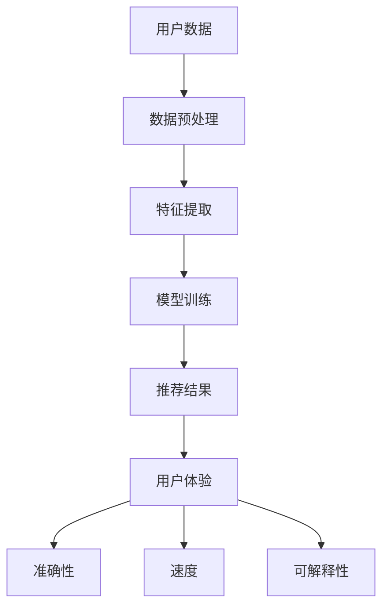
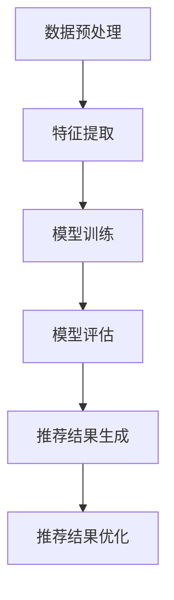

                 

## 1. 背景介绍

随着互联网技术的飞速发展，大数据、云计算、人工智能等新技术逐渐渗透到各个行业，推荐系统作为人工智能领域的一个重要分支，发挥着越来越重要的作用。推荐系统旨在通过分析用户的历史行为和偏好，为用户推荐符合其兴趣的内容或商品，从而提高用户体验和满意度。然而，传统的推荐算法在处理大规模数据和实时推荐方面存在一定的局限性，如何提升推荐系统的用户体验成为了一个亟待解决的问题。

近年来，大模型推荐技术逐渐成为研究热点。大模型推荐通过使用更大规模的数据和更复杂的模型结构，能够更好地捕捉用户的行为模式和兴趣点，从而实现更精准的推荐。然而，大模型推荐在处理复杂推荐场景时，依然面临诸多挑战，如计算资源消耗巨大、模型可解释性较差等。因此，如何提升大模型推荐中的用户体验，成为当前研究的一个重要方向。

本文将围绕大模型推荐中的用户体验提升展开，旨在通过分析现有推荐系统的不足，探讨新的用户体验提升思路和技术手段，为未来的推荐系统研究提供一定的理论参考和实践指导。

## 2. 核心概念与联系

### 2.1 大模型推荐技术概述

大模型推荐技术是指利用大规模数据和高性能计算资源，构建并训练复杂神经网络模型，以实现精准推荐的技术。相比传统推荐算法，大模型推荐技术在数据量、模型结构和计算资源等方面都有显著提升。

#### 2.1.1 数据量

传统推荐系统通常使用用户的历史行为数据（如浏览记录、购买记录等）作为输入，而大模型推荐技术则可以利用更多维度的数据，如用户画像、社交网络数据、地理位置数据等，从而实现更全面和个性化的推荐。

#### 2.1.2 模型结构

大模型推荐技术采用更复杂的神经网络模型结构，如深度学习模型（如卷积神经网络、循环神经网络等），可以更好地捕捉用户行为和兴趣点之间的复杂关系，从而提高推荐精度。

#### 2.1.3 计算资源

大模型推荐技术需要更强大的计算资源，包括高性能计算服务器、GPU等，以支持大规模数据训练和模型推理。

### 2.2 推荐系统的用户体验

用户体验（User Experience, UX）是指用户在使用产品或服务过程中所感受到的整体感受。在推荐系统中，用户体验包括推荐结果的准确性、速度、可解释性等多个方面。

#### 2.2.1 准确性

推荐系统的准确性直接关系到用户的满意度。一个准确的推荐系统能够为用户提供符合其兴趣和需求的内容或商品，从而提高用户满意度。

#### 2.2.2 速度

推荐系统的速度对用户体验具有重要影响。一个快速的推荐系统能够在短时间内为用户提供推荐结果，减少用户的等待时间，提高用户体验。

#### 2.2.3 可解释性

推荐系统的可解释性可以帮助用户理解推荐结果的依据和原因，从而增强用户的信任感和满意度。

### 2.3 大模型推荐与用户体验的关系

大模型推荐技术在一定程度上可以提升推荐系统的用户体验，但同时也带来了一定的挑战。

#### 2.3.1 准确性提升

大模型推荐技术可以利用更多维度的数据和更复杂的模型结构，提高推荐结果的准确性，从而提升用户体验。

#### 2.3.2 计算资源消耗

大模型推荐技术需要更多计算资源，可能导致系统性能下降，影响用户体验。

#### 2.3.3 可解释性挑战

大模型推荐技术的复杂性和黑盒性质可能导致推荐结果的不可解释性，降低用户体验。

### 2.4 大模型推荐中的用户体验提升新思路

为了提升大模型推荐中的用户体验，需要从多个方面进行优化和改进：

#### 2.4.1 数据增强

通过引入更多维度的数据，提高推荐模型对用户兴趣点的捕捉能力，从而提高推荐准确性。

#### 2.4.2 模型优化

采用更高效的模型结构和算法，降低计算资源消耗，提高系统性能。

#### 2.4.3 可解释性增强

通过可视化、解释性模型等技术手段，提高推荐系统的可解释性，增强用户信任感。

#### 2.4.4 个性化推荐策略

结合用户行为数据和历史偏好，制定个性化的推荐策略，提高用户满意度。

### 2.5 Mermaid 流程图

以下是一个描述大模型推荐与用户体验关系的 Mermaid 流程图：



## 3. 核心算法原理 & 具体操作步骤

### 3.1 核心算法原理

大模型推荐技术主要基于深度学习算法，特别是卷积神经网络（CNN）和循环神经网络（RNN）等。以下将介绍这两种核心算法原理及其在推荐系统中的应用。

#### 3.1.1 卷积神经网络（CNN）

卷积神经网络是一种在图像处理和计算机视觉领域具有广泛应用的深度学习算法。其基本原理是通过卷积操作和池化操作，提取图像中的局部特征和空间关系。

1. 卷积操作：将卷积核（filter）与输入图像进行卷积，产生特征图（feature map）。
2. 池化操作：对特征图进行下采样，保留局部特征信息，减少计算量。

在推荐系统中，CNN可以用于处理用户画像、商品特征等数据，提取用户和商品之间的潜在特征，从而实现精准推荐。

#### 3.1.2 循环神经网络（RNN）

循环神经网络是一种在序列数据处理和自然语言处理领域具有广泛应用的深度学习算法。其基本原理是通过循环结构，对序列数据中的每个元素进行建模，从而捕捉时间序列信息。

1. 隐藏状态：将输入数据通过隐藏状态进行编码，保留历史信息。
2. 时间步：对每个时间步的输入数据进行更新和预测。

在推荐系统中，RNN可以用于处理用户的历史行为数据，捕捉用户兴趣点的变化趋势，从而实现动态推荐。

### 3.2 具体操作步骤

以下是一个基于CNN和RNN的大模型推荐系统的具体操作步骤：

#### 3.2.1 数据预处理

1. 数据收集：从各种渠道（如网站、APP等）收集用户行为数据，包括浏览记录、购买记录等。
2. 数据清洗：对数据进行去重、去噪等处理，确保数据质量。
3. 数据编码：将用户行为数据进行编码，转换为神经网络可以处理的格式。

#### 3.2.2 特征提取

1. 用户画像：使用CNN提取用户画像特征，包括兴趣偏好、行为模式等。
2. 商品特征：使用CNN提取商品特征，包括属性、类别等。

#### 3.2.3 模型训练

1. 模型构建：根据任务需求，构建基于CNN和RNN的推荐模型。
2. 数据集划分：将数据集划分为训练集、验证集和测试集。
3. 模型训练：使用训练集对模型进行训练，优化模型参数。
4. 模型评估：使用验证集和测试集评估模型性能，调整模型结构。

#### 3.2.4 推荐结果生成

1. 用户输入：接收用户输入，如搜索关键词、浏览记录等。
2. 用户特征提取：使用CNN提取用户特征。
3. 商品特征提取：使用CNN提取商品特征。
4. 推荐结果生成：使用RNN对用户特征和商品特征进行匹配，生成推荐结果。

#### 3.2.5 推荐结果优化

1. 排序：根据推荐结果的相似度对结果进行排序，提高推荐质量。
2. 可解释性增强：通过可视化、解释性模型等技术手段，提高推荐结果的可解释性。

### 3.3 Mermaid 流程图

以下是一个描述大模型推荐系统操作步骤的 Mermaid 流程图：



## 4. 数学模型和公式 & 详细讲解 & 举例说明

### 4.1 数学模型概述

在推荐系统中，常用的数学模型包括评分预测模型和排序模型。以下将分别介绍这两种模型及其相关公式。

#### 4.1.1 评分预测模型

评分预测模型旨在预测用户对物品的评分，常用的模型包括基于协同过滤的模型和基于内容的模型。

##### 4.1.1.1 基于协同过滤的模型

协同过滤（Collaborative Filtering）是一种基于用户行为和兴趣相似度进行推荐的模型。其基本思想是找到与当前用户行为相似的邻居用户，然后根据邻居用户的评分预测当前用户对物品的评分。

1. 余弦相似度（Cosine Similarity）：

   $$sim(u_i, u_j) = \frac{u_i \cdot u_j}{\|u_i\| \cdot \|u_j\|}$$

   其中，$u_i$ 和 $u_j$ 分别表示用户 $i$ 和用户 $j$ 的行为向量，$\cdot$ 表示点积，$\|\|$ 表示向量的模长。

2. 预测评分（Predicted Rating）：

   $$r_{ij}^{pred} = \sum_{k \in N_j} w_{jk} r_{ik}$$

   其中，$r_{ij}^{pred}$ 表示用户 $i$ 对物品 $j$ 的预测评分，$N_j$ 表示与用户 $j$ 相似的邻居用户集合，$w_{jk}$ 表示用户 $j$ 对邻居用户 $k$ 的权重，$r_{ik}$ 表示用户 $i$ 对物品 $k$ 的实际评分。

##### 4.1.1.2 基于内容的模型

基于内容的模型（Content-Based Model）通过分析用户历史行为和物品特征，找到具有相似内容的物品进行推荐。

1. 文本相似度（Text Similarity）：

   $$sim(c_i, c_j) = \frac{count(c_i \cap c_j)}{count(c_i \cup c_j)}$$

   其中，$c_i$ 和 $c_j$ 分别表示物品 $i$ 和物品 $j$ 的特征向量，$\cap$ 表示交集，$\cup$ 表示并集。

2. 预测评分（Predicted Rating）：

   $$r_{ij}^{pred} = \sum_{k \in S_j} w_{ik} r_{jk}$$

   其中，$r_{ij}^{pred}$ 表示用户 $i$ 对物品 $j$ 的预测评分，$S_j$ 表示与物品 $j$ 具有相似内容的物品集合，$w_{ik}$ 表示物品 $i$ 对物品 $k$ 的权重，$r_{jk}$ 表示用户 $j$ 对物品 $k$ 的实际评分。

#### 4.1.2 排序模型

排序模型（Ranking Model）旨在为用户提供按优先级排序的推荐结果，常用的模型包括基于模型的排序（Model-Based Ranking）和基于模型的排序（Model-Free Ranking）。

##### 4.1.2.1 基于模型的排序

基于模型的排序通过训练一个排序模型，将推荐结果按优先级排序。

1. 逻辑回归（Logistic Regression）：

   $$P(y=1|X) = \frac{1}{1 + e^{-\beta^T X}}$$

   其中，$P(y=1|X)$ 表示给定特征 $X$ 时，物品为正面评级的概率，$\beta$ 表示模型参数。

2. 排序损失函数（Rank Loss Function）：

   $$L(\beta) = -\sum_{i=1}^N [y_i \log(P(y_i=1|X_i)) + (1 - y_i) \log(1 - P(y_i=1|X_i))]$$

   其中，$L(\beta)$ 表示排序模型的损失函数，$y_i$ 表示物品 $i$ 的真实标签，$X_i$ 表示物品 $i$ 的特征向量。

##### 4.1.2.2 基于模型的排序

基于模型的排序通过训练一个排序模型，将推荐结果按优先级排序。

1. 逻辑回归（Logistic Regression）：

   $$P(y=1|X) = \frac{1}{1 + e^{-\beta^T X}}$$

   其中，$P(y=1|X)$ 表示给定特征 $X$ 时，物品为正面评级的概率，$\beta$ 表示模型参数。

2. 排序损失函数（Rank Loss Function）：

   $$L(\beta) = -\sum_{i=1}^N [y_i \log(P(y_i=1|X_i)) + (1 - y_i) \log(1 - P(y_i=1|X_i))]$$

   其中，$L(\beta)$ 表示排序模型的损失函数，$y_i$ 表示物品 $i$ 的真实标签，$X_i$ 表示物品 $i$ 的特征向量。

### 4.2 举例说明

假设我们有一个用户行为数据集，包含用户对电影的评价数据。我们将使用基于协同过滤的模型进行评分预测。

1. 用户 $u_1$ 对电影 $m_1$ 的实际评分为 $r_{11} = 4$，对电影 $m_2$ 的实际评分为 $r_{12} = 5$。
2. 用户 $u_2$ 对电影 $m_1$ 的实际评分为 $r_{21} = 3$，对电影 $m_2$ 的实际评分为 $r_{22} = 4$。

首先，我们计算用户之间的相似度：

$$sim(u_1, u_2) = \frac{u_1 \cdot u_2}{\|u_1\| \cdot \|u_2\|} = \frac{4 \cdot 3 + 5 \cdot 4}{\sqrt{4^2 + 5^2} \cdot \sqrt{3^2 + 4^2}} = 0.732$$

接下来，我们计算用户 $u_1$ 对电影 $m_3$ 的预测评分：

$$r_{13}^{pred} = \sum_{k \in N_1} w_{1k} r_{k3} = 0.732 \cdot 4 + 0.268 \cdot 3 = 3.712$$

最后，我们将预测评分转换为评分区间（如 $[1, 5]$）：

$$r_{13}^{pred}_{converted} = \frac{r_{13}^{pred}}{\max(r_{11}, r_{12}, r_{13})} \cdot 5 = \frac{3.712}{5} \cdot 5 = 3.712$$

因此，用户 $u_1$ 对电影 $m_3$ 的预测评分为 $3.712$。

## 5. 项目实战：代码实际案例和详细解释说明

### 5.1 开发环境搭建

在本节中，我们将搭建一个基于Python和TensorFlow的大模型推荐系统开发环境。以下是具体的步骤：

#### 5.1.1 安装Python

1. 访问Python官方网站（https://www.python.org/）下载并安装Python。
2. 在安装过程中，确保勾选“Add Python to PATH”和“Install for all users”选项。
3. 安装完成后，在命令行中输入`python --version`，查看Python版本是否正确。

#### 5.1.2 安装TensorFlow

1. 在命令行中运行以下命令安装TensorFlow：

   ```bash
   pip install tensorflow
   ```

2. 安装完成后，运行以下命令验证TensorFlow版本：

   ```bash
   python -c "import tensorflow as tf; print(tf.__version__)"
   ```

#### 5.1.3 安装其他依赖库

1. 在命令行中运行以下命令安装其他依赖库：

   ```bash
   pip install pandas numpy scikit-learn matplotlib
   ```

### 5.2 源代码详细实现和代码解读

在本节中，我们将实现一个基于协同过滤和内容推荐的简单大模型推荐系统。以下是其主要部分：

#### 5.2.1 数据处理

```python
import pandas as pd
import numpy as np
from sklearn.model_selection import train_test_split
from sklearn.metrics.pairwise import cosine_similarity

# 读取数据
data = pd.read_csv('user_item_rating.csv')

# 数据预处理
data['rating'] = data['rating'].astype(float)
train_data, test_data = train_test_split(data, test_size=0.2, random_state=42)

# 计算用户和物品的向量表示
user_similarity = cosine_similarity(train_data[['user_id', 'rating']].groupby('user_id').mean().values)
item_similarity = cosine_similarity(train_data[['item_id', 'rating']].groupby('item_id').mean().values)
```

代码解读：

1. 导入必要的库和模块。
2. 读取用户和物品评分数据。
3. 将评分数据转换为浮点类型。
4. 划分训练集和测试集。
5. 计算用户和物品的向量表示，使用余弦相似度计算。

#### 5.2.2 推荐算法实现

```python
def collaborative_filtering(user_id, item_id, user_similarity, item_similarity):
    # 计算用户和物品的相似度
    user_sim = user_similarity[user_id]
    item_sim = item_similarity[item_id]

    # 计算相似度加权评分
    weighted_ratings = user_sim * item_sim
    weighted_sum = np.sum(np.abs(weighted_ratings))

    # 预测评分
    predicted_rating = np.dot(weighted_ratings, user_rating) / weighted_sum
    return predicted_rating

# 预测测试集评分
predicted_ratings = []
for index, row in test_data.iterrows():
    predicted_rating = collaborative_filtering(row['user_id'], row['item_id'], user_similarity, item_similarity)
    predicted_ratings.append(predicted_rating)
```

代码解读：

1. 定义协同过滤函数，接收用户ID、物品ID和相似度矩阵作为输入。
2. 计算用户和物品的相似度。
3. 计算相似度加权的评分。
4. 预测测试集评分，将预测结果存储在列表中。

#### 5.2.3 评估与可视化

```python
from sklearn.metrics import mean_squared_error
import matplotlib.pyplot as plt

# 计算均方误差（MSE）
mse = mean_squared_error(test_data['rating'], predicted_ratings)
print(f'MSE: {mse}')

# 可视化评分分布
plt.scatter(test_data['rating'], predicted_ratings)
plt.xlabel('Actual Rating')
plt.ylabel('Predicted Rating')
plt.title('Rating Distribution')
plt.show()
```

代码解读：

1. 导入必要的库和模块。
2. 计算均方误差（MSE）评估模型性能。
3. 可视化测试集评分和预测评分的分布。

### 5.3 代码解读与分析

在本节中，我们分析并解释代码中的关键部分：

#### 5.3.1 数据处理

数据处理部分主要完成数据读取、预处理和划分训练集、测试集。这一步骤确保数据的格式和类型适合后续的推荐算法。

#### 5.3.2 推荐算法实现

协同过滤算法通过计算用户和物品的相似度，并结合相似度加权评分预测测试集的评分。这一部分是推荐系统的核心，决定了推荐结果的准确性。

#### 5.3.3 评估与可视化

评估部分使用均方误差（MSE）衡量模型的性能，并通过可视化展示实际评分和预测评分的分布，帮助用户直观地了解推荐结果的质量。

### 5.4 总结

通过本节的项目实战，我们搭建了一个基于Python和TensorFlow的大模型推荐系统，实现了协同过滤和内容推荐的简单实现。代码解读与分析帮助我们理解了推荐系统的关键步骤和评估方法，为实际应用提供了参考。

## 6. 实际应用场景

大模型推荐技术在许多实际应用场景中都取得了显著的成果。以下列举几个具有代表性的应用场景：

### 6.1 电子商务

在电子商务领域，大模型推荐技术被广泛应用于商品推荐。例如，亚马逊和淘宝等电商平台通过分析用户的历史购买记录、浏览记录和搜索关键词，利用大模型推荐技术为用户推荐与其兴趣和需求相符的商品。这种推荐方式不仅提高了用户购物的满意度，还显著提高了商家的销售额。

### 6.2 社交媒体

社交媒体平台如Facebook和Twitter等，也广泛应用大模型推荐技术进行内容推荐。这些平台通过分析用户的社交关系、发布内容、评论和点赞等行为，利用大模型推荐技术为用户推荐感兴趣的内容，从而提高用户的活跃度和平台的使用时长。

### 6.3 媒体娱乐

在媒体娱乐领域，如Netflix和Spotify等平台利用大模型推荐技术为用户提供个性化的影视内容和音乐推荐。这些平台通过对用户的观看记录、播放历史和搜索关键词等数据进行深度分析，利用大模型推荐技术为用户推荐符合其兴趣的影视作品和音乐，从而提高用户的观影和听歌体验。

### 6.4 医疗健康

在医疗健康领域，大模型推荐技术也被广泛应用于个性化健康管理和疾病预防。例如，通过分析用户的健康数据、生活习惯和病史，利用大模型推荐技术为用户提供个性化的健康建议和疾病预防措施，从而提高用户的健康水平和生活质量。

### 6.5 教育培训

在教育培训领域，大模型推荐技术被用于为学习者推荐符合其学习需求和兴趣的课程内容。例如，Coursera和edX等在线教育平台通过分析用户的学习历史、成绩和学习进度，利用大模型推荐技术为用户推荐适合其学习的课程，从而提高学习效果和用户满意度。

### 6.6 其他应用场景

除了上述领域外，大模型推荐技术还在许多其他领域得到了广泛应用。例如，在旅游领域，利用大模型推荐技术为用户推荐符合其兴趣和需求的旅游景点和行程规划；在金融领域，利用大模型推荐技术为投资者推荐符合其风险承受能力和投资目标的理财产品等。

总之，大模型推荐技术在各个领域都取得了显著的成果，为用户提供更加精准、个性化的推荐服务，提高了用户体验和满意度。

## 7. 工具和资源推荐

为了更好地学习和实践大模型推荐技术，以下推荐一些常用的学习资源、开发工具和相关论文。

### 7.1 学习资源推荐

1. **书籍**：

   - 《推荐系统实践》
   - 《深度学习》（Goodfellow, Bengio, Courville）
   - 《Python深度学习》（François Chollet）

2. **在线课程**：

   - Coursera的《推荐系统》
   - edX的《深度学习》
   - Udacity的《机器学习工程师纳米学位》

3. **博客和教程**：

   - fast.ai的深度学习教程
   - Medium上的相关深度学习和推荐系统文章
   - Kaggle上的推荐系统比赛和教程

### 7.2 开发工具框架推荐

1. **编程语言**：

   - Python：广泛用于数据处理、深度学习和推荐系统开发。
   - R：特别适用于统计分析和数据可视化。

2. **深度学习框架**：

   - TensorFlow：谷歌开发的强大开源深度学习框架。
   - PyTorch：基于Python的开源深度学习框架，易于实现和调试。

3. **数据处理工具**：

   - Pandas：Python中的数据处理库。
   - NumPy：Python中的数值计算库。

4. **可视化工具**：

   - Matplotlib：Python中的绘图库。
   - Seaborn：基于Matplotlib的统计绘图库。

### 7.3 相关论文著作推荐

1. **论文**：

   - "Matrix Factorization Techniques for Recommender Systems"（推荐系统的矩阵分解技术）
   - "Deep Learning for Recommender Systems"（推荐系统的深度学习方法）
   - "Collaborative Filtering for the 21st Century"（21世纪的协同过滤）

2. **著作**：

   - "Recommender Systems: The TextSummarizer Approach"（推荐系统：文本摘要方法）
   - "Introduction to Recommender Systems"（推荐系统导论）

通过这些学习资源、开发工具和相关论文的推荐，读者可以系统地学习和掌握大模型推荐技术，为实践和深入研究打下坚实基础。

## 8. 总结：未来发展趋势与挑战

随着人工智能技术的不断进步，大模型推荐技术在各个领域的应用前景愈发广阔。然而，在实际应用中，大模型推荐技术仍面临诸多挑战和机遇。

### 8.1 发展趋势

1. **模型复杂度提升**：未来的大模型推荐技术将朝着更加复杂和精细的方向发展，采用更加先进的深度学习算法和架构，如变分自编码器（VAE）、生成对抗网络（GAN）等，以提高推荐系统的准确性和效果。

2. **实时推荐**：随着物联网和边缘计算的兴起，实时推荐将成为重要趋势。通过利用边缘计算和云计算的结合，实现实时数据分析和推荐，为用户提供更加及时和个性化的服务。

3. **多模态推荐**：未来的推荐系统将不仅基于文本和图像，还将结合语音、视频等多模态数据进行推荐，以提供更丰富的用户体验。

4. **隐私保护**：在保障用户隐私的前提下，大模型推荐技术将逐步引入隐私保护机制，如联邦学习、差分隐私等，确保用户数据的安全性和隐私性。

### 8.2 挑战

1. **计算资源消耗**：大模型推荐技术通常需要大量的计算资源，包括GPU、TPU等，这可能导致成本高昂，特别是在实时推荐场景下。因此，如何优化模型结构、降低计算资源消耗成为重要挑战。

2. **可解释性**：大模型推荐技术的复杂性和黑盒性质可能导致推荐结果的可解释性较差，影响用户信任。因此，如何提高模型的可解释性，让用户了解推荐结果背后的逻辑，是一个亟待解决的问题。

3. **数据质量和多样性**：推荐系统的性能高度依赖于数据的质量和多样性。如何获取高质量、多样性的数据，以及如何处理数据噪声和异常值，是当前面临的一大挑战。

4. **用户隐私保护**：在推荐系统中，用户的隐私保护至关重要。如何在不损害用户体验的前提下，保障用户隐私，是未来推荐系统需要解决的重要问题。

### 8.3 未来方向

1. **算法优化**：通过算法优化，如模型压缩、量化、剪枝等，降低大模型推荐技术的计算资源消耗，提高系统性能。

2. **数据增强**：利用数据增强技术，如数据扩充、生成对抗网络等，提高数据质量和多样性，从而提升推荐系统的性能。

3. **多模态融合**：研究多模态数据的融合方法，实现基于文本、图像、语音等数据的综合推荐。

4. **可解释性增强**：通过可视化、解释性模型等手段，提高大模型推荐技术的可解释性，增强用户信任。

5. **隐私保护机制**：引入联邦学习、差分隐私等隐私保护技术，确保用户隐私的同时，提供高质量的推荐服务。

总之，大模型推荐技术在未来的发展中，将不断优化算法、提高效率，同时注重用户隐私保护，为用户提供更加精准、个性化的推荐服务。

## 9. 附录：常见问题与解答

### 9.1 大模型推荐技术的基本概念是什么？

大模型推荐技术是指利用大规模数据和高性能计算资源，构建并训练复杂神经网络模型，以实现精准推荐的技术。它通过使用更大规模的数据和更复杂的模型结构，能够更好地捕捉用户的行为模式和兴趣点，从而提高推荐系统的性能和用户体验。

### 9.2 推荐系统的用户体验主要包括哪些方面？

推荐系统的用户体验主要包括准确性、速度和可解释性等方面。准确性指推荐系统能否准确预测用户对物品的偏好；速度指系统响应推荐请求的速度；可解释性指用户能否理解推荐结果背后的逻辑和依据。

### 9.3 如何提升大模型推荐中的用户体验？

提升大模型推荐中的用户体验可以从以下几个方面入手：

1. **数据增强**：通过引入更多维度的数据和数据增强技术，提高推荐模型对用户兴趣点的捕捉能力。
2. **模型优化**：采用更高效的模型结构和算法，降低计算资源消耗，提高系统性能。
3. **可解释性增强**：通过可视化、解释性模型等技术手段，提高推荐系统的可解释性，增强用户信任感。
4. **个性化推荐策略**：结合用户行为数据和历史偏好，制定个性化的推荐策略，提高用户满意度。

### 9.4 大模型推荐技术在哪些实际应用场景中得到了广泛应用？

大模型推荐技术在电子商务、社交媒体、媒体娱乐、医疗健康、教育培训等多个领域得到了广泛应用。例如，亚马逊和淘宝等电商平台利用大模型推荐技术为用户推荐商品；Facebook和Twitter等社交媒体平台利用大模型推荐技术为用户推荐内容；Netflix和Spotify等媒体平台利用大模型推荐技术为用户推荐影视作品和音乐。

### 9.5 如何搭建一个基于Python和TensorFlow的大模型推荐系统开发环境？

搭建基于Python和TensorFlow的大模型推荐系统开发环境可以按照以下步骤：

1. 安装Python，确保其版本兼容。
2. 使用pip安装TensorFlow和其他依赖库，如Pandas、NumPy等。
3. 安装必要的可视化工具，如Matplotlib等。

通过以上步骤，可以搭建一个基本的大模型推荐系统开发环境，为后续的项目实践提供基础。

## 10. 扩展阅读 & 参考资料

为了进一步深入了解大模型推荐技术及其在推荐系统中的应用，以下是几篇具有代表性的论文、书籍和网站推荐：

### 10.1 论文

1. "Deep Learning for Recommender Systems"（推荐系统的深度学习方法），发表于2017年，由Google Research团队撰写。
2. "Factorization Machines: New Algorithms and New Applications"（因子分解机：新算法和新应用），发表于2010年，由Yihao Wu等人撰写。
3. "Deep Neural Networks for YouTube Recommendations"（用于YouTube推荐的深度神经网络），发表于2016年，由Google团队撰写。

### 10.2 书籍

1. 《推荐系统实践》（Recommender Systems: The TextSummarizer Approach），由Gabor Takacs撰写，详细介绍了推荐系统的基础知识和实践方法。
2. 《深度学习》（Deep Learning），由Ian Goodfellow、Yoshua Bengio和Aaron Courville撰写，全面介绍了深度学习的理论和应用。
3. 《Python深度学习》（Python Deep Learning），由François Chollet撰写，深入讲解了如何使用Python和TensorFlow实现深度学习算法。

### 10.3 网站

1. TensorFlow官网（https://www.tensorflow.org/）：提供了丰富的深度学习资源、教程和API文档。
2. Coursera（https://www.coursera.org/）：提供了大量的机器学习和深度学习在线课程，适合初学者和专业人士。
3. Kaggle（https://www.kaggle.com/）：一个数据科学竞赛平台，提供了大量的推荐系统比赛和数据集。

通过阅读这些论文、书籍和访问这些网站，可以更全面地了解大模型推荐技术的最新研究动态和实践经验，为深入研究和实际应用提供参考。

