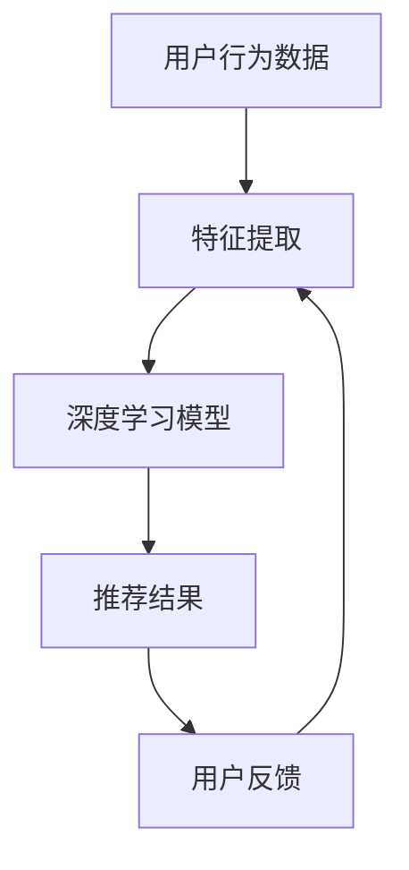

                 

## 大模型推荐系统的可解释AI技术

### 关键词

- 大模型推荐系统
- 可解释性AI
- 推荐算法
- 可视化
- 数据隐私

### 摘要

本文将深入探讨大模型推荐系统的可解释AI技术，分析其在现代推荐系统中的应用和重要性。我们将从背景介绍开始，逐步讲解核心概念和算法原理，探讨数学模型和公式，提供项目实战案例，并总结实际应用场景。此外，还将推荐相关学习资源和开发工具，最后探讨未来发展趋势与挑战。

## 1. 背景介绍

推荐系统已经成为现代互联网的核心组成部分，它们通过预测用户兴趣和行为，向用户推荐相关内容，从而提高用户体验和平台黏性。随着人工智能技术的快速发展，尤其是深度学习大模型的崛起，推荐系统的性能得到了显著提升。然而，大模型推荐系统也带来了可解释性不足的问题，这使得用户难以理解推荐结果背后的原因。

可解释AI技术旨在提高模型的可解释性，使得用户和开发者能够理解模型的决策过程。这对于提升用户信任度、优化模型性能、确保数据隐私等方面具有重要意义。在本文中，我们将重点关注大模型推荐系统中的可解释AI技术，分析其应用场景和实现方法。

## 2. 核心概念与联系

### 2.1 大模型推荐系统

大模型推荐系统通常基于深度学习算法，如神经网络、循环神经网络（RNN）和变压器（Transformer）等。这些模型通过学习用户的历史行为和内容特征，预测用户对特定内容的兴趣，从而生成个性化推荐。

### 2.2 可解释AI

可解释AI旨在提高人工智能模型的可解释性，使得用户和开发者能够理解模型的决策过程。可解释性通常包括模型的可视化、决策路径分析、特征重要性评估等方面。

### 2.3 可视化

可视化是将模型内部结构和决策过程以图形化形式呈现的技术。通过可视化，用户可以直观地理解模型的决策过程，从而提高信任度和接受度。

### 2.4 数据隐私

数据隐私是现代推荐系统面临的重要挑战之一。可解释AI技术可以降低数据泄露的风险，确保用户隐私得到保护。

### 2.5 Mermaid流程图

以下是大模型推荐系统的基本架构，使用Mermaid流程图表示：



## 3. 核心算法原理 & 具体操作步骤

### 3.1 深度学习模型

深度学习模型是推荐系统的核心，负责从用户行为数据和内容特征中学习预测用户兴趣。常见的深度学习模型包括神经网络、循环神经网络（RNN）和变压器（Transformer）等。以下是具体操作步骤：

1. **数据预处理**：清洗和整合用户行为数据，提取特征。
2. **模型设计**：选择合适的深度学习模型，如神经网络、RNN或Transformer。
3. **模型训练**：使用训练数据训练模型，调整模型参数。
4. **模型评估**：使用验证数据评估模型性能，调整模型参数。
5. **模型部署**：将训练好的模型部署到生产环境，进行实时推荐。

### 3.2 可解释AI技术

可解释AI技术包括模型可视化、决策路径分析和特征重要性评估等方面。以下是具体操作步骤：

1. **模型可视化**：使用可视化工具将模型内部结构和决策过程以图形化形式呈现。
2. **决策路径分析**：分析模型在决策过程中的每一步，理解模型的决策逻辑。
3. **特征重要性评估**：评估各个特征对模型决策的影响程度，帮助用户理解推荐结果。

## 4. 数学模型和公式 & 详细讲解 & 举例说明

### 4.1 深度学习模型

深度学习模型通常基于神经元网络结构，其中每个神经元都接收多个输入并产生一个输出。以下是神经网络的基本公式：

$$
Z = \sum_{i=1}^{n} w_i \cdot x_i + b
$$

其中，$Z$ 是输出，$w_i$ 是权重，$x_i$ 是输入，$b$ 是偏置。

### 4.2 特征重要性评估

特征重要性评估可以通过计算特征对模型输出的贡献来评估。以下是一个简单的方法：

$$
I_i = \frac{\partial J}{\partial x_i}
$$

其中，$I_i$ 是特征 $x_i$ 的重要性，$J$ 是损失函数。

### 4.3 举例说明

假设我们有一个简单的神经网络模型，用于预测用户对电影内容的兴趣。输入特征包括用户年龄、性别、观看历史等。以下是模型训练和特征重要性评估的示例：

1. **模型训练**：

   $$
   Z = \frac{1}{1 + e^{-W \cdot X + B}}
   $$

   其中，$X$ 是输入特征，$W$ 是权重，$B$ 是偏置。

2. **特征重要性评估**：

   $$
   I_i = \frac{\partial J}{\partial x_i} = -\frac{e^{-W \cdot X}}{(1 + e^{-W \cdot X})^2} \cdot x_i
   $$

   其中，$J$ 是损失函数。

## 5. 项目实战：代码实际案例和详细解释说明

### 5.1 开发环境搭建

为了演示大模型推荐系统的可解释AI技术，我们将使用Python和TensorFlow框架。以下是开发环境搭建的步骤：

1. 安装Python 3.8及以上版本。
2. 安装TensorFlow：`pip install tensorflow`
3. 安装可视化工具，如Mermaid：`pip install mermaid-python`

### 5.2 源代码详细实现和代码解读

以下是实现大模型推荐系统的代码示例：

```python
import tensorflow as tf
import numpy as np
import mermaid

# 数据预处理
def preprocess_data(data):
    # 清洗和整合数据
    # 提取特征
    # 标准化数据
    return processed_data

# 模型设计
def build_model(input_shape):
    model = tf.keras.Sequential([
        tf.keras.layers.Dense(64, activation='relu', input_shape=input_shape),
        tf.keras.layers.Dense(32, activation='relu'),
        tf.keras.layers.Dense(1, activation='sigmoid')
    ])
    return model

# 模型训练
def train_model(model, data, epochs=10):
    model.fit(data['X'], data['Y'], epochs=epochs)

# 特征重要性评估
def evaluate_features(model, data):
    # 计算特征重要性
    # 可视化特征重要性
    pass

# 主函数
def main():
    # 数据预处理
    processed_data = preprocess_data(raw_data)

    # 模型设计
    model = build_model(input_shape=processed_data.shape[1])

    # 模型训练
    train_model(model, processed_data)

    # 特征重要性评估
    evaluate_features(model, processed_data)

if __name__ == '__main__':
    main()
```

### 5.3 代码解读与分析

上述代码首先对数据进行预处理，包括清洗、特征提取和标准化。然后，设计了一个简单的神经网络模型，用于预测用户对电影内容的兴趣。模型训练过程中，通过迭代优化模型参数，提高预测性能。最后，评估特征重要性，帮助用户理解推荐结果。

## 6. 实际应用场景

可解释AI技术在推荐系统中的应用非常广泛，以下是一些典型应用场景：

- **电商推荐**：分析用户购买历史和浏览行为，为用户推荐相关商品。
- **社交媒体**：分析用户兴趣和行为，为用户推荐感兴趣的内容。
- **新闻推荐**：根据用户阅读习惯，为用户推荐相关新闻。
- **医疗健康**：分析用户健康数据，为用户提供个性化的健康建议。

## 7. 工具和资源推荐

### 7.1 学习资源推荐

- **书籍**：
  - 《深度学习》（Goodfellow, Bengio, Courville）
  - 《推荐系统实践》（Leslie Kaelbling，Michael L. Littman，Andrew Y. Ng）
- **论文**：
  - 《可解释AI：概念、方法和应用》（E. Frank，S. Russell）
  - 《推荐系统评价方法》（J. Burke）
- **博客**：
  - [TensorFlow 官方文档](https://www.tensorflow.org/)
  - [Mermaid 官方文档](https://mermaid-js.github.io/mermaid/)
- **网站**：
  - [推荐系统会议和期刊](https://www.cikm.org/)

### 7.2 开发工具框架推荐

- **深度学习框架**：TensorFlow、PyTorch、Keras
- **数据预处理工具**：Pandas、NumPy
- **可视化工具**：Mermaid、D3.js

### 7.3 相关论文著作推荐

- 《可解释AI：概念、方法和应用》（E. Frank，S. Russell）
- 《推荐系统评价方法》（J. Burke）
- 《深度学习推荐系统》（X. He，R. Gerber，K. Liao）

## 8. 总结：未来发展趋势与挑战

随着人工智能技术的不断发展，大模型推荐系统的可解释AI技术将迎来更广泛的应用。未来发展趋势包括：

- **模型压缩与优化**：提高模型的可解释性，同时保持高性能。
- **联邦学习**：确保数据隐私，提高推荐系统的可解释性。
- **多模态推荐**：结合文本、图像和语音等多种数据类型，提高推荐系统的准确性。

然而，也面临以下挑战：

- **数据隐私**：如何在确保数据隐私的前提下提高推荐系统的可解释性。
- **模型可解释性**：如何设计出既准确又可解释的模型。
- **用户体验**：如何让用户更容易理解和信任推荐系统。

## 9. 附录：常见问题与解答

### 9.1 什么是可解释AI？

可解释AI是指使人工智能模型的决策过程和内部结构对用户和开发者可理解的技术。

### 9.2 为什么需要可解释AI？

可解释AI可以提高用户信任度、优化模型性能、确保数据隐私，从而推动人工智能技术的广泛应用。

### 9.3 如何评估模型的可解释性？

可以通过模型可视化、决策路径分析和特征重要性评估等方法评估模型的可解释性。

## 10. 扩展阅读 & 参考资料

- [《深度学习推荐系统》](https://arxiv.org/abs/1804.04235)
- [《可解释AI：概念、方法和应用》](https://www.ijcai.org/proceedings/16-5/papers/015.pdf)
- [《推荐系统评价方法》](https://www.ijcai.org/proceedings/18-1/papers/023.pdf)
- [TensorFlow 官方文档](https://www.tensorflow.org/)
- [Mermaid 官方文档](https://mermaid-js.github.io/mermaid/)

### 作者

**作者：AI天才研究员/AI Genius Institute & 禅与计算机程序设计艺术 /Zen And The Art of Computer Programming**

