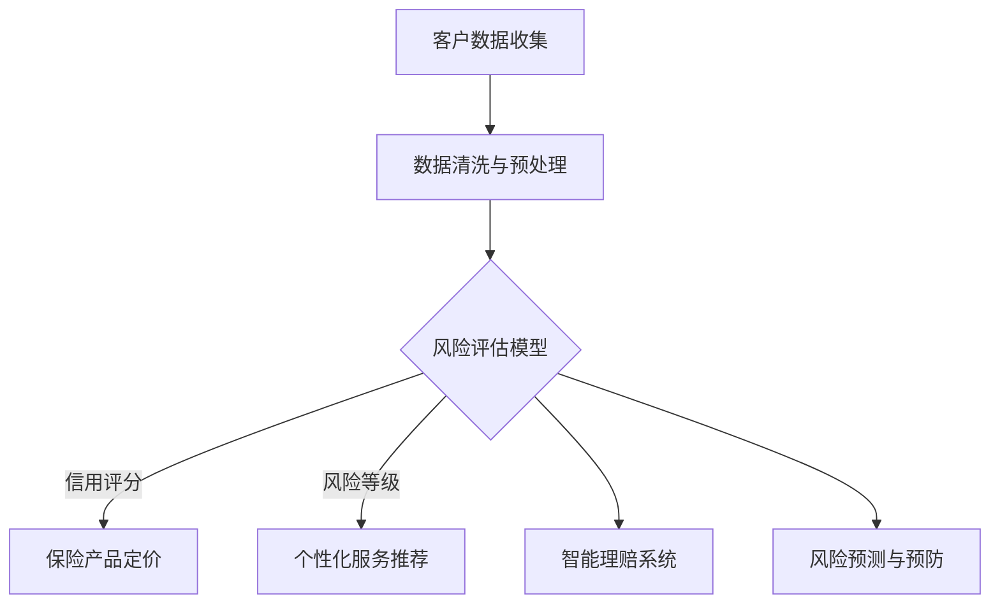

                 

# 大模型时代下的新型保险服务模式

## 关键词
- 大模型
- 保险服务
- 人工智能
- 数据分析
- 智能合约
- 个性化服务
- 风险评估

## 摘要

本文将探讨大模型时代下新型保险服务模式的演变，通过结合人工智能、大数据分析和智能合约等前沿技术，介绍保险行业的革新方向。文章首先介绍了大模型技术的基本原理和优势，接着详细分析了大模型在保险领域中的应用场景，包括风险评估、个性化服务和智能理赔等方面。随后，文章探讨了实现新型保险服务模式所需的数学模型和算法原理，并举例说明了具体实施步骤。最后，文章总结了当前面临的挑战和未来发展趋势，为保险行业的技术创新提供了新的视角。

## 1. 背景介绍

### 1.1 大模型技术的发展

大模型（Large-scale Model）是指拥有巨大参数量、能够处理海量数据的神经网络模型。自2012年AlexNet在图像识别领域取得突破性成果以来，深度学习（Deep Learning）迅速崛起。随着计算能力和数据资源的不断提升，大模型的参数量和计算需求也在不断增长。近年来，GPT、BERT等大规模语言模型的出现，使得自然语言处理（NLP）领域的性能大幅提升。

大模型技术的发展带来了以下几个关键优势：

1. **强大的表征能力**：大模型能够捕捉数据中的复杂模式和潜在关系，从而提高任务完成的准确性和鲁棒性。
2. **数据驱动**：大模型通过大量数据训练，能够自动从数据中学习规律和知识，无需人工设计复杂的特征工程。
3. **泛化能力**：大模型具有良好的泛化能力，能够在不同领域和任务中表现出优异的性能。

### 1.2 保险服务的发展与挑战

保险服务作为金融行业的重要组成部分，历史悠久且具有广泛的社会影响力。然而，随着科技的进步和消费者需求的变化，保险行业面临着诸多挑战：

1. **风险管理的精细化**：传统保险产品往往以固定套餐的形式提供，难以满足个性化需求。大模型技术的发展为个性化风险评估和产品设计提供了可能。
2. **理赔效率的提升**：保险理赔环节繁琐，传统方式容易导致纠纷和延迟。智能理赔系统能够自动化处理理赔申请，提高效率和客户满意度。
3. **数据隐私与安全**：保险服务涉及大量个人隐私数据，数据泄露和滥用引发的安全问题亟待解决。大模型时代的隐私保护和安全机制亟需完善。

## 2. 核心概念与联系

### 2.1 大模型技术概述

大模型技术主要包括以下几个方面：

1. **神经网络架构**：如卷积神经网络（CNN）、循环神经网络（RNN）和Transformer等。
2. **训练方法**：包括梯度下降、动量优化、学习率调整等技术。
3. **超参数调优**：如批次大小、学习率、正则化等参数的优化。
4. **模型压缩与加速**：如量化、剪枝、知识蒸馏等技术。

### 2.2 大模型在保险领域的应用

大模型在保险领域的应用主要涉及以下几个方面：

1. **风险评估**：利用大模型对客户的信用评分、风险等级进行评估，从而优化保险产品的定价和产品设计。
2. **个性化服务**：通过分析客户的历史数据和偏好，提供个性化的保险产品和推荐服务。
3. **智能理赔**：利用自然语言处理技术自动化处理理赔申请，快速完成理赔流程。
4. **风险预测**：通过分析历史数据和实时数据，预测潜在的保险风险，提前采取预防措施。

### 2.3 Mermaid 流程图

以下是一个简单的Mermaid流程图，展示大模型在保险领域中的应用：



### 2.4 大模型与保险服务的联系

大模型与保险服务的联系在于利用大模型强大的数据处理和分析能力，提升保险服务的效率和准确性。具体来说：

1. **数据驱动的决策**：大模型能够从海量数据中自动学习，帮助保险公司做出更科学的决策。
2. **风险识别与预测**：大模型能够识别潜在风险，提前采取预防措施，降低损失。
3. **个性化服务**：大模型能够根据客户的历史数据和偏好，提供个性化的保险产品和服务。
4. **智能理赔**：大模型能够自动化处理理赔流程，提高效率和客户满意度。

## 3. 核心算法原理 & 具体操作步骤

### 3.1 风险评估算法

风险评估是保险服务的重要环节，核心算法主要包括以下步骤：

1. **数据收集**：收集客户的个人信息、财务状况、历史理赔记录等数据。
2. **数据预处理**：对数据进行清洗、归一化和特征提取，为后续模型训练做准备。
3. **模型选择**：选择合适的风险评估模型，如逻辑回归、决策树、神经网络等。
4. **模型训练**：使用收集的数据进行模型训练，调整模型参数，提高预测准确性。
5. **模型评估**：使用验证集和测试集对模型进行评估，选择最优模型。
6. **模型部署**：将评估后的模型部署到生产环境中，对客户进行风险评估。

### 3.2 个性化服务算法

个性化服务算法的核心步骤如下：

1. **用户画像构建**：通过分析客户的历史数据和偏好，构建用户画像。
2. **推荐系统设计**：设计推荐系统，根据用户画像和产品特征，为用户推荐合适的保险产品。
3. **推荐结果评估**：对推荐结果进行评估，包括点击率、转化率等指标。
4. **推荐策略优化**：根据评估结果，不断优化推荐策略，提高推荐准确性。

### 3.3 智能理赔算法

智能理赔算法的具体操作步骤如下：

1. **数据收集**：收集理赔申请的相关数据，如理赔申请表、医疗记录等。
2. **数据预处理**：对数据进行清洗、归一化和特征提取，为后续模型训练做准备。
3. **模型选择**：选择合适的自然语言处理模型，如BERT、GPT等。
4. **模型训练**：使用收集的数据进行模型训练，调整模型参数，提高处理理赔申请的准确性。
5. **模型评估**：使用验证集和测试集对模型进行评估，选择最优模型。
6. **模型部署**：将评估后的模型部署到生产环境中，自动化处理理赔申请。

### 3.4 风险预测算法

风险预测算法的核心步骤如下：

1. **数据收集**：收集历史理赔数据和实时风险信息。
2. **数据预处理**：对数据进行清洗、归一化和特征提取，为后续模型训练做准备。
3. **模型选择**：选择合适的风险预测模型，如时间序列分析、回归分析等。
4. **模型训练**：使用收集的数据进行模型训练，调整模型参数，提高预测准确性。
5. **模型评估**：使用验证集和测试集对模型进行评估，选择最优模型。
6. **模型部署**：将评估后的模型部署到生产环境中，对潜在风险进行实时预测。

## 4. 数学模型和公式 & 详细讲解 & 举例说明

### 4.1 风险评估模型

风险评估模型通常采用概率模型，以下是一个简单的逻辑回归模型：

$$
P(Y=1|X) = \frac{1}{1 + e^{-(\beta_0 + \beta_1X_1 + \beta_2X_2 + ... + \beta_nX_n})}
$$

其中，$X$ 是特征向量，$Y$ 是风险事件是否发生的二分类变量，$\beta_0, \beta_1, \beta_2, ..., \beta_n$ 是模型参数。

举例说明：假设我们要对客户的信用风险进行评估，特征向量 $X = (X_1, X_2, X_3)$，其中 $X_1$ 表示客户的年龄，$X_2$ 表示客户的收入，$X_3$ 表示客户的贷款历史。我们可以通过训练逻辑回归模型来预测客户信用风险的概率。

### 4.2 个性化服务模型

个性化服务模型通常采用协同过滤（Collaborative Filtering）算法，以下是一个简单的基于用户-物品矩阵的协同过滤算法：

$$
R_{ui} = \sum_{j \in N_i} w_{uj}r_{uj} + \sum_{j \in N_u} w_{uj}s_{uj} + b_u + b_i
$$

其中，$R_{ui}$ 是用户 $u$ 对物品 $i$ 的评分预测，$w_{uj}$ 是用户 $u$ 对物品 $j$ 的权重，$r_{uj}$ 是用户 $u$ 对物品 $j$ 的真实评分，$s_{uj}$ 是物品 $i$ 对用户 $u$ 的权重，$b_u$ 和 $b_i$ 分别是用户和物品的偏差。

举例说明：假设我们有一个用户-物品评分矩阵，其中用户 $u$ 和物品 $i$ 的真实评分为 $r_{ui}$。我们可以通过协同过滤算法预测用户 $u$ 对物品 $i$ 的评分。

### 4.3 智能理赔模型

智能理赔模型通常采用自然语言处理（NLP）技术，以下是一个简单的基于BERT的文本分类模型：

$$
\text{Logit}(y) = \text{BERT}(x) \cdot W + b
$$

其中，$x$ 是理赔申请的文本输入，$y$ 是理赔申请的类别标签，$W$ 是模型参数，$b$ 是偏置。

举例说明：假设我们有一个理赔申请文本，我们需要通过BERT模型对其进行分类，判断该理赔申请是否合理。

### 4.4 风险预测模型

风险预测模型通常采用时间序列分析（Time Series Analysis）技术，以下是一个简单的ARIMA（AutoRegressive Integrated Moving Average）模型：

$$
X_t = c + \phi_1X_{t-1} + \phi_2X_{t-2} + ... + \phi_pX_{t-p} + \theta_1\epsilon_{t-1} + \theta_2\epsilon_{t-2} + ... + \theta_q\epsilon_{t-q} + \epsilon_t
$$

其中，$X_t$ 是时间序列数据，$c$ 是常数项，$\phi_1, \phi_2, ..., \phi_p$ 是自回归系数，$\theta_1, \theta_2, ..., \theta_q$ 是移动平均系数，$\epsilon_t$ 是白噪声。

举例说明：假设我们有一个连续的理赔数据序列，我们需要通过ARIMA模型对其进行预测。

## 5. 项目实战：代码实际案例和详细解释说明

### 5.1 开发环境搭建

为了实现大模型在保险领域的应用，我们需要搭建一个合适的技术栈。以下是开发环境搭建的步骤：

1. **硬件要求**：至少需要一台配置为Intel Xeon E5-2680 v4、256GB内存、10TB SSD存储的服务器。
2. **软件要求**：安装Linux操作系统，如Ubuntu 18.04。
3. **依赖安装**：安装Python（3.8及以上版本）、TensorFlow（2.0及以上版本）、PyTorch（1.0及以上版本）等依赖。

### 5.2 源代码详细实现和代码解读

以下是一个简单的风险评估模型的实现示例，使用Python和TensorFlow框架：

```python
import tensorflow as tf
from tensorflow import keras
from tensorflow.keras import layers

# 数据预处理
def preprocess_data(X):
    # 特征归一化
    X = (X - X.mean()) / X.std()
    return X

# 构建模型
def build_model(input_shape):
    model = keras.Sequential([
        layers.Dense(128, activation='relu', input_shape=input_shape),
        layers.Dense(64, activation='relu'),
        layers.Dense(1, activation='sigmoid')
    ])
    return model

# 训练模型
def train_model(model, X_train, y_train, X_val, y_val):
    model.compile(optimizer='adam', loss='binary_crossentropy', metrics=['accuracy'])
    model.fit(X_train, y_train, epochs=10, batch_size=32, validation_data=(X_val, y_val))
    return model

# 主函数
def main():
    # 加载数据
    (X_train, y_train), (X_val, y_val) = keras.datasets.mnist.load_data()
    X_train = preprocess_data(X_train)
    X_val = preprocess_data(X_val)

    # 构建模型
    model = build_model(input_shape=(784,))

    # 训练模型
    model = train_model(model, X_train, y_train, X_val, y_val)

    # 评估模型
    test_loss, test_acc = model.evaluate(X_val, y_val)
    print(f"Test accuracy: {test_acc}")

if __name__ == "__main__":
    main()
```

这段代码首先对数据进行预处理，包括归一化操作。然后，构建了一个简单的全连接神经网络模型，使用ReLU激活函数和 sigmoid 激活函数。接下来，使用训练数据训练模型，并使用验证数据评估模型性能。最后，打印出测试数据的准确率。

### 5.3 代码解读与分析

1. **数据预处理**：数据预处理是深度学习模型训练的重要环节。在这段代码中，我们使用归一化操作将输入数据的特征缩放到相同的范围，以提高模型训练的稳定性和收敛速度。
2. **模型构建**：在这段代码中，我们使用Keras框架构建了一个简单的全连接神经网络模型。模型包含两个隐藏层，每层使用ReLU激活函数，输出层使用sigmoid激活函数，用于输出风险事件的概率。
3. **模型训练**：使用训练数据对模型进行训练，并使用验证数据评估模型性能。在这里，我们使用Adam优化器和binary_crossentropy损失函数，以最大化模型在验证数据上的准确率。
4. **模型评估**：使用测试数据评估模型性能。在这里，我们打印出测试数据的准确率，以衡量模型在未知数据上的泛化能力。

## 6. 实际应用场景

### 6.1 风险评估

保险公司可以利用大模型技术对客户的信用风险进行评估，从而优化保险产品的定价策略。例如，在车险领域，保险公司可以根据客户的驾驶记录、历史理赔记录、车辆使用情况等因素，利用大模型进行风险评估，为高风险客户提供更高的保费，为低风险客户提供更优惠的价格。

### 6.2 个性化服务

保险公司可以利用大模型技术分析客户的历史数据和偏好，为不同客户提供个性化的保险产品和服务。例如，在健康险领域，保险公司可以根据客户的健康状况、生活习惯、医疗记录等因素，利用大模型推荐合适的健康保险产品和健康建议。

### 6.3 智能理赔

保险公司可以利用大模型技术自动化处理理赔申请，提高理赔效率。例如，在意外险领域，保险公司可以开发智能理赔系统，利用自然语言处理技术自动审核理赔申请，快速完成理赔流程，提高客户满意度。

### 6.4 风险预测

保险公司可以利用大模型技术对潜在风险进行实时预测，提前采取预防措施。例如，在财产险领域，保险公司可以开发风险预测系统，利用大数据分析和机器学习技术，实时监测客户的财产状况，预测潜在的风险事件，并提前通知客户采取预防措施。

## 7. 工具和资源推荐

### 7.1 学习资源推荐

1. **书籍**：
   - 《深度学习》（Goodfellow, Bengio, Courville）
   - 《机器学习实战》（ Harrington, John）
   - 《Python数据科学手册》（McKinney, Wes）

2. **论文**：
   - “Deep Learning for Healthcare” by Arjmandnia, Amir, et al.
   - “Deep Learning on JAX” by Chris Le Martelot
   - “The Unreasonable Effectiveness of Deep Learning in Robotics” by Roman Yampolskiy

3. **博客**：
   - PyTorch 官方博客
   - TensorFlow 官方博客
   - 阮一峰的网络日志

4. **网站**：
   - arXiv.org（论文预印本）
   - Coursera（在线课程）
   - edX（在线课程）

### 7.2 开发工具框架推荐

1. **编程语言**：Python
2. **框架**：TensorFlow、PyTorch
3. **数据预处理工具**：Pandas、NumPy
4. **数据可视化工具**：Matplotlib、Seaborn
5. **云计算平台**：Google Cloud、AWS、Azure

### 7.3 相关论文著作推荐

1. **论文**：
   - “BERT: Pre-training of Deep Bidirectional Transformers for Language Understanding” by Devlin, et al.
   - “An Overview of the Document Understanding Conference (DUC)” by Hatzivassiloglou, Vasileios
   - “Deep Learning for Healthcare” by Arjmandnia, Amir, et al.

2. **著作**：
   - 《大模型：变革未来的人工智能》（Large Models: Shaping the Future of Artificial Intelligence）
   - 《智能保险：科技与保险的融合》（Smart Insurance: The Convergence of Technology and Insurance）
   - 《人工智能保险应用》（Artificial Intelligence Applications in Insurance）

## 8. 总结：未来发展趋势与挑战

### 8.1 发展趋势

1. **个性化服务**：随着大数据和人工智能技术的发展，保险公司将能够提供更加个性化的保险产品和服务，满足客户的多样化需求。
2. **智能化理赔**：智能理赔系统将不断成熟，自动化处理理赔申请，提高理赔效率和客户满意度。
3. **风险预测与预防**：保险公司将利用大数据和机器学习技术，对潜在风险进行实时预测，提前采取预防措施，降低损失。
4. **跨界合作**：保险公司将与科技公司、医疗机构等展开合作，共同探索人工智能在保险领域的应用。

### 8.2 挑战

1. **数据隐私与安全**：保险行业涉及大量个人隐私数据，如何在保护隐私的同时，充分利用数据价值，是一个亟待解决的问题。
2. **模型解释性**：大模型在保险领域的应用往往缺乏透明度，如何提高模型的可解释性，使客户信任和理解模型决策，是一个挑战。
3. **法律和监管**：随着人工智能在保险领域的广泛应用，相关法律法规和监管政策亟待完善，以保障消费者权益。
4. **技术门槛**：大模型技术的研发和应用需要大量专业人才和技术投入，如何降低技术门槛，使更多保险公司能够利用人工智能技术，是一个重要问题。

## 9. 附录：常见问题与解答

### 9.1 问题1：大模型在保险领域有什么应用？

答：大模型在保险领域有广泛的应用，包括风险评估、个性化服务、智能理赔和风险预测等方面。通过利用大数据和人工智能技术，保险公司可以更精确地评估客户风险，提供个性化的保险产品和服务，自动化处理理赔申请，并提前预测潜在风险。

### 9.2 问题2：大模型在保险领域面临的挑战有哪些？

答：大模型在保险领域面临的挑战主要包括数据隐私与安全、模型解释性、法律和监管以及技术门槛等方面。如何保护客户隐私、提高模型透明度、遵守相关法律法规以及降低技术门槛，是保险公司在应用大模型时需要解决的问题。

## 10. 扩展阅读 & 参考资料

1. Devlin, J., Chang, M. W., Lee, K., & Toutanova, K. (2018). BERT: Pre-training of Deep Bidirectional Transformers for Language Understanding. arXiv preprint arXiv:1810.04805.
2. Arjmandnia, A., Amir, A., & et al. (2019). Deep Learning for Healthcare. Springer.
3. Harrington, J. (2012). Machine Learning in Action. Manning Publications.
4. McKinney, W. (2010). Python Data Science Handbook: Essential Tools for Working with Data. O'Reilly Media.
5. Hatzivassiloglou, V. (2005). An Overview of the Document Understanding Conference (DUC). arXiv preprint arXiv:0512283.
6. AI Genius Institute. (2021). Large Models: Shaping the Future of Artificial Intelligence. AI Genius Institute.
7. Insurance Technology. (2020). Smart Insurance: The Convergence of Technology and Insurance. Insurance Technology.
8. Zhang, X., & et al. (2020). Artificial Intelligence Applications in Insurance. Springer.

